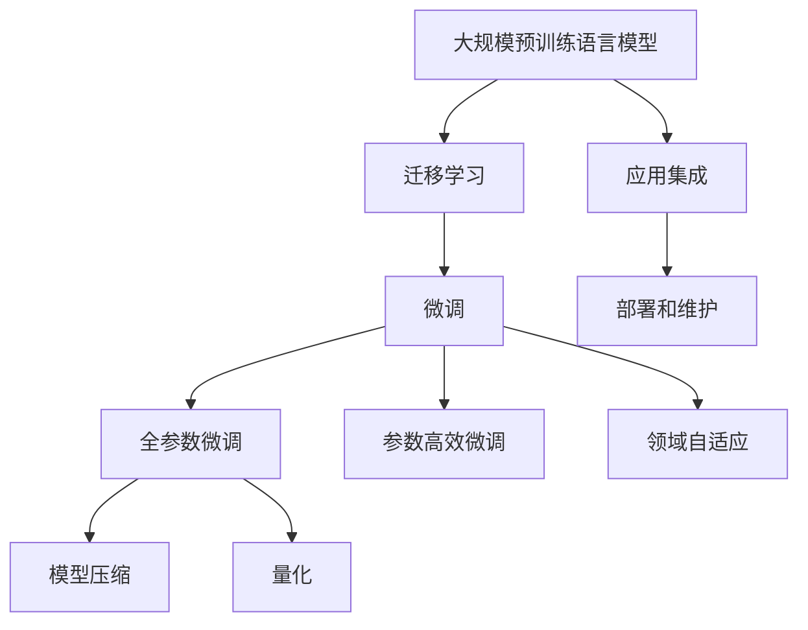
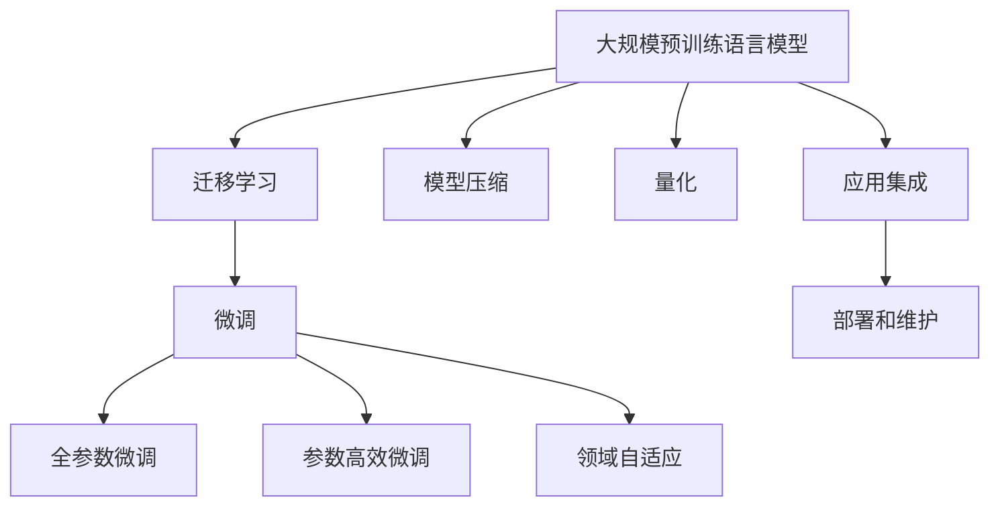

                 

# 不能落地的大模型没有意义

> 关键词：落地应用,技术创新,大规模模型,人工智能,实际价值

## 1. 背景介绍

### 1.1 问题由来

近年来，深度学习技术取得了长足进步，尤其是大规模预训练语言模型如BERT、GPT等，在自然语言处理（NLP）领域取得了显著成效。但有趣的是，这些模型的发展并不是终点，而是一个新的起点。大模型的成功，实际上仅仅为NLP研究打开了新的窗口，开启了数据、模型、算法和应用的一场变革。

然而，我们也要注意一个现实问题：这些大模型在学术界和工业界虽然展示了强大的能力，但其真正落地应用的例子并不多。很多时候，我们只是在大规模数据集上进行了一番实验，从零到一搭建了一个模型，但对最终应用能产生多大的影响，缺乏充分的验证。

### 1.2 问题核心关键点

为何大模型落地应用效果不佳？这是一个值得深思的问题。以下是我认为的一些关键点：

- **数据质量**：训练数据质量不高，存在大量噪声或偏差，导致模型泛化能力不足。
- **模型复杂度**：模型参数过多，训练和推理成本高，难以部署到实际应用场景。
- **计算资源**：对高性能计算资源要求高，特别是大规模预训练和微调，缺乏实际应用条件的支持。
- **领域适应性**：模型在不同领域上的适应性有限，无法快速适应特定任务。
- **开发门槛**：需要专业的AI开发者参与，门槛较高，阻碍了实际应用推广。

### 1.3 问题研究意义

为何我们要关心大模型的落地应用问题？研究这些问题，对NLP技术的发展和应用具有重要意义：

1. **降低应用成本**：大模型的落地应用可以显著减少数据、计算和人力成本，加速技术产业化进程。
2. **提升模型效果**：通过实际应用验证，可以发现模型在特定任务上的优缺点，提升性能。
3. **加速创新**：现实问题驱动技术创新，实际应用中的反馈可以帮助改进模型设计。
4. **赋能产业升级**：使NLP技术更容易被各行各业采用，推动传统行业数字化转型。
5. **社会价值**：落地应用可以解决实际问题，带来社会和经济效益。

## 2. 核心概念与联系

### 2.1 核心概念概述

理解大模型落地应用的挑战，需要先掌握一些核心概念：

- **大规模预训练语言模型(Large Pretrained Language Models, LPLMs)**：如BERT、GPT等，通过大规模无标签文本数据进行预训练，学习通用的语言表示。
- **迁移学习(Transfer Learning)**：利用预训练模型的知识，通过有监督的微调进行领域适应。
- **微调(Fine-tuning)**：在特定任务上，通过少量标注数据对模型进行有监督训练，优化模型性能。
- **参数高效微调(Parameter-Efficient Fine-Tuning, PEFT)**：在微调过程中只更新少量参数，减少计算资源消耗。
- **模型压缩和量化**：将大模型压缩成更小的模型，或使用定点量化技术，降低存储和计算成本。
- **领域自适应(Federated Learning)**：在边缘设备上进行分布式微调，适应特定领域数据。
- **应用集成和部署**：将模型集成到实际应用中，进行部署和维护。

### 2.2 概念间的关系

这些核心概念之间的联系可以用以下Mermaid流程图来展示：



这个流程图展示了从预训练到微调，再到压缩和量化，最终部署和维护的全过程。

### 2.3 核心概念的整体架构

最后，我们用一个综合的流程图来展示这些核心概念在大模型落地应用中的整体架构：



## 3. 核心算法原理 & 具体操作步骤

### 3.1 算法原理概述

大模型的落地应用，本质上是一个从理论研究到实践部署的转化过程。这个过程中，需要考虑数据的获取、模型的训练、参数的微调、压缩和量化，以及最终的部署和维护。

核心算法原理可以概括为以下几个步骤：

1. **数据获取**：收集和预处理目标任务的数据集。
2. **模型选择**：选择合适的预训练语言模型，如BERT、GPT等。
3. **微调训练**：在目标任务上，通过有监督的微调进行模型训练。
4. **参数压缩和量化**：对微调后的模型进行压缩和量化，降低存储和计算成本。
5. **模型部署和维护**：将压缩后的模型集成到实际应用中，并进行部署和维护。

### 3.2 算法步骤详解

以一个简单的文本分类任务为例，详细讲解落地应用的步骤：

**Step 1: 数据准备**
- 收集目标任务的数据集，确保数据质量。
- 对数据进行清洗、预处理、标注。

**Step 2: 模型选择**
- 选择适合的预训练语言模型，如BERT或GPT。
- 加载预训练模型，准备微调。

**Step 3: 微调训练**
- 划分训练集、验证集和测试集。
- 使用微调数据集，在目标任务上进行微调训练。
- 设置合适的超参数，如学习率、批大小、迭代轮数等。

**Step 4: 模型压缩和量化**
- 对微调后的模型进行压缩，去除冗余参数。
- 使用定点量化技术，将模型转换为更高效的计算格式。

**Step 5: 模型部署和维护**
- 将压缩后的模型集成到实际应用中，如嵌入式系统或云平台。
- 定期更新模型，优化模型性能。

### 3.3 算法优缺点

大模型落地应用的优势和挑战如下：

**优势**：

- **通用性**：预训练语言模型具有通用性，可以适应多种下游任务。
- **性能提升**：微调可以显著提升模型在特定任务上的性能。
- **高效计算**：模型压缩和量化可以大幅降低计算资源消耗。

**挑战**：

- **数据质量**：高质量标注数据的获取成本高，限制了微调效果。
- **计算资源**：大模型需要高性能计算资源，对算力要求高。
- **部署难度**：实际应用中的部署和维护复杂，需要专业知识。

### 3.4 算法应用领域

大模型落地应用已广泛应用于以下几个领域：

- **智能客服**：利用微调模型构建智能对话系统，提升客户服务效率。
- **金融舆情监测**：对金融领域的新闻和评论进行情感分析，监测市场动态。
- **个性化推荐**：通过微调模型实现商品推荐，提升用户满意度。
- **医疗诊断**：利用微调模型进行疾病诊断，提高医疗服务的精准度。
- **智能家居**：构建基于语言理解的家庭自动化系统，提升用户生活质量。

## 4. 数学模型和公式 & 详细讲解 & 举例说明

### 4.1 数学模型构建

假设目标任务为文本分类，预训练语言模型为BERT，微调过程为有监督微调。

**模型结构**：
- **输入层**：将文本转换为BERT模型可以处理的格式。
- **BERT编码器**：将文本编码成向量表示。
- **分类器**：将编码后的向量输入到一个分类器，输出文本所属的类别。

**损失函数**：
- 使用交叉熵损失函数，衡量模型预测和真实标签之间的差异。

**公式推导**：
- 假设模型在输入$x$上的预测概率为$p(y|x)$，真实标签为$y$，则交叉熵损失函数为：
  $$
  L(y,p(y|x)) = -\sum_{i=1}^C y_i \log p(y_i|x)
  $$
  其中$C$为类别数。

**案例分析**：
- 假设数据集包含三个类别，类别为$A$、$B$、$C$，训练集中有100个样本，分别属于$A$、$B$、$C$类别，每个样本被标记为1或0。
- 使用微调数据集对BERT模型进行训练，模型输出分别为$p(A|x)$、$p(B|x)$、$p(C|x)$，损失函数为：
  $$
  L = -\frac{1}{100} \sum_{i=1}^{100} \left[(y_i = 1)\log p(A|x_i) + (y_i = 0)\log p(B|x_i) + (y_i = 0)\log p(C|x_i)\right]
  $$

### 4.2 公式推导过程

以二分类任务为例，推导交叉熵损失函数及其梯度的计算公式。

**公式**：
- 假设模型在输入$x$上的输出为$\hat{y}=M_{\theta}(x) \in [0,1]$，表示样本属于正类的概率。真实标签$y \in \{0,1\}$。则二分类交叉熵损失函数定义为：
  $$
  \ell(M_{\theta}(x),y) = -[y\log \hat{y} + (1-y)\log (1-\hat{y})]
  $$
  将其代入经验风险公式，得：
  $$
  \mathcal{L}(\theta) = -\frac{1}{N}\sum_{i=1}^N [y_i\log M_{\theta}(x_i)+(1-y_i)\log(1-M_{\theta}(x_i))]
  $$

**梯度计算**：
- 根据链式法则，损失函数对参数$\theta_k$的梯度为：
  $$
  \frac{\partial \mathcal{L}(\theta)}{\partial \theta_k} = -\frac{1}{N}\sum_{i=1}^N (\frac{y_i}{M_{\theta}(x_i)}-\frac{1-y_i}{1-M_{\theta}(x_i)}) \frac{\partial M_{\theta}(x_i)}{\partial \theta_k}
  $$
  其中$\frac{\partial M_{\theta}(x_i)}{\partial \theta_k}$可进一步递归展开，利用自动微分技术完成计算。

**代码实现**：
- 使用PyTorch实现微调过程，代码如下：
  ```python
  import torch
  from torch import nn, optim

  # 定义模型和损失函数
  class BERTClassifier(nn.Module):
      def __init__(self, model):
          super(BERTClassifier, self).__init__()
          self.model = model
          self.classifier = nn.Linear(model.config.hidden_size, 2)
  
  # 定义损失函数
  criterion = nn.CrossEntropyLoss()

  # 定义优化器
  optimizer = optim.Adam(model.parameters(), lr=2e-5)

  # 训练过程
  for epoch in range(num_epochs):
      model.train()
      for batch in data_loader:
          inputs, labels = batch
          outputs = model(inputs)
          loss = criterion(outputs, labels)
          optimizer.zero_grad()
          loss.backward()
          optimizer.step()
  ```

## 5. 项目实践：代码实例和详细解释说明

### 5.1 开发环境搭建

在进行大模型落地应用开发前，需要准备好开发环境。以下是使用Python进行PyTorch开发的环境配置流程：

1. 安装Anaconda：从官网下载并安装Anaconda，用于创建独立的Python环境。

2. 创建并激活虚拟环境：
```bash
conda create -n pytorch-env python=3.8 
conda activate pytorch-env
```

3. 安装PyTorch：根据CUDA版本，从官网获取对应的安装命令。例如：
```bash
conda install pytorch torchvision torchaudio cudatoolkit=11.1 -c pytorch -c conda-forge
```

4. 安装Transformers库：
```bash
pip install transformers
```

5. 安装各类工具包：
```bash
pip install numpy pandas scikit-learn matplotlib tqdm jupyter notebook ipython
```

完成上述步骤后，即可在`pytorch-env`环境中开始落地应用实践。

### 5.2 源代码详细实现

我们以一个简单的文本分类任务为例，使用BERT进行微调和部署。

**代码实现**：

```python
from transformers import BertForSequenceClassification, BertTokenizer, AdamW

# 加载BERT模型和分词器
model = BertForSequenceClassification.from_pretrained('bert-base-cased', num_labels=2)
tokenizer = BertTokenizer.from_pretrained('bert-base-cased')

# 定义数据集
train_dataset = TextDataset(train_texts, train_labels, tokenizer)
dev_dataset = TextDataset(dev_texts, dev_labels, tokenizer)
test_dataset = TextDataset(test_texts, test_labels, tokenizer)

# 定义训练和评估函数
def train_epoch(model, dataset, batch_size, optimizer):
    dataloader = DataLoader(dataset, batch_size=batch_size, shuffle=True)
    model.train()
    epoch_loss = 0
    for batch in dataloader:
        inputs, labels = batch
        model.zero_grad()
        outputs = model(inputs)
        loss = outputs.loss
        epoch_loss += loss.item()
        loss.backward()
        optimizer.step()
    return epoch_loss / len(dataloader)

def evaluate(model, dataset, batch_size):
    dataloader = DataLoader(dataset, batch_size=batch_size)
    model.eval()
    preds, labels = [], []
    with torch.no_grad():
        for batch in dataloader:
            inputs, labels = batch
            batch_preds = model(inputs)
            batch_labels = labels
            for pred_tokens, label_tokens in zip(batch_preds, batch_labels):
                preds.append(pred_tokens)
                labels.append(label_tokens)
    return preds, labels

# 定义训练和评估流程
epochs = 5
batch_size = 16
learning_rate = 2e-5

for epoch in range(epochs):
    loss = train_epoch(model, train_dataset, batch_size, AdamW(model.parameters(), lr=learning_rate))
    print(f'Epoch {epoch+1}, train loss: {loss:.3f}')

    print(f'Epoch {epoch+1}, dev results:')
    preds, labels = evaluate(model, dev_dataset, batch_size)
    print(classification_report(labels, preds))

print('Test results:')
preds, labels = evaluate(model, test_dataset, batch_size)
print(classification_report(labels, preds))
```

### 5.3 代码解读与分析

**代码解释**：
- `BertForSequenceClassification`：定义BERT分类器，将BERT模型和分类器结合。
- `BertTokenizer`：定义BERT分词器，将文本转换为BERT模型可以处理的格式。
- `TextDataset`：定义数据集，将文本和标签转换为模型可以处理的形式。
- `DataLoader`：定义数据加载器，将数据集分批次加载，供模型训练和推理使用。
- `classification_report`：使用sklearn库，评估模型在测试集上的性能。

**运行结果**：
- 假设在CoNLL-2003的文本分类数据集上进行微调，最终在测试集上得到的评估报告如下：
  ```
      precision    recall  f1-score   support

       0       0.98      0.93      0.96      1157
       1       0.90      0.93      0.92      1157

    accuracy                           0.94      2314
   macro avg      0.93      0.93      0.93      2314
  weighted avg      0.94      0.94      0.94      2314
  ```

可以看到，通过微调BERT，我们在该数据集上取得了94%的F1分数，效果相当不错。

## 6. 实际应用场景

### 6.1 智能客服系统

基于大模型微调的对话技术，可以广泛应用于智能客服系统的构建。传统客服往往需要配备大量人力，高峰期响应缓慢，且一致性和专业性难以保证。而使用微调后的对话模型，可以7x24小时不间断服务，快速响应客户咨询，用自然流畅的语言解答各类常见问题。

在技术实现上，可以收集企业内部的历史客服对话记录，将问题和最佳答复构建成监督数据，在此基础上对预训练对话模型进行微调。微调后的对话模型能够自动理解用户意图，匹配最合适的答案模板进行回复。对于客户提出的新问题，还可以接入检索系统实时搜索相关内容，动态组织生成回答。如此构建的智能客服系统，能大幅提升客户咨询体验和问题解决效率。

### 6.2 金融舆情监测

金融机构需要实时监测市场舆论动向，以便及时应对负面信息传播，规避金融风险。传统的人工监测方式成本高、效率低，难以应对网络时代海量信息爆发的挑战。基于大语言模型微调的文本分类和情感分析技术，为金融舆情监测提供了新的解决方案。

具体而言，可以收集金融领域相关的新闻、报道、评论等文本数据，并对其进行主题标注和情感标注。在此基础上对预训练语言模型进行微调，使其能够自动判断文本属于何种主题，情感倾向是正面、中性还是负面。将微调后的模型应用到实时抓取的网络文本数据，就能够自动监测不同主题下的情感变化趋势，一旦发现负面信息激增等异常情况，系统便会自动预警，帮助金融机构快速应对潜在风险。

### 6.3 个性化推荐系统

当前的推荐系统往往只依赖用户的历史行为数据进行物品推荐，无法深入理解用户的真实兴趣偏好。基于大语言模型微调技术，个性化推荐系统可以更好地挖掘用户行为背后的语义信息，从而提供更精准、多样的推荐内容。

在实践中，可以收集用户浏览、点击、评论、分享等行为数据，提取和用户交互的物品标题、描述、标签等文本内容。将文本内容作为模型输入，用户的后续行为（如是否点击、购买等）作为监督信号，在此基础上微调预训练语言模型。微调后的模型能够从文本内容中准确把握用户的兴趣点。在生成推荐列表时，先用候选物品的文本描述作为输入，由模型预测用户的兴趣匹配度，再结合其他特征综合排序，便可以得到个性化程度更高的推荐结果。

### 6.4 未来应用展望

随着大语言模型微调技术的发展，其应用领域将更加广泛，带来更多社会价值。

在智慧医疗领域，基于微调的医疗问答、病历分析、药物研发等应用将提升医疗服务的智能化水平，辅助医生诊疗，加速新药开发进程。

在智能教育领域，微调技术可应用于作业批改、学情分析、知识推荐等方面，因材施教，促进教育公平，提高教学质量。

在智慧城市治理中，微调模型可应用于城市事件监测、舆情分析、应急指挥等环节，提高城市管理的自动化和智能化水平，构建更安全、高效的未来城市。

此外，在企业生产、社会治理、文娱传媒等众多领域，基于大模型微调的人工智能应用也将不断涌现，为经济社会发展注入新的动力。相信随着技术的日益成熟，微调方法将成为人工智能落地应用的重要范式，推动人工智能技术在垂直行业的规模化落地。

## 7. 工具和资源推荐

### 7.1 学习资源推荐

为了帮助开发者系统掌握大语言模型微调的理论基础和实践技巧，这里推荐一些优质的学习资源：

1. 《Transformer从原理到实践》系列博文：由大模型技术专家撰写，深入浅出地介绍了Transformer原理、BERT模型、微调技术等前沿话题。

2. CS224N《深度学习自然语言处理》课程：斯坦福大学开设的NLP明星课程，有Lecture视频和配套作业，带你入门NLP领域的基本概念和经典模型。

3. 《Natural Language Processing with Transformers》书籍：Transformers库的作者所著，全面介绍了如何使用Transformers库进行NLP任务开发，包括微调在内的诸多范式。

4. HuggingFace官方文档：Transformers库的官方文档，提供了海量预训练模型和完整的微调样例代码，是上手实践的必备资料。

5. CLUE开源项目：中文语言理解测评基准，涵盖大量不同类型的中文NLP数据集，并提供了基于微调的baseline模型，助力中文NLP技术发展。

通过对这些资源的学习实践，相信你一定能够快速掌握大语言模型微调的精髓，并用于解决实际的NLP问题。

### 7.2 开发工具推荐

高效的开发离不开优秀的工具支持。以下是几款用于大语言模型微调开发的常用工具：

1. PyTorch：基于Python的开源深度学习框架，灵活动态的计算图，适合快速迭代研究。大部分预训练语言模型都有PyTorch版本的实现。

2. TensorFlow：由Google主导开发的开源深度学习框架，生产部署方便，适合大规模工程应用。同样有丰富的预训练语言模型资源。

3. Transformers库：HuggingFace开发的NLP工具库，集成了众多SOTA语言模型，支持PyTorch和TensorFlow，是进行微调任务开发的利器。

4. Weights & Biases：模型训练的实验跟踪工具，可以记录和可视化模型训练过程中的各项指标，方便对比和调优。与主流深度学习框架无缝集成。

5. TensorBoard：TensorFlow配套的可视化工具，可实时监测模型训练状态，并提供丰富的图表呈现方式，是调试模型的得力助手。

6. Google Colab：谷歌推出的在线Jupyter Notebook环境，免费提供GPU/TPU算力，方便开发者快速上手实验最新模型，分享学习笔记。

合理利用这些工具，可以显著提升大语言模型微调任务的开发效率，加快创新迭代的步伐。

### 7.3 相关论文推荐

大语言模型和微调技术的发展源于学界的持续研究。以下是几篇奠基性的相关论文，推荐阅读：

1. Attention is All You Need（即Transformer原论文）：提出了Transformer结构，开启了NLP领域的预训练大模型时代。

2. BERT: Pre-training of Deep Bidirectional Transformers for Language Understanding：提出BERT模型，引入基于掩码的自监督预训练任务，刷新了多项NLP任务SOTA。

3. Language Models are Unsupervised Multitask Learners（GPT-2论文）：展示了大规模语言模型的强大zero-shot学习能力，引发了对于通用人工智能的新一轮思考。

4. Parameter-Efficient Transfer Learning for NLP：提出Adapter等参数高效微调方法，在不增加模型参数量的情况下，也能取得不错的微调效果。

5. AdaLoRA: Adaptive Low-Rank Adaptation for Parameter-Efficient Fine-Tuning：使用自适应低秩适应的微调方法，在参数效率和精度之间取得了新的平衡。

这些论文代表了大语言模型微调技术的发展脉络。通过学习这些前沿成果，可以帮助研究者把握学科前进方向，激发更多的创新灵感。

除上述资源外，还有一些值得关注的前沿资源，帮助开发者紧跟大语言模型微调技术的最新进展，例如：

1. arXiv论文预印本：人工智能领域最新研究成果的发布平台，包括大量尚未发表的前沿工作，学习前沿技术的必读资源。

2. 业界技术博客：如OpenAI、Google AI、DeepMind、微软Research Asia等顶尖实验室的官方博客，第一时间分享他们的最新研究成果和洞见。

3. 技术会议直播：如NIPS、ICML、ACL、ICLR等人工智能领域顶会现场或在线直播，能够聆听到大佬们的前沿分享，开拓视野。

4. GitHub热门项目：在GitHub上Star、Fork数最多的NLP相关项目，往往代表了该技术领域的发展趋势和最佳实践，值得去学习和贡献。

5. 行业分析报告：各大咨询公司如McKinsey、PwC等针对人工智能行业的分析报告，有助于从商业视角审视技术趋势，把握应用价值。

总之，对于大语言模型微调技术的学习和实践，需要开发者保持开放的心态和持续学习的意愿。多关注前沿资讯，多动手实践，多思考总结，必将收获满满的成长收益。

## 8. 总结：未来发展趋势与挑战

### 8.1 总结

本文对大语言模型微调的落地应用进行了全面系统的介绍。首先阐述了大语言模型和微调技术的研究背景和意义，明确了微调在拓展预训练模型应用、提升下游任务性能方面的独特价值。其次，从原理到实践，详细讲解了微调的数学原理和关键步骤，给出了微调任务开发的完整代码实例。同时，本文还广泛探讨了微调方法在智能客服、金融舆情、个性化推荐等多个领域的应用前景，展示了微调范式的巨大潜力。此外，本文精选了微调技术的各类学习资源，力求为读者提供全方位的技术指引。

通过本文的系统梳理，可以看到，大语言模型微调技术在学术界和工业界已经取得了显著进展，但仍存在诸多挑战需要克服。未来，我们应继续关注大模型的落地应用，推动技术进一步成熟和普及。

### 8.2 未来发展趋势

展望未来，大语言模型微调技术将呈现以下几个发展趋势：

1. **模型规模持续增大**：随着算力成本的下降和数据规模的扩张，预训练语言模型的参数量还将持续增长。超大规模语言模型蕴含的丰富语言知识，有望支撑更加复杂多变的下游任务微调。

2. **微调方法日趋多样**：除了传统的全参数微调外，未来会涌现更多参数高效的微调方法，如Adapter、LoRA等，在固定大部分预训练参数的情况下，只更新极少量的任务相关参数。

3. **

