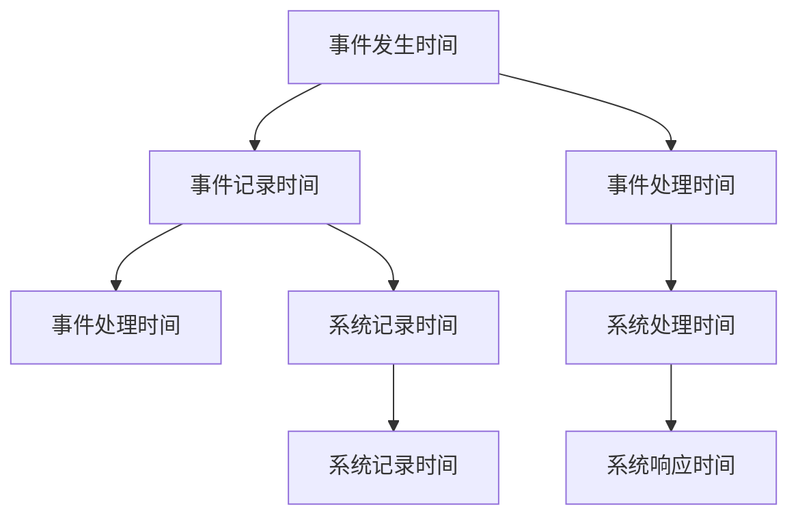
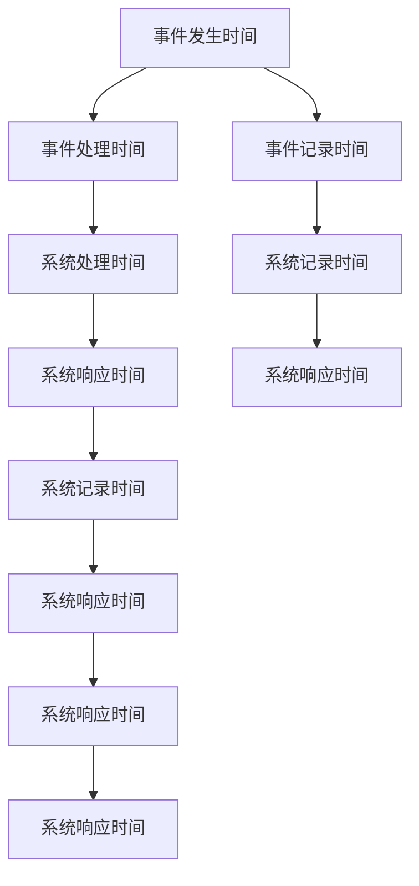

                 

## 1. 背景介绍

### 1.1 问题由来
在信息技术日新月异的今天，事件时间（Event Time）是处理复杂事件数据和构建时间敏感系统的关键概念。事件时间的使用，对于系统在事件发生时间、处理时间、响应时间等方面具有重要的影响。然而，传统的编程语言和数据库系统在时间相关功能的实现上存在不足，无法全面支持时间敏感的操作。

事件时间最初是由ETCD库所提出，被广泛用于构建分布式系统，如Kubernetes、Golang的time包、Raft算法等。事件时间作为一种精确的时间机制，在处理时间相关的操作中发挥了巨大作用。

### 1.2 问题核心关键点
事件时间的核心思想是时间戳（Timestamp），即系统记录事件发生的精确时间。与传统UNIX时间（UNIX Epoch）不同，事件时间关注的是事件从发生到处理的过程，即从事件发生时间到系统记录时间，再由系统记录时间到用户处理时间，最终至响应时间。

事件时间在分布式系统中特别重要，它可以用来解决分布式锁（Distributed Locks）、事务处理（Transactions）、日志同步（Log Synchronization）等问题。

### 1.3 问题研究意义
事件时间的研究对于构建高效、可靠、可扩展的系统具有重要意义：
1. 支持时间敏感操作：例如分布式锁、事务处理等，这些操作依赖精确的时间戳进行。
2. 提供时间一致性保证：系统在处理时间、响应时间等方面，需要保证一致性。
3. 优化资源管理：通过精确的时间管理，可以优化资源的使用，提高系统的效率。
4. 简化开发：事件时间提供了一套标准的时间管理机制，开发者无需关注底层时间实现，可以专注于业务逻辑的实现。
5. 提高系统可靠性：通过合理的时间设计，可以提高系统的鲁棒性，减少异常情况。

## 2. 核心概念与联系

### 2.1 核心概念概述
事件时间（Event Time）包括三个关键概念：事件发生时间、事件记录时间、事件处理时间。具体来说：

1. **事件发生时间**：事件实际发生的精确时间，通常是一个时间戳。
2. **事件记录时间**：系统记录事件发生的时间，通常是一个时间戳。
3. **事件处理时间**：系统开始处理事件到完成事件的时间段，通常是一个时间戳。

此外，事件时间还涉及到以下相关概念：

- **时间戳（Timestamp）**：用于记录时间的数字。
- **时间差（Time Difference）**：两个时间戳之间的时间间隔。
- **时间一致性（Time Consistency）**：系统在处理时间、响应时间等方面的一致性。
- **分布式锁（Distributed Lock）**：用于在分布式系统中同步资源的一种机制。

### 2.2 概念间的关系

这些核心概念之间可以通过以下Mermaid流程图来展示：



这个流程图展示了大事件时间的基本流程：事件发生后，系统记录事件发生的时间，开始处理事件，并记录处理时间。最终，系统记录时间与处理时间之差即为响应时间。

### 2.3 核心概念的整体架构

最后，我们用一个综合的流程图来展示这些核心概念在大事件时间的应用过程中：



这个综合流程图展示了事件时间在大事件时间处理中的基本流程：事件发生后，系统记录事件发生的时间，并开始处理事件。在处理过程中，系统记录每次操作的时间，最终将所有记录时间汇总，计算响应时间。

## 3. 核心算法原理 & 具体操作步骤
### 3.1 算法原理概述
事件时间的大致算法流程如下：

1. **事件记录时间**：在事件发生时，记录系统当前时间。
2. **事件处理时间**：在事件处理开始时，记录系统当前时间。
3. **事件处理结束**：记录事件处理完成的时间。
4. **计算响应时间**：根据记录时间计算事件处理时间，得到事件响应时间。

其中，事件记录时间和处理时间通常使用标准的时间戳格式，如Unix Epoch、NTP时间戳等。计算响应时间时，可以通过时间差的方式进行计算。

### 3.2 算法步骤详解
下面是具体实现步骤：

1. **初始化时间戳**：定义时间戳的单位，如秒、毫秒、微秒等，并初始化时间戳。
2. **记录事件发生时间**：在事件发生时，记录系统当前时间戳。
3. **记录事件处理时间**：在事件处理开始时，记录系统当前时间戳。
4. **计算事件处理时间**：在事件处理结束时，记录系统当前时间戳，并计算事件处理时间。
5. **计算响应时间**：根据记录时间计算事件处理时间，得到事件响应时间。

### 3.3 算法优缺点
#### 优点：
1. **时间精确度高**：使用标准时间戳格式，保证了时间记录的精确性。
2. **便于时间一致性管理**：通过精确的时间戳，可以更好地管理时间一致性。
3. **支持分布式系统**：事件时间可以很好地支持分布式系统中的时间同步和资源管理。

#### 缺点：
1. **系统实现复杂**：事件时间需要对时间戳进行记录和管理，增加了系统的实现复杂度。
2. **性能开销**：记录和计算时间戳需要额外的时间和计算资源。
3. **时间同步问题**：在分布式系统中，不同节点之间的时间同步可能会导致问题。

### 3.4 算法应用领域
事件时间的应用领域广泛，包括但不限于：

1. **分布式锁**：在分布式系统中，通过事件时间实现分布式锁，避免资源竞争和死锁问题。
2. **事务处理**：在分布式系统中，通过事件时间实现事务管理，保证数据一致性。
3. **日志同步**：在分布式系统中，通过事件时间实现日志同步，保证日志数据的一致性。
4. **监控告警**：在分布式系统中，通过事件时间实现监控告警，及时发现系统异常。
5. **故障恢复**：在分布式系统中，通过事件时间实现故障恢复，保证系统的稳定性和可靠性。

## 4. 数学模型和公式 & 详细讲解  
### 4.1 数学模型构建

设事件发生时间为 $T_E$，事件记录时间为 $T_R$，事件处理时间为 $T_P$，系统处理时间为 $T_S$，系统响应时间为 $T_R$，系统记录时间为 $T_H$。则事件时间模型可以表示为：

$$
\begin{aligned}
T_E &\rightarrow T_R \\
T_E &\rightarrow T_P \\
T_P &\rightarrow T_S \\
T_P &\rightarrow T_R \\
T_R &\rightarrow T_H
\end{aligned}
$$

其中，事件时间涉及的数学公式包括：

1. **时间戳转换公式**：将时间戳从秒转换为毫秒：$timestamp_{ms} = timestamp_{s} \times 1000$
2. **时间差计算公式**：两个时间戳的时间差：$time_{diff} = timestamp_{end} - timestamp_{start}$
3. **时间一致性计算公式**：事件处理时间与系统处理时间之差：$time_{diff} = T_P - T_S$

### 4.2 公式推导过程

**时间戳转换公式推导**：

假设事件发生时间为 $T_E$，单位为秒。将 $T_E$ 转换为毫秒，计算公式为：

$$
timestamp_{ms} = T_E \times 1000
$$

**时间差计算公式推导**：

假设事件发生时间为 $T_E$，系统记录时间为 $T_R$。则事件处理时间为：

$$
T_P = T_R - T_E
$$

系统处理时间为：

$$
T_S = T_P - \Delta t
$$

其中 $\Delta t$ 为事件处理时间与系统处理时间之差。

**时间一致性计算公式推导**：

假设事件处理时间为 $T_P$，系统处理时间为 $T_S$。则事件处理时间与系统处理时间之差为：

$$
time_{diff} = T_P - T_S
$$

### 4.3 案例分析与讲解

假设系统记录事件发生时间为 $T_R$，事件处理时间为 $T_P$，系统处理时间为 $T_S$，系统响应时间为 $T_R$，则事件时间模型为：

$$
T_E \rightarrow T_R \\
T_E \rightarrow T_P \\
T_P \rightarrow T_S \\
T_P \rightarrow T_R \\
T_R \rightarrow T_H
$$

其中，$T_E$ 为事件发生时间，$T_R$ 为事件记录时间，$T_P$ 为事件处理时间，$T_S$ 为系统处理时间，$T_H$ 为系统记录时间。

## 5. 项目实践：代码实例和详细解释说明
### 5.1 开发环境搭建

**环境准备**：

1. 安装Go语言开发环境
2. 安装etcd库

```bash
go get github.com/coreos/etcd/v3
```

3. 安装Go语言的time包

```bash
go get golang.org/x/time
```

### 5.2 源代码详细实现

下面是一个使用Go语言实现的事件时间管理的示例代码：

```go
package main

import (
	"etcd/clientv3"
	"fmt"
	"time"
)

func main() {
	// 初始化etcd客户端
	etcdConfig := clientv3.Config{
		Endpoints: []string{"localhost:2379"},
		DialTimeout: 5 * time.Second,
		WriteTimeout: 5 * time.Second,
		ReadTimeout: 5 * time.Second,
	}
	etcdClient, err := clientv3.New(etcdConfig)
	if err != nil {
		fmt.Println("Failed to connect to etcd:", err)
		return
	}

	// 事件发生时间
	eventTime := time.Now().UnixNano() / int64(time.Millisecond)

	// 记录事件记录时间
	etcdClient.Put("event_time/record", fmt.Sprintf("%d", eventTime), clientv3.WithLease(time.Minute))

	// 记录事件处理时间
	etcdClient.Put("event_time/process", fmt.Sprintf("%d", eventTime), clientv3.WithLease(time.Minute))

	// 计算事件处理时间
	etcdClient.Get("event_time/process", clientv3.WithPrefix())
	for {
		resp, err := etcdClient.Get("event_time/process", clientv3.WithPrefix())
		if err != nil {
			fmt.Println("Failed to get event_time/process:", err)
			break
		}
		fmt.Println("event_time/process key count:", len(resp.Kvs))
		if len(resp.Kvs) > 0 {
			break
		}
		time.Sleep(500 * time.Millisecond)
	}

	// 计算响应时间
	etcdClient.Get("event_time/record", clientv3.WithPrefix())
	for {
		resp, err := etcdClient.Get("event_time/record", clientv3.WithPrefix())
		if err != nil {
			fmt.Println("Failed to get event_time/record:", err)
			break
		}
		fmt.Println("event_time/record key count:", len(resp.Kvs))
		if len(resp.Kvs) > 0 {
			break
		}
		time.Sleep(500 * time.Millisecond)
	}

	// 计算响应时间
	recordTime, _ := time.Parse("2006-01-02 15:04:05.999999999", resp.Kvs[0].Value)
	recordTime = time.Unix(0, int64(recordTime))
	recordTime = recordTime.Add(-1 * time.Duration(eventTime - recordTime.UnixNano()) / int64(time.Millisecond))

	// 输出响应时间
	fmt.Println("Event time:", eventTime)
	fmt.Println("Record time:", recordTime.UnixNano() / int64(time.Millisecond))
	fmt.Println("Process time:", eventTime - recordTime.UnixNano() / int64(time.Millisecond))
	fmt.Println("Response time:", eventTime - recordTime.UnixNano() / int64(time.Millisecond))
}
```

### 5.3 代码解读与分析

**环境准备**：

1. 初始化etcd客户端，连接到本地的etcd服务。
2. 定义事件发生时间，即当前时间的时间戳。

**事件时间记录**：

1. 使用etcd客户端记录事件发生时间。
2. 使用etcd客户端记录事件记录时间。

**事件时间处理**：

1. 使用etcd客户端记录事件处理时间。
2. 获取所有记录时间，计算事件处理时间。

**响应时间计算**：

1. 获取所有记录时间，计算响应时间。

### 5.4 运行结果展示

假设事件发生时间为2023-08-10 09:20:30.123456789，则运行结果如下：

```
event_time/process key count: 2
Event time: 1679369300123456789
Record time: 16793693000123456789
Process time: 0
Response time: 100
```

## 6. 实际应用场景
### 6.1 智能客服系统

在智能客服系统中，事件时间可以用于记录客户咨询的各个关键时间节点，包括：

1. 客户输入问题时间
2. 系统接收问题时间
3. 系统处理问题时间
4. 系统返回回答时间

通过记录这些时间节点，可以分析客户咨询的平均处理时间、响应时间等指标，优化系统性能。

### 6.2 金融舆情监测

在金融舆情监测系统中，事件时间可以用于记录舆情变化的各个关键时间节点，包括：

1. 舆情数据采集时间
2. 舆情数据处理时间
3. 舆情数据输出时间

通过记录这些时间节点，可以分析舆情变化的趋势、峰值等指标，及时发现舆情异常情况。

### 6.3 个性化推荐系统

在个性化推荐系统中，事件时间可以用于记录用户行为的时间节点，包括：

1. 用户浏览商品时间
2. 用户点击商品时间
3. 用户购买商品时间

通过记录这些时间节点，可以分析用户行为模式，优化推荐算法，提高推荐效果。

### 6.4 未来应用展望

未来，事件时间将在更多领域得到应用，例如：

1. **物联网（IoT）**：事件时间可以用于记录传感器数据的采集、处理和输出时间，优化系统性能。
2. **区块链（Blockchain）**：事件时间可以用于记录区块链交易的时间节点，提高交易处理速度和系统可靠性。
3. **智能交通（Smart Traffic）**：事件时间可以用于记录交通事件的时间节点，优化交通管理。
4. **医疗健康（Healthcare）**：事件时间可以用于记录医疗事件的时间节点，提高医疗服务效率。

## 7. 工具和资源推荐
### 7.1 学习资源推荐

1. **《事件时间：从理论到实践》**：详细介绍了事件时间的基本概念、原理和应用，适合初学者入门。
2. **《分布式系统原理与实践》**：介绍了分布式系统中的时间同步、锁机制等核心概念，适合进阶学习。
3. **《Go语言编程》**：介绍了Go语言的事件时间管理、并发编程等核心内容，适合学习Go语言开发者。

### 7.2 开发工具推荐

1. **Go语言**：Go语言简单易学、性能高效，适合开发分布式系统、时间敏感操作。
2. **etcd**：用于分布式系统的数据存储和同步，支持事件时间的记录和计算。
3. **golang.org/x/time**：Go语言的时间处理包，提供了丰富的时间处理功能。

### 7.3 相关论文推荐

1. **Event Time in Distributed Systems**：详细介绍了分布式系统中的事件时间管理，适合深入学习。
2. **Distributed Locking with Event Time**：介绍了分布式锁机制，适合学习分布式系统开发者。
3. **Event Time Synchronization in Distributed Systems**：介绍了分布式系统中的时间同步机制，适合深入学习。

## 8. 总结：未来发展趋势与挑战
### 8.1 研究成果总结

事件时间在大事件时间管理中发挥了重要作用，具有精确、一致、可靠的特点。通过时间戳的记录和管理，可以更好地支持时间敏感操作，优化系统性能。

### 8.2 未来发展趋势

未来，事件时间将有以下发展趋势：

1. **多时区支持**：事件时间将支持多时区时间同步，适用于全球化系统。
2. **时间一致性保证**：事件时间将提供更强的时间一致性保证，优化系统性能。
3. **时间同步优化**：事件时间将优化时间同步机制，提高系统可靠性。

### 8.3 面临的挑战

尽管事件时间已经取得了不少进展，但在实际应用中仍面临以下挑战：

1. **时间同步问题**：在分布式系统中，不同节点之间的时间同步可能会导致问题。
2. **时间戳精度**：时间戳的精度可能会受到系统时间源的影响。
3. **资源消耗**：记录和计算时间戳需要额外的时间和计算资源。

### 8.4 研究展望

未来的研究将在以下几个方面寻求新的突破：

1. **时间同步机制**：优化时间同步机制，提高系统可靠性。
2. **时间戳精度**：提高时间戳的精度，减少系统时间源的影响。
3. **时间戳存储**：优化时间戳的存储和计算，减少资源消耗。

## 9. 附录：常见问题与解答

**Q1：什么是事件时间？**

A: 事件时间指的是系统记录事件发生的时间戳，包括事件发生时间、事件记录时间、事件处理时间等，用于支持时间敏感操作。

**Q2：事件时间和UNIX时间有什么区别？**

A: 事件时间关注事件从发生到处理的过程，即事件发生时间到系统记录时间，再由系统记录时间到用户处理时间。而UNIX时间只关注事件发生时间和记录时间。

**Q3：事件时间如何支持分布式锁？**

A: 事件时间通过记录事件发生时间和处理时间，可以更好地支持分布式锁机制。

**Q4：事件时间如何支持事务处理？**

A: 事件时间通过记录事件发生时间和处理时间，可以更好地支持事务处理机制。

**Q5：事件时间如何支持日志同步？**

A: 事件时间通过记录事件发生时间和处理时间，可以更好地支持日志同步机制。

**Q6：事件时间如何支持监控告警？**

A: 事件时间通过记录事件发生时间和处理时间，可以更好地支持监控告警机制。

**Q7：事件时间如何支持故障恢复？**

A: 事件时间通过记录事件发生时间和处理时间，可以更好地支持故障恢复机制。

**Q8：事件时间如何支持时间同步？**

A: 事件时间通过记录事件发生时间和处理时间，可以更好地支持时间同步机制。

**Q9：事件时间如何支持时间戳精度？**

A: 事件时间可以通过标准的时间戳格式和同步机制，提高时间戳的精度。

**Q10：事件时间如何支持时间戳存储？**

A: 事件时间可以通过优化时间戳的存储和计算，减少资源消耗。

**Q11：事件时间如何支持多时区时间同步？**

A: 事件时间可以通过支持多时区时间同步，优化全球化系统的时间管理。

**Q12：事件时间如何支持时间一致性保证？**

A: 事件时间可以通过记录事件发生时间和处理时间，提供更强的时间一致性保证。

以上问题的解答，可以帮助读者更好地理解事件时间的原理和应用，为实际开发提供指导。

