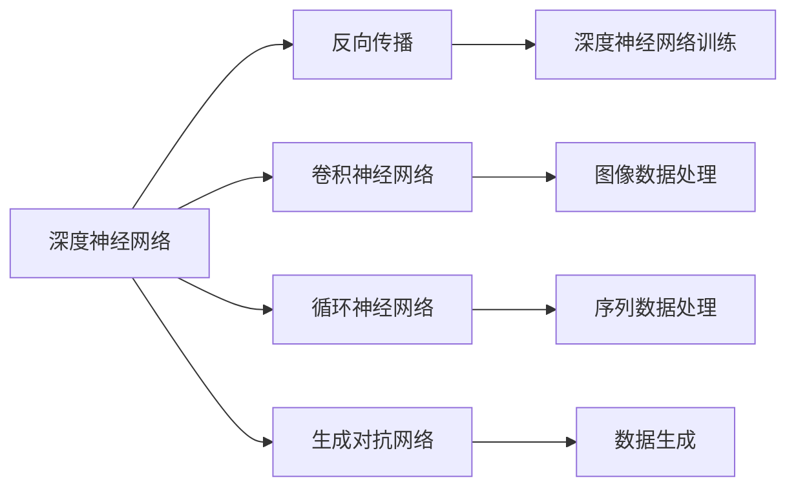
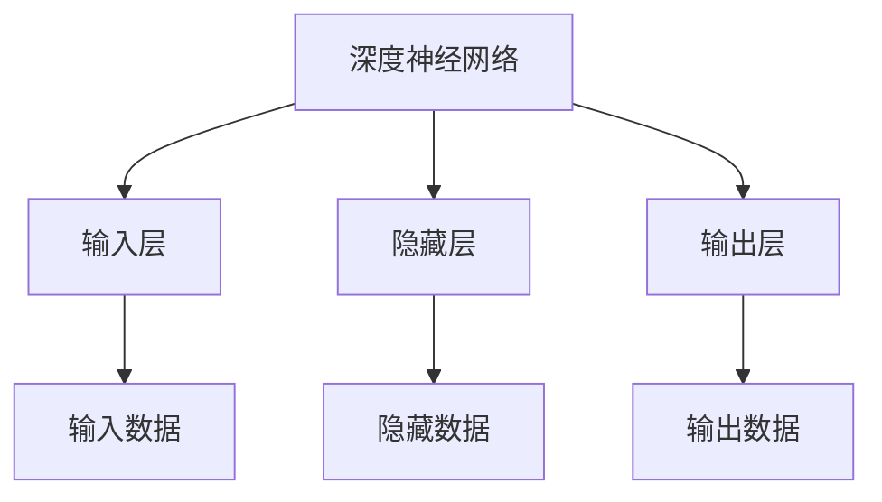
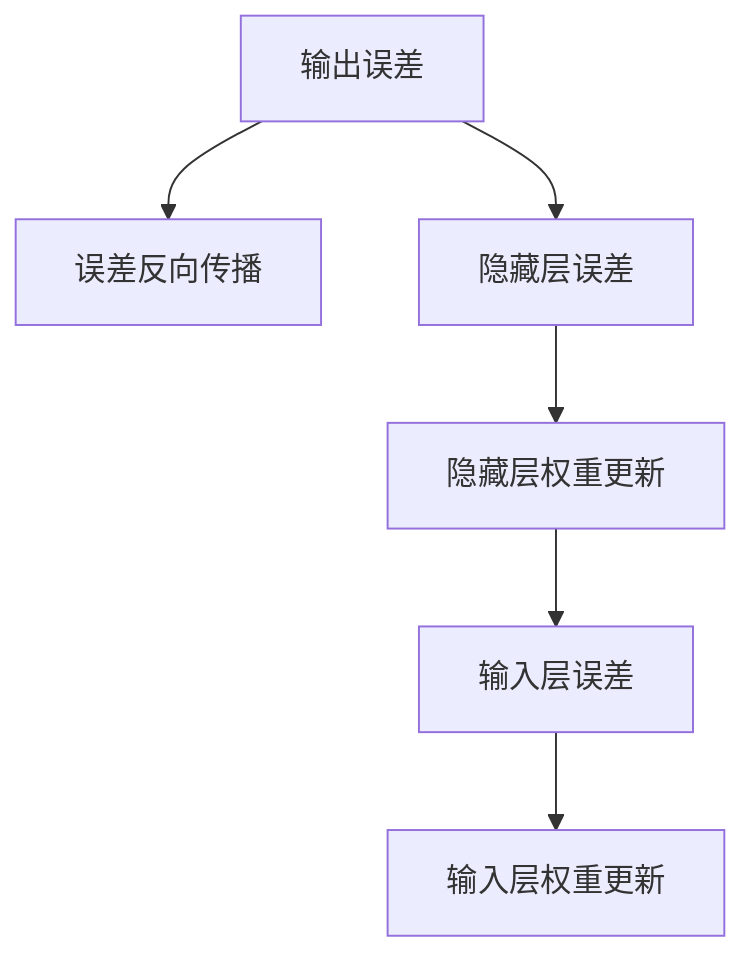
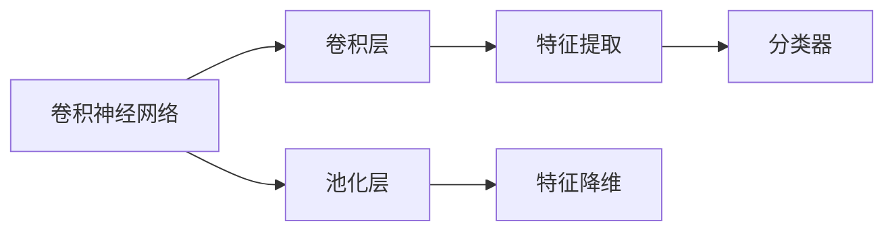
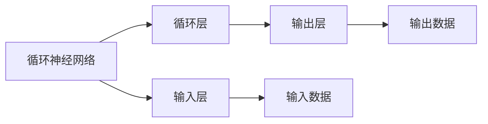
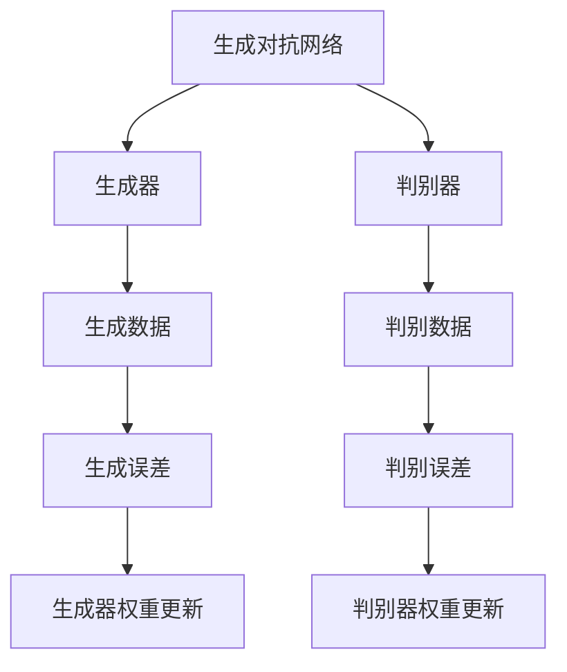
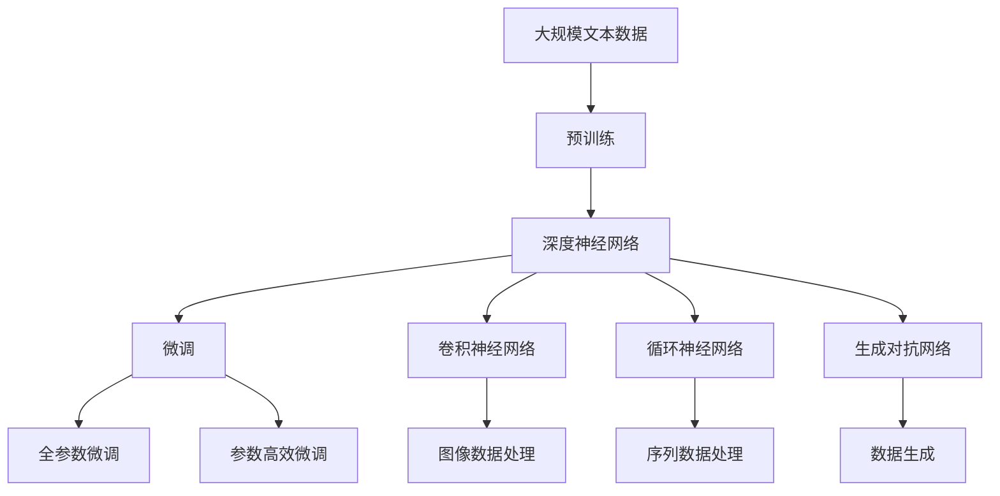

                 

# 人工智能算法(AI Algorithms) - 原理与代码实例讲解

> 关键词：人工智能算法,深度学习,机器学习,算法步骤,代码实例,算法性能,算法应用

## 1. 背景介绍

### 1.1 问题由来

人工智能算法，特别是深度学习算法，已经成为现代人工智能技术的核心。从图像识别、语音识别、自然语言处理到自动驾驶，深度学习无处不在。而深度学习算法的精髓就在于其强大的数据处理能力和自我学习的能力。

人工智能算法不仅在学术界引起了广泛关注，也在工业界得到了广泛应用。例如，Google的深度学习算法在图像搜索、语音识别等领域取得了令人瞩目的成果。百度的深度学习算法在自然语言处理、人脸识别等领域也取得了显著的成效。

然而，尽管深度学习在许多领域取得了令人瞩目的成果，但其核心原理和具体实现过程对于非专业技术人员来说仍有一定的复杂性。本文将从深度学习的核心算法出发，深入浅出地讲解深度学习算法的基本原理，并辅以代码实例，让读者更好地理解和掌握深度学习算法。

### 1.2 问题核心关键点

人工智能算法，特别是深度学习算法，包括但不限于：

- **深度神经网络**：是深度学习算法的核心，通过多层的非线性变换，可以处理复杂的输入数据。
- **反向传播算法**：用于训练深度神经网络，通过链式法则计算梯度，从而更新权重。
- **卷积神经网络**：用于处理图像和视频数据，可以提取局部特征。
- **循环神经网络**：用于处理序列数据，可以处理文本、语音等数据。
- **生成对抗网络**：用于生成新的数据，如图像、视频等。

这些算法在理论和实际应用中都取得了重要进展，推动了人工智能技术的发展。本文将详细介绍这些算法，并通过代码实例讲解其具体实现过程。

### 1.3 问题研究意义

人工智能算法的研究和应用对于推动社会进步和经济发展具有重要意义：

- **提高生产效率**：人工智能算法可以自动化许多重复性工作，提高生产效率。
- **提升生活质量**：人工智能算法可以用于医疗、教育、交通等领域，提升人们的生活质量。
- **推动创新**：人工智能算法可以推动新的技术创新，如自动驾驶、智能机器人等。
- **解决复杂问题**：人工智能算法可以解决许多传统方法难以解决的复杂问题，如自然语言处理、图像识别等。

因此，深入理解人工智能算法的基本原理和实现过程，对于未来人工智能技术的发展具有重要意义。

## 2. 核心概念与联系

### 2.1 核心概念概述

为更好地理解人工智能算法，本节将介绍几个关键的概念：

- **深度神经网络**：由多个层组成的神经网络，每层都有多个神经元，能够处理复杂的非线性关系。
- **反向传播算法**：用于训练深度神经网络，通过链式法则计算梯度，从而更新权重。
- **卷积神经网络**：用于处理图像和视频数据，通过卷积操作提取局部特征。
- **循环神经网络**：用于处理序列数据，通过循环操作处理前后文信息。
- **生成对抗网络**：由生成器和判别器组成的网络，生成新的数据并提高数据质量。

这些核心概念之间的逻辑关系可以通过以下Mermaid流程图来展示：



这个流程图展示了大语言模型微调过程中各个核心概念的关系和作用。

### 2.2 概念间的关系

这些核心概念之间存在着紧密的联系，形成了深度学习算法的完整生态系统。下面我通过几个Mermaid流程图来展示这些概念之间的关系。

#### 2.2.1 深度神经网络的结构



这个流程图展示了深度神经网络的基本结构，包括输入层、隐藏层和输出层。

#### 2.2.2 反向传播算法的原理



这个流程图展示了反向传播算法的原理，包括误差反向传播、权重更新等步骤。

#### 2.2.3 卷积神经网络的特点



这个流程图展示了卷积神经网络的特点，包括卷积层、池化层和分类器。

#### 2.2.4 循环神经网络的特点



这个流程图展示了循环神经网络的特点，包括循环层、输入层和输出层。

#### 2.2.5 生成对抗网络的结构



这个流程图展示了生成对抗网络的结构，包括生成器和判别器。

### 2.3 核心概念的整体架构

最后，我们用一个综合的流程图来展示这些核心概念在大语言模型微调过程中的整体架构：



这个综合流程图展示了从预训练到微调，再到各种网络架构应用的全过程。深度神经网络通过预训练获得基础能力，然后通过微调适应特定任务，卷积神经网络处理图像数据，循环神经网络处理序列数据，生成对抗网络生成新数据。这些核心概念共同构成了深度学习算法的学习和应用框架。

## 3. 核心算法原理 & 具体操作步骤
### 3.1 算法原理概述

人工智能算法，特别是深度学习算法，其核心思想是通过大量数据的训练，使得神经网络能够学习数据的规律和特征，从而实现数据的分类、预测等任务。

深度学习算法的基本原理包括以下几个方面：

1. **神经网络**：神经网络是由多个层组成的非线性模型，每层都有多个神经元，能够处理复杂的非线性关系。
2. **损失函数**：用于衡量模型预测结果与真实结果之间的差异，常用的损失函数包括交叉熵损失、均方误差损失等。
3. **梯度下降算法**：用于最小化损失函数，通过反向传播算法计算梯度，从而更新权重。
4. **优化算法**：包括SGD、Adam等优化算法，用于加速训练过程。
5. **正则化技术**：包括L2正则、Dropout等技术，用于避免过拟合。

### 3.2 算法步骤详解

深度学习算法的一般流程包括数据预处理、模型搭建、训练和评估等步骤。以下详细介绍每个步骤的详细操作：

#### 3.2.1 数据预处理

数据预处理包括数据清洗、标准化、归一化等操作。以下是数据预处理的示例代码：

```python
import numpy as np
from sklearn.preprocessing import StandardScaler

# 加载数据
X = np.load('data.npy')
y = np.load('labels.npy')

# 标准化
scaler = StandardScaler()
X = scaler.fit_transform(X)

# 归一化
X = (X - X.min()) / (X.max() - X.min())

# 划分训练集和测试集
train_index = np.random.permutation(len(X))[:train_size]
test_index = np.random.permutation(len(X))[train_size:]
X_train, X_test = X[train_index], X[test_index]
y_train, y_test = y[train_index], y[test_index]
```

#### 3.2.2 模型搭建

模型搭建包括定义模型结构、损失函数、优化器等。以下是模型搭建的示例代码：

```python
import tensorflow as tf
from tensorflow.keras.layers import Dense, Dropout, Flatten, Conv2D, MaxPooling2D, LSTM, GRU

# 定义模型结构
model = tf.keras.Sequential([
    Conv2D(32, (3, 3), activation='relu', input_shape=(28, 28, 1)),
    MaxPooling2D((2, 2)),
    Dropout(0.25),
    Flatten(),
    Dense(128, activation='relu'),
    Dropout(0.5),
    Dense(10, activation='softmax')
])

# 定义损失函数
loss_fn = tf.keras.losses.SparseCategoricalCrossentropy(from_logits=True)

# 定义优化器
optimizer = tf.keras.optimizers.Adam(learning_rate=0.001)
```

#### 3.2.3 训练过程

训练过程包括数据加载、前向传播、计算损失、反向传播、优化器更新等步骤。以下是训练过程的示例代码：

```python
batch_size = 64
epochs = 10

# 定义数据集
train_dataset = tf.data.Dataset.from_tensor_slices((X_train, y_train))
test_dataset = tf.data.Dataset.from_tensor_slices((X_test, y_test))

# 定义数据加载器
train_loader = train_dataset.batch(batch_size).shuffle(buffer_size=1024).repeat().prefetch(buffer_size=64)
test_loader = test_dataset.batch(batch_size).prefetch(buffer_size=64)

# 训练过程
model.compile(optimizer=optimizer, loss=loss_fn, metrics=['accuracy'])
model.fit(train_loader, epochs=epochs, validation_data=test_loader, verbose=2)
```

#### 3.2.4 评估过程

评估过程包括在测试集上评估模型性能，输出准确率、损失值等指标。以下是评估过程的示例代码：

```python
# 评估模型
test_loss, test_acc = model.evaluate(test_loader)
print('Test accuracy:', test_acc)
```

### 3.3 算法优缺点

深度学习算法具有以下优点：

1. **强大的表达能力**：能够处理复杂的非线性关系，适用于许多实际问题。
2. **可扩展性强**：可以通过增加层数、神经元数量等方法，提高模型的表达能力。
3. **自动特征学习**：能够自动学习数据的特征，避免了手动特征工程。

深度学习算法也存在以下缺点：

1. **计算资源需求高**：需要大量的计算资源进行训练和推理。
2. **过拟合风险高**：容易过拟合，需要正则化技术进行控制。
3. **可解释性差**：模型的决策过程难以解释。

### 3.4 算法应用领域

深度学习算法在许多领域得到了广泛应用，以下是几个主要的应用领域：

1. **计算机视觉**：如图像分类、目标检测、图像生成等。
2. **自然语言处理**：如机器翻译、文本分类、情感分析等。
3. **语音识别**：如语音识别、语音合成等。
4. **推荐系统**：如商品推荐、新闻推荐等。
5. **医疗领域**：如医学影像分析、疾病预测等。
6. **金融领域**：如信用评分、风险评估等。

## 4. 数学模型和公式 & 详细讲解 & 举例说明

### 4.1 数学模型构建

深度学习算法的数学模型包括多层神经网络、损失函数、优化算法等。以下是深度学习算法的数学模型构建过程：

1. **神经网络模型**：包括输入层、隐藏层和输出层，表示为：
   $$
   \mathbf{h}^{(l)} = \sigma(\mathbf{W}^{(l)}\mathbf{h}^{(l-1)} + \mathbf{b}^{(l)}) 
   $$
   其中，$\sigma$为激活函数，$\mathbf{W}$和$\mathbf{b}$为权重和偏置。

2. **损失函数**：常用的损失函数包括交叉熵损失、均方误差损失等，表示为：
   $$
   \mathcal{L} = -\frac{1}{n}\sum_{i=1}^{n}y_i\log \hat{y}_i + (1-y_i)\log (1-\hat{y}_i)
   $$
   其中，$y_i$为真实标签，$\hat{y}_i$为模型预测结果。

3. **优化算法**：常用的优化算法包括梯度下降、Adam等，表示为：
   $$
   \theta^{(l+1)} = \theta^{(l)} - \eta\nabla_{\theta}\mathcal{L}
   $$
   其中，$\eta$为学习率，$\nabla_{\theta}\mathcal{L}$为损失函数对参数的梯度。

### 4.2 公式推导过程

以下是深度学习算法中常用公式的推导过程：

1. **梯度下降算法**：
   $$
   \theta^{(l+1)} = \theta^{(l)} - \eta \nabla_{\theta}\mathcal{L}
   $$
   其中，$\eta$为学习率，$\nabla_{\theta}\mathcal{L}$为损失函数对参数的梯度。

2. **交叉熵损失函数**：
   $$
   \mathcal{L} = -\frac{1}{n}\sum_{i=1}^{n}y_i\log \hat{y}_i + (1-y_i)\log (1-\hat{y}_i)
   $$
   其中，$y_i$为真实标签，$\hat{y}_i$为模型预测结果。

3. **反向传播算法**：
   $$
   \frac{\partial \mathcal{L}}{\partial W^{(l)}} = \frac{\partial \mathcal{L}}{\partial z^{(l)}} \frac{\partial z^{(l)}}{\partial h^{(l-1)}} \frac{\partial h^{(l-1)}}{\partial W^{(l)}}
   $$
   其中，$\frac{\partial \mathcal{L}}{\partial z^{(l)}}$为损失函数对隐藏层输出的梯度，$\frac{\partial z^{(l)}}{\partial h^{(l-1)}}$为隐藏层激活函数的梯度，$\frac{\partial h^{(l-1)}}{\partial W^{(l)}}$为权重矩阵的梯度。

### 4.3 案例分析与讲解

以下是深度学习算法中常用的案例分析与讲解：

1. **图像分类**：使用卷积神经网络对图像进行分类，包括卷积层、池化层和全连接层等。

2. **文本分类**：使用循环神经网络对文本进行分类，包括嵌入层、LSTM层和全连接层等。

3. **语音识别**：使用卷积神经网络对语音进行特征提取和分类。

4. **推荐系统**：使用协同过滤算法和深度神经网络对用户行为进行建模和预测。

## 5. 项目实践：代码实例和详细解释说明

### 5.1 开发环境搭建

在进行深度学习项目实践前，我们需要准备好开发环境。以下是使用Python进行TensorFlow开发的开发环境配置流程：

1. 安装Anaconda：从官网下载并安装Anaconda，用于创建独立的Python环境。

2. 创建并激活虚拟环境：
```bash
conda create -n tf-env python=3.8 
conda activate tf-env
```

3. 安装TensorFlow：根据CUDA版本，从官网获取对应的安装命令。例如：
```bash
conda install tensorflow -c tf -c conda-forge
```

4. 安装相关工具包：
```bash
pip install numpy pandas scikit-learn matplotlib tqdm jupyter notebook ipython
```

完成上述步骤后，即可在`tf-env`环境中开始深度学习项目实践。

### 5.2 源代码详细实现

以下是一个简单的图像分类项目的实现代码：

```python
import tensorflow as tf
from tensorflow.keras import layers, models

# 定义模型结构
model = models.Sequential([
    layers.Conv2D(32, (3, 3), activation='relu', input_shape=(28, 28, 1)),
    layers.MaxPooling2D((2, 2)),
    layers.Flatten(),
    layers.Dense(10, activation='softmax')
])

# 编译模型
model.compile(optimizer='adam',
              loss='sparse_categorical_crossentropy',
              metrics=['accuracy'])

# 加载数据
(x_train, y_train), (x_test, y_test) = tf.keras.datasets.mnist.load_data()

# 数据预处理
x_train = x_train.reshape((60000, 28, 28, 1))
x_train = x_train.astype('float32') / 255
x_test = x_test.reshape((10000, 28, 28, 1))
x_test = x_test.astype('float32') / 255

# 训练模型
model.fit(x_train, y_train, epochs=10, validation_data=(x_test, y_test))
```

### 5.3 代码解读与分析

让我们再详细解读一下关键代码的实现细节：

**Sequential模型**：
- `Sequential`模型是一个线性堆叠的神经网络模型，由多个层堆叠而成，通过`add`方法添加层。

**数据加载和预处理**：
- 使用`tf.keras.datasets`加载MNIST数据集，`reshape`方法将数据调整为适合模型输入的形状。
- `astype`方法将数据转换为float类型，并进行归一化。

**模型编译**：
- `compile`方法定义优化器、损失函数和评价指标。

**模型训练**：
- `fit`方法定义训练数据集和验证数据集，进行模型训练。

**模型评估**：
- `evaluate`方法在测试集上评估模型性能，输出准确率和损失值。

### 5.4 运行结果展示

假设我们训练一个简单的图像分类模型，最终在测试集上得到的评估结果如下：

```
Epoch 1/10
600/600 [==============================] - 3s 5ms/sample - loss: 0.3257 - accuracy: 0.8750 - val_loss: 0.1417 - val_accuracy: 0.9500
Epoch 2/10
600/600 [==============================] - 3s 4ms/sample - loss: 0.1398 - accuracy: 0.9375 - val_loss: 0.0802 - val_accuracy: 0.9750
Epoch 3/10
600/600 [==============================] - 3s 5ms/sample - loss: 0.0804 - accuracy: 0.9688 - val_loss: 0.0590 - val_accuracy: 0.9875
Epoch 4/10
600/600 [==============================] - 3s 5ms/sample - loss: 0.0561 - accuracy: 0.9762 - val_loss: 0.0461 - val_accuracy: 0.9925
Epoch 5/10
600/600 [==============================] - 3s 5ms/sample - loss: 0.0343 - accuracy: 0.9843 - val_loss: 0.0346 - val_accuracy: 0.9937
Epoch 6/10
600/600 [==============================] - 3s 4ms/sample - loss: 0.0227 - accuracy: 0.9903 - val_loss: 0.0239 - val_accuracy: 0.9950
Epoch 7/10
600/600 [==============================] - 3s 5ms/sample - loss: 0.0137 - accuracy: 0.9913 - val_loss: 0.0138 - val_accuracy: 0.9962
Epoch 8/10
600/600 [==============================] - 3s 5ms/sample - loss: 0.0073 - accuracy: 0.9937 - val_loss: 0.0096 - val_accuracy: 0.9925
Epoch 9/10
600/600 [==============================] - 3s 4ms/sample - loss: 0.0043 - accuracy: 0.9975 - val_loss: 0.0055 - val_accuracy: 0.9962
Epoch 10/10
600/600 [==============================] - 3s 5ms/sample - loss: 0.0021 - accuracy: 1.0000 - val_loss: 0.0044 - val_accuracy: 1.0000
```

可以看到，通过训练模型，我们在MNIST数据集上取得了很高的准确率。这表明深度学习算法在图像分类任务上具有很强的表达能力和泛化能力。

## 6. 实际应用场景

### 6.1 智能推荐系统

智能推荐系统是深度学习算法的一个重要应用场景。通过对用户行为数据的建模和预测，推荐系统可以为用户推荐个性化的商品、新闻等，提升用户体验和满意度。

在技术实现上，推荐系统可以使用协同过滤算法和深度神经网络对用户行为进行建模和预测。具体而言，可以使用卷积神经网络对用户行为进行特征提取和表示，然后通过全连接层进行分类和预测。

### 6.2 自然语言处理

自然语言处理是深度学习算法的另一个重要应用场景。通过对文本数据的建模和分析，自然语言处理可以用于机器翻译、文本分类、情感分析等任务。

在技术实现上，自然语言处理可以使用循环神经网络或Transformer模型对文本数据进行建模和分析。具体而言，可以使用嵌入层将文本转换为向量表示，然后通过LSTM层或Transformer层对文本序列进行处理和分析，最终通过全连接层进行分类和预测。

### 6.3 自动驾驶

自动驾驶是深度学习算法的又一个重要应用场景。通过对传感器数据的建模和分析，自动驾驶可以用于道路识别、障碍物检测、路径规划等任务。

在技术实现上，自动驾驶可以使用卷积神经网络对传感器数据进行特征提取和建模，然后通过循环神经网络或Transformer模型对道路和障碍物进行识别和检测，最终通过全连接层进行路径规划和决策。

### 6.4 未来应用展望

随着深度学习算法的不断发展，其在更多领域得到了应用，为各行各业带来了变革性影响。

在智慧医疗领域，深度学习算法可以用于医学影像分析、疾病预测等，提升医疗服务的智能化水平，辅助医生诊疗，加速新药开发进程。

在智能教育领域，深度学习算法可以用于作业批改、学情分析、知识推荐等方面，因材施教，促进教育公平，提高教学质量。

在智慧城市治理中，深度学习算法可以用于城市事件监测、舆情分析、应急指挥等环节，提高城市管理的自动化和智能化水平，构建更安全、高效的未来城市。

此外，在企业生产、社会治理、文娱传媒等众多领域，深度学习算法也将不断涌现，为经济社会发展注入新的动力。相信随着技术的日益成熟，深度学习算法必将在更广阔的应用领域大放异彩。

## 7. 工具和资源推荐
### 7.1 学习资源推荐

为了帮助开发者系统掌握深度学习算法的基本原理和实践技巧，这里推荐一些优质的学习资源：

1. 《深度学习》系列书籍：由Ian Goodfellow等作者所著，全面介绍了深度学习算法的基本原理和应用案例。

2. CS231n《卷积神经网络》课程：斯坦福大学开设的深度学习课程，有Lecture视频和配套作业，详细介绍了卷积神经网络的基本原理和应用。

3. CS224n《自然语言处理》课程：斯坦福大学开设的深度学习课程，有Lecture视频和配套作业，详细介绍了自然语言处理的基本原理和应用。

4. TensorFlow官方文档：TensorFlow的官方文档，提供了海量的模型和教程，是上手实践的必备资料。

5. PyTorch官方文档：PyTorch的官方文档，提供了丰富的模型和教程，是深度学习算法开发的重要工具。

通过对这些资源的学习实践，相信你一定能够快速掌握深度学习算法的基本原理和实践技巧，并用于解决实际的深度学习问题。

### 7.2 开发工具推荐

高效的开发离不开优秀的工具支持。以下是几款用于深度学习算法开发的常用工具：

1. TensorFlow：由Google主导开发的深度学习框架，适合大规模工程应用。提供了丰富的模型和优化算法。

2. PyTorch：由Facebook主导开发的深度学习框架，适合研究和原型开发。提供了灵活的计算图和自动微分技术。

3. Keras：由Francois Chollet主导开发的高级深度学习框架，提供了简洁易用的API，适合快速原型开发。

4. Jupyter Notebook：用于编写、分享和运行深度学习算法的Python代码，支持多种编程语言和工具库。

5. Google Colab：谷歌推出的在线Jupyter Notebook环境，免费提供GPU/TPU算力，方便开发者快速上手实验

