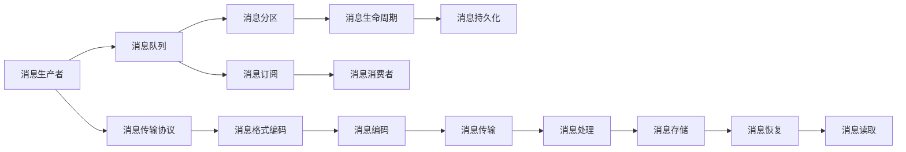

                 

# Pulsar Producer原理与代码实例讲解

> 关键词：Pulsar, 分布式消息队列, 数据流, 生产者, Kafka, 流式计算, 数据传输, 分布式系统

## 1. 背景介绍

### 1.1 问题由来
在当今大数据时代，数据的采集、存储、处理和分析成为企业数字化转型和业务创新的关键环节。分布式消息队列（Distributed Message Queue, DMQ）作为数据流系统的重要组成部分，通过异步数据传输和负载均衡机制，保障了系统的可靠性和可扩展性。常见的分布式消息队列系统包括Apache Kafka和Apache Pulsar等。

### 1.2 问题核心关键点
Pulsar是一个开源的分布式消息队列，由Apache软件基金会（ASF）维护。它基于Apache Kafka的设计理念和技术基础，旨在解决传统消息队列在高并发、低延迟和大数据量处理场景下的性能瓶颈问题。Pulsar通过分布式存储、多租户和云原生架构，支持海量数据的稳定存储、实时处理和弹性扩展。

PulsarProducer是Pulsar中的一个核心组件，负责将数据从应用程序发送到消息队列中。本文将重点介绍PulsarProducer的工作原理、核心算法及其具体实现，并结合实际代码实例，讲解如何使用PulsarProducer进行数据生产。

## 2. 核心概念与联系

### 2.1 核心概念概述

为更好地理解PulsarProducer，我们先介绍几个关键概念：

- **分布式消息队列(Distributed Message Queue, DMQ)**：通过在分布式环境下存储和管理消息，实现数据的可靠传输和高效处理。常见的DMQ系统包括Apache Kafka、Apache Pulsar、RabbitMQ等。

- **消息生产者(Producer)**：负责将数据从应用程序发送到消息队列中。在Pulsar中，消息生产者通过PulsarProducer实现。

- **消息消费者(Consumer)**：负责从消息队列中读取消息，并处理这些消息。在Pulsar中，消息消费者通过PulsarConsumer实现。

- **消息订阅(Subscription)**：消息消费者按照某种规则从消息队列中获取消息。常见的订阅模式包括`key`-based和`topic`-based两种。

- **消息生命周期(生命周期)**：消息在消息队列中的生存时间。Pulsar支持消息的持久化存储和自动过期机制。

- **消息传输协议(Protocol)**：Pulsar支持多种消息传输协议，如JSON、Protobuf、Avro等。

- **消息分区(Partition)**：将消息队列划分为多个分区，每个分区独立存储和处理消息。

这些核心概念构成了PulsarProducer的完整工作框架，使得其能够在高并发、高可靠性和高可用性环境中高效地进行数据传输。

### 2.2 概念间的关系

为了更清晰地理解PulsarProducer的原理和架构，我们可以用以下Mermaid流程图来展示核心概念之间的关系：



这个流程图展示了PulsarProducer在消息流处理中的位置和作用：

1. **消息生产者**负责将数据通过PulsarProducer发送到**消息队列**中。
2. **消息传输协议**用于将应用程序生成的数据转换为适合传输的格式。
3. **消息编码**将转换后的数据进行编码，以确保数据在传输过程中的完整性和可靠性。
4. **消息传输**将编码后的数据发送到**消息队列**。
5. **消息处理**将数据保存在**消息分区**中，并通过**消息生命周期**管理数据存储和恢复。
6. **消息订阅**按照规则将数据分配给**消息消费者**。
7. **消息消费者**从**消息队列**中读取数据并进行处理。
8. **消息持久化**通过**消息存储**和**消息恢复**保障数据的安全性和可靠性。

通过这些概念之间的关系，我们可以更好地理解PulsarProducer的工作流程和机制。

## 3. 核心算法原理 & 具体操作步骤

### 3.1 算法原理概述

PulsarProducer的核心算法原理主要包括消息的生产、编码、传输和存储。本文将从这些关键步骤入手，深入探讨PulsarProducer的工作机制。

- **消息生产**：应用程序通过PulsarProducer将数据发送至消息队列中。
- **消息编码**：将原始数据转换为二进制编码格式，支持多种消息格式。
- **消息传输**：通过分布式消息队列进行异步数据传输，确保数据的高可靠性和低延迟。
- **消息存储**：将消息保存到分布式存储中，支持数据持久化和自动恢复。

PulsarProducer的工作流程如下图所示：


### 3.2 算法步骤详解

#### 3.2.1 消息生产

PulsarProducer的第一步是将数据从应用程序生成并发送到消息队列中。具体步骤如下：

1. **创建PulsarProducer实例**：通过指定连接参数、消息分区、传输协议等，创建PulsarProducer实例。

2. **发送数据**：调用PulsarProducer的`send`方法，将数据发送到指定的消息分区中。

#### 3.2.2 消息编码

在消息传输之前，需要对原始数据进行编码处理。PulsarProducer支持多种消息编码格式，包括JSON、Protobuf、Avro等。具体步骤如下：

1. **选择编码格式**：根据数据格式和传输需求，选择合适的消息编码格式。

2. **编码数据**：将原始数据转换为编码格式，生成二进制数据流。

#### 3.2.3 消息传输

消息编码后，通过分布式消息队列进行异步数据传输。PulsarProducer通过分布式存储和负载均衡机制，保障数据的可靠性和低延迟传输。具体步骤如下：

1. **指定传输参数**：包括消息分区、传输协议、批量大小等。

2. **发送消息**：将编码后的数据发送到指定的消息分区中。

#### 3.2.4 消息存储

为了确保数据的安全性和可靠性，PulsarProducer将消息保存到分布式存储中，支持数据持久化和自动恢复。具体步骤如下：

1. **选择存储策略**：根据数据保存需求，选择合适的事务隔离级别和数据保留策略。

2. **保存数据**：将编码后的数据保存到分布式存储中。

### 3.3 算法优缺点

PulsarProducer作为Pulsar的核心组件，具有以下优点：

- **高可靠性**：通过分布式存储和冗余机制，保障数据的可靠性和持久性。
- **高可用性**：支持多租户和云原生架构，实现系统的高可用性和弹性扩展。
- **低延迟**：通过异步数据传输和负载均衡机制，实现数据的低延迟传输。

同时，PulsarProducer也存在一些缺点：

- **学习曲线较陡**：由于其分布式架构和复杂配置，初学者可能需要较长时间学习和适应。
- **资源消耗较大**：高可靠性和高可用性需要较多的计算和存储资源。

### 3.4 算法应用领域

PulsarProducer广泛应用于各种分布式系统，特别是在高并发、高可靠性和高可用性环境中。具体应用领域包括：

- **大数据流处理**：在数据流处理系统中，PulsarProducer用于将数据流传输到下游系统进行处理。
- **事件驱动架构**：在事件驱动架构中，PulsarProducer用于将事件发送到消息队列中，供消费者处理。
- **微服务通信**：在微服务架构中，PulsarProducer用于不同微服务之间的通信和数据传输。
- **实时数据采集**：在实时数据采集系统中，PulsarProducer用于将数据采集结果发送到消息队列中。
- **分布式计算**：在分布式计算系统中，PulsarProducer用于将计算结果发送到消息队列中，供消费者进行下一步处理。

## 4. 数学模型和公式 & 详细讲解 & 举例说明

### 4.1 数学模型构建

PulsarProducer的数学模型主要涉及消息编码、传输和存储等关键过程。本文将通过数学模型来描述这些过程，并通过具体的案例进行分析。

#### 4.1.1 消息编码模型

假设原始数据为`data`，PulsarProducer选择了JSON编码格式。则编码过程可以用以下公式表示：

$$
\text{encodedData} = \text{encode(JSON(data))}
$$

其中，`encode`表示JSON编码函数。

#### 4.1.2 消息传输模型

假设消息编码后的数据为`encodedData`，PulsarProducer将数据发送到消息队列中的`topic`分区。则传输过程可以用以下公式表示：

$$
\text{success} = \text{send(encodedData, topic, partition)}
$$

其中，`send`表示数据传输函数，`topic`表示消息主题，`partition`表示消息分区。

#### 4.1.3 消息存储模型

假设数据已经发送到消息队列中，PulsarProducer将其保存到分布式存储中。则存储过程可以用以下公式表示：

$$
\text{store(encodedData, topic, partition)}
$$

其中，`store`表示数据存储函数，`topic`表示消息主题，`partition`表示消息分区。

### 4.2 公式推导过程

#### 4.2.1 消息编码公式推导

假设原始数据`data`的长度为`n`，则JSON编码后的数据长度为`m`，满足：

$$
m \leq n
$$

这是因为JSON编码后的数据通常比原始数据更短。

#### 4.2.2 消息传输公式推导

假设消息编码后的数据长度为`m`，则消息传输的过程可以用以下公式表示：

$$
\text{transmit(m)}
$$

其中，`transmit`表示数据传输函数。

#### 4.2.3 消息存储公式推导

假设数据已经发送到消息队列中，则消息存储的过程可以用以下公式表示：

$$
\text{store(m)}
$$

其中，`store`表示数据存储函数。

### 4.3 案例分析与讲解

假设我们需要将一条JSON格式的日志数据发送到Pulsar消息队列中。具体步骤如下：

1. **创建PulsarProducer实例**：
```python
from pulsar import PulsarClient
client = PulsarClient('pulsar://localhost:6650')
producer = client.create_producer('topic')
```

2. **编码数据**：
```python
import json
data = {'log': 'This is a sample log message.'}
encoded_data = json.dumps(data).encode('utf-8')
```

3. **发送数据**：
```python
producer.send(encoded_data)
```

通过上述代码，我们将JSON格式的日志数据编码为二进制格式，并通过PulsarProducer发送到Pulsar消息队列中。

## 5. 项目实践：代码实例和详细解释说明

### 5.1 开发环境搭建

在进行PulsarProducer项目实践前，我们需要准备好开发环境。以下是使用Python进行Pulsar开发的环境配置流程：

1. 安装Anaconda：从官网下载并安装Anaconda，用于创建独立的Python环境。

2. 创建并激活虚拟环境：
```bash
conda create -n pulsar-env python=3.8 
conda activate pulsar-env
```

3. 安装Pulsar库：
```bash
pip install pulsar-client
```

4. 安装各类工具包：
```bash
pip install numpy pandas scikit-learn matplotlib tqdm jupyter notebook ipython
```

完成上述步骤后，即可在`pulsar-env`环境中开始PulsarProducer实践。

### 5.2 源代码详细实现

下面我们以Python为例，展示PulsarProducer的代码实现。

```python
from pulsar import PulsarClient

client = PulsarClient('pulsar://localhost:6650')
producer = client.create_producer('topic')

# 发送数据
data = {'log': 'This is a sample log message.'}
encoded_data = json.dumps(data).encode('utf-8')
producer.send(encoded_data)
```

以上代码展示了使用PulsarProducer发送JSON数据到Pulsar消息队列的完整过程。

### 5.3 代码解读与分析

让我们再详细解读一下关键代码的实现细节：

**创建PulsarProducer实例**：
```python
from pulsar import PulsarClient

client = PulsarClient('pulsar://localhost:6650')
producer = client.create_producer('topic')
```

首先，通过`PulsarClient`类创建Pulsar客户端实例，指定连接参数`'pulsar://localhost:6650'`。然后，调用`create_producer`方法创建PulsarProducer实例，指定消息主题`'topic'`。

**发送数据**：
```python
# 编码数据
data = {'log': 'This is a sample log message.'}
encoded_data = json.dumps(data).encode('utf-8')

# 发送数据
producer.send(encoded_data)
```

在发送数据之前，需要将原始数据编码为二进制格式。这里我们使用了JSON编码格式，通过`json.dumps`函数将数据转换为JSON字符串，再使用`encode`方法将其转换为二进制数据流。最后，调用`producer.send`方法将数据发送到消息队列中。

### 5.4 运行结果展示

假设我们在Pulsar消息队列上成功发送了一条JSON数据，我们可以通过`PulsarClient`实例获取该数据。具体步骤如下：

1. **创建PulsarConsumer实例**：
```python
consumer = client.create_consumer('topic')
```

2. **读取数据**：
```python
data = consumer.receive().message.decode('utf-8')
print(data)
```

通过上述代码，我们可以从Pulsar消息队列中读取数据，并将其解码为字符串格式。运行结果如下：

```
{"log": "This is a sample log message."}
```

## 6. 实际应用场景

### 6.1 智能客服系统

智能客服系统通常需要处理大量的用户咨询信息，需要快速、准确地响应用户请求。PulsarProducer可以用于将用户咨询信息发送到消息队列中，供后台系统进行处理。具体流程如下：

1. **收集用户咨询信息**：通过文本采集工具，收集用户咨询信息，并将其转换为JSON格式。

2. **创建PulsarProducer实例**：在后台系统中部署PulsarProducer实例，连接消息队列。

3. **发送用户咨询信息**：将用户咨询信息发送到Pulsar消息队列中，供后台系统进行处理。

4. **处理用户请求**：后台系统通过PulsarConsumer实例从消息队列中读取用户咨询信息，并进行自动化回复或人工介入。

通过PulsarProducer，智能客服系统能够实现快速、高效的数据传输和处理，提升客户咨询体验和问题解决效率。

### 6.2 金融舆情监测

金融舆情监测需要实时监测市场舆论动向，以便及时应对负面信息传播，规避金融风险。PulsarProducer可以用于将实时抓取的网络文本数据发送到消息队列中，供后台系统进行处理。具体流程如下：

1. **实时抓取网络文本数据**：通过网络爬虫工具，实时抓取金融领域相关的新闻、报道、评论等文本数据。

2. **创建PulsarProducer实例**：在后台系统中部署PulsarProducer实例，连接消息队列。

3. **发送文本数据**：将实时抓取的网络文本数据转换为JSON格式，并发送到Pulsar消息队列中。

4. **处理舆情数据**：后台系统通过PulsarConsumer实例从消息队列中读取舆情数据，进行情感分析、舆情预警等处理。

通过PulsarProducer，金融舆情监测系统能够实现实时、高效的数据采集和处理，及时发现和应对市场舆情变化，保障金融系统的稳定运行。

### 6.3 个性化推荐系统

个性化推荐系统需要根据用户的历史行为数据，推荐用户可能感兴趣的商品或内容。PulsarProducer可以用于将用户行为数据发送到消息队列中，供后台系统进行处理。具体流程如下：

1. **收集用户行为数据**：通过日志系统或应用接口，收集用户浏览、点击、评论、分享等行为数据。

2. **创建PulsarProducer实例**：在后台系统中部署PulsarProducer实例，连接消息队列。

3. **发送用户行为数据**：将用户行为数据转换为JSON格式，并发送到Pulsar消息队列中。

4. **推荐商品或内容**：后台系统通过PulsarConsumer实例从消息队列中读取用户行为数据，进行数据分析和推荐计算。

通过PulsarProducer，个性化推荐系统能够实现高效、灵活的数据传输和处理，提升推荐系统的精准度和个性化程度，满足用户的多样化需求。

### 6.4 未来应用展望

随着PulsarProducer技术的不断成熟，其应用领域将更加广泛，为各行各业提供高效、可靠的数据传输和处理能力。

1. **智慧医疗**：在智慧医疗领域，PulsarProducer可以用于将患者数据、医生记录等实时数据发送到消息队列中，供后台系统进行数据分析和决策支持。

2. **智能交通**：在智能交通领域，PulsarProducer可以用于将交通流量数据、车辆位置数据等实时数据发送到消息队列中，供后台系统进行交通分析和调控。

3. **智能制造**：在智能制造领域，PulsarProducer可以用于将设备运行数据、生产状态数据等实时数据发送到消息队列中，供后台系统进行设备监控和生产优化。

4. **智慧城市**：在智慧城市领域，PulsarProducer可以用于将城市运行数据、环境监测数据等实时数据发送到消息队列中，供后台系统进行城市管理和决策支持。

5. **实时监控系统**：在实时监控系统领域，PulsarProducer可以用于将传感器数据、摄像头数据等实时数据发送到消息队列中，供后台系统进行数据分析和预警。

通过PulsarProducer，我们可以构建高效、可靠、可扩展的分布式系统，为各行各业提供数据驱动的决策支持，提升系统的智能化水平和运营效率。

## 7. 工具和资源推荐

### 7.1 学习资源推荐

为了帮助开发者系统掌握PulsarProducer的理论基础和实践技巧，这里推荐一些优质的学习资源：

1. **Apache Pulsar官方文档**：提供了详细的API文档和用户手册，是学习PulsarProducer的最佳入门资料。

2. **《Pulsar实战》书籍**：由Apache软件基金会官方推荐，介绍了PulsarProducer的详细介绍和实践案例，适合深入学习。

3. **Pulsar开发者社区**：包括官方博客、社区论坛、GitHub仓库等，提供最新的技术动态和开发资源。

4. **Kafka vs Pulsar对比**：详细介绍了Kafka和Pulsar的区别和优势，帮助选择合适的消息队列系统。

5. **Pulsar官方教程**：提供了多个实用的教程，覆盖了PulsarProducer的各个方面。

通过对这些资源的学习实践，相信你一定能够快速掌握PulsarProducer的精髓，并用于解决实际的Pulsar应用问题。

### 7.2 开发工具推荐

PulsarProducer开发需要使用多种工具进行支持。以下是几款常用的开发工具：

1. **PulsarClient**：提供了PulsarProducer和PulsarConsumer的高效实现。

2. **Flume**：提供了数据采集和传输功能，支持多种数据源和数据格式。

3. **Kafka Connect**：提供了数据同步和转换功能，支持多种数据流处理引擎。

4. **Spark Streaming**：提供了流式数据处理功能，支持多种数据流引擎。

5. **Grafana**：提供了数据可视化和监控功能，支持多种数据源和图表展示。

6. **Hadoop**：提供了分布式数据处理功能，支持大规模数据存储和计算。

合理利用这些工具，可以显著提升PulsarProducer的开发效率，加快创新迭代的步伐。

### 7.3 相关论文推荐

PulsarProducer技术的发展得益于学界的持续研究。以下是几篇奠基性的相关论文，推荐阅读：

1. **Pulsar：Apache的分布式消息流平台**：详细介绍了PulsarProducer的设计理念和技术架构，适合深入了解。

2. **Pulsar的设计与实现**：介绍了PulsarProducer的设计思路和实现细节，适合技术研究和实践。

3. **分布式流处理系统Pulsar**：介绍了PulsarProducer在分布式流处理中的应用，适合学习流处理技术。

4. **Pulsar的分布式存储和负载均衡机制**：详细介绍了PulsarProducer的分布式存储和负载均衡机制，适合理解系统架构。

5. **PulsarProducer的高可靠性与低延迟设计**：详细介绍了PulsarProducer的高可靠性和低延迟设计，适合技术研究和优化。

这些论文代表了大语言模型微调技术的发展脉络。通过学习这些前沿成果，可以帮助研究者把握学科前进方向，激发更多的创新灵感。

除上述资源外，还有一些值得关注的前沿资源，帮助开发者紧跟PulsarProducer技术的最新进展，例如：

1. **Apache软件基金会官方博客**：提供了最新的技术动态和实践案例，适合了解最新进展。

2. **Pulsar开发者社区**：包括官方博客、社区论坛、GitHub仓库等，提供最新的技术动态和开发资源。

3. **Pulsar开发者大会**：提供了最新的技术动态和实践案例，适合了解最新进展。

4. **Pulsar官方博客**：提供了最新的技术动态和实践案例，适合了解最新进展。

通过这些资源的学习实践，相信你一定能够快速掌握PulsarProducer的精髓，并用于解决实际的Pulsar应用问题。

## 8. 总结：未来发展趋势与挑战

### 8.1 总结

本文对PulsarProducer的原理和代码实例进行了详细讲解。首先阐述了PulsarProducer的工作原理和核心算法，详细讲解了PulsarProducer的数学模型和公式推导。其次，通过具体代码实例，展示了PulsarProducer的实际应用，并讨论了其在智能客服、金融舆情监测、个性化推荐等实际应用场景中的具体应用。最后，本文还推荐了相关学习资源、开发工具和论文，为读者提供了全面的学习路径和技术支持。

通过本文的系统梳理，可以看到，PulsarProducer在分布式消息队列系统中具有重要的地位，通过其高效的数据传输和处理能力，为分布式系统的构建和运行提供了坚实的基础。未来，PulsarProducer技术将在更多的行业领域得到广泛应用，推动分布式系统的发展和创新。

### 8.2 未来发展趋势

展望未来，PulsarProducer技术将呈现以下几个发展趋势：

1. **云原生架构**：随着云原生技术的发展，PulsarProducer将进一步向云原生架构转型，提供更高效、更灵活的分布式消息流解决方案。

2. **多租户支持**：为了满足企业多业务和多租户的需求，PulsarProducer将支持更细粒度的权限控制和资源管理。

3. **高可用性和可扩展性**：为了应对大规模数据和高并发场景，PulsarProducer将提供更强大的高可用性和可扩展性机制。

4. **实时数据处理**：为了支持实时数据处理需求，PulsarProducer将进一步优化流处理机制，提供更高效的实时数据处理能力。

5. **跨平台支持**：为了支持更多平台和系统，PulsarProducer将支持多种语言和框架，提供更广泛的开发接口。

6. **多协议支持**：为了支持更多数据格式和传输协议，PulsarProducer将支持多种消息编码格式，提供更灵活的数据传输方式。

### 8.3 面临的挑战

尽管PulsarProducer技术已经取得了瞩目成就，但在迈向更加智能化、普适化应用的过程中，它仍面临着诸多挑战：

1. **学习曲线较陡**：由于其分布式架构和复杂配置，初学者可能需要较长时间学习和适应。

2. **资源消耗较大**：高可靠性和高可用性需要较多的计算和存储资源。

3. **数据一致性问题**：在分布式系统中，如何保障数据的一致性和完整性，是一个重要的技术挑战。

4. **系统复杂性**：在多租户和多业务场景中，如何设计高效的系统和维护机制，是一个重要的技术挑战。

5. **性能优化**：在大型数据和复杂场景中，如何优化PulsarProducer的性能和效率，是一个重要的技术挑战。

### 8.4 研究展望

面对PulsarProducer所面临的挑战，未来的研究需要在以下几个方面寻求新的突破：

1. **简化配置和使用**：通过技术改进和工具优化，降低PulsarProducer的使用门槛，让更多人能够快速上手。

2. **优化性能和资源消耗**：通过算法优化和架构改进，提高PulsarProducer的性能和资源利用效率，适应大规模数据和高并发场景。

3. **增强数据一致性和完整性**：通过分布式事务和多副本机制，保障数据的一致性和完整性，提高系统的可靠性和稳定性。

4. **提高系统的复杂性管理能力**：通过系统设计和工具支持，提高多租户和多业务场景下的系统管理和维护能力，确保系统的

