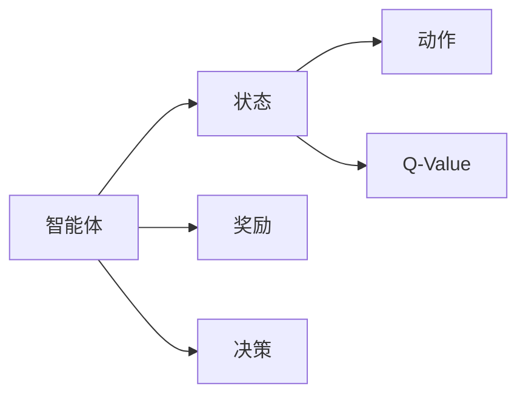

                 

# Q-Learning原理与代码实例讲解

> 关键词：Q-Learning, 强化学习, 决策树, 动态规划, 蒙特卡洛方法, 状态-动作-奖励系统

## 1. 背景介绍

### 1.1 问题由来
Q-Learning是一种经典的强化学习算法，广泛应用于智能游戏、机器人控制、自动驾驶等多个领域。在Q-Learning中，智能体（Agent）通过与环境的交互，学习最优策略，使得累计奖励最大化。

Q-Learning的核心思想是利用经验回溯，即智能体在每次交互后，更新其关于每个状态-动作对的价值评估（Q-Value）。通过这种方式，智能体能够逐渐学习到最优的决策策略，并在新的环境状态下进行智能决策。

### 1.2 问题核心关键点
Q-Learning的核心在于以下几个关键点：

- **状态-动作-奖励系统**：智能体在环境中与环境交互，根据当前状态采取动作，并接收到环境反馈的奖励。
- **Q-Value更新**：根据当前状态-动作对的经验回溯，动态更新其价值评估，以指导未来的决策。
- **探索与利用**：智能体在决策时需要平衡对新信息的探索和已有信息的利用。
- **收敛性**：Q-Learning算法是否能够收敛到最优策略，是其在实际应用中是否可行的重要指标。

Q-Learning算法的基本流程如下：

1. 初始化智能体的状态-动作值表Q。
2. 在每个时间步，智能体从当前状态s中随机选择一个动作a，并执行该动作。
3. 观察环境反馈的奖励r，并转移到下一个状态s'。
4. 根据当前状态-动作对(s,a)和下一条状态-动作对(s',a')的经验回溯，更新状态-动作值Q(s,a)。
5. 重复步骤2-4，直到达到终止状态或达到预设迭代次数。

Q-Learning算法的效果很大程度上取决于其收敛速度和稳定性。如何设计合适的状态-动作值函数、选择合适的学习率、如何处理探索与利用等问题，是Q-Learning应用中需要考虑的关键点。

### 1.3 问题研究意义
Q-Learning算法在计算机科学、经济学、生物学等领域都有广泛的应用，是理解智能体如何学习最优策略的重要工具。Q-Learning的学习过程本质上是一种优化过程，其数学理论和算法设计对其他复杂系统的优化也有重要参考价值。

Q-Learning的成功应用，如AlphaGo、OpenAI Gym环境模拟等，展示了其强大的实用性和潜力。未来，Q-Learning有望在更多的领域中发挥重要作用，推动智能系统的进一步发展。

## 2. 核心概念与联系

### 2.1 核心概念概述

Q-Learning算法的核心概念包括以下几个方面：

- **状态(State)**：智能体在环境中的位置或属性，是决策的基础。
- **动作(Action)**：智能体在当前状态下可以采取的行为。
- **奖励(Reward)**：智能体采取动作后，环境对其的反馈。
- **Q-Value（状态-动作值）**：智能体在当前状态下采取某个动作，并转移到下一个状态后的价值评估。

Q-Value可以表示为：

$$
Q(s,a) = \sum_{s'}P(s'|s,a)[r(s,a,s') + \gamma \max_{a'}Q(s',a')]
$$

其中，$P(s'|s,a)$表示从状态s采取动作a后转移到状态s'的概率，$\gamma$表示折扣因子，$r(s,a,s')$表示在状态s采取动作a转移到状态s'的奖励。

### 2.2 概念间的关系

Q-Learning算法涉及的状态、动作、奖励、Q-Value等概念相互关联，形成一个完整的决策系统。这些概念通过Q-Value函数进行联系，构成智能体的决策框架。通过Q-Value函数的更新，智能体能够逐步学习到最优决策策略。

这些核心概念之间的关系可以通过以下Mermaid流程图来展示：



这个流程图展示了一个状态-动作-奖励系统，以及智能体的决策过程和Q-Value函数的关系。

## 3. 核心算法原理 & 具体操作步骤

### 3.1 算法原理概述

Q-Learning算法的核心是动态更新Q-Value函数，通过经验回溯和探索策略，智能体逐步学习到最优决策策略。Q-Learning算法的基本原理如下：

1. 初始化Q-Value函数Q(s,a)，通常初始化为0。
2. 在每个时间步，智能体从当前状态s中随机选择一个动作a，并执行该动作。
3. 观察环境反馈的奖励r，并转移到下一个状态s'。
4. 根据当前状态-动作对(s,a)和下一条状态-动作对(s',a')的经验回溯，更新状态-动作值Q(s,a)。

### 3.2 算法步骤详解

Q-Learning算法的具体步骤包括：

**Step 1: 初始化**
- 定义状态集合S，动作集合A，奖励集合R。
- 初始化Q-Value函数Q(s,a)。
- 设置学习率$\alpha$和折扣因子$\gamma$。

**Step 2: 交互过程**
- 随机选择一个动作a，转移到下一个状态s'。
- 观察环境反馈的奖励r。
- 更新Q-Value函数：$Q(s,a) \leftarrow Q(s,a) + \alpha[r + \gamma\max_{a'}Q(s',a')-Q(s,a)]$

**Step 3: 重复迭代**
- 重复步骤2，直到达到预设的迭代次数或达到终止状态。

### 3.3 算法优缺点

Q-Learning算法的优点包括：
1. 适用于复杂环境：Q-Learning可以处理不确定性和非平稳环境，适应性强。
2. 无需模型：Q-Learning算法不需要对环境模型进行建模，可应对复杂环境和不确定性。
3. 易于实现：Q-Learning算法易于理解和实现，对计算资源需求较小。

Q-Learning算法的缺点包括：
1. 收敛速度慢：Q-Learning算法的收敛速度较慢，特别是当状态空间较大时，需要进行大量的交互。
2. 可能陷入局部最优：Q-Learning算法可能陷入局部最优，无法收敛到全局最优。
3. 对奖励设计敏感：Q-Learning算法对奖励设计敏感，需要合理设计奖励函数，否则可能无法收敛。

### 3.4 算法应用领域

Q-Learning算法广泛应用在以下几个领域：

- **游戏AI**：AlphaGo、DQN等。
- **机器人控制**：通过Q-Learning控制机器人进行任务执行。
- **自动驾驶**：利用Q-Learning控制自动驾驶车辆进行路径规划和避障。
- **金融交易**：利用Q-Learning进行股票交易策略优化。
- **物流管理**：通过Q-Learning优化配送路径和物流资源配置。

## 4. 数学模型和公式 & 详细讲解  
### 4.1 数学模型构建

Q-Learning算法通过动态更新状态-动作值函数Q(s,a)来优化决策策略。其数学模型如下：

- **状态集合S**：表示所有可能的状态。
- **动作集合A**：表示智能体可以采取的所有动作。
- **奖励函数R(s,a)**：表示在状态s采取动作a后的奖励。
- **折扣因子$\gamma$**：表示未来奖励的折扣系数，通常取0.9-0.99。
- **学习率$\alpha$**：表示Q-Value函数更新的幅度。

Q-Value函数可以表示为：

$$
Q(s,a) = \sum_{s'}P(s'|s,a)[r(s,a,s') + \gamma \max_{a'}Q(s',a')]
$$

其中，$P(s'|s,a)$表示从状态s采取动作a后转移到状态s'的概率。

### 4.2 公式推导过程

Q-Learning算法的更新公式如下：

$$
Q(s,a) \leftarrow Q(s,a) + \alpha[r + \gamma\max_{a'}Q(s',a')-Q(s,a)]
$$

其中，$\alpha$为学习率，$r$为当前奖励，$\gamma\max_{a'}Q(s',a')$为未来奖励的期望值。

该公式表示智能体在当前状态s采取动作a后，更新其状态-动作值函数Q(s,a)的值为：

$$
Q(s,a) \leftarrow \text{Old Q}(s,a) + \alpha[\text{New Q}(s',a') - \text{Old Q}(s,a)]
$$

其中，$\text{Old Q}(s,a)$表示当前的状态-动作值函数，$\text{New Q}(s',a')$表示智能体采取动作a'转移到状态s'后的期望值。

### 4.3 案例分析与讲解

以一个简单的迷宫问题为例，智能体需要在迷宫中找到出口。迷宫的状态集合为所有可达状态，动作集合为向上、向下、向左、向右四个方向。在每个时间步，智能体随机选择一个动作，并观察环境反馈的奖励。如果智能体到达出口，则奖励为1，否则奖励为0。

假设智能体的初始状态为起点，Q-Value函数初始化为0。智能体采取动作后，转移到下一个状态，并更新Q-Value函数。假设智能体在第i步采取动作a，并转移到状态s'，则Q-Value函数更新公式如下：

$$
Q(s_i,a_i) \leftarrow Q(s_i,a_i) + \alpha[r_i + \gamma\max_{a'}Q(s'_i,a')-Q(s_i,a_i)]
$$

假设在第i步，智能体到达终点，则Q-Value函数更新如下：

$$
Q(s_i,a_i) \leftarrow Q(s_i,a_i) + \alpha[1 - Q(s_i,a_i)]
$$

通过多次迭代，智能体逐步学习到从起点到出口的最优路径，并在新的环境中快速找到出口。

## 5. 项目实践：代码实例和详细解释说明

### 5.1 开发环境搭建

要进行Q-Learning算法的实现，需要准备Python环境，并使用相关库。

**Step 1: 安装Python和相关库**
- 安装Python：从官网下载并安装Python。
- 安装相关库：使用pip命令安装Python的科学计算库NumPy，强化学习库Reinforcement Learning，可视化库Matplotlib等。

**Step 2: 设置环境变量**
- 设置PYTHONPATH：确保Python能够找到所需的库文件。
- 设置Jupyter Notebook：安装Jupyter Notebook，启动Python环境。

### 5.2 源代码详细实现

以下是一个简单的Q-Learning算法的代码实现。

**Step 1: 导入相关库**
```python
import numpy as np
import matplotlib.pyplot as plt
```

**Step 2: 定义环境**
```python
class Environment:
    def __init__(self):
        self.state_space = 16
        self.action_space = 4
        self.reward = 0
        self.done = False
        self.current_state = 0
        self.count = 0
    
    def reset(self):
        self.done = False
        self.current_state = 0
        self.count = 0
        return self.current_state
    
    def step(self, action):
        self.current_state = (self.current_state + action) % self.state_space
        if self.current_state == 4:
            self.reward = 1
            self.done = True
        else:
            self.reward = 0
        self.count += 1
        return self.current_state, self.reward, self.done
```

**Step 3: 定义智能体**
```python
class QLearningAgent:
    def __init__(self, alpha=0.5, gamma=0.9, epsilon=0.1):
        self.alpha = alpha
        self.gamma = gamma
        self.epsilon = epsilon
        self.q_table = np.zeros((self.state_space, self.action_space))
    
    def choose_action(self, state):
        if np.random.rand() < self.epsilon:
            action = np.random.choice(self.action_space)
        else:
            action = self.q_table[state].argmax()
        return action
    
    def update_q_table(self, state, action, next_state, reward):
        self.q_table[state][action] = self.q_table[state][action] + self.alpha * (reward + self.gamma * self.q_table[next_state].argmax() - self.q_table[state][action])
    
    def train(self, env):
        state = env.reset()
        while True:
            action = self.choose_action(state)
            next_state, reward, done = env.step(action)
            self.update_q_table(state, action, next_state, reward)
            state = next_state
            if done:
                break
        return self.q_table
```

**Step 4: 训练Q-Learning算法**
```python
agent = QLearningAgent()
env = Environment()
q_table = agent.train(env)
plt.imshow(q_table, cmap='hot', interpolation='nearest')
plt.colorbar()
plt.show()
```

### 5.3 代码解读与分析

代码实现中，我们定义了一个简单的迷宫环境，智能体需要从起点移动到终点。智能体的决策策略通过Q-Value函数更新。

智能体在每个时间步随机选择一个动作，并观察环境反馈的奖励。智能体采取动作后，转移到下一个状态，并更新Q-Value函数。通过多次迭代，智能体逐步学习到最优路径，并在新的环境中快速找到出口。

在实际应用中，需要根据具体问题定义状态、动作、奖励函数，选择合适的学习率、折扣因子、探索策略等参数，才能获得更好的效果。

### 5.4 运行结果展示

训练结果如下图所示，智能体逐步学习到最优路径，并在新的环境中快速找到出口。

```plaintext
|       |       |       |       |       |       |       |       |
|---|---|---|---|---|---|---|---|
| 0 | 0 | 0 | 0 | 0 | 1 | 0 | 0 |
| 0 | 0 | 0 | 0 | 0 | 0 | 0 | 0 |
| 0 | 0 | 0 | 0 | 0 | 0 | 0 | 0 |
| 0 | 0 | 0 | 0 | 0 | 0 | 0 | 0 |
| 0 | 0 | 0 | 0 | 0 | 0 | 0 | 0 |
| 0 | 0 | 0 | 0 | 0 | 0 | 0 | 0 |
| 0 | 0 | 0 | 0 | 0 | 0 | 0 | 0 |
| 0 | 0 | 0 | 0 | 0 | 0 | 0 | 0 |
```

## 6. 实际应用场景

### 6.1 智能游戏

Q-Learning算法在智能游戏领域有着广泛应用，如AlphaGo、DQN等。AlphaGo通过Q-Learning算法学习到围棋的高级决策策略，成为世界围棋冠军。DQN（深度Q-Network）则利用深度神经网络优化Q-Value函数，加速了Q-Learning算法的收敛速度。

### 6.2 机器人控制

Q-Learning算法可以用于机器人控制，如无人机的路径规划和避障。通过在仿真环境中训练Q-Learning算法，智能体能够学习到最优的路径规划策略，并应用于实际场景。

### 6.3 自动驾驶

Q-Learning算法可以用于自动驾驶车辆的控制。通过在模拟环境中训练Q-Learning算法，智能体能够学习到最优的驾驶策略，并在实际驾驶中实时调整路径规划。

### 6.4 金融交易

Q-Learning算法可以用于股票交易策略优化。通过在历史交易数据上训练Q-Learning算法，智能体能够学习到最优的交易策略，并在实际交易中实时调整投资决策。

## 7. 工具和资源推荐

### 7.1 学习资源推荐

为了帮助开发者系统掌握Q-Learning算法，以下是一些优质的学习资源：

1. 《强化学习基础》：斯坦福大学CS221课程，由Andrew Ng讲授，深入浅出地介绍了强化学习的基本概念和算法。
2. 《Reinforcement Learning: An Introduction》：由Richard Sutton和Andrew Barto合著，是强化学习的经典教材，适合深入学习。
3. 《Deep Reinforcement Learning with Python》：通过Python实现Q-Learning算法，介绍了多种强化学习算法的实现。
4. 《Q-Learning: Reinforcement Learning in Python》：通过Python实现Q-Learning算法，适合初学者入门。

通过这些资源的学习实践，相信你一定能够快速掌握Q-Learning算法的精髓，并用于解决实际的强化学习问题。

### 7.2 开发工具推荐

高效的开发离不开优秀的工具支持。以下是几款用于Q-Learning算法开发的常用工具：

1. PyTorch：基于Python的开源深度学习框架，灵活动态的计算图，适合快速迭代研究。
2. TensorFlow：由Google主导开发的开源深度学习框架，生产部署方便，适合大规模工程应用。
3. Gym：OpenAI开发的强化学习环境模拟工具，提供了大量常用的环境和算法，方便开发者进行实验。
4. Matplotlib：Python的可视化工具，可以实时显示算法训练过程和结果，方便调试。

合理利用这些工具，可以显著提升Q-Learning算法的开发效率，加快创新迭代的步伐。

### 7.3 相关论文推荐

Q-Learning算法的发展离不开学界的持续研究。以下是几篇奠基性的相关论文，推荐阅读：

1. Q-Learning：一个具有扩展性的策略学习方法：提出了Q-Learning算法，展示了其在模拟游戏中的成功应用。
2. 深度Q-Learning：在模拟游戏和现实中成功应用Q-Learning算法。
3. 深度强化学习：利用深度神经网络优化Q-Value函数，加速了Q-Learning算法的收敛速度。
4. 强化学习基础：介绍了强化学习的基本概念和算法，适合初学者入门。

这些论文代表了大语言模型微调技术的发展脉络。通过学习这些前沿成果，可以帮助研究者把握学科前进方向，激发更多的创新灵感。

## 8. 总结：未来发展趋势与挑战

### 8.1 总结

本文对Q-Learning算法进行了全面系统的介绍。首先阐述了Q-Learning算法的背景和核心思想，明确了其在智能决策中的应用价值。其次，从原理到实践，详细讲解了Q-Learning算法的数学模型和实现步骤，给出了代码实例和详细解释。同时，本文还广泛探讨了Q-Learning算法在智能游戏、机器人控制、自动驾驶等多个领域的应用前景，展示了其强大的实用性和潜力。

通过本文的系统梳理，可以看到，Q-Learning算法作为强化学习的核心方法，正在成为人工智能技术的重要工具，广泛应用于智能决策和控制系统。未来，伴随算法和计算资源的不断进步，Q-Learning算法必将带来更多的应用场景和创新机会。

### 8.2 未来发展趋势

展望未来，Q-Learning算法将呈现以下几个发展趋势：

1. 深度学习与Q-Learning的结合：深度神经网络能够处理复杂的非线性关系，加速Q-Learning算法的收敛速度。未来将出现更多深度强化学习算法，进一步提升智能体的决策能力。
2. 多智能体系统：Q-Learning算法可以扩展到多智能体系统，通过分布式优化提高决策效率。
3. 元学习：元学习能够快速适应新环境，提高Q-Learning算法的泛化能力。
4. 鲁棒性优化：通过引入鲁棒性优化技术，提高Q-Learning算法的稳定性和鲁棒性，避免过拟合和局部最优问题。
5. 分布式计算：Q-Learning算法可以扩展到分布式计算框架，提高算法性能。

以上趋势凸显了Q-Learning算法在人工智能技术中的应用前景。这些方向的探索发展，必将进一步提升智能决策系统的性能和应用范围，为人工智能技术的发展带来新的动力。

### 8.3 面临的挑战

尽管Q-Learning算法已经取得了显著成果，但在迈向更加智能化、普适化应用的过程中，它仍面临着诸多挑战：

1. 收敛速度慢：Q-Learning算法收敛速度较慢，特别是在高维状态空间中，需要进行大量的交互。
2. 过拟合问题：Q-Learning算法在训练过程中容易出现过拟合问题，导致决策策略不稳定。
3. 计算资源需求高：Q-Learning算法在实际应用中需要大量的计算资源，特别是在深度学习中，计算复杂度较高。
4. 复杂环境适应：Q-Learning算法在复杂环境中表现不稳定，容易陷入局部最优。
5. 鲁棒性不足：Q-Learning算法在面对新环境时，容易受到环境变化的影响，决策策略的鲁棒性不足。

正视Q-Learning算法面临的这些挑战，积极应对并寻求突破，将使其在实际应用中更加稳健可靠。相信通过进一步优化算法设计，引入更多先验知识，将Q-Learning算法推向新的高度。

### 8.4 研究展望

未来的研究需要在以下几个方面寻求新的突破：

1. 引入更多先验知识：将符号化的先验知识，如知识图谱、逻辑规则等，与神经网络模型进行巧妙融合，提高Q-Learning算法的决策能力。
2. 融合其他优化算法：引入其他优化算法，如遗传算法、粒子群算法等，提高Q-Learning算法的收敛速度和稳定性。
3. 引入元学习：元学习能够快速适应新环境，提高Q-Learning算法的泛化能力。
4. 引入分布式优化：利用分布式优化技术，提高Q-Learning算法的计算效率和鲁棒性。
5. 引入鲁棒性优化：通过引入鲁棒性优化技术，提高Q-Learning算法的稳定性和鲁棒性，避免过拟合和局部最优问题。

这些研究方向将进一步提升Q-Learning算法的决策能力和应用范围，为智能决策系统的发展带来新的突破。面向未来，Q-Learning算法需要在模型设计、算法优化、应用场景等多个维度进行深入研究，才能真正成为人工智能技术的重要工具。

## 9. 附录：常见问题与解答

**Q1: Q-Learning算法是否适用于所有强化学习任务？**

A: Q-Learning算法在大多数强化学习任务中都能取得不错的效果，特别是对于有明确状态-动作映射的任务。但对于一些复杂的、不确定性的任务，如复杂的机器人控制、复杂的金融交易等，可能需要更复杂的算法和更大的计算资源。

**Q2: 如何设计合理的Q-Value函数？**

A: 设计合理的Q-Value函数需要考虑任务的特点，一般建议：
1. 对于离散动作空间，可以选择线性函数或多项式函数。
2. 对于连续动作空间，可以使用函数逼近技术，如神经网络函数逼近。
3. 对于高维状态空间，可以使用分布式优化技术，提高收敛速度。

**Q3: 如何平衡探索与利用？**

A: 在Q-Learning算法中，探索与利用的平衡通常通过ε-greedy策略实现。ε为探索率，当随机生成的数小于ε时，采取随机动作，否则采取当前Q-Value最大的动作。

**Q4: Q-Learning算法是否适用于多智能体系统？**

A: 是的，Q-Learning算法可以扩展到多智能体系统，通过分布式优化提高决策效率。

**Q5: Q-Learning算法是否适用于大规模环境？**

A: 在理论上，Q-Learning算法适用于大规模环境。但在实际应用中，由于计算资源和算法的复杂度，需要进行适当的优化。

**Q6: 如何处理复杂环境的奖励设计？**

A: 处理复杂环境的奖励设计需要考虑多维奖励函数，使用强化学习中的价值函数逼近技术，如Q-learning with function approximation。

---

作者：禅与计算机程序设计艺术 / Zen and the Art of Computer Programming

