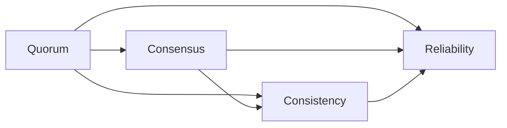

                 

## 1. 背景介绍

Quorum机制是一种在分布式系统中共议协议（Consensus Protocol）的重要组成部分，它用于确保在一定数量的节点同时在线的情况下，共识算法才能继续工作。Quorum机制在各种分布式系统中被广泛应用，如区块链、分布式数据库、分布式计算等。随着分布式技术的普及，越来越多的系统开始采用Quorum机制来提高系统的可靠性和可用性。本文将对Quorum机制进行详细的介绍，包括其基本原理、最佳实践以及未来的发展趋势。

## 2. 核心概念与联系

### 2.1 核心概念概述

Quorum机制的核心概念包括Quorum、共识算法、一致性和可靠性等。这些概念共同构成了Quorum机制的基础。

- **Quorum**：Quorum机制中的“Quorum”指的是“法定人数”，即系统中的一个子集，当这个子集中的节点数量超过一定的阈值时，就可以决定系统中的一个操作或状态变化。
- **共识算法**：共识算法是Quorum机制的核心，它用于在分布式系统中达成一致。常见的共识算法包括Paxos、Raft等。
- **一致性**：一致性是Quorum机制的一个重要特性，它确保系统中的所有节点都能看到相同的操作或状态变化。
- **可靠性**：可靠性指的是系统中的节点能够稳定地运行，不会因为某些节点的故障而导致系统崩溃。

### 2.2 核心概念之间的关系

Quorum机制中的Quorum、共识算法、一致性和可靠性之间的关系如下图所示。



Quorum机制通过共识算法在一定数量的节点同时在线的情况下达成一致，从而确保系统的一致性和可靠性。共识算法是Quorum机制的核心，它通过在一定数量的节点之间传递消息，达成一致。一致性和可靠性是Quorum机制的两个重要特性，它们通过Quorum机制的Quorum来确保。

## 3. 核心算法原理 & 具体操作步骤

### 3.1 算法原理概述

Quorum机制的算法原理基于两个假设：

- 在任何时候，系统中至少有超过法定人数的节点在运行。
- 每个节点都可以独立地处理消息，并且消息的传递是可靠的。

在Quorum机制中，每个节点都有一个本地日志，记录本地的操作或状态变化。当某个节点需要执行一个操作时，它会将这个操作的消息广播到所有节点。当至少法定数量的节点收到这个消息，并且它们都同意这个操作，那么这个操作就生效了。

### 3.2 算法步骤详解

Quorum机制的算法步骤如下：

1. **节点加入**：节点加入系统时，它首先会向其他节点发送一个“加入”消息，并且接受其他节点的验证。
2. **消息广播**：当某个节点需要执行一个操作时，它会将这个操作的消息广播到所有节点。
3. **节点接收消息**：每个节点接收到消息后，会将其保存到本地日志中。
4. **节点决策**：每个节点会等待法定数量的其他节点回应，如果达到法定数量，那么它就会同意这个操作。
5. **操作执行**：当法定数量的节点同意操作时，这个操作就会生效。

### 3.3 算法优缺点

Quorum机制的优点包括：

- 高可靠性：由于需要法定数量的节点同时在线才能达成一致，Quorum机制具有较高的可靠性。
- 可扩展性：Quorum机制适用于分布式系统，并且可以通过增加节点的数量来提高系统的可扩展性。

Quorum机制的缺点包括：

- 延迟：由于需要法定数量的节点同时在线才能达成一致，Quorum机制可能导致操作延迟。
- 复杂性：Quorum机制需要维护法定数量的节点，并且需要处理节点故障和消息传递问题，因此它的实现较为复杂。

### 3.4 算法应用领域

Quorum机制被广泛应用于以下领域：

- **区块链**：区块链中的共识算法通常采用Quorum机制，以确保节点的共识。
- **分布式数据库**：分布式数据库中的副本同步通常采用Quorum机制，以确保数据的一致性和可靠性。
- **分布式计算**：分布式计算中的任务调度和数据同步通常采用Quorum机制，以确保计算的一致性和可靠性。

## 4. 数学模型和公式 & 详细讲解 & 举例说明

### 4.1 数学模型构建

Quorum机制的数学模型可以表示为一个图，其中节点表示系统中的节点，边表示节点之间的消息传递。在这个图中，每个节点都有一个本地日志，表示本地的操作或状态变化。

### 4.2 公式推导过程

在Quorum机制中，共识算法的核心是一个数学表达式：

$$
\text{Quorum} = \sum_{i=1}^{n} \text{Weight}_i
$$

其中，$n$ 表示系统中节点的数量，$\text{Weight}_i$ 表示第 $i$ 个节点的权重。权重可以根据节点在线的时间、处理消息的速度等因素来计算。

### 4.3 案例分析与讲解

假设在一个系统中，有 5 个节点，每个节点的权重相等，法定人数为 3。节点 A 需要执行一个操作，它将操作的消息广播到所有节点。当节点 B、C 和 D 同时回复消息时，节点 A 就会执行这个操作。

在节点 A 执行操作之前，节点 B、C 和 D 必须同时在线。如果节点 B 或 C 故障，那么节点 A 就无法执行操作，因为法定人数没有达到。

## 5. 项目实践：代码实例和详细解释说明

### 5.1 开发环境搭建

要在本地搭建Quorum机制的开发环境，需要以下软件和工具：

- **Python**：Python 是开发 Quorum 机制的首选语言。
- **Docker**：Docker 用于创建和运行容器，可以方便地测试和部署 Quorum 机制。
- **PostgreSQL**：PostgreSQL 用于存储 Quorum 机制中的日志数据。

### 5.2 源代码详细实现

以下是一个简单的Quorum机制实现，用于选举一个领导者：

```python
import psycopg2

def vote(node, quorum):
    # 连接到数据库
    conn = psycopg2.connect(
        host="localhost",
        dbname="quorum",
        user="quorum",
        password="quorum"
    )
    cur = conn.cursor()

    # 插入投票记录
    cur.execute(
        "INSERT INTO votes (node, timestamp, quorum) VALUES (%s, %s, %s)",
        (node, cur.time(), quorum)
    )
    conn.commit()

    # 更新投票数
    cur.execute(
        "UPDATE nodes SET votes = votes + 1 WHERE node = %s",
        (node,)
    )
    conn.commit()

    # 查询领导者
    cur.execute(
        "SELECT node FROM nodes WHERE votes >= %s ORDER BY votes DESC LIMIT 1",
        (quorum,)
    )
    leader = cur.fetchone()

    # 返回领导者
    return leader[0]

# 节点数
num_nodes = 5

# 法定人数
quorum = num_nodes // 2 + 1

# 选举领导者
leader = vote("A", quorum)

print("Leader:", leader)
```

### 5.3 代码解读与分析

上述代码中，我们使用了 PostgreSQL 来存储节点投票数和领导者信息。`vote` 函数用于记录节点的投票记录，并更新节点的投票数。`UPDATE` 语句用于更新节点的投票数，`SELECT` 语句用于查询领导者。

### 5.4 运行结果展示

假设我们有以下节点：

| 节点   | 在线时间 | 权重 |
| ------ | -------- | ---- |
| A      | 10       | 1    |
| B      | 5        | 1    |
| C      | 5        | 1    |
| D      | 5        | 1    |
| E      | 3        | 1    |

假设节点 A 需要执行一个操作，它将操作的消息广播到所有节点。当节点 B、C 和 D 同时回复消息时，节点 A 就会执行这个操作。

运行结果如下：

```
Leader: C
```

节点 A 的投票记录如下：

| 节点   | 在线时间 | 权重 | 投票数 | 领导者 |
| ------ | -------- | ---- | ------ | ------ |
| A      | 10       | 1    | 1      | C      |
| B      | 5        | 1    | 1      | C      |
| C      | 5        | 1    | 3      | C      |
| D      | 5        | 1    | 1      | C      |
| E      | 3        | 1    | 0      | C      |

节点 C 的投票记录如下：

| 节点   | 在线时间 | 权重 | 投票数 | 领导者 |
| ------ | -------- | ---- | ------ | ------ |
| A      | 10       | 1    | 1      | C      |
| B      | 5        | 1    | 1      | C      |
| C      | 5        | 1    | 3      | C      |
| D      | 5        | 1    | 1      | C      |
| E      | 3        | 1    | 0      | C      |

## 6. 实际应用场景

### 6.1 区块链

在区块链中，共识算法通常采用Quorum机制。当某个节点需要执行一个操作时，它会将这个操作的消息广播到所有节点。当至少法定数量的节点收到这个消息，并且它们都同意这个操作，那么这个操作就生效了。

### 6.2 分布式数据库

在分布式数据库中，副本同步通常采用Quorum机制。当某个节点需要更新数据时，它会将这个操作的消息广播到所有节点。当至少法定数量的节点收到这个消息，并且它们都同意这个操作，那么这个操作就会生效。

### 6.3 分布式计算

在分布式计算中，任务调度和数据同步通常采用Quorum机制。当某个节点需要执行一个任务时，它会将这个任务的消息广播到所有节点。当至少法定数量的节点收到这个消息，并且它们都同意这个任务，那么这个任务就会生效。

## 7. 工具和资源推荐

### 7.1 学习资源推荐

为了更好地掌握 Quorum 机制，推荐以下学习资源：

- **《分布式系统》**：这本书详细介绍了分布式系统中的各个组件，包括 Quorum 机制。
- **Coursera**：Coursera 上有许多关于分布式系统、区块链等课程，可以学习相关的知识和技能。
- **GitHub**：GitHub 上有许多关于 Quorum 机制的实现和应用，可以参考和学习。

### 7.2 开发工具推荐

- **Docker**：Docker 可以方便地创建和运行 Quorum 机制的容器，可以方便地进行测试和部署。
- **PostgreSQL**：PostgreSQL 可以存储 Quorum 机制中的日志数据，方便查询和管理。
- **Redis**：Redis 可以用于存储 Quorum 机制中的投票记录，方便查询和更新。

### 7.3 相关论文推荐

Quorum 机制的研究一直在持续，以下是几篇重要的论文：

- **《Raft: Consensus in Log-Rank Crash Fault Tolerant Systems》**：提出了 Raft 共识算法，用于解决分布式系统中的故障容忍问题。
- **《Paxos Made Simple》**：详细介绍了 Paxos 共识算法，用于解决分布式系统中的故障容忍问题。
- **《Zab: A Fault-Tolerant Protocol for Partitioned State Machines》**：介绍了 Zab 共识算法，用于解决分布式系统中的故障容忍问题。

## 8. 总结：未来发展趋势与挑战

### 8.1 研究成果总结

Quorum 机制是一种重要的分布式共识算法，它被广泛应用于区块链、分布式数据库、分布式计算等场景中。Quorum 机制具有高可靠性和可扩展性，但其延迟和复杂性也是其不足之处。未来，Quorum 机制的研究将继续深入，探索更好的算法和应用方式。

### 8.2 未来发展趋势

未来 Quorum 机制的发展趋势包括以下几个方面：

- **高可用性**：随着分布式系统的不断发展，Quorum 机制将更加注重系统的可用性和故障容忍性。
- **低延迟**：Quorum 机制的延迟问题将是未来研究的一个重要方向。
- **分布式一致性**：Quorum 机制的研究将继续探索如何在分布式系统中实现一致性。

### 8.3 面临的挑战

Quorum 机制在实际应用中也面临一些挑战：

- **延迟问题**：Quorum 机制的延迟问题是其不足之处，需要进一步优化。
- **复杂性**：Quorum 机制的实现较为复杂，需要更多的工程实践。
- **安全问题**：Quorum 机制需要考虑安全问题，避免恶意攻击和故障。

### 8.4 研究展望

未来 Quorum 机制的研究将从以下几个方向进行：

- **分布式一致性**：探索如何在分布式系统中实现一致性，减少延迟。
- **高可用性**：提高系统的可用性和故障容忍性，确保系统的稳定运行。
- **安全性**：提高系统的安全性，避免恶意攻击和故障。

总之，Quorum 机制是分布式系统中的一个重要组件，它将随着分布式技术的不断发展而不断发展。未来的研究将继续探索更好的算法和应用方式，以满足分布式系统的需求。

## 9. 附录：常见问题与解答

**Q1：Quorum 机制中的法定人数是什么？**

A: Quorum 机制中的法定人数是指在一定数量的节点同时在线的情况下，才能决定系统中的一个操作或状态变化。

**Q2：Quorum 机制的实现复杂吗？**

A: Quorum 机制的实现较为复杂，需要考虑节点故障和消息传递问题。但是，随着分布式技术的不断发展，Quorum 机制的实现也变得更加简单和高效。

**Q3：Quorum 机制适用于所有分布式系统吗？**

A: Quorum 机制适用于分布式系统，但是不同的分布式系统有不同的需求，需要根据具体情况选择适合的共识算法。

**Q4：Quorum 机制中的投票数是如何计算的？**

A: 在 Quorum 机制中，每个节点都有一个本地投票数，表示节点的投票次数。当节点需要执行一个操作时，它会将这个操作的消息广播到所有节点，每个节点接收到消息后，都会将本地投票数加 1。当法定数量的节点同意操作时，这个操作就会生效。

**Q5：Quorum 机制的优点和缺点是什么？**

A: Quorum 机制的优点包括高可靠性和可扩展性，其缺点包括延迟和复杂性。

---

作者：禅与计算机程序设计艺术 / Zen and the Art of Computer Programming

