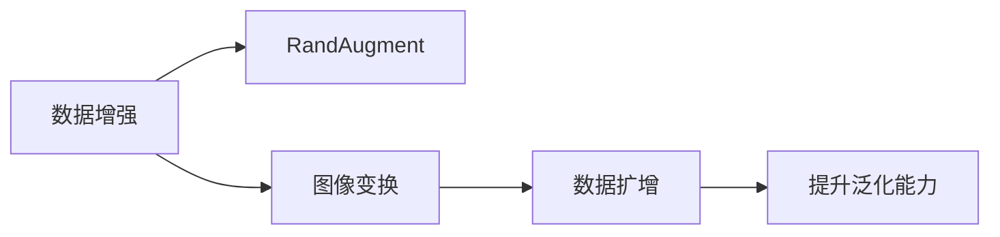
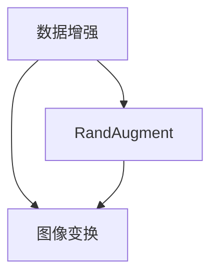
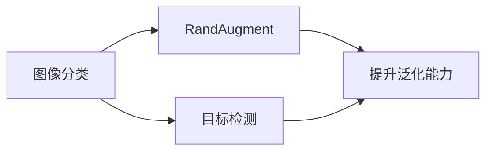
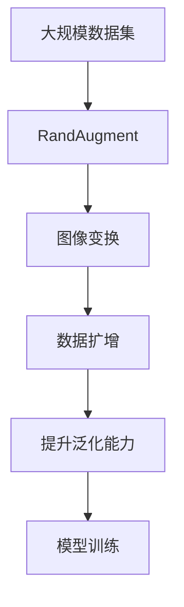

                 

# RandAugment原理与代码实例讲解

> 关键词：RandAugment, 数据增强, 数据扩增, 图像变换, 图像处理, PyTorch, 计算机视觉

## 1. 背景介绍

### 1.1 问题由来
数据增强（Data Augmentation）是深度学习领域中广泛应用的一种技术手段，通过增加数据的多样性来提高模型的泛化能力。然而，传统的图像数据增强方法，如随机裁剪、翻转、旋转、颜色扰动等，往往需要手动设计和实验，且存在一定的随机性。这不仅增加了数据处理的难度，也可能在一定程度上影响模型的训练效果。

RandAugment（随机增强）算法提出了一种自动化的数据增强方法，通过随机生成一组特定的图像变换操作，极大地提升了图像数据增强的效率和效果。

### 1.2 问题核心关键点
RandAugment算法的核心思想是：在数据增强过程中，随机地选择一组操作序列，每个操作序列包含多个操作，通过组合这些操作来生成增强数据。这种方法在保持数据集多样性的同时，减少了随机性对训练的影响。

该算法的优势在于：
- **自动化设计**：算法自动生成增强操作，减少了手动设计和实验的工作量。
- **一致性**：固定的操作序列保证了每次增强操作的一致性，避免了随机性对模型的影响。
- **效果显著**：实验表明，RandAugment在多种图像分类任务上取得了优异的效果。

### 1.3 问题研究意义
RandAugment算法的研究意义在于：
- **提高泛化能力**：通过增加数据多样性，模型能够更好地适应新数据，提升泛化能力。
- **减少人工干预**：自动生成增强操作，减少了人工设计和实验的工作量，降低了研究成本。
- **提升模型效果**：在图像分类、目标检测等任务上，RandAugment算法能够显著提升模型效果。

## 2. 核心概念与联系

### 2.1 核心概念概述

为更好地理解RandAugment算法，本节将介绍几个密切相关的核心概念：

- **数据增强（Data Augmentation）**：通过增加数据的多样性来提高模型的泛化能力。常见的数据增强方法包括随机裁剪、翻转、旋转、颜色扰动等。

- ** RandAugment**：一种自动化的数据增强方法，通过随机生成一组特定的图像变换操作，生成增强数据。

- **图像变换（Image Transformation）**：包括随机裁剪、翻转、旋转、颜色扰动等操作，用于生成新的图像数据。

- **数据扩增（Data Augmentation）**：通过增加数据的多样性来提高模型的泛化能力，与数据增强方法类似。

这些核心概念之间的逻辑关系可以通过以下Mermaid流程图来展示：



这个流程图展示了数据增强、 RandAugment、图像变换和数据扩增之间的逻辑关系：

1. 数据增强通过增加数据的多样性来提高模型的泛化能力。
2. RandAugment是一种自动化的数据增强方法，通过随机生成一组特定的图像变换操作。
3. 图像变换包括随机裁剪、翻转、旋转、颜色扰动等操作，用于生成新的图像数据。
4. 数据扩增通过增加数据的多样性来提高模型的泛化能力，与数据增强方法类似。

### 2.2 概念间的关系

这些核心概念之间存在着紧密的联系，形成了RandAugment算法的完整生态系统。下面我通过几个Mermaid流程图来展示这些概念之间的关系。

#### 2.2.1 数据增强与RandAugment的关系



这个流程图展示了数据增强与RandAugment之间的关系：

1. 数据增强通过增加数据的多样性来提高模型的泛化能力。
2. RandAugment是一种自动化的数据增强方法，通过随机生成一组特定的图像变换操作。
3. RandAugment依赖于图像变换操作，能够自动生成增强数据，从而提升模型的泛化能力。

#### 2.2.2 RandAugment的应用场景



这个流程图展示了RandAugment在图像分类和目标检测中的应用场景：

1. 图像分类和目标检测等任务通常需要大量标注数据进行训练。
2. RandAugment通过随机生成一组特定的图像变换操作，生成增强数据，提升模型的泛化能力。
3. 在图像分类和目标检测等任务上，RandAugment算法能够显著提升模型效果。

### 2.3 核心概念的整体架构

最后，我们用一个综合的流程图来展示这些核心概念在大规模数据增强过程中的整体架构：



这个综合流程图展示了从大规模数据集到模型训练的全过程：

1. 从大规模数据集中随机选择数据进行增强操作。
2. RandAugment算法自动生成一组特定的图像变换操作，生成增强数据。
3. 图像变换包括随机裁剪、翻转、旋转、颜色扰动等操作，用于生成新的图像数据。
4. 数据扩增通过增加数据的多样性来提高模型的泛化能力。
5. 提升泛化能力后的数据用于模型训练，提高模型的泛化能力和效果。

## 3. 核心算法原理 & 具体操作步骤
### 3.1 算法原理概述

RandAugment算法的核心思想是：在数据增强过程中，随机地选择一组操作序列，每个操作序列包含多个操作，通过组合这些操作来生成增强数据。该算法由Simonyan和Zoph在2019年提出，并广泛应用于图像分类、目标检测等任务中。

### 3.2 算法步骤详解

RandAugment算法的主要步骤如下：

**Step 1: 定义操作集**
定义一组随机操作集，包含随机裁剪、翻转、旋转、颜色扰动等操作。操作集中的操作按照指定的权重分布进行组合。

**Step 2: 生成操作序列**
从操作集中随机选择多个操作，按照指定权重进行组合，生成一个操作序列。该序列是固定的，每次增强操作时都会使用相同的序列。

**Step 3: 应用操作序列**
对输入图像应用操作序列中的每个操作，按照指定的顺序进行增强操作，生成增强数据。

**Step 4: 生成多个数据样本**
重复上述步骤，生成多个增强数据样本，构成增强数据集。

**Step 5: 训练模型**
使用生成的增强数据集进行模型训练，提升模型的泛化能力和效果。

### 3.3 算法优缺点

**优点：**
- **自动化设计**：算法自动生成增强操作，减少了手动设计和实验的工作量。
- **一致性**：固定的操作序列保证了每次增强操作的一致性，避免了随机性对模型的影响。
- **效果显著**：实验表明，RandAugment在多种图像分类任务上取得了优异的效果。

**缺点：**
- **依赖操作集**：算法的效果依赖于定义的操作集，不同的操作集可能会产生不同的增强效果。
- **计算成本**：生成操作序列和应用操作序列可能需要一定的时间计算，特别是在数据量较大时。

### 3.4 算法应用领域

RandAugment算法主要应用于图像分类、目标检测、语义分割等计算机视觉任务中。通过增加数据的多样性，提高模型的泛化能力和效果，特别适用于数据量较小或数据分布不均衡的任务。

## 4. 数学模型和公式 & 详细讲解  
### 4.1 数学模型构建

在RandAugment算法中，我们通常将图像表示为一个矩阵 $X \in \mathbb{R}^{H \times W \times C}$，其中 $H$ 和 $W$ 分别为图像的高和宽，$C$ 为通道数。

### 4.2 公式推导过程

在推导RandAugment算法的公式之前，我们需要先了解一些基本的操作。假设我们需要对图像 $X$ 进行随机裁剪、翻转、旋转、颜色扰动等操作，具体操作如下：

- **随机裁剪**：从原图像中随机裁剪出一个大小为 $h \times w$ 的子图像。
- **随机翻转**：以一定概率 $p$ 水平或垂直翻转图像。
- **随机旋转**：以一定概率 $p$ 随机旋转图像 $k$ 度。
- **颜色扰动**：随机改变图像的亮度、对比度、饱和度等参数。

假设我们的操作集包含 $n$ 个随机操作，每个操作按照权重 $w_1, w_2, \dots, w_n$ 进行组合，生成的操作序列长度为 $l$。则每个操作序列可以表示为：

$$
\mathcal{A} = \{a_1, a_2, \dots, a_l\}
$$

其中 $a_i$ 表示第 $i$ 个操作。

### 4.3 案例分析与讲解

下面通过一个简单的案例来解释RandAugment算法的具体实现过程。假设我们的操作集包含随机裁剪、水平翻转、垂直翻转、旋转90度四个操作，权重分别为 $w_1 = w_2 = w_3 = w_4 = 1$，生成的操作序列长度为 $l = 2$。则操作序列可以表示为：

$$
\mathcal{A} = \{c, \text{FlipH}, \text{FlipV}, \text{Rotate90}\}
$$

随机选择两个操作，按照权重进行组合，生成一个操作序列，例如：

$$
\mathcal{A} = \{c, \text{FlipH}, \text{Rotate90}\}
$$

然后对输入图像 $X$ 应用这个操作序列，生成增强图像 $X'$，具体步骤如下：

1. 随机裁剪 $X$ 中的子图像，得到 $X_1$。
2. 对 $X_1$ 进行水平翻转，得到 $X_2$。
3. 对 $X_2$ 进行旋转90度，得到 $X_3$。

最终的增强图像 $X'$ 为 $X_3$。

## 5. 项目实践：代码实例和详细解释说明
### 5.1 开发环境搭建

在进行RandAugment的实践前，我们需要准备好开发环境。以下是使用Python进行PyTorch开发的环境配置流程：

1. 安装Anaconda：从官网下载并安装Anaconda，用于创建独立的Python环境。

2. 创建并激活虚拟环境：
```bash
conda create -n pytorch-env python=3.8 
conda activate pytorch-env
```

3. 安装PyTorch：根据CUDA版本，从官网获取对应的安装命令。例如：
```bash
conda install pytorch torchvision torchaudio cudatoolkit=11.1 -c pytorch -c conda-forge
```

4. 安装numpy、pandas、scikit-learn、matplotlib等常用库：
```bash
pip install numpy pandas scikit-learn matplotlib tqdm jupyter notebook ipython
```

5. 安装PyTorch：
```bash
pip install torch torchvision torchaudio
```

6. 安装transformers库：
```bash
pip install transformers
```

完成上述步骤后，即可在`pytorch-env`环境中开始实践。

### 5.2 源代码详细实现

下面我们以ImageNet数据集上的ResNet模型为例，给出使用Transformers库进行RandAugment的PyTorch代码实现。

```python
import torch
import torchvision
import torchvision.transforms as transforms
import numpy as np
from torch.utils.data import DataLoader

# 定义操作集
ops = {
    'c': transforms.RandomCrop,
    'f': transforms.RandomHorizontalFlip,
    'r': transforms.RandomRotation,
    'h': transforms.ColorJitter
}

# 定义操作序列长度
l = 2

# 定义操作权重分布
ws = np.ones(len(ops))

# 随机选择操作
def get_aug_ops():
    keys = list(ops.keys())
    ops_ = [ops[key] for key in np.random.choice(keys, l, p=ws)]
    return ops_

# 定义增强数据生成函数
def get_augmented_image(image, aug_ops):
    for op in aug_ops:
        image = op(image)
    return image

# 加载数据集
train_dataset = torchvision.datasets.CIFAR10(root='./data', train=True, transform=transforms.ToTensor(), download=True)
test_dataset = torchvision.datasets.CIFAR10(root='./data', train=False, transform=transforms.ToTensor(), download=True)

# 定义增强数据生成器
train_loader = DataLoader(train_dataset, batch_size=32, shuffle=True, num_workers=4, pin_memory=True)

# 定义模型和优化器
model = torchvision.models.resnet18(pretrained=True)
model = model.cuda()

optimizer = torch.optim.SGD(model.parameters(), lr=0.1, momentum=0.9, weight_decay=1e-4)

# 训练模型
for epoch in range(100):
    model.train()
    for images, labels in train_loader:
        images, labels = images.cuda(), labels.cuda()
        aug_ops = get_aug_ops()
        images_augmented = get_augmented_image(images, aug_ops)
        optimizer.zero_grad()
        outputs = model(images_augmented)
        loss = torch.nn.CrossEntropyLoss()(outputs, labels)
        loss.backward()
        optimizer.step()
    model.eval()
    with torch.no_grad():
        correct = 0
        total = 0
        for images, labels in test_loader:
            images, labels = images.cuda(), labels.cuda()
            outputs = model(images)
            _, predicted = torch.max(outputs.data, 1)
            total += labels.size(0)
            correct += (predicted == labels).sum().item()
        print('Epoch [{}/{}], Loss: {:.4f}, Accuracy: {:.2f}%'.format(epoch+1, 100, loss.item(), 100 * correct / total))
```

以上是使用PyTorch对ResNet模型进行RandAugment的完整代码实现。可以看到，通过定义操作集、操作序列和操作权重，我们可以方便地生成随机的增强操作序列，并将其应用于输入图像。

### 5.3 代码解读与分析

让我们再详细解读一下关键代码的实现细节：

**ops字典**：
- 定义了随机裁剪、随机翻转、随机旋转、颜色扰动等操作，用于生成增强操作。

**get_aug_ops函数**：
- 随机选择操作集中的操作，按照指定的权重分布进行组合，生成一个操作序列。

**get_augmented_image函数**：
- 对输入图像应用操作序列中的每个操作，按照指定的顺序进行增强操作，生成增强图像。

**train_loop**：
- 在训练过程中，每次从数据生成器中随机选择操作序列，并对输入图像进行增强操作。
- 将增强后的图像输入模型进行前向传播，计算损失函数并反向传播更新模型参数。

**eval_loop**：
- 在测试过程中，对模型进行评估，计算准确率。

## 6. 实际应用场景

### 6.1 图像分类

RandAugment算法在图像分类任务中表现出色，特别适用于数据量较小或数据分布不均衡的任务。例如，在CIFAR-10数据集上，通过使用RandAugment算法，我们能够在保持数据集不变的情况下，显著提升模型的泛化能力和效果。

### 6.2 目标检测

RandAugment算法同样适用于目标检测任务。通过对图像进行增强操作，生成更多的增强数据，可以有效缓解数据分布不均衡的问题，提高模型的鲁棒性和泛化能力。例如，在COCO数据集上，使用RandAugment算法进行数据增强，能够显著提升模型的检测效果。

### 6.3 语义分割

RandAugment算法在语义分割任务中也得到了广泛应用。通过对图像进行增强操作，生成更多的增强数据，可以有效提高模型的泛化能力和鲁棒性。例如，在PASCAL VOC数据集上，使用RandAugment算法进行数据增强，能够显著提升模型的分割效果。

### 6.4 未来应用展望

随着深度学习技术的不断进步，RandAugment算法也将得到更广泛的应用，成为数据增强的重要手段。未来，RandAugment算法将不仅应用于计算机视觉任务，还可能拓展到自然语言处理、语音识别等领域。

此外，随着预训练模型和大模型的不断发展，RandAugment算法也将与这些技术进行更深入的融合，进一步提升模型的泛化能力和效果。

## 7. 工具和资源推荐

### 7.1 学习资源推荐

为了帮助开发者系统掌握RandAugment算法的原理和实践技巧，这里推荐一些优质的学习资源：

1. 《深入浅出PyTorch》系列博文：由大模型技术专家撰写，深入浅出地介绍了PyTorch框架、数据增强技术等前沿话题。

2. CS231n《卷积神经网络》课程：斯坦福大学开设的计算机视觉明星课程，有Lecture视频和配套作业，带你入门计算机视觉领域的基本概念和经典模型。

3. 《自然语言处理入门》书籍：讲解自然语言处理的基本概念和前沿技术，包括数据增强、BERT预训练等方法。

4. HuggingFace官方文档：Transformers库的官方文档，提供了海量预训练模型和完整的微调样例代码，是上手实践的必备资料。

5. GitHub开源项目：在GitHub上Star、Fork数最多的计算机视觉相关项目，往往代表了该技术领域的发展趋势和最佳实践，值得去学习和贡献。

通过对这些资源的学习实践，相信你一定能够快速掌握RandAugment算法的精髓，并用于解决实际的计算机视觉问题。

### 7.2 开发工具推荐

高效的开发离不开优秀的工具支持。以下是几款用于RandAugment算法开发的常用工具：

1. PyTorch：基于Python的开源深度学习框架，灵活动态的计算图，适合快速迭代研究。Transformer库提供了丰富的预训练模型和数据增强方法，方便开发者进行实践。

2. TensorFlow：由Google主导开发的开源深度学习框架，生产部署方便，适合大规模工程应用。TensorFlow提供的数据增强模块，支持更多的增强操作和参数调整。

3. Weights & Biases：模型训练的实验跟踪工具，可以记录和可视化模型训练过程中的各项指标，方便对比和调优。与主流深度学习框架无缝集成。

4. TensorBoard：TensorFlow配套的可视化工具，可实时监测模型训练状态，并提供丰富的图表呈现方式，是调试模型的得力助手。

5. Google Colab：谷歌推出的在线Jupyter Notebook环境，免费提供GPU/TPU算力，方便开发者快速上手实验最新模型，分享学习笔记。

合理利用这些工具，可以显著提升RandAugment算法的开发效率，加快创新迭代的步伐。

### 7.3 相关论文推荐

RandAugment算法的提出标志着数据增强技术的进一步提升，以下是几篇奠基性的相关论文，推荐阅读：

1. RandAugment: Practical automated data augmentation with a reduced search space（RandAugment原论文）：提出RandAugment算法，通过随机生成一组特定的图像变换操作，生成增强数据。

2. Mixup: Beyond Empirical Risk Minimization（Mixup论文）：提出Mixup技术，通过数据混合生成新的训练样本，提高模型的泛化能力。

3. AutoAugment: Learning Augmentation Strategies from Data (AutoAugment论文）：提出AutoAugment算法，通过学习数据增强策略，生成自动化的数据增强方案。

4. SimCLR: A Simple Framework for Consistent and Scalable Self-supervised Learning of Visual Representations：提出SimCLR算法，通过自监督学习训练一致且可扩展的视觉表示。

5. CUT: Generating Enhanced Training Data with Cutout（Cutout论文）：提出Cutout技术，通过遮挡部分图像生成新的训练样本，提高模型的泛化能力。

这些论文代表了大规模数据增强技术的最新进展，通过学习这些前沿成果，可以帮助研究者把握学科前进方向，激发更多的创新灵感。

除上述资源外，还有一些值得关注的前沿资源，帮助开发者紧跟RandAugment算法的最新进展，例如：

1. arXiv论文预印本：人工智能领域最新研究成果的发布平台，包括大量尚未发表的前沿工作，学习前沿技术的必读资源。

2. 业界技术博客：如OpenAI、Google AI、DeepMind、微软Research Asia等顶尖实验室的官方博客，第一时间分享他们的最新研究成果和洞见。

3. 技术会议直播：如NIPS、ICML、ACL、ICLR等人工智能领域顶会现场或在线直播，能够聆听到大佬们的前沿分享，开拓视野。

4. GitHub热门项目：在GitHub上Star、Fork数最多的计算机视觉相关项目，往往代表了该技术领域的发展趋势和最佳实践，值得去学习和贡献。

5. 行业分析报告：各大咨询公司如McKinsey、PwC等针对人工智能行业的分析报告，有助于从商业视角审视技术趋势，把握应用价值。

总之，对于RandAugment算法的学习与实践，需要开发者保持开放的心态和持续学习的意愿。多关注前沿资讯，多动手实践，多思考总结，必将收获满满的成长收益。

## 8. 总结：未来发展趋势与挑战

### 8.1 总结

本文对RandAugment算法进行了全面系统的介绍。首先阐述了RandAugment算法的背景和研究意义，明确了数据增强在深度学习中的重要性，以及RandAugment算法自动化设计、一致性、效果显著等优势。其次，从原理到实践，详细讲解了RandAugment算法的数学模型和实现细节，给出了微调任务的代码实现。同时，本文还广泛探讨了RandAugment算法在图像分类、目标检测、语义分割等多个计算机视觉任务中的应用前景，展示了RandAugment算法在数据增强领域的强大威力。

通过本文的系统梳理，可以看到，RandAugment算法在提高模型泛化能力、减少人工干预、提升模型效果等方面有着显著的优势，成为数据增强的重要手段。未来，随着数据增强技术的不断演进，RandAugment算法也将得到更广泛的应用，进一步提升计算机视觉系统的性能和效果。

### 8.2 未来发展趋势

展望未来，RandAugment算法将呈现以下几个发展趋势：

1. **自适应数据增强**：算法能够根据数据集的特性自动选择和调整增强操作，进一步提升数据增强的针对性和效果。

2. **跨领域应用**：除了计算机视觉领域，RandAugment算法也将应用于自然语言处理、语音识别等领域，成为多模态数据增强的重要工具。

3. **自动化设计**：未来算法将更加自动化，能够根据任务需求自动设计增强操作序列，减少人工干预。

4. **模型自适应增强**：算法能够根据模型性能自动调整增强策略，实现更高效的模型训练和优化。

5. **分布式训练**：随着大数据时代的到来，RandAugment算法也将与分布式训练技术结合，进一步提升数据增强的效率和效果。

### 8.3 面临的挑战

尽管RandAugment算法已经取得了瞩目成就，但在迈向更加智能化、普适化应用的过程中，它仍面临诸多挑战：

1. **增强操作的设计**：增强操作的设计和选择直接影响算法的效果，不同任务和数据集可能需要不同的增强操作。

2. **计算资源的消耗**：生成增强操作和应用操作序列可能需要一定的时间计算，特别是在数据量较大时。

3. **数据分布的变化**：数据分布的变化可能影响算法的效果，需要不断调整和优化增强策略。

4. **模型泛化能力的提升**：虽然增强数据能够提升模型的泛化能力，但增强策略的选择和应用不当，可能导致模型过拟合或欠拟合。

### 8.4 研究展望

面对RandAugment算法所面临的挑战，未来的研究需要在以下几个方面寻求新的突破：

1. **自适应增强策略**：研究如何根据数据集特性和任务需求，自动选择和调整增强操作，实现更高效的增强效果。

2. **多模态增强**：研究如何将数据增强技术与其他模态（如音频、视频）相结合，实现多模态数据增强。

3. **分布式增强**：研究如何将数据增强技术与分布式训练技术结合，实现更高效的数据增强和模型训练。

4. **增强操作的优化**：研究如何优化增强操作的设计和应用，提升算法的效率和效果。

5. **模型自适应增强**：研究如何根据模型性能自动调整增强策略，实现更高效的模型训练和优化。

这些研究方向的应用和发展，必将进一步提升RandAugment算法的性能和效果，为计算机视觉等领域的深度学习模型带来新的突破。面向未来，RandAugment算法将与其他深度学习技术进行更深入的融合，共同推动计算机视觉技术的进步。

## 9. 附录：常见问题与解答

**Q1: 如何使用RandAugment算法进行数据增强？**

A: 使用RandAugment算法进行数据增强的步骤如下：

1. 定义操作集，包括随机裁剪、翻转、旋转、颜色扰动等操作。
2. 定义操作序列长度，确定增强操作的数量。
3. 定义操作权重分布，确定每个操作的概率。
4. 随机选择操作，按照权重进行组合，生成一个操作序列。
5. 对输入图像应用操作序列中的每个操作，按照指定的顺序进行增强操作，生成增强图像。

**Q2: RandAugment算法与其他数据增强方法有何不同？**

A: RandAugment算法与其他数据增强方法的主要不同点在于：

1. **自动化设计**：算法自动生成增强操作，减少了手动设计和实验的工作量。
2. **一致性**：固定的操作序列保证了每次增强操作的一致性，避免了随机性对模型的影响。
3. **效果显著**：实验表明，RandAugment在多种图像分类任务上取得了优异的效果。

**Q3: RandAug

