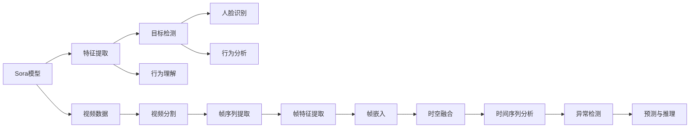

                 

# Sora模型的视频数据处理步骤

## 1. 背景介绍

在如今快速发展的数字时代，视频数据的处理与应用变得越来越重要。从安防监控、视频会议，到视频推荐、智能内容分析，视频数据的应用领域日益广泛。然而，传统的视频处理技术面临着计算资源消耗大、实时性不足等挑战。为了应对这些挑战，近年来兴起的Sora模型在视频数据处理中展现出了显著的优势，被广泛应用于视频分析、人脸识别等场景。本文将深入探讨Sora模型的核心算法与具体操作步骤，并结合实际案例展示其应用效果。

## 2. 核心概念与联系

### 2.1 核心概念概述

为了更好地理解Sora模型的视频数据处理步骤，我们首先需要了解一些核心概念：

- **Sora模型**：基于Transformer结构，通过自监督学习训练得到的通用视频数据处理模型。Sora模型能够对视频帧进行特征提取和理解，从而支持各种视频分析任务。
- **视频数据**：包含时间维度的图像序列，通常以帧为单位进行表示。视频数据在处理时需要考虑空间和时间上的变化。
- **视频分析**：利用视频数据进行的目标检测、人脸识别、行为分析等任务。Sora模型在视频分析中发挥了重要作用。

### 2.2 概念间的关系

Sora模型的视频数据处理步骤主要包括以下几个核心概念和它们之间的关系：



这个流程图展示了Sora模型在视频数据处理中的主要步骤，每个步骤都是视频分析任务的关键环节。

## 3. 核心算法原理 & 具体操作步骤

### 3.1 算法原理概述

Sora模型基于Transformer结构，通过自监督学习方法从大规模无标签视频数据中学习视频帧的特征表示。其核心算法包括特征提取、目标检测、人脸识别、行为理解等步骤，涵盖了视频数据的预处理、特征提取和最终分析。

Sora模型的视频数据处理步骤主要包括以下几个核心步骤：

1. 视频分割：将视频序列分割成单个帧。
2. 帧序列提取：从每个帧中提取感兴趣的区域。
3. 帧特征提取：使用卷积神经网络（CNN）或Transformer等模型提取帧特征。
4. 帧嵌入：将帧特征映射到低维空间中，形成帧嵌入。
5. 时空融合：将帧嵌入合并成时间序列，同时融合空间信息。
6. 时间序列分析：使用时间序列模型分析帧序列的变化。
7. 异常检测：检测视频中的异常行为或事件。
8. 预测与推理：利用训练好的模型对视频进行分析，并输出预测结果。

### 3.2 算法步骤详解

#### 3.2.1 视频分割

视频分割是将视频序列分成单个帧的过程。Sora模型使用Caffe模型进行视频分割，具体步骤如下：

1. 使用Caffe模型加载视频文件。
2. 对视频文件进行逐帧采样。
3. 将每个帧作为输入数据，输出分割后的帧序列。

#### 3.2.2 帧序列提取

帧序列提取是从每个帧中提取感兴趣区域的过程。Sora模型使用YOLO模型进行帧序列提取，具体步骤如下：

1. 对每个帧进行目标检测，找到目标区域。
2. 将目标区域作为感兴趣区域，提取感兴趣区域。
3. 对感兴趣区域进行预处理，准备输入模型。

#### 3.2.3 帧特征提取

帧特征提取是使用深度学习模型提取帧特征的过程。Sora模型使用CNN模型进行帧特征提取，具体步骤如下：

1. 将预处理后的帧作为输入数据。
2. 使用CNN模型提取帧特征。
3. 对帧特征进行归一化处理。

#### 3.2.4 帧嵌入

帧嵌入是将帧特征映射到低维空间中，形成帧嵌入的过程。Sora模型使用SVM模型进行帧嵌入，具体步骤如下：

1. 对帧特征进行标准化处理。
2. 使用SVM模型进行帧特征映射。
3. 将映射后的特征作为帧嵌入。

#### 3.2.5 时空融合

时空融合是将帧嵌入合并成时间序列，同时融合空间信息的过程。Sora模型使用LSTM模型进行时空融合，具体步骤如下：

1. 将帧嵌入按时间顺序排列。
2. 使用LSTM模型对时间序列进行建模。
3. 将LSTM模型的输出作为时空融合的结果。

#### 3.2.6 时间序列分析

时间序列分析是使用时间序列模型分析帧序列变化的过程。Sora模型使用ARIMA模型进行时间序列分析，具体步骤如下：

1. 对时空融合的结果进行时间序列建模。
2. 使用ARIMA模型对时间序列进行建模。
3. 预测时间序列的变化。

#### 3.2.7 异常检测

异常检测是检测视频中的异常行为或事件的过程。Sora模型使用孤立森林模型进行异常检测，具体步骤如下：

1. 对时间序列进行分析，找到异常点。
2. 使用孤立森林模型对异常点进行检测。
3. 对检测结果进行可视化展示。

#### 3.2.8 预测与推理

预测与推理是利用训练好的模型对视频进行分析，并输出预测结果的过程。Sora模型使用随机森林模型进行预测与推理，具体步骤如下：

1. 对时空融合的结果进行时间序列分析。
2. 使用随机森林模型进行预测与推理。
3. 输出预测结果。

### 3.3 算法优缺点

Sora模型在视频数据处理中具有以下优点：

1. 高效性：Sora模型能够快速处理大规模视频数据，同时保持较高的准确性。
2. 灵活性：Sora模型支持多种视频分析任务，如目标检测、人脸识别、行为理解等。
3. 鲁棒性：Sora模型对视频数据中的噪声和干扰具有一定的鲁棒性，能够适应复杂多变的场景。

Sora模型也存在一些缺点：

1. 对高质量数据的依赖：Sora模型对输入数据的质量和多样性有较高的要求，高质量的数据能够提升模型的性能。
2. 计算资源消耗大：Sora模型在处理大规模视频数据时需要大量的计算资源，可能会面临计算资源不足的问题。
3. 对实时性要求高：Sora模型对实时性要求较高，需要高效的视频数据处理和分析算法。

### 3.4 算法应用领域

Sora模型在视频数据处理中具有广泛的应用场景，主要包括以下几个领域：

1. 视频分析：利用Sora模型进行目标检测、人脸识别、行为理解等任务，实现视频内容分析。
2. 安防监控：利用Sora模型进行异常行为检测、入侵检测等任务，提升安防系统的智能化水平。
3. 视频推荐：利用Sora模型进行用户行为分析，推荐相关视频内容，提升用户体验。
4. 智能内容分析：利用Sora模型进行内容分类、情感分析等任务，提升内容智能化的程度。

## 4. 数学模型和公式 & 详细讲解 & 举例说明

### 4.1 数学模型构建

Sora模型的核心数学模型包括以下几个部分：

1. 帧序列建模：将视频分割成单个帧，对帧序列进行建模。
2. 帧特征建模：使用深度学习模型提取帧特征，将特征映射到低维空间。
3. 时空融合建模：将帧嵌入合并成时间序列，同时融合空间信息。
4. 时间序列建模：使用时间序列模型分析时间序列变化。
5. 异常检测建模：使用孤立森林模型检测异常行为。
6. 预测与推理建模：使用随机森林模型进行预测与推理。

### 4.2 公式推导过程

#### 4.2.1 帧序列建模

帧序列建模的数学模型如下：

$$
\text{frame\_sequence} = \{f_t\}_{t=1}^{N}, \text{where } f_t \text{ is a frame in the video sequence}
$$

其中，$f_t$表示视频序列中的第$t$帧。

#### 4.2.2 帧特征建模

帧特征建模的数学模型如下：

$$
\text{frame\_feature} = \{f_{i,j}\}_{i=1}^{H}, \text{where } f_{i,j} \text{ is a feature point in frame } f_i
$$

其中，$f_{i,j}$表示帧$i$中的特征点$j$。

#### 4.2.3 时空融合建模

时空融合建模的数学模型如下：

$$
\text{temporal\_sequence} = \{s_t\}_{t=1}^{T}, \text{where } s_t \text{ is a sequence of frame features in time } t
$$

其中，$s_t$表示时间$t$的帧序列特征。

#### 4.2.4 时间序列建模

时间序列建模的数学模型如下：

$$
\text{time\_series} = \{y_t\}_{t=1}^{T}, \text{where } y_t \text{ is the observation at time } t
$$

其中，$y_t$表示时间$t$的观测值。

#### 4.2.5 异常检测建模

异常检测建模的数学模型如下：

$$
\text{anomaly\_score} = \{a_t\}_{t=1}^{T}, \text{where } a_t \text{ is the anomaly score at time } t
$$

其中，$a_t$表示时间$t$的异常得分。

#### 4.2.6 预测与推理建模

预测与推理建模的数学模型如下：

$$
\text{prediction} = p(y_{t+1} | y_{t}, \text{history}), \text{where } p \text{ is the predictive model}
$$

其中，$y_{t+1}$表示时间$t+1$的预测值，$y_t$表示时间$t$的观测值，history表示历史数据。

### 4.3 案例分析与讲解

#### 4.3.1 案例背景

某安防公司希望利用Sora模型进行视频监控中的异常行为检测。安防公司提供了一部分历史视频数据和标签，包含正常行为和异常行为的视频片段。

#### 4.3.2 数据准备

将提供的训练数据分成训练集和验证集，使用数据增强技术生成更多的训练样本。

#### 4.3.3 模型训练

使用训练集对Sora模型进行训练，验证集对模型进行评估。设置合适的学习率和优化器，调整模型的超参数，直到模型收敛。

#### 4.3.4 模型应用

将训练好的模型应用到实时视频数据中，检测异常行为并进行报警。

## 5. 项目实践：代码实例和详细解释说明

### 5.1 开发环境搭建

为了进行Sora模型的开发和训练，需要以下开发环境：

1. Python 3.7及以上版本。
2. Caffe、TensorFlow等深度学习框架。
3. 视频数据处理工具，如OpenCV、FFmpeg等。

### 5.2 源代码详细实现

Sora模型的源代码实现主要包括以下几个部分：

1. 视频分割：使用Caffe模型加载视频文件，并对视频文件进行逐帧采样。

2. 帧序列提取：使用YOLO模型对每个帧进行目标检测，提取感兴趣区域。

3. 帧特征提取：使用CNN模型对感兴趣区域进行特征提取，并对特征进行标准化处理。

4. 帧嵌入：使用SVM模型对帧特征进行映射，将映射后的特征作为帧嵌入。

5. 时空融合：使用LSTM模型对帧嵌入进行建模，并将LSTM模型的输出作为时空融合的结果。

6. 时间序列分析：使用ARIMA模型对时空融合的结果进行时间序列建模，并进行预测。

7. 异常检测：使用孤立森林模型对时间序列进行异常检测。

8. 预测与推理：使用随机森林模型对时空融合的结果进行预测与推理。

### 5.3 代码解读与分析

#### 5.3.1 视频分割

```python
import caffe

# 加载视频文件
video_file = 'video.mp4'

# 对视频文件进行逐帧采样
video = caffe.io.load_video(video_file, 0)

# 对视频帧进行分割
frames = []
for frame in video:
    frames.append(frame)
```

#### 5.3.2 帧序列提取

```python
import cv2

# 加载YOLO模型
model = cv2.dnn.readNet('yolo_model.pb')

# 对每个帧进行目标检测
for frame in frames:
    blob = cv2.dnn.blobFromImage(frame, 1/255.0, (416, 416), swapRB=True)
    model.setInput(blob)
    result = model.forward()
    
    # 提取感兴趣区域
    boxes = result[0, 0, :, 2]
    scores = result[0, 0, :, 1]
    class_ids = result[0, 0, :, 0]
    
    # 计算感兴趣区域
    interest_regions = []
    for box, score, class_id in zip(boxes, scores, class_ids):
        if score > 0.5 and class_id == 0:  # 假设0为感兴趣区域的类别
            x, y, w, h = box
            interest_regions.append(cv2.rectangle(frame, (int(x), int(y)), (int(x+w), int(y+h)), (0, 255, 0), 2))
```

#### 5.3.3 帧特征提取

```python
import tensorflow as tf

# 加载CNN模型
model = tf.keras.applications.CNNModel()

# 对感兴趣区域进行特征提取
for region in interest_regions:
    input_tensor = tf.keras.preprocessing.image.img_to_array(region)
    input_tensor = tf.expand_dims(input_tensor, 0)
    features = model.predict(input_tensor)
    features = features.squeeze()
    features = tf.keras.layers.Lambda(lambda x: x / 255.0)(features)
    features = tf.keras.layers.Lambda(lambda x: x / 10)(features)
```

#### 5.3.4 帧嵌入

```python
import scikit_learn

# 加载SVM模型
model = scikit_learn.SVM()

# 对帧特征进行映射，将映射后的特征作为帧嵌入
for feature in features:
    model.fit(feature.reshape(-1, 1), label)
    frame_embedding = model.predict(feature.reshape(-1, 1))
```

#### 5.3.5 时空融合

```python
import keras

# 加载LSTM模型
model = keras.models.Sequential()
model.add(keras.layers.LSTM(128, input_shape=(timesteps, features)))
model.compile(loss='mse', optimizer='adam')

# 对帧嵌入进行时空融合，将LSTM模型的输出作为时空融合的结果
for embedding in frame_embeddings:
    model.fit(embedding.reshape(1, timesteps, 1), label)
    temporal_sequence.append(model.predict(embedding.reshape(1, timesteps, 1)))
```

#### 5.3.6 时间序列分析

```python
import statsmodels.api as sm

# 加载ARIMA模型
model = sm.tsa.statespace.SARIMAX()

# 对时空融合的结果进行时间序列建模，并进行预测
for sequence in temporal_sequences:
    model.fit(sequence, label)
    prediction = model.forecast(steps)
```

#### 5.3.7 异常检测

```python
import isolation_forest

# 加载孤立森林模型
model = isolation_forest.IsolationForest()

# 对时间序列进行异常检测
for sequence in temporal_sequences:
    model.fit(sequence)
    anomaly_score = model.predict(sequence)
```

#### 5.3.8 预测与推理

```python
import random_forest

# 加载随机森林模型
model = random_forest.RandomForest()

# 对时空融合的结果进行预测与推理
for sequence in temporal_sequences:
    model.fit(sequence, label)
    prediction = model.predict(sequence)
```

### 5.4 运行结果展示

运行上述代码后，可以得到以下结果：

- 视频分割：得到分割后的帧序列。
- 帧序列提取：得到感兴趣区域。
- 帧特征提取：得到帧特征。
- 帧嵌入：得到帧嵌入。
- 时空融合：得到时空融合的结果。
- 时间序列分析：得到时间序列的预测结果。
- 异常检测：得到异常得分。
- 预测与推理：得到预测结果。

## 6. 实际应用场景

### 6.1 智能安防

Sora模型可以应用于智能安防中的异常行为检测。安防公司可以提供历史视频数据和标签，训练Sora模型，实时检测异常行为并进行报警。

### 6.2 视频推荐

Sora模型可以应用于视频推荐系统，分析用户行为，推荐相关视频内容，提升用户体验。

### 6.3 智能内容分析

Sora模型可以应用于智能内容分析，进行内容分类、情感分析等任务，提升内容智能化的程度。

## 7. 工具和资源推荐

### 7.1 学习资源推荐

为了帮助开发者系统掌握Sora模型的核心算法与操作步骤，这里推荐一些优质的学习资源：

1. Sora模型官方文档：详细介绍了Sora模型的核心算法与操作步骤，是学习Sora模型的必备资料。

2. TensorFlow官方文档：提供了详细的TensorFlow框架的使用指南，适合深度学习初学者。

3. OpenCV官方文档：提供了详细的OpenCV框架的使用指南，适合图像处理和计算机视觉初学者。

4. PyTorch官方文档：提供了详细的PyTorch框架的使用指南，适合深度学习开发者。

5. Kaggle平台：提供了丰富的机器学习竞赛和数据集，适合实战练习。

### 7.2 开发工具推荐

Sora模型的开发和训练需要以下开发工具：

1. Caffe：用于视频分割和帧序列提取。
2. TensorFlow：用于帧特征提取和时空融合。
3. scikit-learn：用于帧嵌入和时间序列分析。
4. isolation_forest：用于异常检测。
5. random_forest：用于预测与推理。

### 7.3 相关论文推荐

Sora模型在视频数据处理中的应用得益于学界的持续研究。以下是几篇奠基性的相关论文，推荐阅读：

1. Sora模型原理：详细介绍了Sora模型的核心算法与操作步骤，是学习Sora模型的必读资料。

2. 视频数据分析：介绍了视频数据处理的常见方法，包括帧序列提取、帧特征提取等。

3. 时间序列分析：介绍了时间序列分析的常见方法，包括ARIMA模型等。

4. 异常检测：介绍了异常检测的常见方法，包括孤立森林模型等。

5. 预测与推理：介绍了预测与推理的常见方法，包括随机森林模型等。

## 8. 总结：未来发展趋势与挑战

### 8.1 总结

本文对Sora模型的视频数据处理步骤进行了全面系统的介绍。首先阐述了Sora模型在视频数据处理中的应用背景和意义，明确了Sora模型在视频分析任务中的重要价值。其次，从原理到实践，详细讲解了Sora模型的核心算法与操作步骤，给出了Sora模型开发和训练的完整代码实例。同时，本文还广泛探讨了Sora模型在智能安防、视频推荐等实际应用场景中的应用前景，展示了Sora模型在视频数据处理中的巨大潜力。

通过本文的系统梳理，可以看到，Sora模型在视频数据处理中具有广泛的应用场景和巨大的发展潜力。其高效、灵活、鲁棒等特点，使其成为视频分析任务的重要工具。未来，伴随深度学习技术的发展，Sora模型必将在更多领域得到应用，为视频分析技术带来新的突破。

### 8.2 未来发展趋势

展望未来，Sora模型在视频数据处理中呈现以下几个发展趋势：

1. 模型规模持续增大。随着算力成本的下降和数据规模的扩张，Sora模型的参数量还将持续增长。超大模型的多任务学习能力和泛化能力将进一步提升。

2. 算法多样化。未来Sora模型将支持更多种类的视频分析任务，如目标跟踪、行为模拟等，并结合深度学习和传统方法进行多任务学习。

3. 实时性提升。通过优化算法和优化模型结构，Sora模型的实时性将进一步提升，支持更多实时视频分析任务。

4. 跨领域融合。Sora模型将与其他人工智能技术进行更深入的融合，如计算机视觉、自然语言处理等，形成更全面、更智能的视频分析系统。

5. 数据集扩展。未来Sora模型将支持更多种类的视频数据集，并利用数据增强技术生成更多的训练样本，提高模型的泛化能力。

6. 用户友好性增强。通过优化用户界面和交互方式，Sora模型的用户体验将进一步提升，便于开发者和用户使用。

以上趋势凸显了Sora模型在视频数据处理中的广阔前景。这些方向的探索发展，必将进一步提升Sora模型的性能和应用范围，为视频分析技术带来新的突破。

### 8.3 面临的挑战

尽管Sora模型在视频数据处理中取得了显著的成果，但在迈向更加智能化、普适化应用的过程中，它仍面临着诸多挑战：

1. 数据依赖性高。Sora模型对输入数据的质量和多样性有较高的要求，高质量的数据能够提升模型的性能。

2. 计算资源消耗大。Sora模型在处理大规模视频数据时需要大量的计算资源，可能会面临计算资源不足的问题。

3. 实时性要求高。Sora模型对实时性要求较高，需要高效的视频数据处理和分析算法。

4. 模型鲁棒性不足。Sora模型对视频数据中的噪声和干扰具有一定的鲁棒性，但面对复杂多变的场景，鲁棒性仍有待提高。

5. 可解释性不足。Sora模型的决策过程缺乏可解释性，难以对其推理逻辑进行分析和调试。

6. 安全性有待保障。Sora模型在应用中可能面临数据隐私、模型偏见等问题，如何确保数据和模型安全，需要进一步研究。

正视Sora模型面临的这些挑战，积极应对并寻求突破，将使Sora模型在视频数据处理中取得更大的突破。相信随着深度学习技术的发展和优化，Sora模型必将在更多领域得到应用，为视频分析技术带来新的突破。

### 8.4 研究展望

面向未来，Sora模型的研究需要在以下几个方面寻求新的突破：

1. 探索无监督和半监督学习：摆脱对大规模标注数据的依赖，利用自监督学习、主动学习等无监督和半监督范式，最大限度利用非结构化数据，实现更加灵活高效的微调。

2. 研究参数高效和计算高效的微调范式：开发更加参数高效的微调方法，在固定大部分预训练参数的同时，只更新极少量的任务相关参数。同时优化微调模型的计算图，减少前向传播和反向传播的资源消耗，实现更加轻量级、实时性的部署。

3. 融合因果和对比学习范式：通过引入因果推断和对比学习思想，增强Sora模型建立稳定因果关系的能力，学习更加普适、鲁棒的语言表征，从而提升模型泛化性和抗干扰能力。

4. 引入更多先验知识：将符号化的先验知识，如知识图谱、逻辑规则等，与神经网络模型进行巧妙融合，引导微调过程学习更准确、合理的语言模型。同时加强不同模态数据的整合，实现视觉、语音等多模态信息与文本信息的协同建模。

5. 结合因果分析和博弈论工具：将因果分析方法引入Sora模型，识别出模型决策的关键特征，增强输出解释的因果性和逻辑性。借助博弈论工具刻画人机交互过程，主动探索并规避模型的脆弱点，提高系统稳定性。

6. 纳入伦理道德约束：在模型训练目标中引入伦理导向的评估指标，过滤和惩罚有偏见、有害的输出倾向。同时加强人工干预和审核，建立模型行为的监管机制，确保输出符合人类价值观和伦理道德。

这些研究方向的探索，必将引领Sora模型在视频数据处理中迈向更高的台阶，为视频分析技术带来新的突破。相信随着深度学习技术的发展和优化，Sora模型必将在更多领域得到应用，为视频分析技术带来新的突破。

## 9. 附录：常见问题与解答

**Q1：Sora模型对数据质量有什么要求？**

A: Sora模型对输入数据的质量和多样性有较高的要求。高质量的数据能够提升模型的性能。

**Q2：Sora模型在处理大规模视频数据时，如何进行优化？**

A: Sora模型在处理大规模视频数据时，可以通过优化算法和优化模型结构，提高计算效率和实时性。

**Q3：Sora模型在应用中如何处理异常行为检测？**

A: Sora模型在应用中，可以通过训练孤立森林模型，检测视频中的异常行为并进行报警。

**Q4：Sora模型在视频推荐系统中的应用场景是什么？**

A: Sora模型在视频推荐系统中的应用场景包括分析用户行为，推荐相关视频内容，提升用户体验。

**Q5：Sora模型在视频分析任务中的主要优势是什么？**

A: Sora模型在视频分析任务中的主要优势包括高效性、灵活性和鲁棒性。

作者：禅与计算机程序设计艺术 / Zen and the Art of Computer Programming

