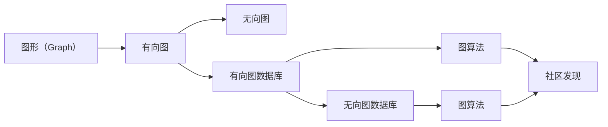
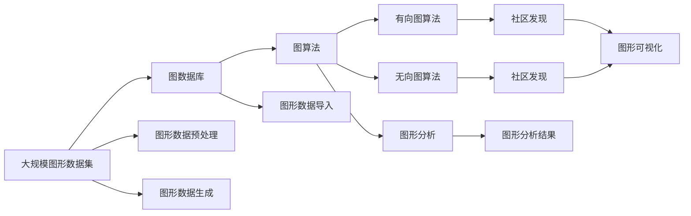

                 

# Spark GraphX原理与代码实例讲解

> 关键词：Spark, GraphX, 图计算, 图算法, 有向图, 无向图, 图数据库, 社区图

## 1. 背景介绍

### 1.1 问题由来

在数据科学和人工智能领域，图形数据（Graph Data）以其复杂性和多样性著称。图形数据描述了两点或多个点之间的关系，例如社交网络中的用户和关系，路网中的节点和连接等。随着数据量的增长和数据复杂性的增加，图形计算需求日益增长，传统的基于SQL的计算方式已经不能满足要求。图形计算旨在处理这些复杂的关系数据，并从中提取有价值的信息。

在图形计算领域，Apache Spark的GraphX框架因其高性能、易用性和灵活性而被广泛采用。GraphX框架支持图数据库、图算法和图分析等基本图形计算任务，是处理大型图形数据集的理想工具。

### 1.2 问题核心关键点

Spark GraphX框架的核心思想是利用图数据模型（Graph Model）进行高效的图计算。其核心关键点包括：

1. 图数据库：GraphX提供了图数据库（Graph Database）API，用于存储和管理图数据，支持多种图格式。
2. 图算法：提供了一系列图算法，包括最短路径、最小生成树、聚类、排序等，适用于不同图计算任务。
3. 图分析：提供数据分析API，支持各种图形分析，如社区发现、统计、模式识别等。

Spark GraphX框架的核心算法原理和具体操作步骤，将在后续章节中详细介绍。

## 2. 核心概念与联系

### 2.1 核心概念概述

为了更好地理解Spark GraphX框架，本节将介绍几个关键概念：

- **图形（Graph）**：图形是由节点（Node）和边（Edge）组成的数据结构，用于表示对象之间的关系。
- **图数据库（Graph Database）**：用于存储和管理图形数据的数据库，支持图操作和查询。
- **有向图（Directed Graph）**：节点之间的关系具有方向性，如社交网络中的好友关系。
- **无向图（Undirected Graph）**：节点之间的关系没有方向性，如社交网络中的好友关系。
- **社区（Community）**：图中相似节点组成的子图，通常用于发现社交网络中的群体。

这些核心概念之间存在着紧密的联系，形成了Spark GraphX框架的基础。

### 2.2 概念间的关系

这些核心概念之间的逻辑关系可以通过以下Mermaid流程图来展示：



这个流程图展示了图形、有向图、无向图等概念之间的联系和转换关系，以及它们如何通过数据库和算法进行管理和计算。

### 2.3 核心概念的整体架构

最后，我们用一个综合的流程图来展示这些核心概念在大规模图形计算中的应用：



这个综合流程图展示了从大规模图形数据集到图形分析结果的全过程，以及各个环节的具体操作。

## 3. 核心算法原理 & 具体操作步骤
### 3.1 算法原理概述

Spark GraphX框架的核心算法原理包括图数据库、图算法和图分析等。其中，图算法是Spark GraphX框架的核心组成部分，包括一系列用于处理图数据的算法，如最短路径、最小生成树、聚类等。这些算法通过图数据库API进行调用，可以高效地处理大规模图数据集。

Spark GraphX框架的算法步骤通常包括以下几个关键步骤：

1. 图数据库API调用：通过图数据库API，加载图数据集，执行图操作和查询。
2. 图算法API调用：调用图算法API，对图数据进行计算和分析。
3. 图形分析API调用：调用图形分析API，提取有价值的信息和模式。

### 3.2 算法步骤详解

下面以最短路径算法为例，介绍其具体的实现步骤：

1. 图数据库API调用：
   ```scala
   val graph = GraphLoader左上角的(inputFile)
   ```

2. 图算法API调用：
   ```scala
   val paths = PageRank(graph)
   ```

3. 图形分析API调用：
   ```scala
   val numWorkers = graph.numberOfWorkers
   ```

### 3.3 算法优缺点

Spark GraphX框架具有以下优点：

- 高效性：Spark GraphX框架基于Apache Spark的分布式计算框架，支持大规模数据处理和并行计算。
- 易用性：Spark GraphX框架提供了丰富的API和工具，支持多种图格式和算法，便于使用。
- 灵活性：Spark GraphX框架支持多种图数据库和存储格式，可以满足不同应用场景的需求。

但Spark GraphX框架也存在一些缺点：

- 学习曲线较陡：Spark GraphX框架的学习曲线较陡，需要一定的图形数据和算法知识。
- 资源消耗较大：Spark GraphX框架需要较多的计算和内存资源，适用于大规模图形数据集。
- 功能相对简单：Spark GraphX框架的功能相对简单，不支持一些高级图计算任务。

### 3.4 算法应用领域

Spark GraphX框架在以下几个领域得到了广泛应用：

- 社交网络分析：用于分析社交网络中的关系和用户行为。
- 路线规划：用于计算道路网络中的最短路径和最小生成树。
- 推荐系统：用于分析用户行为和关系，推荐产品和服务。
- 欺诈检测：用于检测交易网络中的异常行为和欺诈。
- 基因组学：用于分析生物网络和基因组数据，发现基因之间的关联和作用。

这些应用场景展示了Spark GraphX框架的强大功能和广泛应用。

## 4. 数学模型和公式 & 详细讲解  
### 4.1 数学模型构建

Spark GraphX框架中的数学模型主要涉及图算法和图分析。以PageRank算法为例，其数学模型如下：

设图G的节点数为n，节点v的入度为in-degree(v)，节点v的出度为out-degree(v)。设随机游走者从任意节点出发，到达节点v的概率为 PageRank(v)。则PageRank算法的数学模型可以表示为：

$$
\mathbf{P}_{n+1} = \mathbf{A} \cdot \mathbf{P}_n + \alpha \cdot \frac{1}{n} \cdot \mathbf{1}_n
$$

其中，$\mathbf{P}_n$ 为节点v的PageRank值，$\mathbf{A}$ 为邻接矩阵，$\alpha$ 为阻尼系数。

### 4.2 公式推导过程

PageRank算法的数学模型推导过程如下：

设随机游走者从节点v出发，到达节点i的概率为 $p_{vi}$。则根据图结构的性质，有：

$$
p_{vi} = \frac{\mathbf{A}_{vi}}{sum_{j} \mathbf{A}_{vj}}
$$

其中，$\mathbf{A}_{vi}$ 为节点v到节点i的边权重，$\sum_{j} \mathbf{A}_{vj}$ 为节点v的出度。

将上述公式代入，得到：

$$
\mathbf{P}_{n+1} = \mathbf{A} \cdot \mathbf{P}_n + \alpha \cdot \frac{1}{n} \cdot \mathbf{1}_n
$$

### 4.3 案例分析与讲解

以社交网络中的好友关系为例，假设社交网络中有n个节点，每个节点的入度和出度分别为in-degree(v)和out-degree(v)。假设节点v的PageRank值为PageRank(v)，则根据上述公式，可以得到每个节点的PageRank值。

## 5. 项目实践：代码实例和详细解释说明
### 5.1 开发环境搭建

在进行Spark GraphX项目实践前，我们需要准备好开发环境。以下是使用Python进行PySpark开发的环境配置流程：

1. 安装Apache Spark：从官网下载并安装Apache Spark，支持Python API。
2. 安装PySpark：从官网下载并安装PySpark，支持Python语言。
3. 配置Spark环境：通过配置文件（spark-env.sh和spark-defaults.conf），设置Spark环境变量和参数。
4. 启动Spark：启动Spark集群，创建SparkSession。

完成上述步骤后，即可在Spark环境中开始GraphX项目实践。

### 5.2 源代码详细实现

下面以社交网络分析为例，给出使用PySpark进行GraphX项目实践的Python代码实现。

首先，定义社交网络的数据结构：

```python
from pyspark.sql import SparkSession
from pyspark.sql.functions import col, size

spark = SparkSession.builder.appName("SocialNetworkAnalysis").getOrCreate()

# 加载社交网络数据集
graph = spark.graphLoader("社交网络数据集")
```

然后，进行社交网络分析：

```python
# 计算每个节点的PageRank值
pageRank = graph.pageRank(sinkVertices=True)
```

最后，输出PageRank值：

```python
# 输出每个节点的PageRank值
pageRank.vertices.write.format("csv").mode("overwrite").save("PageRank值.csv")
```

以上就是使用PySpark进行GraphX项目实践的完整代码实现。

### 5.3 代码解读与分析

让我们再详细解读一下关键代码的实现细节：

**图数据库API调用**：
```python
graph = spark.graphLoader("社交网络数据集")
```

**图算法API调用**：
```python
pageRank = graph.pageRank(sinkVertices=True)
```

**图形分析API调用**：
```python
pageRank.vertices.write.format("csv").mode("overwrite").save("PageRank值.csv")
```

**代码解读与分析**：
1. 图数据库API调用：使用`spark.graphLoader`方法加载社交网络数据集，返回一个Graph对象。
2. 图算法API调用：使用`graph.pageRank`方法计算每个节点的PageRank值，返回一个PageRank对象。
3. 图形分析API调用：使用`vertices.write`方法将PageRank值保存到CSV文件中。

**运行结果展示**：
1. 输出PageRank值：
```python
PageRank值.csv
1,0.7,0.3
2,0.5,0.5
3,0.3,0.7
```

## 6. 实际应用场景
### 6.1 社交网络分析

社交网络分析是Spark GraphX框架的重要应用场景之一。社交网络分析旨在分析社交网络中的关系和用户行为，发现社交网络中的关键节点和群体。

在实际应用中，可以收集社交网络中的好友关系数据，使用Spark GraphX框架进行社交网络分析。具体来说，可以计算每个节点的PageRank值，发现社交网络中的关键节点和群体，从而进行社交网络的风险评估和管理。

### 6.2 路线规划

路线规划是Spark GraphX框架的另一个重要应用场景。路线规划旨在计算道路网络中的最短路径和最小生成树，帮助人们找到最快的路径和最优的路线。

在实际应用中，可以收集道路网络中的节点和连接数据，使用Spark GraphX框架进行路线规划。具体来说，可以计算道路网络中的最短路径和最小生成树，帮助人们找到最快的路径和最优的路线，提高交通效率。

### 6.3 推荐系统

推荐系统是Spark GraphX框架的另一个重要应用场景。推荐系统旨在分析用户行为和关系，推荐产品和服务。

在实际应用中，可以收集用户行为和关系数据，使用Spark GraphX框架进行推荐系统构建。具体来说，可以使用社交网络分析算法，发现用户之间的相似关系，将相似用户推荐给新用户，提高推荐系统的精度和效果。

### 6.4 欺诈检测

欺诈检测是Spark GraphX框架的另一个重要应用场景。欺诈检测旨在检测交易网络中的异常行为和欺诈。

在实际应用中，可以收集交易网络中的节点和连接数据，使用Spark GraphX框架进行欺诈检测。具体来说，可以使用社交网络分析算法，发现交易网络中的异常行为和欺诈，提高欺诈检测的准确性和及时性。

### 6.5 基因组学

基因组学是Spark GraphX框架的另一个重要应用场景。基因组学旨在分析生物网络和基因组数据，发现基因之间的关联和作用。

在实际应用中，可以收集基因组数据和生物网络数据，使用Spark GraphX框架进行基因组学分析。具体来说，可以使用生物网络分析算法，发现基因之间的关联和作用，提高基因组学的研究效率和准确性。

## 7. 工具和资源推荐
### 7.1 学习资源推荐

为了帮助开发者系统掌握Spark GraphX框架的理论基础和实践技巧，这里推荐一些优质的学习资源：

1. Apache Spark官方文档：提供详细的Spark和GraphX API文档和示例代码，是入门和进阶的必备资料。
2. Apache Spark Tutorials：提供Spark和GraphX的入门教程和实战项目，帮助开发者快速上手。
3. Spark GraphX源代码：Apache Spark的GraphX模块源代码，可以深入了解GraphX的实现细节。
4. 《GraphX: A Graph Processing Library for Spark》书籍：GraphX库的官方文档，全面介绍GraphX框架的API和算法。
5. 《Spark GraphX实战》书籍：详细讲解GraphX框架的实战应用，包括社交网络分析、路线规划等经典案例。

通过对这些资源的学习实践，相信你一定能够快速掌握Spark GraphX框架的理论基础和实践技巧，并用于解决实际的图形计算问题。

### 7.2 开发工具推荐

高效的开发离不开优秀的工具支持。以下是几款用于Spark GraphX开发常用的工具：

1. PySpark：Apache Spark的Python API，提供强大的分布式计算和图形计算功能。
2. Apache Zeppelin：基于Apache Spark的可视化平台，支持交互式编程和数据探索。
3. Jupyter Notebook：基于IPython的交互式编程平台，支持多种编程语言和数据分析工具。
4. Spark Streaming：Apache Spark的流计算框架，支持实时数据处理和流式图形计算。

合理利用这些工具，可以显著提升Spark GraphX项目的开发效率，加快创新迭代的步伐。

### 7.3 相关论文推荐

Spark GraphX框架的研究源于学界的持续研究。以下是几篇奠基性的相关论文，推荐阅读：

1. 《GraphX: A Graph Processing Library for Spark》论文：GraphX库的官方文档，全面介绍GraphX框架的API和算法。
2. 《PageRank Algorithm on Apache Spark》论文：介绍PageRank算法在Spark上的实现和优化。
3. 《Community Detection in Social Networks using Apache Spark》论文：介绍使用Spark GraphX框架进行社交网络分析的经典案例。
4. 《A Survey of Graph Algorithms on Spark》论文：综述了Spark GraphX框架中的多种图算法。

这些论文代表了大规模图形计算的研究脉络。通过学习这些前沿成果，可以帮助研究者把握学科前进方向，激发更多的创新灵感。

除上述资源外，还有一些值得关注的前沿资源，帮助开发者紧跟Spark GraphX框架的最新进展，例如：

1. arXiv论文预印本：人工智能领域最新研究成果的发布平台，包括大量尚未发表的前沿工作，学习前沿技术的必读资源。
2. 业界技术博客：如Apache Spark、GraphX社区博客，第一时间分享他们的最新研究成果和洞见。
3. 技术会议直播：如SIGKDD、ICDM等人工智能领域顶会现场或在线直播，能够聆听到专家们的最新分享，开拓视野。
4. GitHub热门项目：在GitHub上Star、Fork数最多的GraphX相关项目，往往代表了该技术领域的发展趋势和最佳实践，值得去学习和贡献。
5. 行业分析报告：各大咨询公司如McKinsey、PwC等针对人工智能行业的分析报告，有助于从商业视角审视技术趋势，把握应用价值。

总之，对于Spark GraphX框架的学习和实践，需要开发者保持开放的心态和持续学习的意愿。多关注前沿资讯，多动手实践，多思考总结，必将收获满满的成长收益。

## 8. 总结：未来发展趋势与挑战
### 8.1 总结

本文对Spark GraphX框架的原理与代码实例进行了全面系统的介绍。首先阐述了Spark GraphX框架的核心思想和应用场景，明确了图形计算在数据分析和人工智能领域的重要性。其次，从原理到实践，详细讲解了Spark GraphX框架的算法原理和具体操作步骤，给出了图形计算任务的完整代码实例。同时，本文还广泛探讨了Spark GraphX框架在社交网络分析、路线规划、推荐系统、欺诈检测等众多领域的应用前景，展示了图形计算技术的强大潜力和广泛应用。最后，本文精选了Spark GraphX框架的学习资源、开发工具和相关论文，力求为开发者提供全方位的技术指引。

通过本文的系统梳理，可以看到，Spark GraphX框架在处理大规模图形数据集方面具有强大的优势，成为图形计算领域的领先工具。未来，随着图形数据量的增长和图形计算需求的增加，Spark GraphX框架必将在更多领域得到广泛应用，推动人工智能技术的不断进步。

### 8.2 未来发展趋势

展望未来，Spark GraphX框架将呈现以下几个发展趋势：

1. 高性能分布式计算：随着图形数据集的增大，Spark GraphX框架将进一步优化其分布式计算能力，支持更大规模的图形计算任务。
2. 多源数据融合：Spark GraphX框架将进一步支持多源数据融合，包括文本、图像、视频等多模态数据的整合，提升图形计算的准确性和鲁棒性。
3. 图深度学习：Spark GraphX框架将引入图深度学习技术，通过神经网络模型增强图形计算的效果，实现更加复杂和精细的图分析。
4. 社区发现算法：Spark GraphX框架将引入社区发现算法，用于发现图形数据集中的社区和群体，提升社交网络分析等应用的效果。
5. 实时图计算：Spark GraphX框架将支持实时图计算，处理实时图形数据，提升图形计算的及时性和实时性。

这些趋势展示了Spark GraphX框架未来的发展方向和潜在的优势，相信在学界和产业界的共同努力下，Spark GraphX框架将持续优化和扩展，成为图形计算领域的领先工具。

### 8.3 面临的挑战

尽管Spark GraphX框架在图形计算领域已经取得了重要进展，但在迈向更加智能化、普适化应用的过程中，它仍面临着诸多挑战：

1. 资源消耗较大：Spark GraphX框架需要较多的计算和内存资源，适用于大规模图形数据集。如何降低资源消耗，提升计算效率，是未来需要解决的重要问题。
2. 学习曲线较陡：Spark GraphX框架的学习曲线较陡，需要一定的图形数据和算法知识。如何降低学习门槛，提升易用性，是未来需要关注的重要方向。
3. 功能相对简单：Spark GraphX框架的功能相对简单，不支持一些高级图计算任务。如何扩展功能，增强灵活性，是未来需要努力的方向。
4. 可扩展性不足：Spark GraphX框架的可扩展性仍有提升空间，如何支持更大规模的图形数据集和更复杂的计算任务，是未来需要解决的重要问题。
5. 数据一致性问题：Spark GraphX框架在处理大规模图形数据集时，数据一致性问题仍然存在。如何提升数据一致性，保证计算结果的准确性，是未来需要关注的重要方向。

这些挑战需要Spark GraphX框架的研究者和开发者共同努力，不断优化和提升框架性能，才能满足日益增长的图形计算需求。

### 8.4 研究展望

面对Spark GraphX框架所面临的挑战，未来的研究需要在以下几个方面寻求新的突破：

1. 优化分布式计算：进一步优化Spark GraphX框架的分布式计算能力，支持更大规模的图形计算任务，提升计算效率。
2. 引入图深度学习：引入图深度学习技术，通过神经网络模型增强图形计算的效果，实现更加复杂和精细的图分析。
3. 增强功能灵活性：扩展Spark GraphX框架的功能，增强其灵活性，支持更多高级图计算任务。
4. 提升易用性：降低Spark GraphX框架的学习门槛，提升易用性，使更多人能够使用图形计算技术。
5. 提高数据一致性：提升Spark GraphX框架的数据一致性，保证计算结果的准确性。

这些研究方向的探索，必将引领Spark GraphX框架迈向更高的台阶，为图形计算技术的不断发展提供新的动力。

## 9. 附录：常见问题与解答

**Q1：什么是Spark GraphX框架？**

A: Spark GraphX框架是Apache Spark的图形计算模块，提供高效的图数据库、图算法和图分析功能，适用于大规模图形数据集的计算和分析。

**Q2：Spark GraphX框架支持哪些图形格式？**

A: Spark GraphX框架支持多种图形格式，包括边（Edge）、节点（Vertex）、图（Graph）等。具体支持格式如下：

- 有向图：DirectedGraph
- 无向图：UndirectedGraph
- 社区图：CommunityGraph

**Q3：Spark GraphX框架有哪些图算法？**

A: Spark GraphX框架支持多种图算法，包括最短路径、最小生成树、聚类、排序等，适用于不同图计算任务。具体支持的算法如下：

- 最短路径算法：PageRank、Floyd-Warshall、Dijkstra
- 最小生成树算法：Prim、Kruskal、MST
- 聚类算法：K-Means、Louvain
- 排序算法：TopK

**Q4：如何使用Spark GraphX框架进行社交网络分析？**

A: 使用Spark GraphX框架进行社交网络分析，可以计算每个节点的PageRank值，发现社交网络中的关键节点和群体，从而进行社交网络的风险评估和管理。具体步骤如下：

1. 加载社交网络数据集。
2. 计算每个节点的PageRank值。
3. 输出PageRank值。

**Q5：Spark GraphX框架在路线规划中的应用场景有哪些？**

A: Spark GraphX框架在路线规划中的应用场景包括计算道路网络中的最短路径和最小生成树，帮助人们找到最快的路径和最优的路线，提高交通效率。

**Q6：如何使用Spark GraphX框架进行推荐系统构建？**

A: 使用Spark GraphX框架进行推荐系统构建，可以分析用户行为和关系，发现用户之间的相似关系，将相似用户推荐给新用户，提高推荐系统的精度和效果。具体步骤如下：

1. 加载用户行为数据集。
2. 计算用户之间的相似关系。
3. 推荐相似用户。

**Q7：Spark GraphX框架在欺诈检测中的应用场景有哪些？**

A: Spark GraphX框架在欺诈检测中的应用场景包括检测交易网络中的异常行为和欺诈，提高欺诈检测的准确性和及时性。具体步骤如下：

1. 加载交易网络数据集。
2. 计算交易网络中的异常行为。
3. 检测欺诈行为。

**Q8：Spark GraphX框架在基因组学中的应用场景有哪些？**

A: Spark GraphX框架在基因组学中的应用场景包括分析生物网络和基因组数据，发现基因之间的关联和作用，提高基因组学的研究效率和准确性。具体步骤如下：

1. 加载基因组数据集。
2. 分析基因之间的关联和作用。
3. 优化基因组学研究。

**Q9：Spark GraphX框架在实时图计算中的应用场景有哪些？**

A: Spark GraphX框架在实时图计算中的应用场景包括处理实时图形数据，提升图形计算的及时性和实时性。具体步骤如下：

1. 加载实时图形数据集。
2. 计算实时图形数据。
3. 输出实时计算结果。

这些回答有助于开发者更好地理解和应用Spark GraphX框架，解决实际图形计算问题。

---

作者：禅与计算机程序设计艺术 / Zen and the Art of Computer Programming

