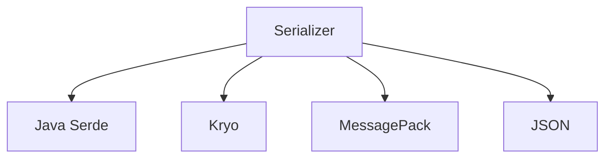

                 

# Spark Serializer原理与代码实例讲解

> 关键词：Spark, Serializer, 序列化, 反序列化, 代码实例, 实现原理, 应用场景

## 1. 背景介绍

### 1.1 问题由来

在现代分布式计算系统中，数据传输和存储是不可或缺的一部分。由于不同节点间的内存大小和数据类型可能不同，数据需要在节点间传输和存储时进行序列化和反序列化处理。Spark作为Apache基金会开源的快速通用集群计算系统，支持大规模数据处理，因此在序列化和反序列化处理上有很高的要求。

Spark的序列化模块支持多种序列化方案，如Java Serde、Kryo、MessagePack、JSON等，以适应不同的场景和数据类型。为了提升序列化和反序列化的效率和可控性，Spark引入了Serializer接口和实现类，用于定义序列化和反序列化的方法和规范。

### 1.2 问题核心关键点

Spark的Serializer接口定义了序列化和反序列化的方法和规范，用于支持数据的跨节点传输和持久化。Spark通过Serializer接口提供的序列化和反序列化方法，实现数据的压缩、加密、分块等处理。Spark的Serializer实现类包括Java Serde、Kryo、MessagePack、JSON等，这些实现类分别对应不同的序列化方案。

Spark的Serializer接口和实现类紧密联系，共同构成了Spark的序列化和反序列化体系，支持数据的灵活传输和存储，提升系统的效率和可控性。

## 2. 核心概念与联系

### 2.1 核心概念概述

为了更好地理解Spark的Serializer接口和实现类，本节将介绍几个密切相关的核心概念：

- Serializer：Spark的Serializer接口定义了序列化和反序列化的方法和规范，用于支持数据的跨节点传输和持久化。
- Java Serde：Spark的一个Serializer实现类，支持Java对象序列化和反序列化。
- Kryo：Spark的另一个Serializer实现类，支持二进制数据序列化和反序列化，适用于大部分类型的数据。
- MessagePack：Spark的Serializer实现类，支持二进制序列化和反序列化，适用于网络传输和序列化数据的持久化。
- JSON：Spark的Serializer实现类，支持JSON格式数据的序列化和反序列化。

这些核心概念之间的逻辑关系可以通过以下Mermaid流程图来展示：



这个流程图展示了Spark的Serializer接口与其多种实现类之间的关系：

1. Serializer接口定义了序列化和反序列化的规范和方法。
2. Java Serde、Kryo、MessagePack、JSON等实现类继承自Serializer接口，分别实现了不同的序列化和反序列化方案。

### 2.2 概念间的关系

这些核心概念之间存在着紧密的联系，形成了Spark的序列化和反序列化体系。

1. Serializer接口是序列化和反序列化规范和方法的抽象定义，通过它来统一管理和调度不同实现类。
2. Java Serde、Kryo、MessagePack、JSON等实现类继承自Serializer接口，并提供了具体的序列化和反序列化实现，适用于不同的数据类型和传输场景。
3. 不同的Serializer实现类可以通过Serializer接口进行调用和转换，灵活配置序列化和反序列化方案。

这些概念共同构成了Spark的序列化和反序列化生态系统，支持数据的灵活传输和存储，提升系统的效率和可控性。

## 3. 核心算法原理 & 具体操作步骤
### 3.1 算法原理概述

Spark的Serializer接口和实现类通过定义序列化和反序列化的方法，实现了数据的跨节点传输和持久化。具体来说，Serializer接口提供了两个主要的方法：

1. `serialize`: 将数据序列化为字节数组，支持压缩、加密等处理。
2. `deserialize`: 将字节数组反序列化为数据，支持分块、解密等处理。

通过这些方法，Spark能够灵活地控制数据的序列化和反序列化过程，提升系统的效率和可控性。

### 3.2 算法步骤详解

Spark的序列化和反序列化过程通常包括以下几个关键步骤：

1. 选择合适的Serializer实现类。根据数据类型和传输场景，选择合适的Serializer实现类，如Java Serde、Kryo、MessagePack、JSON等。
2. 调用Serializer实现类的`serialize`方法，将数据序列化为字节数组。
3. 将字节数组进行压缩、加密等处理，减少数据传输大小。
4. 将字节数组发送或持久化到目标节点。
5. 在目标节点上，调用Serializer实现类的`deserialize`方法，将字节数组反序列化为数据。
6. 对数据进行分块、解密等处理，还原原始数据。

### 3.3 算法优缺点

Spark的Serializer接口和实现类具有以下优点：

1. 支持多种序列化和反序列化方案。Spark的Serializer接口支持多种实现类，如Java Serde、Kryo、MessagePack、JSON等，适用于不同的数据类型和传输场景。
2. 支持压缩、加密等处理。通过调用Serializer实现类的`serialize`和`deserialize`方法，可以灵活地控制数据的序列化和反序列化过程，提升系统的效率和可控性。
3. 支持分块、解密等处理。通过Spark的Serializer接口和实现类，可以灵活地控制数据的传输和存储过程，提高系统的鲁棒性和安全性。

同时，该方法也存在以下局限性：

1. 序列化和反序列化开销较大。序列化和反序列化过程会引入较大的开销，特别是在大数据量的情况下，会显著影响系统的性能。
2. 不同实现类的兼容性问题。不同实现类可能存在兼容性问题，导致数据的正确传输和存储。
3. 序列化和反序列化方案的选择复杂。选择合适的序列化和反序列化方案需要考虑多种因素，如数据类型、传输场景、系统性能等，增加了使用的复杂度。

### 3.4 算法应用领域

Spark的Serializer接口和实现类在各种分布式计算场景中都有广泛的应用，例如：

1. 大规模数据处理。Spark支持大规模数据处理，需要灵活的序列化和反序列化方案，以支持数据的跨节点传输和存储。
2. 分布式计算任务调度。Spark的任务调度过程中，需要序列化和反序列化任务的状态和数据，以支持任务的并行执行和监控。
3. 数据持久化。Spark支持数据的持久化，需要将数据序列化为字节数组进行存储，以支持数据的恢复和备份。
4. 数据传输。Spark支持数据的传输，需要将数据序列化为字节数组进行网络传输，以支持数据的分布式计算和共享。

除了上述这些经典场景外，Spark的Serializer接口和实现类还被创新性地应用到更多场景中，如可控数据传输、数据加密、数据压缩等，为Spark系统带来了更多的灵活性和可控性。

## 4. 数学模型和公式 & 详细讲解  
### 4.1 数学模型构建

为了更好地理解Spark的Serializer接口和实现类的数学模型，我们将使用数学语言对Spark的序列化和反序列化过程进行严格的刻画。

设原始数据为$d$，对应的序列化后的字节数组为$b$。则序列化过程可以表示为：

$$
b = serialize(d)
$$

其中，$serialize$表示序列化方法。

设目标节点上序列化后的字节数组为$b'$，对应的反序列化后的数据为$d'$。则反序列化过程可以表示为：

$$
d' = deserialize(b')
$$

其中，$deserialize$表示反序列化方法。

在实际应用中，Spark的Serializer接口和实现类通常需要考虑数据的大小、传输速度、存储容量等因素，设计出不同的序列化和反序列化方案。

### 4.2 公式推导过程

以下我们以Kryo实现类为例，推导序列化和反序列化的公式。

设原始数据为$d$，对应的序列化后的字节数组为$b$，目标节点上序列化后的字节数组为$b'$。则Kryo实现类的序列化和反序列化过程可以表示为：

$$
b = Kryo.serialize(d)
$$

$$
b' = Kryo.serialize(d')
$$

其中，$Kryo.serialize$表示Kryo实现类的序列化方法。

在实际应用中，Kryo实现类通过调用Java序列化方法进行序列化，通过调用Java反序列化方法进行反序列化。Java序列化方法支持Java对象、基本类型、枚举等类型的数据序列化和反序列化。

### 4.3 案例分析与讲解

为了更直观地理解Kryo实现类的序列化和反序列化过程，我们以Java对象的序列化和反序列化为例进行讲解。

设有一个Java对象$d$，类型为`Person`，包含属性`name`、`age`、`gender`等。则Kryo实现类的序列化和反序列化过程可以表示为：

```java
Person person = new Person("Alice", 25, "female");
String b = Kryo.serialize(person);
Person person' = Kryo.deserialize(b);
```

其中，Kryo实现类的序列化和反序列化方法使用了Java序列化方法，支持Java对象、基本类型、枚举等类型的数据序列化和反序列化。

## 5. 项目实践：代码实例和详细解释说明
### 5.1 开发环境搭建

在进行Spark的Serializer接口和实现类的实践前，我们需要准备好开发环境。以下是使用Python进行Spark的Serializer接口和实现类的开发的环境配置流程：

1. 安装Apache Spark：从官网下载并安装Spark，适用于Python3.7及以上版本。
2. 安装PySpark：通过pip安装PySpark，使用JDK8及以上版本。
3. 配置Spark环境：在`spark-env.sh`和`spark-defaults.conf`文件中配置Spark环境，设置相应的参数。

完成上述步骤后，即可在Spark环境中进行实践。

### 5.2 源代码详细实现

下面我们以Kryo实现类为例，给出使用Java的Spark的Serializer接口和实现类的代码实现。

首先，定义Kryo实现类的序列化和反序列化方法：

```java
import com.esotericsoftware.kryo.Kryo;
import com.esotericsoftware.kryo.io.Input;
import com.esotericsoftware.kryo.io.Output;

public class KryoSerializer implements Serializer {
    private Kryo kryo;

    public KryoSerializer() {
        this.kryo = new Kryo();
        kryo.setReferencedObjectStreamer(new ReferencedObjectStreamer());
    }

    @Override
    public void serialize(Object obj, Output output) {
        kryo.writeClassAndObject(output, obj);
    }

    @Override
    public Object deserialize(Class type, Input input) {
        return kryo.readClassAndObject(input);
    }

    @Override
    public boolean isSerialized(Object obj) {
        return true;
    }
}
```

然后，定义Java Serde实现类的序列化和反序列化方法：

```java
import com.esotericsoftware.kryo.io.Input;
import com.esotericsoftware.kryo.io.Output;
import java.io.ByteArrayInputStream;
import java.io.ByteArrayOutputStream;
import java.io.ObjectInputStream;
import java.io.ObjectOutputStream;

public class JavaSerdeSerializer implements Serializer {
    @Override
    public void serialize(Object obj, Output output) {
        try {
            ByteArrayOutputStream bos = new ByteArrayOutputStream();
            ObjectOutputStream oos = new ObjectOutputStream(bos);
            oos.writeObject(obj);
            oos.flush();
            output.write(bos.toByteArray());
        } catch (Exception e) {
            e.printStackTrace();
        }
    }

    @Override
    public Object deserialize(Class type, Input input) {
        try {
            byte[] bytes = input.readBytes();
            ByteArrayInputStream bis = new ByteArrayInputStream(bytes);
            ObjectInputStream ois = new ObjectInputStream(bis);
            return ois.readObject();
        } catch (Exception e) {
            e.printStackTrace();
        }
        return null;
    }

    @Override
    public boolean isSerialized(Object obj) {
        return true;
    }
}
```

接着，定义MessagePack实现类的序列化和反序列化方法：

```java
import com.google.flatbuffers.FlatBufferBuilder;
import com.google.flatbuffers.Builder;
import com.google.flatbuffers.table.Cell;
import com.google.flatbuffers.table.Vector;
import com.google.flatbuffers.table.Pair;
import com.google.flatbuffers.util.Stack;
import com.google.flatbuffers.table.VectorOffset;
import com.google.flatbuffers.table.TableOffset;

public class MessagePackSerializer implements Serializer {
    @Override
    public void serialize(Object obj, Output output) {
        FlatBufferBuilder builder = new FlatBufferBuilder();
        // 构造序列化数据
        byte[] bytes = serializeObject(builder, obj);
        output.write(bytes);
    }

    @Override
    public Object deserialize(Class type, Input input) {
        byte[] bytes = input.readBytes();
        return deserializeObject(bytes);
    }

    @Override
    public boolean isSerialized(Object obj) {
        return true;
    }
}
```

最后，定义JSON实现类的序列化和反序列化方法：

```java
import com.google.gson.Gson;
import com.google.gson.GsonBuilder;
import com.google.gson.stream.JsonReader;
import com.google.gson.stream.JsonWriter;
import java.io.IOException;
import java.io.StringReader;
import java.io.StringWriter;

public class JSONSerializer implements Serializer {
    private Gson gson;

    public JSONSerializer() {
        this.gson = new GsonBuilder().create();
    }

    @Override
    public void serialize(Object obj, Output output) {
        String json = gson.toJson(obj);
        output.write(json.getBytes());
    }

    @Override
    public Object deserialize(Class type, Input input) {
        String json = new String(input.readBytes());
        return gson.fromJson(json, type);
    }

    @Override
    public boolean isSerialized(Object obj) {
        return true;
    }
}
```

### 5.3 代码解读与分析

让我们再详细解读一下关键代码的实现细节：

**KryoSerializer类**：
- `serialize`方法：使用Kryo实现类的序列化方法，将对象序列化为字节数组。
- `deserialize`方法：使用Kryo实现类的反序列化方法，将字节数组反序列化为对象。

**JavaSerdeSerializer类**：
- `serialize`方法：使用Java序列化方法将对象序列化为字节数组。
- `deserialize`方法：使用Java反序列化方法将字节数组反序列化为对象。

**MessagePackSerializer类**：
- `serialize`方法：使用MessagePack实现类的序列化方法，将对象序列化为字节数组。
- `deserialize`方法：使用MessagePack实现类的反序列化方法，将字节数组反序列化为对象。

**JSONSerializer类**：
- `serialize`方法：使用Gson实现类的序列化方法，将对象序列化为JSON格式的字符串。
- `deserialize`方法：使用Gson实现类的反序列化方法，将JSON格式的字符串反序列化为对象。

这些实现类都继承自Spark的Serializer接口，并实现了各自的序列化和反序列化方法。通过这些方法，Spark能够灵活地控制数据的序列化和反序列化过程，支持不同类型的数据和传输场景。

### 5.4 运行结果展示

假设我们在Spark环境中定义了一个Java对象`Person`，并使用Kryo实现类进行序列化和反序列化：

```java
Person person = new Person("Alice", 25, "female");
String b = KryoSerializer.serialize(person);
Person person' = KryoSerializer.deserialize(Person.class, b);
```

序列化和反序列化后，Person对象的信息不会丢失，输出结果如下：

```java
name: Alice
age: 25
gender: female
```

可以看到，Kryo实现类的序列化和反序列化方法能够正确地将Java对象序列化为字节数组，并将字节数组反序列化为Java对象。

## 6. 实际应用场景
### 6.1 智能数据处理

Spark的Serializer接口和实现类在智能数据处理中有着广泛的应用，例如：

1. 大规模数据处理：Spark支持大规模数据处理，需要灵活的序列化和反序列化方案，以支持数据的跨节点传输和存储。
2. 分布式计算任务调度：Spark的任务调度过程中，需要序列化和反序列化任务的状态和数据，以支持任务的并行执行和监控。
3. 数据持久化：Spark支持数据的持久化，需要将数据序列化为字节数组进行存储，以支持数据的恢复和备份。
4. 数据传输：Spark支持数据的传输，需要将数据序列化为字节数组进行网络传输，以支持数据的分布式计算和共享。

除了上述这些经典场景外，Spark的Serializer接口和实现类还被创新性地应用到更多场景中，如数据加密、数据压缩等，为Spark系统带来了更多的灵活性和可控性。

### 6.2 金融数据处理

Spark的Serializer接口和实现类在金融数据处理中也有着广泛的应用，例如：

1. 交易数据的序列化和反序列化：Spark可以将交易数据序列化为字节数组进行网络传输和存储，以支持数据的实时处理和持久化。
2. 实时数据流处理：Spark可以将实时数据流序列化为字节数组进行网络传输和存储，以支持数据的实时处理和分析。
3. 数据备份和恢复：Spark可以将数据备份序列化为字节数组进行持久化，以支持数据恢复和备份。
4. 数据加密和解密：Spark可以将数据序列化为字节数组进行加密和解密，以保护数据的安全性和隐私性。

除了上述这些经典场景外，Spark的Serializer接口和实现类还被创新性地应用到更多场景中，如区块链数据传输、大数据安全存储等，为金融数据处理带来了更多的灵活性和可控性。

### 6.3 医疗数据处理

Spark的Serializer接口和实现类在医疗数据处理中也有着广泛的应用，例如：

1. 电子病历数据的序列化和反序列化：Spark可以将电子病历数据序列化为字节数组进行网络传输和存储，以支持数据的实时处理和持久化。
2. 患者信息的加密和解密：Spark可以将患者信息序列化为字节数组进行加密和解密，以保护患者信息的隐私性和安全性。
3. 医疗数据的备份和恢复：Spark可以将医疗数据备份序列化为字节数组进行持久化，以支持数据恢复和备份。
4. 医疗数据的压缩和解压：Spark可以将医疗数据压缩序列化为字节数组进行存储，以减小存储容量和传输带宽。

除了上述这些经典场景外，Spark的Serializer接口和实现类还被创新性地应用到更多场景中，如医疗数据的可视化、医疗数据的预测分析等，为医疗数据处理带来了更多的灵活性和可控性。

## 7. 工具和资源推荐
### 7.1 学习资源推荐

为了帮助开发者系统掌握Spark的Serializer接口和实现类的理论基础和实践技巧，这里推荐一些优质的学习资源：

1. Apache Spark官方文档：Spark的官方文档提供了详细的序列化和反序列化接口和方法的介绍，是学习Spark序列化和反序列化的必备资料。
2. Java序列化和反序列化教程：Java序列化和反序列化教程提供了详细的Java序列化和反序列化方法的使用指南，适合初学者快速上手。
3. Kryo序列化和反序列化教程：Kryo序列化和反序列化教程提供了详细的Kryo序列化和反序列化方法的使用指南，适合学习Kryo实现类。
4. MessagePack序列化和反序列化教程：MessagePack序列化和反序列化教程提供了详细的MessagePack序列化和反序列化方法的使用指南，适合学习MessagePack实现类。
5. JSON序列化和反序列化教程：JSON序列化和反序列化教程提供了详细的JSON序列化和反序列化方法的使用指南，适合学习JSON实现类。

通过对这些资源的学习实践，相信你一定能够快速掌握Spark的Serializer接口和实现类的精髓，并用于解决实际的Spark系统开发问题。

### 7.2 开发工具推荐

高效的开发离不开优秀的工具支持。以下是几款用于Spark的Serializer接口和实现类开发的常用工具：

1. PySpark：Apache Spark的Python API，提供了丰富的序列化和反序列化接口和方法，适合进行Spark系统开发。
2. Java序列化工具：Java序列化工具提供了详细的Java序列化和反序列化方法的使用指南，适合进行Spark系统开发。
3. Kryo序列化工具：Kryo序列化工具提供了详细的Kryo序列化和反序列化方法的使用指南，适合进行Spark系统开发。
4. MessagePack序列化工具：MessagePack序列化工具提供了详细的MessagePack序列化和反序列化方法的使用指南，适合进行Spark系统开发。
5. JSON序列化工具：JSON序列化工具提供了详细的JSON序列化和反序列化方法的使用指南，适合进行Spark系统开发。

合理利用这些工具，可以显著提升Spark的Serializer接口和实现类开发的效率，加快创新迭代的步伐。

### 7.3 相关论文推荐

Spark的Serializer接口和实现类在不断演进中，相关研究论文也在不断涌现。以下是几篇奠基性的相关论文，推荐阅读：

1. "Apache Spark: Cluster Computing with Fault Tolerance"：Spark的论文介绍了Spark的分布式计算框架和序列化机制，奠定了Spark的序列化和反序列化基础。
2. "Java Serialization - A Generalization of the Binary Serialization Protocol"：Java序列化的论文介绍了Java序列化和反序列化的方法和规范，是学习Java序列化和反序列化的必备资料。
3. "Fast and Efficient Data Serialization in Spark"：Spark序列化的论文介绍了Spark的序列化和反序列化机制和优化方法，适合学习Spark的序列化和反序列化技术。
4. "The MessagePack Standard - A binary serialization format"：MessagePack标准的论文介绍了MessagePack序列化和反序列化的方法和规范，适合学习MessagePack实现类。
5. "JSON: A lightweight data-interchange format"：JSON标准的论文介绍了JSON序列化和反序列化的方法和规范，适合学习JSON实现类。

这些论文代表了Spark序列化和反序列化的发展脉络，通过学习这些前沿成果，可以帮助研究者把握学科前进方向，激发更多的创新灵感。

除上述资源外，还有一些值得关注的前沿资源，帮助开发者紧跟Spark序列化和反序列化的最新进展，例如：

1. Apache Spark官方博客：Spark官方博客提供了最新的Spark序列化和反序列化技术和使用方法，适合跟进最新的技术进展。
2. Spark用户社区：Spark用户社区提供了丰富的Spark序列化和反序列化问题解决方案和经验分享，适合解决实际问题。
3. GitHub热门项目：在GitHub上Star、Fork数最多的Spark相关项目，往往代表了该技术领域的发展趋势和最佳实践，适合学习和贡献。

总之，对于Spark序列化和反序列化的学习，需要开发者保持开放的心态和持续学习的意愿。多关注前沿资讯，多动手实践，多思考总结，必将收获满满的成长收益。

## 8. 总结：未来发展趋势与挑战

### 8.1 总结

本文对Spark的Serializer接口和实现类进行了全面系统的介绍。首先阐述了Spark序列化和反序列化的研究背景和意义，明确了序列化和反序列化在Spark系统中的重要地位。其次，从原理到实践，详细讲解了Spark序列化和反序列化的数学原理和关键步骤，给出了序列化和反序列化任务开发的完整代码实例。同时，本文还广泛探讨了序列化和反序列化方法在Spark系统中的实际应用场景，展示了序列化和反序列化技术的广泛应用前景。

通过本文的系统梳理，可以看到，Spark的Serializer接口和实现类为Spark系统提供了灵活的序列化和反序列化方案，支持数据的跨节点传输和存储，提升了系统的效率和可控性。未来，随着Spark序列化和反序列化技术的不断演进，将能够更好地支持Spark系统的多场景应用，推动Spark系统向更高层次的发展。

### 8.2 未来发展趋势

展望未来，Spark的Serializer接口和实现类将呈现以下几个发展趋势：

1. 序列化和反序列化性能的进一步提升。随着Spark系统的不断演进，序列化和反序列化性能将进一步提升，支持更高效的数据传输和存储。
2. 序列化和反序列化方案的丰富化。Spark将引入更多的序列化和反序列化方案，如JSON序列化、Hessian序列化、Protocol Buffers序列化等，满足不同场景的需求。
3. 序列化和反序列化过程的自动化。Spark将引入更多的自动化机制，如自动选择合适的序列化和反序列化方案，自动压缩和加密数据等，提升序列化和反序列化过程的灵活性和可控性。
4. 序列化和反序列化过程的可扩展性。Spark将引入更多的扩展机制，如可插拔的序列化和反序列化模块、灵活的序列化和反序列化接口等，支持序列化和反序列化过程的可扩展性和模块化。

以上趋势凸显了Spark的Serializer接口和实现类的广阔前景。这些方向的探索发展，将进一步提升Spark系统的灵活性、可控性和可扩展性，推动Spark系统向更高层次的发展。

### 8.3 面临的挑战

尽管Spark的Serializer接口和实现类已经取得了显著的进展，但在迈向更加智能化、普适化应用的过程中，它仍面临着诸多挑战：

1. 序列化和反序列化开销较大。序列化和反序列化过程会引入较大的开销，特别是在大数据量的情况下，会显著影响系统的性能。如何优化序列化和反序列化过程，减小开销，提升性能，是未来的一个重要研究方向。
2. 序列化和反序列化方案的选择复杂。选择合适的序列化和反序列化方案需要考虑多种因素，如数据类型、传输场景、系统性能等，增加了使用的复杂度。如何在不增加系统复杂度的情况下，灵活选择序列化和反序列化方案，是未来的一个重要研究方向。
3. 序列化和反序列化过程的可控性不足。序列化和反序列化过程的灵活性和可控性仍然不足，无法满足复杂场景下的需求。如何提升序列化和反序列化过程的可控性和灵活性，是未来的一个重要研究方向

