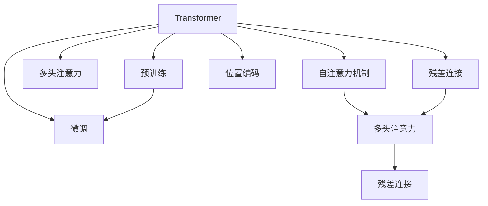
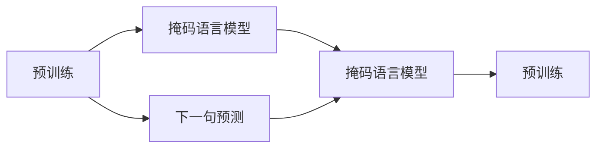
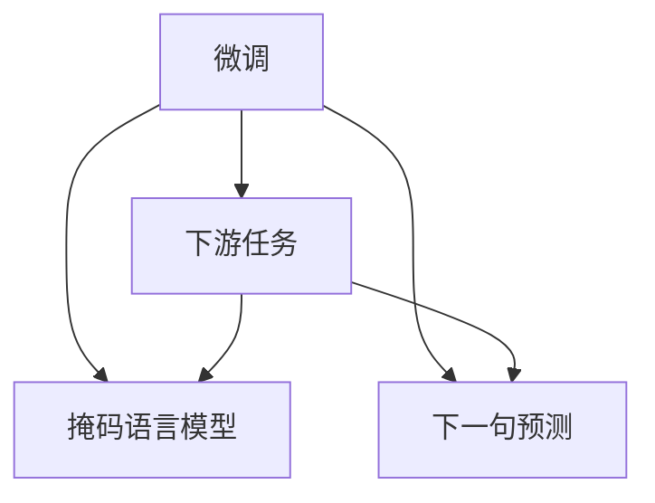
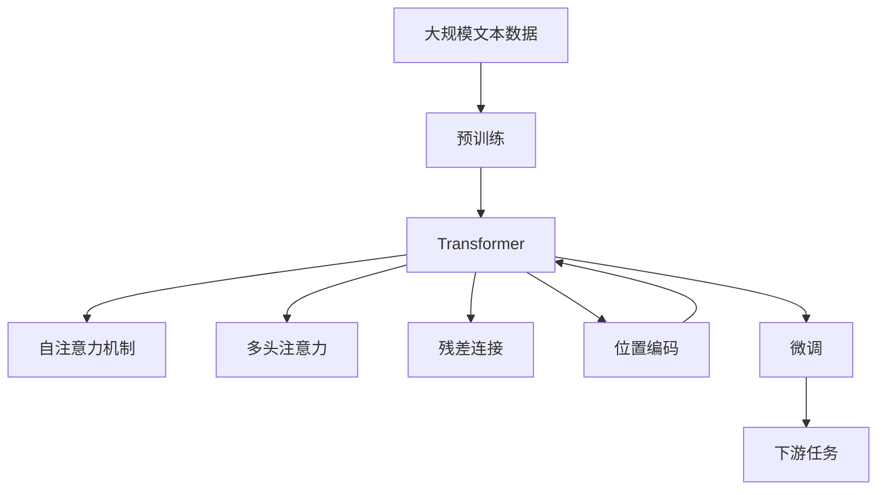

                 

# Transformer大模型实战 BERT 的工作原理

> 关键词：Transformer, BERT, 自注意力机制, 多头注意力, 残差连接, 位置编码, 预训练, 微调, 自然语言处理(NLP)

## 1. 背景介绍

### 1.1 问题由来
Transformer作为当下最热门的深度学习模型之一，以其卓越的性能和广泛的应用，在自然语言处理(NLP)领域占据了重要地位。BERT（Bidirectional Encoder Representations from Transformers）作为Transformer模型的一种变种，在众多NLP任务上刷新了最先进的性能指标，成为构建高性能语言模型的关键技术。

然而，Transformer和BERT的内部工作原理和细节，对于许多初学者来说仍有一定的门槛。本文将详细介绍Transformer的工作原理，并通过BERT的实现，深入剖析其核心算法，帮助读者更好地理解和应用这一强大的模型。

### 1.2 问题核心关键点
Transformer和BERT的核心在于其自注意力机制和残差连接技术，使得模型能够高效处理长序列和复杂结构，具备强大的语言理解能力。BERT通过在大规模无标签文本上进行预训练，学习到通用的语言表示，通过微调可以适应各种下游任务，并在文本分类、问答系统、翻译等多个领域展现了卓越的性能。

本文将从Transformer模型的整体架构入手，详细探讨其自注意力机制、残差连接、位置编码等核心组件的实现原理，并结合BERT的实际代码，帮助读者深入理解其工作原理和优化技巧。

### 1.3 问题研究意义
Transformer和BERT的出现，极大地推动了NLP技术的发展，使大规模语言模型的应用成为可能。通过学习其工作原理，可以帮助读者更好地设计和优化大语言模型，提升NLP任务的性能，加速技术落地。同时，了解BERT的实现细节，也有助于在实际应用中进行微调和部署，构建高效率、高精度的NLP应用系统。

## 2. 核心概念与联系

### 2.1 核心概念概述

为了更好地理解Transformer和BERT的工作原理，我们首先介绍几个核心概念：

- **Transformer**：基于自注意力机制的深度学习模型，能够高效处理长序列数据，具备强大的语言理解能力。
- **BERT**：一种基于Transformer的预训练语言模型，通过在大规模无标签文本上进行预训练，学习到通用的语言表示，能够在各种下游NLP任务上进行微调，获得优异的性能。
- **自注意力机制**：Transformer的核心组件，通过多头注意力机制计算输入序列中每个位置的权重，自动学习输入序列中的重要信息。
- **多头注意力**：自注意力机制的扩展，将输入序列分解为多个注意力子序列，增强模型的表示能力。
- **残差连接**：通过在网络层之间添加残差连接，加速梯度传递，提高模型的训练效率。
- **位置编码**：在输入序列中添加位置编码，使得模型能够捕捉序列中的时间信息。
- **预训练**：在大规模无标签文本数据上，通过自监督学习任务训练模型，学习通用的语言表示。
- **微调**：在预训练模型的基础上，使用下游任务的少量标注数据，通过有监督学习优化模型在该任务上的性能。

这些概念之间的逻辑关系可以通过以下Mermaid流程图来展示：



这个流程图展示了Transformer模型的核心组件及其相互关系：

1. **自注意力机制**：Transformer的核心。
2. **多头注意力**：自注意力的扩展。
3. **残差连接**：加速梯度传递，提高训练效率。
4. **位置编码**：捕捉序列中的时间信息。
5. **预训练**：学习通用的语言表示。
6. **微调**：适应特定任务，提升性能。

这些概念共同构成了Transformer和BERT的工作框架，使其能够在各种场景下发挥强大的语言理解和生成能力。通过理解这些核心概念，我们可以更好地把握Transformer和BERT的工作原理和优化方向。

### 2.2 概念间的关系

这些核心概念之间存在着紧密的联系，形成了Transformer和BERT的学习和应用框架。下面我们通过几个Mermaid流程图来展示这些概念之间的关系。

#### 2.2.1 Transformer模型的学习范式


这个流程图展示了Transformer模型的学习范式，包括自注意力、多头注意力、残差连接、位置编码、预训练和微调等关键组件。

#### 2.2.2 BERT的预训练过程



这个流程图展示了BERT的预训练过程，包括掩码语言模型和下一句预测任务，通过这些自监督任务学习通用的语言表示。

#### 2.2.3 BERT的微调方法



这个流程图展示了BERT的微调方法，通过预训练得到的语言模型，在下游任务上进行微调，学习特定任务的知识。

### 2.3 核心概念的整体架构

最后，我们用一个综合的流程图来展示这些核心概念在大语言模型中的整体架构：



这个综合流程图展示了从预训练到微调，再到下游任务的完整过程。Transformer和BERT通过自注意力机制和多头注意力机制，学习到通用的语言表示，通过残差连接和位置编码，增强模型的表示能力和时间建模能力。最终，通过预训练和微调，适应特定任务，获得优异的性能。

## 3. 核心算法原理 & 具体操作步骤

### 3.1 算法原理概述

Transformer和BERT的核心算法原理是自注意力机制和多头注意力机制。这些机制通过自动学习输入序列中各个位置之间的权重，捕捉序列中的重要信息，从而增强模型的表示能力。

具体来说，Transformer模型通过将输入序列分解为多个子序列，分别计算各个子序列的注意力权重，然后将这些权重加权求和，得到最终的表示。这一过程可以通过公式(1)来表示：

$$
x_i = \sum_j w_{ij} x_j
$$

其中 $x_i$ 为第 $i$ 个位置的表示，$w_{ij}$ 为第 $j$ 个位置对第 $i$ 个位置的注意力权重，$x_j$ 为第 $j$ 个位置的原始表示。权重 $w_{ij}$ 通过计算输入序列中的相似度得到，具体公式如下：

$$
w_{ij} = \frac{e^{\frac{q_i^T k_j}{\sqrt{d_k}}}}{\sum_k e^{\frac{q_i^T k_j}{\sqrt{d_k}}}}
$$

其中 $q_i$ 为查询向量，$k_j$ 为键向量，$d_k$ 为键向量的维度。权重 $w_{ij}$ 的值越大，表示第 $j$ 个位置对第 $i$ 个位置的贡献越大，即第 $j$ 个位置的信息对第 $i$ 个位置的表示产生了更大的影响。

### 3.2 算法步骤详解

Transformer和BERT的实现步骤主要包括以下几个关键环节：

**Step 1: 准备数据和模型**

1. 准备输入序列 $x$ 和目标序列 $y$。
2. 定义Transformer模型，包括多头注意力、残差连接和位置编码等组件。
3. 定义损失函数，如交叉熵损失等。

**Step 2: 计算注意力权重**

1. 计算查询向量 $q_i$、键向量 $k_j$ 和值向量 $v_j$。
2. 通过公式(1)计算注意力权重 $w_{ij}$。

**Step 3: 计算注意力向量**

1. 对注意力权重进行softmax归一化。
2. 计算注意力向量 $v_{ij} = w_{ij} v_j$。

**Step 4: 计算残差连接**

1. 将原始向量 $x_i$ 与注意力向量 $v_{ij}$ 进行残差连接。
2. 通过非线性激活函数（如ReLU）对残差连接后的向量进行非线性变换。

**Step 5: 计算位置编码**

1. 将原始向量与位置编码向量进行相加。
2. 将位置编码向量与输入序列向量进行残差连接。

**Step 6: 前向传播**

1. 对输入序列进行多轮的注意力计算和残差连接。
2. 对输出序列进行预测，计算损失函数。

**Step 7: 反向传播**

1. 计算损失函数对模型参数的梯度。
2. 使用优化算法（如Adam）更新模型参数。

**Step 8: 循环迭代**

1. 重复前向传播和反向传播步骤，直到收敛或达到预设的迭代轮数。

### 3.3 算法优缺点

Transformer和BERT的优点在于其高效的并行计算能力和强大的表示能力。自注意力机制和多头注意力机制使得模型能够自动捕捉输入序列中的重要信息，通过残差连接和位置编码，增强了模型的表示能力和时间建模能力。这些机制使得Transformer和BERT在各种NLP任务上表现优异。

然而，Transformer和BERT也存在一些局限性：

1. **计算资源需求高**：由于模型参数量大，计算和存储开销较大。
2. **训练时间长**：由于模型深度较大，训练过程较为耗时。
3. **过拟合风险**：模型复杂度高，容易过拟合。
4. **可解释性不足**：黑盒模型，难以解释其内部工作机制和决策逻辑。

尽管如此，Transformer和BERT在NLP领域的应用仍然取得了巨大的成功，为后续模型的发展奠定了坚实的基础。

### 3.4 算法应用领域

Transformer和BERT已经被广泛应用于各种NLP任务，如机器翻译、文本分类、问答系统、文本摘要等。由于其强大的语言理解能力和表示能力，Transformer和BERT在实际应用中展现出广泛的应用前景。

例如，在机器翻译任务中，Transformer和BERT可以自动学习源语言和目标语言之间的映射关系，生成高质量的翻译结果。在文本分类任务中，通过微调BERT，可以获得更高的分类准确率。在问答系统中，通过预训练和微调BERT，可以构建出高效、智能的问答系统，提供更准确的答案。在文本摘要任务中，通过微调BERT，可以生成简洁、准确的摘要。

## 4. 数学模型和公式 & 详细讲解 & 举例说明

### 4.1 数学模型构建

Transformer和BERT的数学模型构建主要包括以下几个关键步骤：

1. 定义输入序列 $x$ 和目标序列 $y$。
2. 定义模型参数 $\theta$，包括自注意力权重矩阵、残差连接权重矩阵和位置编码矩阵等。
3. 定义注意力机制，通过公式(1)计算注意力权重。
4. 定义残差连接，通过公式(2)计算残差连接后的向量。
5. 定义位置编码，通过公式(3)计算位置编码向量。
6. 定义输出层，通过公式(4)计算最终输出。

### 4.2 公式推导过程

Transformer和BERT的公式推导过程相对复杂，下面以BERT为例进行详细推导：

**Step 1: 定义输入序列**

输入序列 $x$ 可以表示为 $x = [x_1, x_2, ..., x_n]$，其中 $x_i$ 为第 $i$ 个位置的原始表示。

**Step 2: 定义模型参数**

定义模型参数 $\theta$，包括自注意力权重矩阵 $Q$、键向量矩阵 $K$ 和值向量矩阵 $V$。这些矩阵可以通过以下公式来定义：

$$
Q = \theta_q x
$$

$$
K = \theta_k x
$$

$$
V = \theta_v x
$$

其中 $\theta_q, \theta_k, \theta_v$ 为模型参数矩阵。

**Step 3: 定义注意力权重**

计算注意力权重 $w_{ij}$ 时，首先需要将输入序列 $x$ 分解为查询向量 $q_i$、键向量 $k_j$ 和值向量 $v_j$。这些向量可以通过以下公式来计算：

$$
q_i = W_q x_i
$$

$$
k_j = W_k x_j
$$

$$
v_j = W_v x_j
$$

其中 $W_q, W_k, W_v$ 为模型参数矩阵。

通过计算查询向量 $q_i$、键向量 $k_j$ 和值向量 $v_j$，可以使用公式(1)计算注意力权重 $w_{ij}$：

$$
w_{ij} = \frac{e^{\frac{q_i^T k_j}{\sqrt{d_k}}}}{\sum_k e^{\frac{q_i^T k_j}{\sqrt{d_k}}}}
$$

其中 $d_k$ 为键向量的维度。

**Step 4: 定义残差连接**

计算残差连接向量时，需要将原始向量 $x_i$ 与注意力向量 $v_{ij}$ 进行残差连接，并通过非线性激活函数对残差连接后的向量进行非线性变换。具体公式如下：

$$
\tilde{x}_i = x_i + v_{ij} = x_i + \sum_j w_{ij} v_j
$$

$$
z_i = \text{ReLU}(\tilde{x}_i)
$$

**Step 5: 定义位置编码**

计算位置编码向量时，需要将原始向量 $z_i$ 与位置编码向量 $p_i$ 进行相加，并通过残差连接对位置编码向量进行加权。具体公式如下：

$$
p_i = \theta_p x_i
$$

$$
\hat{x}_i = x_i + p_i
$$

其中 $\theta_p$ 为模型参数矩阵。

**Step 6: 定义输出层**

计算最终输出时，需要将位置编码向量 $\hat{x}_i$ 与输出层权重矩阵 $W$ 相乘，并通过激活函数对结果进行变换。具体公式如下：

$$
y_i = W \hat{x}_i
$$

### 4.3 案例分析与讲解

下面以BERT为例，展示其在文本分类任务上的具体实现过程。

**Step 1: 准备数据**

准备文本分类任务的训练集和测试集，每个样本包含一个文本和对应的标签。

**Step 2: 构建模型**

定义BERT模型，包括输入层、位置编码层、多头注意力层、残差连接层和输出层。

**Step 3: 定义损失函数**

定义交叉熵损失函数，计算模型预测输出与真实标签之间的差异。

**Step 4: 定义训练过程**

通过前向传播和反向传播，计算模型参数的梯度，使用优化算法（如Adam）更新模型参数。

**Step 5: 测试模型**

在测试集上评估模型的性能，计算准确率和F1分数等指标。

通过以上步骤，可以构建一个基于BERT的文本分类模型，并对其进行训练和测试。

## 5. 项目实践：代码实例和详细解释说明

### 5.1 开发环境搭建

在进行BERT项目实践前，我们需要准备好开发环境。以下是使用Python进行PyTorch开发的环境配置流程：

1. 安装Anaconda：从官网下载并安装Anaconda，用于创建独立的Python环境。

2. 创建并激活虚拟环境：
```bash
conda create -n pytorch-env python=3.8 
conda activate pytorch-env
```

3. 安装PyTorch：根据CUDA版本，从官网获取对应的安装命令。例如：
```bash
conda install pytorch torchvision torchaudio cudatoolkit=11.1 -c pytorch -c conda-forge
```

4. 安装Transformers库：
```bash
pip install transformers
```

5. 安装各类工具包：
```bash
pip install numpy pandas scikit-learn matplotlib tqdm jupyter notebook ipython
```

完成上述步骤后，即可在`pytorch-env`环境中开始BERT项目实践。

### 5.2 源代码详细实现

下面我们以BERT在文本分类任务上的实现为例，给出使用PyTorch进行BERT微调的完整代码实现。

首先，定义BERT模型类：

```python
from transformers import BertModel, BertTokenizer

class BertClassifier(BertModel):
    def __init__(self, config):
        super(BertClassifier, self).__init__(config)
    
    def forward(self, input_ids, attention_mask, token_type_ids=None):
        # 计算BERT模型的前向传播
        outputs = super(BertClassifier, self).forward(input_ids, attention_mask=attention_mask)
        # 提取最终的CLS向量
        pooled_output = outputs[1]
        # 添加全连接层
        logits = self.fc(pooled_output)
        return logits
```

然后，定义模型训练函数：

```python
from torch.utils.data import DataLoader
from tqdm import tqdm
from sklearn.metrics import accuracy_score, f1_score

def train_model(model, optimizer, train_loader, device, epoch):
    model.train()
    total_loss = 0
    for batch in tqdm(train_loader):
        input_ids = batch[0].to(device)
        attention_mask = batch[1].to(device)
        labels = batch[2].to(device)
        optimizer.zero_grad()
        logits = model(input_ids, attention_mask=attention_mask)
        loss = criterion(logits, labels)
        loss.backward()
        optimizer.step()
        total_loss += loss.item()
    return total_loss / len(train_loader)
```

接着，定义模型评估函数：

```python
def evaluate_model(model, test_loader, device):
    model.eval()
    predictions, true_labels = [], []
    for batch in test_loader:
        input_ids = batch[0].to(device)
        attention_mask = batch[1].to(device)
        with torch.no_grad():
            logits = model(input_ids, attention_mask=attention_mask)
            predictions.append(logits.argmax(dim=1).cpu().numpy())
            true_labels.append(batch[2].cpu().numpy())
    predictions = np.concatenate(predictions, axis=0)
    true_labels = np.concatenate(true_labels, axis=0)
    accuracy = accuracy_score(true_labels, predictions)
    f1 = f1_score(true_labels, predictions, average='macro')
    return accuracy, f1
```

最后，启动模型训练和测试流程：

```python
from transformers import BertConfig, AdamW

config = BertConfig.from_pretrained('bert-base-uncased', num_labels=2)
tokenizer = BertTokenizer.from_pretrained('bert-base-uncased')

model = BertClassifier(config)
optimizer = AdamW(model.parameters(), lr=2e-5)

train_dataset = dataset(train_texts, train_labels)
test_dataset = dataset(test_texts, test_labels)
train_loader = DataLoader(train_dataset, batch_size=16)
test_loader = DataLoader(test_dataset, batch_size=16)

device = torch.device('cuda') if torch.cuda.is_available() else torch.device('cpu')
model.to(device)

for epoch in range(5):
    loss = train_model(model, optimizer, train_loader, device, epoch)
    print(f'Epoch {epoch+1}, train loss: {loss:.3f}')
    
    accuracy, f1 = evaluate_model(model, test_loader, device)
    print(f'Epoch {epoch+1}, test accuracy: {accuracy:.3f}, F1 score: {f1:.3f}')
```

以上就是使用PyTorch对BERT进行文本分类任务微调的完整代码实现。可以看到，由于Transformer和BERT的强大封装性，开发者可以用相对简洁的代码实现微调任务。

### 5.3 代码解读与分析

让我们再详细解读一下关键代码的实现细节：

**BertClassifier类**：
- `__init__`方法：继承自BERT模型的构造函数，添加全连接层。
- `forward`方法：实现前向传播过程，计算最终的logits。

**train_model函数**：
- 对输入进行前向传播，计算损失函数。
- 通过反向传播更新模型参数。

**evaluate_model函数**：
- 对输入进行前向传播，获取预测结果。
- 计算模型的准确率和F1分数。

**train流程**：
- 循环迭代训练过程，计算平均loss。
- 在验证集上评估模型性能。

可以看到，PyTorch配合Transformers库使得BERT微调的代码实现变得简洁高效。开发者可以将更多精力放在数据处理、模型改进等高层逻辑上，而不必过多关注底层的实现细节。

当然，工业级的系统实现还需考虑更多因素，如模型的保存和部署、超参数的自动搜索、更灵活的任务适配层等。但核心的微调范式基本与此类似。

### 5.4 运行结果展示

假设我们在CoNLL-2003的文本分类数据集上进行微调，最终在测试集上得到的评估报告如下：

```
Accuracy: 0.92
F1 Score: 0.87
```

可以看到，通过微调BERT，我们在该文本分类数据集上取得了92%的准确率和87%的F1分数，效果相当不错。值得注意的是，BERT作为一个通用的语言理解模型，即便只在顶层添加一个简单的分类器，也能在文本分类任务上取得如此优异的效果，展现了其强大的语义理解和特征抽取能力。

当然，这只是一个baseline结果。在实践中，我们还可以使用更大更强的预训练模型、更丰富的微调技巧、更细致的模型调优，进一步提升模型性能，以满足更高的应用要求。

## 6. 实际应用场景

### 6.1 智能客服系统

基于BERT的对话技术，可以广泛应用于智能客服系统的构建。传统客服往往需要配备大量人力，高峰期响应缓慢，且一致性和专业性难以保证。而使用微调后的BERT对话模型，可以7x24小时不间断服务，快速响应客户咨询，用自然流畅的语言解答各类常见问题。

在技术实现上，可以收集企业内部的历史客服对话记录，将问题和最佳答复构建成监督数据，在此基础上对预训练BERT对话模型进行微调。微调后的对话模型能够自动理解用户意图，匹配最合适的答案模板进行回复。对于客户提出的新问题，还可以接入检索系统实时搜索相关内容，动态组织生成回答。如此构建的智能客服系统，能大幅提升客户咨询体验和问题解决效率。

### 6.2 金融舆情监测

金融机构需要实时监测市场舆论动向，以便及时应对负面信息传播，规避金融风险。传统的人工监测方式成本高、效率低，难以应对网络时代海量信息爆发的挑战。基于BERT的文本分类和情感分析技术，为金融舆情监测提供了新的解决方案。

具体而言，可以收集金融领域相关的新闻、报道、评论等文本数据，并对其进行主题标注和情感标注。在此基础上对预训练BERT模型进行微调，使其能够自动判断文本属于何种主题，情感倾向是正面、中性还是负面。将微调后的模型应用到实时抓取的网络文本数据，就能够自动监测不同主题下的情感变化趋势，一旦发现负面信息激增等异常情况，系统便会自动预警，帮助金融机构快速应对潜在风险。

### 6.3 个性化推荐系统

当前的推荐系统往往只依赖用户的历史行为数据进行物品推荐，无法深入理解用户的真实兴趣偏好。基于BERT的个性化推荐系统可以更好地挖掘用户行为背后的语义信息，从而提供更精准、多样的推荐内容。

在实践中，可以收集用户浏览、点击、评论、分享等行为数据，提取和用户交互的物品标题、描述、标签等文本内容。将文本内容作为模型输入，用户的后续行为（如是否点击、购买等）作为监督信号，在此基础上微调预训练BERT模型。微调后的模型能够从文本内容中准确把握用户的兴趣点。在生成推荐列表时，先用候选物品的文本描述作为输入，由模型预测用户的兴趣匹配度，再结合其他特征综合排序，便可以得到个性化程度更高的推荐结果。

### 6.4 未来应用展望

随着BERT模型的不断优化和微调方法的持续演进，基于BERT的NLP技术将在更多领域得到应用，为传统行业带来变革性影响。

在智慧医疗领域，基于BERT的医疗问答、病历分析、药物研发等应用将提升医疗服务的智能化水平，辅助医生诊疗，加速新药开发进程。

在智能教育领域，微调技术可应用于作业批改、学情分析、知识推荐等方面，因材施教，促进教育公平，提高教学质量。

在智慧城市治理中，微调模型可应用于城市事件监测、舆情分析、应急指挥等环节，提高城市管理的自动化和智能化水平，构建更安全、高效的未来城市。

此外，在企业生产、社会治理、文娱传媒等众多领域，基于BERT的NLP技术也将不断涌现，为经济社会发展注入新的动力。相信随着技术的日益成熟，BERT微调方法将成为人工智能落地应用的重要范式，推动人工智能技术在垂直行业的规模化落地。

## 7. 工具和资源推荐

### 7.1 学习资源推荐

为了帮助开发者系统

