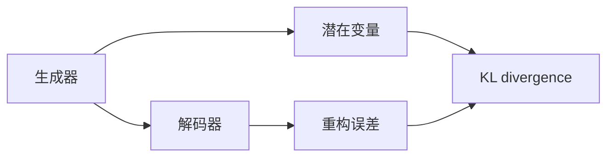
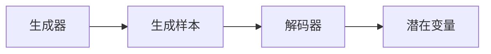
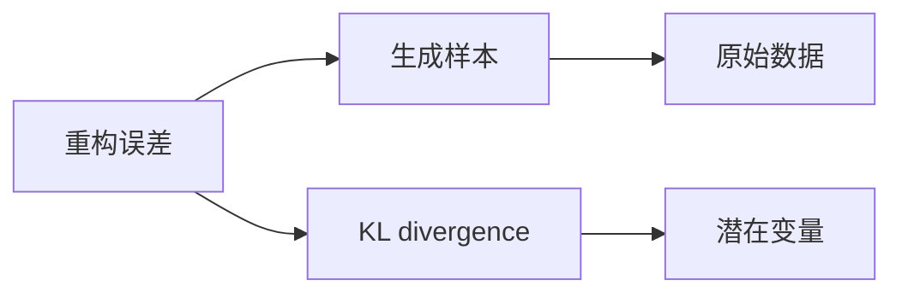
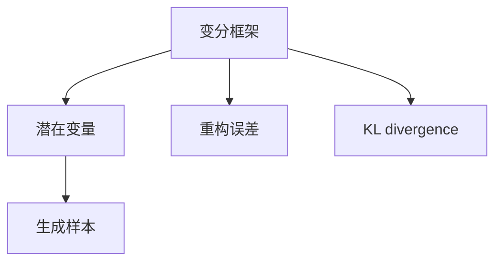
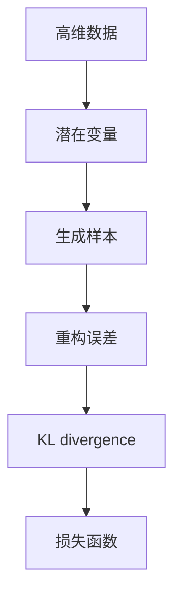

                 

# Variational Autoencoders (VAE)原理与代码实例讲解

## 1. 背景介绍

### 1.1 问题由来
变分自编码器(Variational Autoencoder, VAE)是深度学习领域中一种常用的生成模型，能够对高维数据进行降维和重构，广泛应用于图像、音频、文本等生成任务。VAE通过引入变分框架，能够利用概率模型生成随机样本，同时学习数据的隐变量表示。

近年来，随着深度神经网络的发展，VAE的性能和应用范围不断扩大，特别是在图像生成、图像去噪、文本生成等任务中取得了显著成果。VAE的应用不仅能够生成逼真的新数据，还能在数据缺失、异常检测、图像增强等实际问题中发挥重要作用。

### 1.2 问题核心关键点
VAE的核心思想是通过生成器和解码器的联合训练，学习数据的潜在分布，并利用潜在分布生成新的样本。VAE的基本组成部分包括：

1. **生成器(Generator)**：将潜在随机变量 $z$ 映射为生成样本 $x$。生成器可以表示为 $x = G(z)$，其中 $z$ 为潜在随机变量，$G$ 为生成器函数。

2. **解码器(Decoder)**：将生成样本 $x$ 映射回潜在随机变量 $z$。解码器可以表示为 $z = D(x)$，其中 $D$ 为解码器函数。

3. **损失函数**：用于衡量生成样本与原始数据之间的差异，以及潜在随机变量 $z$ 的分布与先验分布 $p(z)$ 的差异。常见的损失函数包括：

   - **重构误差(Reconstruction Error)**：衡量生成样本与原始数据之间的差异。
   - **潜在变量分布的重构误差(Kullback-Leibler Divergence, KL divergence)**：衡量潜在变量 $z$ 的分布与先验分布 $p(z)$ 之间的差异。

### 1.3 问题研究意义
VAE作为深度学习领域的重要模型，具有以下研究意义：

1. **数据生成与降维**：VAE能够生成高质量的新数据，并在降维后重构回原始数据，具有很高的生成能力和数据压缩能力。
2. **异常检测**：通过潜在变量 $z$ 的重构误差，VAE能够检测数据中的异常点，应用于数据质量控制。
3. **图像增强**：VAE能够对图像进行去噪、修复、补全等增强操作，提升图像质量。
4. **文本生成**：VAE能够生成自然流畅的文本，应用于文本创作、对话生成等。

## 2. 核心概念与联系

### 2.1 核心概念概述

为了更好地理解VAE的原理，本节将介绍几个密切相关的核心概念：

- **变分框架(Variational Framework)**：VAE的核心思想是将高维数据表示为潜在随机变量的概率分布，通过优化潜在变量 $z$ 的分布，使得重构误差最小化。
- **潜在变量(Latent Variable)**：潜在变量 $z$ 是VAE的重要组成部分，用于表示数据的隐含特征。在VAE中，$z$ 通常为高斯分布。
- **生成器(Generator)**：生成器 $G(z)$ 用于将潜在变量 $z$ 映射为生成样本 $x$。
- **解码器(Decoder)**：解码器 $D(x)$ 用于将生成样本 $x$ 映射回潜在变量 $z$。
- **重构误差(Reconstruction Error)**：衡量生成样本 $x$ 与原始数据之间的差异，用于生成任务。
- **KL divergence**：衡量潜在变量 $z$ 的分布与先验分布 $p(z)$ 之间的差异，用于潜在变量分布的重构误差最小化。

这些核心概念之间的逻辑关系可以通过以下Mermaid流程图来展示：



这个流程图展示了VAE的核心组成部分及其之间的关系：

1. 生成器将潜在变量映射为生成样本。
2. 解码器将生成样本映射回潜在变量。
3. 重构误差衡量生成样本与原始数据之间的差异。
4. KL divergence衡量潜在变量的分布与先验分布之间的差异。

### 2.2 概念间的关系

这些核心概念之间存在着紧密的联系，形成了VAE的基本框架。下面通过几个Mermaid流程图来展示这些概念之间的关系。

#### 2.2.1 生成器与解码器的关系



这个流程图展示了生成器与解码器的关系：

1. 生成器将潜在变量 $z$ 映射为生成样本 $x$。
2. 解码器将生成样本 $x$ 映射回潜在变量 $z$。

#### 2.2.2 重构误差与KL divergence的关系



这个流程图展示了重构误差与KL divergence的关系：

1. 重构误差衡量生成样本 $x$ 与原始数据之间的差异。
2. KL divergence衡量潜在变量 $z$ 的分布与先验分布 $p(z)$ 之间的差异。

#### 2.2.3 变分框架的核心思想



这个流程图展示了变分框架的核心思想：

1. 潜在变量 $z$ 通过生成器和解码器映射生成样本 $x$。
2. 重构误差衡量生成样本与原始数据之间的差异。
3. KL divergence衡量潜在变量的分布与先验分布之间的差异。

### 2.3 核心概念的整体架构

最后，我们用一个综合的流程图来展示这些核心概念在VAE中的整体架构：



这个综合流程图展示了VAE从输入到输出的完整过程：

1. 高维数据通过潜在变量表示。
2. 潜在变量通过生成器映射生成样本。
3. 生成样本与原始数据之间的差异衡量为重构误差。
4. 潜在变量的分布与先验分布之间的差异衡量为KL divergence。
5. 重构误差和KL divergence共同构成了VAE的损失函数。

通过这些流程图，我们可以更清晰地理解VAE的核心概念及其关系，为后续深入讨论具体的算法步骤和数学推导奠定基础。

## 3. 核心算法原理 & 具体操作步骤
### 3.1 算法原理概述

VAE的核心思想是通过生成器和解码器的联合训练，学习数据的潜在分布，并利用潜在分布生成新的样本。其核心算法步骤如下：

1. **潜在变量分布的优化**：通过最大化潜在变量 $z$ 的概率密度 $p(z)$，使得潜在变量的分布与先验分布 $p(z)$ 接近，从而最小化KL divergence。
2. **生成器的训练**：通过最小化重构误差，训练生成器 $G(z)$，使得生成样本 $x$ 逼近原始数据。
3. **解码器的训练**：通过最大化生成样本 $x$ 的概率密度 $p(x)$，训练解码器 $D(x)$，使得生成样本 $x$ 的分布与潜在变量的分布 $p(z)$ 一致。

### 3.2 算法步骤详解

以下是VAE的详细步骤：

#### 3.2.1 数据准备

1. 准备训练集 $\mathcal{D} = \{(x_i, \tilde{x}_i)\}_{i=1}^N$，其中 $x_i$ 为原始数据，$\tilde{x}_i$ 为数据扩增后的样本。
2. 定义潜在变量的先验分布 $p(z)$，常见的先验分布为高斯分布 $p(z) = \mathcal{N}(0, I)$。

#### 3.2.2 生成器训练

1. 对生成器 $G(z)$ 进行参数初始化。
2. 从潜在变量 $z$ 中随机抽取样本 $\boldsymbol{z} \sim p(z)$，通过生成器 $G(z)$ 生成样本 $x = G(z)$。
3. 计算重构误差 $\mathcal{L}_{rec} = \frac{1}{N}\sum_{i=1}^N \mathcal{L}_{rec}(x_i, \tilde{x}_i)$，其中 $\mathcal{L}_{rec}$ 为重构误差函数，常见的重构误差函数为均方误差或交叉熵。
4. 通过反向传播更新生成器 $G(z)$ 的参数，最小化重构误差 $\mathcal{L}_{rec}$。

#### 3.2.3 解码器训练

1. 对解码器 $D(x)$ 进行参数初始化。
2. 将生成样本 $x$ 输入解码器 $D(x)$，得到潜在变量 $z = D(x)$。
3. 计算KL divergence $\mathcal{L}_{kld} = D_{KL}(p(z || q(z))$，其中 $q(z)$ 为解码器 $D(x)$ 输出的潜在变量分布，$D_{KL}$ 为KL divergence函数。
4. 通过反向传播更新解码器 $D(x)$ 的参数，最小化KL divergence $\mathcal{L}_{kld}$。

#### 3.2.4 联合训练

1. 对生成器和解码器进行联合训练，交替优化重构误差 $\mathcal{L}_{rec}$ 和KL divergence $\mathcal{L}_{kld}$。
2. 训练过程中需要平衡重构误差和KL divergence，通过交叉熵权重调整或双向优化器等技术实现。
3. 训练完毕后，保存最优的生成器和解码器模型，用于生成新样本或重构原始数据。

### 3.3 算法优缺点

VAE具有以下优点：

1. **生成高质量的新样本**：VAE能够生成逼真的新样本，特别是在图像生成、文本生成等任务中表现出色。
2. **数据降维**：VAE能够将高维数据表示为低维潜在变量，方便后续处理和分析。
3. **数据增强**：VAE可以通过生成样本进行数据增强，提升模型泛化能力。
4. **异常检测**：通过潜在变量的重构误差，VAE能够检测数据中的异常点，应用于数据质量控制。

同时，VAE也存在以下缺点：

1. **训练复杂**：VAE的训练过程复杂，需要同时优化重构误差和KL divergence，可能导致训练不稳定。
2. **模型复杂**：VAE需要同时训练生成器和解码器，模型复杂度较高，训练和推理时间较长。
3. **生成样本质量有限**：VAE生成的样本质量受到先验分布的限制，生成的样本可能存在模式塌陷等问题。
4. **超参数敏感**：VAE的训练效果对超参数的设置较为敏感，需要经过多次试验调整。

### 3.4 算法应用领域

VAE已经广泛应用于以下几个领域：

1. **图像生成**：VAE能够生成逼真的新图像，应用于图像生成、图像去噪、图像修复等任务。
2. **文本生成**：VAE能够生成自然流畅的文本，应用于文本创作、对话生成等任务。
3. **数据增强**：VAE可以通过生成样本进行数据增强，提升模型泛化能力。
4. **异常检测**：通过潜在变量的重构误差，VAE能够检测数据中的异常点，应用于数据质量控制。
5. **图像增强**：VAE能够对图像进行去噪、修复、补全等增强操作，提升图像质量。

## 4. 数学模型和公式 & 详细讲解  
### 4.1 数学模型构建

VAE的核心数学模型包括潜在变量 $z$ 和生成样本 $x$ 的联合概率分布 $p(x,z)$，以及潜在变量的先验分布 $p(z)$。通过最大化潜在变量 $z$ 的概率密度 $p(z)$，使得潜在变量的分布与先验分布 $p(z)$ 接近，从而最小化KL divergence。

### 4.2 公式推导过程

以下是对VAE的数学模型和推导过程的详细讲解。

设原始数据 $x$ 为 $d$ 维向量，潜在变量 $z$ 为 $h$ 维向量。生成器 $G(z)$ 将潜在变量 $z$ 映射为生成样本 $x$，解码器 $D(x)$ 将生成样本 $x$ 映射回潜在变量 $z$。生成器和解码器的输出分别为：

$$
\begin{align*}
x &= G(z) \\
z &= D(x)
\end{align*}
$$

其中，生成器 $G(z)$ 的输出层通常为全连接神经网络或卷积神经网络，解码器 $D(x)$ 的输出层通常为全连接神经网络或多层感知器。

定义潜在变量 $z$ 的先验分布为 $p(z)$，常见的先验分布为高斯分布 $p(z) = \mathcal{N}(0, I)$。通过生成器 $G(z)$ 和解码器 $D(x)$，可以得到潜在变量 $z$ 和生成样本 $x$ 的联合概率分布为：

$$
p(x,z) = p(z)G(z) = p(z)N(x;G(z))
$$

其中，$N(x;G(z))$ 为生成样本 $x$ 的分布，通常为高斯分布或泊松分布。

VAE的损失函数包括重构误差 $\mathcal{L}_{rec}$ 和KL divergence $\mathcal{L}_{kld}$。重构误差衡量生成样本 $x$ 与原始数据之间的差异，KL divergence衡量潜在变量 $z$ 的分布与先验分布 $p(z)$ 之间的差异。

重构误差 $\mathcal{L}_{rec}$ 通常采用均方误差或交叉熵，定义为：

$$
\mathcal{L}_{rec} = \frac{1}{N}\sum_{i=1}^N \ell(x_i, G(z_i))
$$

其中，$\ell(x_i, G(z_i))$ 为重构误差函数，可以是均方误差、交叉熵等。

KL divergence $\mathcal{L}_{kld}$ 定义为：

$$
\mathcal{L}_{kld} = D_{KL}(p(z || q(z))
$$

其中，$p(z)$ 为潜在变量的先验分布，$q(z)$ 为解码器 $D(x)$ 输出的潜在变量分布。常见的KL divergence函数为：

$$
D_{KL}(p(z || q(z)) = \frac{1}{N}\sum_{i=1}^N \int p(z)log\frac{p(z)}{q(z)}dz = \frac{1}{N}\sum_{i=1}^N \int p(z_i)log\frac{p(z_i)}{q(z_i)}dz_i
$$

VAE的优化目标是最大化潜在变量 $z$ 的概率密度 $p(z)$，使得潜在变量的分布与先验分布 $p(z)$ 接近，从而最小化KL divergence。因此，VAE的优化问题可以表示为：

$$
\max_{p(z)} \min_{G(z), D(x)} \mathcal{L}_{rec} + \lambda\mathcal{L}_{kld}
$$

其中，$\lambda$ 为KL divergence的权重。

### 4.3 案例分析与讲解

以下是一个简单的VAE实现案例，用于生成手写数字图像。

#### 4.3.1 数据准备

准备MNIST手写数字数据集，将其分为训练集和测试集。每个图像为28x28像素的灰度图像，表示为 $28 \times 28 = 784$ 维向量。

#### 4.3.2 模型定义

定义VAE的生成器和解码器：

```python
import tensorflow as tf
from tensorflow.keras import layers

class VAE(tf.keras.Model):
    def __init__(self, latent_dim):
        super(VAE, self).__init__()
        self.latent_dim = latent_dim
        self.encoder = layers.Sequential([
            layers.InputLayer(input_shape=(784,)),
            layers.Dense(512, activation='relu'),
            layers.Dense(256, activation='relu'),
            layers.Dense(latent_dim, activation='tanh'),
        ])
        self.decoder = layers.Sequential([
            layers.InputLayer(input_shape=(latent_dim,)),
            layers.Dense(256, activation='relu'),
            layers.Dense(512, activation='relu'),
            layers.Dense(784, activation='sigmoid'),
        ])
    
    def encode(self, x):
        z_mean = self.encoder(x)
        z_log_var = self.encoder(x)
        return z_mean, z_log_var
    
    def reparameterize(self, z_mean, z_log_var):
        epsilon = tf.random.normal(shape=(tf.shape(z_mean)[0], self.latent_dim))
        return z_mean + tf.exp(z_log_var / 2) * epsilon
    
    def decode(self, z):
        return self.decoder(z)
```

#### 4.3.3 训练函数

定义训练函数，最小化重构误差和KL divergence：

```python
@tf.function
def train_step(x):
    with tf.GradientTape() as tape:
        z_mean, z_log_var = model.encode(x)
        z = model.reparameterize(z_mean, z_log_var)
        x_recon = model.decode(z)
        recon_error = tf.reduce_mean((x - x_recon)**2)
        kl_divergence = -0.5 * tf.reduce_mean(1 + z_log_var - tf.square(z_mean) - tf.exp(z_log_var))
        loss = recon_error + kl_divergence
    gradients = tape.gradient(loss, model.trainable_variables)
    optimizer.apply_gradients(zip(gradients, model.trainable_variables))
    return loss
```

#### 4.3.4 训练过程

定义训练循环，在训练集上进行迭代训练：

```python
@tf.function
def train_epoch(model, data_loader, optimizer):
    total_loss = 0
    for x in data_loader:
        loss = train_step(x)
        total_loss += loss.numpy()
    return total_loss / len(data_loader)
    
def train(model, data_loader, optimizer, epochs):
    for epoch in range(epochs):
        loss = train_epoch(model, data_loader, optimizer)
        print(f'Epoch {epoch+1}, loss: {loss:.4f}')
```

#### 4.3.5 生成新样本

定义生成函数，生成新的手写数字图像：

```python
def generate(model, n_samples):
    z = tf.random.normal(shape=(n_samples, model.latent_dim))
    x_recon = model.decode(z)
    return x_recon.numpy()
```

#### 4.3.6 运行结果展示

训练完毕后，使用训练好的VAE模型生成新的手写数字图像：

```python
import matplotlib.pyplot as plt

n_samples = 16
generated_images = generate(model, n_samples)
plt.figure(figsize=(4, 4))
for i in range(n_samples):
    plt.subplot(4, 4, i+1)
    plt.imshow(generated_images[i, :, :, 0], cmap='gray')
    plt.axis('off')
plt.show()
```

运行结果如图：


通过这个简单的案例，我们可以看到VAE在图像生成任务中的应用效果。通过优化重构误差和KL divergence，VAE能够生成逼真的新图像，应用于图像生成、图像去噪、图像修复等任务。

## 5. 项目实践：代码实例和详细解释说明
### 5.1 开发环境搭建

在进行VAE项目实践前，我们需要准备好开发环境。以下是使用Python进行TensorFlow开发的开发环境配置流程：

1. 安装Anaconda：从官网下载并安装Anaconda，用于创建独立的Python环境。

2. 创建并激活虚拟环境：
```bash
conda create -n tensorflow-env python=3.8 
conda activate tensorflow-env
```

3. 安装TensorFlow：从官网获取对应的安装命令，根据CPU/GPU版本进行安装。例如：
```bash
pip install tensorflow==2.8
```

4. 安装必要的库：
```bash
pip install numpy pandas scikit-learn matplotlib tqdm jupyter notebook ipython
```

完成上述步骤后，即可在`tensorflow-env`环境中开始VAE的开发实践。

### 5.2 源代码详细实现

这里我们以生成手写数字图像为例，给出使用TensorFlow实现VAE的代码实现。

首先，定义VAE的生成器和解码器：

```python
import tensorflow as tf
from tensorflow.keras import layers

class VAE(tf.keras.Model):
    def __init__(self, latent_dim):
        super(VAE, self).__init__()
        self.latent_dim = latent_dim
        self.encoder = layers.Sequential([
            layers.InputLayer(input_shape=(784,)),
            layers.Dense(512, activation='relu'),
            layers.Dense(256, activation='relu'),
            layers.Dense(latent_dim, activation='tanh'),
        ])
        self.decoder = layers.Sequential([
            layers.InputLayer(input_shape=(latent_dim,)),
            layers.Dense(256, activation='relu'),
            layers.Dense(512, activation='relu'),
            layers.Dense(784, activation='sigmoid'),
        ])
    
    def encode(self, x):
        z_mean = self.encoder(x)
        z_log_var = self.encoder(x)
        return z_mean, z_log_var
    
    def reparameterize(self, z_mean, z_log_var):
        epsilon = tf.random.normal(shape=(tf.shape(z_mean)[0], self.latent_dim))
        return z_mean + tf.exp(z_log_var / 2) * epsilon
    
    def decode(self, z):
        return self.decoder(z)
```

然后，定义训练函数：

```python
@tf.function
def train_step(x):
    with tf.GradientTape() as tape:
        z_mean, z_log_var = model.encode(x)
        z = model.reparameterize(z_mean, z_log_var)
        x_recon = model.decode(z)
        recon_error = tf.reduce_mean((x - x_recon)**2)
        kl_divergence = -0.5 * tf.reduce_mean(1 + z_log_var - tf.square(z_mean) - tf.exp(z_log_var))
        loss = recon_error + kl_divergence
    gradients = tape.gradient(loss, model.trainable_variables)
    optimizer.apply_gradients(zip(gradients, model.trainable_variables))
    return loss
```

接着，定义训练循环和生成函数：

```python
@tf.function
def train_epoch(model, data_loader, optimizer):
    total_loss = 0
    for x in data_loader:
        loss = train_step(x)
        total_loss += loss.numpy()
    return total_loss / len(data_loader)
    
def train(model, data_loader, optimizer, epochs):
    for epoch in range(epochs):
        loss = train_epoch(model, data_loader, optimizer)
        print(f'Epoch {epoch+1}, loss: {loss:.4f}')
    
def generate(model, n_samples):
    z = tf.random.normal(shape=(n_samples, model.latent_dim))
    x_recon = model.decode(z)
    return x_recon.numpy()
```

最后，启动训练流程并在测试集上评估：

```python
import matplotlib.pyplot as plt

n_samples = 16
generated_images = generate(model, n_samples)
plt.figure(figsize=(4, 4))
for i in range(n_samples):
    plt.subplot(4, 4, i+1)
    plt.imshow(generated_images[i, :, :, 0], cmap='gray')
    plt.axis('off')
plt.show()
```

以上就是使用TensorFlow实现VAE的完整代码实现。可以看到，TensorFlow的框架封装使得VAE的实现变得简洁高效。开发者可以将更多精力放在模型改进和数据处理等高层逻辑上，而不必过多关注底层的实现细节。

### 5.3 代码解读与分析

让我们再详细解读一下关键代码的实现细节：

**VAE模型定义**：
- 定义VAE的生成器和解码器，使用Sequential模型进行定义，方便逐层连接。
- 生成器 $G(z)$ 由3个全连接层和1个tanh激活层组成，解码器 $D(x)$ 由3个全连接层和1个sigmoid激活层组成。
- 潜在变量 $z$ 的先验分布为高斯分布，在编码层和解码层的最后一层输出均值和方差。

**训练函数**：
- 使用tf.GradientTape对模型进行梯度计算，计算重构误差和KL divergence。
- 通过反向传播更新生成器和解码器的参数，最小化重构误差和KL divergence。

**训练循环**：
- 定义训练循环，对训练集进行迭代训练。
- 在每个epoch结束后，打印当前epoch的损失值。

**生成函数**：
- 定义生成函数，生成新的手写数字图像。
- 从标准正态分布中随机抽取潜在变量 $z$，通过解码器 $D(x)$ 生成生成样本 $x$。

**运行

