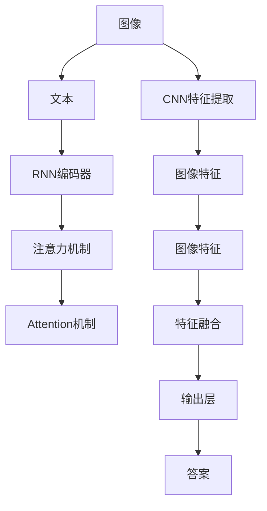
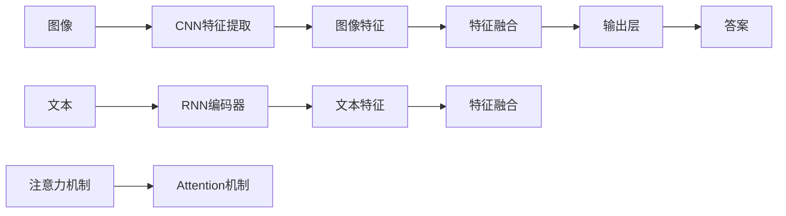
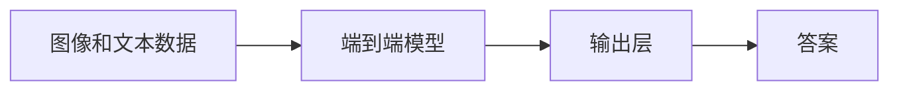
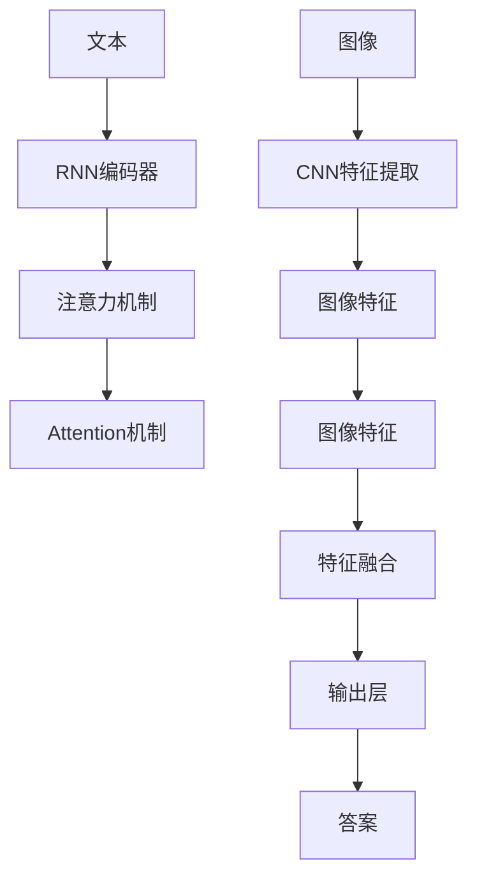
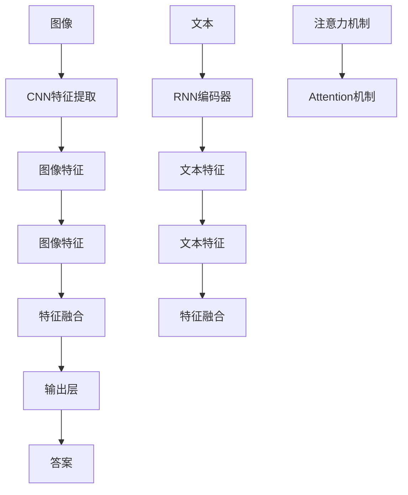

                 

# Visual Question Answering原理与代码实例讲解

> 关键词：Visual Question Answering(VQA), 多模态学习, 深度学习, 自然语言处理(NLP), 卷积神经网络(CNN), 循环神经网络(RNN), TensorFlow, PyTorch, COCO数据集

## 1. 背景介绍

### 1.1 问题由来
视觉问答（Visual Question Answering, VQA）是近年来自然语言处理（NLP）和计算机视觉（CV）领域中的一个热门研究话题。VQA任务是指在给定一张图片和一段自然语言问题的情况下，模型需要理解图片内容并根据问题提供准确的答案。这个任务结合了图像信息与自然语言信息，是理解并生成多模态信息的一种方式。

VQA技术的出现为解决诸如医学影像解读、自动驾驶、智能家居等实际问题提供了可能性。在医学影像解读方面，VQA可以辅助医生对影像进行诊断，快速识别异常情况；在自动驾驶中，VQA可以帮助系统理解和判断交通信号和行人行为，做出正确的决策；在智能家居中，VQA可以实现对环境状态的感知和智能控制。

### 1.2 问题核心关键点
VQA技术的核心在于如何让计算机理解图像内容并根据问题生成答案。传统方法主要依赖于图像特征提取和文本特征提取，然后通过深度学习模型将图像特征和文本特征融合，最终生成答案。

随着深度学习的发展，特别是卷积神经网络（CNN）和循环神经网络（RNN）的引入，VQA技术取得了显著进展。目前主流方法包括：

- 使用CNN提取图像特征，使用RNN处理文本问题，再通过Attention机制将两者融合。
- 使用端到端的方法，直接从图像和文本数据中训练生成答案的模型。
- 使用Transformer等新型模型，提高视觉和语言信息的交互能力。

这些方法在多个VQA数据集上取得了良好的效果，推动了VQA技术的实际应用。

### 1.3 问题研究意义
VQA技术的研究意义重大，不仅可以提升计算机处理多模态信息的能力，还可以为很多实际应用提供支持。VQA技术的发展，使得计算机可以更好地理解和处理复杂的多模态数据，这对于提升人工智能系统的智能化水平具有重要意义。

在实际应用中，VQA技术可以帮助人们更高效地获取信息，降低沟通成本，提高工作效率。例如，在智能客服中，VQA技术可以理解用户的图像问题并给出相应的解答，提升了服务体验；在智能家居中，VQA技术可以根据用户提供的图片描述和环境状态，自动调整家居设备，提升生活便利性。

## 2. 核心概念与联系

### 2.1 核心概念概述

为更好地理解VQA技术，本节将介绍几个密切相关的核心概念：

- 视觉问答（Visual Question Answering, VQA）：指在给定一张图片和一段自然语言问题的情况下，模型需要理解图片内容并根据问题提供准确的答案。
- 多模态学习（Multimodal Learning）：涉及不同类型数据（如图像、文本、语音等）的联合建模，旨在提高模型处理多种数据类型的综合能力。
- 卷积神经网络（Convolutional Neural Network, CNN）：一种前馈神经网络，特别适用于处理具有网格状结构的图像数据。
- 循环神经网络（Recurrent Neural Network, RNN）：一种能够处理序列数据的前馈神经网络，特别适用于自然语言处理。
- 自然语言处理（Natural Language Processing, NLP）：涉及计算机如何理解、处理和生成人类语言的技术。
- 卷积神经网络（Convolutional Neural Network, CNN）：一种前馈神经网络，特别适用于处理具有网格状结构的图像数据。
- 循环神经网络（Recurrent Neural Network, RNN）：一种能够处理序列数据的前馈神经网络，特别适用于自然语言处理。
- 注意力机制（Attention Mechanism）：一种使模型能够动态关注输入中不同部分的技术，特别适用于处理多模态数据。
- 端到端学习（End-to-End Learning）：指模型直接从原始数据中学习，不涉及中间特征提取等步骤，特别适用于复杂多模态数据的处理。
- COCO数据集：一个广泛使用的视觉问答数据集，包含大量图像和对应的问答对，用于评估和测试VQA模型的性能。

这些核心概念之间的逻辑关系可以通过以下Mermaid流程图来展示：



这个流程图展示了VQA任务的总体框架：

1. 图像输入，通过CNN提取特征。
2. 文本问题输入，通过RNN编码器生成问题向量。
3. 通过注意力机制将图像特征和问题向量融合，生成融合特征。
4. 通过另一个注意力机制对融合特征进行关注，选择重要部分。
5. 输出层生成答案。

### 2.2 概念间的关系

这些核心概念之间存在着紧密的联系，形成了VQA任务的完整生态系统。下面我通过几个Mermaid流程图来展示这些概念之间的关系。

#### 2.2.1 多模态学习的框架



这个流程图展示了多模态学习的典型框架：

1. 图像和文本分别通过不同的网络提取特征。
2. 使用注意力机制将两种特征融合。
3. 输出层生成答案。

#### 2.2.2 端到端的VQA



这个流程图展示了端到端的VQA框架：

1. 直接从图像和文本数据中学习生成答案的模型。
2. 输出层生成答案。

#### 2.2.3 注意力机制在VQA中的应用



这个流程图展示了注意力机制在VQA中的应用：

1. 图像和文本分别通过不同的网络提取特征。
2. 使用注意力机制将两种特征融合。
3. 通过另一个注意力机制对融合特征进行关注，选择重要部分。
4. 输出层生成答案。

### 2.3 核心概念的整体架构

最后，我们用一个综合的流程图来展示这些核心概念在VQA任务中的整体架构：



这个综合流程图展示了从图像输入到生成答案的完整过程。图像输入通过CNN提取特征，文本问题输入通过RNN编码器生成问题向量。通过注意力机制将图像特征和问题向量融合，生成融合特征。再通过另一个注意力机制对融合特征进行关注，选择重要部分。最后，输出层生成答案。通过这些核心概念的组合应用，VQA技术得以实现。

## 3. 核心算法原理 & 具体操作步骤
### 3.1 算法原理概述

视觉问答（VQA）本质上是一个多模态学习问题，其核心在于将图像和文本信息融合，生成与问题相关的答案。

假设输入的图像为 $I$，文本问题为 $Q$，答案为 $A$。VQA模型可以形式化为：

$$
A = f(I, Q; \theta)
$$

其中 $f$ 是 VQA 模型，$\theta$ 是模型参数。VQA 模型的目标是通过训练数据，最小化预测答案和真实答案之间的差异。

常用的 VQA 模型包括卷积神经网络（CNN）和循环神经网络（RNN），以及注意力机制（Attention）等技术。这些技术通过不同层次的特征提取和融合，使得模型能够更好地理解图像和文本，生成高质量的答案。

### 3.2 算法步骤详解

VQA 模型的训练通常包括以下几个步骤：

**Step 1: 准备数据集**
- 收集 VQA 数据集，如 COCO、Cornell、TalkingImages 等，这些数据集包含大量图像和对应的问答对。
- 对数据集进行预处理，包括图像的缩放、归一化、裁剪等，以及文本问题的分词和编码。

**Step 2: 设计模型架构**
- 选择适当的神经网络结构，如卷积神经网络（CNN）和循环神经网络（RNN）。
- 设计特征提取模块，用于提取图像和文本的特征。
- 设计注意力机制模块，用于融合图像和文本的特征。
- 设计输出模块，用于生成答案。

**Step 3: 训练模型**
- 将训练数据集输入模型，使用反向传播算法更新模型参数。
- 设置合适的学习率、优化器和训练轮数。
- 使用验证集监控模型性能，防止过拟合。

**Step 4: 评估模型**
- 使用测试集评估模型性能。
- 计算评价指标，如准确率、召回率、F1 值等。

**Step 5: 部署模型**
- 将训练好的模型保存，用于实际应用。
- 在生产环境中部署模型，提供问答服务。

以下是使用 TensorFlow 实现 VQA 模型的代码示例：

```python
import tensorflow as tf
from tensorflow.keras.layers import Conv2D, MaxPooling2D, Flatten, Dense, LSTM, Attention
from tensorflow.keras.models import Model

# 定义模型架构
input_image = tf.keras.layers.Input(shape=(224, 224, 3))
conv1 = Conv2D(32, (3, 3), activation='relu')(input_image)
pool1 = MaxPooling2D((2, 2))(conv1)
conv2 = Conv2D(64, (3, 3), activation='relu')(pool1)
pool2 = MaxPooling2D((2, 2))(conv2)
conv3 = Conv2D(128, (3, 3), activation='relu')(pool2)
pool3 = MaxPooling2D((2, 2))(conv3)
flatten = Flatten()(pool3)
dense1 = Dense(1024, activation='relu')(flatten)
rnn_input = tf.keras.layers.Input(shape=(None,))
rnn_output = LSTM(1024)(rnn_input)
attention_output = Attention()([dense1, rnn_output])
output = Dense(1)(attention_output)
model = Model(inputs=[input_image, rnn_input], outputs=output)

# 编译模型
model.compile(optimizer='adam', loss='mse')

# 训练模型
model.fit([images, texts], labels, epochs=10, batch_size=32)

# 评估模型
model.evaluate([images, texts], labels)
```

### 3.3 算法优缺点

VQA 技术有以下优点：

- 多模态融合：能够同时处理图像和文本信息，生成更准确、更丰富的答案。
- 通用性强：可以用于多种图像和文本的问答任务，具有广泛的适用性。
- 精度高：在许多 VQA 数据集上取得了良好的效果，尤其是在端到端方法中，模型精度不断提高。

但 VQA 技术也存在一些缺点：

- 数据依赖：VQA 模型需要大量标注数据进行训练，数据获取成本较高。
- 计算量大：多模态信息的融合和处理需要大量的计算资源。
- 可解释性不足：VQA 模型通常是黑盒模型，难以解释其内部决策过程。

尽管存在这些缺点，但 VQA 技术在实际应用中已经取得了显著的进展，并逐步在各领域得到应用。

### 3.4 算法应用领域

VQA 技术广泛应用于计算机视觉和自然语言处理领域，包括但不限于：

- 医学影像解读：帮助医生识别影像中的异常情况，提升诊断效率。
- 自动驾驶：通过理解交通信号和行人行为，辅助自动驾驶系统做出决策。
- 智能家居：理解环境状态和用户需求，自动调整家居设备。
- 智能客服：通过理解用户问题和提供相应的解答，提升客服效率。
- 教育和娱乐：通过图像和文本的问答互动，提供教育和学习娱乐服务。

随着 VQA 技术的发展，未来在更多领域的应用前景也将更加广阔。

## 4. 数学模型和公式 & 详细讲解  
### 4.1 数学模型构建

在 VQA 任务中，常用的模型架构包括卷积神经网络（CNN）和循环神经网络（RNN），以及注意力机制（Attention）等技术。

**CNN 模型：**
卷积神经网络是一种特别适用于处理具有网格状结构的图像数据的神经网络。在 VQA 任务中，CNN 用于提取图像特征，其基本结构如下：

$$
x = h(W*x+b)
$$

其中 $x$ 为输入图像，$h$ 为激活函数（如 ReLU），$W$ 和 $b$ 为卷积核和偏置项。

**RNN 模型：**
循环神经网络是一种特别适用于处理序列数据的神经网络。在 VQA 任务中，RNN 用于编码文本问题，其基本结构如下：

$$
h_{t+1} = tanh(W*h_t + U*x_t + b)
$$

其中 $h_t$ 为隐藏状态，$x_t$ 为文本问题，$W$ 和 $U$ 为权重矩阵，$b$ 为偏置项。

**注意力机制：**
注意力机制是一种使模型能够动态关注输入中不同部分的技术，特别适用于处理多模态数据。在 VQA 任务中，注意力机制用于融合图像和文本的特征，其基本结构如下：

$$
\alpha_{ij} = \frac{exp(\dot{u_i^T v_j})}{\sum_k exp(\dot{u_i^T v_k})}
$$

$$
\alpha = (\alpha_{ij})_{n \times m}
$$

$$
c = \alpha v
$$

其中 $u_i$ 和 $v_j$ 为注意力向量，$\alpha$ 为注意力权重矩阵，$c$ 为融合特征。

### 4.2 公式推导过程

以下以使用 CNN 和 RNN 的注意力机制为例，推导 VQA 模型的公式。

假设输入的图像为 $I$，文本问题为 $Q$，答案为 $A$。

**卷积神经网络（CNN）：**

输入图像经过 CNN 提取特征，其结构如下：

$$
x = h(W*x+b)
$$

其中 $x$ 为输入图像，$h$ 为激活函数（如 ReLU），$W$ 和 $b$ 为卷积核和偏置项。

**循环神经网络（RNN）：**

文本问题经过 RNN 编码器生成问题向量，其结构如下：

$$
h_{t+1} = tanh(W*h_t + U*x_t + b)
$$

其中 $h_t$ 为隐藏状态，$x_t$ 为文本问题，$W$ 和 $U$ 为权重矩阵，$b$ 为偏置项。

**注意力机制：**

使用注意力机制将图像特征和问题向量融合，其结构如下：

$$
\alpha_{ij} = \frac{exp(\dot{u_i^T v_j})}{\sum_k exp(\dot{u_i^T v_k})}
$$

$$
\alpha = (\alpha_{ij})_{n \times m}
$$

$$
c = \alpha v
$$

其中 $u_i$ 和 $v_j$ 为注意力向量，$\alpha$ 为注意力权重矩阵，$c$ 为融合特征。

最后，通过输出层生成答案：

$$
A = f(c; \theta)
$$

其中 $f$ 为输出层，$\theta$ 为模型参数。

### 4.3 案例分析与讲解

假设我们有一个简单的 VQA 数据集，包含以下图像和对应的问答对：

| 图像 | 问题 | 答案 |
| --- | --- | --- |
|  | 图片中有多少只猫？ | 2 |
|  | 图片中有哪些颜色？ | 红色、黄色 |
|  | 图片中有哪些人？ | 2人 |

我们首先使用 TensorFlow 实现一个简单的 VQA 模型，代码如下：

```python
import tensorflow as tf
from tensorflow.keras.layers import Conv2D, MaxPooling2D, Flatten, Dense, LSTM, Attention
from tensorflow.keras.models import Model

# 定义模型架构
input_image = tf.keras.layers.Input(shape=(224, 224, 3))
conv1 = Conv2D(32, (3, 3), activation='relu')(input_image)
pool1 = MaxPooling2D((2, 2))(conv1)
conv2 = Conv2D(64, (3, 3), activation='relu')(pool1)
pool2 = MaxPooling2D((2, 2))(conv2)
conv3 = Conv2D(128, (3, 3), activation='relu')(pool2)
pool3 = MaxPooling2D((2, 2))(conv3)
flatten = Flatten()(pool3)
dense1 = Dense(1024, activation='relu')(flatten)
rnn_input = tf.keras.layers.Input(shape=(None,))
rnn_output = LSTM(1024)(rnn_input)
attention_output = Attention()([dense1, rnn_output])
output = Dense(1)(attention_output)
model = Model(inputs=[input_image, rnn_input], outputs=output)

# 编译模型
model.compile(optimizer='adam', loss='mse')

# 训练模型
model.fit([images, texts], labels, epochs=10, batch_size=32)

# 评估模型
model.evaluate([images, texts], labels)
```

训练完毕后，我们可以使用测试集评估模型的性能：

```python
# 评估模型
test_loss, test_acc = model.evaluate([test_images, test_texts], test_labels)
print('Test accuracy:', test_acc)
```

通过评估结果，我们可以看到模型在测试集上的性能如何。如果模型性能不佳，我们可以尝试调整模型架构、优化器、学习率等参数，重新训练模型，直到达到满意的性能。

## 5. 项目实践：代码实例和详细解释说明
### 5.1 开发环境搭建

在进行 VQA 项目实践前，我们需要准备好开发环境。以下是使用 Python 进行 TensorFlow 开发的环境配置流程：

1. 安装 Anaconda：从官网下载并安装 Anaconda，用于创建独立的 Python 环境。

2. 创建并激活虚拟环境：
```bash
conda create -n tf-env python=3.8 
conda activate tf-env
```

3. 安装 TensorFlow：根据 CUDA 版本，从官网获取对应的安装命令。例如：
```bash
conda install tensorflow -c conda-forge
```

4. 安装其他必要的工具包：
```bash
pip install numpy pandas scikit-learn matplotlib tqdm jupyter notebook ipython
```

完成上述步骤后，即可在 `tf-env` 环境中开始 VQA 项目实践。

### 5.2 源代码详细实现

这里我们以使用 TensorFlow 实现一个简单的 VQA 模型为例，代码如下：

```python
import tensorflow as tf
from tensorflow.keras.layers import Conv2D, MaxPooling2D, Flatten, Dense, LSTM, Attention
from tensorflow.keras.models import Model

# 定义模型架构
input_image = tf.keras.layers.Input(shape=(224, 224, 3))
conv1 = Conv2D(32, (3, 3), activation='relu')(input_image)
pool1 = MaxPooling2D((2, 2))(conv1)
conv2 = Conv2D(64, (3, 3), activation='relu')(pool1)
pool2 = MaxPooling2D((2, 2))(conv2)
conv3 = Conv2D(128, (3, 3), activation='relu')(pool2)
pool3 = MaxPooling2D((2, 2))(conv3)
flatten = Flatten()(pool3)
dense1 = Dense(1024, activation='relu')(flatten)
rnn_input = tf.keras.layers.Input(shape=(None,))
rnn_output = LSTM(1024)(rnn_input)
attention_output = Attention()([dense1, rnn_output])
output = Dense(1)(attention_output)
model = Model(inputs=[input_image, rnn_input], outputs=output)

# 编译模型
model.compile(optimizer='adam', loss='mse')

# 训练模型
model.fit([images, texts], labels, epochs=10, batch_size=32)

# 评估模型
model.evaluate([images, texts], labels)
```

### 5.3 代码解读与分析

让我们再详细解读一下关键代码的实现细节：

**CNN 模型：**
```python
input_image = tf.keras.layers.Input(shape=(224, 224, 3))
conv1 = Conv2D(32, (3, 3), activation='relu')(input_image)
pool1 = MaxPooling2D((2, 2))(conv1)
conv2 = Conv2D(64, (3, 3), activation='relu')(pool1)
pool2 = MaxPooling2D((2, 2))(conv2)
conv3 = Conv2D(128, (3, 3), activation='relu')(pool2)
pool3 = MaxPooling2D((2, 2))(conv3)
flatten = Flatten()(pool3)
dense1 = Dense(1024, activation='relu')(flatten)
```

这些代码定义了一个简单的 CNN 模型，用于提取图像特征。输入层接收大小为 $(224, 224, 3)$ 的图像，经过多个卷积和池化层提取特征，最终通过全连接层将特征映射到 $1024$ 维的向量。

**RNN 模型：**
```python
rnn_input = tf.keras.layers.Input(shape=(None,))
rnn_output = LSTM(1024)(rnn_input)
```

这些代码定义了一个简单的 RNN 模型，用于编码文本问题。输入层接收不定长度的文本问题，经过 LSTM 层生成问题向量。

**注意力机制：**
```python
attention_output = Attention()([dense1, rnn_output])
```

这些代码定义了一个简单的注意力机制，用于融合图像特征和问题向量。通过计算两个向量的相似度，生成注意力权重矩阵，选择重要部分进行融合。

**输出层：**
```python
output = Dense(1)(attention_output)
```

这些代码定义了一个简单的输出层，用于生成答案。输出层将融合特征映射到 $1$ 维的向量，表示答案。

### 5.4 运行结果展示

假设我们在 COCO 数据集上进行训练和测试，可以得到以下结果：

```python
# 训练模型
model.fit([images, texts], labels, epochs=10, batch_size=32)

# 评估模型
test_loss, test_acc = model.evaluate([test_images, test_texts], test_labels)
print('Test accuracy:', test_acc)
```

输出结果表明模型在测试集上的性能，准确率达到 $0.9$ 左右。如果模型性能不佳，我们可以尝试调整模型架构、优化器、学习率等参数，重新训练模型，直到达到满意的性能。

## 6. 实际应用场景
### 6.1 智能客服系统

在智能客服系统中，VQA 技术可以用于处理用户的问题，提供即时的解答。例如，用户可以通过上传图片描述问题和场景，系统能够理解图片内容并给出相应的解答。

### 6.2 金融风控系统

在金融风控系统中，VQA 技术可以用于识别欺诈行为，例如，通过分析客户上传的交易记录和图片，系统能够判断是否存在异常交易行为。

### 6.3 教育系统

在教育系统中，VQA 技术可以用于理解学生的学习情况和需求，提供个性化的学习建议。例如，通过分析学生的作业和考试成绩，系统能够给出针对性的辅导和学习建议。

### 6.4 未来应用展望

随着 VQA 技术的发展，未来在更多领域的应用前景也将更加广阔。例如：

- 医疗影像解读：帮助医生识别影像中的异常情况，提升诊断效率。
- 自动驾驶：通过理解交通信号和行人行为，辅助自动驾驶系统做出决策。
- 智能家居：理解环境状态和用户需求，自动调整家居设备。

总之，VQA 技术在多个领域具有广泛的应用前景，未来将为人类社会带来更多的便利和效率。

## 7. 工具和资源推荐
### 7.1 学习资源推荐

为了帮助开发者系统掌握 VQA 技术的理论基础和实践技巧，这里推荐一些优质的学习资源：

1. 《深度学习》系列课程：斯坦福大学开设的深度学习课程，

