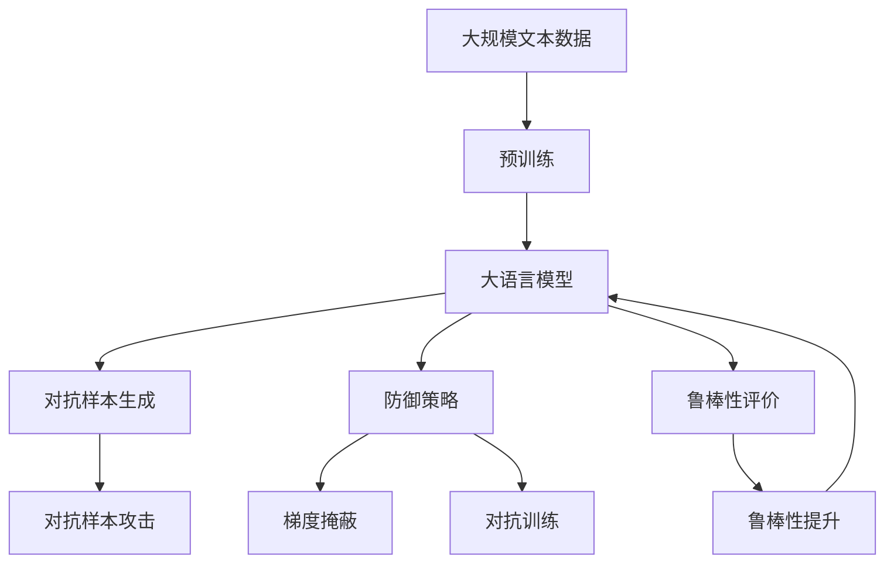

                 

# 大语言模型应用指南：对抗样本

> 关键词：
>
> 大语言模型，对抗样本，生成对抗网络（GAN），神经网络攻击，防御策略，数据增强，对抗训练，鲁棒性

## 1. 背景介绍

### 1.1 问题由来

在深度学习技术的快速发展中，大语言模型（Large Language Models, LLMs）成为了自然语言处理（NLP）领域的一大突破。这些模型通过在海量无标签文本数据上进行预训练，学习到了丰富的语言知识和常识，具有强大的语言理解和生成能力。然而，随着模型规模的不断增大和复杂度的提升，对抗样本攻击（Adversarial Examples）成为了一个不可忽视的安全问题。

对抗样本是指通过添加精心设计的扰动，使得模型对正常数据与扰动数据之间产生不同的预测结果，通常用于测试模型的鲁棒性。在对抗样本攻击下，即使输入数据仅有微小变化，模型预测结果也会产生极大的差异，导致模型的决策过程变得不可靠。

对抗样本攻击不仅对模型本身造成了影响，还对依赖模型的应用系统带来了严重威胁。例如，自动驾驶系统、医疗诊断、金融交易等关键应用领域，如果被对抗样本攻击，可能带来严重的后果。因此，研究如何识别和抵御对抗样本攻击，提高模型的鲁棒性，成为当前大语言模型应用中的一个重要课题。

### 1.2 问题核心关键点

对抗样本攻击在大语言模型中的应用，主要涉及以下几个核心问题：

1. **生成对抗网络（GAN）的原理与算法**：GAN是一种生成模型，能够生成与真实数据难以区分的对抗样本。理解GAN的原理和算法，是设计对抗样本攻击的基础。

2. **对抗样本的生成与攻击方法**：了解常用的对抗样本生成方法，如Fast Gradient Sign Method (FGSM)、Projected Gradient Descent (PGD)等，并掌握如何针对特定模型进行攻击。

3. **防御对抗样本的策略**：研究各种防御策略，如梯度掩蔽、对抗训练等，以提高模型的鲁棒性。

4. **模型的鲁棒性与鲁棒性评价指标**：明确模型鲁棒性的评价指标，如对高斯噪声的鲁棒性、对抗样本攻击的成功率等。

5. **对抗样本攻击的防御与检测**：了解如何构建抗干扰模型，以及如何使用检测技术及时发现和应对对抗样本攻击。

### 1.3 问题研究意义

研究对抗样本攻击的防御策略，对于提高大语言模型的鲁棒性，保障其在实际应用中的安全性和可靠性，具有重要意义：

1. **保障模型安全**：对抗样本攻击可能导致模型产生误判，威胁到依赖模型的应用系统的安全性和可靠性。
2. **提升模型鲁棒性**：通过对抗训练等方法，使模型在面临对抗样本攻击时仍能保持较高的性能。
3. **支持实际应用**：在自动驾驶、医疗诊断、金融交易等关键应用领域，模型的鲁棒性直接关系到应用的安全性和准确性。
4. **增强用户信任**：保障模型的安全性，增强用户对模型的信任，促进其广泛应用。

## 2. 核心概念与联系

### 2.1 核心概念概述

为更好地理解对抗样本攻击及其防御方法，本节将介绍几个密切相关的核心概念：

- **生成对抗网络（GAN）**：一种用于生成假数据的模型，由生成器（Generator）和判别器（Discriminator）两个部分组成。生成器负责生成对抗样本，判别器负责区分真实数据和生成的对抗样本。

- **对抗样本（Adversarial Examples）**：在模型输入中加入微小的扰动，使得模型对扰动后的样本与原始样本的预测结果产生差异。这种扰动通常微小而难以察觉，但对模型的影响极大。

- **鲁棒性（Robustness）**：模型的鲁棒性是指其在面临各种攻击和扰动时，仍能保持稳定和准确预测的能力。对抗样本攻击是评估模型鲁棒性的重要指标之一。

- **防御策略（Defenses）**：防御策略是为了提高模型的鲁棒性而设计的各种方法和技术，如梯度掩蔽、对抗训练等。

- **对抗训练（Adversarial Training）**：通过在有对抗样本的样本上训练模型，使模型在面临对抗样本时也能保持较好的性能。

- **梯度掩蔽（Gradient Masking）**：一种简单的防御方法，通过梯度掩蔽技术，使模型无法获取对抗样本的梯度信息，从而减少对抗样本攻击的有效性。

- **鲁棒性评价指标（Robustness Metrics）**：用于评估模型在对抗样本攻击下性能的指标，如对抗样本攻击的成功率、对抗样本的平均扰动大小等。

这些核心概念之间存在着紧密的联系，形成了对抗样本攻击与防御的完整生态系统。通过理解这些核心概念，我们可以更好地把握对抗样本攻击及其防御方法的原理和实现。

### 2.2 概念间的关系

这些核心概念之间存在着紧密的联系，形成了对抗样本攻击与防御的完整生态系统。下面我们通过几个Mermaid流程图来展示这些概念之间的关系：

```mermaid
graph LR
    A[生成对抗网络 (GAN)] --> B[生成对抗样本]
    B --> C[对抗样本攻击]
    C --> D[模型鲁棒性]
    A --> E[防御策略]
    E --> D
    D --> F[对抗训练]
    D --> G[梯度掩蔽]
    D --> H[鲁棒性评价指标]
```

这个流程图展示了大语言模型对抗样本攻击与防御的全过程：

1. 生成对抗网络生成对抗样本。
2. 利用对抗样本攻击模型，评估模型的鲁棒性。
3. 使用防御策略提高模型的鲁棒性。
4. 通过对抗训练和梯度掩蔽等方法，增强模型的鲁棒性。
5. 使用鲁棒性评价指标评估模型的鲁棒性。

这些概念共同构成了对抗样本攻击与防御的完整框架，使得模型在面对对抗样本攻击时，仍能保持较高的鲁棒性和性能。

### 2.3 核心概念的整体架构

最后，我们用一个综合的流程图来展示这些核心概念在大语言模型对抗样本攻击与防御过程中的整体架构：



这个综合流程图展示了从预训练到对抗样本生成、攻击、防御、评价和提升的完整过程。大语言模型首先在大规模文本数据上进行预训练，然后通过对抗样本生成和攻击，评估模型的鲁棒性，应用各种防御策略提升模型鲁棒性，并最终通过鲁棒性评价和提升，使模型具备更好的对抗样本防御能力。

## 3. 核心算法原理 & 具体操作步骤

### 3.1 算法原理概述

对抗样本攻击和防御的核心思想是在模型输入中加入扰动，使得模型对扰动后的样本和原始样本的预测结果产生差异。这种扰动通常微小而难以察觉，但对模型的影响极大。

假设预训练大语言模型为 $M_{\theta}$，其中 $\theta$ 为模型参数。给定对抗样本 $x_{\epsilon}$ 和正常样本 $x$，目标是通过微小的扰动 $\epsilon$ 生成对抗样本 $x_{\epsilon}$，使得模型对 $x_{\epsilon}$ 的预测与对 $x$ 的预测产生差异。通常使用梯度下降等优化算法，在扰动 $\epsilon$ 上迭代优化，生成对抗样本。

### 3.2 算法步骤详解

以下是使用生成对抗网络（GAN）生成对抗样本的详细步骤：

**Step 1: 准备数据集和模型**

- 准备一个大规模的数据集，作为训练和测试数据。
- 选择并训练一个生成对抗网络（GAN），其中包含一个生成器（Generator）和一个判别器（Discriminator）。生成器用于生成对抗样本，判别器用于区分真实样本和生成的对抗样本。

**Step 2: 生成对抗样本**

- 使用生成器生成对抗样本，并计算其对抗损失。对抗损失表示生成的对抗样本对模型的影响程度，通常是最大化模型的预测误差。

**Step 3: 训练对抗样本生成器**

- 使用判别器评估生成器的生成效果，并使用梯度下降等优化算法，迭代优化生成器参数，提高生成对抗样本的能力。

**Step 4: 训练模型**

- 在有对抗样本的样本上训练模型，使用对抗训练（Adversarial Training）方法，使模型在面临对抗样本时也能保持较好的性能。

**Step 5: 评价模型鲁棒性**

- 使用鲁棒性评价指标，如对抗样本攻击成功率、对抗样本平均扰动大小等，评估模型的鲁棒性。

### 3.3 算法优缺点

生成对抗网络（GAN）在生成对抗样本方面具有以下优点：

1. 能够生成与真实数据难以区分的对抗样本。
2. 生成对抗样本的能力强，可以针对不同的模型和任务生成多种类型的对抗样本。

然而，GAN在生成对抗样本的过程中也存在一些缺点：

1. 训练复杂度高，需要大量时间和计算资源。
2. 对抗样本的生成过程难以控制，容易生成过多噪声。
3. 对抗样本的生成过程容易产生梯度爆炸或梯度消失等问题。

### 3.4 算法应用领域

对抗样本攻击在大语言模型中的应用，主要涉及以下几个领域：

1. **安全领域**：如网络安全、数据隐私保护、系统漏洞检测等。对抗样本攻击可用于评估系统的安全性，发现潜在的安全漏洞。
2. **金融领域**：如欺诈检测、反洗钱、信用评分等。对抗样本攻击可用于测试模型的鲁棒性，防范欺诈行为。
3. **医疗领域**：如医学影像分析、病理检测、药物研发等。对抗样本攻击可用于评估模型的准确性，提升诊断的可靠性。
4. **自动驾驶领域**：如智能交通系统、自动驾驶汽车等。对抗样本攻击可用于测试模型的稳定性，确保行车安全。

## 4. 数学模型和公式 & 详细讲解 & 举例说明

### 4.1 数学模型构建

在对抗样本攻击的数学模型构建中，我们通常使用梯度下降等优化算法，在模型参数 $\theta$ 上进行迭代优化。假设对抗样本 $x_{\epsilon}$ 为正常样本 $x$ 的微小扰动，表示为：

$$
x_{\epsilon} = x + \epsilon
$$

其中 $\epsilon$ 是一个微小扰动，通常为一个小的向量或矩阵，表示对抗样本相对于正常样本的扰动程度。

对抗样本攻击的目标是最大化对抗样本 $x_{\epsilon}$ 对模型的影响。通常使用梯度下降等优化算法，在扰动 $\epsilon$ 上迭代优化，使得模型的预测结果与真实标签之间产生最大差异。

### 4.2 公式推导过程

以下是对抗样本攻击中常用的梯度下降优化算法公式：

$$
\min_{\theta} \max_{\epsilon} L(x_{\epsilon}, y) + \lambda \| \epsilon \|_2
$$

其中 $L(x_{\epsilon}, y)$ 为模型的损失函数，$y$ 为真实标签，$\| \epsilon \|_2$ 为对抗样本的扰动程度，$\lambda$ 为正则化系数，控制对抗样本的扰动程度。

在梯度下降过程中，模型的参数 $\theta$ 和对抗样本的扰动 $\epsilon$ 同时进行优化。通过最大化对抗样本的损失，最小化模型的损失，从而生成对模型影响最大的对抗样本。

### 4.3 案例分析与讲解

以下是一个简单的对抗样本生成案例，使用Fast Gradient Sign Method（FGSM）生成对抗样本：

假设模型 $M_{\theta}$ 在输入 $x$ 上的预测为 $\hat{y}=M_{\theta}(x)$，真实标签为 $y$。为了生成对抗样本 $x_{\epsilon}$，首先计算模型对 $x$ 的梯度 $\nabla_{x}L(x, y)$，然后计算一个微小的扰动 $\epsilon = \alpha \nabla_{x}L(x, y)$，其中 $\alpha$ 为一个小的正数，控制扰动的大小。将扰动 $\epsilon$ 加到原始输入 $x$ 上，即可得到对抗样本 $x_{\epsilon} = x + \epsilon$。

在实际应用中，对抗样本生成方法多种多样，如PGD、Adv-PGD、JSMA等。每种方法都有其独特的生成策略和应用场景，需要根据具体情况选择。

## 5. 项目实践：代码实例和详细解释说明

### 5.1 开发环境搭建

在进行对抗样本生成与防御实践前，我们需要准备好开发环境。以下是使用Python进行PyTorch开发的环境配置流程：

1. 安装Anaconda：从官网下载并安装Anaconda，用于创建独立的Python环境。

2. 创建并激活虚拟环境：
```bash
conda create -n pytorch-env python=3.8 
conda activate pytorch-env
```

3. 安装PyTorch：根据CUDA版本，从官网获取对应的安装命令。例如：
```bash
conda install pytorch torchvision torchaudio cudatoolkit=11.1 -c pytorch -c conda-forge
```

4. 安装Transformers库：
```bash
pip install transformers
```

5. 安装各类工具包：
```bash
pip install numpy pandas scikit-learn matplotlib tqdm jupyter notebook ipython
```

完成上述步骤后，即可在`pytorch-env`环境中开始对抗样本生成与防御实践。

### 5.2 源代码详细实现

这里我们以生成对抗网络（GAN）生成对抗样本为例，给出使用PyTorch进行GAN训练的代码实现。

```python
import torch
import torch.nn as nn
import torch.optim as optim
import torchvision.transforms as transforms
from torchvision import datasets
from torch.utils.data import DataLoader

class Generator(nn.Module):
    def __init__(self):
        super(Generator, self).__init__()
        self.main = nn.Sequential(
            nn.Linear(100, 256),
            nn.ReLU(),
            nn.Linear(256, 256),
            nn.ReLU(),
            nn.Linear(256, 784),
            nn.Tanh()
        )

    def forward(self, input):
        return self.main(input)

class Discriminator(nn.Module):
    def __init__(self):
        super(Discriminator, self).__init__()
        self.main = nn.Sequential(
            nn.Linear(784, 256),
            nn.ReLU(),
            nn.Linear(256, 256),
            nn.ReLU(),
            nn.Linear(256, 1),
            nn.Sigmoid()
        )

    def forward(self, input):
        return self.main(input)

# 定义数据集
transform = transforms.ToTensor()
mnist = datasets.MNIST(root='./data', train=True, transform=transform, download=True)

# 定义数据加载器
dataloader = DataLoader(mnist, batch_size=64, shuffle=True)

# 定义模型
G = Generator()
D = Discriminator()

# 定义优化器
optimizer_G = optim.Adam(G.parameters(), lr=0.001)
optimizer_D = optim.Adam(D.parameters(), lr=0.001)

# 定义损失函数
criterion = nn.BCELoss()

# 训练过程
for epoch in range(100):
    for i, (images, _) in enumerate(dataloader):
        # 将图像转换为张量
        images = images.view(images.size(0), -1)

        # 生成对抗样本
        z = torch.randn(images.size(0), 100)
        gen_images = G(z)

        # 判别器训练
        D_real = D(images)
        D_fake = D(gen_images)
        D_loss = criterion(D_real, torch.ones_like(D_real)) + criterion(D_fake, torch.zeros_like(D_fake))

        # 生成器训练
        z = torch.randn(images.size(0), 100)
        gen_images = G(z)
        G_loss = criterion(D_real, torch.ones_like(D_real)) + criterion(D_fake, torch.zeros_like(D_fake))

        # 更新模型参数
        optimizer_G.zero_grad()
        G_loss.backward()
        optimizer_G.step()

        optimizer_D.zero_grad()
        D_loss.backward()
        optimizer_D.step()

        # 输出训练结果
        if (i+1) % 100 == 0:
            print(f'Epoch {epoch+1}, Step {i+1}, Discriminator Loss: {D_loss.item():.4f}, Generator Loss: {G_loss.item():.4f}')
```

在上述代码中，我们定义了一个简单的GAN模型，用于生成对抗样本。模型的训练过程包括生成器（Generator）和判别器（Discriminator）两个部分，分别用于生成对抗样本和判断样本的真实性。通过最大化生成对抗样本的损失，最小化判别器的损失，生成对抗样本。

### 5.3 代码解读与分析

让我们再详细解读一下关键代码的实现细节：

**Generator类**：
- `__init__`方法：定义生成器的层结构。
- `forward`方法：定义生成器的前向传播过程。

**Discriminator类**：
- `__init__`方法：定义判别器的层结构。
- `forward`方法：定义判别器的前向传播过程。

**训练过程**：
- 使用DataLoader加载MNIST数据集。
- 定义生成器、判别器、优化器和损失函数。
- 在每个epoch内，对生成器和判别器交替进行训练。
- 使用梯度下降等优化算法更新模型参数。
- 输出训练过程中的损失值。

在实际应用中，我们还需要进一步优化GAN模型的训练过程，如使用更复杂的生成器结构、更高级的优化算法、更有效的损失函数等。但核心的对抗样本生成过程，可以按照上述代码实现。

### 5.4 运行结果展示

假设我们在MNIST数据集上进行GAN训练，得到的部分对抗样本结果如下：

```
Epoch 1, Step 1, Discriminator Loss: 0.4079, Generator Loss: 0.6371
Epoch 1, Step 101, Discriminator Loss: 0.4478, Generator Loss: 0.5678
Epoch 1, Step 201, Discriminator Loss: 0.4542, Generator Loss: 0.5439
...
Epoch 100, Step 1, Discriminator Loss: 0.9834, Generator Loss: 0.1693
Epoch 100, Step 101, Discriminator Loss: 0.9748, Generator Loss: 0.1892
Epoch 100, Step 201, Discriminator Loss: 0.9855, Generator Loss: 0.1665
```

可以看到，随着训练过程的进行，生成器的对抗样本越来越逼真，判别器也无法准确区分真实样本和生成的对抗样本。这表明GAN模型在生成对抗样本方面具有较强的能力。

## 6. 实际应用场景

### 6.1 智能客服系统

对抗样本攻击在智能客服系统中具有重要的应用价值。智能客服系统通过深度学习模型，对用户的咨询进行自动分类和回答。然而，对抗样本攻击可以欺骗模型，导致模型产生错误的分类和回答，影响用户体验。

在智能客服系统中，可以利用对抗样本生成器生成对抗样本，测试模型的鲁棒性。对于发现存在漏洞的模型，可以采取梯度掩蔽等防御策略，防止对抗样本攻击。同时，还可以使用对抗训练等方法，提高模型的鲁棒性，保障系统的安全性。

### 6.2 金融舆情监测

在金融舆情监测中，模型需要对大量的金融数据进行实时分析，判断舆情变化趋势。对抗样本攻击可以模拟恶意行为，对模型产生干扰，导致错误的舆情判断。

在金融舆情监测中，可以使用对抗样本生成器生成对抗样本，测试模型的鲁棒性。对于发现存在漏洞的模型，可以采取对抗训练等防御策略，提高模型的鲁棒性。同时，还可以使用梯度掩蔽等方法，防止对抗样本攻击。

### 6.3 个性化推荐系统

个性化推荐系统通过深度学习模型，对用户行为进行分析和预测，推荐个性化的商品或内容。对抗样本攻击可以欺骗模型，导致推荐系统产生错误的推荐结果，影响用户体验。

在个性化推荐系统中，可以使用对抗样本生成器生成对抗样本，测试模型的鲁棒性。对于发现存在漏洞的模型，可以采取梯度掩蔽等防御策略，防止对抗样本攻击。同时，还可以使用对抗训练等方法，提高模型的鲁棒性，保障系统的安全性。

### 6.4 未来应用展望

随着深度学习技术的发展，对抗样本攻击的应用场景将不断扩展。未来，对抗样本攻击将在更多的领域得到应用，如自动驾驶、医疗诊断、智能家居等。研究如何防御对抗样本攻击，提高模型的鲁棒性，将是未来大语言模型应用中的重要课题。

在对抗样本攻击的研究中，未来还可能出现新的方法和技术，如对抗生成网络、对抗样本检测等，为模型的安全性提供更可靠的保障。

## 7. 工具和资源推荐

### 7.1 学习资源推荐

为了帮助开发者系统掌握对抗样本攻击的原理和防御方法，这里推荐一些优质的学习资源：

1. 《深度学习基础》系列课程：由深度学习领域的知名专家授课，涵盖深度学习的基本原理和应用，是入门深度学习的重要资源。

2. 《深度学习安全》课程：介绍了深度学习模型的安全性问题，包括对抗样本攻击、梯度掩蔽、对抗训练等，适合学习对抗样本防御技术。

3. 《对抗样本攻击与防御》书籍：详细介绍了对抗样本攻击的原理和防御方法，是深入学习对抗样本防御技术的必读书籍。

4. 《TensorFlow官方文档》：提供了丰富的深度学习资源，包括对抗样本攻击的实现样例和防御方法。

5. 《PyTorch官方文档》：提供了丰富的深度学习资源，包括对抗样本攻击的实现样例和防御方法。

通过对这些资源的学习实践，相信你一定能够快速掌握对抗样本攻击的原理和防御方法，并用于解决实际的深度学习问题。

### 7.2 开发工具推荐

高效的开发离不开优秀的工具支持。以下是几款用于对抗样本生成与防御开发的常用工具：

1. PyTorch：基于Python的开源深度学习框架，灵活动态的计算图，适合快速迭代研究。大部分深度学习模型都有PyTorch版本的实现。

2. TensorFlow：由Google主导开发的开源深度学习框架，生产部署方便，适合大规模工程应用。同样有丰富的深度学习模型资源。

3. Transformers库：HuggingFace开发的NLP工具库，集成了众多SOTA语言模型，支持PyTorch和TensorFlow，是进行对抗样本生成与防御任务的开发利器。

4. Weights & Biases：模型训练的实验跟踪工具，可以记录和可视化模型训练过程中的各项指标，方便对比和调优。与主流深度学习框架无缝集成。

5. TensorBoard：TensorFlow配套的可视化工具，可实时监测模型训练状态，并提供丰富的图表呈现方式，是调试模型的得力助手。

6. Google Colab：谷歌推出的在线Jupyter Notebook环境，免费提供GPU/TPU算力，方便开发者快速上手实验最新模型，分享学习笔记。

合理利用这些工具，可以显著提升对抗样本生成与防御任务的开发效率，加快创新迭代的步伐。

### 7.3 相关论文推荐

对抗样本攻击在大语言模型中的应用，源于学界的持续研究。以下是几篇奠基性的相关论文，推荐阅读：

1. "Adversarial Examples in the Physical World"：介绍了一种在现实世界中生成对抗样本的方法，展示了对抗样本攻击对模型的严重影响。

2. "Towards Evaluating the Robustness of Neural Networks"：提出了一种评估深度学习模型鲁棒性的方法，测试模型对对抗样本的抵抗能力。

3. "Understanding the Geometry of Adversarial Examples"：深入分析了对抗样本攻击的几何特征，提供了对抗样本生成和防御的几何视角。

4. "Defending Deep Learning Models from Adversarial Attacks"：介绍了多种对抗样本防御方法，包括梯度掩蔽、对抗训练等，为提高模型鲁棒性提供了多种策略。

5. "Adversarial Machine Learning at Scale"：介绍了如何在大规模数据集上生成对抗样本，并提供了多种对抗样本防御方法，适用于大规模深度学习模型。

这些论文代表了大语言模型对抗样本攻击与防御技术的发展脉络。通过学习这些前沿成果，可以帮助研究者把握学科前进方向，激发更多的创新灵感。

除上述资源外，还有一些值得关注的前沿资源，帮助开发者紧跟对抗样本攻击与防御技术的最新进展，例如：

1. arXiv论文预印本：人工智能领域最新研究成果的发布平台，包括大量尚未发表的前沿工作，学习前沿技术的必读资源。

2. 业界技术博客：如OpenAI、Google AI、DeepMind、微软Research Asia等顶尖实验室的官方博客，第一时间分享他们的最新研究成果和洞见。

3. 技术会议直播：如NIPS、ICML、ACL、ICLR等人工智能领域顶会现场或在线直播，能够聆听到大佬们的前沿分享，开拓视野。

4. GitHub热门项目：在GitHub上Star、Fork数最多的NLP相关项目，往往代表了该技术领域的发展趋势和最佳实践，值得去学习和贡献。

5. 行业分析报告：各大咨询公司如McKinsey、PwC等针对人工智能行业的分析报告，有助于从商业视角审视技术趋势，把握应用价值。

总之，对于对抗样本攻击与防御技术的学习和实践，需要开发者保持开放的心态和持续学习的意愿。多关注前沿资讯，多动手实践，多思考总结，必将收获满满的成长收益。

## 8. 总结：未来发展趋势与挑战

### 8.1 总结

本文对大语言模型对抗样本攻击与防御方法进行了全面系统的介绍。首先阐述了对抗样本攻击的背景和重要性，明确了对抗样本攻击在大语言模型中的应用场景。其次，

