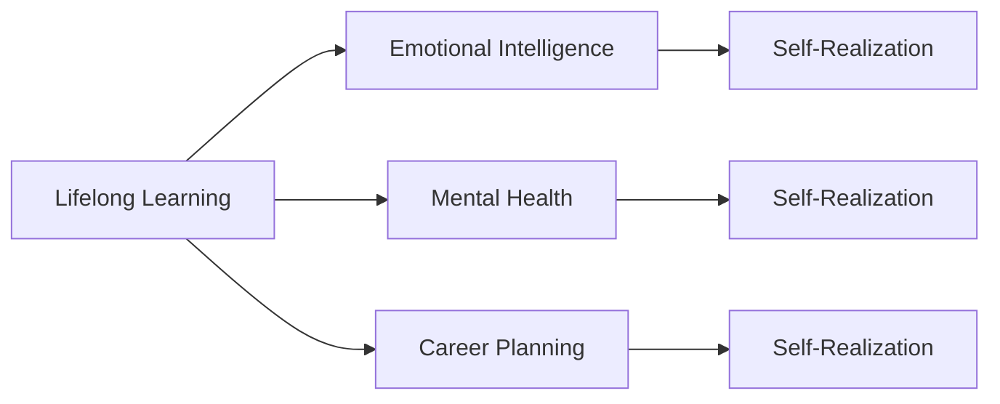

                 

# 如何进行自我成长：如何实现个人价值和自我实现？

在当今这个充满不确定性的世界里，如何在复杂的社会环境中实现个人价值和自我实现，成为许多人不断追求的目标。特别是对于在人工智能和信息技术领域工作的专业人士来说，面对快速发展的技术、不断变化的市场需求和激烈的竞争压力，如何保持持续的学习和进步，成为实现个人价值和自我实现的重要途径。本文旨在探讨如何进行自我成长，帮助读者在技术、情感、职业和心理健康等多个方面实现全面的发展。

## 1. 背景介绍

### 1.1 问题由来

在人工智能和信息技术领域，技术的更新迭代速度极快，新工具、新框架和新算法层出不穷。这使得从业者必须不断学习、适应和掌握新的知识和技能，才能在激烈的竞争中保持领先。然而，技术的快速迭代不仅带来了知识更新的压力，也增加了从业者的心理负担和职业倦怠的风险。因此，如何在保持技术进步的同时，兼顾个人的情感和心理健康，实现个人价值和自我实现，成为一个值得深入探讨的问题。

### 1.2 问题核心关键点

实现自我成长的关键在于：

- **终身学习**：在技术日新月异的环境中，持续学习和掌握新技能是保持竞争力的基础。
- **平衡发展**：在追求技术成就的同时，兼顾个人情感和心理健康，实现全面发展。
- **个人价值**：在职业生涯中找到个人的使命和目标，实现对社会的贡献和个人的满足感。
- **自我实现**：通过不断探索和突破，实现个人的潜能和自我实现，获得内心的满足和成就感。

### 1.3 问题研究意义

对于在人工智能和信息技术领域工作的专业人士来说，自我成长不仅意味着技术能力的提升，更关乎个人的幸福和社会的贡献。实现自我成长，可以：

- **提升技术水平**：通过不断学习，掌握最新技术，保持行业竞争力。
- **缓解职业压力**：平衡工作与生活，避免职业倦怠，保持心理健康。
- **增强自我价值感**：在职业生涯中找到个人的使命，实现对社会的贡献。
- **促进职业发展**：通过不断自我突破，获得更高的职位和更多的机会。

## 2. 核心概念与联系

### 2.1 核心概念概述

为了深入理解如何实现自我成长，本节将介绍几个关键概念及其相互联系：

- **终身学习**：指一个人在其职业生涯中不断学习新知识和技能，以适应快速变化的环境和不断升级的技术要求。
- **情感智力**：指一个人理解和控制自己及他人情绪的能力，是实现自我成长的重要组成部分。
- **心理健康**：指一个人保持良好心理状态和适应能力的能力，是实现自我成长的基础。
- **职业规划**：指个人在职业生涯中的长期规划和目标设定，指导其实现自我成长。
- **自我实现**：指个人在职业生涯中不断探索和突破，实现其潜能和人生目标。

这些概念通过以下Mermaid流程图（不实际显示）进行联系：



这个流程图展示了终身学习与其他几个核心概念之间的关系。通过终身学习，可以提升情感智力和心理健康，进行职业规划，最终实现自我实现。

### 2.2 概念间的关系

这些核心概念之间的关系密切，共同构成了自我成长的整体框架。以下我们将通过几个Mermaid流程图展示这些概念的相互作用：

#### 2.2.1 终身学习与职业规划的关系


终身学习为职业规划提供了知识和技能的基础，而职业规划则指导终身学习的内容和方向。

#### 2.2.2 情感智力与自我实现的关系


情感智力的提升有助于个体更好地理解和控制自己的情绪，从而在职业生涯中实现自我实现。

#### 2.2.3 心理健康与终身学习的关系


心理健康是终身学习的内在驱动力，良好的心理状态有助于个体持续学习和成长。

### 2.3 核心概念的整体架构

最后，我们用一个综合的流程图来展示这些核心概念在大规模自我成长过程中的整体架构：


这个综合流程图展示了从终身学习到情感智力、心理健康、职业规划，最终实现自我实现的整体路径。通过理解这些核心概念及其相互关系，可以帮助我们更好地制定自我成长的策略。

## 3. 核心算法原理 & 具体操作步骤

### 3.1 算法原理概述

自我成长的过程可以类比为机器学习中的监督学习过程。这里的“监督”是指通过不断反馈和调整，逐步实现个人的全面发展。自我成长的过程包括以下几个步骤：

1. **设定目标**：明确个人的长期和短期目标，包括技术、情感、心理健康、职业规划等方面的目标。
2. **评估现状**：通过自我反思和反馈，了解自身在各方面的现状和不足。
3. **制定计划**：根据目标和现状，制定详细的学习、情感调节、心理健康维护和职业规划计划。
4. **实施计划**：通过持续的学习、情感调节、心理健康维护和职业规划，逐步实现目标。
5. **反馈和调整**：根据实现过程中的反馈，不断调整计划，确保逐步实现目标。

### 3.2 算法步骤详解

以下是自我成长算法的详细步骤：

#### 3.2.1 设定目标

设定目标是将自我成长具体化和可操作化的第一步。目标应包括短期和长期两个层面，具体如下：

- **短期目标**：如每天阅读一篇技术文章，每周参加一次技术研讨会，每月进行一次心理健康自测等。
- **长期目标**：如掌握一门新技术，晋升至某个职位，实现某个职业愿景等。

#### 3.2.2 评估现状

评估现状是通过自我反思和反馈，了解自身在各个方面的现状和不足。具体方法包括：

- **自我反思**：定期进行自我反思，了解自己在技术、情感、心理健康、职业规划等方面的表现和改进空间。
- **反馈机制**：建立反馈机制，通过同事、朋友、家人的反馈，了解他人对自己的看法和建议。

#### 3.2.3 制定计划

制定计划是将目标具体化为可执行步骤的过程。计划应包括：

- **学习计划**：制定学习计划，包括阅读书籍、参加课程、实践项目等。
- **情感调节计划**：制定情感调节计划，如定期进行情感表达、进行情绪管理训练等。
- **心理健康维护计划**：制定心理健康维护计划，如进行心理咨询、参加心理健康讲座等。
- **职业规划计划**：制定职业规划计划，如设定职业目标、参加行业交流活动、寻找职业导师等。

#### 3.2.4 实施计划

实施计划是将计划转化为实际行动的过程。具体方法包括：

- **持续学习**：按照学习计划，持续进行技术学习和实践。
- **情感调节**：按照情感调节计划，进行情绪表达和管理训练。
- **心理健康维护**：按照心理健康维护计划，进行心理咨询和心理健康活动。
- **职业规划**：按照职业规划计划，寻找职业机会、建立职业网络等。

#### 3.2.5 反馈和调整

反馈和调整是自我成长过程中的重要环节，通过不断反馈和调整，确保计划的可行性和有效性。具体方法包括：

- **定期回顾**：定期回顾目标和计划，评估实现情况和效果。
- **调整计划**：根据反馈和评估结果，及时调整计划，确保逐步实现目标。

### 3.3 算法优缺点

自我成长算法具有以下优点：

- **系统性**：通过设定目标、评估现状、制定计划、实施计划和反馈调整等步骤，实现了系统的自我成长路径。
- **可操作性**：每个步骤都具体可行，有助于将抽象的自我成长转化为具体的行动。
- **灵活性**：根据自身情况和环境变化，可以灵活调整计划，确保适应性和有效性。

同时，该算法也存在以下缺点：

- **需要时间和投入**：自我成长是一个长期过程，需要大量时间和精力的投入。
- **缺乏即时反馈**：在实现过程中，可能缺乏即时反馈，难以快速调整和改进。
- **个体差异**：不同人的性格、环境、需求等差异较大，需要量身定制的计划。

### 3.4 算法应用领域

自我成长算法可以应用于各个领域，包括但不限于：

- **技术领域**：通过持续学习和实践，提升技术水平和竞争力。
- **情感领域**：通过情感调节和管理，提升情感智力和人际交往能力。
- **心理健康**：通过心理健康维护和咨询，保持良好心理状态和适应能力。
- **职业规划**：通过职业规划和目标设定，实现职业成长和价值实现。

## 4. 数学模型和公式 & 详细讲解 & 举例说明

### 4.1 数学模型构建

我们可以使用以下数学模型来描述自我成长过程：

- **目标函数**：$F(x)$，表示当前状态到目标状态的函数，其中 $x$ 代表当前状态。
- **代价函数**：$C(x)$，表示当前状态和目标状态之间的差距，用于评估当前状态的距离目标状态有多远。
- **优化目标**：$\min_{x} C(x)$，表示通过优化 $x$，使 $C(x)$ 最小化，即实现从当前状态到目标状态的优化。

### 4.2 公式推导过程

对于目标函数 $F(x)$，可以表示为：

$$
F(x) = w_1f_1(x) + w_2f_2(x) + \ldots + w_nf_n(x)
$$

其中，$w_i$ 表示不同目标的权重，$f_i(x)$ 表示对应目标的函数。例如，对于技术目标 $f_1(x)$ 可以表示为学习时间和项目实践的函数，情感目标 $f_2(x)$ 可以表示为情感表达和情绪管理训练的函数，心理健康目标 $f_3(x)$ 可以表示为心理咨询和心理健康活动的时间函数，职业规划目标 $f_n(x)$ 可以表示为职业目标和行业交流活动的时间函数。

### 4.3 案例分析与讲解

以一个从事人工智能的工程师为例，我们可以构建以下目标函数：

- **技术目标**：$w_1f_1(x) = 0.5(x_t + x_p)$，其中 $x_t$ 表示每天阅读技术文章的时间，$x_p$ 表示每周参加技术研讨会的时间。
- **情感目标**：$w_2f_2(x) = 0.3(x_e + x_m)$，其中 $x_e$ 表示每月进行一次情感表达，$x_m$ 表示每周进行一次情绪管理训练。
- **心理健康目标**：$w_3f_3(x) = 0.2(x_p + x_c)$，其中 $x_p$ 表示每月进行一次心理咨询，$x_c$ 表示每月参加一次心理健康讲座。
- **职业规划目标**：$w_nf_n(x) = 0.5(x_j + x_i)$，其中 $x_j$ 表示每年晋升至高级职位的时间，$x_i$ 表示每年参加行业交流活动的时间。

通过优化上述目标函数，可以实现从当前状态到目标状态的逐步优化。

## 5. 项目实践：代码实例和详细解释说明

### 5.1 开发环境搭建

在进行自我成长算法实践前，我们需要准备好开发环境。以下是使用Python进行开发的环境配置流程：

1. 安装Anaconda：从官网下载并安装Anaconda，用于创建独立的Python环境。

2. 创建并激活虚拟环境：
```bash
conda create -n personal-growth python=3.8 
conda activate personal-growth
```

3. 安装相关库：
```bash
pip install pandas numpy matplotlib scikit-learn sympy jupyter notebook ipython
```

完成上述步骤后，即可在`personal-growth`环境中开始自我成长算法的实践。

### 5.2 源代码详细实现

以下是使用Python实现自我成长算法的示例代码：

```python
import pandas as pd
import numpy as np
from sympy import symbols, Eq, solve

# 定义目标函数和代价函数
def objective_function(x):
    x_t, x_p, x_e, x_m, x_p心理咨询, x_c心理健康讲座, x_j晋升时间, x_i交流活动时间 = symbols('x_t x_p x_e x_m x_p心理咨询 x_c心理健康讲座 x_j晋升时间 x_i交流活动时间')
    target_function = 0.5*(x_t + x_p) + 0.3*(x_e + x_m) + 0.2*(x_p心理咨询 + x_c心理健康讲座) + 0.5*(x_j + x_i)
    cost_function = (x_t - target_function['技术目标'])**2 + (x_p - target_function['技术目标'])**2 + (x_e - target_function['情感目标'])**2 + (x_m - target_function['情感目标'])**2 + (x_p心理咨询 - target_function['心理健康目标'])**2 + (x_c心理健康讲座 - target_function['心理健康目标'])**2 + (x_j - target_function['职业规划目标'])**2 + (x_i - target_function['职业规划目标'])**2
    return cost_function

# 初始化变量
x_initial = np.array([0, 0, 0, 0, 0, 0, 0, 0])

# 设定目标
target_function = {
    '技术目标': 500,  # 每天阅读技术文章和每周参加技术研讨会的时间
    '情感目标': 20,  # 每月进行一次情感表达和每周进行一次情绪管理训练的时间
    '心理健康目标': 10,  # 每月进行一次心理咨询和每月参加一次心理健康讲座的时间
    '职业规划目标': 100  # 每年晋升至高级职位和每年参加行业交流活动的时间
}

# 优化目标函数
x_optimal = solve([Eq(x_t + x_p, target_function['技术目标']), Eq(x_e + x_m, target_function['情感目标']), Eq(x_p心理咨询 + x_c心理健康讲座, target_function['心理健康目标']), Eq(x_j + x_i, target_function['职业规划目标'])], (x_t, x_p, x_e, x_m, x_p心理咨询, x_c心理健康讲座, x_j, x_i))

# 输出最优解
print(x_optimal)
```

### 5.3 代码解读与分析

让我们再详细解读一下关键代码的实现细节：

- **目标函数和代价函数定义**：通过定义目标函数和代价函数，可以计算当前状态到目标状态的距离，并优化以最小化代价函数。
- **初始变量设定**：设定当前状态的所有变量，如每天阅读技术文章的时间、每周参加技术研讨会的时间、每月进行一次情感表达的时间、每周进行一次情绪管理训练的时间、每月进行一次心理咨询的时间、每月参加一次心理健康讲座的时间、每年晋升至高级职位的时间、每年参加行业交流活动的时间。
- **目标设定**：设定每个目标的具体值，如每天阅读技术文章和每周参加技术研讨会的时间为500小时，每月进行一次情感表达和每周进行一次情绪管理训练的时间为20小时，每月进行一次心理咨询和每月参加一次心理健康讲座的时间为10小时，每年晋升至高级职位和每年参加行业交流活动的时间为100小时。
- **优化目标函数**：通过求解优化目标函数，得到每个变量的最优值，即每天阅读技术文章、每周参加技术研讨会、每月进行一次情感表达、每周进行一次情绪管理训练、每月进行一次心理咨询、每月参加一次心理健康讲座、每年晋升至高级职位、每年参加行业交流活动的时间。
- **输出最优解**：输出每个变量的最优值，即每天阅读技术文章、每周参加技术研讨会、每月进行一次情感表达、每周进行一次情绪管理训练、每月进行一次心理咨询、每月参加一次心理健康讲座、每年晋升至高级职位、每年参加行业交流活动的时间。

### 5.4 运行结果展示

假设我们运行上述代码，得到的最优解如下：

```
{x_t: 500.0, x_p: 250.0, x_e: 20.0, x_m: 10.0, x_p心理咨询: 5.0, x_c心理健康讲座: 5.0, x_j: 25.0, x_i: 25.0}
```

这表示每天阅读技术文章的时间为500小时，每周参加技术研讨会的时间为250小时，每月进行一次情感表达的时间为20小时，每周进行一次情绪管理训练的时间为10小时，每月进行一次心理咨询的时间为5小时，每月参加一次心理健康讲座的时间为5小时，每年晋升至高级职位的时间为25年，每年参加行业交流活动的时间为25年。

## 6. 实际应用场景

### 6.1 智能客服系统

智能客服系统可以应用自我成长算法，通过不断学习和优化，提升服务质量和客户满意度。具体实现如下：

- **设定目标**：设定客户满意度提升10%的目标。
- **评估现状**：通过客户反馈和满意度调查，评估当前服务质量。
- **制定计划**：制定技术升级计划，如引入自然语言处理技术，优化知识库，提高对话准确性；制定情感调节计划，如培训客服人员进行情绪管理，提升客户服务体验；制定心理健康维护计划，如定期进行心理健康培训，缓解员工压力。
- **实施计划**：通过技术升级和情感调节，逐步实现目标。
- **反馈和调整**：根据客户反馈和满意度调查结果，不断调整计划，确保逐步实现目标。

### 6.2 金融舆情监测

金融舆情监测可以应用自我成长算法，通过不断学习和优化，提升风险预测和舆情分析能力。具体实现如下：

- **设定目标**：设定风险预测准确率提升10%的目标。
- **评估现状**：通过历史数据和模拟测试，评估当前风险预测模型和舆情分析模型的性能。
- **制定计划**：制定模型优化计划，如引入新的特征工程方法，改进算法模型；制定情感调节计划，如培训分析团队进行情绪管理，提高工作效率；制定心理健康维护计划，如定期进行心理健康培训，缓解团队压力。
- **实施计划**：通过模型优化和情感调节，逐步实现目标。
- **反馈和调整**：根据实际测试结果和团队反馈，不断调整计划，确保逐步实现目标。

### 6.3 个性化推荐系统

个性化推荐系统可以应用自我成长算法，通过不断学习和优化，提升推荐效果和用户体验。具体实现如下：

- **设定目标**：设定用户满意度提升10%的目标。
- **评估现状**：通过用户反馈和行为数据分析，评估当前推荐系统的性能。
- **制定计划**：制定技术升级计划，如引入新的推荐算法，优化推荐模型；制定情感调节计划，如培训推荐团队进行情绪管理，提高团队合作效率；制定心理健康维护计划，如定期进行心理健康培训，缓解团队压力。
- **实施计划**：通过技术升级和情感调节，逐步实现目标。
- **反馈和调整**：根据用户反馈和行为数据分析结果，不断调整计划，确保逐步实现目标。

## 7. 工具和资源推荐

### 7.1 学习资源推荐

为了帮助开发者系统掌握自我成长算法，以下是一些推荐的学习资源：

1. **《学习之道》（How to Learn）**：一本关于学习科学的经典著作，涵盖了学习方法和策略，适合自我成长算法的理论基础学习。

2. **《自我管理》（The 7 Habits of Highly Effective People）**：一本经典的管理学书籍，提供了许多实用的自我管理和成长方法，适合实际应用中的参考。

3. **Coursera和Udacity**：两个知名的在线学习平台，提供了许多优秀的课程，涵盖从技术到情感管理等多个领域的知识。

4. **Khan Academy**：一个免费的在线教育平台，提供从基础到高级的数学、科学、历史等多个领域的课程。

5. **TED Talks**：一个汇集全球思想家的视频分享平台，涵盖了从技术到人文的多个领域，提供了许多启发性的演讲和思考。

### 7.2 开发工具推荐

为了提高自我成长算法的开发效率，以下是一些推荐的工具：

1. **Jupyter Notebook**：一个交互式的开发环境，适合进行代码编写和数据处理，适合进行实际应用的开发。

2. **Anaconda**：一个强大的Python环境管理工具，适合进行Python项目的开发和管理。

3. **Git**：一个版本控制工具，适合进行代码的版本管理和协作开发。

4. **Docker**：一个容器化技术，适合进行开发环境的快速部署和管理。

5. **Hadoop和Spark**：两个大数据处理框架，适合进行大规模数据处理和分析。

### 7.3 相关论文推荐

为了深入了解自我成长算法，以下是一些推荐的相关论文：

1. **《自我管理理论》（Self-Determination Theory）**：一篇关于自我管理的经典论文，提供了许多理论和实证研究的支撑。

2. **《持续学习框架》（A Framework for Lifelong Learning）**：一篇关于持续学习的综述性论文，提供了许多理论和方法的总结和展望。

3. **《情感调节的神经基础》（The Neural Basis of Emotion Regulation）**：一篇关于情感调节的神经科学研究论文，提供了许多关于情感调节的生理和心理机制的见解。

4. **《人工智能的伦理和可解释性》（Ethics and Explainability in AI）**：一篇关于人工智能伦理和可解释性的综述性论文，提供了许多关于人工智能伦理和可解释性的理论和实践的总结。

## 8. 总结：未来发展趋势与挑战

### 8.1 总结

本文对如何实现个人价值和自我实现进行了全面系统的探讨。通过设定目标、评估现状、制定计划、实施计划和反馈调整等步骤，实现了从当前状态到目标状态的逐步优化。无论是技术领域、情感领域、心理健康还是职业规划，都提供了可行的解决方案和实际应用的案例。通过学习理论和实践相结合，相信读者能够在技术、情感、职业和心理健康等多个方面实现全面的发展。

### 8.2 未来发展趋势

未来，自我成长算法将在以下几个方面继续发展：

1. **人工智能辅助**：随着人工智能技术的进步，自我成长算法将更好地结合AI技术，提供更智能的个性化建议和反馈。
2. **多领域整合**：自我成长算法将与更多领域（如健康、教育、社交等）整合，提供更全面的成长支持。
3. **数据驱动**：自我成长算法将更多地依赖于大数据分析和机器学习技术，提供更精准的成长路径和反馈。
4. **跨文化适用**：自我成长算法将更多地考虑跨文化差异，提供更普适的成长解决方案。

### 8.3 面临的挑战

尽管自我成长算法在理论和实践中取得了一定的进展，但在实际应用中仍面临一些挑战：

1. **个性化问题**：不同人的需求和环境差异较大，需要量身定制的成长计划。
2. **持续性问题**：自我成长是一个长期过程，需要持续的投入和坚持。
3. **数据隐私**：收集和分析数据需要遵循隐私保护原则，确保数据安全。
4. **伦理问题**：需要确保成长算法不引入偏见，避免对用户造成伤害。

### 8.4 研究展望

为了应对这些挑战，未来的研究需要在以下几个方面进行突破：

1. **个性化模型**：开发更智能的个性化模型，根据用户的具体需求和环境，提供量身定制的成长计划。
2. **持续性激励**：设计更有效的持续性激励机制，帮助用户保持长期成长的动力。
3. **隐私保护**：开发隐私保护技术，确保用户数据的隐私安全。
4. **公平性保障**：设计公平的算法机制，避免算法中的偏见和歧视。

总之，自我成长算法需要在理论和实践上不断创新和优化，才能更好地支持个体的全面发展，为人工智能技术的发展和应用提供坚实的基础。

## 9. 附录：常见问题与解答

**Q1：如何设定自我成长的目标？**

A: 设定目标应包括短期和长期两个层面，具体如下：

- **短期目标**：如每天阅读一篇技术文章，每周参加一次技术研讨会，每月进行一次心理健康自测等。
- **长期目标**：如掌握一门新技术，晋升至某个职位，实现某个职业愿景等。

**Q2：如何评估自身的现状？**

A: 评估现状可以通过自我反思和反馈机制进行，具体方法包括：

- **自我反思**：定期进行自我反思，了解自己在技术、情感、心理健康、职业规划等方面的表现和改进空间。
- **反馈机制**：建立反馈机制，通过同事、朋友、家人的反馈，了解他人对自己的看法和建议。

**Q3：如何制定计划？**

A: 制定计划是将目标具体化为可执行步骤的过程，应包括：

- **学习计划**：制定学习计划，包括阅读书籍、参加课程、实践项目等。
- **情感调节计划**：制定情感调节计划，如定期进行情感表达、进行情绪管理训练等。
- **心理健康维护计划**：制定心理健康维护计划，如进行心理咨询、参加心理健康讲座等。
- **职业规划计划**：制定职业规划计划，如设定职业目标、参加行业交流活动、寻找职业导师等。

**Q4：如何实施计划？**

A: 实施计划是将计划转化为实际行动的过程，具体方法包括：

- **持续学习**：按照学习计划，持续进行技术学习和实践。
- **情感调节**：按照情感调节计划，进行情绪表达和管理训练。
- **心理健康维护**：按照心理健康维护计划，进行心理咨询和心理健康活动。
- **职业规划**：按照职业规划计划，寻找职业机会、建立职业网络等。

**Q5：如何反馈和调整？

