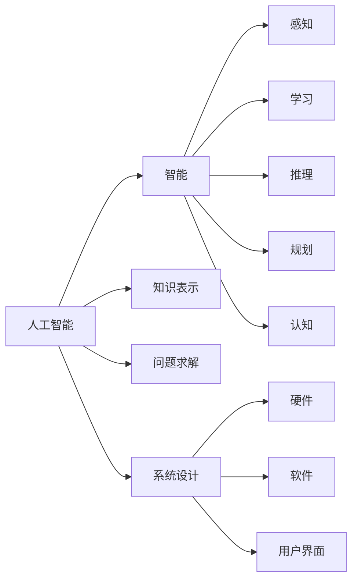

                 

# 1956年达特茅斯会议的豪迈宣言

在1956年的一个夏日，美国新罕布什尔州的达特茅斯学院迎来了一群年轻的科学家，他们在一场被誉为人工智能史开端的会议上，提出了许多划时代的研究议题，并为这一新兴领域绘制了未来发展的蓝图。

## 1. 背景介绍

### 1.1 问题由来
1950年，英国数学家阿兰·图灵在其论文《计算机器与智能》中首次提出了著名的图灵测试（Turing Test），为人工智能研究指明了方向。此后，人工智能逐渐成为科学界的研究热点。

1956年，美国达特茅斯学院在计算机科学家约翰·麦卡锡的倡议下召开了史上首次人工智能研讨会，标志着这一领域正式进入人们的视野。在这场会议中，麦卡锡提出，人工智能研究的目标是创造出可以模仿人的智能行为的机器。

### 1.2 问题核心关键点
达特茅斯会议奠定了人工智能学科的基础，主要包含以下几个核心关键点：
- **定义与目标**：明确了人工智能的研究目标是为机器赋予智能。
- **学科方向**：划定了包括信息论、符号逻辑、认知心理学、计算机科学等多个学科的研究方向。
- **研究范式**：倡导了基于符号和规则的系统设计，强调逻辑推理和知识表示。
- **创新思维**：引入了跨学科合作的模式，推动了人工智能研究的快速发展。

## 2. 核心概念与联系

### 2.1 核心概念概述
在达特茅斯会议中，关于人工智能的核心概念主要包括以下几个方面：

- **人工智能（Artificial Intelligence, AI）**：指通过计算系统实现人类智能行为的模拟。
- **智能**：包括感知、学习、推理、规划、认知等功能。
- **机器智能**：指机器能够自主完成任务，不需要人类干预。
- **知识表示**：将知识用符号和规则的形式表示出来，以便机器理解和应用。
- **问题求解**：通过算法设计，使机器能够解决各种复杂问题。
- **系统设计**：包括硬件、软件、用户界面等多个方面的设计。

### 2.2 概念间的关系

达特茅斯会议期间，科学家们通过一系列讨论，构建了人工智能研究的基本框架，其中各概念间的关系可以用以下Mermaid流程图来展示：



这个图表展示了人工智能领域的几个核心概念，以及它们之间的相互作用和关系。

## 3. 核心算法原理 & 具体操作步骤
### 3.1 算法原理概述
达特茅斯会议中提出的主要算法原理包括符号主义（Symbolism）和连接主义（Connectionism）。

- **符号主义**：基于逻辑符号和规则的推理，模拟人类思维过程。
- **连接主义**：模拟人脑神经网络，通过连接权重的学习，实现信息的传递和处理。

这些算法原理为后来的人工智能研究奠定了基础，推动了知识表示、推理系统、专家系统等多个子领域的诞生。

### 3.2 算法步骤详解
基于符号主义的算法步骤主要包括以下几个环节：

1. **问题建模**：将问题转化为逻辑符号表示，建立符号表示库。
2. **规则定义**：根据逻辑关系，定义一系列推理规则。
3. **推理引擎**：设计推理引擎，根据规则进行逻辑推理。
4. **知识库更新**：根据推理结果，更新知识库中的信息。

连接主义算法步骤则包含：

1. **神经网络设计**：构建神经网络结构，确定节点数和连接权重。
2. **数据输入**：将输入数据转化为神经元之间的连接权重和偏置。
3. **前向传播**：数据在前向传播中经过节点处理，形成输出。
4. **反向传播**：通过误差反向传播，调整连接权重和偏置，优化模型。

### 3.3 算法优缺点
符号主义算法的优点包括：
- **符号明确**：逻辑符号具有明确的意义，便于理解和调试。
- **可解释性强**：推理过程透明，易于解释和审查。
- **易于扩展**：可以方便地增加新规则和知识库。

缺点则包括：
- **复杂度高**：需要大量的符号和规则，处理复杂问题时效率低下。
- **知识难以整合**：知识表示不充分，难以整合多源信息。

连接主义算法的优点：
- **高效处理**：通过并行计算，快速处理大量数据。
- **自适应性强**：能够学习并适应新的输入和环境变化。
- **泛化能力强**：网络结构能够泛化处理类似问题。

缺点包括：
- **不可解释性**：连接权重和偏置不透明，难以理解内部机制。
- **训练复杂**：需要大量的训练数据和计算资源。
- **过拟合风险**：容易受到数据噪声的影响，导致过拟合。

### 3.4 算法应用领域
达特茅斯会议期间提出的算法原理在多个领域得到了应用，具体包括：

- **专家系统**：基于知识库和推理规则，模拟人类专家进行决策支持。
- **自然语言处理**：将语言转换为符号表示，进行自动翻译、信息提取等任务。
- **机器人技术**：通过连接主义算法，实现机器人的感知、决策和控制。
- **机器学习**：通过连接主义算法的改进，推动了监督学习、无监督学习等技术的发展。

## 4. 数学模型和公式 & 详细讲解
### 4.1 数学模型构建
在达特茅斯会议中，人工智能的研究主要集中在符号主义和连接主义两个方向。这里以连接主义为例，介绍其数学模型构建：

- **神经网络**：由多个神经元（节点）组成，每个神经元接收来自其他神经元的输入，经过加权和处理后输出。
- **前向传播**：输入数据经过神经网络，形成最终输出。
- **反向传播**：计算输出误差，通过链式法则反向传播误差，调整连接权重和偏置。

### 4.2 公式推导过程
连接主义算法的核心公式包括前向传播和反向传播。以下是详细的公式推导过程：

1. **前向传播**：
   $$
   a_j = f(\sum_{i=1}^{n} w_{ij}a_i + b_j)
   $$
   其中，$a_j$ 为第 $j$ 个神经元的输出，$f$ 为激活函数，$w_{ij}$ 为第 $i$ 个神经元到第 $j$ 个神经元的连接权重，$b_j$ 为偏置项。

2. **反向传播**：
   $$
   \frac{\partial L}{\partial w_{ij}} = a_k \Delta_{kj} a_i
   $$
   其中，$L$ 为损失函数，$\Delta_{kj}$ 为误差传播项，$i$ 和 $j$ 分别为输入和输出神经元。

### 4.3 案例分析与讲解
假设有一个简单的两层神经网络，用于二分类问题。输入为 $x = [0.1, 0.2, 0.3]$，连接权重为 $w = [0.1, 0.2, 0.3]$，偏置为 $b = [0.1, 0.2]$。使用Sigmoid激活函数，计算前向传播和反向传播的输出和误差。

前向传播过程：
- $a_1 = 0.1x_1 + 0.2x_2 + 0.3x_3 + 0.1 = 0.6$
- $a_2 = f(0.1a_1 + 0.2a_2 + 0.3) = f(0.1 \times 0.6 + 0.2 \times 0.1 + 0.3) = 0.9$
- 输出为 $a_2$，预测为正类。

反向传播过程：
- 假设真实标签为负类，误差 $\Delta_2 = y - a_2 = -0.1$
- 计算误差传播项 $\Delta_1 = w_{12}\Delta_2 a_1 = 0.2 \times (-0.1) \times 0.6 = -0.024$
- 更新权重 $w_{12} = w_{12} + \eta \Delta_1 = 0.1 + \eta \times (-0.024)$

通过不断的迭代，神经网络可以逐渐优化连接权重和偏置，提高预测准确率。

## 5. 项目实践：代码实例和详细解释说明
### 5.1 开发环境搭建
要实现上述连接主义算法，我们需要搭建Python开发环境，并使用TensorFlow或PyTorch等深度学习框架。以下是具体的安装步骤：

1. 安装Anaconda：
   ```
   conda install anaconda
   ```

2. 创建虚拟环境：
   ```
   conda create --name myenv python=3.8
   conda activate myenv
   ```

3. 安装TensorFlow或PyTorch：
   ```
   pip install tensorflow
   # 或者
   pip install torch torchvision torchaudio
   ```

4. 安装相关库：
   ```
   pip install numpy pandas scikit-learn matplotlib
   ```

完成环境搭建后，我们可以开始使用TensorFlow或PyTorch进行神经网络模型的开发。

### 5.2 源代码详细实现
以下是一个使用TensorFlow实现神经网络模型的代码示例：

```python
import tensorflow as tf

# 定义神经网络结构
model = tf.keras.Sequential([
    tf.keras.layers.Dense(10, activation='relu', input_shape=(3,)),
    tf.keras.layers.Dense(1, activation='sigmoid')
])

# 编译模型
model.compile(optimizer='adam', loss='binary_crossentropy', metrics=['accuracy'])

# 训练模型
model.fit(x_train, y_train, epochs=100, batch_size=32)

# 预测新数据
predictions = model.predict(x_test)
```

### 5.3 代码解读与分析
在上述代码中，我们首先定义了一个包含两个全连接层的神经网络，使用ReLU作为激活函数，Sigmoid作为输出层激活函数。编译模型时，使用Adam优化器和二分类交叉熵损失函数。最后，使用训练数据集进行模型训练，并使用测试数据集进行预测。

### 5.4 运行结果展示
在训练完成后，我们可以使用测试数据集评估模型性能：

```python
test_loss, test_accuracy = model.evaluate(x_test, y_test)
print(f'Test accuracy: {test_accuracy:.2f}')
```

## 6. 实际应用场景
### 6.1 机器人导航
机器人导航是连接主义算法的一个重要应用场景。通过给机器人植入神经网络，机器人可以实时感知环境，通过视觉和传感器数据进行处理，自主规划路径，实现自动导航。

### 6.2 自然语言处理
连接主义算法在自然语言处理中也有广泛应用，如机器翻译、文本分类、信息提取等。通过构建基于神经网络的模型，可以实现高效的自然语言处理任务。

### 6.3 图像识别
神经网络在图像识别领域也有重要应用，如卷积神经网络（CNN）、残差网络（ResNet）等模型，可以在大规模数据集上进行预训练，实现高精度的图像识别任务。

### 6.4 未来应用展望
未来，基于连接主义算法的神经网络技术将在更多领域得到应用，如医疗诊断、智能交通、智能家居等。随着算力成本的下降和数据量的增长，神经网络模型的性能将进一步提升，应用场景将更加丰富。

## 7. 工具和资源推荐
### 7.1 学习资源推荐
- 《深度学习》（Ian Goodfellow著）：全面介绍深度学习的基础理论和实践技术。
- 《神经网络与深度学习》（Michael Nielsen著）：适合初学者理解神经网络的基本原理和应用。
- 《动手学深度学习》（李沐、李斌等著）：通过实践案例，深入浅出地讲解深度学习。

### 7.2 开发工具推荐
- TensorFlow：谷歌开源的深度学习框架，支持分布式训练和模型部署。
- PyTorch：Facebook开源的深度学习框架，易用性强，适合研究性工作。
- Keras：基于TensorFlow和PyTorch的高层次API，适合快速开发和实验。

### 7.3 相关论文推荐
- "A Connectionist Approach to Model-Independent Learning"（Rumelhart等人，1986）：连接主义学习机制的奠基之作。
- "Backpropagation: Applying the chain rule to artificial neural networks"（Rumelhart等人，1986）：反向传播算法的经典论文。
- "Deep Learning"（Goodfellow等人，2016）：深度学习领域的巨著，涵盖各种算法和技术。

## 8. 总结：未来发展趋势与挑战
### 8.1 研究成果总结
达特茅斯会议奠定了人工智能学科的基础，开创了符号主义和连接主义两条主要的研究路径。这些理论和算法至今仍然是人工智能领域的重要基石。

### 8.2 未来发展趋势
未来，人工智能研究将呈现以下几个发展趋势：
- **多模态融合**：将视觉、听觉、语言等多种模态信息进行深度融合，实现更为全面的人类智能模拟。
- **自主学习**：通过强化学习、无监督学习等技术，使机器具备更强的自主学习和决策能力。
- **泛化能力提升**：通过大规模数据训练和迁移学习等技术，提高模型的泛化能力和鲁棒性。
- **伦理与安全**：加强对人工智能技术伦理和安全性的研究，确保其应用的正确性和公正性。

### 8.3 面临的挑战
尽管达特茅斯会议奠定了人工智能的基础，但该领域仍面临诸多挑战：
- **数据稀缺**：许多任务缺乏大规模标注数据，限制了深度学习模型的性能提升。
- **计算资源**：大规模深度学习模型需要巨量的计算资源，训练和推理成本高昂。
- **模型复杂**：复杂模型的可解释性差，难以理解内部工作机制。
- **伦理与法律**：人工智能技术可能带来隐私、公平等问题，需要制定相应的法律法规。

### 8.4 研究展望
未来的人工智能研究需要从以下几个方面进行突破：
- **数据增强**：通过数据生成技术，扩大数据集规模，减少对标注数据的依赖。
- **模型简化**：设计更高效、更易于理解和解释的模型结构。
- **跨领域应用**：将人工智能技术应用于更多行业，解决实际问题。
- **公共议题**：围绕人工智能的伦理、法律、隐私等公共议题展开讨论，推动技术健康发展。

## 9. 附录：常见问题与解答
### Q1: 什么是人工智能？
**A:** 人工智能是指通过计算机实现人类的智能行为，包括感知、学习、推理、规划、认知等功能。

### Q2: 符号主义和连接主义有什么区别？
**A:** 符号主义基于逻辑符号和规则的推理，注重知识表示和逻辑推理；连接主义模拟人脑神经网络，通过连接权重的学习进行信息处理，注重数据驱动的计算。

### Q3: 神经网络的应用场景有哪些？
**A:** 神经网络在机器人导航、自然语言处理、图像识别、医疗诊断等多个领域有广泛应用。

### Q4: 未来的人工智能技术将面临哪些挑战？
**A:** 数据稀缺、计算资源限制、模型复杂性、伦理与法律问题是未来人工智能技术面临的主要挑战。

### Q5: 如何进行数据增强？
**A:** 数据增强可以通过数据生成、数据合成、数据扩增等技术，扩大数据集规模，减少对标注数据的依赖。

---

作者：禅与计算机程序设计艺术 / Zen and the Art of Computer Programming

