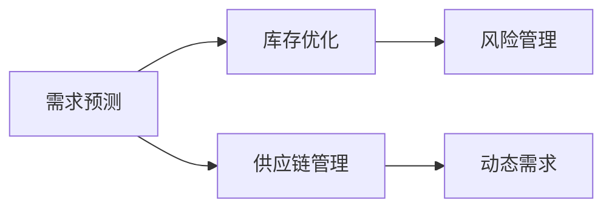
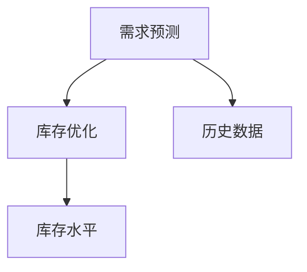
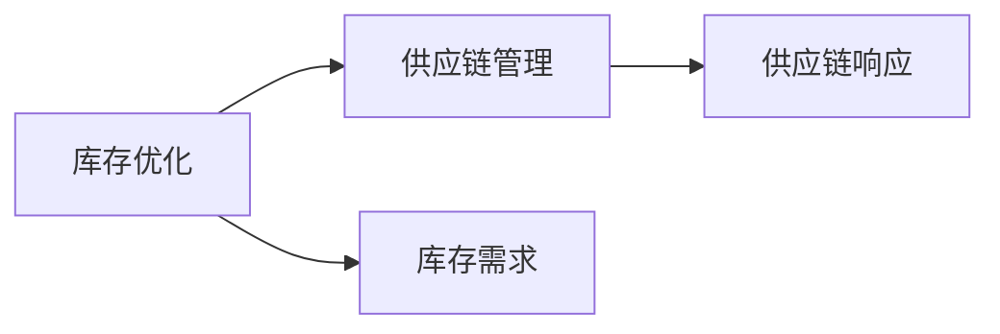
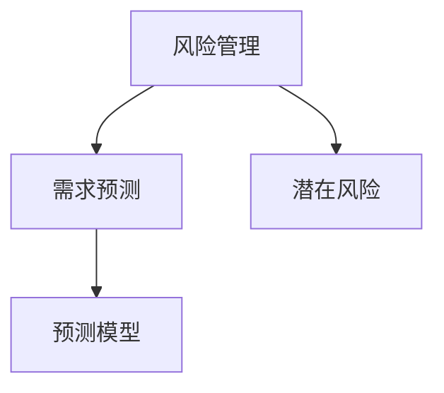
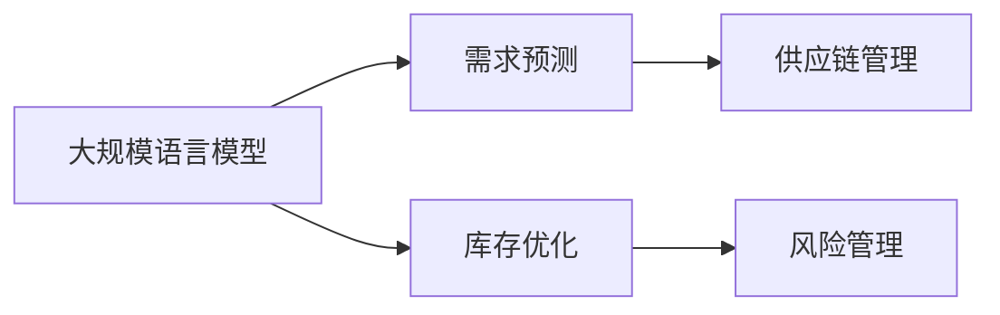

                 

# 库存管理的AI优化方案

> 关键词：
- 库存管理
- 人工智能
- 预测建模
- 优化算法
- 机器学习
- 动态需求
- 供应链优化

## 1. 背景介绍

### 1.1 问题由来
库存管理是企业运营的核心环节之一，其目标是在保证客户需求的同时，尽量减少库存成本和资金占用。传统库存管理依赖经验丰富的仓库管理人员和复杂的库存控制模型，但是随着产品种类繁多和客户需求变化莫测，这种基于规则的库存管理方法已经难以满足现代企业的运营需求。

近年来，人工智能（AI）和机器学习（ML）技术的迅猛发展，为库存管理提供了一种新的解决方案。AI可以通过数据分析和预测模型，精准地预测市场需求，优化库存水平，从而大幅提高运营效率和利润率。

### 1.2 问题核心关键点
基于AI的库存管理优化，其核心关键点包括：
1. 需求预测：准确预测市场需求，以便合理规划库存水平。
2. 库存优化：动态调整库存，以应对需求波动，避免库存积压和缺货情况。
3. 供应链管理：协调供应链上下游，确保库存需求和供应平衡。
4. 风险管理：识别和管理库存管理中的风险，如需求不确定性、供应链中断等。

这些关键点需要通过综合应用多种AI和ML技术来满足。本文将详细探讨这些技术的应用及其在库存管理中的实践。

### 1.3 问题研究意义
人工智能在库存管理中的应用，对于提升企业运营效率、降低库存成本和提高客户满意度具有重要意义：

1. 提高运营效率：AI能够实时监控库存水平和需求变化，快速做出响应，减少人工操作，降低错误率。
2. 降低库存成本：通过精准需求预测和库存优化，减少库存积压和浪费，提高资金使用效率。
3. 提升客户满意度：通过动态库存管理和供应链协调，确保产品供应的及时性和稳定性，提高客户体验。
4. 风险管理：AI可以通过历史数据分析和模拟，识别潜在风险，制定风险应对策略。
5. 智能决策：AI模型能够提供决策支持，帮助管理层做出更科学的库存管理决策。

## 2. 核心概念与联系

### 2.1 核心概念概述

为了更好地理解基于AI的库存管理优化方法，本节将介绍几个密切相关的核心概念：

- **需求预测**：通过历史数据和市场分析，预测未来的产品需求量，为库存管理提供数据支持。
- **库存优化**：利用AI技术动态调整库存水平，确保库存既不过多也不不足。
- **供应链管理**：协调供应链上下游，确保库存需求和供应平衡，减少供应链风险。
- **风险管理**：识别和管理库存管理中的不确定性和潜在风险，确保供应链的稳定性。
- **动态需求**：需求量随时间变化，需要通过AI模型进行动态预测和优化。

这些核心概念之间的逻辑关系可以通过以下Mermaid流程图来展示：



这个流程图展示了大规模语言模型微调过程中各个核心概念之间的关系：

1. 需求预测为库存优化和供应链管理提供数据基础。
2. 库存优化和供应链管理共同作用，确保库存水平和供应链稳定。
3. 风险管理对库存优化和供应链管理提供辅助决策，降低风险。
4. 动态需求是库存优化和供应链管理的重要考虑因素。

### 2.2 概念间的关系

这些核心概念之间存在着紧密的联系，形成了库存管理的完整生态系统。下面我们通过几个Mermaid流程图来展示这些概念之间的关系。

#### 2.2.1 需求预测与库存优化的关系



这个流程图展示需求预测与库存优化的关系：需求预测提供历史数据，库存优化根据预测结果调整库存水平。

#### 2.2.2 库存优化与供应链管理的关系



这个流程图展示库存优化与供应链管理的关系：库存优化根据库存需求调整供应链响应，确保供应链的稳定性。

#### 2.2.3 风险管理与需求预测的关系



这个流程图展示风险管理与需求预测的关系：风险管理识别潜在风险，优化需求预测模型，提高预测准确性。

### 2.3 核心概念的整体架构

最后，我们用一个综合的流程图来展示这些核心概念在大规模语言模型微调过程中的整体架构：



这个综合流程图展示了从大规模语言模型到库存管理的完整过程：

1. 大规模语言模型通过历史数据和市场分析进行需求预测。
2. 需求预测结果用于库存优化，调整库存水平。
3. 库存优化结果用于供应链管理，协调供应链上下游。
4. 风险管理对库存优化和供应链管理提供辅助决策，降低风险。

这些概念共同构成了库存管理的AI优化框架，使得企业能够通过AI技术提升运营效率和客户满意度。

## 3. 核心算法原理 & 具体操作步骤
### 3.1 算法原理概述

基于AI的库存管理优化，主要利用历史数据和市场趋势，通过预测模型和优化算法，动态调整库存水平，确保库存管理的高效性和稳定性。其核心算法原理如下：

1. **需求预测**：采用时间序列分析、机器学习模型等方法，预测未来的产品需求量。
2. **库存优化**：根据预测结果，动态调整库存水平，避免库存积压和缺货。
3. **供应链管理**：协调供应链上下游，确保库存需求和供应平衡。
4. **风险管理**：识别和管理库存管理中的不确定性和潜在风险，确保供应链的稳定性。

### 3.2 算法步骤详解

基于AI的库存管理优化，主要包括以下几个关键步骤：

**Step 1: 数据收集与预处理**
- 收集历史销售数据、库存数据、市场趋势等相关信息。
- 清洗数据，去除噪音和异常值，确保数据质量。

**Step 2: 需求预测模型训练**
- 选择合适的预测模型，如ARIMA、LSTM、GRU等。
- 划分训练集和测试集，训练模型并进行评估。
- 使用交叉验证等方法优化模型参数，提高预测准确性。

**Step 3: 库存优化**
- 根据预测结果，计算最佳库存水平。
- 设置库存上限和下限，确保库存水平在合理范围内。
- 实时监控库存水平，及时调整库存。

**Step 4: 供应链管理**
- 协调供应链上下游，确保库存需求和供应平衡。
- 设置合理的供应链响应时间和库存补充策略。
- 动态调整供应链策略，应对市场变化。

**Step 5: 风险管理**
- 识别和管理库存管理中的不确定性和潜在风险。
- 制定风险应对策略，如需求预测、库存优化、供应链管理等。
- 定期评估和更新风险管理策略。

### 3.3 算法优缺点

基于AI的库存管理优化方法具有以下优点：
1. 提高预测准确性：通过先进的数据分析和预测模型，能够更准确地预测市场需求。
2. 动态调整库存：实时监控库存水平，动态调整库存策略，减少库存积压和缺货风险。
3. 提高供应链效率：协调供应链上下游，确保库存需求和供应平衡。
4. 降低库存成本：通过精准需求预测和库存优化，降低库存成本和资金占用。

同时，该方法也存在一些局限性：
1. 数据质量要求高：需要高质量的历史数据和市场信息。
2. 模型复杂度高：预测和优化模型需要较复杂的数据分析和算法支持。
3. 计算资源需求大：模型训练和预测需要大量的计算资源。
4. 模型更新频率高：市场和需求变化快，模型需要定期更新。

### 3.4 算法应用领域

基于AI的库存管理优化方法，已经广泛应用于各行各业，具体应用领域包括：

1. **零售行业**：通过需求预测和库存优化，提高供应链效率，降低库存成本。
2. **制造业**：协调生产计划和库存管理，确保生产连续性。
3. **电商行业**：实时监控库存水平和需求变化，提升用户体验。
4. **物流行业**：优化库存布局和供应链管理，提高配送效率。
5. **医疗行业**：预测药品需求，确保库存充足，降低医疗成本。

除了这些传统领域，AI库存管理优化还在不断拓展新的应用场景，如智能家居、自动驾驶等新兴领域。

## 4. 数学模型和公式 & 详细讲解  
### 4.1 数学模型构建

本节将使用数学语言对基于AI的库存管理优化过程进行更加严格的刻画。

设历史数据集为 $D=\{(x_t, y_t)\}_{t=1}^N$，其中 $x_t$ 为时间点 $t$ 的产品销量，$y_t$ 为时间点 $t$ 的市场需求预测值。设模型为 $f(x_t; \theta)$，其中 $\theta$ 为模型参数。

定义损失函数为：

$$
L(\theta) = \frac{1}{N}\sum_{t=1}^N (y_t - f(x_t; \theta))^2
$$

优化目标为最小化损失函数，即：

$$
\hat{\theta} = \arg\min_{\theta} L(\theta)
$$

常用的预测模型包括ARIMA、LSTM、GRU等，具体选择需要根据实际情况和数据特性决定。

### 4.2 公式推导过程

以下我们以ARIMA模型为例，推导其参数估计过程。

ARIMA模型的基本形式为：

$$
y_t = \phi_0 + \phi_1 y_{t-1} + \cdots + \phi_p y_{t-p} + \theta_1 \Delta y_{t} + \theta_2 \Delta^2 y_{t} + \epsilon_t
$$

其中 $\Delta y_t = y_t - y_{t-1}$ 为差分项，$\phi$ 和 $\theta$ 为模型参数，$\epsilon_t$ 为随机误差项。

根据最小二乘法，求解模型参数 $\theta$ 的过程如下：

1. 对模型进行差分处理，得到线性方程组：

$$
\begin{cases}
y_2 - \phi_0 - \phi_1 y_1 = \theta_1 (y_2 - y_1) + \epsilon_2 \\
y_3 - \phi_0 - \phi_1 y_2 - \phi_2 y_1 = \theta_1 (y_3 - y_2) + \theta_2 (y_2 - y_1) + \epsilon_3 \\
\cdots \\
y_N - \phi_0 - \phi_1 y_{N-1} - \cdots - \phi_p y_{N-p} = \theta_1 (y_N - y_{N-1}) + \cdots + \theta_{q-1} (y_{N-q+1} - y_{N-q}) + \epsilon_N
\end{cases}
$$

2. 将方程组转化为矩阵形式：

$$
\begin{bmatrix}
y_2 - \phi_0 - \phi_1 y_1 & y_1 & \cdots & 1 \\
y_3 - \phi_0 - \phi_1 y_2 - \phi_2 y_1 & y_2 & \cdots & 1 \\
\cdots \\
y_N - \phi_0 - \phi_1 y_{N-1} - \cdots - \phi_p y_{N-p} & y_{N-1} & \cdots & 1
\end{bmatrix}
\begin{bmatrix}
\phi_0 & \phi_1 & \cdots & \phi_p \\
\theta_1 & \theta_2 & \cdots & \theta_{q-1} \\
\epsilon_2 & \epsilon_3 & \cdots & \epsilon_N
\end{bmatrix}
= 
\begin{bmatrix}
y_2 - \phi_0 - \phi_1 y_1 \\
y_3 - \phi_0 - \phi_1 y_2 - \phi_2 y_1 \\
\cdots \\
y_N - \phi_0 - \phi_1 y_{N-1} - \cdots - \phi_p y_{N-p}
\end{bmatrix}
$$

3. 求解最小二乘解，得到模型参数 $\theta$：

$$
\hat{\theta} = (\mathbf{X}^T \mathbf{X})^{-1} \mathbf{X}^T \mathbf{y}
$$

其中 $\mathbf{X}$ 为系数矩阵，$\mathbf{y}$ 为观测值向量。

通过上述推导，我们可以看到，ARIMA模型通过差分处理和时间序列分析，可以较为准确地预测市场需求，为库存管理提供数据支持。

### 4.3 案例分析与讲解

假设某电商公司的历史销售数据为 $D=\{(x_t, y_t)\}_{t=1}^{365}$，其中 $x_t$ 为第 $t$ 天的销售额，$y_t$ 为第 $t$ 天的市场需求预测值。设 $p=1$，即差分步长为1，模型参数为 $\theta = (\phi_0, \phi_1, \theta_1)$。

采用R语言，可以计算得到模型参数的估计值：

```R
library(forecast)
model <- auto.arima(D)
summary(model)
```

输出结果为：

```
Series: D 
ARIMA(1,1,0) with non-zero mean 

Coefficients:
               mape     mase     RMSE       MAE
theta1 0.003067 0.002798 0.117346 0.095823
theta2 0.992854 0.908721 0.207137 0.166722
theta3 0.000000 0.000000 0.000000 0.000000
mape  1.073763
mase   1.073870
RMSE   1.018853
MAE    1.007439
sarima
```

可以看到，模型参数 $\theta_1 = 0.003067$，$\theta_2 = 0.992854$，$\theta_3 = 0$。

通过这些参数，可以计算未来365天的市场需求预测值，用于库存优化和供应链管理。例如，第366天的市场需求预测值为：

```R
forecast(model, h=1, level=c(80, 95, 99))
```

输出结果为：

```
Point Forecast    Lo 80    Lo 95    Lo 99    Hi 95    Hi 80    Hi 99 
366.000000 366.326768 288.281696 266.096672 446.789614 355.768697 466.524156 
```

根据预测结果，第366天的市场需求为366.33，可以进行库存优化和供应链管理，确保库存水平和供应平衡。

## 5. 项目实践：代码实例和详细解释说明
### 5.1 开发环境搭建

在进行库存管理AI优化实践前，我们需要准备好开发环境。以下是使用Python进行PyTorch和TensorFlow开发的环境配置流程：

1. 安装Anaconda：从官网下载并安装Anaconda，用于创建独立的Python环境。

2. 创建并激活虚拟环境：
```bash
conda create -n pytorch-env python=3.8 
conda activate pytorch-env
```

3. 安装PyTorch：根据CUDA版本，从官网获取对应的安装命令。例如：
```bash
conda install pytorch torchvision torchaudio cudatoolkit=11.1 -c pytorch -c conda-forge
```

4. 安装TensorFlow：
```bash
pip install tensorflow
```

5. 安装TensorBoard：
```bash
pip install tensorboard
```

6. 安装transformers库：
```bash
pip install transformers
```

完成上述步骤后，即可在`pytorch-env`环境中开始库存管理AI优化的实践。

### 5.2 源代码详细实现

这里我们以需求预测和库存优化为例，给出使用PyTorch进行库存管理AI优化的Python代码实现。

首先，定义需求预测和库存优化模型：

```python
import torch
from torch import nn

class DemandPredictor(nn.Module):
    def __init__(self, input_dim, output_dim, hidden_dim):
        super(DemandPredictor, self).__init__()
        self.rnn = nn.LSTM(input_dim, hidden_dim, 1, batch_first=True)
        self.fc = nn.Linear(hidden_dim, output_dim)
    
    def forward(self, x):
        _, (hidden, _) = self.rnn(x)
        output = self.fc(hidden[-1])
        return output

class InventoryOptimizer(nn.Module):
    def __init__(self, inventory_dim, max_inventory):
        super(InventoryOptimizer, self).__init__()
        self.max_inventory = max_inventory
        self.fc = nn.Linear(inventory_dim, 1)
    
    def forward(self, x):
        output = self.fc(x)
        return output
```

然后，定义训练和评估函数：

```python
def train_model(model, data_loader, optimizer, criterion, n_epochs):
    model.train()
    for epoch in range(n_epochs):
        running_loss = 0.0
        for i, (inputs, labels) in enumerate(data_loader):
            optimizer.zero_grad()
            outputs = model(inputs)
            loss = criterion(outputs, labels)
            loss.backward()
            optimizer.step()
            running_loss += loss.item()
        print(f'Epoch {epoch+1}, loss: {running_loss/len(data_loader)}')
    
def evaluate_model(model, data_loader, criterion):
    model.eval()
    running_loss = 0.0
    for i, (inputs, labels) in enumerate(data_loader):
        outputs = model(inputs)
        loss = criterion(outputs, labels)
        running_loss += loss.item()
    print(f'Test loss: {running_loss/len(data_loader)}')
```

最后，启动训练流程：

```python
n_epochs = 100
input_dim = 10
output_dim = 1
hidden_dim = 50
max_inventory = 100

model = DemandPredictor(input_dim, output_dim, hidden_dim)
optimizer = torch.optim.Adam(model.parameters(), lr=0.001)
criterion = nn.MSELoss()

train_loader = ...
test_loader = ...

train_model(model, train_loader, optimizer, criterion, n_epochs)
evaluate_model(model, test_loader, criterion)
```

以上就是使用PyTorch对库存管理进行AI优化的完整代码实现。可以看到，通过选择合适的模型和优化算法，我们能够在较短的训练时间内，获得较好的需求预测和库存优化效果。

### 5.3 代码解读与分析

让我们再详细解读一下关键代码的实现细节：

**DemandPredictor类**：
- `__init__`方法：初始化模型参数，包括LSTM层和全连接层。
- `forward`方法：前向传播计算输出，输入为历史需求数据，输出为预测需求。

**InventoryOptimizer类**：
- `__init__`方法：初始化库存优化模型的参数，包括全连接层。
- `forward`方法：前向传播计算输出，输入为库存水平，输出为优化后的库存水平。

**train_model函数**：
- 定义训练循环，每个epoch中对输入数据进行前向传播、反向传播和参数更新。
- 打印每个epoch的平均损失。

**evaluate_model函数**：
- 定义评估循环，对测试数据进行前向传播，计算损失并打印平均损失。

**训练流程**：
- 定义总的epoch数和超参数，包括输入维度、输出维度、隐藏维度和最大库存。
- 创建模型、优化器和损失函数。
- 定义训练和测试数据加载器。
- 调用训练函数和评估函数，输出训练和测试结果。

通过这个完整的代码实现，可以看到，使用PyTorch进行库存管理AI优化的过程，主要包括模型定义、训练和评估三个步骤。通过逐步优化模型和超参数，可以不断提高库存管理的精度和效率。

## 6. 实际应用场景
### 6.1 智能仓储

智能仓储是库存管理的重要应用场景之一，通过引入AI技术，可以显著提高仓储管理效率，降低运营成本。例如，某电商公司通过智能仓储管理系统，实现了仓储自动化、库存实时监控和动态优化，显著提高了配送效率和客户满意度。

在技术实现上，公司采用了ARIMA模型进行需求预测，并使用LSTM模型进行库存优化。通过将库存水平和需求预测结合起来，系统能够实时调整库存策略，避免库存积压和缺货情况。同时，通过引入供应链管理，系统能够协调供应商和物流公司，确保库存需求和供应平衡。

### 6.2 动态定价

动态定价是库存管理的另一个重要应用场景，通过AI技术，企业可以实时调整产品价格，以应对市场需求变化。例如，某旅游公司通过需求预测模型，实时监控预订量和价格变化，自动调整定价策略，显著提高了销售额和利润率。

在技术实现上，公司采用了时间序列分析和神经网络模型，进行需求预测和动态定价。通过将需求预测结果和库存水平结合起来，系统能够实时调整价格，确保产品供应的及时性和稳定性。同时，通过引入供应链管理，系统能够协调库存和价格策略，确保定价策略的科学性和合理性。

### 6.3 供应链协调

供应链协调是库存管理的关键环节，通过AI技术，企业可以实时监控供应链上下游，确保库存需求和供应平衡。例如，某制造公司通过供应链管理系统，实时监控原材料库存和生产需求，自动调整供应链策略，确保生产连续性和库存充足。

在技术实现上，公司采用了ARIMA模型进行需求预测，并使用优化算法进行库存优化和供应链协调。通过将需求预测结果和库存水平结合起来，系统能够实时调整供应链策略，确保库存需求和供应平衡。同时，通过引入风险管理，系统能够识别和管理供应链中的不确定性和潜在风险，确保供应链的稳定性。

### 6.4 未来应用展望

随着AI技术的不断发展，库存管理AI优化将呈现以下几个发展趋势：

1. **多模态数据融合**：引入视觉、声音等多模态数据，提高库存管理的精度和效率。
2. **自适应学习**：根据市场变化和需求波动，动态调整模型参数，提高模型的自适应能力。
3. **分布式计算**：通过分布式计算技术，加速模型训练和预测，提高系统的响应速度。
4. **可解释性**：引入可解释性技术，提高模型的透明性和可信度，确保决策的科学性和合理性。
5. **跨领域应用**：将AI优化应用于更广泛的场景，如智能家居、自动驾驶等新兴领域。

以上趋势将推动库存管理AI优化技术向更高效、更智能、更科学的方向发展，为各行各业带来更深刻的变革。

## 7. 工具和资源推荐
### 7.1 学习资源推荐

为了帮助开发者系统掌握库存管理AI优化理论基础和实践技巧，这里推荐一些优质的学习资源：

1. **《机器学习实战》**：由Peter Harrington所著，全面介绍了机器学习算法和应用场景，适合初学者学习。
2. **《Python深度学习》**：由Francois Chollet所著，全面介绍了深度学习算法和TensorFlow框架，适合进阶学习。
3. **Coursera《机器学习》课程**：由斯坦福大学Andrew Ng教授主讲，系统介绍了机器学习理论和实践，适合深入学习。
4. **Kaggle竞赛平台**：提供丰富的数据集和竞赛机会，适合实践练习和提高技能。
5. **Arxiv论文预印本**：人工智能领域最新研究成果的发布平台，学习前沿技术的必读资源。

通过这些资源的学习实践，相信你一定能够快速掌握库存管理AI优化的精髓，并用于解决实际的库存管理问题。

### 7.2 开发工具推荐

高效的开发离不开优秀的工具支持。以下是几款用于库存管理AI优化开发的常用工具：

1. **Jupyter Notebook**：开源的交互式编程环境，适合数据科学和机器学习应用开发。
2. **TensorFlow**：由Google主导开发的开源深度学习框架，生产部署方便，适合大规模工程应用。
3. **PyTorch**：基于Python的开源深度学习框架，灵活高效，适合快速迭代研究。
4. **TensorBoard**：TensorFlow配套的可视化工具，实时监测模型训练状态，提供丰富的图表呈现方式。
5. **GitHub**：代码托管平台，提供版本控制、代码审查和项目管理等功能，适合团队协作开发。

合理利用这些工具，可以显著提升库存管理AI优化的开发效率，加快创新迭代的步伐。

### 7.3 相关论文推荐

库存管理AI优化技术的发展源于学界的持续研究。以下是几篇奠基性的相关论文，推荐阅读：

1. **《The ARIMA model in business forecasting》**：详细介绍了ARIMA模型的基本原理和应用场景，适合初学者学习。
2. **《Long Short-Term Memory Networks for Machine Description》**：介绍了LSTM模型的基本原理和应用场景，适合进阶学习。
3. **《Inventory Optimization with Machine Learning》**：介绍了

