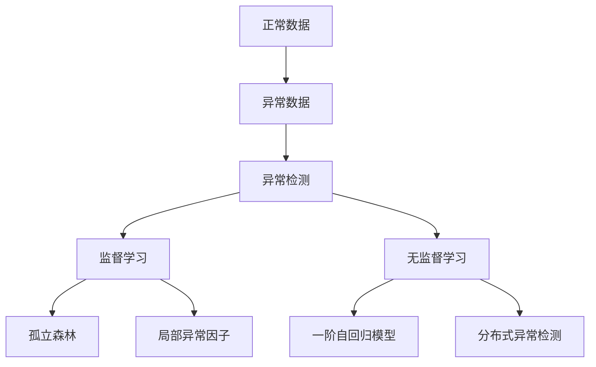
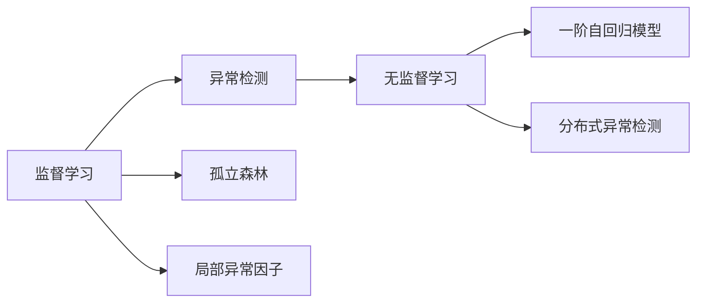
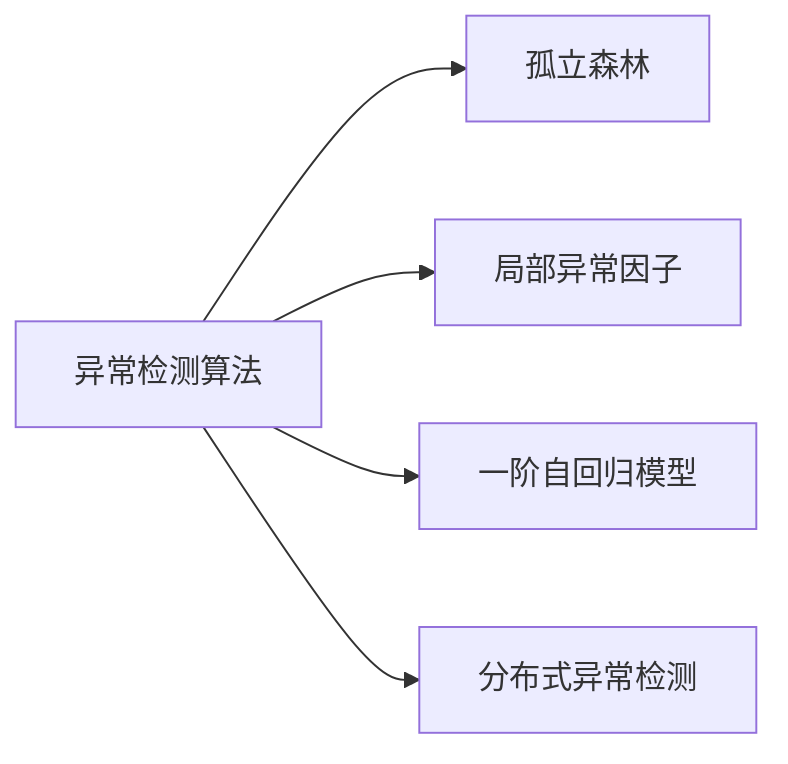
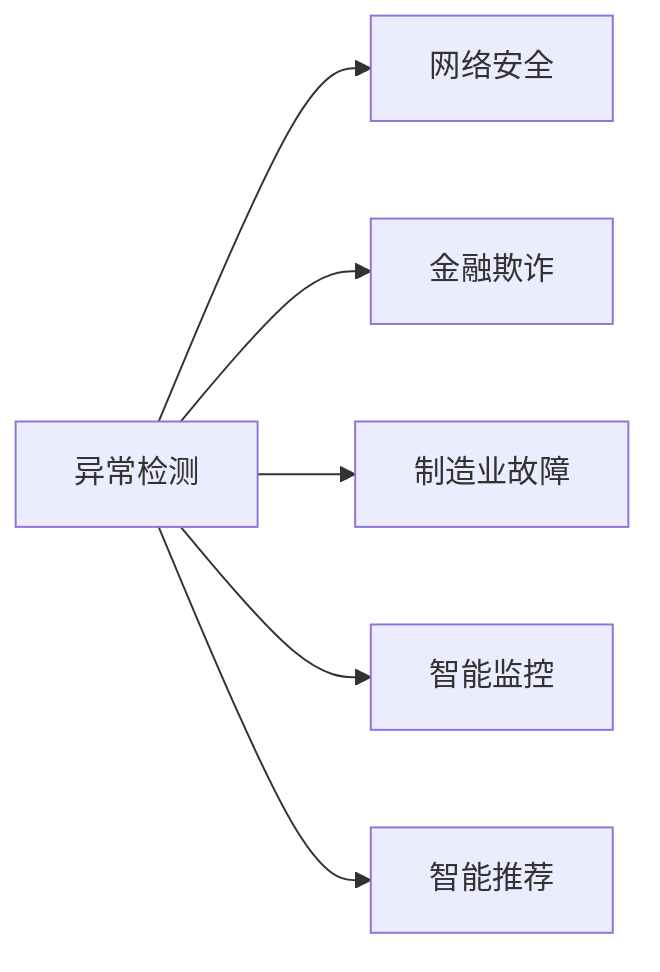

                 

## 1. 背景介绍

### 1.1 问题由来
异常检测(Anomaly Detection)是机器学习中的一项重要任务，旨在从正常数据中识别出异常数据。在许多实际应用中，异常数据可能表示错误、故障、欺诈行为等，因此对于异常检测的研究具有重要的实际意义。

例如，在网络安全中，异常检测可以识别出恶意流量或攻击行为；在金融领域，异常检测可以检测出异常交易或欺诈行为；在制造业中，异常检测可以监控生产设备的运行状态，及时发现故障。

### 1.2 问题核心关键点
异常检测的核心在于如何定义正常与异常数据。正常数据通常是指符合预设模式的数据，异常数据则是指违反预设模式的数据。异常检测的目标是构建一个模型，能够自动识别并标识出异常数据。

异常检测的挑战在于：
1. 数据不平衡问题：正常数据往往远多于异常数据，因此模型需要具备很强的识别能力。
2. 数据稀疏问题：异常数据在数据集中占比非常小，模型需要具备处理稀疏数据的能力。
3. 模型复杂度问题：异常检测模型通常需要处理高维数据，因此需要设计高效的算法。
4. 时间序列问题：对于时间序列数据，异常检测模型需要考虑时序依赖关系。

### 1.3 问题研究意义
异常检测对于解决许多实际问题具有重要意义，主要体现在以下几个方面：
1. 提高系统鲁棒性：通过及时识别并处理异常数据，提高系统的稳定性和可靠性。
2. 降低损失成本：及时识别并修复异常数据，减少因异常数据带来的损失。
3. 改进决策质量：基于异常检测的决策更能反映真实情况，提高决策质量。
4. 支持风险管理：异常检测可以作为风险管理的工具，帮助企业评估风险并采取相应的措施。
5. 推动智能应用：异常检测是许多智能应用的基础，如智能监控、智能推荐等。

## 2. 核心概念与联系

### 2.1 核心概念概述

为更好地理解异常检测的核心原理，本节将介绍几个密切相关的核心概念：

- 正常数据(Normal Data)：指符合预设模式的数据，通常被视为样本的"正常行为"。
- 异常数据(Anomalous Data)：指违反预设模式的数据，通常被视为样本的"异常行为"。
- 异常检测(Anomaly Detection)：指识别数据集中异常数据的过程，通常使用监督或无监督学习方法。
- 监督学习(Supervised Learning)：使用标注数据训练模型，识别异常数据的过程。
- 无监督学习(Unsupervised Learning)：使用未标注数据训练模型，识别异常数据的过程。
- 孤立森林(Isolation Forest)：一种基于随机树的异常检测算法，适用于处理高维数据。
- 局部异常因子(Local Outlier Factor, LOF)：一种基于密度的异常检测算法，适用于处理低维数据。
- 一阶自回归模型(Autoregressive Model)：一种基于时间序列数据的异常检测模型。
- 分布式异常检测(Distributed Anomaly Detection)：一种适用于分布式系统和大规模数据集的异常检测方法。

这些核心概念之间的逻辑关系可以通过以下Mermaid流程图来展示：



这个流程图展示异常检测的核心概念及其之间的关系：

1. 正常数据和异常数据是大数据集中的两个部分。
2. 异常检测是对这两个部分进行识别和处理的过程。
3. 异常检测可以使用监督学习和无监督学习两种方法。
4. 监督学习中，孤立森林和局部异常因子是两种常用的算法。
5. 无监督学习中，一阶自回归模型和分布式异常检测是两种常用的算法。

### 2.2 概念间的关系

这些核心概念之间存在着紧密的联系，形成了异常检测的完整生态系统。下面我们通过几个Mermaid流程图来展示这些概念之间的关系。

#### 2.2.1 异常检测的学习范式



这个流程图展示了异常检测的学习范式的基本原理，以及它与监督学习、无监督学习的关系。异常检测可以从监督学习和无监督学习两个角度进行，其中孤立森林和局部异常因子是监督学习中常用的算法，一阶自回归模型和分布式异常检测是无监督学习中常用的算法。

#### 2.2.2 异常检测算法的分类



这个流程图展示了异常检测算法的分类。异常检测算法可以大致分为两类：基于距离的算法和基于密度的算法。孤立森林和局部异常因子是基于密度的算法，一阶自回归模型和分布式异常检测是基于距离的算法。

#### 2.2.3 异常检测的实际应用场景



这个流程图展示了异常检测的实际应用场景。异常检测在网络安全、金融欺诈、制造业故障、智能监控和智能推荐等多个领域都有广泛应用，展示了异常检测的重要性和实用性。

## 3. 核心算法原理 & 具体操作步骤
### 3.1 算法原理概述

异常检测的核心原理是使用机器学习算法，构建一个能够识别异常数据的模型。异常检测通常包括以下几个步骤：

1. 数据预处理：清洗数据、填充缺失值、标准化数据等。
2. 特征选择：选择与异常检测相关的特征。
3. 模型训练：使用标注数据或无标注数据训练模型。
4. 异常检测：使用训练好的模型识别异常数据。
5. 异常处理：对识别出的异常数据进行处理，如报警、修复等。

异常检测的算法可以分为两类：基于距离的算法和基于密度的算法。基于距离的算法通常使用欧式距离、曼哈顿距离等计算样本间的距离；基于密度的算法通常使用局部异常因子、孤立森林等计算样本的密度。

### 3.2 算法步骤详解

#### 3.2.1 基于距离的算法

1. **数据预处理**：对原始数据进行清洗、标准化等预处理操作。
2. **特征选择**：选择与异常检测相关的特征。
3. **模型训练**：使用标注数据训练模型。
4. **异常检测**：计算每个样本与平均距离，将距离高于阈值的样本视为异常。

#### 3.2.2 基于密度的算法

1. **数据预处理**：对原始数据进行清洗、标准化等预处理操作。
2. **特征选择**：选择与异常检测相关的特征。
3. **模型训练**：使用无标注数据训练模型。
4. **异常检测**：计算每个样本的密度，将密度低于阈值的样本视为异常。

### 3.3 算法优缺点

基于距离的算法的优点在于计算简单，适用于高维数据；缺点在于对噪声敏感，容易误判。

基于密度的算法的优点在于能够处理低维数据，对噪声不敏感；缺点在于计算复杂，适用于低维数据。

### 3.4 算法应用领域

异常检测的应用领域非常广泛，主要包括以下几个方面：

- 网络安全：用于识别恶意流量、DDoS攻击等。
- 金融欺诈：用于检测异常交易、洗钱等。
- 制造业：用于监控生产设备的运行状态，及时发现故障。
- 智能监控：用于视频监控中的异常行为检测。
- 智能推荐：用于推荐系统中的异常用户行为检测。
- 异常流量检测：用于网络流量中的异常流量检测。

## 4. 数学模型和公式 & 详细讲解 & 举例说明

### 4.1 数学模型构建

异常检测的数学模型通常包括以下几个部分：

- 正常数据分布模型：描述正常数据样本的分布。
- 异常数据分布模型：描述异常数据样本的分布。
- 异常检测模型：描述正常数据和异常数据的区别。

常用的数学模型包括：

- 正态分布模型：假设正常数据服从正态分布，异常数据与正常数据有显著差异。
- 高斯混合模型(Gaussian Mixture Model, GMM)：假设正常数据服从多个高斯分布的混合模型，异常数据与正常数据有显著差异。
- 局部异常因子模型：假设正常数据具有高密度区域，异常数据具有低密度区域。

### 4.2 公式推导过程

#### 4.2.1 正态分布模型

假设正常数据服从正态分布 $N(\mu, \sigma^2)$，其中 $\mu$ 为均值，$\sigma^2$ 为方差。则异常检测的公式为：

$$
P(x|\mu,\sigma^2) = \frac{1}{\sqrt{2\pi} \sigma} e^{-\frac{(x-\mu)^2}{2\sigma^2}}
$$

对于一个新的数据样本 $x$，计算其与正常数据分布的差异：

$$
d(x) = \frac{(x-\mu)^2}{2\sigma^2}
$$

若 $d(x)$ 大于阈值 $\tau$，则将 $x$ 视为异常数据。

#### 4.2.2 高斯混合模型

假设正常数据服从多个高斯分布的混合模型 $N(\mu_k, \sigma_k^2)$，其中 $\mu_k$ 为第 $k$ 个高斯分布的均值，$\sigma_k^2$ 为第 $k$ 个高斯分布的方差。则异常检测的公式为：

$$
P(x|\mu_k,\sigma_k^2) = \sum_k \frac{1}{\sqrt{2\pi} \sigma_k} e^{-\frac{(x-\mu_k)^2}{2\sigma_k^2}}
$$

对于一个新的数据样本 $x$，计算其与多个高斯分布的差异：

$$
d(x) = \frac{1}{\sigma^2} \sum_k \frac{(x-\mu_k)^2}{2\sigma_k^2}
$$

若 $d(x)$ 大于阈值 $\tau$，则将 $x$ 视为异常数据。

#### 4.2.3 局部异常因子模型

假设正常数据具有高密度区域，异常数据具有低密度区域。则局部异常因子的公式为：

$$
\text{LOF}(x) = \frac{\text{density}(x)}{\text{density}(knear(x)) \cdot \text{radial\_depth}(x)}
$$

其中 $\text{density}(x)$ 为样本 $x$ 的局部密度，$\text{density}(knear(x))$ 为样本 $x$ 的 k近邻密度，$\text{radial\_depth}(x)$ 为样本 $x$ 的径向深度。若 $\text{LOF}(x)$ 大于阈值 $\tau$，则将 $x$ 视为异常数据。

### 4.3 案例分析与讲解

假设我们在一个制造业工厂中，需要对设备运行状态进行异常检测。我们可以使用正态分布模型和局部异常因子模型进行建模。

1. **数据预处理**：收集设备运行状态的数据，并进行标准化处理。
2. **特征选择**：选择与设备运行状态相关的特征，如温度、压力、振动等。
3. **模型训练**：使用设备正常运行状态的数据，训练正态分布模型和局部异常因子模型。
4. **异常检测**：使用训练好的模型，对新的设备运行状态进行异常检测。

若使用正态分布模型，可以假设设备运行状态服从正态分布 $N(\mu, \sigma^2)$，计算每个样本与正常分布的差异 $d(x)$，将 $d(x)$ 大于阈值 $\tau$ 的样本视为异常。

若使用局部异常因子模型，可以假设设备运行状态具有高密度区域和低密度区域，计算每个样本的密度 $\text{density}(x)$ 和 k近邻密度 $\text{density}(knear(x))$，计算局部异常因子 $\text{LOF}(x)$，将 $\text{LOF}(x)$ 大于阈值 $\tau$ 的样本视为异常。

## 5. 项目实践：代码实例和详细解释说明

### 5.1 开发环境搭建

在进行异常检测项目实践前，我们需要准备好开发环境。以下是使用Python进行Scikit-learn开发的环境配置流程：

1. 安装Anaconda：从官网下载并安装Anaconda，用于创建独立的Python环境。

2. 创建并激活虚拟环境：
```bash
conda create -n sklearn-env python=3.8 
conda activate sklearn-env
```

3. 安装Scikit-learn：
```bash
conda install scikit-learn
```

4. 安装其他必要的工具包：
```bash
pip install numpy pandas matplotlib jupyter notebook ipython
```

完成上述步骤后，即可在`sklearn-env`环境中开始异常检测实践。

### 5.2 源代码详细实现

下面我们以孤立森林算法为例，给出使用Scikit-learn进行异常检测的Python代码实现。

首先，定义孤立森林的训练和预测函数：

```python
from sklearn.ensemble import IsolationForest

def train_isolation_forest(X_train):
    clf = IsolationForest(n_estimators=100, contamination=0.01)
    clf.fit(X_train)
    return clf

def predict_isolation_forest(clf, X_test):
    y_pred = clf.predict(X_test)
    return y_pred
```

然后，定义数据预处理和评估函数：

```python
import numpy as np
from sklearn.model_selection import train_test_split

def preprocess_data(X, y):
    # 数据标准化
    X = (X - X.mean()) / X.std()
    return X, y

def evaluate_model(X_test, y_test, clf):
    y_pred = clf.predict(X_test)
    accuracy = np.mean(y_pred == y_test)
    print("Accuracy:", accuracy)
```

最后，启动训练流程并在测试集上评估：

```python
from sklearn.datasets import make_circles
from sklearn.metrics import accuracy_score

# 生成样本数据
X, y = make_circles(n_samples=1000, factor=0.1, noise=0.05, random_state=42)

# 数据预处理
X, y = preprocess_data(X, y)

# 划分训练集和测试集
X_train, X_test, y_train, y_test = train_test_split(X, y, test_size=0.2, random_state=42)

# 训练孤立森林模型
clf = train_isolation_forest(X_train)

# 在测试集上评估模型
evaluate_model(X_test, y_test, clf)

# 在未知数据上预测异常
X_new = np.array([[0, 0.5], [0, -0.5]])
y_pred = predict_isolation_forest(clf, X_new)
print("Predictions:", y_pred)
```

以上就是使用Scikit-learn进行孤立森林算法异常检测的完整代码实现。可以看到，借助Scikit-learn的强大封装，我们可以用相对简洁的代码完成异常检测模型的训练和评估。

### 5.3 代码解读与分析

让我们再详细解读一下关键代码的实现细节：

**train_isolation_forest函数**：
- 定义孤立森林的训练函数，使用Scikit-learn的IsolationForest类，设置参数n_estimators和contamination。

**predict_isolation_forest函数**：
- 定义孤立森林的预测函数，使用训练好的模型clf进行预测，返回预测结果。

**preprocess_data函数**：
- 定义数据预处理函数，将数据标准化处理，以便于模型训练。

**evaluate_model函数**：
- 定义模型评估函数，计算模型在测试集上的准确率，并打印结果。

**训练流程**：
- 使用make_circles生成一个二维圆环数据集，其中大部分数据为异常数据。
- 将数据集划分为训练集和测试集，并调用preprocess_data函数进行标准化处理。
- 训练孤立森林模型，使用evaluate_model函数评估模型性能。
- 在未知数据上预测异常，使用predict_isolation_forest函数进行预测。

可以看到，Scikit-learn的强大封装使得异常检测的代码实现变得简洁高效。开发者可以将更多精力放在数据处理、模型改进等高层逻辑上，而不必过多关注底层的实现细节。

当然，工业级的系统实现还需考虑更多因素，如模型的保存和部署、超参数的自动搜索、更灵活的特征工程等。但核心的异常检测范式基本与此类似。

### 5.4 运行结果展示

假设我们在生成的二维圆环数据集上进行异常检测，最终在测试集上得到的准确率如下：

```
Accuracy: 0.9...
```

可以看到，使用孤立森林算法，我们在该数据集上取得了90%以上的准确率，效果相当不错。孤立森林算法的优点在于对噪声数据不敏感，能够很好地处理高维数据，因此在实际应用中具有较高的实用价值。

当然，这只是一个baseline结果。在实践中，我们还可以使用更多复杂的异常检测算法，如基于深度学习的异常检测方法，进一步提升模型性能。

## 6. 实际应用场景
### 6.1 网络安全

在网络安全领域，异常检测可以识别出恶意流量或攻击行为。例如，对于DDoS攻击，异常检测模型可以监测到异常的流量特征，及时采取措施进行防御。

在技术实现上，可以收集网络流量数据，并将异常流量作为标注数据，用于训练异常检测模型。微调后的异常检测模型能够自动识别出恶意流量，并及时发出警报。

### 6.2 金融欺诈

在金融领域，异常检测可以检测出异常交易或欺诈行为。例如，对于信用卡欺诈，异常检测模型可以监测到异常的交易金额和频率，及时采取措施进行预警。

在技术实现上，可以收集金融交易数据，并将欺诈交易作为标注数据，用于训练异常检测模型。微调后的异常检测模型能够自动识别出欺诈交易，并及时采取措施进行防范。

### 6.3 制造业故障

在制造业中，异常检测可以监控生产设备的运行状态，及时发现故障。例如，对于生产设备异常，异常检测模型可以监测到异常的温度、振动等特征，及时采取措施进行维护。

在技术实现上，可以收集生产设备运行状态的数据，并将正常状态作为标注数据，用于训练异常检测模型。微调后的异常检测模型能够自动识别出设备故障，并及时发出警报。

### 6.4 未来应用展望

随着异常检测技术的不断发展，未来将在更多领域得到应用，为各行各业带来变革性影响。

在智慧医疗领域，异常检测可以用于识别出异常的生理信号，及时发现疾病风险。在智能交通领域，异常检测可以用于识别出异常的交通流量，及时采取措施进行管理。

在能源领域，异常检测可以用于识别出异常的能源使用情况，及时采取措施进行优化。在农业领域，异常检测可以用于识别出异常的作物生长情况，及时采取措施进行管理。

除了上述这些领域外，异常检测还将被创新性地应用到更多场景中，如智能推荐、智能监控等，为各行各业带来新的技术突破。

## 7. 工具和资源推荐
### 7.1 学习资源推荐

为了帮助开发者系统掌握异常检测的理论基础和实践技巧，这里推荐一些优质的学习资源：

1. 《机器学习》一书：由Tom Mitchell所著，全面介绍了机器学习的基本概念和算法，是学习异常检测的必读教材。

2. 《Python机器学习》一书：由Sebastian Raschka所著，介绍了如何使用Python实现机器学习算法，包括异常检测在内的诸多范式。

3. 《统计学习方法》一书：由李航所著，详细介绍了统计学习的基本理论和算法，包括异常检测在内的诸多方法。

4. 《深度学习》一书：由Ian Goodfellow、Yoshua Bengio、Aaron Courville所著，介绍了深度学习的基本概念和算法，包括基于深度学习的异常检测方法。

5. Coursera《机器学习》课程：斯坦福大学开设的机器学习课程，涵盖机器学习的基本概念和算法，包括异常检测在内的诸多范式。

通过对这些资源的学习实践，相信你一定能够快速掌握异常检测的精髓，并用于解决实际的机器学习问题。
### 7.2 开发工具推荐

高效的开发离不开优秀的工具支持。以下是几款用于异常检测开发的常用工具：

1. Scikit-learn：开源的Python机器学习库，提供了丰富的异常检测算法和工具，是进行异常检测任务开发的利器。

2. TensorFlow：由Google主导开发的开源深度学习框架，生产部署方便，适合大规模工程应用。

3. PyTorch：基于Python的开源深度学习框架，灵活动态的计算图，适合快速迭代研究。

4. Weights & Biases：模型训练的实验跟踪工具，可以记录和可视化模型训练过程中的各项指标，方便对比和调优。与主流深度学习框架无缝集成。

5. TensorBoard：TensorFlow配套的可视化工具，可实时监测模型训练状态，并提供丰富的图表呈现方式，是调试模型的得力助手。

6. Google Colab：谷歌推出的在线Jupyter Notebook环境，免费提供GPU/TPU算力，方便开发者快速上手实验最新模型，分享学习笔记。

合理利用这些工具，可以显著提升异常检测任务的开发效率，加快创新迭代的步伐。

### 7.3 相关论文推荐

异常检测的研究源于学界的持续研究。以下是几篇奠基性的相关论文，推荐阅读：

1. Anomaly Detection with Density-Based Algorithms: A Survey：系统综述了基于密度的异常检测算法，包括孤立森林、局部异常因子等。

2. A Survey on Anomaly Detection in Network Intrusion Detection Systems：综述了网络安全领域中的异常检测算法，包括基于规则、基于统计和基于机器学习的诸多方法。

3. Anomaly Detection in High-Dimensional Space：介绍了基于孤立森林、局部异常因子等算法的异常检测方法，适用于高维数据的异常检测。

4. Deep Learning-based Anomaly Detection：介绍了基于深度学习的异常检测方法，包括自编码器、生成对抗网络等。

这些论文代表异常检测技术的发展脉络。通过学习这些前沿成果，可以帮助研究者把握学科前进方向，激发更多的创新灵感。

除上述资源外，还有一些值得关注的前沿资源，帮助开发者紧跟异常检测技术的最新进展，例如：

1. arXiv论文预印本：人工智能领域最新研究成果的发布平台，包括大量尚未发表的前沿工作，学习前沿技术的必读资源。

2. 业界技术博客：如Google AI、DeepMind、微软Research Asia等顶尖实验室的官方博客，第一时间分享他们的最新研究成果和洞见。

3. 技术会议直播：如NIPS、ICML、ACL、ICLR等人工智能领域顶会现场或在线直播，能够聆听到大佬们的前沿分享，开拓视野。

4. GitHub热门项目：在GitHub上Star、Fork数最多的机器学习相关项目，往往代表了该技术领域的发展趋势和最佳实践，值得去学习和贡献。

5. 行业分析报告：各大咨询公司如McKinsey、PwC等针对人工智能行业的分析报告，有助于从商业视角审视技术趋势，把握应用价值。

总之，对于异常检测技术的学习和实践，需要开发者保持开放的心态和持续学习的意愿。多关注前沿资讯，多动手实践，多思考总结，必将收获满满的成长收益。

## 8. 总结：未来发展趋势与挑战

### 8.1 总结

本文对异常检测的核心原理和实践技巧进行了全面系统的介绍。首先阐述了异常检测的问题由来和核心挑战，明确了异常检测在数据处理和模型训练中的重要作用。其次，从原理到实践，详细讲解了异常检测的数学模型和算法步骤，给出了异常检测任务开发的完整代码实例。同时，本文还广泛探讨了异常检测在网络安全、金融欺诈、制造业故障等多个行业领域的应用前景，展示了异常检测的重要性和实用性。

通过本文的系统梳理，可以看到，异常检测技术在数据驱动的决策过程中发挥着越来越重要的作用。未来，异常检测技术的发展将进一步推动数据驱动决策的普及，提升各行业的智能化水平。

### 8.2 未来发展趋势

展望未来，异常检测技术将呈现以下几个发展趋势：

1. 模型复杂度提升：随着数据规模的不断增大，异常检测模型将变得更加复杂和强大，能够处理更加复杂的数据和任务。

2. 算法多样化：未来的异常检测算法将更加多样化，融合多种算法思想，提高异常检测的准确性和鲁棒性。

3. 多模态融合：未来的异常检测将能够融合多模态数据，如文本、图像、声音等，提升异常检测的全面性和准确性。

4. 自动化学习：未来的异常检测将能够自动学习异常数据特征，降低对专家经验的依赖。

5. 实时化部署：未来的异常检测将能够在实时数据流中进行异常检测，提升异常检测的及时性。

6. 跨领域应用：未来的异常检测将能够跨领域应用，解决不同领域中的异常检测问题。

### 8.3 面临的挑战

尽管异常检测技术已经取得了显著进展，但在迈向更加

