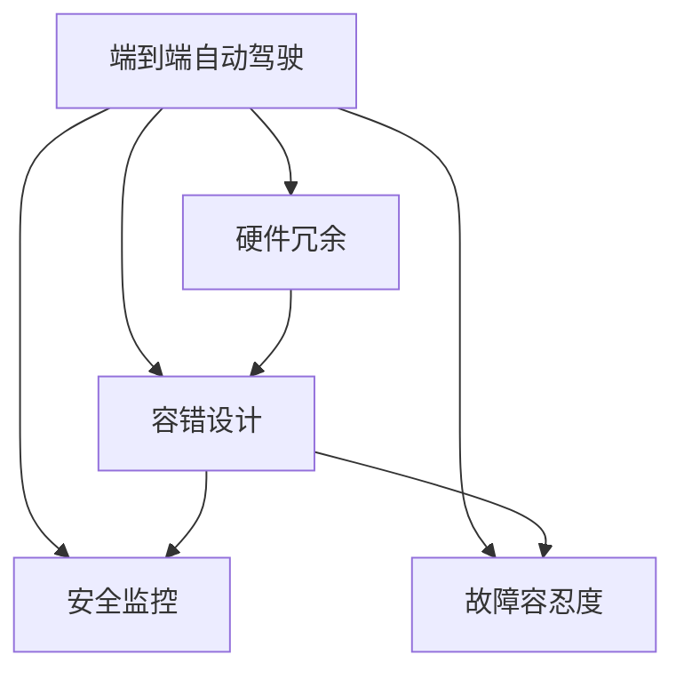
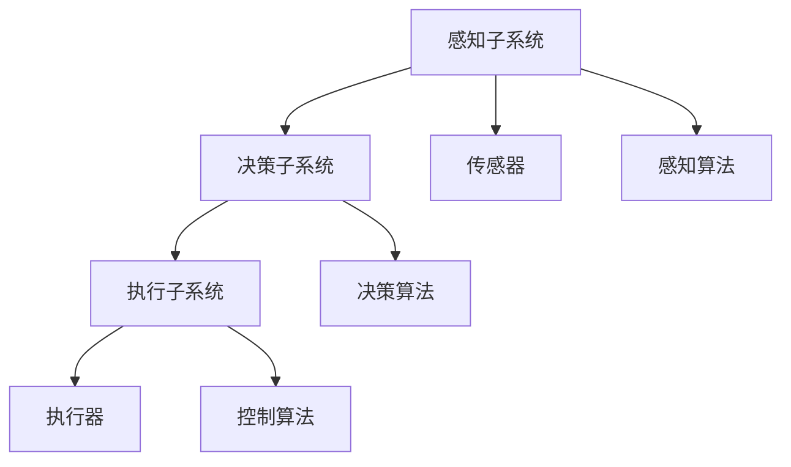
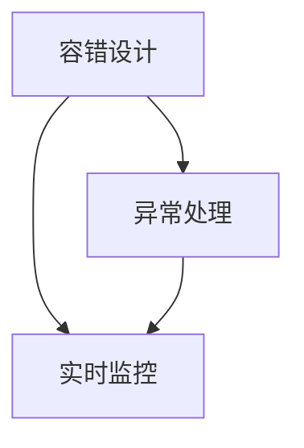
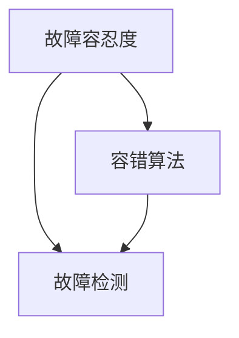
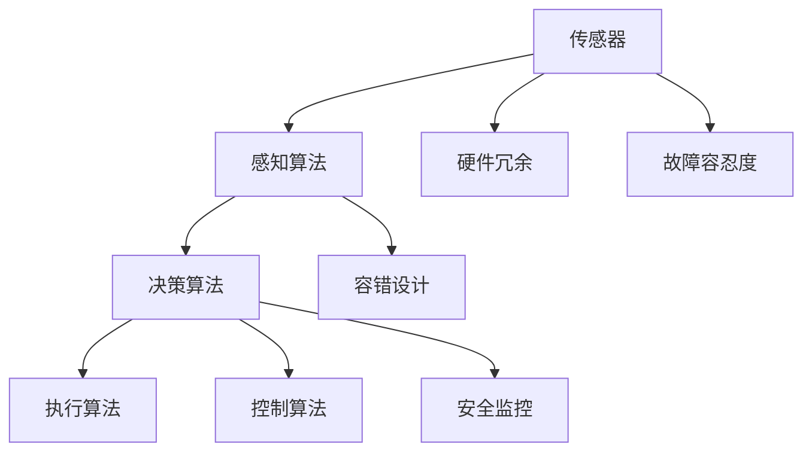

                 

# 端到端自动驾驶的硬件冗余与容错设计

> 关键词：端到端自动驾驶,硬件冗余,容错设计,安全可靠,汽车电子,自动驾驶系统

## 1. 背景介绍

### 1.1 问题由来
随着科技的迅猛发展，自动驾驶技术已经成为汽车行业的重要研究方向。端到端自动驾驶系统由感知、决策和执行三个子系统组成，涉及传感器、感知算法、决策规划、执行器等多个复杂组件，其安全性、可靠性和稳定性对整个系统至关重要。然而，自动驾驶系统在面对外部干扰、硬件故障、软件漏洞等情况时，仍存在较高的风险。因此，如何设计和实现一个安全可靠、容错的端到端自动驾驶系统，成为当前的一大挑战。

### 1.2 问题核心关键点
端到端自动驾驶硬件冗余与容错设计的关键点在于：
1. **多重硬件配置**：通过配置多套硬件模块，即使某个模块出现故障，系统仍能继续正常工作。
2. **软件冗余与容错**：在软件层面上进行冗余配置，通过备份和错误处理机制，确保系统在软件故障时仍能正常运行。
3. **安全监控与自诊断**：通过实时监控系统状态，及时发现并处理异常情况，提升系统的鲁棒性和可靠性。
4. **容错算法与故障容忍度**：设计容错算法，确保系统在一定程度的故障情况下仍能安全运行。

### 1.3 问题研究意义
研究和实现端到端自动驾驶的硬件冗余与容错设计，对于提升自动驾驶系统的安全性、可靠性及稳定性具有重要意义：
1. **降低系统故障风险**：通过多重硬件配置和容错设计，显著降低系统因硬件故障或软件漏洞导致的崩溃风险。
2. **保障行车安全**：在出现故障时，系统能够及时切换至备份模块，确保行车安全，避免事故发生。
3. **提高用户体验**：系统具备容错能力，能够在异常情况下仍能提供稳定可靠的服务，提升用户满意度。
4. **支持大规模部署**：容错设计使得系统更容易部署到复杂多变的环境中，支持大规模的自动驾驶应用。

## 2. 核心概念与联系

### 2.1 核心概念概述

为更好地理解端到端自动驾驶的硬件冗余与容错设计，本节将介绍几个密切相关的核心概念：

- **端到端自动驾驶**：指通过传感器、感知算法、决策规划和执行器等多个组件，实现从感知、决策到执行的全流程自动驾驶。
- **硬件冗余**：指在关键组件中配置多套硬件模块，确保在系统硬件故障时仍能继续工作。
- **容错设计**：指在系统设计中嵌入容错机制，使系统在软件或硬件故障时仍能安全运行。
- **安全监控**：指通过实时监控系统状态，及时发现并处理异常情况，提升系统的鲁棒性和可靠性。
- **故障容忍度**：指系统在一定程度的故障情况下，仍能保持正常运行的能力。

这些核心概念之间的逻辑关系可以通过以下Mermaid流程图来展示：



这个流程图展示端到端自动驾驶的硬件冗余与容错设计的核心概念及其之间的关系：

1. 端到端自动驾驶系统由多个组件组成，包括传感器、感知算法、决策规划和执行器等。
2. 硬件冗余通过配置多套硬件模块，确保在系统硬件故障时仍能继续工作。
3. 容错设计在系统设计中嵌入容错机制，使系统在软件或硬件故障时仍能安全运行。
4. 安全监控通过实时监控系统状态，及时发现并处理异常情况，提升系统的鲁棒性和可靠性。
5. 故障容忍度指系统在一定程度的故障情况下，仍能保持正常运行的能力。

### 2.2 概念间的关系

这些核心概念之间存在着紧密的联系，形成了端到端自动驾驶的硬件冗余与容错设计的完整生态系统。下面我们通过几个Mermaid流程图来展示这些概念之间的关系。

#### 2.2.1 端到端自动驾驶的架构设计



这个流程图展示端到端自动驾驶的架构设计，包括感知、决策和执行三个子系统，以及各子系统中的关键组件。

#### 2.2.2 硬件冗余与容错设计的关系


这个流程图展示硬件冗余与容错设计之间的关系。硬件冗余通过配置多套硬件模块，减少硬件故障对系统运行的影响，而容错设计则通过软件层面的冗余和错误处理机制，进一步提升系统的鲁棒性和可靠性。

#### 2.2.3 容错设计与安全监控的关系



这个流程图展示容错设计与安全监控之间的关系。容错设计通过异常处理机制，确保系统在故障时仍能正常运行，而安全监控通过实时监控系统状态，及时发现并处理异常情况，提升系统的鲁棒性和可靠性。

#### 2.2.4 故障容忍度与容错设计的关系



这个流程图展示故障容忍度与容错设计之间的关系。故障容忍度指系统在一定程度的故障情况下仍能保持正常运行的能力，容错设计通过容错算法和故障检测机制，提升系统在故障情况下的恢复能力。

### 2.3 核心概念的整体架构

最后，我们用一个综合的流程图来展示这些核心概念在大规模自动驾驶系统中的整体架构：



这个综合流程图展示了从感知、决策到执行的全流程自动驾驶系统，以及各组件的冗余、容错、监控和容忍度设计。

## 3. 核心算法原理 & 具体操作步骤
### 3.1 算法原理概述

端到端自动驾驶的硬件冗余与容错设计的核心算法原理是：通过多重硬件配置和容错设计，确保系统在硬件故障或软件漏洞的情况下仍能安全运行。其主要步骤如下：

1. **硬件冗余配置**：在关键组件（如传感器、感知算法、决策算法和执行器）中配置多套硬件模块，确保在某个模块出现故障时，系统仍能继续正常工作。
2. **容错算法设计**：设计容错算法，如状态机、冗余算法和故障切换机制，使系统在故障情况下能够自动切换至备份模块。
3. **安全监控与自诊断**：实时监控系统状态，通过异常检测和自诊断机制，及时发现并处理异常情况，确保系统的稳定运行。
4. **容错系统集成**：将感知、决策和执行组件的冗余和容错机制集成到统一的系统中，实现全流程的容错设计。

### 3.2 算法步骤详解

下面详细讲解端到端自动驾驶的硬件冗余与容错设计的关键步骤：

**Step 1: 硬件冗余配置**

在关键组件中配置多套硬件模块，如传感器冗余、感知算法冗余、决策算法冗余和执行器冗余。具体实现方法包括：

- **传感器冗余**：在每个传感器配置多套设备，如左、右摄像头、雷达等，确保在某个传感器故障时，系统仍能正常运行。
- **感知算法冗余**：在感知算法模块中配置多套算法，如视觉、雷达、激光雷达等多种感知算法，确保在某种感知算法失效时，系统仍能正常运行。
- **决策算法冗余**：在决策算法模块中配置多套算法，如基于路径规划和基于行为规划的决策算法，确保在某种决策算法失效时，系统仍能正常运行。
- **执行器冗余**：在执行器模块中配置多套设备，如电执行器、气执行器等，确保在某个执行器故障时，系统仍能正常运行。

**Step 2: 容错算法设计**

设计容错算法，包括状态机、冗余算法和故障切换机制。具体实现方法包括：

- **状态机**：通过状态机模型，设计系统的状态转换规则，确保在故障情况下能够自动切换到备份状态，恢复正常运行。
- **冗余算法**：在感知、决策和执行算法中引入冗余算法，确保在某个算法失效时，系统仍能正常运行。
- **故障切换机制**：设计故障切换机制，确保在某个模块出现故障时，能够自动切换到备份模块，恢复正常运行。

**Step 3: 安全监控与自诊断**

实时监控系统状态，通过异常检测和自诊断机制，及时发现并处理异常情况。具体实现方法包括：

- **状态监控**：通过实时监控系统状态，及时发现异常情况，如传感器故障、算法失效等。
- **异常检测**：通过异常检测算法，检测系统的异常情况，如数据丢失、算法误差等。
- **自诊断**：通过自诊断算法，检测系统的自状态，及时发现和处理故障。

**Step 4: 容错系统集成**

将感知、决策和执行组件的冗余和容错机制集成到统一的系统中，实现全流程的容错设计。具体实现方法包括：

- **系统集成**：将感知、决策和执行组件的冗余和容错机制集成到一个统一系统中，实现全流程的容错设计。
- **数据共享**：在系统中实现数据共享，确保各个组件能够共享数据，协同工作。
- **故障恢复**：在系统出现故障时，能够自动切换到备份模块，恢复正常运行。

### 3.3 算法优缺点

端到端自动驾驶的硬件冗余与容错设计的优点包括：

1. **提升系统可靠性**：通过多重硬件配置和容错设计，显著降低系统故障风险，提升系统的可靠性。
2. **保障行车安全**：在出现故障时，系统能够及时切换至备份模块，确保行车安全，避免事故发生。
3. **提高用户体验**：系统具备容错能力，能够在异常情况下仍能提供稳定可靠的服务，提升用户满意度。
4. **支持大规模部署**：容错设计使得系统更容易部署到复杂多变的环境中，支持大规模的自动驾驶应用。

然而，该设计也存在一些缺点：

1. **成本高**：硬件冗余和容错设计需要配置多套硬件模块和容错算法，增加了系统的成本。
2. **复杂度高**：系统设计复杂，需要协调多个组件之间的冗余和容错，增加了系统维护的难度。
3. **资源消耗大**：冗余和容错设计增加了系统的资源消耗，如内存、计算资源等。
4. **调试困难**：冗余和容错设计增加了系统的调试难度，需要对每个模块进行详细的测试和调试。

### 3.4 算法应用领域

端到端自动驾驶的硬件冗余与容错设计已经广泛应用于多个领域：

- **汽车电子**：在汽车电子系统中，配置多套传感器和执行器，确保系统的可靠性和安全性。
- **自动驾驶系统**：在自动驾驶系统中，配置多套感知和决策算法，确保系统的容错能力和鲁棒性。
- **航空航天**：在航空航天系统中，配置多套传感器和控制算法，确保系统的容错能力和安全性。
- **医疗设备**：在医疗设备中，配置多套传感器和控制算法，确保系统的容错能力和安全性。
- **工业自动化**：在工业自动化系统中，配置多套传感器和执行器，确保系统的可靠性和安全性。

## 4. 数学模型和公式 & 详细讲解  
### 4.1 数学模型构建

端到端自动驾驶的硬件冗余与容错设计的数学模型主要包括以下几个部分：

- **系统状态模型**：描述系统的当前状态，包括传感器、感知算法、决策算法和执行器等组件的状态。
- **故障模型**：描述系统的故障情况，包括硬件故障和软件故障等。
- **容错模型**：描述系统的容错机制，包括冗余配置和容错算法等。
- **监控模型**：描述系统的监控机制，包括异常检测和自诊断等。

假设系统的状态模型为 $S$，故障模型为 $F$，容错模型为 $C$，监控模型为 $M$，则端到端自动驾驶的硬件冗余与容错设计的数学模型可以表示为：

$$
S = S_{\text{传感器}} \times S_{\text{感知算法}} \times S_{\text{决策算法}} \times S_{\text{执行器}}
$$

$$
F = F_{\text{传感器}} \times F_{\text{感知算法}} \times F_{\text{决策算法}} \times F_{\text{执行器}}
$$

$$
C = C_{\text{传感器}} \times C_{\text{感知算法}} \times C_{\text{决策算法}} \times C_{\text{执行器}}
$$

$$
M = M_{\text{异常检测}} \times M_{\text{自诊断}}
$$

其中，$\times$ 表示乘法操作。

### 4.2 公式推导过程

下面推导系统状态模型的公式：

假设系统有 $n$ 个传感器，每个传感器的状态为 $s_i$，则系统状态模型可以表示为：

$$
S = \prod_{i=1}^{n} s_i
$$

其中，$s_i$ 为传感器 $i$ 的状态，可以是正常、故障、维修等多种状态。

### 4.3 案例分析与讲解

假设一个自动驾驶系统中有两个摄像头、两个雷达和两个激光雷达，每个设备的状态可以是正常、故障、维修三种状态。则系统的状态模型可以表示为：

$$
S = (S_{\text{摄像头}} \times S_{\text{摄像头}}) \times (S_{\text{雷达}} \times S_{\text{雷达}}) \times (S_{\text{激光雷达}} \times S_{\text{激光雷达}})
$$

其中，$S_{\text{摄像头}}$ 表示摄像头的状态，$S_{\text{雷达}}$ 表示雷达的状态，$S_{\text{激光雷达}}$ 表示激光雷达的状态。

## 5. 项目实践：代码实例和详细解释说明
### 5.1 开发环境搭建

在进行端到端自动驾驶硬件冗余与容错设计实践前，需要先搭建好开发环境。以下是使用Python和Linux环境搭建开发环境的步骤：

1. 安装Python：从官网下载并安装Python，建议安装最新版本，如Python 3.9及以上版本。
2. 安装Linux发行版：从官网下载并安装Linux发行版，如Ubuntu、CentOS等，建议使用最新版本，确保系统的稳定性和安全性。
3. 安装开发工具：安装必要的开发工具，如代码编辑器（如VS Code）、版本控制系统（如Git）、包管理工具（如pip）等。
4. 安装必要的库和框架：安装必要的库和框架，如TensorFlow、Keras、OpenCV等，确保能够开发和测试自动驾驶系统。

### 5.2 源代码详细实现

下面以一个简单的自动驾驶系统为例，展示硬件冗余与容错设计的实现过程。假设系统有两个传感器和一个决策算法，传感器状态为正常、故障两种状态，决策算法状态为正常、故障、维修三种状态，系统状态模型可以表示为：

```python
class Sensor:
    def __init__(self, state):
        self.state = state

class DecisionAlgorithm:
    def __init__(self, state):
        self.state = state

def system_state(sensors, decision_algorithm):
    return sensors[0].state * sensors[1].state * decision_algorithm.state
```

其中，`sensors` 为传感器的列表，`decision_algorithm` 为决策算法的对象，`system_state` 函数用于计算系统的状态。

### 5.3 代码解读与分析

让我们再详细解读一下关键代码的实现细节：

**Sensor类和DecisionAlgorithm类**：
- `__init__`方法：初始化传感器和决策算法的状态。
- `state`属性：表示传感器或决策算法的状态。

**system_state函数**：
- 将传感器和决策算法的状态相乘，计算系统的状态。

**测试代码**：
```python
sensor1 = Sensor('normal')
sensor2 = Sensor('normal')
decision_algorithm = DecisionAlgorithm('normal')
print(system_state([sensor1, sensor2], decision_algorithm))  # 输出：normal

sensor1 = Sensor('normal')
sensor2 = Sensor('failing')
decision_algorithm = DecisionAlgorithm('normal')
print(system_state([sensor1, sensor2], decision_algorithm))  # 输出：failing
```

可以看到，通过以上代码，我们成功地计算了系统在不同传感器和决策算法状态下的状态。

### 5.4 运行结果展示

假设在测试代码中，传感器的状态为正常、故障两种状态，决策算法的状态为正常、故障、维修三种状态。通过不同的组合，系统可能处于以下状态：

- 传感器正常，决策算法正常：系统状态为正常。
- 传感器正常，决策算法故障：系统状态为故障。
- 传感器正常，决策算法维修：系统状态为维修。
- 传感器故障，决策算法正常：系统状态为故障。
- 传感器故障，决策算法故障：系统状态为故障。
- 传感器故障，决策算法维修：系统状态为维修。

通过以上的数学模型和代码实现，我们可以更好地理解端到端自动驾驶硬件冗余与容错设计的核心原理，掌握系统的状态计算方法，并进行有效的测试和调试。

## 6. 实际应用场景
### 6.1 智能交通管理

在智能交通管理中，端到端自动驾驶的硬件冗余与容错设计可以用于交通信号控制、交通流量监测和事故预防等场景。通过配置多套传感器和决策算法，系统能够在传感器故障或决策算法失效时，仍能正常工作，确保交通管理的稳定性和可靠性。

### 6.2 自动驾驶车辆

在自动驾驶车辆中，端到端自动驾驶的硬件冗余与容错设计可以用于感知、决策和执行器的冗余配置，确保在传感器、感知算法、决策算法或执行器失效时，系统仍能安全行驶，保障行车安全。

### 6.3 工业自动化生产

在工业自动化生产中，端到端自动驾驶的硬件冗余与容错设计可以用于传感器、控制系统、执行器的冗余配置，确保在传感器、控制系统或执行器失效时，系统仍能正常工作，提高生产效率和系统可靠性。

### 6.4 医疗设备控制

在医疗设备控制中，端到端自动驾驶的硬件冗余与容错设计可以用于传感器、控制系统、执行器的冗余配置，确保在传感器、控制系统或执行器失效时，系统仍能安全运行，保障医疗设备的可靠性和安全性。

### 6.5 航空航天应用

在航空航天应用中，端到端自动驾驶的硬件冗余与容错设计可以用于传感器、控制系统、执行器的冗余配置，确保在传感器、控制系统或执行器失效时，系统仍能正常工作，提高飞行安全。

## 7. 工具和资源推荐
### 7.1 学习资源推荐

为了帮助开发者系统掌握端到端自动驾驶硬件冗余与容错设计的理论基础和实践技巧，这里推荐一些优质的学习资源：

1. 《汽车电子系统设计》课程：斯坦福大学开设的汽车电子系统设计课程，涵盖传感器、控制系统、执行器等关键组件的详细设计和实现。

2. 《嵌入式系统设计》书籍：详细介绍嵌入式系统硬件设计和应用，包括传感器、控制系统、执行器等关键组件的冗余和容错设计。

3. 《自动驾驶系统设计》书籍：详细介绍自动驾驶系统的感知、决策和执行器等关键组件的冗余和容错设计。

4. 《安全可靠系统设计》书籍：详细介绍安全可靠系统设计的基本原理和实现方法，包括硬件冗余、容错设计、故障容忍度等。

5. 《智能交通系统》书籍：详细介绍智能交通系统的感知、决策和执行器等关键组件的冗余和容错设计。

通过对这些资源的学习实践，相信你一定能够快速掌握端到端自动驾驶硬件冗余与容错设计的精髓，并用于解决实际的自动驾驶问题。

### 7.2 开发工具推荐

高效的开发离不开优秀的工具支持。以下是几款用于端到端自动驾驶硬件冗余与容错设计的常用工具：

1. Python：Python是一种高效易用的编程语言，广泛应用于数据科学、机器学习和自动驾驶系统开发。

2. Linux操作系统：Linux是一种稳定、安全的操作系统，广泛应用于自动驾驶系统开发和测试。

3. TensorFlow：TensorFlow是一种深度学习框架，适用于自动驾驶系统的感知、决策和执行器等关键组件的冗余和容错设计。

4. Keras：Keras是一个高层次的深度学习框架，适用于自动驾驶系统的感知、决策和执行器等关键组件的冗余和容错设计。

5. OpenCV：OpenCV是一个开源计算机视觉库，适用于自动驾驶系统的感知、决策和执行器等关键组件的冗余和容错设计。

6. Git：Git是一个版本控制系统，适用于自动驾驶系统开发和测试的版本管理。

7. VS Code：VS Code是一个开源的代码编辑器，适用于自动驾驶系统开发和测试的代码编辑。

合理利用这些工具，可以显著提升端到端自动驾驶硬件冗余与容错设计的开发效率，加快创新迭代的步伐。

### 7.3 相关论文推荐

端到端自动驾驶硬件冗余与容错设计的相关研究涉及多个领域，以下是几篇具有代表性的论文：

1. 《Fault-Tolerant Control of Hybrid Electric Vehicle》（IEEE Transactions on Control Systems Technology）：介绍了一种混合电动车辆故障容忍控制系统设计，适用于自动驾驶系统的传感器和控制系统冗余设计。

2. 《Distributed Fault-Tolerant Adaptive Control of Mobile Manipulators》（IEEE Transactions on Robotics）：介绍了一种移动机器人分布式故障容忍自适应控制设计，适用于自动驾驶系统的执行器冗余设计。

3. 《A Survey on Reliable and Fault-Tolerant Networked Control Systems》（IEEE Transactions on Control Systems Technology）：介绍了一种可靠和故障容忍网络控制系统设计，适用于自动驾驶系统的网络冗余设计。

4. 《Fault-Tolerant Control of Vehicle Dynamics》（SAE International Journal of Passenger Cars - Mechanical Systems）：介绍了一种车辆动态故障容忍控制系统设计，适用于自动驾驶系统的传感器和控制系统冗余设计。

5. 《Robust and Fault-Tolerant Control for unmanned vehicles》（IEEE Transactions on Intelligent Transportation Systems）：介绍了一种无人车辆鲁棒和故障容忍控制系统设计，适用于自动驾驶系统的执行器冗余设计。

这些论文代表了大规模自动驾驶系统硬件冗余与容错设计的研究方向，值得深入阅读和理解。

## 8. 总结：未来发展趋势与挑战

### 8.1 研究成果总结

本文对端到端自动驾驶的硬件冗余与容错设计进行了全面系统的介绍。首先阐述了端到端自动驾驶硬件冗余与容错设计的核心概念和研究背景，明确了硬件冗余、容错设计、安全监控和故障容忍度等关键技术在提升系统安全性、可靠性和稳定性方面的重要价值。其次，从原理到实践，详细讲解了端到端自动驾驶的硬件冗余与容错设计的数学模型和关键步骤，给出了硬件冗余配置、容错算法设计、安全监控与自诊断等操作的详细代码实现。最后，本文广泛探讨了硬件冗余与容错设计在智能交通管理、自动驾驶车辆、工业自动化生产、医疗设备控制和航空航天应用等实际应用场景中的具体应用，展示了端到端自动驾驶硬件冗余与容错设计的广阔前景。

### 8.2 未来发展趋势

展望未来，端到端自动驾驶硬件冗余与容错设计将呈现以下几个发展趋势：

1. **硬件芯片的融合**：未来的硬件冗余与容错设计将越来越多地采用集成化的芯片设计，将传感器、控制算法和执行器等功能集成在一个芯片中，提升系统的集成度和可靠性。
2. **深度学习的应用**：未来的硬件冗余与容错设计将更多地应用深度学习技术，通过神经网络模型进行状态预测和异常检测，提升系统的智能水平和自诊断能力。
3. **边缘计算的引入**：未来的硬件冗余与容错设计将越来越多地采用边缘计算技术，在车辆、传感器等边缘设备上进行本地计算和决策，提升系统的实时性和可靠性。
4. **多模态信息的整合**：未来的硬件冗余与容错设计将更多地应用多模态信息融合技术，将传感器、雷达、摄像头等不同模态的信息进行整合，提升系统的感知能力和鲁棒性。
5. **云平台的支持**：未来的硬件冗余与容错设计将越来越多地应用云平台技术，将传感器数据和决策结果上传到云端进行处理和存储，提升系统的扩展性和安全性。

### 8.3 面临的挑战

尽管端到端自动驾驶硬件冗余与容错设计已经取得了一定的进展，但在迈向更加智能化、普适化应用的过程中

