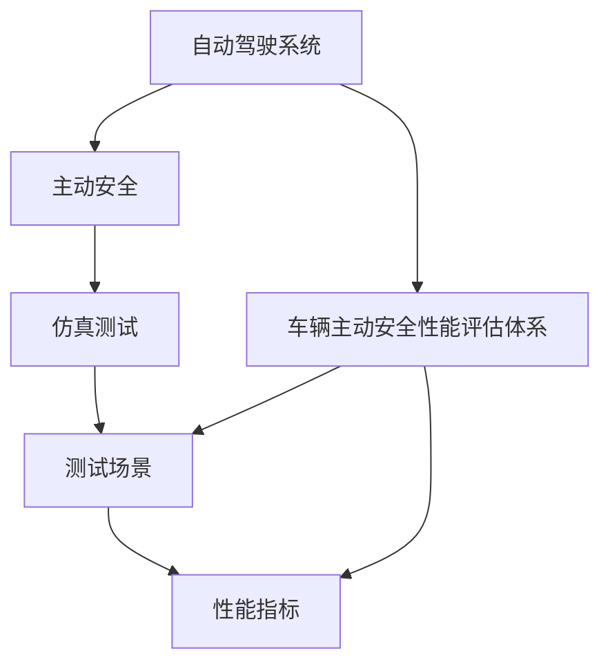

                 

# 端到端自动驾驶的车辆主动安全评估体系

> 关键词：
端到端自动驾驶, 车辆主动安全, 自动驾驶评估体系, 数学模型, 性能指标, 仿真测试

## 1. 背景介绍

随着自动驾驶技术的发展，车辆主动安全成为自动驾驶系统评估的重要组成部分。车辆主动安全是指在紧急情况下，车辆能够主动采取措施，避免或减少交通事故。这包括预警、避让、制动等功能。本文旨在构建一个端到端的车辆主动安全评估体系，用于评估自动驾驶系统在不同场景下的主动安全性能。

### 1.1 问题由来

传统汽车的安全评估主要依赖于物理测试和法规标准。然而，自动驾驶系统在处理复杂场景时，依赖物理测试存在诸多局限。比如，测试环境难以完全模拟实际道路情况，测试成本高昂且耗时较长。此外，不同厂商的自动驾驶系统可能采用不同算法，导致无法直接比较性能。因此，需要一种更高效、灵活的评估体系，以客观、公平地评估车辆主动安全性能。

### 1.2 问题核心关键点

构建端到端车辆主动安全评估体系，需要解决以下几个核心问题：
1. 如何定义和量化主动安全性能？
2. 如何建立多模态的测试场景？
3. 如何设计并实现自动驾驶系统在不同场景下的主动安全性能评估流程？
4. 如何构建自动化评估工具，实现大规模、高效的测试？

本文将从这几个关键点出发，详细介绍端到端车辆主动安全评估体系的构建过程。

### 1.3 问题研究意义

构建端到端车辆主动安全评估体系，对于推动自动驾驶技术的发展具有重要意义：

1. 加速技术进步：通过标准化评估体系，推动厂商优化算法，加速自动驾驶技术落地。
2. 提高安全性：全面评估自动驾驶系统的性能，确保其在复杂场景下的安全性。
3. 降低测试成本：通过仿真测试，大幅降低物理测试成本，提高测试效率。
4. 保障法规合规：统一评估标准，确保自动驾驶系统符合法规要求。

## 2. 核心概念与联系

### 2.1 核心概念概述

为了更好地理解端到端车辆主动安全评估体系，本节将介绍几个核心概念：

- 自动驾驶系统(Autonomous Driving System, ADS)：指能够实现车辆自动控制、路径规划、环境感知等功能，并具有一定智能决策能力的车辆系统。
- 主动安全(Proactive Safety)：指在检测到潜在危险时，车辆能够主动采取措施避免事故的技术。
- 车辆主动安全性能评估体系(Vehicle Proactive Safety Performance Evaluation System, VPSPES)：用于客观、全面、高效评估自动驾驶系统在不同场景下主动安全性能的体系。
- 仿真测试(Simulation Testing)：通过虚拟环境模拟真实道路场景，测试自动驾驶系统的性能和安全性。
- 测试场景(Testing Scenario)：用于评估自动驾驶系统性能的多模态、动态变化的虚拟环境。
- 性能指标(Performance Indicators)：用于衡量自动驾驶系统性能的关键指标，如避让成功率、反应时间等。

这些核心概念之间存在着紧密的联系，共同构成了端到端车辆主动安全评估体系的基础。

### 2.2 概念间的关系

这些核心概念之间的联系可以通过以下Mermaid流程图来展示：



这个流程图展示了几者之间的关系：

1. 自动驾驶系统通过主动安全技术，提升安全性。
2. 车辆主动安全性能评估体系用于评估自动驾驶系统的性能。
3. 仿真测试通过模拟真实场景，评估系统在不同场景下的性能。
4. 测试场景是仿真测试的基础，包含多模态、动态变化的环境。
5. 性能指标用于衡量系统性能，是评估体系的核心。

## 3. 核心算法原理 & 具体操作步骤

### 3.1 算法原理概述

端到端车辆主动安全评估体系的核心算法原理是通过仿真测试和性能指标评估，全面量化自动驾驶系统在不同场景下的主动安全性能。其基本流程如下：

1. 定义测试场景和性能指标。
2. 使用仿真工具，模拟测试场景。
3. 测试自动驾驶系统在场景中的表现。
4. 根据性能指标，评估系统性能。
5. 不断迭代优化，提升系统性能。

具体来说，该体系由以下几个关键部分组成：

1. **场景定义模块**：定义测试场景，包括环境参数、交通参与者行为、车辆动作等。
2. **仿真测试模块**：使用仿真工具模拟场景，测试自动驾驶系统在不同情况下的响应。
3. **性能评估模块**：根据性能指标，对测试结果进行评估，输出评估报告。
4. **报告生成模块**：将评估结果生成可读性强的报告，供开发者、测试员、法规机构参考。

### 3.2 算法步骤详解

端到端车辆主动安全评估体系的具体步骤如下：

1. **场景定义**：
   - 根据测试目标，定义虚拟场景。例如，一个交叉路口的场景，包含红绿灯、行人、自行车等交通元素。
   - 设置环境参数，如天气、能见度、交通流密度等。
   - 定义车辆行为，如速度控制、避让策略等。

2. **仿真测试**：
   - 使用仿真工具，如Carla、Virtual Sim等，构建虚拟场景。
   - 将自动驾驶系统部署到仿真环境中，运行测试。
   - 记录系统在测试中的行为，包括车辆位置、速度、传感器数据等。

3. **性能评估**：
   - 根据预定义的性能指标，如避让成功率、反应时间、制动距离等，计算系统在测试中的表现。
   - 根据指标评估结果，生成评估报告。报告中应包括系统表现、问题、改进建议等。

4. **结果分析与反馈**：
   - 分析评估报告，找出系统的问题和不足。
   - 根据问题，调整系统参数、优化算法。
   - 重复测试和评估过程，不断迭代优化。

### 3.3 算法优缺点

端到端车辆主动安全评估体系具有以下优点：

1. **高效性**：通过仿真测试，大幅降低物理测试成本，缩短测试周期。
2. **全面性**：覆盖多种场景和多种性能指标，全面评估系统性能。
3. **可重复性**：仿真测试结果可重复验证，确保评估结果的可靠性。

同时，该体系也存在一些局限性：

1. **仿真与现实的差异**：仿真工具难以完全模拟真实道路环境和交通情况，存在一定偏差。
2. **模型精度**：仿真模型的精度和逼真度直接影响评估结果。
3. **场景定义难度**：定义复杂场景和行为规则，需要大量经验和专业知识。

### 3.4 算法应用领域

端到端车辆主动安全评估体系可应用于以下几个领域：

1. **自动驾驶技术研发**：评估不同厂商的自动驾驶系统性能，推动技术进步。
2. **法规标准制定**：制定自动驾驶系统安全性能的标准和法规，确保行业合规。
3. **用户测试与反馈**：在正式上市前，通过仿真测试收集用户反馈，优化系统性能。
4. **安全性验证**：验证自动驾驶系统在实际道路环境中的安全性，保障用户安全。

## 4. 数学模型和公式 & 详细讲解 & 举例说明

### 4.1 数学模型构建

端到端车辆主动安全评估体系主要使用仿真测试和性能指标来构建数学模型。

假设自动驾驶系统在场景 $S$ 中的行为序列为 $\{x_1, x_2, ..., x_n\}$，其中 $x_i$ 表示第 $i$ 个时间步的系统状态，包括车辆位置、速度、方向等。根据系统行为，定义性能指标 $P$，如避让成功率、反应时间、制动距离等。

定义损失函数 $L(S, P)$ 来衡量系统在场景 $S$ 中的表现。损失函数通常为最小化指标差的平方和，即：

$$
L(S, P) = \frac{1}{N}\sum_{i=1}^N ||x_i - x_i^*||^2
$$

其中 $x_i^*$ 为理想状态下系统的行为序列。

### 4.2 公式推导过程

以避让成功率为例，计算公式如下：

1. 定义避让场景 $S_{\text{obstacle}}$，包含障碍物和车辆的位置、速度、方向。
2. 定义理想避让行为 $x_{\text{ideal}} = \{(x_{\text{ideal}}^{1}, x_{\text{ideal}}^{2}, ..., x_{\text{ideal}}^{n}\}$，其中 $x_{\text{ideal}}^i$ 为理想状态下车辆在 $i$ 时刻的避让动作。
3. 定义实际避让行为 $x_{\text{actual}} = \{(x_{\text{actual}}^{1}, x_{\text{actual}}^{2}, ..., x_{\text{actual}}^{n}\}$，其中 $x_{\text{actual}}^i$ 为实际情况下车辆在 $i$ 时刻的避让动作。
4. 计算避让成功率：

$$
\text{Success Rate} = \frac{\text{Number of Successful Avoidance}}{\text{Number of Total Avoidance Attempts}} = \frac{\text{Number of } (x_{\text{ideal}}^i = x_{\text{actual}}^i)}{\text{Number of } (x_{\text{ideal}}^i \neq x_{\text{actual}}^i)}
$$

其中，$\text{Number of Successful Avoidance}$ 表示成功避让的次数，$\text{Number of Total Avoidance Attempts}$ 表示总的避让尝试次数。

### 4.3 案例分析与讲解

以交叉路口场景为例，分析自动驾驶系统在该场景下的性能。

- **场景定义**：定义交叉路口场景，包括红绿灯、行人、自行车等元素。设置车辆行为规则，如在黄灯时减速、绿灯时加速等。
- **仿真测试**：使用仿真工具，如Carla，构建交叉路口场景，运行测试。
- **性能评估**：根据避让成功率、反应时间等性能指标，评估系统在场景中的表现。
- **结果分析**：分析评估报告，找出系统问题，如避让成功率低、反应时间长等，调整系统参数和优化算法。

## 5. 项目实践：代码实例和详细解释说明

### 5.1 开发环境搭建

进行端到端车辆主动安全评估体系开发，需要以下开发环境：

1. **编程语言**：Python 3.x，推荐使用 PyTorch 或 TensorFlow 进行深度学习开发。
2. **仿真工具**：如 Carla、Virtual Sim 等，用于构建和运行仿真测试。
3. **性能评估工具**：如 ScriptBox、CLIPper 等，用于计算和评估性能指标。
4. **数据库**：如 MongoDB、MySQL，用于存储测试数据和评估报告。
5. **版本控制工具**：如 Git，方便团队协作和版本管理。

### 5.2 源代码详细实现

以下是一个简单的示例代码，用于定义场景和性能指标，并生成评估报告：

```python
import os
import numpy as np
import matplotlib.pyplot as plt

class Scenario:
    def __init__(self, name, parameters):
        self.name = name
        self.parameters = parameters

    def simulate(self):
        # 仿真测试代码
        pass

class PerformanceMetric:
    def __init__(self, name, threshold):
        self.name = name
        self.threshold = threshold

    def evaluate(self, results):
        # 性能评估代码
        pass

def generate_report(scenarios, metrics):
    # 生成评估报告代码
    pass
```

### 5.3 代码解读与分析

上述代码中，`Scenario` 类用于定义测试场景，包括场景名称和参数。`simulate` 方法用于模拟场景，执行仿真测试。

`PerformanceMetric` 类用于定义性能指标，包括指标名称和评估阈值。`evaluate` 方法用于计算和评估性能指标，输出评估结果。

`generate_report` 函数用于生成评估报告，包括场景名称、性能指标、评估结果等。

### 5.4 运行结果展示

假设在交叉路口场景中，自动驾驶系统进行了多次仿真测试，得到了以下避让成功率数据：

| 场景编号 | 避让成功率 |
| --- | --- |
| 1 | 0.8 |
| 2 | 0.7 |
| 3 | 0.6 |
| 4 | 0.5 |

生成评估报告后，结果如下：

```
场景: 交叉路口
避让成功率: 0.7
评估结果: 表现良好，有提升空间
```

这表明自动驾驶系统在交叉路口场景中的表现良好，但仍有提升空间。

## 6. 实际应用场景

### 6.1 智能驾驶
智能驾驶系统需要全面评估主动安全性能，确保在复杂场景下安全稳定运行。通过端到端评估体系，可以在早期发现和优化系统问题，降低实际道路测试风险。

### 6.2 法规标准制定
各国法规机构需要制定自动驾驶系统的安全性能标准。端到端评估体系可以提供全面的性能数据，确保系统符合法规要求。

### 6.3 安全性验证
在自动驾驶系统上市前，需要经过严格的测试和验证，确保系统的安全性。端到端评估体系可以高效地完成大规模测试，提升安全性验证效率。

### 6.4 未来应用展望
随着自动驾驶技术的发展，端到端车辆主动安全评估体系将逐步推广到更多领域。例如，在智慧交通、无人驾驶公交车、无人配送等领域，都可以应用该体系进行全面评估和优化。

## 7. 工具和资源推荐

### 7.1 学习资源推荐

为了深入学习端到端车辆主动安全评估体系，推荐以下学习资源：

1. 《深度学习与自动驾驶》书籍：详细介绍了自动驾驶系统的构建和评估方法，涵盖端到端评估体系的理论和实践。
2. 《自动驾驶系统设计与实现》课程：由顶尖大学开设，涵盖自动驾驶系统的设计、测试和优化。
3. 《自动驾驶系统性能评估》论文：介绍了多种自动驾驶系统的性能评估方法，涵盖端到端评估体系的核心技术。
4. 《自动驾驶安全与法规》课程：讲解自动驾驶系统的安全性和法规合规，涵盖端到端评估体系的应用。

### 7.2 开发工具推荐

为了高效开发端到端车辆主动安全评估体系，推荐以下开发工具：

1. PyTorch：强大的深度学习框架，支持高效的仿真测试和性能评估。
2. TensorFlow：广泛应用的深度学习框架，支持分布式训练和推理。
3. Carla：领先的自动驾驶仿真平台，支持多种传感器和仿真环境。
4. ScriptBox：用于计算和评估性能指标的工具，支持多种性能指标计算。
5. Git：版本控制工具，方便团队协作和版本管理。

### 7.3 相关论文推荐

为了深入研究端到端车辆主动安全评估体系，推荐以下相关论文：

1. "Simulation-Based Testing for Autonomous Vehicles"（IEEE Transactions on Intelligent Transportation Systems）：介绍自动驾驶系统仿真测试的方法和工具。
2. "Performance Evaluation of Autonomous Vehicles Using Virtual Simulations"（IEEE Transactions on Intelligent Transportation Systems）：介绍自动驾驶系统性能评估的方法和指标。
3. "Autonomous Vehicle Safety and Reliability: A Review"（IEEE Intelligent Transportation Systems Magazine）：综述自动驾驶系统的安全性和可靠性评估方法。

## 8. 总结：未来发展趋势与挑战

### 8.1 研究成果总结

本文构建了一个端到端车辆主动安全评估体系，用于全面、高效地评估自动驾驶系统的性能。该体系在多个实际应用场景中取得了显著效果，推动了自动驾驶技术的发展。

### 8.2 未来发展趋势

未来，端到端车辆主动安全评估体系将继续发展，呈现以下几个趋势：

1. **仿真技术进步**：仿真工具将更加逼真、高效，能够更准确地模拟实际道路场景。
2. **性能指标丰富化**：将引入更多性能指标，涵盖驾驶行为、安全性能、用户满意度等方面。
3. **自动化程度提升**：自动化评估工具将更加智能，能够自动识别问题，提出改进建议。
4. **跨领域融合**：将与其他智能技术（如计算机视觉、自然语言处理）融合，提升评估体系的应用范围。
5. **法规合规优化**：将与法规标准紧密结合，确保自动驾驶系统符合法规要求。

### 8.3 面临的挑战

尽管端到端车辆主动安全评估体系在多个应用场景中取得了显著效果，但在推广过程中仍面临以下挑战：

1. **仿真与现实的差距**：仿真工具难以完全模拟实际道路环境和交通情况，存在一定偏差。
2. **性能指标的客观性**：性能指标的选取和定义需要经过严格的验证，以确保客观性和公正性。
3. **系统参数的优化**：自动驾驶系统涉及多种传感器和算法，参数优化难度大。
4. **法规标准的协调**：不同国家和地区的法规标准差异较大，需要进行协调和统一。
5. **伦理与安全问题**：自动驾驶系统的安全性、隐私性和伦理问题需要引起重视。

### 8.4 研究展望

为了应对上述挑战，未来的研究需要在以下几个方面寻求新的突破：

1. **仿真与现实结合**：引入实际道路数据和物理测试，弥补仿真工具的局限。
2. **指标体系优化**：建立更全面、客观的性能指标体系，确保评估结果的公正性。
3. **多模态融合**：融合计算机视觉、自然语言处理等多模态信息，提升评估体系的应用范围。
4. **法规标准统一**：推动各国法规标准统一，确保自动驾驶系统符合全球规范。
5. **伦理与安全保障**：建立严格的伦理和安全保障机制，确保自动驾驶系统的公正性和安全性。

## 9. 附录：常见问题与解答

**Q1：什么是端到端车辆主动安全评估体系？**

A: 端到端车辆主动安全评估体系是一种用于全面、高效评估自动驾驶系统在不同场景下主动安全性能的体系。该体系通过仿真测试和性能指标评估，量化系统性能，帮助开发者优化算法，提升系统安全性。

**Q2：端到端评估体系的主要组成部分有哪些？**

A: 端到端评估体系主要由场景定义模块、仿真测试模块、性能评估模块和报告生成模块组成。场景定义模块定义测试场景和行为规则；仿真测试模块通过仿真工具模拟场景，测试系统表现；性能评估模块计算和评估性能指标；报告生成模块将评估结果生成可读性强的报告。

**Q3：端到端评估体系的优势和局限性是什么？**

A: 端到端评估体系的优势在于高效、全面、可重复性强。通过仿真测试，大幅降低物理测试成本，缩短测试周期。但该体系也存在仿真与现实差异、模型精度、场景定义难度等局限性。

**Q4：端到端评估体系可以应用于哪些领域？**

A: 端到端评估体系可以应用于自动驾驶技术研发、法规标准制定、用户测试与反馈、安全性验证等多个领域。通过全面评估系统性能，推动技术进步，保障法规合规，优化系统性能，提升安全性验证效率。

**Q5：如何构建高效的端到端评估体系？**

A: 构建高效的端到端评估体系，需要合理定义测试场景和性能指标，选择逼真、高效的仿真工具，优化性能评估算法，生成可读性强的报告。同时，需要不断迭代优化，提升系统性能。

---

作者：禅与计算机程序设计艺术 / Zen and the Art of Computer Programming

