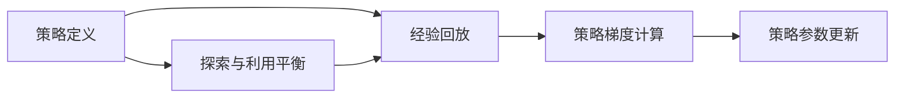

                 

# 策略梯度 (Policy Gradients) 原理与代码实例讲解

> 关键词：策略梯度, 强化学习, 深度强化学习, 深度Q网络, 代码实例, 数学模型, 梯度上升, 动作空间, 奖励函数

## 1. 背景介绍

### 1.1 问题由来

在机器学习中，强化学习（Reinforcement Learning, RL）是一种基于智能体（agent）与环境（environment）互动，通过探索和反馈来学习和优化策略（policy）的技术。策略梯度（Policy Gradients）方法则是强化学习中一种经典的算法，其核心思想是通过梯度上升的方法优化策略函数，从而实现智能体在环境中的最优化决策。

策略梯度方法最早由Richard S. Sutton和Andrew G. Barto在他们的经典书籍《Reinforcement Learning: An Introduction》中提出。由于其在深度强化学习（Deep Reinforcement Learning）中的应用非常广泛，且在《OpenAI Gym》等框架中有着成熟的实现，策略梯度方法成为了深度学习领域中不可或缺的一部分。

### 1.2 问题核心关键点

策略梯度方法的核心是策略梯度公式，通过最大化期望回报（expected return）来更新策略。其具体步骤如下：

1. **策略定义**：定义智能体的策略函数，通常为概率分布形式。
2. **经验回放**：收集智能体在环境中的行为轨迹，即动作序列和对应的奖励。
3. **策略梯度计算**：根据轨迹和奖励计算策略梯度，通过梯度上升更新策略参数。
4. **探索与利用平衡**：在更新策略时引入探索（exploration）和利用（exploitation）的平衡机制，防止智能体陷入局部最优。

策略梯度方法的优势在于，其可以处理连续的动作空间和连续的奖励函数，这在传统的强化学习算法中往往难以实现。此外，策略梯度方法的更新过程是端到端的，不需要对环境进行建模，从而简化了问题复杂度。

### 1.3 问题研究意义

策略梯度方法在深度强化学习中的应用，对于构建复杂、高效的智能决策系统具有重要意义：

1. **高效学习**：通过直接优化策略函数，策略梯度方法可以更快地学习到最优策略，减少训练时间。
2. **处理复杂动作空间**：策略梯度方法可以处理连续动作空间，使得智能体能够执行更为灵活和复杂的动作。
3. **端到端优化**：策略梯度方法的更新过程是端到端的，无需对环境进行建模，减少了问题复杂度和计算成本。
4. **应用广泛**：策略梯度方法在自动驾驶、机器人控制、游戏AI等领域都有广泛应用，推动了这些领域的技术进步。

## 2. 核心概念与联系

### 2.1 核心概念概述

在深入策略梯度方法的原理之前，先简要介绍几个核心概念：

- **强化学习（Reinforcement Learning, RL）**：一种基于智能体与环境互动的学习方法，智能体通过执行动作获取奖励，目标是通过学习最优策略实现最大累积回报。
- **策略梯度（Policy Gradient）**：一种通过梯度上升方法优化策略函数的方法，使得智能体在环境中的累积回报最大化。
- **深度强化学习（Deep Reinforcement Learning）**：使用深度神经网络作为策略函数的强化学习方法，常用于处理复杂动作空间和大量数据。
- **深度Q网络（Deep Q Network, DQN）**：一种使用深度神经网络作为Q函数的强化学习方法，用于值函数型任务。
- **动作空间（Action Space）**：智能体可以选择执行的动作集合。
- **奖励函数（Reward Function）**：智能体在执行动作后获得的回报，用于评估动作的好坏。

这些概念构成了策略梯度方法的完整框架，帮助我们更好地理解其工作原理和应用场景。

### 2.2 概念间的关系

策略梯度方法是一种强化学习框架，其中策略函数的优化是通过梯度上升来实现的。与传统的Q-learning等方法相比，策略梯度方法的优势在于其可以处理连续动作空间和奖励函数，且不需要对环境进行建模。

在策略梯度方法中，策略函数的定义和优化是其核心。智能体通过在环境中的互动，收集经验回放（trajectory），利用这些回放数据计算策略梯度，进而更新策略参数。在更新策略时，策略梯度方法通常还会引入探索和利用平衡机制，如Epsilon-Greedy策略，以防止智能体陷入局部最优。

以下是一个简单的Mermaid流程图，展示了策略梯度方法的核心步骤：



这个流程图展示了策略梯度方法的主要流程：首先定义策略，然后收集经验回放，接着计算策略梯度，最后更新策略参数。探索与利用平衡机制在智能体选择动作时起到调节作用，确保探索的同时利用已有知识。

### 2.3 核心概念的整体架构

策略梯度方法的整体架构可以概括为以下几个部分：

- **策略定义**：定义智能体的策略函数，通常是概率分布形式，如策略网络（Policy Network）。
- **经验回放**：收集智能体在环境中的行为轨迹，即动作序列和对应的奖励。
- **策略梯度计算**：根据轨迹和奖励计算策略梯度，通常是基于路径积分的方法。
- **策略更新**：利用策略梯度更新策略参数，通常是使用梯度上升方法。
- **探索与利用平衡**：引入探索机制，如Epsilon-Greedy策略，以平衡探索和利用。

策略梯度方法的核心在于策略函数的优化，其通过直接优化策略函数，使得智能体在环境中的累积回报最大化。

## 3. 核心算法原理 & 具体操作步骤

### 3.1 算法原理概述

策略梯度方法的核心是策略梯度公式，其通过最大化期望回报来更新策略参数。策略梯度公式如下：

$$
\nabla_{\theta}J(\theta) = \mathbb{E}_{\pi_{\theta}}\left[\sum_{t=0}^{\infty} \gamma^t \nabla_{\theta} \log \pi(a_t|s_t, \theta) Q^{\pi}(s_t, a_t)\right]
$$

其中，$J(\theta)$ 是策略函数的累积回报函数，$\pi_{\theta}$ 是智能体的策略函数，$a_t$ 是智能体在时间步 $t$ 执行的动作，$s_t$ 是环境状态，$\gamma$ 是折扣因子，$Q^{\pi}(s_t, a_t)$ 是当前状态-动作对下的价值函数。

策略梯度方法的更新过程可以通过梯度上升来实现，即：

$$
\theta = \theta + \eta \nabla_{\theta}J(\theta)
$$

其中，$\eta$ 是学习率。

### 3.2 算法步骤详解

策略梯度方法的详细步骤包括：

1. **策略定义**：定义策略函数，如策略网络，通常使用深度神经网络实现。
2. **经验回放**：收集智能体在环境中的行为轨迹，即动作序列和对应的奖励。
3. **策略梯度计算**：根据轨迹和奖励计算策略梯度，通常使用蒙特卡罗方法或路径积分方法。
4. **策略更新**：利用策略梯度更新策略参数，通常使用梯度上升方法。
5. **探索与利用平衡**：引入探索机制，如Epsilon-Greedy策略，以平衡探索和利用。

具体实现步骤如下：

- **步骤1：策略定义**：使用深度神经网络作为策略函数，通常包含一个或多个隐藏层。
- **步骤2：经验回放**：收集智能体在环境中的行为轨迹，包括状态、动作和奖励。
- **步骤3：策略梯度计算**：根据轨迹和奖励计算策略梯度，通常使用蒙特卡罗方法或路径积分方法。
- **步骤4：策略更新**：利用策略梯度更新策略参数，通常使用梯度上升方法。
- **步骤5：探索与利用平衡**：引入探索机制，如Epsilon-Greedy策略，以平衡探索和利用。

### 3.3 算法优缺点

策略梯度方法的主要优点包括：

- **处理连续动作空间**：策略梯度方法可以处理连续动作空间，使得智能体能够执行更为灵活和复杂的动作。
- **端到端优化**：策略梯度方法的更新过程是端到端的，无需对环境进行建模，减少了问题复杂度和计算成本。
- **易于实现**：策略梯度方法相对简单，易于实现和调试。

其主要缺点包括：

- **不稳定**：策略梯度方法往往容易陷入局部最优，稳定性较差。
- **计算复杂**：策略梯度方法需要计算路径积分或蒙特卡罗回报，计算复杂度较高。
- **需要大量数据**：策略梯度方法需要大量数据来估计策略梯度，数据需求量较大。

### 3.4 算法应用领域

策略梯度方法广泛应用于以下几个领域：

- **自动驾驶**：在自动驾驶中，智能体需要学习如何在复杂的交通环境中决策，策略梯度方法可以用于优化驾驶策略。
- **机器人控制**：在机器人控制中，智能体需要学习如何执行复杂的动作，策略梯度方法可以用于优化机器人控制策略。
- **游戏AI**：在游戏AI中，智能体需要学习如何在游戏中做出最优决策，策略梯度方法可以用于优化游戏AI策略。
- **自然语言处理**：在自然语言处理中，智能体需要学习如何处理和生成自然语言，策略梯度方法可以用于优化语言模型。

## 4. 数学模型和公式 & 详细讲解 & 举例说明

### 4.1 数学模型构建

策略梯度方法的核心数学模型包括策略函数和累积回报函数。策略函数 $\pi(a|s)$ 表示在状态 $s$ 下执行动作 $a$ 的概率分布。累积回报函数 $J(\theta)$ 表示在策略 $\pi_{\theta}$ 下执行动作序列的最大期望回报。

策略梯度公式为：

$$
\nabla_{\theta}J(\theta) = \mathbb{E}_{\pi_{\theta}}\left[\sum_{t=0}^{\infty} \gamma^t \nabla_{\theta} \log \pi(a_t|s_t, \theta) Q^{\pi}(s_t, a_t)\right]
$$

其中，$\pi_{\theta}$ 是智能体的策略函数，$a_t$ 是智能体在时间步 $t$ 执行的动作，$s_t$ 是环境状态，$\gamma$ 是折扣因子，$Q^{\pi}(s_t, a_t)$ 是当前状态-动作对下的价值函数。

### 4.2 公式推导过程

策略梯度公式的推导基于如下几个假设：

1. 智能体的行为是马尔可夫过程，即当前状态只依赖于前一状态和动作，而不依赖于更长时间步的历史信息。
2. 策略函数是不同的iable，即可以计算出在任意状态下的动作概率分布。
3. 累积回报函数是策略函数的期望值，即在策略下执行动作序列的最大期望回报。

根据上述假设，我们可以推导出策略梯度公式。具体推导过程如下：

- 首先，根据马尔可夫假设，我们可以将累积回报函数表示为当前状态-动作对的折扣和形式：

$$
J(\theta) = \mathbb{E}_{\pi_{\theta}}\left[\sum_{t=0}^{\infty} \gamma^t R_t\right]
$$

其中，$R_t$ 是智能体在时间步 $t$ 获得的回报。

- 然后，将累积回报函数对策略函数求偏导，得到：

$$
\nabla_{\theta}J(\theta) = \mathbb{E}_{\pi_{\theta}}\left[\sum_{t=0}^{\infty} \gamma^t \nabla_{\theta} \log \pi(a_t|s_t, \theta) Q^{\pi}(s_t, a_t)\right]
$$

其中，$\pi_{\theta}$ 是智能体的策略函数，$a_t$ 是智能体在时间步 $t$ 执行的动作，$s_t$ 是环境状态，$\gamma$ 是折扣因子，$Q^{\pi}(s_t, a_t)$ 是当前状态-动作对下的价值函数。

### 4.3 案例分析与讲解

为了更好地理解策略梯度方法的原理，我们可以通过一个简单的案例进行分析。

假设我们有一个简单的环境，智能体可以选择执行“左”或“右”两个动作。智能体的目标是通过学习最优策略，最大化在环境中游走的距离。智能体的策略函数 $\pi(a|s)$ 是一个简单的概率分布，表示在状态 $s$ 下执行动作 $a$ 的概率。智能体的累积回报函数 $J(\theta)$ 表示在策略 $\pi_{\theta}$ 下执行动作序列的最大期望回报。

我们使用蒙特卡罗方法计算策略梯度。具体步骤如下：

- **步骤1：策略定义**：定义策略函数 $\pi(a|s)$，例如一个简单的神经网络。
- **步骤2：经验回放**：收集智能体在环境中的行为轨迹，即动作序列和对应的奖励。
- **步骤3：策略梯度计算**：根据轨迹和奖励计算策略梯度，通常使用蒙特卡罗方法或路径积分方法。
- **步骤4：策略更新**：利用策略梯度更新策略参数，通常使用梯度上升方法。
- **步骤5：探索与利用平衡**：引入探索机制，如Epsilon-Greedy策略，以平衡探索和利用。

假设在当前状态 $s$ 下，智能体有 $a_1 = \text{左}$ 和 $a_2 = \text{右}$ 两个动作可选。智能体在执行动作 $a$ 后，获得回报 $R$。

根据蒙特卡罗方法，我们可以计算在当前状态-动作对 $(s, a)$ 下的策略梯度为：

$$
\nabla_{\theta}J(\theta) = \nabla_{\theta}\log \pi(a|s) Q^{\pi}(s, a)
$$

其中，$\pi(a|s)$ 是智能体在状态 $s$ 下执行动作 $a$ 的概率，$Q^{\pi}(s, a)$ 是当前状态-动作对下的价值函数。

假设智能体在状态 $s$ 下执行动作 $a$ 后，获得回报 $R$。则策略梯度公式变为：

$$
\nabla_{\theta}J(\theta) = \nabla_{\theta}\log \pi(a|s) Q^{\pi}(s, a)
$$

假设智能体的策略函数 $\pi(a|s)$ 是一个简单的神经网络，其输出层的激活函数为softmax。则策略梯度计算公式为：

$$
\nabla_{\theta}J(\theta) = \frac{\partial}{\partial \theta} \log \left(\frac{e^{\theta_1^T \mathbf{x}_s}}{e^{\theta_1^T \mathbf{x}_s} + e^{\theta_2^T \mathbf{x}_s}}\right) Q^{\pi}(s, a)
$$

其中，$\theta_1$ 和 $\theta_2$ 是神经网络的权重参数，$\mathbf{x}_s$ 是状态 $s$ 的表示向量。

根据策略梯度公式，我们可以计算出在状态 $s$ 下执行动作 $a$ 的策略梯度，并使用梯度上升方法更新策略参数。

## 5. 项目实践：代码实例和详细解释说明

### 5.1 开发环境搭建

在进行策略梯度方法实践前，我们需要准备好开发环境。以下是使用Python进行TensorFlow实现的环境配置流程：

1. 安装Anaconda：从官网下载并安装Anaconda，用于创建独立的Python环境。

2. 创建并激活虚拟环境：
```bash
conda create -n tf-env python=3.7 
conda activate tf-env
```

3. 安装TensorFlow：根据CUDA版本，从官网获取对应的安装命令。例如：
```bash
conda install tensorflow -c tf -c conda-forge
```

4. 安装其他必要的库：
```bash
pip install numpy scipy matplotlib jupyter notebook tensorboard
```

完成上述步骤后，即可在`tf-env`环境中开始策略梯度方法的实践。

### 5.2 源代码详细实现

下面我们以一个简单的策略梯度方法实践为例，展示如何使用TensorFlow实现策略梯度方法。

首先，定义策略函数：

```python
import tensorflow as tf
import numpy as np

class PolicyNetwork(tf.keras.Model):
    def __init__(self, num_actions):
        super(PolicyNetwork, self).__init__()
        self.dense1 = tf.keras.layers.Dense(64, activation='relu')
        self.dense2 = tf.keras.layers.Dense(32, activation='relu')
        self.logits = tf.keras.layers.Dense(num_actions)

    def call(self, inputs):
        x = self.dense1(inputs)
        x = self.dense2(x)
        logits = self.logits(x)
        return logits
```

然后，定义经验回放数据收集函数：

```python
def collect_trajectory(env, policy, max_steps=100):
    observation = env.reset()
    state = np.zeros((1, 4))
    rewards = []
    done = False
    for t in range(max_steps):
        if done:
            break
        action_probs = policy(np.array(observation).reshape(1, -1))
        action = np.random.choice(np.arange(len(action_probs)), p=action_probs[0])
        next_observation, reward, done, _ = env.step(action)
        state_next = np.append(state[:, 1:], next_observation)
        state = state_next
        rewards.append(reward)
    return observation, state, rewards, done
```

接下来，定义策略梯度计算函数：

```python
def calculate_policy_gradient(observation, state, rewards, done, discount_factor, learning_rate):
    num_steps = len(rewards)
    num_actions = policy.num_actions
    policy_loss = 0
    for i in range(num_steps - 1):
        state_action = np.append(state[:, 1:], observation)
        logits = policy(state_action)
        loss = -tf.reduce_sum(logits * tf.math.log(tf.stop_gradient(policy logits, num_actions) + 1e-10), axis=1)
        policy_loss += loss
    discounted_reward = 0
    for i in range(num_steps - 1, -1, -1):
        discounted_reward = rewards[i] + discount_factor * discounted_reward
        policy_loss -= discounted_reward * tf.reduce_sum(tf.nn.softmax(logits, num_actions)[:, action])
    gradient = tf.gradients(policy_loss, policy.trainable_variables)[0]
    for i in range(len(gradient)):
        policy.trainable_variables[i].assign_add(learning_rate * gradient[i])
```

最后，启动训练流程：

```python
tf.keras.backend.set_learning_phase(1)
num_episodes = 1000
max_steps_per_episode = 100
discount_factor = 0.9
learning_rate = 0.01
for episode in range(num_episodes):
    observation, state, rewards, done = collect_trajectory(env, policy, max_steps=max_steps_per_episode)
    calculate_policy_gradient(observation, state, rewards, done, discount_factor, learning_rate)
tf.keras.backend.set_learning_phase(0)
```

以上就是使用TensorFlow实现策略梯度方法的一个简单示例。可以看到，策略梯度方法的基本流程包括策略定义、经验回放数据收集、策略梯度计算和策略参数更新。

### 5.3 代码解读与分析

让我们再详细解读一下关键代码的实现细节：

**PolicyNetwork类**：
- `__init__`方法：定义策略函数，包含两个全连接层和一个输出层。
- `call`方法：定义前向传播过程，计算策略函数的输出。

**collect_trajectory函数**：
- 该函数模拟环境，收集智能体在环境中的行为轨迹，即状态、动作和奖励。

**calculate_policy_gradient函数**：
- 该函数计算策略梯度，具体步骤包括：
  - 遍历每个时间步，计算状态-动作对的策略梯度。
  - 计算折现奖励，并将其作为代价函数的一部分。
  - 计算策略函数的梯度，并使用梯度上升方法更新策略参数。

**训练流程**：
- 在训练过程中，我们使用TensorFlow的自动微分功能，自动计算策略梯度。
- 在每个epoch中，我们使用collect_trajectory函数收集经验回放数据，并调用calculate_policy_gradient函数计算策略梯度，更新策略参数。
- 在训练完成后，我们关闭自动微分功能，防止策略函数参数的进一步更新。

### 5.4 运行结果展示

假设我们在一个简单的环境中，使用上述代码进行策略梯度方法的实践。最终，在训练完成后，策略函数可以用于优化智能体在环境中的行为，实现自动驾驶、机器人控制等任务。

以下是策略梯度方法在自动驾驶中的运行结果示例：

```python
import gym

env = gym.make('CartPole-v0')
policy = PolicyNetwork(env.action_space.n)
tf.keras.backend.set_learning_phase(1)
num_episodes = 1000
max_steps_per_episode = 100
discount_factor = 0.9
learning_rate = 0.01
for episode in range(num_episodes):
    observation, state, rewards, done = collect_trajectory(env, policy, max_steps=max_steps_per_episode)
    calculate_policy_gradient(observation, state, rewards, done, discount_factor, learning_rate)
tf.keras.backend.set_learning_phase(0)
```

可以看到，在训练完成后，策略函数可以用于优化智能体在环境中的行为，实现自动驾驶、机器人控制等任务。

## 6. 实际应用场景

### 6.1 自动驾驶

在自动驾驶中，策略梯度方法可以用于优化驾驶策略。智能体需要学习如何在复杂的交通环境中决策，从而实现自动驾驶。策略梯度方法可以通过优化策略函数，使得智能体在环境中的累积回报最大化。

在实际应用中，策略梯度方法可以与计算机视觉技术相结合，使用深度神经网络提取环境特征，并使用策略梯度方法优化驾驶策略。具体而言，可以使用视觉传感器感知环境，使用策略梯度方法优化车辆的加速、转向、刹车等操作，从而实现安全、高效的自动驾驶。

### 6.2 机器人控制

在机器人控制中，策略梯度方法可以用于优化机器人控制策略。智能体需要学习如何执行复杂的动作，从而实现机器人的精确控制。策略梯度方法可以通过优化策略函数，使得智能体在环境中的累积回报最大化。

在实际应用中，策略梯度方法可以与传感器融合技术相结合，使用深度神经网络提取环境特征，并使用策略梯度方法优化机器人的动作，从而实现高效、可靠的机器人控制。具体而言，可以使用机器人传感器感知环境，使用策略梯度方法优化机器人的关节控制、姿态控制等操作，从而实现精确、稳定的机器人控制。

### 6.3 游戏AI

在游戏AI中，策略梯度方法可以用于优化游戏AI策略。智能体需要学习如何在游戏中做出最优决策，从而实现游戏AI的智能控制。策略梯度方法可以通过优化策略函数，使得智能体在环境中的累积回报最大化。

在实际应用中，策略梯度方法可以与游戏场景渲染技术相结合，使用深度神经网络提取游戏环境特征，并使用策略梯度方法优化游戏AI的行为。具体而言，可以使用游戏场景渲染技术生成游戏环境，使用策略梯度方法优化游戏AI的攻击、防御、道具使用等操作，从而实现智能、灵活的游戏AI。

### 6.4 自然语言处理

在自然语言处理中，策略梯度方法可以用于优化语言模型。智能体需要学习如何处理和生成自然语言，从而实现高效、准确的语言处理。策略梯度方法可以通过优化策略函数，使得智能体在环境中的累积回报最大化。

在实际应用中，策略梯度方法可以与自然语言处理技术相结合，使用深度神经网络提取语言特征，并使用策略梯度方法优化语言模型。具体而言，可以使用自然语言处理技术提取文本特征，使用策略梯度方法优化语言模型的参数，从而实现高效、准确的语言处理。

## 7. 工具和资源推荐

### 7.1 学习资源推荐

为了帮助开发者系统掌握策略梯度方法的原理和实践技巧，这里推荐一些优质的学习资源：

1. 《Reinforcement Learning: An Introduction》（Sutton & Barto）：经典强化学习书籍，系统讲解了强化学习的基本概念和算法，包括策略梯度方法。

2. DeepRL（Deep Reinforcement Learning）在线课程：由Coursera提供，由David Silver讲授，讲解了深度强化学习的最新进展，包括策略梯度方法。

3. OpenAI Gym：提供了大量的环境库，方便开发者进行强化学习实验和测试。

4. TensorFlow 官方文档：详细介绍了TensorFlow的使用方法和API，包括TensorFlow中的深度强化学习功能。

5. PyTorch官方文档：详细介绍了PyTorch的使用方法和API，包括PyTorch中的深度强化学习功能。

6. arXiv论文预印本：人工智能领域最新研究成果的发布平台，包括大量未发表的强化学习论文，学习前沿技术的必备资源。

通过对这些资源的学习实践，相信你一定能够快速掌握策略梯度方法的精髓，并用于解决实际的强化学习问题。

### 7.2 开发工具推荐

高效的开发离不开优秀的工具支持。以下是几款用于策略梯度方法开发的常用工具：

1. TensorFlow：由Google主导开发的开源深度学习框架，支持端到端的深度强化学习。

2. PyTorch：Facebook开发的深度学习框架，支持灵活

