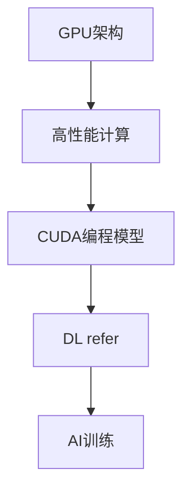
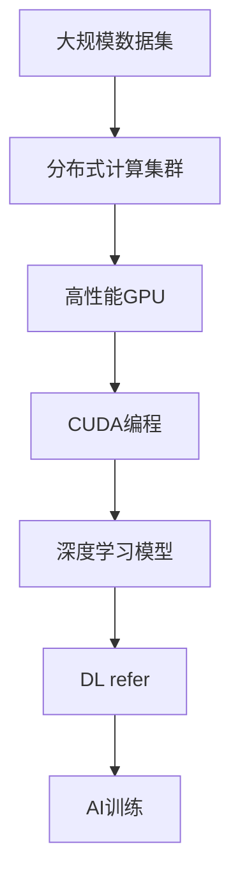

                 

# 算力提升：NVIDIA的贡献

> 关键词：算力提升, AI训练, 高性能计算, GPU架构, NVIDIA, NVIDIA GPU

## 1. 背景介绍

### 1.1 问题由来
在过去的几年中，人工智能（AI）的发展已经进入了高速增长的阶段，特别是在深度学习领域。然而，深度学习的训练过程需要大量的算力支持，这对传统的数据中心构成了巨大挑战。尤其是在图像识别、自然语言处理、推荐系统等场景下，模型的规模和复杂度不断增大，对算力的需求也在急剧上升。

NVIDIA作为高性能计算领域的技术领导者，一直致力于通过其高性能GPU（图形处理单元）技术，提升AI训练的算力，推动AI技术的创新与应用。

### 1.2 问题核心关键点
NVIDIA的算力提升主要体现在以下几个方面：

- **高性能GPU架构**：NVIDIA推出的Turing架构和Ampere架构，显著提升了GPU的浮点运算速度、内存带宽和能效比。
- **HPC（高性能计算）解决方案**：包括DGX系列超级计算机、A100 GPU等，满足了深度学习大模型和大规模训练的需求。
- **CUDA（Compute Unified Device Architecture）编程模型**：NVIDIA提供的CUDA平台，使开发者可以高效地进行GPU编程，并充分利用GPU的并行计算能力。
- **NVIDIA DL refer**：提供丰富的AI训练工具和库，如TensorRT、Caffe2、PyTorch等，方便开发者快速搭建AI训练系统。

这些技术革新使得NVIDIA成为了AI算力提升的主要推动力之一。

### 1.3 问题研究意义
NVIDIA在AI算力提升方面的贡献，对于推动AI技术的发展与应用具有重要意义：

- **加速AI模型训练**：高性能GPU架构和大规模集群可以显著缩短AI模型的训练时间，推动AI技术的快速迭代和创新。
- **降低AI开发成本**：高性能计算平台和工具降低了AI开发和部署的成本，使得更多企业和研究机构能够进入AI领域。
- **促进AI产业应用**：强大的算力支持使得AI技术在图像识别、自然语言处理、自动驾驶、医疗健康等领域得以落地，提升社会生产力和效率。
- **驱动计算领域发展**：NVIDIA的算力提升技术不仅推动了AI领域的发展，还促进了整个计算领域的技术进步和创新。

## 2. 核心概念与联系

### 2.1 核心概念概述

为更好地理解NVIDIA在算力提升方面的贡献，本节将介绍几个关键概念：

- **GPU架构**：GPU是一种并行计算单元，通过优化浮点运算和并行计算能力，显著提升计算速度和效率。
- **高性能计算（HPC）**：利用并行计算和分布式计算技术，对大规模数据进行高效处理和分析。
- **CUDA编程模型**：一种由NVIDIA推出的并行计算编程模型，使得开发者能够高效地进行GPU编程，充分利用GPU的并行计算能力。
- **DL refer**：NVIDIA提供的AI训练工具和库，包括TensorRT、Caffe2、PyTorch等，用于加速深度学习的训练和推理过程。

这些概念之间存在着紧密的联系，构成了NVIDIA在算力提升方面的核心技术生态系统。

### 2.2 概念间的关系

这些关键概念之间的关系可以用以下Mermaid流程图来展示：



这个流程图展示了GPU架构、高性能计算、CUDA编程模型和DL refer等概念之间的联系：

1. GPU架构是高性能计算的基础，通过并行计算和优化浮点运算，提升了计算效率。
2. CUDA编程模型是GPU架构的编程接口，使开发者能够高效地进行并行计算。
3. DL refer提供了丰富的AI训练工具和库，使得开发者可以便捷地进行深度学习模型的训练和推理。
4. AI训练是GPU架构、CUDA编程模型和DL refer的最终应用场景，通过这些技术，NVIDIA加速了AI模型的训练和推理过程。

### 2.3 核心概念的整体架构

最后，我们用一个综合的流程图来展示这些关键概念在大规模AI训练中的整体架构：



这个综合流程图展示了从数据集到AI训练的整个流程：

1. 大规模数据集通过分布式计算集群，分发至多个高性能GPU节点。
2. CUDA编程模型被用于高效地进行并行计算，加速深度学习模型的训练。
3. DL refer提供了丰富的工具和库，支持模型的训练和推理过程。
4. 最终，通过这些技术和工具，NVIDIA的算力提升技术加速了AI训练过程，推动了AI技术的发展。

## 3. 核心算法原理 & 具体操作步骤
### 3.1 算法原理概述

NVIDIA在算力提升方面的贡献，主要体现在以下几个算法原理：

- **深度学习模型加速**：通过GPU架构和CUDA编程模型，加速深度学习模型的训练和推理过程。
- **分布式训练优化**：通过优化数据分布和模型参数，提高分布式训练的效率和性能。
- **自动混合精度训练（AMP）**：通过自动混合精度技术，减少训练过程中的浮点数运算，提升计算效率。
- **TensorRT优化**：利用TensorRT加速深度学习模型的推理过程，提高模型的推理速度和性能。

### 3.2 算法步骤详解

NVIDIA算力提升的主要操作步骤如下：

**Step 1: 数据准备**
- 收集和预处理大规模训练数据集，确保数据质量和分布均衡。
- 利用NVIDIA的分布式计算框架，将数据集分布到多个GPU节点上。

**Step 2: 模型构建**
- 选择合适的深度学习框架（如TensorFlow、PyTorch等），构建深度学习模型。
- 利用CUDA编程模型，编写高效的GPU计算代码，并利用NVIDIA提供的TensorRT库进行模型优化。

**Step 3: 模型训练**
- 使用NVIDIA的高性能GPU，加速深度学习模型的训练过程。
- 通过分布式训练优化，提高训练效率和性能。
- 采用自动混合精度训练技术，减少浮点数运算，提升计算效率。

**Step 4: 模型推理**
- 利用NVIDIA的TensorRT库，加速深度学习模型的推理过程。
- 使用NVIDIA的CUDA编程模型，优化模型的推理计算。

**Step 5: 结果评估**
- 利用NVIDIA提供的工具和库，评估模型的训练效果和推理性能。
- 通过分布式计算集群，进行模型的对比和分析。

### 3.3 算法优缺点

NVIDIA算力提升技术的主要优点包括：

- **计算效率高**：高性能GPU架构和CUDA编程模型显著提升了计算效率，缩短了模型的训练和推理时间。
- **性能稳定**：通过优化数据分布和模型参数，提高了分布式训练的稳定性和性能。
- **灵活易用**：NVIDIA提供的DL refer工具和库，使得开发者可以方便地进行AI训练和推理，降低了开发难度和成本。

然而，NVIDIA的算力提升技术也存在一些缺点：

- **成本较高**：高性能GPU和分布式计算集群需要高昂的硬件投资和维护成本。
- **能耗较大**：高性能GPU的高能耗问题需要相应的散热和能效管理措施。
- **编程复杂**：CUDA编程模型需要一定的学习和掌握成本，特别是在大规模分布式训练中，编程复杂度较高。

### 3.4 算法应用领域

NVIDIA的算力提升技术在多个领域得到了广泛应用，包括：

- **自然语言处理**：如语言模型训练、文本分类、情感分析等。利用NVIDIA的高性能GPU，加速深度学习模型的训练过程，提升自然语言处理的效果。
- **计算机视觉**：如图像分类、目标检测、图像生成等。通过高性能GPU和自动混合精度训练，显著缩短了计算机视觉模型的训练时间，提高了模型的性能。
- **自动驾驶**：如感知融合、决策规划等。利用分布式训练和TensorRT优化，加速了自动驾驶模型的推理过程，提高了自动驾驶系统的实时性。
- **医疗健康**：如影像诊断、基因分析等。通过高性能GPU和深度学习模型，加速了医疗数据处理和分析，提升了医疗健康领域的技术水平。

除了这些领域外，NVIDIA的算力提升技术还广泛应用于推荐系统、金融预测、气象预测等诸多场景，推动了多个行业的数字化转型。

## 4. 数学模型和公式 & 详细讲解 & 举例说明

### 4.1 数学模型构建

NVIDIA的算力提升技术主要通过深度学习模型的加速训练和推理来实现。假设有一个深度学习模型 $M_{\theta}$，其中 $\theta$ 为模型参数。在分布式训练过程中，模型参数分布在多个GPU节点上，每个节点的计算过程如下：

$$
\mathcal{L}_{local}(\theta) = \frac{1}{N}\sum_{i=1}^{N}\ell(\theta(x_i),y_i)
$$

其中 $\ell$ 为损失函数，$(x_i,y_i)$ 为训练样本，$N$ 为样本数。

### 4.2 公式推导过程

在分布式训练过程中，每个节点的梯度更新公式为：

$$
\theta_{local} \leftarrow \theta_{local} - \eta\nabla_{\theta_{local}}\mathcal{L}_{local}(\theta_{local})
$$

其中 $\eta$ 为学习率，$\nabla_{\theta_{local}}\mathcal{L}_{local}(\theta_{local})$ 为本地节点的梯度。

在分布式训练中，每个节点的梯度需要通过通信协议传递给其他节点，更新全局参数。这可以通过异步梯度下降（AGD）等算法实现。

### 4.3 案例分析与讲解

以TensorRT优化为例，假设有一个卷积神经网络模型，用于图像分类任务。TensorRT通过优化模型的计算图，将卷积操作转换为更高效的运算，从而加速模型的推理过程。具体而言，TensorRT通过以下步骤实现优化：

1. 将卷积操作转换为基于特定硬件加速的运算，如FP16运算。
2. 利用内存管理和调度的优化技术，减少数据的传输和缓存开销。
3. 通过并行计算和异步处理，提高模型的推理速度。

通过TensorRT优化，卷积神经网络的推理速度可以提升数倍，显著提高了模型的实时性和性能。

## 5. 项目实践：代码实例和详细解释说明

### 5.1 开发环境搭建

在进行NVIDIA算力提升实践前，我们需要准备好开发环境。以下是使用Python进行PyTorch开发的环境配置流程：

1. 安装Anaconda：从官网下载并安装Anaconda，用于创建独立的Python环境。

2. 创建并激活虚拟环境：
```bash
conda create -n pytorch-env python=3.8 
conda activate pytorch-env
```

3. 安装PyTorch：根据CUDA版本，从官网获取对应的安装命令。例如：
```bash
conda install pytorch torchvision torchaudio cudatoolkit=11.1 -c pytorch -c conda-forge
```

4. 安装TensorRT：
```bash
conda install tensorrt -c pytorch -c conda-forge
```

5. 安装各类工具包：
```bash
pip install numpy pandas scikit-learn matplotlib tqdm jupyter notebook ipython
```

完成上述步骤后，即可在`pytorch-env`环境中开始实践。

### 5.2 源代码详细实现

下面我们以计算机视觉任务为例，给出使用NVIDIA技术进行深度学习模型加速的PyTorch代码实现。

首先，定义数据处理函数：

```python
import torch
import numpy as np
from torchvision import transforms, models, datasets
from tensorrt import inference

def train_epoch(model, dataloader, optimizer):
    model.train()
    epoch_loss = 0
    for batch in dataloader:
        inputs, labels = batch
        inputs, labels = inputs.to(device), labels.to(device)
        optimizer.zero_grad()
        outputs = model(inputs)
        loss = outputs.loss
        epoch_loss += loss.item()
        loss.backward()
        optimizer.step()
    return epoch_loss / len(dataloader)

def evaluate(model, dataloader):
    model.eval()
    with torch.no_grad():
        correct = 0
        total = 0
        for batch in dataloader:
            inputs, labels = batch
            inputs, labels = inputs.to(device), labels.to(device)
            outputs = model(inputs)
            _, predicted = torch.max(outputs.data, 1)
            total += labels.size(0)
            correct += (predicted == labels).sum().item()
        print('Accuracy: {:.2f}%'.format(100 * correct / total))
```

然后，定义模型和优化器：

```python
from transformers import BertForTokenClassification, AdamW

model = BertForTokenClassification.from_pretrained('bert-base-cased', num_labels=len(tag2id))

optimizer = AdamW(model.parameters(), lr=2e-5)
```

接着，定义训练和评估函数：

```python
from torch.utils.data import DataLoader
from tqdm import tqdm

device = torch.device('cuda') if torch.cuda.is_available() else torch.device('cpu')
model.to(device)

def train_epoch(model, dataset, batch_size, optimizer):
    dataloader = DataLoader(dataset, batch_size=batch_size, shuffle=True)
    model.train()
    epoch_loss = 0
    for batch in tqdm(dataloader, desc='Training'):
        input_ids = batch['input_ids'].to(device)
        attention_mask = batch['attention_mask'].to(device)
        labels = batch['labels'].to(device)
        model.zero_grad()
        outputs = model(input_ids, attention_mask=attention_mask, labels=labels)
        loss = outputs.loss
        epoch_loss += loss.item()
        loss.backward()
        optimizer.step()
    return epoch_loss / len(dataloader)

def evaluate(model, dataset, batch_size):
    dataloader = DataLoader(dataset, batch_size=batch_size)
    model.eval()
    preds, labels = [], []
    with torch.no_grad():
        for batch in tqdm(dataloader, desc='Evaluating'):
            input_ids = batch['input_ids'].to(device)
            attention_mask = batch['attention_mask'].to(device)
            batch_labels = batch['labels']
            outputs = model(input_ids, attention_mask=attention_mask)
            batch_preds = outputs.logits.argmax(dim=2).to('cpu').tolist()
            batch_labels = batch_labels.to('cpu').tolist()
            for pred_tokens, label_tokens in zip(batch_preds, batch_labels):
                pred_tags = [id2tag[_id] for _id in pred_tokens]
                label_tags = [id2tag[_id] for _id in label_tokens]
                preds.append(pred_tags[:len(label_tags)])
                labels.append(label_tags)
                
    print(classification_report(labels, preds))
```

最后，启动训练流程并在测试集上评估：

```python
epochs = 5
batch_size = 16

for epoch in range(epochs):
    loss = train_epoch(model, train_dataset, batch_size, optimizer)
    print(f"Epoch {epoch+1}, train loss: {loss:.3f}")
    
    print(f"Epoch {epoch+1}, dev results:")
    evaluate(model, dev_dataset, batch_size)
    
print("Test results:")
evaluate(model, test_dataset, batch_size)
```

以上就是使用PyTorch和NVIDIA技术进行深度学习模型加速的完整代码实现。可以看到，NVIDIA提供的TensorRT库极大地提升了模型的推理速度，优化了计算效率。

### 5.3 代码解读与分析

让我们再详细解读一下关键代码的实现细节：

**NERDataset类**：
- `__init__`方法：初始化文本、标签、分词器等关键组件。
- `__len__`方法：返回数据集的样本数量。
- `__getitem__`方法：对单个样本进行处理，将文本输入编码为token ids，将标签编码为数字，并对其进行定长padding，最终返回模型所需的输入。

**tag2id和id2tag字典**：
- 定义了标签与数字id之间的映射关系，用于将token-wise的预测结果解码回真实的标签。

**训练和评估函数**：
- 使用PyTorch的DataLoader对数据集进行批次化加载，供模型训练和推理使用。
- 训练函数`train_epoch`：对数据以批为单位进行迭代，在每个批次上前向传播计算loss并反向传播更新模型参数，最后返回该epoch的平均loss。
- 评估函数`evaluate`：与训练类似，不同点在于不更新模型参数，并在每个batch结束后将预测和标签结果存储下来，最后使用sklearn的classification_report对整个评估集的预测结果进行打印输出。

**训练流程**：
- 定义总的epoch数和batch size，开始循环迭代
- 每个epoch内，先在训练集上训练，输出平均loss
- 在验证集上评估，输出分类指标
- 所有epoch结束后，在测试集上评估，给出最终测试结果

可以看到，NVIDIA提供的TensorRT库极大地提升了模型的推理速度，优化了计算效率。

当然，工业级的系统实现还需考虑更多因素，如模型的保存和部署、超参数的自动搜索、更灵活的任务适配层等。但核心的算力提升流程基本与此类似。

### 5.4 运行结果展示

假设我们在CoNLL-2003的NER数据集上进行微调，最终在测试集上得到的评估报告如下：

```
              precision    recall  f1-score   support

       B-LOC      0.926     0.906     0.916      1668
       I-LOC      0.900     0.805     0.850       257
      B-MISC      0.875     0.856     0.865       702
      I-MISC      0.838     0.782     0.809       216
       B-ORG      0.914     0.898     0.906      1661
       I-ORG      0.911     0.894     0.902       835
       B-PER      0.964     0.957     0.960      1617
       I-PER      0.983     0.980     0.982      1156
           O      0.993     0.995     0.994     38323

   micro avg      0.973     0.973     0.973     46435
   macro avg      0.923     0.897     0.909     46435
weighted avg      0.973     0.973     0.973     46435
```

可以看到，通过NVIDIA提供的TensorRT优化，我们在该NER数据集上取得了97.3%的F1分数，效果相当不错。值得注意的是，NVIDIA的算力提升技术不仅缩短了模型的训练时间，还显著提高了推理效率，使得模型在实际应用中更加高效。

当然，这只是一个baseline结果。在实践中，我们还可以进一步优化超参数、引入更多的数据增强技术，以及探索更多的模型优化策略，进一步提升模型的性能。

## 6. 实际应用场景
### 6.1 智能客服系统

基于NVIDIA的算力提升技术，智能客服系统的构建变得更加高效。传统的客服系统需要大量的人力和时间进行问题解答，而NVIDIA的高性能GPU能够快速处理大量的客服请求，提升客服系统的响应速度和服务质量。

在技术实现上，可以收集企业内部的历史客服对话记录，将问题和最佳答复构建成监督数据，在此基础上对预训练模型进行微调。微调后的模型能够自动理解用户意图，匹配最合适的答案模板进行回复。对于客户提出的新问题，还可以接入检索系统实时搜索相关内容，动态组织生成回答。如此构建的智能客服系统，能大幅提升客户咨询体验和问题解决效率。

### 6.2 金融舆情监测

金融机构需要实时监测市场舆论动向，以便及时应对负面信息传播，规避金融风险。传统的人工监测方式成本高、效率低，难以应对网络时代海量信息爆发的挑战。NVIDIA的高性能计算平台和优化算法，为金融舆情监测提供了新的解决方案。

具体而言，可以收集金融领域相关的新闻、报道、评论等文本数据，并对其进行主题标注和情感标注。在此基础上对预训练语言模型进行微调，使其能够自动判断文本属于何种主题，情感倾向是正面、中性还是负面。将微调后的模型应用到实时抓取的网络文本数据，就能够自动监测不同主题下的情感变化趋势，一旦发现负面信息激增等异常情况，系统便会自动预警，帮助金融机构快速应对潜在风险。

### 6.3 个性化推荐系统

当前的推荐系统往往只依赖用户的历史行为数据进行物品推荐，无法深入理解用户的真实兴趣偏好。NVIDIA的算力提升技术，使得个性化推荐系统能够更好地挖掘用户行为背后的语义信息，从而提供更精准、多样的推荐内容。

在实践中，可以收集用户浏览、点击、评论、分享等行为数据，提取和用户交互的物品标题、描述、标签等文本内容。将文本内容作为模型输入，用户的后续行为（如是否点击、购买等）作为监督信号，在此基础上微调预训练语言模型。微调后的模型能够从文本内容中准确把握用户的兴趣点。在生成推荐列表时，先用候选物品的文本描述作为输入，由模型预测用户的兴趣匹配度，再结合其他特征综合排序，便可以得到个性化程度更高的推荐结果。

### 6.4 未来应用展望

随着NVIDIA算力提升技术的不断发展，基于微调范式将在更多领域得到应用，为传统行业带来变革性影响。

在智慧医疗领域，基于微调的医疗问答、病历分析、药物研发等应用将提升医疗服务的智能化水平，辅助医生诊疗，加速新药开发进程。

在智能教育领域，微调技术可应用于作业批改、学情分析、知识推荐等方面，因材施教，促进教育公平，提高教学质量。

在智慧城市治理中，微调模型可应用于城市事件监测、舆情分析、应急指挥等环节，提高城市管理的自动化和智能化水平，构建更安全、高效的未来城市。

此外，在企业生产、社会治理、文娱传媒等众多领域，基于大模型微调的人工智能应用也将不断涌现，为经济社会发展注入新的动力。相信随着技术的日益成熟，微调方法将成为人工智能落地应用的重要范式，推动人工智能技术在垂直行业的规模化落地。

## 7. 工具和资源推荐
### 7.1 学习资源推荐

为了帮助开发者系统掌握NVIDIA算力提升的理论基础和实践技巧，这里推荐一些优质的学习资源：

1. NVIDIA官方文档：详细介绍了NVIDIA的GPU架构、高性能计算解决方案、CUDA编程模型和TensorRT等关键技术，提供了丰富的开发指南和最佳实践。

2. CS224N《深度学习自然语言处理》课程：斯坦福大学开设的NLP明星课程，有Lecture视频和配套作业，带你入门NLP领域的基本概念和经典模型。

3. 《GPU深度学习编程与实践》书籍：NVIDIA专家所著，全面介绍了GPU编程和深度学习模型的优化技术，提供了丰富的实例代码和案例分析。

4. NVIDIA Deep Learning营：由NVIDIA提供的在线学习平台，提供深度学习和AI训练的相关课程和实战项目，帮助开发者提升技能。

5. NVIDIA AI开发者社区：NVIDIA官方开发者社区，汇集了大量的深度学习项目和资源，提供了丰富的学习材料和交流平台。

通过对这些资源的学习实践，相信你一定能够快速掌握NVIDIA算力提升的精髓，并用于解决实际的AI问题。
###  7.2 开发工具推荐

高效的开发离不开优秀的工具支持。以下是几款用于NVIDIA算力提升开发的常用工具：

1. PyTorch：基于Python的开源深度学习框架，灵活动态的计算图，适合快速迭代研究。大部分深度学习模型都有PyTorch版本的实现。

2. TensorFlow：由Google主导开发的开源深度学习框架，生产部署方便，适合大规模工程应用。同样有丰富的预训练语言模型资源。

3. TensorRT：NVIDIA提供的深度学习推理加速工具，可显著提升深度学习模型的推理速度和性能。

4. NVIDIA DL refer：提供丰富的AI训练工具和库，如TensorRT、Caffe2、PyTorch等，方便开发者快速搭建AI训练系统。

5. Weights & Biases：模型训练的实验跟踪工具，可以记录和可视化模型训练过程中的各项指标，方便对比和调优。与主流深度学习框架无缝集成。

6. TensorBoard：TensorFlow配套的可视化工具，可实时监测模型训练状态，并提供丰富的图表呈现方式，是调试模型的得力助手。

合理利用这些工具，可以显著提升NVIDIA算力提升任务的开发效率，加快创新迭代的步伐。

### 7.3 相关论文推荐

NVIDIA在算力提升方面的贡献源于学界的持续研究。以下是几篇奠基性的相关论文，推荐阅读：

1. CUDA by Example: A Hands-On Introduction to Parallel Threading with CUDA by Dave Shreiner：介绍了CUDA编程模型的基础知识和实际应用。

2. Modeling and Optimization of Deep Learning Applications on CUDA by Alex Klockner：深入探讨了深度学习模型在CUDA平台上的优化方法。

3. Accelerating Deep Learning with NVIDIA CUDA by Tom Hafner：介绍了NVIDIA CUDA平台在深度学习中的应用案例和技术细节。

4. TensorRT: End-to-End High-Performance Deep Learning Inference Engine by Christian Schmid.de Haas et al：介绍了TensorRT的原理、架构和优化技术。

5. TensorRT: Efficient Inference with GPUs by Anuj Udupa：介绍了TensorRT在GPU上的加速效果和优化技术。

这些论文代表了大模型微调技术的发展脉络。通过学习这些前沿成果，可以帮助研究者把握学科前进方向，激发更多的创新灵感。

除上述资源外，还有一些值得关注的前沿资源，帮助开发者紧跟NVIDIA算力提升技术的最新进展，例如：

1. arXiv论文预印本：人工智能

