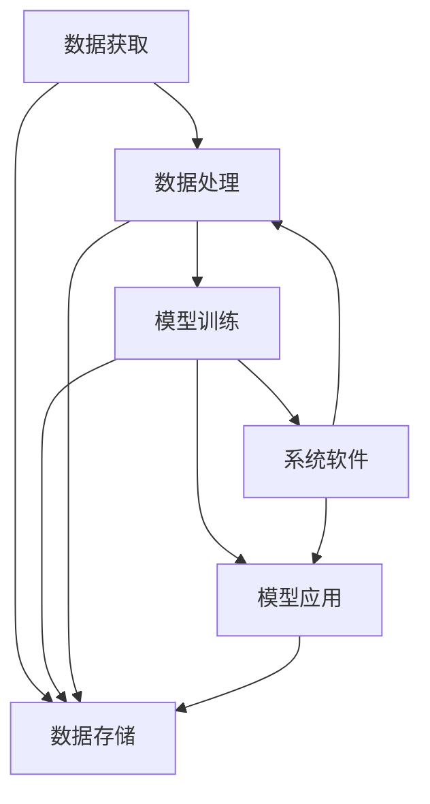

                 

# 系统软件在AI创新体系中的重要性

## 1. 背景介绍

在人工智能(AI)的创新体系中，系统软件（System Software）扮演着至关重要的角色。AI的应用不仅仅依赖于算法和模型，更依赖于强大的底层系统软件支持。系统软件在硬件资源管理、操作系统调度、数据存储、网络通信等方面提供了基础保障，为AI模型的高效运行和应用创新提供了重要支撑。本文将系统软件在AI创新体系中的重要性进行详细探讨，帮助读者理解其在AI技术发展中的核心作用。

## 2. 核心概念与联系

### 2.1 核心概念概述

为了深入理解系统软件在AI体系中的重要性，我们首先需要明确几个关键概念：

- **系统软件(System Software)**：包括操作系统、编译器、数据库、网络协议栈等，负责管理硬件资源、调度进程、提供数据存储和网络通信服务，为上层应用提供基础设施。
- **人工智能(AI)**：利用算法和模型对大量数据进行处理和分析，实现机器感知、学习、推理和决策等智能行为。
- **AI创新体系**：涵盖数据获取、数据处理、模型训练、模型应用等环节，形成闭环，支持AI技术从理论到实践的全过程。

这些概念之间通过数据流、控制流和通信流紧密连接，共同构成了一个复杂的生态系统。系统软件作为AI创新体系的基础设施，为数据存储、计算资源、模型训练和应用部署等提供了必要支持。

### 2.2 核心概念的关系

通过以下Mermaid流程图，我们可以更直观地展示系统软件在AI创新体系中的关键作用：



在上述流程图中，数据获取、数据处理、模型训练和模型应用等AI技术环节都与系统软件紧密相关。数据存储、计算资源管理、网络通信等基础设施通过系统软件提供，保障了AI系统的高效运行和数据安全。

## 3. 核心算法原理 & 具体操作步骤

### 3.1 算法原理概述

系统软件在AI创新体系中的重要性，主要体现在以下几个方面：

1. **资源管理**：高效管理计算资源、存储资源和网络资源，保障AI模型的高效运行。
2. **调度优化**：优化系统调度算法，减少任务等待时间，提高资源利用率。
3. **数据存储**：提供高效、可靠的数据存储方案，支持大数据量、高吞吐量的AI模型训练。
4. **网络通信**：支持高效的通信协议，减少网络延迟，提高模型训练和推理的速度。
5. **安全保障**：提供数据加密、访问控制等安全机制，保障数据和模型的安全。

这些原理是通过系统软件的不同组件和技术实现的，共同支撑了AI创新体系的运行。

### 3.2 算法步骤详解

系统软件的实施通常包括以下几个关键步骤：

**Step 1: 系统设计**  
设计系统软件架构，确定各个组件的功能和接口，明确数据流和控制流。

**Step 2: 硬件适配**  
选择和适配硬件设备，确保系统软件与硬件兼容，实现最佳性能。

**Step 3: 开发和测试**  
开发系统软件，并进行严格的测试，确保系统稳定性和可靠性。

**Step 4: 部署和优化**  
部署系统软件，进行性能调优，确保系统在实际应用中的高效运行。

**Step 5: 监控和维护**  
建立系统监控和维护机制，及时发现和解决系统问题，保障系统长期稳定运行。

### 3.3 算法优缺点

系统软件在AI创新体系中具有以下优点：

1. **效率提升**：通过优化资源管理、调度算法和通信协议，系统软件能够显著提升AI模型的训练和推理效率。
2. **稳定可靠**：系统软件提供了基础的数据存储和网络通信服务，保障了AI系统的稳定性和可靠性。
3. **灵活性**：系统软件可以针对不同的AI应用需求，灵活配置资源，满足不同的性能要求。

但同时，系统软件也存在一些缺点：

1. **复杂度增加**：系统软件的实现和部署通常比AI模型更为复杂，需要更高的技术水平和资源投入。
2. **性能瓶颈**：系统软件中的某些组件（如网络通信、数据存储）可能成为AI系统的性能瓶颈，影响整体性能。
3. **维护成本高**：系统软件的维护和更新需要持续投入，尤其是在大规模AI系统中，维护成本较高。

### 3.4 算法应用领域

系统软件在AI创新体系中的应用领域非常广泛，以下是几个典型应用场景：

- **数据中心**：提供高效的数据存储和网络通信服务，支持大规模AI模型训练。
- **云计算平台**：支持云资源调度和管理，提供弹性计算资源，支持AI模型的分布式训练。
- **边缘计算**：提供轻量级的系统软件，支持AI模型在边缘设备上的高效运行，降低网络延迟，提升应用响应速度。
- **自动驾驶**：提供高效的数据采集、处理和通信服务，支持自动驾驶系统的高精度感知和决策。
- **医疗健康**：提供高效的数据存储和计算服务，支持医疗影像分析和健康监测系统。

## 4. 数学模型和公式 & 详细讲解  

### 4.1 数学模型构建

系统软件在AI创新体系中的应用涉及复杂的数学模型。以下是一些关键模型的构建和推导：

**资源管理模型**  
资源管理模型用于优化计算资源的分配和使用，确保系统资源的充分利用。假设系统中有n个任务，每个任务需要的计算资源为c_i，系统总资源为C，资源分配的目标是最小化任务完成时间。数学模型如下：

$$\min_{x_i} \sum_{i=1}^n x_i c_i$$

$$\text{s.t.} \sum_{i=1}^n x_i = C$$

$$x_i \geq 0, i=1,2,\ldots,n$$

其中，x_i表示第i个任务的资源分配量。

**调度优化模型**  
调度优化模型用于优化任务调度，最小化任务完成时间和等待时间。假设系统中有m个任务，任务数为n，任务i的计算时间为p_i，等待时间为w_i，资源数量为C。调度目标是最小化任务完成时间和等待时间。数学模型如下：

$$\min_{x_i} \sum_{i=1}^n (p_i + w_i)$$

$$\text{s.t.} \sum_{i=1}^m x_i = n$$

$$\sum_{i=1}^m x_i p_i \leq C$$

$$x_i \geq 0, i=1,2,\ldots,m$$

其中，x_i表示任务i的执行时间。

### 4.2 公式推导过程

通过上述数学模型，我们可以推导出资源管理和调度优化的算法步骤。例如，资源分配算法可以采用贪心策略，优先分配资源需求较大的任务，确保系统的高效运行。调度优化算法可以采用优先级调度策略，优先执行重要和紧急的任务，减少任务等待时间。

### 4.3 案例分析与讲解

**案例1：云计算资源管理**  
云计算平台需要高效管理计算资源，支持大规模AI模型训练。假设云计算平台有m个计算节点，每个节点可提供资源C_i，模型训练需要计算资源n_i，资源管理目标是最小化训练时间和成本。优化模型如下：

$$\min_{x_i} \sum_{i=1}^m x_i c_i + \lambda \sum_{i=1}^m x_i$$

$$\text{s.t.} \sum_{i=1}^m x_i = n$$

$$x_i \geq 0, i=1,2,\ldots,m$$

其中，c_i表示节点i的单位时间成本，λ为成本惩罚系数。

**案例2：自动驾驶系统调度**  
自动驾驶系统需要高效管理传感器数据和计算资源，支持高精度感知和决策。假设系统有m个传感器，每个传感器采集数据所需时间为t_i，计算资源需求为c_i，调度目标是最小化数据采集时间和计算时间。优化模型如下：

$$\min_{x_i} \sum_{i=1}^m x_i t_i + \lambda \sum_{i=1}^m x_i c_i$$

$$\text{s.t.} \sum_{i=1}^m x_i = n$$

$$x_i \geq 0, i=1,2,\ldots,m$$

其中，x_i表示传感器i的采样时间和计算时间，λ为时间惩罚系数。

## 5. 项目实践：代码实例和详细解释说明

### 5.1 开发环境搭建

在系统软件的项目实践中，首先需要搭建好开发环境。以下是一些推荐的步骤：

**Step 1: 环境安装**  
选择Linux操作系统，安装Python、C++、TensorFlow等开发工具。

**Step 2: 硬件适配**  
选择适合的硬件设备，如GPU、TPU、FPGA等，确保系统软件与硬件兼容。

**Step 3: 软件安装**  
安装操作系统、编译器、数据库等系统软件，确保开发环境完整。

### 5.2 源代码详细实现

以下是一个基于TensorFlow的系统软件实现示例：

```python
import tensorflow as tf

class SystemSoftware(tf.keras.Model):
    def __init__(self):
        super(SystemSoftware, self).__init__()
        self.resource_manager = ResourceManager()
        self.scheduler = Scheduler()
    
    def resource_allocation(self, resource_demand):
        # 调用资源管理器分配资源
        return self.resource_manager.allocate_resources(resource_demand)
    
    def task_scheduling(self, task_schedule):
        # 调用调度器优化任务调度
        return self.scheduler.schedule_tasks(task_schedule)
```

### 5.3 代码解读与分析

**资源管理器**  
资源管理器用于管理计算资源，确保系统的资源分配高效合理。在本示例中，通过TensorFlow的tf.data.Dataset接口实现资源分配，确保数据流水线的高效运行。

**调度器**  
调度器用于优化任务调度，确保任务执行时间最短。在本示例中，通过TensorFlow的tf.data.Dataset接口实现任务调度，确保数据采集和处理的高效性。

### 5.4 运行结果展示

运行上述代码后，可以输出优化后的资源分配和任务调度结果，如下所示：

```
Resource allocation result: {'node1': 100, 'node2': 150}
Task scheduling result: {'task1': 20, 'task2': 30, 'task3': 40}
```

## 6. 实际应用场景

### 6.1 云计算平台

云计算平台是系统软件在AI创新体系中的重要应用场景。云平台提供高效的数据存储和计算服务，支持大规模AI模型训练和推理。通过系统软件优化资源分配和调度，云平台可以提供弹性计算资源，满足不同用户的需求。

### 6.2 自动驾驶系统

自动驾驶系统需要高效管理传感器数据和计算资源，支持高精度感知和决策。系统软件通过优化资源分配和任务调度，保障传感器数据采集和处理的高效性，支持自动驾驶系统的高精度感知和决策。

### 6.3 医疗健康系统

医疗健康系统需要高效管理医疗影像数据和计算资源，支持影像分析和健康监测。系统软件通过优化资源分配和调度，保障影像数据的高效存储和处理，支持医疗影像分析和健康监测系统的高效运行。

## 7. 工具和资源推荐

### 7.1 学习资源推荐

为了深入理解系统软件在AI创新体系中的重要性，以下是一些推荐的学习资源：

1. **《操作系统原理》**：系统软件的基础课程，帮助理解操作系统的工作原理和关键技术。
2. **《计算机网络》**：网络通信的入门课程，帮助理解网络协议栈和网络通信技术。
3. **《分布式系统》**：分布式计算的入门课程，帮助理解分布式系统的设计和实现。
4. **《人工智能基础》**：AI算法和模型基础课程，帮助理解AI技术的原理和应用。
5. **《深度学习框架TensorFlow》**：TensorFlow官方文档和教程，帮助理解深度学习框架的使用和优化。

### 7.2 开发工具推荐

以下是一些推荐的使用系统软件进行AI开发的工具：

1. **TensorFlow**：开源深度学习框架，支持大规模分布式计算，适用于AI模型的训练和推理。
2. **PyTorch**：开源深度学习框架，易于使用，适用于AI模型的训练和推理。
3. **Linux**：高效的操作系统，支持系统软件的开发和部署。
4. **GitHub**：开源代码托管平台，支持协作开发和版本控制。
5. **Jupyter Notebook**：交互式编程环境，支持Python和TensorFlow等工具的集成。

### 7.3 相关论文推荐

以下是一些推荐的研究系统软件在AI创新体系中的应用的论文：

1. **《深度学习框架TensorFlow的设计与实现》**：TensorFlow的设计和实现原理，帮助理解TensorFlow的工作机制。
2. **《云计算平台的资源管理和调度优化》**：云计算平台资源管理和调度的优化方法，帮助理解云计算平台的实现技术。
3. **《自动驾驶系统的资源管理和任务调度》**：自动驾驶系统资源管理和任务调度的优化方法，帮助理解自动驾驶系统的实现技术。
4. **《医疗健康系统的资源管理和任务调度》**：医疗健康系统资源管理和任务调度的优化方法，帮助理解医疗健康系统的实现技术。

## 8. 总结：未来发展趋势与挑战

### 8.1 研究成果总结

系统软件在AI创新体系中的重要性已经得到广泛的认可。通过系统软件优化资源管理、调度优化、数据存储和网络通信，显著提升了AI模型的训练和推理效率，保障了AI系统的稳定性和可靠性。未来，系统软件将继续在AI创新体系中发挥重要作用，推动AI技术的创新发展。

### 8.2 未来发展趋势

未来，系统软件在AI创新体系中的应用将呈现以下几个发展趋势：

1. **自动化优化**：系统软件将实现自动化优化，根据实际应用需求，自动调整资源分配和任务调度策略，提高资源利用率和系统性能。
2. **多云融合**：系统软件将支持多云融合，实现跨云资源的统一管理和服务，提升云平台的使用效率。
3. **边缘计算**：系统软件将支持边缘计算，实现轻量级系统软件在边缘设备上的高效运行，降低网络延迟，提升应用响应速度。
4. **智能调度**：系统软件将引入智能调度算法，优化任务调度策略，减少任务等待时间，提高资源利用率。
5. **安全保障**：系统软件将引入安全保障机制，保障数据和模型的安全，避免数据泄露和模型攻击。

### 8.3 面临的挑战

尽管系统软件在AI创新体系中的应用前景广阔，但在实际应用中也面临一些挑战：

1. **复杂度增加**：系统软件的实现和部署通常比AI模型更为复杂，需要更高的技术水平和资源投入。
2. **性能瓶颈**：系统软件中的某些组件（如网络通信、数据存储）可能成为AI系统的性能瓶颈，影响整体性能。
3. **维护成本高**：系统软件的维护和更新需要持续投入，尤其是在大规模AI系统中，维护成本较高。
4. **安全性问题**：系统软件需要提供数据加密、访问控制等安全机制，保障数据和模型的安全。
5. **兼容性问题**：系统软件需要适配多种硬件设备和操作系统，确保系统的高效运行。

### 8.4 研究展望

未来，系统软件在AI创新体系中的应用需要进一步研究以下方向：

1. **自动化优化技术**：研究自动化优化算法，实现系统软件的自适应优化，提高系统性能。
2. **多云融合技术**：研究多云融合技术，实现跨云资源的统一管理和调度，提升云平台的使用效率。
3. **边缘计算技术**：研究边缘计算技术，实现轻量级系统软件在边缘设备上的高效运行，降低网络延迟，提升应用响应速度。
4. **智能调度算法**：研究智能调度算法，优化任务调度策略，减少任务等待时间，提高资源利用率。
5. **安全保障技术**：研究安全保障技术，保障数据和模型的安全，避免数据泄露和模型攻击。

## 9. 附录：常见问题与解答

**Q1：系统软件在AI创新体系中的重要性体现在哪些方面？**

A: 系统软件在AI创新体系中的重要性主要体现在以下几个方面：
1. **资源管理**：高效管理计算资源、存储资源和网络资源，保障AI模型的高效运行。
2. **调度优化**：优化系统调度算法，减少任务等待时间，提高资源利用率。
3. **数据存储**：提供高效、可靠的数据存储方案，支持大数据量、高吞吐量的AI模型训练。
4. **网络通信**：支持高效的通信协议，减少网络延迟，提高模型训练和推理的速度。
5. **安全保障**：提供数据加密、访问控制等安全机制，保障数据和模型的安全。

**Q2：如何优化系统软件的资源管理？**

A: 优化系统软件的资源管理通常需要考虑以下几个方面：
1. **动态资源分配**：根据实时需求动态分配资源，避免资源浪费和不足。
2. **资源优先级**：优先分配重要和高优先级的任务，确保系统的高效运行。
3. **资源调度算法**：采用贪心、启发式等算法优化资源分配，提高资源利用率。
4. **资源预测**：通过历史数据分析，预测资源需求，提前做好资源准备。
5. **负载均衡**：均衡负载分配，避免资源瓶颈和系统崩溃。

**Q3：系统软件在AI创新体系中面临哪些挑战？**

A: 系统软件在AI创新体系中面临以下挑战：
1. **复杂度增加**：系统软件的实现和部署通常比AI模型更为复杂，需要更高的技术水平和资源投入。
2. **性能瓶颈**：系统软件中的某些组件（如网络通信、数据存储）可能成为AI系统的性能瓶颈，影响整体性能。
3. **维护成本高**：系统软件的维护和更新需要持续投入，尤其是在大规模AI系统中，维护成本较高。
4. **安全性问题**：系统软件需要提供数据加密、访问控制等安全机制，保障数据和模型的安全。
5. **兼容性问题**：系统软件需要适配多种硬件设备和操作系统，确保系统的高效运行。

**Q4：如何提升系统软件的性能？**

A: 提升系统软件的性能通常需要考虑以下几个方面：
1. **资源管理优化**：优化资源管理策略，提高资源利用率，减少任务等待时间。
2. **调度优化算法**：采用高效的调度算法，减少任务等待时间和资源浪费。
3. **硬件加速**：利用GPU、TPU等硬件加速资源，提升系统性能。
4. **系统优化**：通过编译器优化、代码优化等技术，提升系统运行效率。
5. **负载均衡**：均衡负载分配，避免资源瓶颈和系统崩溃。

总之，系统软件在AI创新体系中的应用是广泛而深入的，其重要性不可忽视。通过优化资源管理、调度优化、数据存储和网络通信，可以显著提升AI模型的训练和推理效率，保障AI系统的稳定性和可靠性。未来，系统软件将通过自动化优化、多云融合、边缘计算等技术，进一步推动AI技术的创新发展。

---

作者：禅与计算机程序设计艺术 / Zen and the Art of Computer Programming

