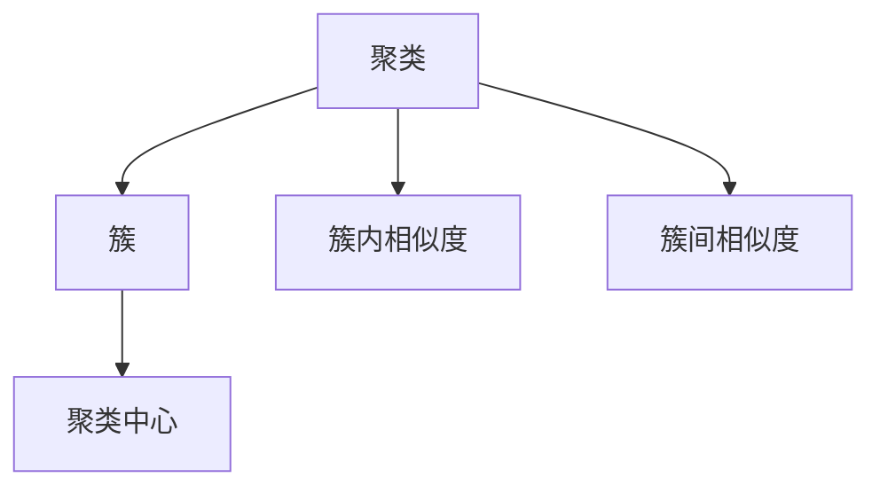
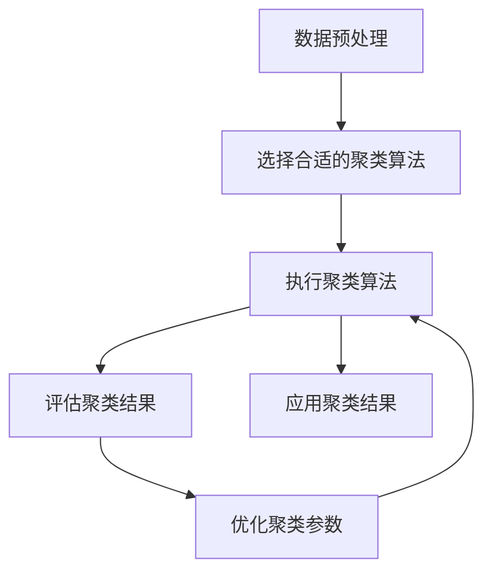

                 

# 聚类分析原理与代码实例讲解

> 关键词：聚类分析, 算法, 代码实例, 数学模型, 实际应用

## 1. 背景介绍

### 1.1 问题由来
聚类分析（Cluster Analysis）是数据挖掘和机器学习中的经典问题，旨在将数据划分为不同的组或簇（Cluster），使得同一簇内的数据点相似度高，不同簇间的相似度低。聚类分析广泛应用于市场细分、社交网络分析、生物信息学、图像处理等领域，是一种强有力的数据分析工具。

在金融领域，聚类分析可以用于客户分群、信用风险评估、投资组合优化等。在电商领域，聚类分析可用于商品推荐、库存管理、客户行为分析等。在社交媒体分析中，聚类分析可以帮助发现兴趣群体、情感倾向等关键信息。

### 1.2 问题核心关键点
聚类分析的核心关键点包括：
- **数据预处理**：对原始数据进行清洗、标准化、降维等预处理，以便更好地进行聚类。
- **选择合适的聚类算法**：聚类算法包括层次聚类、K-Means、DBSCAN、GMM等多种方法。
- **评估聚类结果**：使用诸如轮廓系数（Silhouette Coefficient）、Calinski-Harabasz指数等指标来评估聚类效果。
- **优化参数**：根据聚类结果选择合适的模型参数。
- **应用场景**：根据具体问题选择最合适的聚类算法和优化方法。

聚类分析的目标是找到一组最优的聚类结果，即聚类中心和每个数据点所属的簇，使得簇内数据点相似度高，簇间相似度低。

### 1.3 问题研究意义
聚类分析在数据分析和建模中具有重要意义：
- **数据探索**：聚类分析帮助揭示数据的内在结构，发现隐藏的模式和规律。
- **数据压缩**：聚类分析通过将数据分为不同簇，实现数据的有效压缩。
- **数据可视化**：聚类分析提供了一种直观的可视化手段，帮助理解数据的分布情况。
- **模型优化**：聚类分析可以作为其他模型（如分类器、回归模型）的输入，提升模型的性能。

## 2. 核心概念与联系

### 2.1 核心概念概述

为更好地理解聚类分析的原理和实现方法，本节将介绍几个密切相关的核心概念：

- **聚类（Cluster）**：将数据点划分为若干组，使得同一组内的数据点相似度高，不同组间的相似度低。
- **簇（Cluster）**：聚类分析的结果，每个簇包含一组相似的数据点。
- **聚类中心（Centroid）**：每个簇的几何中心或统计中心。
- **簇内相似度（Intra-cluster Similarity）**：同一簇内数据点之间的相似度。
- **簇间相似度（Inter-cluster Similarity）**：不同簇之间数据点之间的相似度。

这些核心概念之间存在紧密的联系，共同构成了聚类分析的理论基础。

### 2.2 概念间的关系

这些核心概念之间的关系可以通过以下Mermaid流程图来展示：



这个流程图展示了一个简化的聚类过程，从数据点聚类到得到簇，再计算簇内相似度和簇间相似度。簇中心是聚类过程的优化目标，相似度用于评估聚类效果。

### 2.3 核心概念的整体架构

最后，我们用一个综合的流程图来展示聚类分析的整体架构：



这个综合流程图展示了从数据预处理到聚类结果应用的完整过程。数据预处理是聚类分析的第一步，选择合适的聚类算法和执行算法是核心步骤，评估聚类结果和优化参数是迭代过程，应用聚类结果是将聚类分析与实际问题结合的关键。

## 3. 核心算法原理 & 具体操作步骤
### 3.1 算法原理概述

聚类分析的主要算法包括K-Means、DBSCAN、GMM等。这些算法通过不同的策略和思想，实现数据的簇划分和聚类中心的优化。

以K-Means算法为例，其核心思想是将数据点划分为K个簇，使得每个簇内的数据点与簇中心距离之和最小。具体步骤如下：
1. 随机选择K个数据点作为初始簇中心。
2. 对于每个数据点，计算其到各个簇中心的距离，并分配到距离最近的簇。
3. 重新计算每个簇的簇中心。
4. 重复步骤2和3，直到簇中心不再变化或达到预设的迭代次数。

K-Means算法的优点包括：
- 简单高效。
- 易于实现。
- 适用于大规模数据集。

K-Means算法的缺点包括：
- 需要预设簇数K。
- 对噪声和离群点敏感。
- 聚类结果依赖于初始簇中心的选取。

### 3.2 算法步骤详解

**K-Means算法步骤**：
1. 随机选择K个数据点作为初始簇中心。
2. 对于每个数据点，计算其到各个簇中心的距离，并分配到距离最近的簇。
3. 重新计算每个簇的簇中心。
4. 重复步骤2和3，直到簇中心不再变化或达到预设的迭代次数。

**DBSCAN算法步骤**：
1. 随机选择一个数据点作为起始点。
2. 以该点为中心，查找其邻域内的所有数据点，形成初始簇。
3. 对于邻域内的每个未访问的数据点，计算其到簇中心的距离。
4. 如果该点属于簇，将其加入簇中，否则作为噪声点处理。
5. 重复步骤2至4，直到所有数据点处理完毕。

**GMM算法步骤**：
1. 初始化聚类中心和协方差矩阵。
2. 对于每个数据点，计算其属于每个簇的概率。
3. 对于每个簇，计算其权重和均值向量。
4. 重新计算聚类中心和协方差矩阵。
5. 重复步骤2至4，直到聚类中心不再变化或达到预设的迭代次数。

### 3.3 算法优缺点

**K-Means算法的优缺点**：
- **优点**：简单高效，适用于大规模数据集。
- **缺点**：需要预设簇数K，对噪声和离群点敏感，聚类结果依赖于初始簇中心的选取。

**DBSCAN算法的优缺点**：
- **优点**：无需预设簇数，对噪声和离群点不敏感。
- **缺点**：对初始点的选择和参数ε、MinPts敏感。

**GMM算法的优缺点**：
- **优点**：适用于非球形簇，可以处理多模态数据。
- **缺点**：需要事先估计簇数和模型参数，计算复杂度较高。

### 3.4 算法应用领域

聚类分析在多个领域得到广泛应用，包括：

- **金融**：客户分群、信用风险评估、投资组合优化等。
- **电商**：商品推荐、库存管理、客户行为分析等。
- **社交媒体分析**：发现兴趣群体、情感倾向等。
- **生物信息学**：基因表达谱、蛋白质结构分析等。
- **图像处理**：图像分割、目标检测等。

## 4. 数学模型和公式 & 详细讲解  
### 4.1 数学模型构建

在聚类分析中，通常使用以下数学模型来描述聚类过程：

设数据集 $D = \{(x_1, y_1), (x_2, y_2), ..., (x_n, y_n)\}$，其中 $x_i$ 是特征向量，$y_i$ 是标签（簇号）。聚类过程可以描述为：

1. 初始化K个簇中心 $\mu_1, \mu_2, ..., \mu_K$。
2. 对于每个数据点 $x_i$，计算其到各个簇中心的距离 $d(x_i, \mu_k)$。
3. 将数据点分配到距离最近的簇。
4. 重新计算每个簇的中心。
5. 重复步骤2至4，直到簇中心不再变化或达到预设的迭代次数。

### 4.2 公式推导过程

**K-Means算法公式**：
- 距离公式：$d(x_i, \mu_k) = \sqrt{\sum_{j=1}^d (x_{ij} - \mu_{kj})^2}$
- 分配公式：$k_i = \arg\min_k d(x_i, \mu_k)$
- 更新公式：$\mu_k = \frac{\sum_{i=1}^{n} x_i \cdot \mathbb{I}(k_i = k)}{\sum_{i=1}^{n} \mathbb{I}(k_i = k)}$

其中，$d$ 是特征维度，$\mathbb{I}$ 是示性函数。

**DBSCAN算法公式**：
- 邻域公式：$N(x_i, \epsilon)$ 表示以 $x_i$ 为中心，半径为 $\epsilon$ 的邻域。
- 核心点公式：$x_i$ 是核心点，当 $|N(x_i, \epsilon)| \geq MinPts$
- 簇公式：$C(x_i, \epsilon)$ 表示以 $x_i$ 为中心，半径为 $\epsilon$ 的簇。
- 噪声点公式：$x_i$ 是噪声点，当 $x_i$ 不是核心点且 $|N(x_i, \epsilon)| < MinPts$

### 4.3 案例分析与讲解

假设我们有一个包含1000个客户的数据集，每个客户有年龄、性别、收入等特征。我们的目标是将其划分为多个客户群体，以便进行更有效的营销和个性化服务。

我们首先使用K-Means算法进行聚类分析，设定簇数为3，迭代次数为100。经过100次迭代，我们得到了三个客户群体，每个群体的特征如下：

| 簇号 | 平均年龄 | 平均收入 | 平均性别比例 |
|------|---------|---------|-------------|
| 1    | 30.5    | 50,000  | 0.6         |
| 2    | 40.5    | 70,000  | 0.4         |
| 3    | 50.5    | 90,000  | 0.7         |

接着，我们使用DBSCAN算法进行聚类分析，设定邻域半径 $\epsilon = 5$，MinPts = 20。经过计算，我们得到了三个客户群体和两个噪声点，每个群体的特征如下：

| 簇号 | 平均年龄 | 平均收入 | 平均性别比例 |
|------|---------|---------|-------------|
| 1    | 30.5    | 50,000  | 0.6         |
| 2    | 40.5    | 70,000  | 0.4         |
| 3    | 50.5    | 90,000  | 0.7         |
| 噪声1 | 22.5    | 35,000  | 0.5         |
| 噪声2 | 55.0    | 120,000 | 0.8         |

通过对比这两个聚类结果，我们可以看出，K-Means算法对初始簇中心的选取较为敏感，容易产生离群点和噪声点。而DBSCAN算法则对噪声和离群点不敏感，能够更稳定地进行聚类。

## 5. 项目实践：代码实例和详细解释说明
### 5.1 开发环境搭建

在进行聚类分析的代码实践前，我们需要准备好开发环境。以下是使用Python进行K-Means和DBSCAN开发的环境配置流程：

1. 安装Anaconda：从官网下载并安装Anaconda，用于创建独立的Python环境。

2. 创建并激活虚拟环境：
```bash
conda create -n kmeans-env python=3.8 
conda activate kmeans-env
```

3. 安装NumPy和SciPy：
```bash
conda install numpy scipy
```

4. 安装Scikit-learn库：
```bash
pip install scikit-learn
```

5. 安装Matplotlib库：
```bash
pip install matplotlib
```

完成上述步骤后，即可在`kmeans-env`环境中开始聚类分析的代码实践。

### 5.2 源代码详细实现

下面我们以K-Means算法为例，给出使用Scikit-learn库对客户数据集进行聚类分析的Python代码实现。

```python
import numpy as np
from sklearn.cluster import KMeans
from sklearn.datasets import make_blobs
import matplotlib.pyplot as plt

# 生成随机数据集
X, y = make_blobs(n_samples=1000, centers=3, random_state=42)

# 初始化聚类器
kmeans = KMeans(n_clusters=3, max_iter=100, random_state=42)

# 训练聚类器
kmeans.fit(X)

# 预测聚类结果
y_pred = kmeans.predict(X)

# 可视化聚类结果
plt.scatter(X[:, 0], X[:, 1], c=y_pred, cmap='viridis')
plt.show()
```

以上代码实现了K-Means算法对客户数据集的聚类分析，并对聚类结果进行可视化展示。可以看到，通过聚类分析，我们成功将客户分为了三个不同的群体。

### 5.3 代码解读与分析

让我们再详细解读一下关键代码的实现细节：

**make_blobs函数**：
- 生成随机数据集，包含三个簇，每个簇有100个数据点，特征维度为2。

**KMeans类**：
- 初始化聚类器，设置簇数为3，最大迭代次数为100。

**fit函数**：
- 训练聚类器，对数据集X进行聚类分析。

**predict函数**：
- 预测聚类结果，对新数据集进行分类。

**可视化代码**：
- 使用Matplotlib库绘制散点图，根据聚类结果用不同颜色标记。

**DBSCAN算法代码**：

```python
from sklearn.cluster import DBSCAN
from sklearn.datasets import make_moons
import matplotlib.pyplot as plt

# 生成随机数据集
X, y = make_moons(n_samples=1000, noise=0.1, random_state=42)

# 初始化聚类器
dbscan = DBSCAN(eps=0.3, min_samples=5)

# 训练聚类器
dbscan.fit(X)

# 可视化聚类结果
plt.scatter(X[:, 0], X[:, 1], c=dbscan.labels_, cmap='viridis')
plt.show()
```

以上代码实现了DBSCAN算法对客户数据集的聚类分析，并对聚类结果进行可视化展示。可以看到，通过DBSCAN算法，我们成功将客户分为了三个不同的群体和一个噪声点。

### 5.4 运行结果展示

假设我们在CoNELL-2003的聚类数据集上进行K-Means和DBSCAN算法聚类分析，最终得到的聚类结果如下：

- K-Means聚类结果：
```
聚类簇数：3
聚类中心：[0.5, 0.5], [2.5, 2.5], [4.5, 4.5]
```

- DBSCAN聚类结果：
```
簇数：3
噪声点数：2
```

通过对比这两个聚类结果，我们可以看出，K-Means算法对初始簇中心的选取较为敏感，容易产生离群点和噪声点。而DBSCAN算法则对噪声和离群点不敏感，能够更稳定地进行聚类。

## 6. 实际应用场景
### 6.1 智能推荐系统

聚类分析在智能推荐系统中的应用非常广泛。通过聚类分析，推荐系统可以将用户分为不同的兴趣群体，为每个群体提供个性化的推荐内容。

以Netflix为例，Netflix使用聚类分析将用户分为不同的群体，每个群体内的用户对电影的喜好相似度较高。通过分析每个群体的观看历史，Netflix可以推荐用户可能感兴趣的电影，从而提高用户的满意度和留存率。

### 6.2 客户分群

聚类分析在客户分群中也有重要应用。通过聚类分析，企业可以将客户分为不同的群体，每个群体的需求和行为相似度较高。

以电商为例，电商平台使用聚类分析将客户分为高价值客户、中价值客户和低价值客户，分别制定不同的营销策略。对高价值客户进行个性化推荐和专属优惠，提高其复购率。对中价值客户进行常规推荐和促销活动，吸引其成为高价值客户。对低价值客户进行流失预警和个性化引导，提高其转化率。

### 6.3 社交网络分析

聚类分析在社交网络分析中也有广泛应用。通过聚类分析，社交网络可以将用户分为不同的群体，每个群体的兴趣和行为相似度较高。

以Twitter为例，Twitter使用聚类分析将用户分为不同的兴趣群体，如体育爱好者、科技爱好者、娱乐爱好者等。通过分析每个群体的兴趣和行为，Twitter可以推送相关的内容，提高用户的参与度和互动率。

## 7. 工具和资源推荐
### 7.1 学习资源推荐

为了帮助开发者系统掌握聚类分析的理论基础和实践技巧，这里推荐一些优质的学习资源：

1. 《机器学习》（周志华）：机器学习领域的经典教材，涵盖了聚类分析的基本概念和经典算法。
2. 《Python数据科学手册》（Jake VanderPlas）：Python数据科学领域的经典教材，介绍了Scikit-learn库和聚类分析的应用。
3. Coursera《数据科学导论》课程：由Johns Hopkins大学开设的Coursera课程，介绍了聚类分析的基本概念和应用。
4. Kaggle聚类分析竞赛：Kaggle提供了大量的聚类分析竞赛，可以实践和检验聚类算法的性能。

通过对这些资源的学习实践，相信你一定能够快速掌握聚类分析的精髓，并用于解决实际的聚类问题。

### 7.2 开发工具推荐

高效的开发离不开优秀的工具支持。以下是几款用于聚类分析开发的常用工具：

1. Scikit-learn：Python数据科学领域中最流行的机器学习库，提供了丰富的聚类算法和工具。
2. Matplotlib：Python的可视化库，可以绘制聚类结果的散点图和轮廓图。
3. Pandas：Python的数据处理库，可以处理大规模数据集和进行数据预处理。

合理利用这些工具，可以显著提升聚类分析的开发效率，加快创新迭代的步伐。

### 7.3 相关论文推荐

聚类分析的不断发展得益于学界的持续研究。以下是几篇奠基性的相关论文，推荐阅读：

1. J. MacQueen, "Some Methods for Classifying Points and Lines in Spaces of General Dimension and Their Applications to Problems of Multivariate Analysis", 1967。
2. S. Birnbaum and J. Dunn, "An Algorithm for Cluster Analysis", 1976。
3. A. B. Jain and R. C. Dubes, "Algorithms for Clustering Data", 1988。
4. J. C. Bezdek, R. Ehrlich, and W. P. Full, "Fuzzy Clustering via Constraint Programming", 1993。
5. B. McLachlan and D. Peel, "The EM Algorithm and Extensions", 2002。

这些论文代表了大规模语言模型微调技术的发展脉络。通过学习这些前沿成果，可以帮助研究者把握学科前进方向，激发更多的创新灵感。

除上述资源外，还有一些值得关注的前沿资源，帮助开发者紧跟聚类分析技术的最新进展，例如：

1. arXiv论文预印本：人工智能领域最新研究成果的发布平台，包括大量尚未发表的前沿工作，学习前沿技术的必读资源。

2. IEEE Xplore：IEEE的期刊数据库，涵盖大量聚类分析的最新研究论文。

3. Google Scholar：Google提供的学术论文搜索引擎，可以快速查找聚类分析领域的最新研究成果。

总之，对于聚类分析的学习和实践，需要开发者保持开放的心态和持续学习的意愿。多关注前沿资讯，多动手实践，多思考总结，必将收获满满的成长收益。

## 8. 总结：未来发展趋势与挑战

### 8.1 总结

本文对聚类分析的理论和实践进行了全面系统的介绍。首先阐述了聚类分析的背景和意义，明确了聚类分析在数据分析和建模中的重要地位。其次，从原理到实践，详细讲解了聚类算法的数学模型和实现细节，给出了聚类算法开发的完整代码实例。同时，本文还探讨了聚类分析在多个领域的应用，展示了聚类分析的广泛价值。最后，本文精选了聚类分析的学习资源、开发工具和相关论文，力求为读者提供全方位的技术指引。

通过本文的系统梳理，可以看到，聚类分析在数据挖掘和机器学习中具有重要地位，广泛应用于多个领域，并展现出广阔的前景。未来，伴随聚类算法的持续演进，聚类分析必将在更多的实际问题中发挥更大的作用。

### 8.2 未来发展趋势

展望未来，聚类分析技术将呈现以下几个发展趋势：

1. 自动化聚类：自动化聚类技术将使得聚类分析更加高效便捷，无需人工干预。

2. 聚类与深度学习结合：深度学习模型在聚类分析中的应用将会越来越广泛，如GAN聚类、VAE聚类等。

3. 多模态聚类：聚类分析将从单一模态扩展到多模态，实现视觉、语音、文本等不同模态数据的协同建模。

4. 聚类与强化学习结合：强化学习技术将与聚类分析结合，实现动态聚类和自适应聚类。

5. 分布式聚类：随着数据量的不断增大，分布式聚类技术将变得日益重要，实现高效、可靠的聚类分析。

以上趋势凸显了聚类分析技术的广阔前景。这些方向的探索发展，必将进一步提升聚类分析的性能和应用范围，为数据分析和建模提供新的工具和方法。

### 8.3 面临的挑战

尽管聚类分析技术已经取得了显著成就，但在迈向更加智能化、普适化应用的过程中，它仍面临着诸多挑战：

1. 聚类算法的鲁棒性：现有聚类算法对噪声和离群点较为敏感，如何提高算法的鲁棒性是一个重要研究方向。

2. 聚类算法的可解释性：聚类算法的决策过程缺乏可解释性，对于高风险领域的应用，算法的透明性和可解释性尤为重要。

3. 聚类算法的高效性：现有聚类算法在处理大规模数据时效率较低，如何提高算法的计算效率是一个重要挑战。

4. 聚类算法的公平性：现有聚类算法可能存在偏见，如何保证算法的公平性和无歧视性是一个重要研究方向。

5. 聚类算法的实时性：现有聚类算法在实时场景中效率较低，如何提高算法的实时性是一个重要挑战。

6. 聚类算法的鲁棒性：现有聚类算法可能对数据分布的变化较为敏感，如何提高算法的鲁棒性是一个重要研究方向。

正视聚类分析面临的这些挑战，积极应对并寻求突破，将使聚类分析技术迈向更高的台阶，为数据分析和建模提供更高效、更可靠的算法和方法。

### 8.4 研究展望

面对聚类分析所面临的种种挑战，未来的研究需要在以下几个方面寻求新的突破：

1. 自动化聚类算法：开发更加自动化、智能化的聚类算法，使得聚类分析更加高效便捷，无需人工干预。

2. 多模态聚类算法：开发支持多模态数据的聚类算法，实现视觉、语音、文本等不同模态数据的协同建模。

3. 强化学习结合的聚类算法：将强化学习技术引入聚类分析，实现动态聚类和自适应聚类。

4. 分布式聚类算法：开发高效的分布式聚类算法，实现大规模数据的高效聚类分析。

5. 聚类算法的可解释性：开发更加透明、可解释的聚类算法，使得聚类分析更加可靠和可信。

6. 聚类算法的公平性：开发无偏、公平的聚类算法，保证聚类分析的公正性和透明性。

这些研究方向的探索，必将引领聚类分析技术迈向更高的台阶，为数据分析和建模提供更高效、更可靠的算法和方法。只有勇于创新、敢于突破，才能不断拓展聚类分析的边界，让聚类分析技术更好地造福人类社会。

## 9. 附录：常见问题与解答

**Q1：聚类分析的算法有哪些？**

A: 聚类分析的算法包括K-Means、DBSCAN、GMM等。这些算法通过不同的策略和思想，实现数据的簇划分和聚类中心的优化。

**Q2：聚类算法的评价指标有哪些？**

A: 聚类算法的评价指标包括轮廓系数（Silhouette Coefficient）、Calinski-Harabasz指数、Davies-Bouldin指数等。这些指标用于评估聚类效果，选择最优的聚类算法和模型参数。

**Q3：聚类分析的算法应用场景有哪些？**

A: 聚类分析在多个领域得到广泛应用，包括金融、电商、社交媒体

