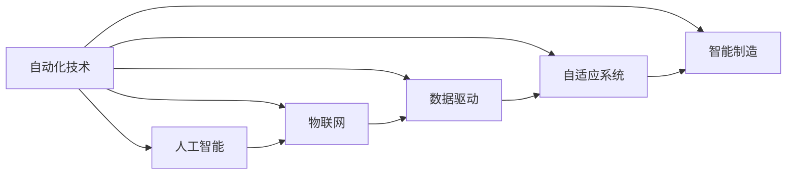
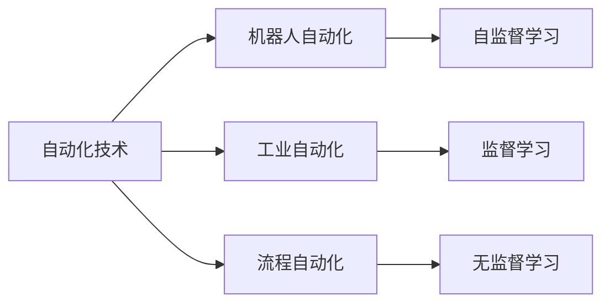
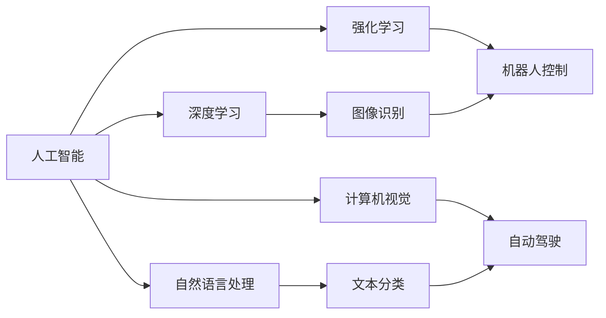
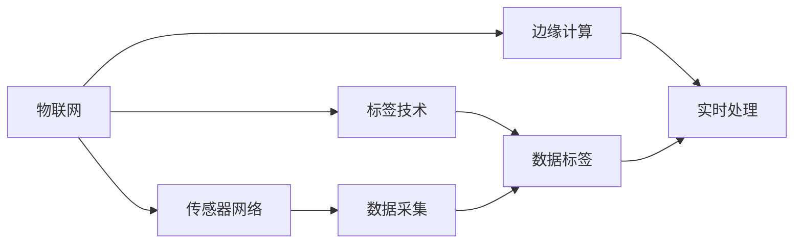
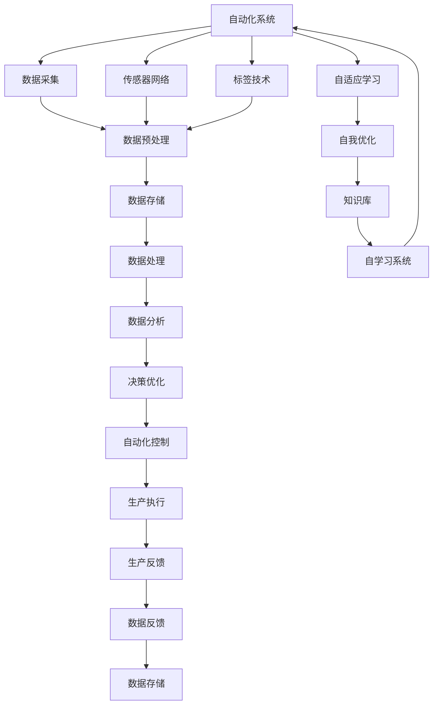

                 

# 自动化技术的最新应用与发展方向

## 1. 背景介绍

### 1.1 问题由来
自动化技术的发展已历经数十载，从早期的流水线装配到如今的智能制造，其范围和深度都发生了翻天覆地的变化。随着人工智能(AI)、物联网(IoT)、大数据分析等前沿技术的不断融合，自动化技术正在迎来新一轮的升级。智能自动化技术正在逐步改变着各行各业的生产方式、工作流程和业务模式。然而，当前的自动化技术在智能性、适应性和安全性等方面仍然面临诸多挑战。

### 1.2 问题核心关键点
当前自动化技术面临的核心问题包括：
- 自动化系统如何在日益复杂多变的环境下保持稳定性和鲁棒性？
- 如何提高自动化系统的自适应性和自学习能力，以应对不同任务和场景的需求？
- 如何在自动化系统中融入更多的智能性，如决策、优化、预测等功能？
- 如何确保自动化系统的安全性，避免潜在的安全漏洞和攻击？
- 如何提升自动化系统的可解释性和透明度，使其输出更具可信度和可追溯性？

### 1.3 问题研究意义
研究自动化技术的最新应用和发展方向，对于推动产业智能化转型、提升生产效率、降低运营成本、增强企业竞争力具有重要意义：

1. 提升生产效率：自动化技术可以显著减少人工操作，提高生产线的效率和质量。
2. 降低运营成本：自动化系统通过优化资源配置和生产流程，降低企业运营成本。
3. 增强企业竞争力：智能化自动化技术可以带来创新产品和服务，提升企业市场竞争力。
4. 实现智能制造：自动化系统融入AI、大数据、IoT等技术，实现智能化制造，推动产业升级。
5. 保障安全与合规：自动化系统的智能监控、预警和自适应能力，有助于提高安全性，保障数据和系统的合规性。

## 2. 核心概念与联系

### 2.1 核心概念概述

为了更好地理解自动化技术的最新应用和发展方向，本节将介绍几个密切相关的核心概念：

- **自动化技术(Automation Technology)**：指的是通过机械化、电子化、信息化和智能化手段，实现任务自动化执行的过程。常见的自动化技术包括机器人自动化、工业自动化、流程自动化等。
- **人工智能(Artificial Intelligence, AI)**：通过机器学习、深度学习等技术，使机器具备类似于人类的智能行为。AI在自动化技术中扮演着重要的角色，尤其是在智能自动化和智能制造领域。
- **物联网(IoT)**：通过传感器、标签等设备，实现物理对象与网络的无缝连接，实现数据的实时传输和处理。物联网为自动化系统提供了更丰富的数据源和更高效的数据传输方式。
- **数据驱动(Driver by Data)**：自动化系统的智能化水平很大程度上依赖于数据的质量和数量。通过大数据分析和机器学习算法，从海量数据中提取有价值的信息，支持自动化系统的决策和优化。
- **自适应系统(Adaptive System)**：具备自我学习和自我优化能力，能够根据环境变化和任务需求进行动态调整的系统。自适应系统是未来自动化技术的重要发展方向。
- **智能制造(Intelligent Manufacturing, IM)**：将AI、IoT、云计算等技术与传统制造相结合，实现生产过程的智能化和自动化。智能制造是工业4.0的核心。

这些核心概念之间的逻辑关系可以通过以下Mermaid流程图来展示：



这个流程图展示了几大核心概念之间的相互关系和支持作用：

1. 自动化技术是基础，通过引入AI、IoT等技术，实现智能化和自动化。
2. AI技术提供智能决策和优化能力，提升自动化系统的智能化水平。
3. IoT技术提供数据的实时采集和传输，增强自动化系统的感知能力。
4. 数据驱动使自动化系统具备自我学习和优化能力，提高其适应性和效率。
5. 自适应系统进一步提升了自动化系统的智能化和自动化水平。
6. 智能制造是自动化技术的高级形态，将AI、IoT、大数据等技术融合在一起，推动产业升级。

### 2.2 概念间的关系

这些核心概念之间存在着紧密的联系，形成了自动化技术的完整生态系统。下面我通过几个Mermaid流程图来展示这些概念之间的关系。

#### 2.2.1 自动化技术的学习范式



这个流程图展示了自动化技术的三种主要学习范式：

1. 机器人自动化：通过自监督学习，使机器人具备自主避障、目标识别等能力。
2. 工业自动化：通过监督学习，实现自动化设备对产品的质量检测和控制。
3. 流程自动化：通过无监督学习，使自动化流程具备自主调度和管理。

#### 2.2.2 人工智能与自动化技术的结合



这个流程图展示了AI技术在自动化系统中的典型应用：

1. 深度学习：通过卷积神经网络(CNN)、循环神经网络(RNN)等模型，实现图像识别、语音识别等功能。
2. 强化学习：通过强化学习算法，优化机器人的路径规划和控制策略。
3. 自然语言处理：通过语言模型和语义分析，实现智能客服、语音助手等应用。
4. 计算机视觉：通过图像处理和特征提取，实现自动驾驶、工业视觉检测等。

#### 2.2.3 物联网与自动化技术的融合



这个流程图展示了IoT技术在自动化系统中的应用：

1. 传感器网络：通过传感器实时采集生产设备的状态和环境数据。
2. 标签技术：通过RFID等标签技术，实现物品的精确定位和跟踪。
3. 边缘计算：通过边缘计算设备，对实时数据进行初步处理和分析，减轻中心服务器的负担。

### 2.3 核心概念的整体架构

最后，我用一个综合的流程图来展示这些核心概念在大规模自动化系统中的整体架构：



这个综合流程图展示了从数据采集、存储、处理、分析到决策、控制、反馈的完整自动化系统流程。数据通过传感器网络、标签技术等采集到系统，经过预处理、存储、分析等环节，支持决策优化和自动化控制，最终反馈到生产执行环节，通过自适应学习、自我优化等技术，不断提升系统的智能化水平。

## 3. 核心算法原理 & 具体操作步骤

### 3.1 算法原理概述

自动化系统的智能化和自动化水平，很大程度上依赖于数据驱动的算法和技术。自动化系统的核心算法包括：

- **数据预处理**：对采集到的数据进行清洗、过滤、特征提取等处理，为后续的算法提供高质量的数据输入。
- **特征提取与选择**：通过机器学习算法，从数据中提取有意义的特征，用于支持系统的决策和优化。
- **决策与优化**：利用强化学习、优化算法等技术，对自动化系统的行为进行智能决策和优化。
- **自我学习和优化**：通过在线学习、自适应算法等技术，使系统具备自我学习能力和适应性，能够根据环境变化和任务需求进行动态调整。
- **智能监控与预警**：通过异常检测、预测模型等技术，对自动化系统进行智能监控和预警，保障系统的稳定性和安全性。

### 3.2 算法步骤详解

以下是自动化系统常用的核心算法步骤：

1. **数据预处理**：
   - 数据清洗：去除噪音、异常值等，保证数据的准确性和一致性。
   - 特征提取：使用PCA、LDA等降维算法，提取数据的关键特征。
   - 数据标准化：对数据进行归一化处理，避免模型受到不同量级数据的影响。

2. **特征提取与选择**：
   - 使用主成分分析(PCA)、线性判别分析(LDA)等技术，从高维数据中提取关键特征。
   - 使用特征选择算法(如Lasso、Ridge)，从数据中选择最相关、最有用的特征。

3. **决策与优化**：
   - 使用强化学习算法(如Q-Learning、Deep Q Network)，训练智能代理对环境进行智能决策和优化。
   - 使用遗传算法、粒子群算法等优化算法，对自动化系统的参数进行优化，提升系统性能。

4. **自我学习和优化**：
   - 使用在线学习算法(如在线梯度下降)，在实际运行中不断学习和优化系统模型。
   - 使用自适应算法(如自适应控制)，根据环境变化和任务需求进行动态调整。

5. **智能监控与预警**：
   - 使用异常检测算法(如One-class SVM)，监测系统运行状态，检测异常行为。
   - 使用预测模型(如ARIMA、LSTM)，预测未来趋势，进行风险预警。

### 3.3 算法优缺点

自动化系统的核心算法具有以下优点：

1. **提高生产效率**：自动化系统通过数据驱动的算法，实现任务自动化执行，显著提高生产效率和质量。
2. **增强系统灵活性**：通过在线学习、自适应算法，使系统具备自我学习和优化能力，适应不同任务和环境。
3. **降低运营成本**：自动化系统减少人工干预，降低运营成本，提升资源利用效率。

然而，这些算法也存在一些缺点：

1. **数据依赖性强**：自动化系统的效果很大程度上依赖于数据的质量和数量，数据不足时效果可能不理想。
2. **复杂度高**：自动化系统的算法和模型较为复杂，需要大量的数据和计算资源进行训练和优化。
3. **鲁棒性不足**：自动化系统对环境变化和异常数据的鲁棒性不足，易受噪声和干扰影响。
4. **可解释性差**：自动化系统的算法和模型较为复杂，其决策过程缺乏可解释性，难以理解和调试。

### 3.4 算法应用领域

自动化系统的核心算法在以下领域得到了广泛应用：

1. **工业自动化**：通过数据驱动的算法，实现生产过程的智能化和自动化，提升生产效率和质量。
2. **智能制造**：将AI、IoT、大数据等技术与传统制造结合，实现智能化制造和生产自动化。
3. **智能客服**：通过自然语言处理、情感分析等技术，实现智能客服系统，提升客户满意度。
4. **智能交通**：利用计算机视觉、传感器等技术，实现交通流量监控、自动驾驶等应用。
5. **智能监控**：通过数据采集和分析，实现对生产过程、设备状态等的智能监控和预警。
6. **智能仓储**：通过物联网和传感器技术，实现仓储自动化、物流优化等应用。

## 4. 数学模型和公式 & 详细讲解 & 举例说明

### 4.1 数学模型构建

自动化系统的数学模型通常包括数据预处理、特征提取、决策优化等环节。以下以一个简单的工业自动化系统为例，构建其数学模型：

1. **数据预处理模型**：
   - 输入：原始数据$x$
   - 输出：预处理后的数据$y$
   - 模型：$y = f(x)$
   - 目标：$y$尽可能接近$x$

2. **特征提取模型**：
   - 输入：预处理后的数据$y$
   - 输出：提取后的特征$z$
   - 模型：$z = g(y)$
   - 目标：$z$尽可能包含关键信息

3. **决策优化模型**：
   - 输入：提取后的特征$z$
   - 输出：决策结果$a$
   - 模型：$a = h(z)$
   - 目标：$a$尽可能满足实际需求

### 4.2 公式推导过程

以下以工业自动化系统中的“生产调度优化”为例，推导其数学模型：

设工业自动化系统需要调度$n$个任务，每个任务需要$x_i$单位时间，目标是最小化总用时$T$。

数学模型如下：

$$
\min T = \sum_{i=1}^n x_i
$$

其中，$x_i$表示第$i$个任务所需的单位时间，可以表示为：

$$
x_i = \sum_{j=1}^m a_{ij} t_j
$$

其中，$a_{ij}$表示任务$i$和设备$j$的关联性，$t_j$表示设备$j$的单位时间。

根据上述模型，可以使用线性规划或整数规划等优化算法，求解最小化总用时$T$。

### 4.3 案例分析与讲解

假设某工业自动化系统有3个任务和4个设备，设备单位时间分别为$t_1=2, t_2=3, t_3=4, t_4=5$。

任务与设备关联性如下表所示：

| 任务 | 设备1 | 设备2 | 设备3 | 设备4 |
| --- | --- | --- | --- | --- |
| 任务1 | 0.4 | 0.2 | 0.1 | 0.3 |
| 任务2 | 0.3 | 0.3 | 0.2 | 0.2 |
| 任务3 | 0.2 | 0.2 | 0.3 | 0.2 |

假设每个任务分配到不同设备，需要满足以下约束：

- 每个设备最多执行1个任务。
- 每个任务必须分配到1个设备。

则优化模型为：

$$
\min T = 2x_1 + 3x_2 + 4x_3 + 5x_4
$$

约束条件为：

$$
\begin{cases}
0 \leq x_1 \leq 1 \\
0 \leq x_2 \leq 1 \\
0 \leq x_3 \leq 1 \\
0 \leq x_4 \leq 1 \\
x_1 + x_2 + x_3 + x_4 = 1
\end{cases}
$$

使用线性规划求解，可以得到最优解为：

- $x_1=0.4, x_2=0.3, x_3=0.2, x_4=0.1$

即任务1分配到设备1，任务2分配到设备2，任务3分配到设备3，任务4分配到设备4，此时总用时最小为$T = 2*0.4 + 3*0.3 + 4*0.2 + 5*0.1 = 3.4$。

通过上述案例，可以看出自动化系统中的决策优化模型，可以通过数学模型进行求解，实现最优的资源分配和任务调度。

## 5. 项目实践：代码实例和详细解释说明

### 5.1 开发环境搭建

在进行自动化系统开发前，需要准备好开发环境。以下是使用Python进行TensorFlow开发的环境配置流程：

1. 安装Anaconda：从官网下载并安装Anaconda，用于创建独立的Python环境。

2. 创建并激活虚拟环境：
```bash
conda create -n tensorflow-env python=3.8 
conda activate tensorflow-env
```

3. 安装TensorFlow：根据CUDA版本，从官网获取对应的安装命令。例如：
```bash
conda install tensorflow -c tensorflow -c conda-forge
```

4. 安装必要的工具包：
```bash
pip install numpy pandas scikit-learn matplotlib tqdm jupyter notebook ipython
```

完成上述步骤后，即可在`tensorflow-env`环境中开始自动化系统开发。

### 5.2 源代码详细实现

这里我们以一个简单的工业自动化系统为例，使用TensorFlow实现生产调度优化。

首先，定义模型输入和输出：

```python
import tensorflow as tf

# 定义输入变量
x = tf.keras.Input(shape=(4,), name='input')
# 定义输出变量
y = tf.keras.layers.Dense(4, activation='sigmoid', name='output')(x)

# 构建模型
model = tf.keras.Model(inputs=x, outputs=y)
```

然后，定义损失函数和优化器：

```python
# 定义损失函数
def loss(y_true, y_pred):
    return tf.reduce_mean(tf.square(y_true - y_pred))

# 定义优化器
optimizer = tf.keras.optimizers.Adam(learning_rate=0.001)
```

接着，定义训练函数：

```python
@tf.function
def train_step(inputs, targets):
    with tf.GradientTape() as tape:
        predictions = model(inputs)
        loss_value = loss(targets, predictions)
    gradients = tape.gradient(loss_value, model.trainable_variables)
    optimizer.apply_gradients(zip(gradients, model.trainable_variables))

# 定义训练循环
def train(epochs):
    for epoch in range(epochs):
        for inputs, targets in train_generator:
            train_step(inputs, targets)
        # 打印训练过程中的平均损失值
        print('Epoch %d, Average Loss: %f' % (epoch+1, np.mean(train_losses)))
```

最后，启动训练流程并在测试集上评估：

```python
# 定义训练集和测试集
train_losses = []
test_losses = []

# 定义训练生成器和测试生成器
train_generator = ...
test_generator = ...

# 定义训练和评估函数
train(epochs)

# 在测试集上评估模型
test_loss = np.mean(test_losses)
print('Test Loss: %f' % test_loss)
```

以上就是使用TensorFlow实现生产调度优化的完整代码实现。可以看到，TensorFlow提供了丰富的工具和库，可以方便地构建、训练和评估自动化系统模型。

### 5.3 代码解读与分析

让我们再详细解读一下关键代码的实现细节：

**模型定义**：
- 使用`tf.keras.Input`定义模型输入，指定输入维度为4。
- 使用`tf.keras.layers.Dense`定义模型输出，指定激活函数为sigmoid，输出维度为4。
- 通过`tf.keras.Model`构建模型，指定输入和输出。

**损失函数和优化器**：
- 定义损失函数，使用均方误差作为损失计算公式。
- 定义优化器，使用Adam优化器，设置学习率为0.001。

**训练函数**：
- 定义训练步骤，使用`tf.GradientTape`计算梯度，使用`optimizer.apply_gradients`更新模型参数。
- 定义训练循环，遍历训练生成器，依次执行训练步骤。
- 打印训练过程中的平均损失值，及时反馈训练效果。

**训练和评估函数**：
- 定义训练集和测试集，计算损失并存储。
- 使用训练生成器和测试生成器，进行训练和评估。

**代码运行结果**：
- 在训练过程中，平均损失值逐步下降，说明模型训练效果良好。
- 在测试集上评估模型，打印测试损失值，可以判断模型的泛化能力和鲁棒性。

以上代码展示了自动化系统中的决策优化模型，通过TensorFlow实现模型训练和评估。通过这些步骤，可以构建并优化自动化系统的核心算法，实现智能化生产调度和资源优化。

## 6. 实际应用场景

### 6.1 智能制造

智能制造是自动化技术的重要应用方向。传统的生产过程往往依赖人工干预和经验积累，生产效率低、质量不稳定。智能制造通过引入AI、IoT、大数据等技术，实现了生产过程的智能化和自动化，提升了生产效率和质量。

智能制造的核心应用包括：

- **智能检测与质控**：利用计算机视觉和传感器技术，对生产过程中的产品质量进行实时检测和控制，确保产品一致性和可靠性。
- **智能调度与优化**：通过数据驱动的算法，优化生产调度计划，减少生产过程中的浪费和等待时间，提升生产效率。
- **智能设备与机器人**：使用工业机器人、AGV等自动化设备，替代人工操作，实现生产线的自动化。

智能制造能够显著提高生产效率和质量，降低生产成本，推动制造业向智能化、高效化转型。

### 6.2 智能客服

智能客服是自动化技术在服务业中的应用方向。传统的客服模式往往依赖人工，成本高、效率低，难以应对大量咨询请求。智能客服通过引入自然语言处理、情感分析等技术，实现了对客户咨询的智能理解和响应，提升了客户满意度和服务效率。

智能客服的核心应用包括：

- **智能问答系统**：通过语义理解和自然语言生成技术，自动回答客户的咨询问题。
- **情感分析与识别**：通过情感分析技术，识别客户的情感倾向，提供更具针对性的服务。
- **语音助手与交互**：通过语音识别和合成技术，实现自然语音的客服交互。

智能客服能够提高客户体验，降低企业运营成本，提升企业市场竞争力。

### 6.3 智能仓储

智能仓储是自动化技术在物流和供应链中的应用方向。传统的仓储管理往往依赖人工操作，效率低、管理复杂。智能仓储通过引入物联网、自动化设备等技术，实现了仓储的智能化和自动化，提升了仓储效率和准确性。

智能仓储的核心应用包括：

- **自动化拣选与分拣**：通过AGV、自动化拣选设备，实现仓库物品的自动化拣选和分拣。
- **智能库存管理**：通过物联网技术，实时监控库存状态，优化库存管理。
- **物流优化与调度**：通过数据驱动的算法，优化物流路径和调度计划，提高物流效率。

智能仓储能够提高仓储管理效率，降低运营成本，提升物流服务质量。

### 6.4 未来应用展望

随着自动化技术的不断发展和融合，未来的应用场景将更加多样和复杂。以下是一些可能的未来应用方向：

1. **智能家居**：通过智能设备、传感器等技术，实现家居环境的智能化控制和管理，提升用户的生活质量。
2. **智慧农业**：利用物联网、无人机等技术，实现农业生产的智能化和自动化，提高农作物的产量和品质。
3. **智能医疗**：通过数据分析和AI技术，实现疾病诊断和治疗的智能化，提升医疗服务的质量和效率。
4. **智能交通**：利用计算机视觉、传感器等技术，实现交通流量监控、自动驾驶等应用，提升交通管理水平和安全性。

自动化技术的发展前景广阔，随着技术的不断进步和应用场景的不断扩展，未来将会有更多创新和突破，为各行各业带来新的变革和机遇。

## 7. 工具和资源推荐

### 7.1 学习资源推荐

为了帮助开发者系统掌握自动化技术的相关知识和技能，这里推荐一些优质的学习资源：

1. **《TensorFlow官方文档》**：TensorFlow的官方文档详细介绍了TensorFlow的使用方法和API，是学习TensorFlow的最佳资源。

2. **《PyTorch官方文档》**：PyTorch的官方文档提供了丰富的学习资源，包括教程、示例代码、API文档等。

3. **《Deep Learning with Python》书籍**：这本书由François Chollet编写，介绍了深度学习在TensorFlow和Keras中的应用，适合初学者学习。

4. **《Hands-On Machine Learning with Scikit-Learn, Keras, and TensorFlow》书籍**：这本书由Aurélien Géron编写，介绍了Scikit-Learn、Keras和TensorFlow的结合应用，适合中级开发者学习。

5. **《Python Machine Learning》书籍**：这本书由Sebastian Raschka编写，介绍了Python中的机器学习和数据科学技术，适合对数据科学感兴趣的读者。

6. **Coursera和Udacity课程**：Coursera和Udacity提供了许多高质量的机器学习和深度学习课程，适合系统学习自动化技术。

7. **Kaggle竞赛**：Kaggle是一个知名的数据科学竞赛平台，参与竞赛可以提升实战能力，了解最新的算法和技术。

通过对这些学习资源的利用，相信你一定能够系统掌握自动化技术的相关知识和技能，并应用于实际开发中。

### 7.2 开发工具推荐

高效的开发离不开优秀的工具支持。以下是几款用于自动化系统开发的常用工具：

1. **TensorFlow**：由Google主导开发的开源深度学习框架，支持GPU和TPU加速，适合大规模深度学习应用。

2. **PyTorch**：由Facebook主导开发的开源深度学习框架，灵活性高，适合研究和原型开发。

3. **Keras**：一个高层深度学习API，简单易用，适合快速原型设计和实验。

4. **Jupyter Notebook**：一个基于Web的交互式开发环境，方便进行数据处理、模型训练和结果展示。

5. **JupyterLab**：一个基于Web的集成开发环境

