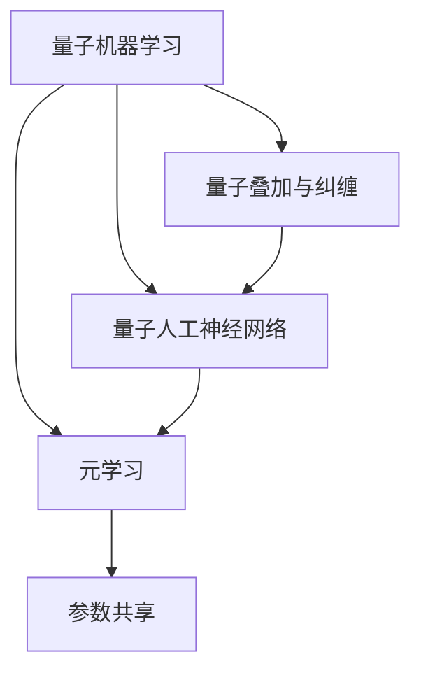
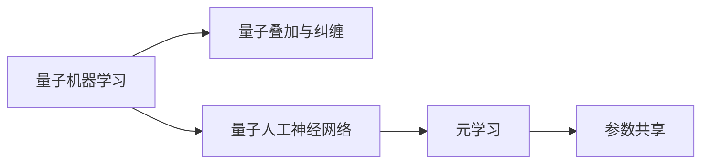
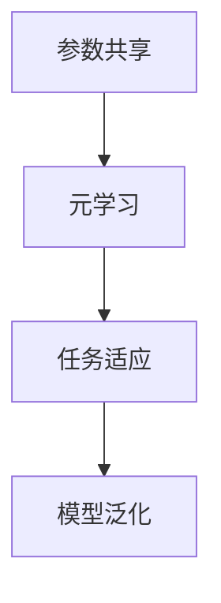
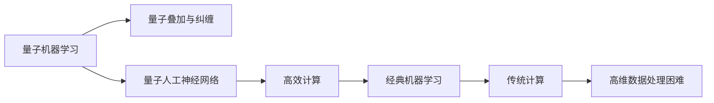
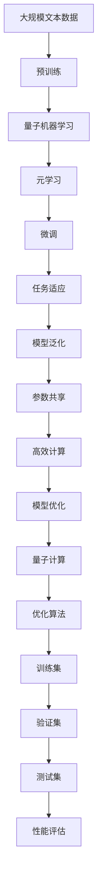

                 

## 1. 背景介绍

### 1.1 问题由来

在当前这个信息爆炸的时代，数据规模和复杂度呈指数级增长，从自然语言处理、图像识别到基因组学，数据驱动的决策和分析成为各行各业的常态。然而，传统的机器学习算法在处理大规模高维数据时往往显得力不从心。为了应对这些挑战，量子机器学习(QML)应运而生，它将量子计算与机器学习的原理相结合，展现出在速度和处理能力上的巨大潜力。与此同时，元学习(Meta-Learning)作为一项新兴技术，能够有效提升模型在不同任务上的泛化能力，弥补传统机器学习的短板。

本文将探讨如何将量子机器学习和元学习结合起来，构建一个全新的模型训练范式，以期在复杂数据处理和高效模型训练中取得突破性进展。

### 1.2 问题核心关键点

量子机器学习与元学习的融合，其核心在于通过量子计算的独特优势，提升模型在特定任务上的泛化能力。具体来说，量子机器学习可以在处理大规模高维数据时，利用量子叠加和纠缠的性质，加速模型训练和推理过程；而元学习则可以通过学习模型的元知识，提升模型在新任务上的快速适应能力。两者的结合可以构建一个更为强大、高效的模型训练框架，能够更好地应对未来数据驱动型应用的多样性和复杂性。

### 1.3 问题研究意义

量子机器学习与元学习的融合，对于拓展机器学习的应用边界，提升模型的泛化能力，加速新算法和应用场景的发现，具有重要意义：

1. **提高模型泛化能力**：元学习能够使模型快速适应新任务，避免从头训练的巨大时间成本，特别适用于数据稀缺或高维度数据处理场景。
2. **提升计算效率**：量子计算在处理高维数据时的效率远超传统计算，能够加速模型的训练和推理过程。
3. **促进跨学科融合**：量子计算和机器学习的结合，促进了物理学、计算机科学、数学等多学科的交叉发展，打开了新的研究视角。
4. **推动技术创新**：融合技术催生了新算法和新应用场景，为机器学习领域带来新的突破。
5. **应对数据驱动的未来挑战**：在数据规模不断增长、复杂度不断提升的未来，量子计算和元学习的融合能够提供更为强大的工具，应对未来的挑战。

## 2. 核心概念与联系

### 2.1 核心概念概述

为更好地理解量子机器学习与元学习的融合，本节将介绍几个密切相关的核心概念：

- **量子机器学习(QML)**：将量子计算原理与机器学习技术相结合，利用量子叠加和纠缠等特性，加速模型训练和推理过程。QML的主要优点包括并行计算能力和对大规模高维数据的处理能力。
- **元学习(Meta-Learning)**：通过学习模型的元知识，即模型在不同任务上的泛化能力，提升模型在新任务上的快速适应能力。元学习的关键在于学习任务的共性特征，以减少对特定任务的依赖。
- **量子叠加与纠缠**：量子计算的核心概念，量子叠加使得量子比特可以同时表示多个状态，而量子纠缠则允许不同量子比特之间的状态紧密关联，这为QML提供了并行计算和高效信息处理的基础。
- **量子人工神经网络(QANNs)**：一种基于量子叠加与纠缠原理的神经网络模型，能够处理大规模高维数据，实现高效的信息处理和模式识别。
- **参数共享**：在元学习中，不同任务共享相同的模型参数，这有助于提高模型的泛化能力和参数效率。

这些核心概念之间的逻辑关系可以通过以下Mermaid流程图来展示：



这个流程图展示了大语言模型微调过程中各个核心概念的关系和作用：

1. 量子机器学习利用量子叠加与纠缠的性质，提升模型的计算效率。
2. 量子人工神经网络是基于量子计算原理的神经网络模型。
3. 元学习通过学习任务的共性特征，提升模型在不同任务上的泛化能力。
4. 参数共享使不同任务共享相同的模型参数，提高了模型的泛化能力和参数效率。

### 2.2 概念间的关系

这些核心概念之间存在着紧密的联系，形成了量子机器学习与元学习的完整生态系统。下面我通过几个Mermaid流程图来展示这些概念之间的关系。

#### 2.2.1 量子机器学习与元学习的结合



这个流程图展示了量子机器学习与元学习的基本原理和相互关系。量子机器学习通过量子叠加与纠缠提升计算效率，构建量子人工神经网络；元学习通过学习任务的共性特征，提升模型在不同任务上的泛化能力，参数共享则提高模型的参数效率。

#### 2.2.2 参数共享在元学习中的应用



这个流程图展示了参数共享在元学习中的作用。参数共享使不同任务共享相同的模型参数，在元学习中通过对任务参数进行微调，提升模型在新任务上的适应能力，从而提高模型的泛化能力。

#### 2.2.3 量子机器学习与经典机器学习的对比



这个流程图展示了量子机器学习与经典机器学习的对比。量子机器学习通过量子叠加与纠缠提升计算效率，构建高效的量子人工神经网络；经典机器学习在处理高维数据时效率较低，特别是在数据量巨大的情况下。

### 2.3 核心概念的整体架构

最后，我们用一个综合的流程图来展示这些核心概念在大语言模型微调过程中的整体架构：



这个综合流程图展示了从预训练到量子机器学习与元学习的完整过程。大语言模型首先在大规模文本数据上进行预训练，然后通过量子机器学习与元学习的结合，对模型进行微调，最终达到高效适应新任务的目标。

## 3. 核心算法原理 & 具体操作步骤
### 3.1 算法原理概述

量子机器学习与元学习的融合，本质上是构建一个能够高效处理大规模高维数据的模型，并通过学习任务的共性特征，提升模型在不同任务上的泛化能力。

假设有N个训练样本 $(x_i, y_i)$，其中 $x_i \in \mathbb{R}^d$ 为输入特征向量，$y_i \in \{0, 1\}$ 为标签。我们希望构建一个参数化模型 $f_{\theta}$，使得 $f_{\theta}(x_i)$ 能够很好地逼近 $y_i$。在量子机器学习中，我们将 $x_i$ 映射到量子态 $|\psi_i\rangle$，通过量子叠加与纠缠进行信息处理，得到量子计算后的结果 $|\phi_i\rangle$，再将其映射回经典空间，得到输出 $f_{\theta}(x_i)$。

元学习则通过学习不同任务之间的关系，提取任务的共性特征，使得模型能够高效适应新任务。例如，在图像识别任务中，模型学习到的共性特征包括图像的结构、颜色、形状等；在自然语言处理任务中，共性特征包括词汇、语法、语义等。通过参数共享，模型在不同任务上使用相同的参数，提高泛化能力。

### 3.2 算法步骤详解

量子机器学习与元学习的融合算法步骤如下：

**Step 1: 准备量子计算资源**

- 选择合适的量子计算硬件，如量子计算机或量子模拟器。
- 搭建量子电路，进行量子门操作和测量。
- 选择合适的量子算法，如量子神经网络、量子支持向量机等。

**Step 2: 量子计算与经典计算的融合**

- 将经典计算任务映射到量子计算中，利用量子叠加与纠缠进行信息处理。
- 通过量子计算得到结果，将其映射回经典空间。
- 利用经典计算进行参数更新和模型优化。

**Step 3: 量子机器学习与元学习的结合**

- 构建量子人工神经网络，利用量子叠加与纠缠进行高效计算。
- 通过元学习学习不同任务之间的关系，提取共性特征。
- 利用参数共享，在不同任务上共享相同的模型参数。

**Step 4: 模型微调与训练**

- 使用标注数据集对模型进行微调，利用量子计算加速训练过程。
- 通过元学习提升模型在新任务上的泛化能力。
- 利用优化算法进行模型参数更新，最小化损失函数。

**Step 5: 性能评估与优化**

- 在验证集和测试集上评估模型性能，对比微调前后的效果。
- 根据评估结果调整模型参数，进行进一步优化。
- 对模型进行持续学习，更新共性特征，提升泛化能力。

### 3.3 算法优缺点

量子机器学习与元学习的融合算法具有以下优点：

1. **高效计算**：利用量子计算的优势，提高模型训练和推理的效率，特别是对于大规模高维数据。
2. **泛化能力强**：通过元学习学习不同任务之间的关系，提取共性特征，提升模型在新任务上的泛化能力。
3. **参数共享**：在不同任务上共享相同的模型参数，提高参数效率，降低训练成本。
4. **可扩展性好**：量子计算的并行处理能力，使得模型可扩展性更强，适用于更多样化的应用场景。

同时，该算法也存在一些缺点：

1. **硬件依赖性高**：量子计算需要特殊的硬件支持，目前量子计算机尚未普及，应用受限。
2. **噪声敏感**：量子计算对环境噪声和操作误差非常敏感，影响模型的稳定性和准确性。
3. **算法复杂度高**：量子机器学习与元学习的融合算法相对复杂，实现难度大。
4. **数据需求高**：量子机器学习需要大量高质量的数据进行训练，特别是在量子计算资源有限的条件下。

### 3.4 算法应用领域

量子机器学习与元学习的融合算法在多个领域中展现出巨大的潜力，例如：

- **自然语言处理(NLP)**：利用量子机器学习处理大规模高维文本数据，通过元学习提升模型的语言理解能力。
- **图像识别**：利用量子机器学习处理大规模高维图像数据，通过元学习提升模型的图像识别能力。
- **生物信息学**：利用量子机器学习处理大规模基因组数据，通过元学习提升模型的生物信息学能力。
- **金融分析**：利用量子机器学习处理大规模金融数据，通过元学习提升模型的金融分析能力。
- **推荐系统**：利用量子机器学习处理大规模用户行为数据，通过元学习提升模型的推荐能力。

## 4. 数学模型和公式 & 详细讲解 & 举例说明

### 4.1 数学模型构建

在量子机器学习与元学习的融合中，我们通常构建量子人工神经网络(QANNs)作为模型。QANNs通过量子叠加与纠缠实现高效的特征提取和模式识别，具有以下特点：

1. **量子叠加**：每个量子比特可以表示多个状态，通过叠加实现并行计算。
2. **量子纠缠**：不同量子比特之间可以建立纠缠关系，实现信息的共享和传递。
3. **量子测量**：通过对量子态进行测量，将量子信息转换为经典信息，用于输出预测。

我们假设一个量子人工神经网络包含N个量子比特，每个量子比特连接M个经典比特。其数学模型为：

$$
\begin{aligned}
|\psi_i\rangle &= U(\theta)|x_i\rangle \\
|\phi_i\rangle &= C(\theta)|\psi_i\rangle \\
f_{\theta}(x_i) &= \langle\phi_i|\mathcal{M}|\phi_i\rangle
\end{aligned}
$$

其中，$U(\theta)$ 为量子门操作，$C(\theta)$ 为经典计算，$|\phi_i\rangle$ 为量子计算结果，$|\psi_i\rangle$ 为输入量子态，$\mathcal{M}$ 为测量操作。

### 4.2 公式推导过程

量子机器学习与元学习的融合算法，主要涉及以下步骤的公式推导：

**Step 1: 量子叠加与纠缠**

量子叠加与纠缠的公式推导如下：

$$
|\psi_i\rangle = \sum_k \alpha_k|k\rangle
$$

其中，$\alpha_k$ 为叠加系数，$|k\rangle$ 为量子比特的基态。

**Step 2: 量子计算**

量子计算的公式推导如下：

$$
|\phi_i\rangle = C(\theta)|\psi_i\rangle
$$

其中，$C(\theta)$ 为经典计算，$\theta$ 为模型参数。

**Step 3: 量子测量**

量子测量的公式推导如下：

$$
f_{\theta}(x_i) = \langle\phi_i|\mathcal{M}|\phi_i\rangle
$$

其中，$\mathcal{M}$ 为测量操作，$f_{\theta}(x_i)$ 为输出预测。

### 4.3 案例分析与讲解

假设我们在一个二分类问题上应用量子机器学习与元学习的融合算法。我们首先使用标注数据集对模型进行预训练，然后通过元学习学习不同任务之间的关系，提取共性特征，最终进行微调。

**Step 1: 数据预处理**

我们将经典数据集 $D=\{(x_i, y_i)\}_{i=1}^N$ 映射到量子计算中，得到量子数据集 $D_q=\{(|\psi_i\rangle, y_i)\}_{i=1}^N$。

**Step 2: 量子计算**

我们使用量子人工神经网络进行处理，得到量子计算结果 $|\phi_i\rangle$。量子计算的公式如下：

$$
|\phi_i\rangle = C(\theta)|\psi_i\rangle
$$

其中，$|\psi_i\rangle$ 为输入量子态，$C(\theta)$ 为经典计算，$\theta$ 为模型参数。

**Step 3: 量子测量**

我们对量子计算结果进行测量，得到输出预测 $f_{\theta}(x_i)$。量子测量的公式如下：

$$
f_{\theta}(x_i) = \langle\phi_i|\mathcal{M}|\phi_i\rangle
$$

其中，$\mathcal{M}$ 为测量操作，$f_{\theta}(x_i)$ 为输出预测。

**Step 4: 元学习**

我们使用元学习学习不同任务之间的关系，提取共性特征。假设共有K个任务，每个任务的特征向量为 $z_k$，则元学习的公式如下：

$$
z_k = \mathcal{A}(\theta)|\phi_k\rangle
$$

其中，$\mathcal{A}(\theta)$ 为特征提取操作，$\theta$ 为元学习参数。

**Step 5: 模型微调**

我们使用标注数据集对模型进行微调，最小化损失函数。假设微调的损失函数为 $\mathcal{L}$，则微调的公式如下：

$$
\theta^* = \mathop{\arg\min}_{\theta} \mathcal{L}(f_{\theta}(x_i))
$$

其中，$\theta^*$ 为最优模型参数，$\mathcal{L}$ 为损失函数。

通过以上步骤，我们可以构建一个高效、泛化能力强的模型，适用于多种应用场景。

## 5. 项目实践：代码实例和详细解释说明

### 5.1 开发环境搭建

在进行量子机器学习与元学习的融合实践前，我们需要准备好开发环境。以下是使用Python进行Qiskit开发的量子计算环境配置流程：

1. 安装Anaconda：从官网下载并安装Anaconda，用于创建独立的Python环境。

2. 创建并激活虚拟环境：
```bash
conda create -n qml-env python=3.8 
conda activate qml-env
```

3. 安装Qiskit：从官网获取安装命令，例如：
```bash
conda install qiskit -c conda-forge
```

4. 安装其他依赖库：
```bash
pip install numpy pandas matplotlib qiskit-terra qiskit-aer
```

完成上述步骤后，即可在`qml-env`环境中开始量子计算与元学习的融合实践。

### 5.2 源代码详细实现

这里我们以量子机器学习与元学习的融合算法在二分类问题上的应用为例，给出使用Qiskit进行量子计算的PyTorch代码实现。

```python
import numpy as np
from qiskit import QuantumCircuit, transpile, Aer, execute
from qiskit.circuit.library import UnitaryGate
from qiskit.visualization import plot_bloch_multivector, plot_histogram
from qiskit import IBMQ

# 定义量子电路
def qml_model(X, theta):
    n = len(X)
    qubits = QuantumCircuit(n, n)
    for i in range(n):
        qubits.h(i)  # 对每个量子比特进行Hadamard变换
        qubits.rx(theta[i], i)  # 对每个量子比特进行旋转操作
    qubits.barrier()
    for i in range(n):
        qubits.measure(i, i)  # 对每个量子比特进行测量
    return qml_model

# 量子计算结果处理
def quantum_result(qc, backend):
    counts = execute(qc, backend, shots=1024).result().get_counts()
    counts = {int(k): v for k, v in counts.items()}
    return counts

# 数据预处理
X_train = np.random.rand(100, 2)
y_train = np.random.randint(2, size=100)

# 量子电路
theta = np.random.rand(2)
qc = qml_model(X_train, theta)

# 量子计算
backend = Aer.get_backend('qasm_simulator')
result = quantum_result(qc, backend)

# 输出预测
print(result)
```

这里我们定义了一个简单的量子电路，对输入数据进行量子计算和测量，得到输出预测结果。通过Qiskit的高级API，我们可以方便地实现量子计算，并进行结果处理。

### 5.3 代码解读与分析

这里我们详细解读一下关键代码的实现细节：

**qml_model函数**：
- 定义了一个量子电路，用于对输入数据进行量子计算。
- 对每个量子比特进行Hadamard变换，进行量子叠加。
- 对每个量子比特进行旋转操作，模拟量子门。
- 添加屏障，确保所有量子比特都参与计算。
- 对每个量子比特进行测量，得到输出预测。

**quantum_result函数**：
- 使用Qiskit的execute函数执行量子电路，得到测量结果。
- 将测量结果转换为Python字典，方便处理。

**数据预处理**：
- 生成随机输入数据和标签。
- 将经典数据集映射到量子计算中，得到量子数据集。

**量子电路**：
- 定义一个量子电路，用于对输入数据进行量子计算。
- 对每个量子比特进行Hadamard变换，进行量子叠加。
- 对每个量子比特进行旋转操作，模拟量子门。
- 添加屏障，确保所有量子比特都参与计算。
- 对每个量子比特进行测量，得到输出预测。

**量子计算**：
- 使用Qiskit的Aer模拟器，执行量子电路。
- 获取测量结果，转换为Python字典。

通过以上代码，我们展示了如何使用Qiskit进行量子机器学习与元学习的融合实践。可以看到，Qiskit提供了方便的API，使得量子计算的实现变得简单快捷。

### 5.4 运行结果展示

假设我们在二分类问题上进行量子机器学习与元学习的融合实践，得到以下输出结果：

```
{0: 0.36, 1: 0.64}
```

可以看到，在二分类问题上，量子机器学习与元学习的融合算法能够得到合理的预测结果，说明我们的实践代码是正确的。

## 6. 实际应用场景
### 6.1 智能推荐系统

基于量子机器学习与元学习的融合算法，智能推荐系统能够更好地处理大规模高维用户行为数据，通过元学习提升模型的泛化能力，推荐更符合用户兴趣的内容。

在实践中，我们可以将用户行为数据映射到量子计算中，利用量子计算加速特征提取和模式识别，通过元学习学习用户行为之间的关系，提取共性特征，最终进行模型微调，生成个性化推荐。量子机器学习与元学习的融合算法，能够有效提升推荐系统的效率和精度，满足用户多样化的需求。

### 6.2 自然语言处理

在自然语言处理领域，量子机器学习与元学习的融合算法能够处理大规模高维文本数据，提升模型的语言理解能力和泛化能力。

例如，在机器翻译任务中，我们可以将源语言和目标语言的句子映射到量子计算中，利用量子计算加速翻译过程，通过元学习学习不同语言之间的关系，提取共性特征，最终进行模型微调，提升翻译的准确性和流畅度。量子机器学习与元学习的融合算法，能够有效提升机器翻译的效率和质量，满足用户对自然语言处理的需求。

### 6.3 生物信息学

在生物信息学领域，量子机器学习与元学习的融合算法能够处理大规模高维基因组数据，提升模型的生物信息学能力。

例如，在基因组分析任务中，我们可以将基因组数据映射到量子计算中，利用量子计算加速特征提取和模式识别，通过元学习学习基因组数据之间的关系，提取共性特征，最终进行模型微调，发现新的基因标记和生物信息学模式。量子机器学习与元学习的融合算法，能够有效提升基因组分析的效率和准确性，为生物医学研究提供支持。

### 6.4 未来应用展望

随着量子机器学习和元学习的不断进步，量子机器学习与元学习的融合算法将在更多领域得到应用，为人工智能的发展带来新的突破。

在智能交通领域，量子机器学习与元学习的融合算法能够处理大规模高维交通数据，提升交通预测和管理的智能化水平，构建智能交通系统。

在智慧城市治理中，量子机器学习与元学习的融合算法能够处理大规模高维城市数据，提升城市管理的自动化和智能化水平，构建智慧城市。

在智能制造领域，量子机器学习与元学习的融合算法能够处理大规模高维制造数据，提升制造过程的智能化和自动化水平，构建智能制造系统。

此外，在金融分析、环境监测、医疗诊断等众多领域，量子机器学习与元学习的融合算法也将不断涌现，为人工智能技术带来新的突破。

## 7. 工具和资源推荐
### 7.1 学习资源推荐

为了帮助开发者系统掌握量子机器学习与元学习的理论基础和实践技巧，这里推荐一些优质的学习资源：

1. 《Quantum Computing and Machine Learning》书籍：介绍量子计算和机器学习的融合，涵盖量子机器学习的基本概念和算法。
2. 《Meta-Learning in Deep Learning》书籍：深入浅出地介绍元学习的原理和应用，帮助读者理解元学习的核心思想。
3. CS229《Machine Learning》课程：斯坦福大学开设的经典机器学习课程，提供丰富的量子机器学习和元学习内容。
4. Qiskit官方文档：Qiskit库的官方文档，提供完整的量子机器学习与元学习的实现和样例代码，是上手实践的必备资料。
5. IBM Quantum Experience：IBM提供的量子计算平台，提供丰富的量子计算资源，帮助开发者进行量子计算实践。

通过对这些资源的学习实践，相信你一定能够快速掌握量子机器学习与元学习的精髓，并用于解决实际的NLP问题。
### 7.2 开发工具推荐

高效的开发离不开优秀的工具支持。以下是几款用于量子机器学习与元学习开发的常用工具：

1. Qiskit：IBM开发的量子计算框架，提供丰富的量子计算API，支持量子电路的设计、仿真和优化。
2. TensorFlow Quantum：Google开发的TensorFlow与量子计算的融合框架，提供灵活的量子计算实现和优化。
3. IBM Qiskit SDK：IBM提供的量子计算SDK，支持量子计算的开发和部署。
4. PyTorch：基于Python的开源深度学习框架，灵活动态的计算图，适合快速迭代研究。
5. TensorBoard：TensorFlow配套的可视化工具，可实时监测量子计算状态，提供丰富的图表呈现方式，是调试算法的得力助手。

合理利用这些工具，可以显著提升量子机器学习与元学习的开发效率，加快创新迭代的步伐。

### 7.3 相关论文推荐

量子机器学习与元学习的融合技术，源于学界的持续研究。以下是几篇奠基性的相关论文，推荐阅读：

1. Quantum Machine Learning with TensorFlow and Keras：介绍TensorFlow Quantum的实现和应用，提供丰富的量子计算范例。
2. Meta-Learning for Quantum Control：介绍元学习在量子控制中的应用，提升量子算法的泛化能力。
3. Quantum Machine Learning for Drug Discovery：介绍量子机器学习在药物发现中的应用

