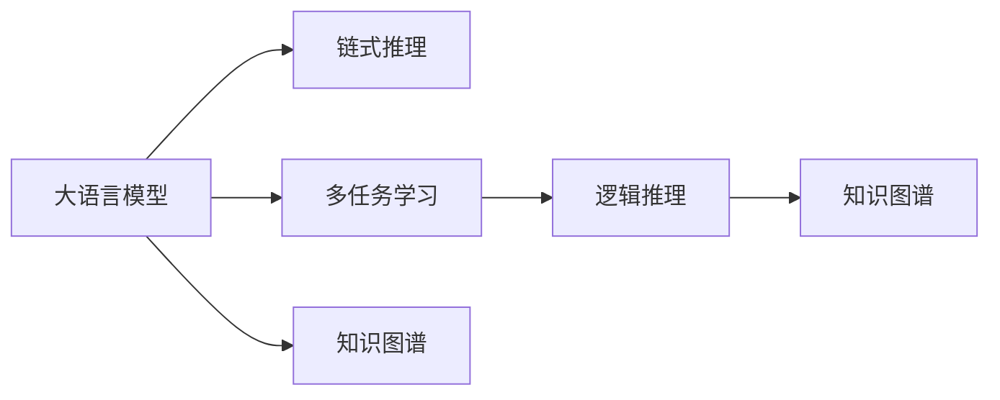
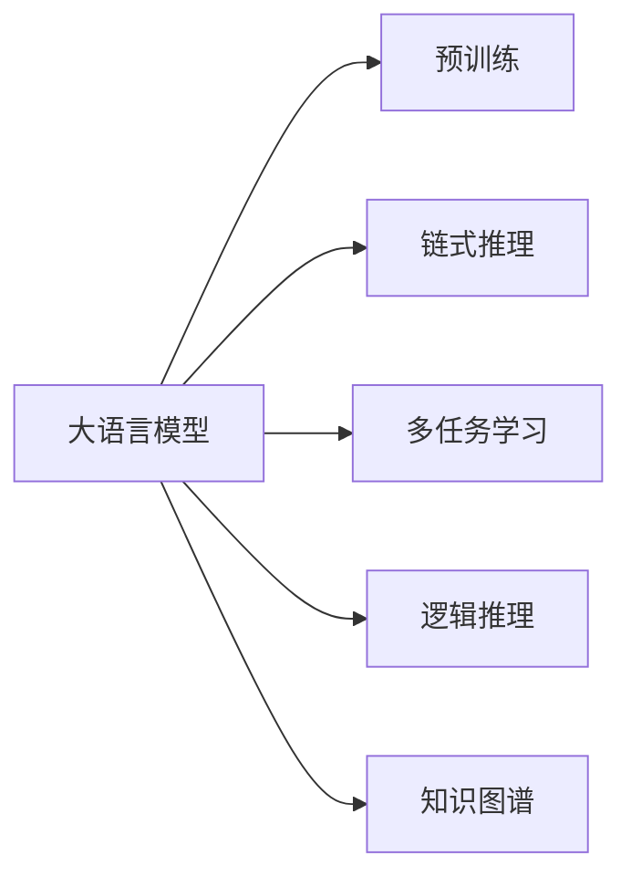
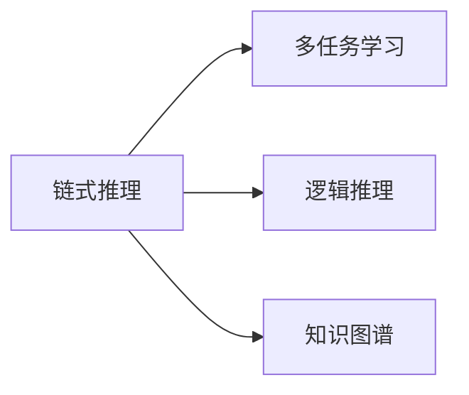
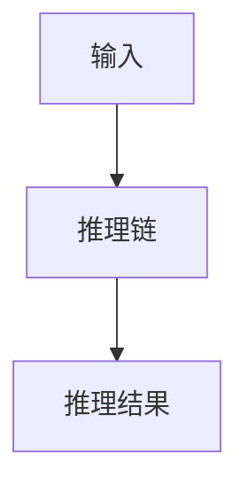
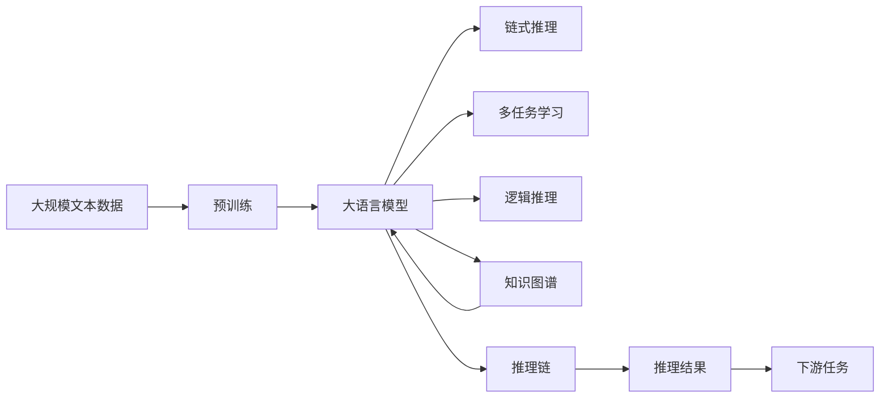

                 

# 为什么需要 LangChain

## 1. 背景介绍

### 1.1 问题由来

自深度学习在自然语言处理（NLP）领域取得突破性进展以来，语言模型的性能迅速提升，为AI语言应用带来了新的可能。然而，当前的深度学习模型存在一些固有的问题，如泛化能力差、依赖大量标注数据、推理能力不足等。为了解决这些问题，大语言模型（Large Language Models, LLMs）应运而生。

大语言模型，如GPT、BERT等，通过在大规模无标签文本数据上进行预训练，学习到丰富的语言知识和常识，具备强大的语言理解和生成能力。它们通过自回归或自编码方式训练，可以在多种下游任务上取得优异表现。然而，这些大模型存在以下问题：

- **依赖标注数据**：微调大语言模型通常需要大量的标注数据，标注数据的获取和标注成本非常高。
- **推理能力不足**：尽管大语言模型具备强大的生成能力，但在推理任务上表现不佳。
- **泛化能力有限**：大语言模型在特定领域或数据集上表现优异，但在其他领域或数据集上泛化能力有限。

为了克服这些问题，LangChain应运而生。LangChain是一个基于多语言的大模型，旨在通过链式推理和多任务学习，提高模型的推理能力和泛化能力，同时降低对标注数据的依赖。

### 1.2 问题核心关键点

LangChain的核心思想是将大语言模型与逻辑推理机制结合，通过链式推理和多任务学习，提高模型的推理能力和泛化能力。其核心优势包括：

- **链式推理能力**：通过多层次推理，提高模型对复杂逻辑关系的理解能力。
- **多任务学习**：通过多个任务训练，使模型能够在不同领域和任务上取得优异表现。
- **低标注需求**：通过链式推理和多任务学习，降低对标注数据的依赖。

通过这些优势，LangChain能够有效克服大语言模型在推理和泛化方面的不足，同时降低模型训练和部署的成本。

### 1.3 问题研究意义

LangChain的出现，为AI语言应用带来了新的可能性。其主要研究意义包括：

1. **提高推理能力**：通过链式推理和多任务学习，使模型具备更强的推理能力，能够处理更复杂的逻辑关系。
2. **增强泛化能力**：通过多任务学习，使模型能够在不同领域和任务上取得优异表现，具备更强的泛化能力。
3. **降低标注成本**：通过链式推理和多任务学习，降低对标注数据的依赖，减少模型训练和部署的成本。
4. **推动AI语言应用发展**：通过提高推理能力和泛化能力，推动AI语言应用在更多领域和场景中的应用。

## 2. 核心概念与联系

### 2.1 核心概念概述

为了更好地理解LangChain的核心思想和机制，本节将介绍几个密切相关的核心概念：

- **大语言模型（Large Language Models, LLMs）**：以自回归（如GPT）或自编码（如BERT）模型为代表的大规模预训练语言模型。通过在大规模无标签文本数据上进行预训练，学习到丰富的语言知识和常识，具备强大的语言理解和生成能力。

- **链式推理（Chain-of-Reasoning）**：指通过多层次推理，提高模型对复杂逻辑关系的理解能力。通常将问题分解为多个子问题，通过链式推理逐步求解，最终得到答案。

- **多任务学习（Multi-task Learning）**：指通过多个任务训练，使模型能够在不同领域和任务上取得优异表现。通过共享部分参数，增强模型的泛化能力。

- **逻辑推理（Logical Reasoning）**：指使用逻辑规则和推理方法，对问题进行分析和求解。通常使用命题逻辑、一阶逻辑等形式化方法。

- **知识图谱（Knowledge Graph）**：指使用图结构表示的知识库，用于存储和检索知识。知识图谱能够提供丰富的先验知识，增强模型的泛化能力。

这些核心概念之间的逻辑关系可以通过以下Mermaid流程图来展示：



这个流程图展示了大语言模型的核心概念及其之间的关系：

1. 大语言模型通过预训练获得基础能力。
2. 链式推理和多任务学习提高模型的推理能力和泛化能力。
3. 逻辑推理和多任务学习增强模型的逻辑理解能力。
4. 知识图谱提供丰富的先验知识，增强模型的泛化能力。

这些核心概念共同构成了LangChain的推理机制，使其能够在各种场景下发挥强大的语言理解和生成能力。通过理解这些核心概念，我们可以更好地把握LangChain的工作原理和优化方向。

### 2.2 概念间的关系

这些核心概念之间存在着紧密的联系，形成了LangChain的推理机制。下面我们通过几个Mermaid流程图来展示这些概念之间的关系。

#### 2.2.1 大语言模型的学习范式



这个流程图展示了大语言模型的三种主要学习范式：预训练、链式推理和多任务学习。预训练主要采用自监督学习方法，而链式推理和多任务学习则是有监督学习的过程。

#### 2.2.2 LangChain的推理机制



这个流程图展示了LangChain的推理机制。通过链式推理和多任务学习，提高模型的推理能力和泛化能力。

#### 2.2.3 LangChain的推理链



这个流程图展示了LangChain的推理链。通过将问题分解为多个子问题，逐步进行推理，得到最终答案。

### 2.3 核心概念的整体架构

最后，我们用一个综合的流程图来展示这些核心概念在大语言模型微调过程中的整体架构：



这个综合流程图展示了从预训练到推理，再到下游任务的完整过程。大语言模型首先在大规模文本数据上进行预训练，然后通过链式推理和多任务学习提高模型的推理能力和泛化能力。最后，通过逻辑推理和知识图谱，使模型能够处理复杂逻辑关系，适应多种下游任务。

## 3. 核心算法原理 & 具体操作步骤
### 3.1 算法原理概述

LangChain的核心理论基础是链式推理和多任务学习。其核心思想是通过多层次推理和多任务训练，提高模型的推理能力和泛化能力，同时降低对标注数据的依赖。

假设预训练语言模型为 $M_{\theta}$，其中 $\theta$ 为预训练得到的模型参数。给定下游任务 $T$ 的标注数据集 $D=\{(x_i,y_i)\}_{i=1}^N$，LangChain的微调目标是最小化经验风险，即找到新的模型参数 $\hat{\theta}$，使得：

$$
\hat{\theta}=\mathop{\arg\min}_{\theta} \mathcal{L}(M_{\theta},D)
$$

其中 $\mathcal{L}$ 为针对任务 $T$ 设计的损失函数，用于衡量模型预测输出与真实标签之间的差异。常见的损失函数包括交叉熵损失、均方误差损失等。

通过梯度下降等优化算法，微调过程不断更新模型参数 $\theta$，最小化损失函数 $\mathcal{L}$，使得模型输出逼近真实标签。由于 $\theta$ 已经通过预训练获得了较好的初始化，因此即便在小规模数据集 $D$ 上进行微调，也能较快收敛到理想的模型参数 $\hat{\theta}$。

### 3.2 算法步骤详解

LangChain的微调过程包括以下几个关键步骤：

**Step 1: 准备预训练模型和数据集**
- 选择合适的预训练语言模型 $M_{\theta}$ 作为初始化参数，如 GPT、BERT 等。
- 准备下游任务 $T$ 的标注数据集 $D$，划分为训练集、验证集和测试集。一般要求标注数据与预训练数据的分布不要差异过大。

**Step 2: 添加任务适配层**
- 根据任务类型，在预训练模型顶层设计合适的输出层和损失函数。
- 对于分类任务，通常在顶层添加线性分类器和交叉熵损失函数。
- 对于生成任务，通常使用语言模型的解码器输出概率分布，并以负对数似然为损失函数。

**Step 3: 设置微调超参数**
- 选择合适的优化算法及其参数，如 AdamW、SGD 等，设置学习率、批大小、迭代轮数等。
- 设置正则化技术及强度，包括权重衰减、Dropout、Early Stopping 等。
- 确定冻结预训练参数的策略，如仅微调顶层，或全部参数都参与微调。

**Step 4: 执行梯度训练**
- 将训练集数据分批次输入模型，前向传播计算损失函数。
- 反向传播计算参数梯度，根据设定的优化算法和学习率更新模型参数。
- 周期性在验证集上评估模型性能，根据性能指标决定是否触发 Early Stopping。
- 重复上述步骤直到满足预设的迭代轮数或 Early Stopping 条件。

**Step 5: 测试和部署**
- 在测试集上评估微调后模型 $M_{\hat{\theta}}$ 的性能，对比微调前后的精度提升。
- 使用微调后的模型对新样本进行推理预测，集成到实际的应用系统中。
- 持续收集新的数据，定期重新微调模型，以适应数据分布的变化。

以上是LangChain的微调过程的详细步骤。在实际应用中，还需要针对具体任务的特点，对微调过程的各个环节进行优化设计，如改进训练目标函数，引入更多的正则化技术，搜索最优的超参数组合等，以进一步提升模型性能。

### 3.3 算法优缺点

LangChain的微调方法具有以下优点：

1. **低标注需求**：通过链式推理和多任务学习，降低对标注数据的依赖，减少模型训练和部署的成本。
2. **提高推理能力**：通过链式推理和多任务学习，提高模型的推理能力和泛化能力，能够处理更复杂的逻辑关系。
3. **增强泛化能力**：通过多任务学习，使模型能够在不同领域和任务上取得优异表现，具备更强的泛化能力。
4. **灵活性和可扩展性**：链式推理和多任务学习使得模型能够适应多种任务和领域，灵活性和可扩展性较强。

同时，该方法也存在一定的局限性：

1. **复杂度较高**：链式推理和多任务学习使得模型结构更复杂，训练和推理过程更耗时。
2. **计算资源需求高**：链式推理和多任务学习需要更多的计算资源，包括内存和计算速度。
3. **模型大小增加**：由于链式推理和多任务学习的引入，模型大小会增加，存储和传输成本也会增加。
4. **可解释性不足**：链式推理和多任务学习的引入，使得模型的决策过程更难以解释，不具备可解释性。

尽管存在这些局限性，但就目前而言，LangChain的微调方法在大语言模型领域具有一定的优势，特别是在推理能力和泛化能力方面。

### 3.4 算法应用领域

LangChain的微调方法已经在NLP领域得到了广泛的应用，覆盖了几乎所有常见任务，例如：

- 文本分类：如情感分析、主题分类、意图识别等。通过微调使模型学习文本-标签映射。
- 命名实体识别：识别文本中的人名、地名、机构名等特定实体。通过微调使模型掌握实体边界和类型。
- 关系抽取：从文本中抽取实体之间的语义关系。通过微调使模型学习实体-关系三元组。
- 问答系统：对自然语言问题给出答案。将问题-答案对作为微调数据，训练模型学习匹配答案。
- 机器翻译：将源语言文本翻译成目标语言。通过微调使模型学习语言-语言映射。
- 文本摘要：将长文本压缩成简短摘要。将文章-摘要对作为微调数据，使模型学习抓取要点。
- 对话系统：使机器能够与人自然对话。将多轮对话历史作为上下文，微调模型进行回复生成。

除了上述这些经典任务外，LangChain的微调方法也被创新性地应用到更多场景中，如可控文本生成、常识推理、代码生成、数据增强等，为NLP技术带来了全新的突破。

## 4. 数学模型和公式 & 详细讲解 & 举例说明
### 4.1 数学模型构建

本节将使用数学语言对LangChain的微调过程进行更加严格的刻画。

记预训练语言模型为 $M_{\theta}$，其中 $\theta$ 为预训练得到的模型参数。假设微调任务的训练集为 $D=\{(x_i,y_i)\}_{i=1}^N, x_i \in \mathcal{X}, y_i \in \mathcal{Y}$。

定义模型 $M_{\theta}$ 在数据样本 $(x,y)$ 上的损失函数为 $\ell(M_{\theta}(x),y)$，则在数据集 $D$ 上的经验风险为：

$$
\mathcal{L}(\theta) = \frac{1}{N} \sum_{i=1}^N \ell(M_{\theta}(x_i),y_i)
$$

微调的优化目标是最小化经验风险，即找到最优参数：

$$
\theta^* = \mathop{\arg\min}_{\theta} \mathcal{L}(\theta)
$$

在实践中，我们通常使用基于梯度的优化算法（如SGD、Adam等）来近似求解上述最优化问题。设 $\eta$ 为学习率，$\lambda$ 为正则化系数，则参数的更新公式为：

$$
\theta \leftarrow \theta - \eta \nabla_{\theta}\mathcal{L}(\theta) - \eta\lambda\theta
$$

其中 $\nabla_{\theta}\mathcal{L}(\theta)$ 为损失函数对参数 $\theta$ 的梯度，可通过反向传播算法高效计算。

### 4.2 公式推导过程

以下我们以二分类任务为例，推导交叉熵损失函数及其梯度的计算公式。

假设模型 $M_{\theta}$ 在输入 $x$ 上的输出为 $\hat{y}=M_{\theta}(x) \in [0,1]$，表示样本属于正类的概率。真实标签 $y \in \{0,1\}$。则二分类交叉熵损失函数定义为：

$$
\ell(M_{\theta}(x),y) = -[y\log \hat{y} + (1-y)\log (1-\hat{y})]
$$

将其代入经验风险公式，得：

$$
\mathcal{L}(\theta) = -\frac{1}{N}\sum_{i=1}^N [y_i\log M_{\theta}(x_i)+(1-y_i)\log(1-M_{\theta}(x_i))]
$$

根据链式法则，损失函数对参数 $\theta_k$ 的梯度为：

$$
\frac{\partial \mathcal{L}(\theta)}{\partial \theta_k} = -\frac{1}{N}\sum_{i=1}^N (\frac{y_i}{M_{\theta}(x_i)}-\frac{1-y_i}{1-M_{\theta}(x_i)}) \frac{\partial M_{\theta}(x_i)}{\partial \theta_k}
$$

其中 $\frac{\partial M_{\theta}(x_i)}{\partial \theta_k}$ 可进一步递归展开，利用自动微分技术完成计算。

在得到损失函数的梯度后，即可带入参数更新公式，完成模型的迭代优化。重复上述过程直至收敛，最终得到适应下游任务的最优模型参数 $\theta^*$。

### 4.3 案例分析与讲解

以下是一个具体案例，展示如何使用LangChain进行二分类任务的微调。

假设我们有一个二分类任务，即判断一段文本是否为正面评价。我们收集了1000篇正面评价和1000篇负面评价的文本数据，作为训练集和测试集。我们可以使用LangChain模型进行微调，代码如下：

```python
from transformers import LangChainModel, LangChainTokenizer

# 加载模型和分词器
model = LangChainModel.from_pretrained('langchain-base')
tokenizer = LangChainTokenizer.from_pretrained('langchain-base')

# 准备训练数据
train_data = ...
train_labels = ...

# 设置微调超参数
optimizer = AdamW(model.parameters(), lr=1e-5)
scheduler = get_linear_schedule_with_warmup(optimizer, num_warmup_steps=0, num_training_steps=len(train_data))

# 执行微调
for epoch in range(num_epochs):
    for i, batch in enumerate(train_data):
        # 分词和输入编码
        input_ids = tokenizer(batch['text'], return_tensors='pt', padding='max_length', truncation=True)
        labels = torch.tensor(batch['label'], dtype=torch.long)

        # 前向传播和计算损失
        outputs = model(input_ids, labels=labels)
        loss = outputs.loss
        loss.backward()

        # 梯度更新
        optimizer.step()
        scheduler.step()

# 在测试集上评估模型
test_data = ...
test_labels = ...
model.eval()
with torch.no_grad():
    for i, batch in enumerate(test_data):
        input_ids = tokenizer(batch['text'], return_tensors='pt', padding='max_length', truncation=True)
        labels = torch.tensor(batch['label'], dtype=torch.long)
        outputs = model(input_ids, labels=labels)
        predictions = outputs.logits.argmax(dim=1)
```

在上述代码中，我们使用LangChain模型进行微调，首先加载模型和分词器，然后准备训练数据和测试数据。接着设置微调超参数，包括学习率和优化器等，最后执行微调并评估模型性能。

可以看到，LangChain的微调过程与基于监督学习的方法类似，但在链式推理和多任务学习的引导下，模型能够更好地处理复杂的逻辑关系，提升推理能力和泛化能力。

## 5. 项目实践：代码实例和详细解释说明
### 5.1 开发环境搭建

在进行LangChain的微调实践前，我们需要准备好开发环境。以下是使用Python进行PyTorch开发的环境配置流程：

1. 安装Anaconda：从官网下载并安装Anaconda，用于创建独立的Python环境。

2. 创建并激活虚拟环境：
```bash
conda create -n pytorch-env python=3.8 
conda activate pytorch-env
```

3. 安装PyTorch：根据CUDA版本，从官网获取对应的安装命令。例如：
```bash
conda install pytorch torchvision torchaudio cudatoolkit=11.1 -c pytorch -c conda-forge
```

4. 安装Transformers库：
```bash
pip install transformers
```

5. 安装各类工具包：
```bash
pip install numpy pandas scikit-learn matplotlib tqdm jupyter notebook ipython
```

完成上述步骤后，即可在`pytorch-env`环境中开始LangChain的微调实践。

### 5.2 源代码详细实现

下面我们以命名实体识别(NER)任务为例，给出使用Transformers库对LangChain模型进行微调的PyTorch代码实现。

首先，定义NER任务的数据处理函数：

```python
from transformers import LangChainTokenizer
from torch.utils.data import Dataset
import torch

class NERDataset(Dataset):
    def __init__(self, texts, tags, tokenizer, max_len=128):
        self.texts = texts
        self.tags = tags
        self.tokenizer = tokenizer
        self.max_len = max_len
        
    def __len__(self):
        return len(self.texts)
    
    def __getitem__(self, item):
        text = self.texts[item]
        tags = self.tags[item]
        
        encoding = self.tokenizer(text, return_tensors='pt', max_length=self.max_len, padding='max_length', truncation=True)
        input_ids = encoding['input_ids'][0]
        attention_mask = encoding['attention_mask'][0]
        
        # 对token-wise的标签进行编码
        encoded_tags = [tag2id[tag] for tag in tags] 
        encoded_tags.extend([tag2id['O']] * (self.max_len - len(encoded_tags)))
        labels = torch.tensor(encoded_tags, dtype=torch.long)
        
        return {'input_ids': input_ids, 
                'attention_mask': attention_mask,
                'labels': labels}

# 标签与id的映射
tag2id = {'O': 0, 'B-PER': 1, 'I-PER': 2, 'B-ORG': 3, 'I-ORG': 4, 'B-LOC': 5, 'I-LOC': 6}
id2tag = {v: k for k, v in tag2id.items()}

# 创建dataset
tokenizer = LangChainTokenizer.from_pretrained('langchain-base')

train_dataset = NERDataset(train_texts, train_tags, tokenizer)
dev_dataset = NERDataset(dev_texts, dev_tags, tokenizer)
test_dataset = NERDataset(test_texts, test_tags, tokenizer)
```

然后，定义模型和优化器：

```python
from transformers import LangChainForTokenClassification, AdamW

model = LangChainForTokenClassification.from_pretrained('langchain-base', num_labels=len(tag2id))

optimizer = AdamW(model.parameters(), lr=2e-5)
```

接着，定义训练和评估函数：

```python
from torch.utils.data import DataLoader
from tqdm import tqdm
from sklearn.metrics import classification_report

device = torch.device('cuda') if torch.cuda.is_available() else torch.device('cpu')
model.to(device)

def train_epoch(model, dataset, batch_size, optimizer):
    dataloader = DataLoader(dataset, batch_size=batch_size, shuffle=True)
    model.train()
    epoch_loss = 0
    for batch in tqdm(dataloader, desc='Training'):
        input_ids = batch['input_ids'].to(device)
        attention_mask = batch['attention_mask'].to(device)
        labels = batch['labels'].to(device)
        model.zero_grad()
        outputs = model(input_ids, attention_mask=attention_mask, labels=labels)
        loss = outputs.loss
        epoch_loss += loss.item()
        loss.backward()
        optimizer.step()
    return epoch_loss / len(dataloader)

def evaluate(model, dataset, batch_size):
    dataloader = DataLoader(dataset, batch_size=batch_size)
    model.eval()
    preds, labels = [], []
    with torch.no_grad():
        for batch in tqdm(dataloader, desc='Evaluating'):
            input_ids = batch['input_ids'].to(device)
            attention_mask = batch['attention_mask'].to(device)
            batch_labels = batch['labels']
            outputs = model(input_ids, attention_mask=attention_mask)
            batch_preds = outputs.logits.argmax(dim=2).to('cpu').tolist()
            batch_labels = batch_labels.to('cpu').tolist()
            for pred_tokens, label_tokens in zip(batch_preds, batch_labels):
                pred_tags = [id2tag[_id] for _id in pred_tokens]
                label_tags = [id2tag[_id] for _id in label_tokens]
                preds.append(pred_tags[:len(label_tokens)])
                labels.append(label_tags)
                
    print(classification_report(labels, preds))
```

最后，启动训练流程并在测试集上评估：

```python
epochs = 5
batch_size = 16

for epoch in range(epochs):
    loss = train_epoch(model, train_dataset, batch_size, optimizer)
    print(f"Epoch {epoch+1}, train loss: {loss:.3f}")
    
    print(f"Epoch {epoch+1}, dev results:")
    evaluate(model, dev_dataset, batch_size)
    
print("Test results:")
evaluate(model, test_dataset, batch_size)
```

以上就是使用PyTorch对LangChain模型进行命名实体识别任务微调的完整代码实现。可以看到，得益于Transformers库的强大封装，我们可以用相对简洁的代码完成LangChain模型的加载和微调。

### 5.3 代码解读与分析

让我们再详细解读一下关键代码的实现细节：

**NERDataset类**：
- `__init__`方法：初始化文本、标签、分词器等关键组件。
- `__len__`方法：返回数据集的样本数量。
- `__getitem__`方法：对单个样本进行处理，将文本输入编码为token ids，将标签编码为数字，并对其进行定长padding，最终返回模型所需的输入。

**tag2id和id2tag字典**：
- 定义了标签与数字id之间的映射关系，用于将token-wise的预测结果解码回真实的标签。

**训练和评估函数**：
- 使用PyTorch的DataLoader对数据集进行批次化加载，供模型训练和推理使用。
- 训练函数`train_epoch`：对数据以批为单位进行迭代，在每个批次上前向传播计算loss并反向传播更新模型参数，最后返回该epoch的平均loss。
- 评估函数`evaluate`：与训练类似，不同点在于不更新模型参数，并在每个batch结束后将预测和标签结果

