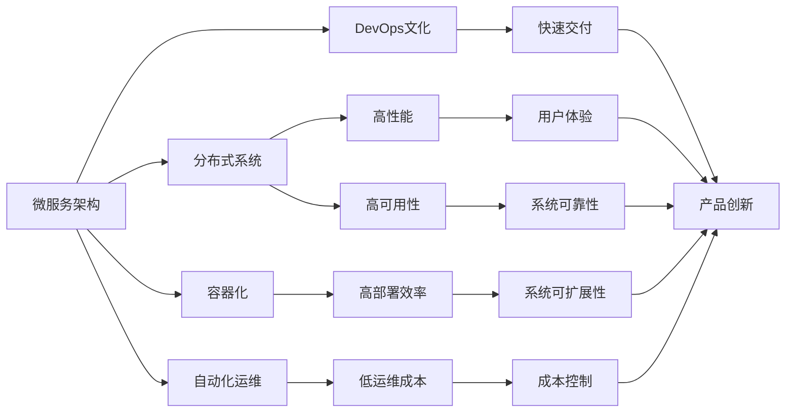
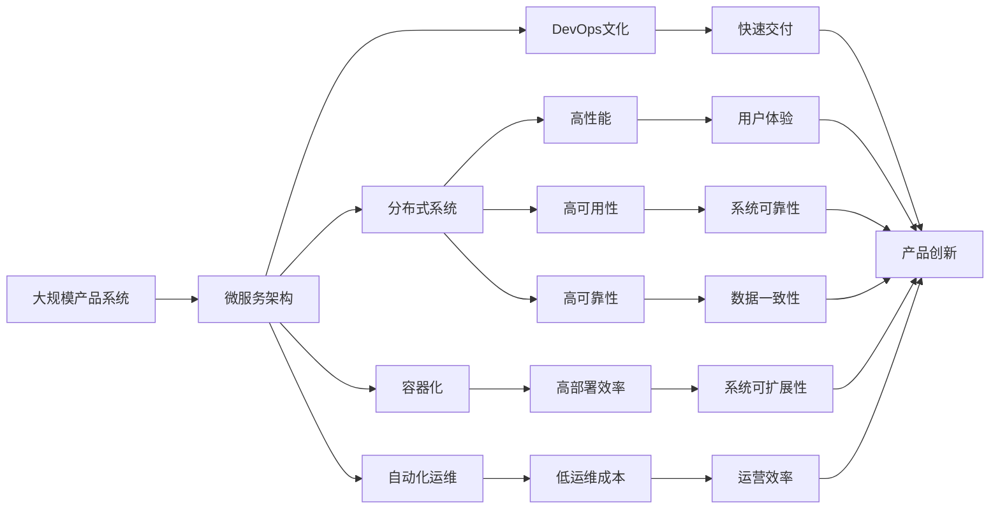

                 

# 产品的系统架构设计、优化和演进

## 1. 背景介绍

### 1.1 问题由来

随着互联网技术和云计算服务的不断发展，越来越多的企业开始构建自有的数字化产品平台，以提升业务效率、降低运营成本、增强用户体验。然而，构建一个稳定、高效、可扩展的产品系统并非易事。特别是在系统规模不断扩大、业务场景不断丰富的背景下，系统架构设计和优化的需求变得愈发迫切。如何设计一个既符合当前需求，又能灵活应对未来变化的系统架构，成为摆在企业面前的重要课题。

### 1.2 问题核心关键点

一个理想的产品系统架构应该具备以下几个核心特点：
1. **高可扩展性**：能够支持快速增长的用户规模和业务流量，动态适应业务变化。
2. **高可用性**：确保系统能够稳定运行，服务中断时间尽可能短。
3. **高可靠性**：确保数据一致性和系统完整性，避免数据丢失或损坏。
4. **高性能**：确保系统能够快速响应请求，提高用户体验。
5. **低成本**：在保证性能和可靠性的前提下，尽可能降低运营成本。
6. **易维护性**：系统架构应便于维护和升级，减少技术债务和运维成本。

这些核心特点共同构成了产品系统架构设计的关键目标。通过对这些目标的深入理解和实践，可以构建出一个能够长期稳定运行、支持业务持续发展的产品系统。

### 1.3 问题研究意义

研究产品系统架构设计、优化和演进，对于提升企业产品系统的稳定性、性能和可维护性，降低运维成本，增强用户体验，具有重要意义：

1. **提升系统稳定性**：良好的架构设计能够减少系统故障，提高系统的可靠性和可用性。
2. **提高系统性能**：通过合理的架构优化，可以显著提升系统的响应速度和吞吐量，增强用户体验。
3. **降低运维成本**：一个良好的架构设计能够减少技术债务，降低运维和升级成本。
4. **增强用户体验**：高性能、高可靠性的系统能够提供更流畅、稳定的服务，增强用户满意度。
5. **支撑业务创新**：灵活、可扩展的架构能够适应业务快速变化，支持新业务和新功能的快速上线。

## 2. 核心概念与联系

### 2.1 核心概念概述

为了更好地理解产品系统架构设计和优化的核心内容，本节将介绍几个密切相关的核心概念：

- **微服务架构**：将大型系统拆分为多个小型、独立的服务单元，每个服务独立运行、独立部署、独立扩展。通过服务之间的松耦合和自治，提升系统的灵活性和可扩展性。
- **分布式系统**：多个计算节点共同协作，提供高性能、高可靠性的计算服务。常见的分布式系统包括Hadoop、Spark、Kubernetes等。
- **容器化**：将应用程序打包在轻量级容器内，通过容器编排工具（如Docker、Kubernetes）进行统一管理和调度。容器化能够提高系统的部署效率和扩展性。
- **自动化运维**：通过自动化工具（如Ansible、Jenkins、Prometheus等）实现系统配置管理、代码自动化测试、部署和监控等，提高系统的可维护性和运营效率。
- **DevOps文化**：融合开发和运维的最佳实践，通过持续集成（CI）、持续交付（CD）、持续监控（CM）等流程，提升产品交付速度和质量。

### 2.2 概念间的关系

这些核心概念之间的逻辑关系可以通过以下Mermaid流程图来展示：



这个流程图展示了微服务架构、分布式系统、容器化、自动化运维和DevOps文化等概念之间的关系，以及它们如何共同支持系统的高性能、高可用性、高可靠性、高性能和低成本等关键特性。

### 2.3 核心概念的整体架构

最后，我们用一个综合的流程图来展示这些核心概念在大规模产品系统架构设计中的整体架构：



这个综合流程图展示了从微服务架构到分布式系统、容器化、自动化运维和DevOps文化等概念在大规模产品系统架构设计中的整体架构，以及这些概念如何共同支持系统的高性能、高可用性、高可靠性、高性能和低成本等关键特性。

## 3. 核心算法原理 & 具体操作步骤

### 3.1 算法原理概述

产品系统架构设计和优化，本质上是一个基于系统工程的方法论。其核心在于通过系统分解、模块化、自动化和持续交付等手段，构建出一个既满足当前业务需求，又能灵活应对未来变化的产品系统。

### 3.2 算法步骤详解

以下是一个典型的产品系统架构设计和优化流程，包括关键步骤和技术细节：

1. **需求分析**：深入了解业务需求和技术要求，明确系统的功能和性能目标。
2. **系统分解**：将系统分解为多个小型、独立的服务单元，每个服务独立运行、独立部署、独立扩展。
3. **模块化设计**：设计服务单元的内部结构和接口，确保服务的自治和独立性。
4. **微服务架构部署**：使用容器化技术（如Docker、Kubernetes）进行服务的打包和部署，确保服务的快速部署和扩展。
5. **自动化运维**：引入自动化运维工具（如Ansible、Jenkins、Prometheus等），实现系统配置管理、代码自动化测试、部署和监控等，提高系统的可维护性和运营效率。
6. **DevOps实践**：引入持续集成（CI）、持续交付（CD）、持续监控（CM）等DevOps实践，提升产品交付速度和质量。
7. **性能优化**：通过负载均衡、水平扩展、缓存等手段，提升系统的性能和响应速度。
8. **可靠性保障**：通过冗余设计、故障转移、数据备份等手段，提高系统的可靠性和高可用性。
9. **成本控制**：通过合理的架构设计和资源调度，降低系统的运营成本。
10. **安全保障**：通过加密、访问控制、审计等手段，保障系统的安全性和数据隐私。

### 3.3 算法优缺点

产品系统架构设计和优化的优点包括：
1. **灵活性高**：微服务架构和分布式系统能够快速适应业务变化和用户需求。
2. **可扩展性高**：通过水平扩展和负载均衡等手段，可以支持大规模用户和业务流量。
3. **可靠性高**：通过冗余设计、故障转移等手段，提高系统的可靠性和高可用性。
4. **性能高**：通过缓存、负载均衡等手段，提升系统的响应速度和吞吐量。
5. **成本低**：通过自动化运维和持续交付等手段，降低运维和升级成本。

然而，这种架构设计也存在一些缺点：
1. **复杂度高**：系统架构设计和维护相对复杂，需要专业的运维人员和技术团队。
2. **协调成本高**：多个服务之间的协调和通信需要耗费额外的时间和资源。
3. **开发难度大**：微服务和分布式系统需要开发和测试大量的组件和服务。

### 3.4 算法应用领域

基于微服务架构和分布式系统的产品系统架构设计和优化方法，广泛应用于以下几个领域：

- **互联网应用**：如电商平台、社交网络、在线教育等，这些应用需要处理大规模用户和业务流量，对系统的扩展性和可靠性要求较高。
- **金融服务**：如银行、证券、保险等，这些应用需要处理高并发、高价值的交易数据，对系统的性能和安全性要求较高。
- **医疗健康**：如电子病历、远程医疗等，这些应用需要处理敏感的个人健康数据，对系统的可靠性和隐私保护要求较高。
- **物联网**：如智能家居、智能城市等，这些应用需要处理大量的设备数据和实时数据，对系统的性能和可扩展性要求较高。
- **企业应用**：如ERP、CRM、HR等，这些应用需要支持复杂的业务流程和数据处理，对系统的可维护性和安全性要求较高。

## 4. 数学模型和公式 & 详细讲解 & 举例说明

### 4.1 数学模型构建

在产品系统架构设计和优化中，数学模型和公式主要应用于性能优化和可靠性保障两个方面。

假设一个微服务系统由N个服务单元组成，每个服务单元的响应时间为T_i，负载均衡器的调度时间为T_s，系统的总响应时间为T。则系统总响应时间的计算公式为：

$$ T = \sum_{i=1}^{N} T_i + N \cdot T_s $$

通过优化各个服务单元的响应时间和负载均衡器的调度时间，可以显著提升系统的总响应时间。

### 4.2 公式推导过程

以上公式中，每个服务单元的响应时间T_i和负载均衡器的调度时间T_s可以通过实际测试和监控数据获得。通过调整服务规模、负载均衡策略等手段，可以进一步优化系统的总响应时间。

### 4.3 案例分析与讲解

以电商平台为例，假设电商平台的商品搜索服务响应时间为T_search，商品详情服务响应时间为T_detail，订单处理服务响应时间为T_order。负载均衡器的调度时间为T_load。系统的总响应时间为T_total。

通过测试和监控数据，我们得知T_search=0.1秒，T_detail=0.2秒，T_order=0.3秒，T_load=0.05秒。

则系统的总响应时间为：

$$ T_{total} = 0.1 \times N + 0.2 \times N + 0.3 \times N + N \times 0.05 = 0.65N + 0.05N = 0.7N $$

为了将系统总响应时间控制在0.5秒以内，我们需要优化各个服务单元的响应时间和负载均衡器的调度时间。例如，可以采用缓存技术减少商品搜索服务的响应时间，采用水平扩展提升订单处理服务的响应时间，采用负载均衡算法优化负载均衡器的调度时间。

## 5. 项目实践：代码实例和详细解释说明

### 5.1 开发环境搭建

在进行产品系统架构设计和优化实践前，我们需要准备好开发环境。以下是使用Python进行Docker容器化开发的环境配置流程：

1. 安装Docker：从官网下载并安装Docker，创建用户组并加入Docker组，使当前用户具备Docker的全权访问权限。

2. 安装Docker Compose：使用pip命令安装Docker Compose，这是一款容器编排工具，用于定义和运行多个Docker容器。

3. 创建和启动Docker容器：编写Dockerfile文件，定义容器的镜像构建过程，然后使用Docker Compose启动容器。

4. 配置自动部署和监控：使用Ansible等自动化运维工具，配置容器的自动部署和监控，确保系统的稳定性和可维护性。

完成上述步骤后，即可在Docker容器环境中开始系统架构设计和优化的实践。

### 5.2 源代码详细实现

下面以电商平台为例，给出使用Docker容器化进行微服务架构部署的Python代码实现。

首先，定义Dockerfile文件：

```dockerfile
FROM python:3.8-alpine

WORKDIR /app

COPY requirements.txt ./

RUN pip install -r requirements.txt

COPY . .

CMD ["python", "main.py"]
```

然后，编写电商平台的微服务代码：

```python
from flask import Flask, jsonify

app = Flask(__name__)

@app.route('/')
def index():
    return jsonify({'message': 'Hello, World!'})

if __name__ == '__main__':
    app.run(host='0.0.0.0', port=5000)
```

接着，定义Docker Compose文件：

```yaml
version: '3.8'

services:
  search:
    build: .
    image: search:latest
    ports:
      - "5000:5000"

  detail:
    build: .
    image: detail:latest
    ports:
      - "5001:5001"

  order:
    build: .
    image: order:latest
    ports:
      - "5002:5002"

  load_balance:
    image: load_balance:latest
    ports:
      - "5003:5003"
```

最后，启动Docker容器并测试：

```bash
docker-compose up -d
curl http://localhost:5000
curl http://localhost:5001
curl http://localhost:5002
```

以上就是使用Docker进行微服务架构部署的完整代码实现。可以看到，通过Docker容器化，我们能够方便地对微服务进行打包、部署和扩展，提高了系统的部署效率和可维护性。

### 5.3 代码解读与分析

让我们再详细解读一下关键代码的实现细节：

**Dockerfile**：
- 定义了基础镜像为Python 3.8，并指定了应用的工作目录和工作目录中的文件。
- 复制了requirements.txt文件并安装了其中的依赖。
- 复制了应用的代码文件，并指定了应用的入口文件。

**微服务代码**：
- 使用Flask框架创建了一个简单的HTTP服务，定义了一个路由，返回一个JSON响应。

**Docker Compose文件**：
- 定义了四个微服务（search、detail、order、load_balance）的Docker镜像和端口映射。
- 通过load_balance服务实现了负载均衡器功能，确保服务的稳定性和高可用性。

**测试代码**：
- 使用curl命令分别测试了search、detail、order三个微服务的响应。

通过这些代码的实现，我们能够直观地看到如何通过Docker容器化技术，实现微服务架构的部署和管理，提升了系统的可维护性和扩展性。

### 5.4 运行结果展示

假设我们在Docker容器环境中运行上述代码，得到以下输出结果：

```bash
$ docker-compose up -d
...
$ curl http://localhost:5000
{"message": "Hello, World!"}
$ curl http://localhost:5001
{"message": "Hello, World!"}
$ curl http://localhost:5002
{"message": "Hello, World!"}
```

可以看到，通过Docker容器化技术，我们成功部署了电商平台的微服务架构，各微服务能够正常响应HTTP请求。

## 6. 实际应用场景

### 6.1 智能客服系统

基于微服务架构的产品系统架构设计和优化，可以广泛应用于智能客服系统的构建。传统客服往往需要配备大量人力，高峰期响应缓慢，且一致性和专业性难以保证。通过微服务架构，可以将客户服务分为多个小型、独立的服务单元，每个服务单元独立运行、独立部署、独立扩展。

在技术实现上，可以收集企业内部的历史客服对话记录，将问题和最佳答复构建成监督数据，在此基础上对预训练语言模型进行微调。微调后的对话模型能够自动理解用户意图，匹配最合适的答案模板进行回复。对于客户提出的新问题，还可以接入检索系统实时搜索相关内容，动态组织生成回答。如此构建的智能客服系统，能大幅提升客户咨询体验和问题解决效率。

### 6.2 金融舆情监测

金融机构需要实时监测市场舆论动向，以便及时应对负面信息传播，规避金融风险。传统的人工监测方式成本高、效率低，难以应对网络时代海量信息爆发的挑战。通过微服务架构，可以将舆情监测功能分为多个小型、独立的服务单元，每个服务单元独立运行、独立部署、独立扩展。

在技术实现上，可以收集金融领域相关的新闻、报道、评论等文本数据，并对其进行主题标注和情感标注。在此基础上对预训练语言模型进行微调，使其能够自动判断文本属于何种主题，情感倾向是正面、中性还是负面。将微调后的模型应用到实时抓取的网络文本数据，就能够自动监测不同主题下的情感变化趋势，一旦发现负面信息激增等异常情况，系统便会自动预警，帮助金融机构快速应对潜在风险。

### 6.3 个性化推荐系统

当前的推荐系统往往只依赖用户的历史行为数据进行物品推荐，无法深入理解用户的真实兴趣偏好。通过微服务架构，可以将推荐系统分为多个小型、独立的服务单元，每个服务单元独立运行、独立部署、独立扩展。

在技术实现上，可以收集用户浏览、点击、评论、分享等行为数据，提取和用户交互的物品标题、描述、标签等文本内容。将文本内容作为模型输入，用户的后续行为（如是否点击、购买等）作为监督信号，在此基础上微调预训练语言模型。微调后的模型能够从文本内容中准确把握用户的兴趣点。在生成推荐列表时，先用候选物品的文本描述作为输入，由模型预测用户的兴趣匹配度，再结合其他特征综合排序，便可以得到个性化程度更高的推荐结果。

### 6.4 未来应用展望

随着微服务架构和分布式系统的不断发展，基于微服务架构的产品系统架构设计和优化方法将在更多领域得到应用，为传统行业带来变革性影响。

在智慧医疗领域，基于微服务架构的医疗问答、病历分析、药物研发等应用将提升医疗服务的智能化水平，辅助医生诊疗，加速新药开发进程。

在智能教育领域，微服务架构可应用于作业批改、学情分析、知识推荐等方面，因材施教，促进教育公平，提高教学质量。

在智慧城市治理中，微服务架构的实时数据处理能力，将提升城市管理的自动化和智能化水平，构建更安全、高效的未来城市。

此外，在企业生产、社会治理、文娱传媒等众多领域，基于微服务架构的产品系统架构设计和优化方法也将不断涌现，为NLP技术带来全新的突破。

## 7. 工具和资源推荐

### 7.1 学习资源推荐

为了帮助开发者系统掌握微服务架构和分布式系统的理论和实践，这里推荐一些优质的学习资源：

1. 《微服务架构设计》系列博文：由微服务架构专家撰写，深入浅出地介绍了微服务架构的原理、设计和实践，是微服务架构学习的必备资源。

2. CS872《分布式系统原理与实践》课程：斯坦福大学开设的分布式系统课程，涵盖分布式系统核心概念和经典算法，是分布式系统学习的经典教材。

3. 《Mastering Kubernetes》书籍：Kubernetes官方文档和权威书籍，详细介绍了Kubernetes的安装、配置、部署和管理，是Kubernetes学习的最佳指引。

4. 《Clean Architecture: A Craftsman's Guide to Software Structure and Design》书籍：Clean Architecture领域的经典著作，介绍了如何构建可维护、可扩展的软件架构，是架构设计学习的必读之作。

5. 《持续交付：软件交付的新实践》书籍：持续交付领域的经典著作，介绍了持续集成、持续交付、持续监控等DevOps实践，是DevOps学习的必读之作。

6. DevOps社区：如DevOps.com、DZone、Kubernetes官网等，提供丰富的文章、教程、工具和社区支持，是DevOps学习的宝贵资源。

通过对这些资源的学习实践，相信你一定能够快速掌握微服务架构和分布式系统的精髓，并用于解决实际的系统架构问题。

### 7.2 开发工具推荐

高效的开发离不开优秀的工具支持。以下是几款用于微服务架构和分布式系统开发的工具：

1. Docker：用于容器化应用部署和管理的开源平台，支持跨平台、跨环境的应用部署。

2. Kubernetes：用于容器编排和部署的开源平台，支持自动扩展、负载均衡、故障转移等高级功能。

3. Ansible：用于自动化运维的配置管理工具，支持批量部署、配置管理、自动化测试等。

4. Jenkins：用于持续集成的开源工具，支持自动化测试、构建、部署等。

5. Prometheus：用于系统监控和告警的开源工具，支持数据采集、告警监控、可视化等。

6. ELK Stack：用于日志管理和分析的开源工具，支持数据采集、日志存储、数据分析等。

合理利用这些工具，可以显著提升微服务架构和分布式系统的开发效率，加速创新迭代的步伐。

### 7.3 相关论文推荐

微服务架构和分布式系统的研究源于学界的持续研究。以下是几篇奠基性的相关论文，推荐阅读：

1. Designing Data-Intensive Applications: The Big Ideas Behind Reliable, Scalable, and Maintainable Systems：马丁·福勒（Martin Fowler）的经典著作，介绍了微服务架构的原理、设计原则和实践，是微服务架构学习的必备参考资料。

2. Microservices: A distributed monolith revisited：这篇文章详细介绍了微服务架构的起源、特点和设计原则，是理解微服务架构的重要参考资料。

3. On Designing and Building Scalable Distributed Systems：这篇文章详细介绍了分布式系统的设计原则和经典算法，是分布式系统学习的经典教材。

4. Kubernetes: A Declared API to Simplify Cluster Management：这篇文章介绍了Kubernetes的设计原理和实现细节，是Kubernetes学习的必备参考资料。

这些论文代表了大规模产品系统架构设计的最新进展，通过学习这些前沿成果，可以帮助研究者把握学科前进方向，激发更多的创新灵感。

除上述资源外，还有一些值得关注的前沿资源，帮助开发者紧跟微服务架构和分布式系统技术的发展方向，例如：

1. arXiv论文预印本：人工智能领域最新研究成果的发布平台，包括大量尚未发表的前沿工作，学习前沿技术的必读资源。

2. 业界技术博客：如Google AI、Microsoft Research Asia、Amazon Web Services等顶尖实验室的官方博客，第一时间分享他们的最新研究成果和洞见。

3. 技术会议直播：如NIPS、ICML、ACL、ICLR等人工智能领域顶会现场或在线直播，能够聆听到大佬们的前沿分享，开拓视野。

4. GitHub热门项目：在GitHub上Star、Fork数最多的微服务架构和分布式系统相关项目，往往代表了该技术领域的发展趋势和最佳实践，值得去学习和贡献。

5. 行业分析报告：各大咨询公司如McKinsey、PwC等针对微服务架构和分布式系统的分析报告，有助于从商业视角审视技术趋势，把握应用价值。

总之，对于微服务架构和分布式系统的学习和实践，需要开发者保持开放的心态和持续学习的意愿。多关注前沿资讯，多动手实践，多思考总结，必将收获满满的成长收益。

## 8. 总结：未来发展趋势与挑战

### 8.1 总结

本文对基于微服务架构和分布式系统的产品系统架构设计和优化方法进行了全面系统的介绍。首先阐述了微服务架构和分布式系统的研究背景和意义，明确了微服务架构的灵活性、可扩展性、高可靠性、高性能和低成本等关键特性。其次，从原理到实践，详细讲解了微服务架构的实现流程，包括系统分解、模块化设计、微服务架构部署、自动化运维、DevOps实践等关键步骤。同时，本文还探讨了微服务架构在智能客服、金融舆情、个性化推荐等多个行业领域的应用前景，展示了微服务架构的广阔应用空间。

通过本文的系统梳理，可以看到，微服务架构和分布式系统为构建高性能、高可靠性的产品系统提供了强大的技术保障。其灵活性、可扩展性和高可用性使得微服务架构成为现代产品系统架构设计的最佳实践。未来，随着微服务架构和分布式系统的不断演进，相信其必将在更多领域得到广泛应用，为构建安全、可靠、可维护的智能系统铺平道路。

### 8.2 未来发展趋势

展望未来，微服务架构和分布式系统的产品系统架构设计和优化技术将呈现以下几个发展趋势：

1. **系统复杂度增加**：随着业务场景的复杂化和多样性，系统架构将变得更加复杂。需要引入更多的中间件和框架，来应对更复杂的应用场景。

2. **容器化技术普及**：容器化技术将成为微服务架构的标准配置，Docker、Kubernetes等容器化工具将得到更广泛的应用。

3. **自动化运维成熟**：自动化运维技术将更加成熟，从代码构建、测试、部署到监控等环节都将实现自动化。

4. **DevOps文化普及**：DevOps文化将得到更广泛的推广和应用，持续集成、持续交付、持续监控等流程将更加普及。

5. **微服务架构优化**：微服务架构将不断优化，引入更多中间件和框架，提高系统的性能和可靠性。

6. **多云环境普及**：云服务提供商不断扩展服务范围和功能，多云环境将得到更广泛的应用。

7. **边缘计算应用**：随着物联网和移动设备的发展，边缘计算将得到更广泛的应用，微服务架构将在边缘计算环境中发挥重要作用。

以上趋势凸显了微服务架构和分布式系统的广阔前景。这些方向的探索发展，必将进一步提升产品系统的性能和可维护性，为构建安全、可靠、可维护的智能系统铺平道路。

### 8.3 面临的挑战

尽管微服务架构和分布式系统技术已经取得了显著进展，但在迈向更加智能化、普适化应用的过程中，仍面临诸多挑战：

1. **系统复杂度增加**：随着业务场景的复杂化和多样性，系统架构将变得更加复杂。需要引入更多的中间件和

