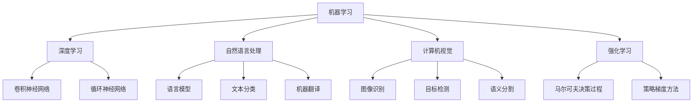
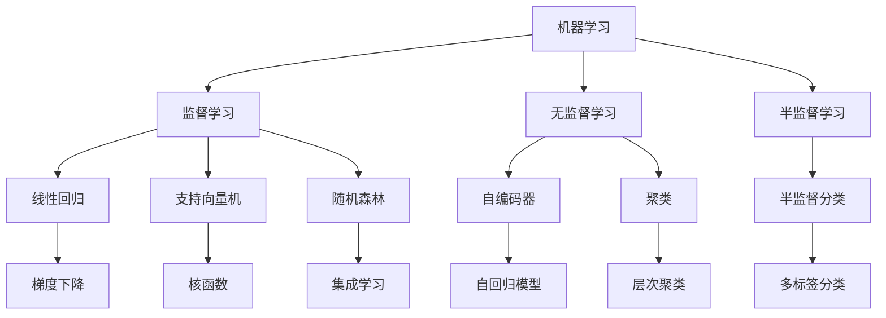
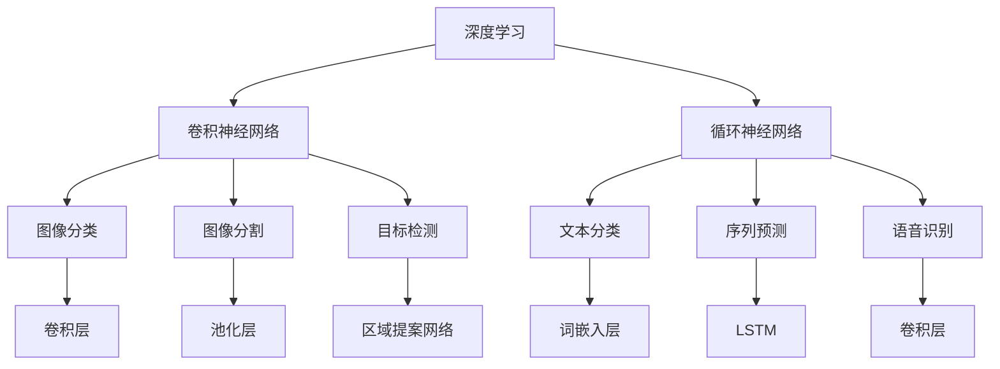
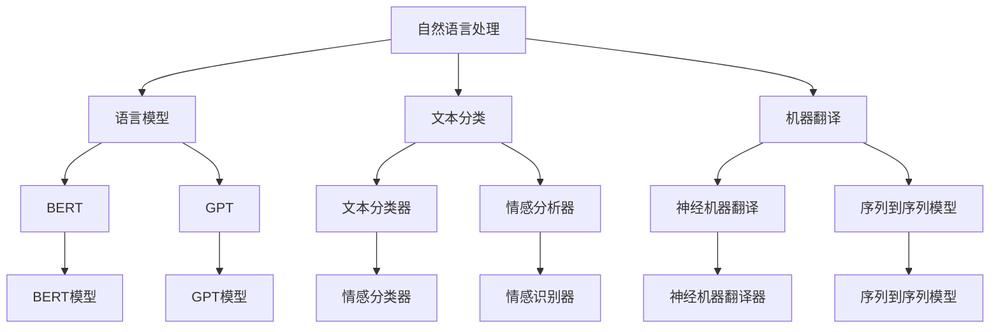

                 

# 人工智能原理与代码实例讲解

> 关键词：人工智能, 机器学习, 深度学习, 卷积神经网络(CNN), 循环神经网络(RNN), 自然语言处理(NLP), 计算机视觉(CV), 强化学习, 算法优化, 性能调优, 模型训练, 实验验证

## 1. 背景介绍

### 1.1 问题由来
人工智能（Artificial Intelligence, AI）是计算机科学的一个分支，旨在通过算法和计算模型模拟人类的智能行为。近年来，随着数据量的激增和计算能力的提升，AI技术得到了飞速发展，并在各个领域取得了显著应用，如自然语言处理、计算机视觉、机器人控制等。然而，尽管取得了诸多进展，AI仍面临着诸多挑战，如模型复杂性、计算效率、数据质量等问题，这些问题限制了AI技术的进一步发展。因此，深入理解AI的原理和代码实现，对于推动AI技术的落地应用具有重要意义。

### 1.2 问题核心关键点
AI的核心思想是通过机器学习算法，让计算机能够从数据中学习规律，从而具备识别、推理、决策等智能行为。其主要研究内容包括：

1. 机器学习（Machine Learning, ML）：通过算法和模型，让计算机能够从数据中自动学习和总结规律，实现预测、分类、聚类等任务。

2. 深度学习（Deep Learning, DL）：一种特殊的机器学习方法，通过构建深层神经网络，利用多层非线性变换，提取复杂数据特征，实现高效的学习和推理。

3. 自然语言处理（Natural Language Processing, NLP）：处理和理解人类语言，包括语言模型、文本分类、机器翻译等任务。

4. 计算机视觉（Computer Vision, CV）：通过算法和模型，让计算机能够识别和理解图像和视频内容，包括图像识别、目标检测、语义分割等任务。

5. 强化学习（Reinforcement Learning, RL）：让计算机通过与环境的交互，学习最优策略，实现决策和控制。

这些核心研究领域互有交叉和借鉴，共同构成了现代AI技术的体系。了解这些核心技术的基本原理和代码实现，能够帮助开发者更好地理解AI技术的本质，从而提升其实践能力和应用效果。

### 1.3 问题研究意义
研究AI的原理和代码实现，对于推动AI技术的产业化具有重要意义：

1. 降低技术门槛：通过深入理解AI技术的原理和实现细节，开发者可以更快地掌握相关技术，减少学习和实验成本。

2. 提升应用效果：深入理解AI技术的核心算法和模型结构，能够帮助开发者设计更高效、更稳定的AI应用。

3. 推动创新发展：掌握AI技术的原理和实现细节，可以激发更多的创新灵感，推动技术进步。

4. 增强竞争力：掌握AI技术，可以在竞争中占据优势，提升企业在科技领域的竞争力。

5. 促进产业化：深入理解AI技术的实现细节，能够帮助企业更高效地将AI技术应用于产品和服务中，推动产业升级。

综上所述，深入理解AI技术的原理和代码实现，对于推动AI技术的落地应用具有重要意义。本文将从核心概念、算法原理、代码实例等方面，详细讲解AI技术的实现细节，帮助读者更好地理解和应用AI技术。

## 2. 核心概念与联系

### 2.1 核心概念概述

为了更好地理解AI技术的实现细节，本节将介绍几个密切相关的核心概念：

- 机器学习（Machine Learning, ML）：通过算法和模型，让计算机能够从数据中学习规律，实现预测、分类、聚类等任务。

- 深度学习（Deep Learning, DL）：一种特殊的机器学习方法，通过构建深层神经网络，利用多层非线性变换，提取复杂数据特征，实现高效的学习和推理。

- 自然语言处理（Natural Language Processing, NLP）：处理和理解人类语言，包括语言模型、文本分类、机器翻译等任务。

- 计算机视觉（Computer Vision, CV）：通过算法和模型，让计算机能够识别和理解图像和视频内容，包括图像识别、目标检测、语义分割等任务。

- 强化学习（Reinforcement Learning, RL）：让计算机通过与环境的交互，学习最优策略，实现决策和控制。

这些核心概念之间的逻辑关系可以通过以下Mermaid流程图来展示：



这个流程图展示了大AI技术的核心概念及其之间的关系：

1. 机器学习是AI的基础，通过算法和模型让计算机从数据中学习规律。
2. 深度学习是机器学习的一种特殊形式，通过构建深层神经网络，提取复杂数据特征。
3. 自然语言处理、计算机视觉和强化学习是AI的重要应用领域，分别处理人类语言、图像和环境交互中的智能行为。
4. 卷积神经网络、循环神经网络和深度学习密切相关，分别用于图像识别、序列处理和强化学习任务。
5. 语言模型、文本分类、机器翻译等任务属于自然语言处理，图像识别、目标检测、语义分割等任务属于计算机视觉，马尔可夫决策过程和策略梯度方法等属于强化学习。

这些核心概念共同构成了现代AI技术的核心框架，帮助我们理解AI技术的实现细节。

### 2.2 概念间的关系

这些核心概念之间存在着紧密的联系，形成了AI技术的完整生态系统。下面我们通过几个Mermaid流程图来展示这些概念之间的关系。

#### 2.2.1 AI技术的核心算法



这个流程图展示了机器学习中的核心算法及其关系：

1. 监督学习、无监督学习和半监督学习是机器学习的主要形式。
2. 线性回归、支持向量机和随机森林等是常见的监督学习算法。
3. 自编码器、聚类和半监督分类等是无监督学习和半监督学习的常用算法。
4. 梯度下降、核函数和集成学习等是常用的算法优化方法。
5. 自回归模型和层次聚类等是特定类型的算法。
6. 多标签分类等是特定的任务算法。

这些算法和技术共同构成了机器学习的基本框架，帮助我们理解AI技术的实现细节。

#### 2.2.2 深度学习的主要算法



这个流程图展示了深度学习中的主要算法及其关系：

1. 卷积神经网络和循环神经网络是深度学习的主要形式。
2. 图像分类、图像分割和目标检测等是常见的图像处理任务。
3. 文本分类、序列预测和语音识别等是常见的序列处理任务。
4. 卷积层、池化层和区域提案网络等是常见的卷积神经网络层。
5. 词嵌入层、LSTM等是常见的循环神经网络层。

这些算法和技术共同构成了深度学习的基本框架，帮助我们理解AI技术的实现细节。

#### 2.2.3 AI技术的主要应用



这个流程图展示了自然语言处理、计算机视觉和强化学习的主要应用及其关系：

1. 语言模型、文本分类和机器翻译等是自然语言处理的主要任务。
2. BERT和GPT等是常见的预训练语言模型。
3. 文本分类器和情感分类器等是常用的文本分类任务。
4. 神经机器翻译器和序列到序列模型等是常见的机器翻译任务。

这些应用和技术共同构成了AI技术的实际应用场景，帮助我们理解AI技术的实现细节。

## 3. 核心算法原理 & 具体操作步骤

### 3.1 算法原理概述

AI的核心算法原理主要包括机器学习、深度学习和强化学习。本节将详细介绍这些核心算法的基本原理，以及它们在实际应用中的操作步骤。

#### 3.1.1 机器学习

机器学习是AI的基础，通过算法和模型让计算机从数据中学习规律，实现预测、分类、聚类等任务。其核心思想是通过训练数据，让计算机自动发现数据中的模式和规律，从而进行预测和分类。

机器学习的常用算法包括线性回归、逻辑回归、决策树、支持向量机等。其中，线性回归和逻辑回归是常用的回归算法，用于预测连续值和二分类值；决策树和支持向量机是常用的分类算法，用于分类和分类。

#### 3.1.2 深度学习

深度学习是机器学习的一种特殊形式，通过构建深层神经网络，利用多层非线性变换，提取复杂数据特征，实现高效的学习和推理。深度学习的核心思想是通过多层神经网络，自动提取和融合数据特征，实现高精度的预测和分类。

深度学习的常用算法包括卷积神经网络（CNN）、循环神经网络（RNN）和自编码器等。其中，CNN主要用于图像处理和语音识别，RNN主要用于序列处理和自然语言处理，自编码器主要用于特征提取和降维。

#### 3.1.3 强化学习

强化学习是AI的一种重要形式，通过与环境的交互，让计算机学习最优策略，实现决策和控制。强化学习的核心思想是通过试错，让计算机逐步学习最优策略，从而实现最优决策。

强化学习的常用算法包括Q-learning、策略梯度方法和马尔可夫决策过程等。其中，Q-learning用于离散决策问题，策略梯度方法用于连续决策问题，马尔可夫决策过程用于组合策略问题。

### 3.2 算法步骤详解

AI的核心算法操作步骤主要包括数据准备、模型训练和模型评估。本节将详细介绍这些操作步骤。

#### 3.2.1 数据准备

数据准备是AI算法的基础步骤，需要从数据集中提取特征，并将其转换为模型可以处理的形式。数据准备的步骤主要包括数据清洗、特征提取和数据分割。

1. 数据清洗：去除数据集中的异常值和噪声，确保数据质量。

2. 特征提取：从原始数据中提取有用的特征，以便模型能够识别和学习规律。特征提取的方法包括手工特征提取和自动特征提取。

3. 数据分割：将数据集分为训练集、验证集和测试集，以便模型训练和评估。通常使用70%训练集、15%验证集和15%测试集的划分方式。

#### 3.2.2 模型训练

模型训练是AI算法的核心步骤，通过训练数据，让模型学习数据中的规律，从而进行预测和分类。模型训练的步骤主要包括模型初始化、前向传播、损失计算和反向传播。

1. 模型初始化：对模型进行初始化，以便模型能够开始学习。初始化的方式包括随机初始化和预训练初始化。

2. 前向传播：将输入数据输入模型，计算模型的预测值。

3. 损失计算：将模型的预测值与真实值进行比较，计算损失函数。常用的损失函数包括均方误差、交叉熵等。

4. 反向传播：根据损失函数的梯度，更新模型参数。常用的优化算法包括梯度下降、Adam等。

#### 3.2.3 模型评估

模型评估是AI算法的最后一步，用于评估模型的性能和泛化能力。模型评估的步骤主要包括性能指标计算和模型优化。

1. 性能指标计算：使用测试集数据，计算模型的性能指标，如准确率、召回率、F1分数等。

2. 模型优化：根据性能指标的结果，对模型进行优化。优化的方法包括超参数调优、正则化和模型融合等。

### 3.3 算法优缺点

AI的核心算法具有以下优点：

1. 高效性：AI算法能够自动从数据中学习规律，实现高效的预测和分类。

2. 泛化能力：AI算法能够在新的数据上表现良好，具有较强的泛化能力。

3. 可解释性：AI算法能够通过特征和权重，解释模型的预测和分类结果。

4. 应用广泛：AI算法能够应用于各种领域，如自然语言处理、计算机视觉和强化学习等。

5. 可扩展性：AI算法能够通过增加数据和模型复杂度，实现更高的性能。

同时，AI算法也存在以下缺点：

1. 数据依赖：AI算法的性能依赖于数据质量，低质量数据会导致模型性能下降。

2. 模型复杂性：AI算法通常需要复杂的模型结构和大量的参数，导致模型复杂度较高。

3. 计算需求：AI算法需要大量的计算资源，对于大规模数据集和高维度数据，计算成本较高。

4. 可解释性不足：AI算法的预测和分类结果难以解释，缺乏可解释性。

5. 鲁棒性不足：AI算法对噪声和异常值较为敏感，鲁棒性较差。

### 3.4 算法应用领域

AI的核心算法在各个领域都有广泛的应用，包括自然语言处理、计算机视觉、机器人控制等。本节将详细介绍AI算法的主要应用领域。

#### 3.4.1 自然语言处理

自然语言处理（NLP）是AI的重要应用领域，涉及语言模型、文本分类、机器翻译等任务。NLP的主要算法包括BERT、GPT、Transformer等。

1. 语言模型：通过预训练语言模型，学习语言的语法和语义规律，实现文本生成和语言理解。

2. 文本分类：通过训练分类器，将文本分为不同的类别，实现情感分析、主题分类等任务。

3. 机器翻译：通过训练序列到序列模型，将一种语言翻译成另一种语言，实现自动翻译。

#### 3.4.2 计算机视觉

计算机视觉（CV）是AI的另一个重要应用领域，涉及图像识别、目标检测、语义分割等任务。CV的主要算法包括CNN、RNN等。

1. 图像识别：通过卷积神经网络，将图像中的物体识别出来，实现自动驾驶、人脸识别等任务。

2. 目标检测：通过区域提案网络和YOLO等算法，检测图像中的目标物体，实现安防监控、医学影像分析等任务。

3. 语义分割：通过语义分割算法，将图像中的像素分割成不同的类别，实现城市规划、农业监控等任务。

#### 3.4.3 强化学习

强化学习（RL）是AI的另一个重要形式，通过与环境的交互，让计算机学习最优策略，实现决策和控制。RL的主要算法包括Q-learning、策略梯度方法和马尔可夫决策过程等。

1. 游戏AI：通过强化学习，训练游戏AI，实现自动围棋、自动象棋等任务。

2. 机器人控制：通过强化学习，训练机器人控制器，实现机器人导航、作业等任务。

3. 自动化交易：通过强化学习，训练交易算法，实现自动化股票交易等任务。

## 4. 数学模型和公式 & 详细讲解 & 举例说明

### 4.1 数学模型构建

AI的核心算法通常建立在数学模型和公式的基础上，本节将详细介绍这些数学模型和公式。

#### 4.1.1 线性回归模型

线性回归模型是机器学习中常用的回归模型，用于预测连续值。其数学模型为：

$$
y = \beta_0 + \beta_1 x_1 + \beta_2 x_2 + ... + \beta_n x_n
$$

其中，$y$为预测值，$\beta_0$为截距，$\beta_1, \beta_2, ..., \beta_n$为特征系数。

线性回归模型的目标是最小化预测值与真实值之间的平方误差，即：

$$
L(\theta) = \frac{1}{2m} \sum_{i=1}^m (y_i - \hat{y_i})^2
$$

其中，$m$为样本数量，$y_i$为真实值，$\hat{y_i}$为预测值。

#### 4.1.2 卷积神经网络

卷积神经网络（CNN）是深度学习中常用的图像处理算法，其数学模型为：

$$
y = \sigma(W_1 * x_1 + b_1) * W_2 * x_2 + b_2 + ...
$$

其中，$y$为输出值，$x_1, x_2, ..., x_n$为输入特征，$W_1, W_2, ..., W_n$为卷积核权重，$b_1, b_2, ..., b_n$为偏置项，$\sigma$为激活函数。

CNN的目标是最小化损失函数，常用的损失函数包括均方误差、交叉熵等。

#### 4.1.3 循环神经网络

循环神经网络（RNN）是深度学习中常用的序列处理算法，其数学模型为：

$$
h_t = \sigma(W_{xh} x_t + W_{hh} h_{t-1} + b_h)
$$

$$
y = \sigma(W_{hy} h_t + b_y)
$$

其中，$h_t$为隐藏状态，$x_t$为输入序列，$W_{xh}, W_{hh}, W_{hy}, b_h, b_y$为网络参数，$\sigma$为激活函数。

RNN的目标是最小化损失函数，常用的损失函数包括均方误差、交叉熵等。

#### 4.1.4 强化学习

强化学习中的Q-learning算法，其数学模型为：

$$
Q(s, a) = r + \gamma \max_a' Q(s', a')
$$

其中，$s$为当前状态，$a$为当前动作，$r$为即时奖励，$s'$为下一个状态，$a'$为下一个动作，$\gamma$为折扣因子。

Q-learning的目标是最小化Q值与真实Q值之间的误差，常用的误差函数包括均方误差、交叉熵等。

### 4.2 公式推导过程

下面以卷积神经网络为例，详细介绍其公式推导过程。

卷积神经网络的核心是卷积层和池化层，其数学模型可以表示为：

$$
y = \sigma(W * x + b)
$$

其中，$y$为输出值，$x$为输入特征，$W$为卷积核权重，$b$为偏置项，$\sigma$为激活函数。

卷积层的公式推导如下：

$$
y_{ij} = \sum_{k=0}^{n-1} \sum_{l=0}^{m-1} x_{ikl} * W_{ilm} + b_{il}
$$

其中，$y_{ij}$为输出特征，$x_{ikl}$为输入特征，$W_{ilm}$为卷积核权重，$b_{il}$为偏置项，$i, j, k, l$为特征索引。

池化层的公式推导如下：

$$
y_{ij} = \max_{c=0}^{n-1} \frac{y_{icj}}{P}
$$

其中，$y_{ij}$为输出特征，$y_{icj}$为输入特征，$P$为池化窗口大小。

### 4.3 案例分析与讲解

下面以图像分类为例，详细介绍卷积神经网络的实现过程。

图像分类是卷积神经网络的主要应用之一，其目标是将图像分为不同的类别。卷积神经网络通常由卷积层、池化层和全连接层组成，其核心是卷积层和池化层。

首先，将图像输入卷积层，卷积核在图像上滑动，提取图像的局部特征。卷积层的输出特征可以看作是特征图，每个特征图对应一个特征。

然后，将卷积层的输出特征输入池化层，进行特征降维和下采样。池化层通常使用最大池化，保留特征图中的最大值。

最后，将池化层的输出特征输入全连接层，进行分类。全连接层通常使用softmax函数，输出每个类别的概率。

图像分类的过程可以表示为：

$$
y = \sigma(W * x + b)
$$

其中，$y$为输出值，$x$为输入特征，$W$为卷积核权重，$b$为偏置项，$\sigma$为激活函数。

## 5. 项目实践：代码实例和详细解释说明

### 5.1 开发环境搭建

在进行AI算法实践前，我们需要准备好开发环境。以下是使用Python进行TensorFlow和Keras开发的环境配置流程：

1. 安装Anaconda：从官网下载并安装Anaconda，用于创建独立的Python环境。

2. 创建并激活虚拟环境：
```bash
conda create -n tf-env python=3.8 
conda activate tf-env
```

3. 安装TensorFlow和Keras：
```bash
pip install tensorflow==2.6.0 
pip install keras==2.6.0
```

4. 安装各类工具包：
```bash
pip install numpy pandas scikit-learn matplotlib tqdm jupyter notebook ipython
```

完成上述步骤后，即可在`tf-env`环境中开始AI算法实践。

### 5.2 源代码详细实现

下面我以图像分类为例，给出使用TensorFlow和Keras对卷积神经网络进行训练的Python代码实现。

首先，定义数据集和模型：

```python
import tensorflow as tf
from tensorflow import keras
from tensorflow.keras import layers
from tensorflow.keras.datasets import cifar10

# 加载CIFAR-10数据集
(x_train, y_train), (x_test, y_test) = cifar10.load_data()

# 数据预处理
x_train = x_train / 255.0
x_test = x_test / 255.0

# 定义模型
model = keras.Sequential([
    keras.Input(shape=(32, 32, 3)),
    layers.Conv2D(32, (3, 3), activation='relu'),
    layers.MaxPooling2D(pool_size=(2, 2)),
    layers.Conv2D(64, (3, 3), activation='relu'),
    layers.MaxPooling2D(pool_size=(2, 2)),
    layers.Flatten(),
    layers.Dense(10, activation='softmax')
])
```

然后，定义优化器和损失函数：

```python
# 定义优化器
optimizer = keras.optimizers.Adam(learning_rate=0.001)

# 定义损失函数
loss_fn = keras.losses.SparseCategoricalCrossentropy(from_logits=True)
```

接着，定义训练和评估函数：

```python
# 定义训练函数
def train_epoch(model, train_dataset, optimizer, loss_fn):
    model.compile(optimizer=optimizer, loss=loss_fn, metrics=['accuracy'])
    model.fit(train_dataset, epochs=1, batch_size=64)

# 定义评估函数
def evaluate(model, test_dataset):
    model.compile(optimizer='adam', loss=loss_fn, metrics=['accuracy'])
    test_loss, test_acc = model.evaluate(test_dataset, verbose=2)
    print('Test accuracy:', test_acc)
```

最后，启动训练流程并在测试集上评估：

```python
# 训练模型
train_dataset = keras.preprocessing.image.ImageDataGenerator(rescale=1./255).flow(x_train, y_train, batch_size=64)

# 训练
train_epoch(model, train_dataset, optimizer, loss_fn)

# 评估模型
evaluate(model, test_dataset)
```

以上就是使用TensorFlow和Keras对卷积神经网络进行图像分类任务训练的完整代码实现。可以看到，TensorFlow和Keras提供了强大的工具支持，使得AI算法的实现变得简单高效。

### 5.3 代码解读与分析

让我们再详细解读一下关键代码的实现细节：

**定义数据集**：
- 使用`cifar10.load_data()`加载CIFAR-10数据集。
- 对数据进行预处理，将像素值缩放到[0, 1]之间。

**定义模型**：
- 使用`Sequential`定义顺序模型，包含卷积层、池化层和全连接层。
- 使用`Conv2D`定义卷积层，提取图像特征。
- 使用`MaxPooling2D`定义池化层，进行特征降维。
- 使用`Flatten`定义扁平化层，将卷积层的输出展平。
- 使用`Dense`定义全连接层，进行分类。

**定义优化器和损失函数**：
- 使用`Adam`优化器，设置

