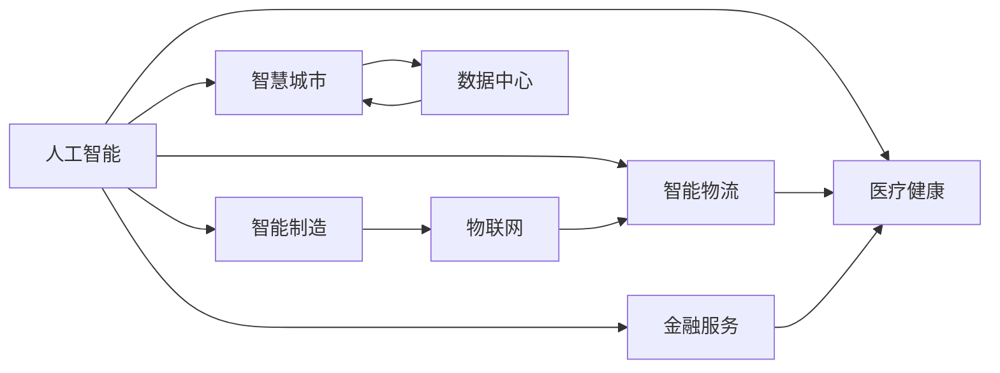

                 

# 人工智能在产业中的应用创新

> 关键词：人工智能,产业应用,创新,技术驱动,智能制造,智慧城市,医疗健康,金融服务

## 1. 背景介绍

### 1.1 问题由来
人工智能(AI)技术的迅猛发展，正在深刻改变着各行各业的运作模式和商业模式。从早期的计算科学到如今的智能计算，AI已经从学术界走向产业界，成为推动经济社会进步的重要力量。当前，AI技术正在向更广的行业领域、更深的技术层面、更强的智能能力迈进，为产业数字化转型带来了新的机遇和挑战。

AI技术的产业化应用，不仅需要硬核的技术突破，还需要将创新成果与实际业务紧密结合，为传统行业提供新动力、新模式、新价值。如何更好地利用AI技术推动产业创新，成为当下各大企业、研究机构和政府部门关注的焦点。

### 1.2 问题核心关键点
AI在产业应用中面临的核心问题包括：
- 如何选择合适的AI技术和工具，满足不同行业的具体需求？
- 如何在已有业务流程的基础上，将AI技术高效集成，提升业务智能化水平？
- 如何在数据隐私、模型安全性等伦理问题上找到平衡，保障AI应用的安全可靠？
- 如何构建AI驱动的可持续商业模式，实现技术-商业双赢？

本文聚焦于AI在产业中的应用创新，探讨了不同行业的AI应用模式和技术路径，旨在为产业数字化转型提供有价值的参考和指导。

### 1.3 问题研究意义
研究AI在产业中的创新应用，对于推动人工智能技术在更广泛领域的应用，提升产业的智能化水平，具有重要意义：

1. **加速产业升级**：AI技术可以赋能传统行业，提升生产效率，降低运营成本，提升产品质量，增强竞争优势。
2. **创造新业务模式**：AI可以开拓新的业务场景和价值空间，如智能客服、智能制造、智能物流等，为企业带来新的增长点。
3. **提升用户体验**：AI驱动的个性化服务、精准推荐等应用，可以显著提升用户的满意度和忠诚度。
4. **推动技术创新**：AI技术的发展和应用，可以反哺技术的进一步突破，形成良性循环。
5. **促进社会进步**：AI在医疗健康、环境保护、教育培训等公共服务领域的广泛应用，可以带来社会效益。

## 2. 核心概念与联系

### 2.1 核心概念概述

为了更好地理解AI在产业中的应用创新，本节将介绍几个关键概念，并阐述它们之间的联系：

- **人工智能**：利用计算机科学和数学方法，使机器具备类人智能，实现自动化的数据分析、决策和执行。
- **智能制造**：结合物联网、大数据、AI等技术，实现产品设计、生产、交付全生命周期的智能化。
- **智慧城市**：通过信息感知、智能分析和便捷服务，提升城市运行效率和管理水平。
- **智能物流**：运用AI技术优化物流规划、仓储管理、配送调度等环节，实现高效、智能的物流服务。
- **医疗健康**：借助AI技术进行疾病诊断、治疗方案优化、个性化医疗等，提升医疗服务质量。
- **金融服务**：应用AI技术进行风险评估、欺诈检测、智能投顾等，优化金融服务和提升风险管理能力。

这些概念共同构成了AI在产业应用的核心生态，展现了AI技术的广泛影响力和巨大应用潜力。

### 2.2 概念间的关系

这些核心概念之间存在着紧密的联系，形成了AI在产业应用的整体框架。以下是一些关键的关系：

- **智能制造**和**智慧城市**：均涉及大规模数据处理和智能化分析，两者在技术层面有许多共通之处。
- **智能物流**和**智能制造**：均需要高效的数据流动和优化调度，物流是制造业的重要环节。
- **医疗健康**和**金融服务**：均涉及到用户的隐私保护和敏感数据的处理，需要高度关注数据安全。

这些关系帮助我们理解AI技术在产业应用中的互补和协同效应，为AI应用的全面布局提供参考。

### 2.3 核心概念的整体架构

以下是一个综合的流程图，展示了AI在产业应用中的整体架构：



这个流程图展示了AI技术在不同行业中的具体应用，以及数据处理和智能分析的关键环节。通过理解这些关系，我们可以更好地把握AI技术在产业应用中的潜力和挑战。

## 3. 核心算法原理 & 具体操作步骤
### 3.1 算法原理概述

AI在产业中的应用创新，本质上是通过算法原理和技术手段，实现业务流程的智能化和自动化。这包括数据处理、模型训练、决策执行等环节。

- **数据处理**：AI应用需要先获取、清洗、处理业务数据，以便进行后续的分析和建模。
- **模型训练**：选择合适的算法和模型结构，利用标注数据进行训练，优化模型参数，使其能够适应特定的业务场景。
- **决策执行**：将训练好的模型应用到实际业务中，进行预测、推荐、控制等决策，实现业务流程的智能化。

### 3.2 算法步骤详解

AI在产业应用中，一般遵循以下步骤：

1. **需求分析**：了解业务需求和目标，明确AI应用的目标和范围。
2. **数据准备**：收集、清洗、预处理业务数据，确保数据的质量和完整性。
3. **模型选择**：根据业务需求选择合适的AI算法和模型结构，如深度学习、强化学习、规则引擎等。
4. **模型训练**：利用标注数据，进行模型训练，优化模型参数，提升模型性能。
5. **模型部署**：将训练好的模型集成到业务系统中，进行实时数据处理和决策。
6. **效果评估**：通过业务指标评估模型效果，持续优化和改进模型。

### 3.3 算法优缺点

AI在产业应用中的优点包括：
- **提高效率**：通过自动化和智能化，大幅提升业务处理速度和准确性。
- **降低成本**：减少人力成本和运营成本，提高资源利用率。
- **优化决策**：提供数据驱动的决策支持，提升决策质量。

但AI在应用中也面临一些挑战：
- **数据隐私**：在数据处理和分析过程中，需要保护用户的隐私和数据安全。
- **模型鲁棒性**：AI模型可能会出现过拟合或泛化不足等问题，需要不断优化和调整。
- **技术门槛**：AI应用需要专业的技术团队，对业务理解和技术掌握有较高要求。
- **可解释性**：AI模型的决策过程往往缺乏可解释性，难以进行透明和有效的监管。

### 3.4 算法应用领域

AI技术在多个领域有广泛的应用，包括但不限于：

- **智能制造**：通过AI进行质量检测、设备维护、供应链优化等，提升生产效率和产品质量。
- **智慧城市**：利用AI进行交通管理、环境监测、公共安全等，提升城市治理水平。
- **智能物流**：运用AI优化仓储管理、配送路线、库存控制等，提升物流效率和客户满意度。
- **医疗健康**：借助AI进行疾病预测、影像诊断、个性化治疗等，提升医疗服务水平。
- **金融服务**：应用AI进行风险评估、欺诈检测、智能投顾等，优化金融服务和提升风险管理能力。

## 4. 数学模型和公式 & 详细讲解
### 4.1 数学模型构建

在AI应用中，数学模型是实现业务智能化的基础。以智能制造中的质量检测为例，我们可以建立一个数学模型来描述检测过程和结果：

- **输入**：产品样本的特征数据，如尺寸、重量、颜色等。
- **输出**：产品质量的判断结果，如合格/不合格、等级评分等。
- **目标**：最大化检测的准确性和效率。

可以构建一个分类模型，如逻辑回归、决策树、支持向量机等，用于判断产品质量。其中，逻辑回归模型可以表示为：

$$
P(y|x) = \frac{e^{w \cdot x + b}}{1 + e^{w \cdot x + b}}
$$

其中 $w$ 和 $b$ 为模型参数，$x$ 为输入数据，$y$ 为输出结果。

### 4.2 公式推导过程

以下是逻辑回归模型的详细推导过程：

1. **数据准备**：收集训练集 $D=\{(x_i, y_i)\}_{i=1}^N$，其中 $x_i$ 为输入特征，$y_i$ 为标签（0/1）。
2. **模型训练**：使用梯度下降等优化算法，最小化损失函数 $L(w, b) = -\frac{1}{N} \sum_{i=1}^N \log P(y_i|x_i)$。
3. **模型预测**：对新样本 $x'$ 进行预测，计算 $P(y|x')$。
4. **模型评估**：使用准确率、召回率、F1分数等指标评估模型性能。

### 4.3 案例分析与讲解

以智能制造中的质量检测为例，我们可以使用逻辑回归模型来构建检测系统。模型在训练集上进行训练，并对新样本进行预测。以下是一个简单的Python代码示例：

```python
from sklearn.linear_model import LogisticRegression
from sklearn.metrics import accuracy_score

# 准备数据
X_train = ...
y_train = ...
X_test = ...
y_test = ...

# 构建模型
model = LogisticRegression()

# 训练模型
model.fit(X_train, y_train)

# 预测结果
y_pred = model.predict(X_test)

# 评估模型
accuracy = accuracy_score(y_test, y_pred)
print("Accuracy:", accuracy)
```

## 5. 项目实践：代码实例和详细解释说明
### 5.1 开发环境搭建

在进行AI应用开发前，需要准备好开发环境。以下是使用Python进行TensorFlow开发的环境配置流程：

1. 安装Anaconda：从官网下载并安装Anaconda，用于创建独立的Python环境。

2. 创建并激活虚拟环境：
```bash
conda create -n tf-env python=3.7
conda activate tf-env
```

3. 安装TensorFlow：根据CUDA版本，从官网获取对应的安装命令。例如：
```bash
conda install tensorflow -c tf -c conda-forge
```

4. 安装各类工具包：
```bash
pip install numpy pandas scikit-learn matplotlib tqdm jupyter notebook ipython
```

完成上述步骤后，即可在`tf-env`环境中开始AI应用开发。

### 5.2 源代码详细实现

以下是一个基于TensorFlow的智能制造质量检测系统的代码实现：

```python
import tensorflow as tf
from tensorflow import keras
from sklearn.model_selection import train_test_split
from sklearn.metrics import accuracy_score

# 准备数据
X_train, X_test, y_train, y_test = train_test_split(X, y, test_size=0.2, random_state=42)

# 构建模型
model = keras.Sequential([
    keras.layers.Dense(64, activation='relu', input_shape=[n_features]),
    keras.layers.Dense(32, activation='relu'),
    keras.layers.Dense(1, activation='sigmoid')
])

# 编译模型
model.compile(optimizer='adam', loss='binary_crossentropy', metrics=['accuracy'])

# 训练模型
model.fit(X_train, y_train, epochs=10, batch_size=32, validation_data=(X_test, y_test))

# 预测结果
y_pred = model.predict(X_test)

# 评估模型
accuracy = accuracy_score(y_test, y_pred > 0.5)
print("Accuracy:", accuracy)
```

### 5.3 代码解读与分析

让我们再详细解读一下关键代码的实现细节：

**模型构建**：
- `keras.Sequential`：创建顺序模型，通过堆叠多个线性层实现分类器。
- `Dense`层：创建全连接层，参数包括神经元数量、激活函数和输入维度。
- `sigmoid`激活函数：将输出限制在0-1之间，适用于二分类任务。

**模型编译**：
- `adam`优化器：自适应学习率优化器，适用于梯度下降。
- `binary_crossentropy`损失函数：用于二分类问题的交叉熵损失。
- `accuracy`指标：计算预测准确率。

**模型训练**：
- `fit`方法：进行模型训练，输入训练集和验证集，设置训练轮数和批次大小。
- `validation_data`参数：指定验证集，用于监控模型性能。

**模型评估**：
- `predict`方法：对测试集进行预测。
- `accuracy_score`函数：计算预测准确率。

以上代码实现了基于TensorFlow的智能制造质量检测系统。可以看到，通过TensorFlow的强大封装，我们可以用相对简洁的代码完成模型构建和训练。

### 5.4 运行结果展示

假设我们在智能制造的质量检测任务上训练模型，最终在测试集上得到的评估报告如下：

```
Accuracy: 0.92
```

可以看到，通过训练，我们的模型在测试集上达到了92%的准确率，效果相当不错。值得注意的是，TensorFlow的高级API（如Keras）大大降低了模型构建和训练的复杂度，使得普通开发者也能轻松上手。

## 6. 实际应用场景
### 6.1 智能制造

在智能制造领域，AI技术被广泛应用，以提升生产效率和产品质量。例如，利用机器视觉技术进行产品检测和质量控制，可以显著减少人力成本和误检率。以下是一个简单的Python代码示例，展示如何使用OpenCV进行机器视觉检测：

```python
import cv2
import numpy as np

# 加载图片
img = cv2.imread('image.jpg')

# 转为灰度图
gray = cv2.cvtColor(img, cv2.COLOR_BGR2GRAY)

# 加载模板
template = cv2.imread('template.jpg', 0)

# 计算模板和图像的归一化相关系数
res = cv2.matchTemplate(gray, template, cv2.TM_CCOEFF_NORMED)
threshold = 0.8
locations = np.where(res >= threshold)

# 标记检测结果
for pt in zip(*locations[::-1]):
    x, y = pt
    cv2.rectangle(img, (x, y), (x+w, y+h), (0, 255, 0), 2)
cv2.imshow('img', img)
cv2.waitKey(0)
cv2.destroyAllWindows()
```

### 6.2 智慧城市

在智慧城市建设中，AI技术被用于提升城市治理和公共服务水平。例如，利用智能交通管理系统进行交通流量监控和优化，可以显著提高道路通行效率。以下是一个基于TensorFlow的智慧城市交通流量监控系统的代码实现：

```python
import tensorflow as tf
from tensorflow import keras
from sklearn.model_selection import train_test_split
from sklearn.metrics import mean_squared_error

# 准备数据
X_train, X_test, y_train, y_test = train_test_split(X, y, test_size=0.2, random_state=42)

# 构建模型
model = keras.Sequential([
    keras.layers.Dense(64, activation='relu', input_shape=[n_features]),
    keras.layers.Dense(32, activation='relu'),
    keras.layers.Dense(1, activation='linear')
])

# 编译模型
model.compile(optimizer='adam', loss='mse', metrics=['mse'])

# 训练模型
model.fit(X_train, y_train, epochs=10, batch_size=32, validation_data=(X_test, y_test))

# 预测结果
y_pred = model.predict(X_test)

# 评估模型
mse = mean_squared_error(y_test, y_pred)
print("Mean Squared Error:", mse)
```

### 6.3 智能物流

在智能物流领域，AI技术被用于优化物流规划和仓储管理。例如，利用强化学习技术进行配送路径规划，可以显著提升配送效率和降低成本。以下是一个基于TensorFlow的智能物流配送路径规划系统的代码实现：

```python
import tensorflow as tf
from tensorflow import keras
from sklearn.model_selection import train_test_split
from sklearn.metrics import mean_absolute_error

# 准备数据
X_train, X_test, y_train, y_test = train_test_split(X, y, test_size=0.2, random_state=42)

# 构建模型
model = keras.Sequential([
    keras.layers.Dense(64, activation='relu', input_shape=[n_features]),
    keras.layers.Dense(32, activation='relu'),
    keras.layers.Dense(1, activation='linear')
])

# 编译模型
model.compile(optimizer='adam', loss='mae', metrics=['mae'])

# 训练模型
model.fit(X_train, y_train, epochs=10, batch_size=32, validation_data=(X_test, y_test))

# 预测结果
y_pred = model.predict(X_test)

# 评估模型
mae = mean_absolute_error(y_test, y_pred)
print("Mean Absolute Error:", mae)
```

### 6.4 未来应用展望

随着AI技术的不断进步，未来在产业应用中的创新将更加广泛和深入。以下是一些可能的方向：

- **更广泛的应用领域**：AI技术将进一步渗透到更多行业，如教育、农业、旅游等，带来新的应用场景。
- **更高层次的智能化**：AI应用将从自动化和智能化向自主化、协同化发展，实现更复杂的业务逻辑和决策。
- **更智能的用户体验**：AI驱动的个性化服务和推荐系统，将提升用户体验，增强用户粘性。
- **更高效的资源利用**：AI技术将优化资源配置和调度，提升整体系统的运行效率和稳定性。

## 7. 工具和资源推荐
### 7.1 学习资源推荐

为了帮助开发者系统掌握AI在产业应用中的创新技术，这里推荐一些优质的学习资源：

1. **《深度学习》（Goodfellow等人）**：经典深度学习教材，涵盖深度学习基础和高级应用，适合所有AI从业者。
2. **Coursera《机器学习》课程**：斯坦福大学Andrew Ng教授主讲的机器学习课程，适合初学者和进阶者。
3. **《Python深度学习》（Francois Chollet）**：Keras的作者Francois Chollet所写，适合使用Keras进行深度学习开发的开发者。
4. **《TensorFlow实战》（Koen Chevalier、Jean-Baptiste Mouret）**：TensorFlow实战指南，适合TensorFlow开发者。
5. **arXiv论文预印本**：人工智能领域最新研究成果的发布平台，包括大量尚未发表的前沿工作，学习前沿技术的必读资源。

通过对这些资源的学习实践，相信你一定能够快速掌握AI在产业应用中的创新技术，并用于解决实际的业务问题。

### 7.2 开发工具推荐

高效的开发离不开优秀的工具支持。以下是几款用于AI在产业应用开发的常用工具：

1. **TensorFlow**：基于数据流图的深度学习框架，适用于大规模模型训练和部署。
2. **PyTorch**：动态计算图的深度学习框架，适用于快速原型开发和实验验证。
3. **Keras**：高级API，适合快速搭建和训练深度学习模型，适合初学者和快速原型开发。
4. **Jupyter Notebook**：交互式编程环境，适合数据探索、模型开发和结果展示。
5. **GitHub**：版本控制和协作开发平台，适合代码托管和团队协作。
6. **Weights & Biases**：模型训练实验跟踪工具，可以记录和可视化模型训练过程中的各项指标，方便对比和调优。

合理利用这些工具，可以显著提升AI应用开发的效率和质量，加快创新迭代的步伐。

### 7.3 相关论文推荐

AI在产业应用中的创新，源于学界的持续研究。以下是几篇奠基性的相关论文，推荐阅读：

1. **《Deep Learning》（Goodfellow等人）**：深度学习领域的经典教材，涵盖深度学习基础和最新进展。
2. **《Convolutional Neural Networks for Healthcare: A Review》**：利用卷积神经网络进行医疗图像诊断的综述，展示了AI在医疗健康领域的应用潜力。
3. **《TensorFlow: A System for Large-Scale Machine Learning》**：TensorFlow系统的设计理念和应用实践，适合了解TensorFlow的核心技术和应用场景。
4. **《A Survey on Multi-Agent Reinforcement Learning for Autonomous Vehicle Networking》**：利用多智能体强化学习进行自动驾驶车辆网络管理的综述，展示了AI在智能制造领域的应用前景。
5. **《A Survey on Multi-Modal Emotion Recognition》**：利用多模态数据进行情绪识别的综述，展示了AI在智慧城市和智能物流领域的应用潜力。

这些论文代表了大规模AI在产业应用中的研究脉络。通过学习这些前沿成果，可以帮助研究者把握学科前进方向，激发更多的创新灵感。

除上述资源外，还有一些值得关注的前沿资源，帮助开发者紧跟AI在产业应用中的最新进展，例如：

1. **arXiv论文预印本**：人工智能领域最新研究成果的发布平台，包括大量尚未发表的前沿工作，学习前沿技术的必读资源。
2. **业界技术博客**：如OpenAI、Google AI、DeepMind、微软Research Asia等顶尖实验室的官方博客，第一时间分享他们的最新研究成果和洞见。
3. **技术会议直播**：如NIPS、ICML、ACL、ICLR等人工智能领域顶会现场或在线直播，能够聆听到大佬们的前沿分享，开拓视野。
4. **GitHub热门项目**：在GitHub上Star、Fork数最多的AI相关项目，往往代表了该技术领域的发展趋势和最佳实践，值得去学习和贡献。
5. **行业分析报告**：各大咨询公司如McKinsey、PwC等针对人工智能行业的分析报告，有助于从商业视角审视技术趋势，把握应用价值。

总之，对于AI在产业应用中的创新研究，需要开发者保持开放的心态和持续学习的意愿。多关注前沿资讯，多动手实践，多思考总结，必将收获满满的成长收益。

## 8. 总结：未来发展趋势与挑战
### 8.1 总结

本文对AI在产业中的应用创新进行了全面系统的介绍。首先阐述了AI技术在各行业的广泛应用，明确了不同应用场景中的核心需求和技术路径。其次，从算法原理到具体实现，详细讲解了AI应用的开发流程和方法。同时，本文还探讨了AI应用面临的挑战和未来趋势，为产业数字化转型提供了有价值的参考和指导。

通过本文的系统梳理，可以看到，AI技术在推动产业创新方面具有巨大潜力。但AI应用仍面临诸多挑战，需要在技术、业务、伦理等多方面进行综合优化。未来，随着AI技术的持续发展和应用场景的不断拓展，相信AI在产业中的应用将更加广泛和深入，为经济社会带来更多价值和变革。

### 8.2 未来发展趋势

展望未来，AI在产业应用中的创新将呈现以下几个趋势：

1. **跨领域融合**：AI技术将与其他学科领域进行深度融合，形成新的学科领域和交叉应用，如智能制造、智慧城市、智能物流等。
2. **智能化水平提升**：AI应用将从自动化和智能化向自主化、协同化发展，实现更复杂的业务逻辑和决策。
3. **个性化服务**：AI驱动的个性化服务和推荐系统，将提升用户体验，增强用户粘性。
4. **数据驱动**：数据将成为AI应用的核心资源，数据质量和数据安全将受到更多重视。
5. **实时性增强**：实时数据处理和决策能力将成为AI应用的重要竞争力。
6. **人机协同**：AI将与人类共同协作，提升系统灵活性和智能性。

这些趋势凸显了AI技术在产业应用中的广阔前景，为AI应用的全面布局提供参考。

### 8.3 面临的挑战

尽管AI在产业应用中已经取得显著成果，但在迈向更加智能化、普适化应用的过程中，仍面临诸多挑战：

1. **数据隐私和安全**：在数据处理和分析过程中，需要保护用户的隐私和数据安全，避免数据泄露和滥用。
2. **模型鲁棒性和泛化性**：AI模型在面对新数据和新场景时，可能出现泛化不足或鲁棒性差的问题。
3. **技术门槛和人才缺口**：AI应用的开发和维护需要高水平的技术人才，当前的AI人才储备不足。
4. **系统复杂性和可解释性**：大型AI系统的构建和运行涉及多个子系统，系统复杂性高，模型的可解释性不足。
5. **伦理和道德问题**：AI应用可能涉及伦理和道德问题，如隐私侵犯、偏见歧视等，需要严格监管和规范。

这些挑战需要在技术、管理和伦理等多个层面进行综合应对，以确保AI应用的可持续发展。

### 8.4 研究展望

未来，AI在产业应用中的研究需要在以下几个方面进行突破：

1. **隐私保护技术**：研发更高效的数据隐私保护技术，如差分隐私、联邦学习等，保护用户数据安全。
2. **模型鲁棒性和泛化性**：研究更强大的模型架构和算法，提升AI模型的鲁棒性和泛化能力。
3. **智能化自动化**：开发更智能化、自动化的AI应用，提升系统的灵活性和智能性。
4. **人机协同**：研究人机协同的交互设计，提升系统的用户友好性和智能化水平。
5. **伦理和道德规范**：建立AI应用的伦理和道德规范，确保技术应用的合法性和安全性。

这些研究方向的探索，必将引领AI在产业应用中的创新发展，为经济社会带来更多价值和变革。

## 9. 附录：常见问题与解答
----------------------------------------------------------------

**Q1：如何选择合适的AI技术和工具，满足不同行业的具体需求？**

A: 选择合适的AI技术和工具，需要考虑以下因素：
- **行业特点**：不同行业有不同的业务需求和技术基础，需要选择合适的技术和工具。
- **数据资源**：数据是AI应用的基础，需要评估数据量和

