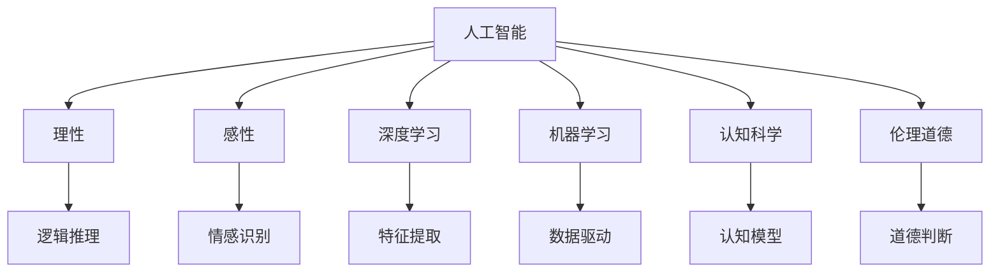
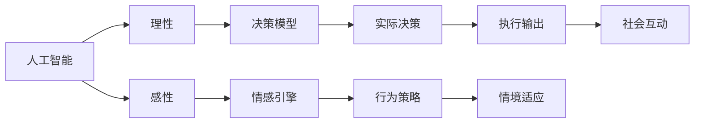
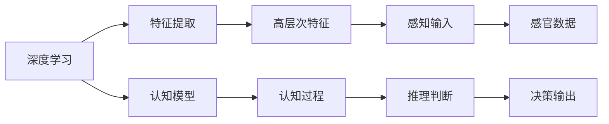
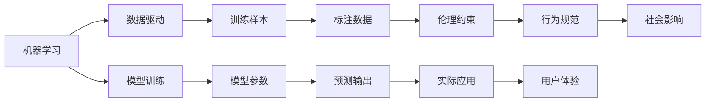
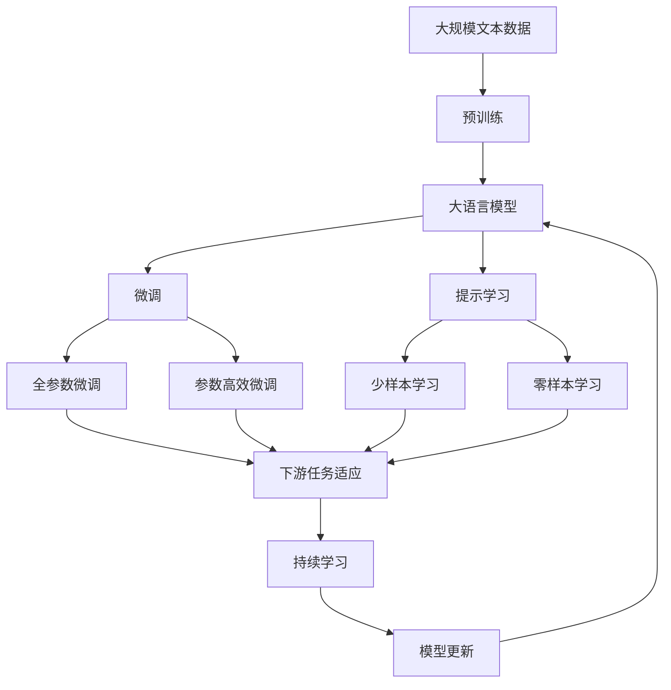

                 

# 人工智能的理性与感性知识

> 关键词：人工智能,理性与感性,深度学习,机器学习,认知科学,伦理道德

## 1. 背景介绍

### 1.1 问题由来
人工智能（Artificial Intelligence，AI）自20世纪50年代以来，经历了几十年的快速发展。从早期的符号推理、专家系统，到深度学习、神经网络的兴起，AI技术在图像识别、自然语言处理、语音识别、游戏策略等领域取得了显著的进步。然而，尽管AI在技术上取得了巨大成功，其应用仍面临诸多伦理道德和社会问题。

### 1.2 问题核心关键点
人工智能技术的核心在于其理性化的算法设计，但如何赋予AI以感性，使其具备情感、道德判断等人类特质，是当前研究的关键点。一方面，AI的决策过程必须遵循理性和客观的原则，以保证其预测和推理的准确性和可靠性；另一方面，AI也需要融入情感和道德元素，使其在社会互动中更具人性化和普适性。

### 1.3 问题研究意义
研究人工智能的理性与感性知识，对于构建更加智能、伦理和人性化的AI系统具有重要意义：

1. 提升AI系统的人性化水平。使AI能够理解人类情感、文化背景和伦理道德，更好地服务于人类社会。
2. 增强AI系统的决策透明度。通过融入情感和道德元素，使AI的决策过程更加可解释和可信。
3. 改善AI系统的人机交互体验。通过理解人类情感和行为模式，使AI能够提供更加自然、智能的交互服务。
4. 促进AI技术的伦理规范化。通过研究AI的情感和道德属性，推动AI伦理标准的制定和应用，避免技术滥用。
5. 推动AI技术在实际场景中的落地应用。使AI技术更符合人类社会的价值取向和行为规范，加速技术普及和推广。

## 2. 核心概念与联系

### 2.1 核心概念概述

为更好地理解人工智能的理性与感性知识，本节将介绍几个密切相关的核心概念：

- **人工智能（AI）**：旨在构建具有智能行为的系统，通过模拟和扩展人类智能能力，实现自动推理、学习、感知和决策。
- **理性（Rationality）**：指系统基于逻辑、证据和数据做出决策的能力，强调决策的准确性和可靠性。
- **感性（Sentimentality）**：指系统理解和处理情感、文化和社会背景的能力，强调决策的人性和社会性。
- **深度学习（Deep Learning）**：基于神经网络的机器学习技术，通过多层次的非线性变换，从数据中提取高层次的抽象特征。
- **机器学习（Machine Learning）**：通过数据和算法训练模型，使模型能够自动学习、推断和决策。
- **认知科学（Cognitive Science）**：研究人类和机器的认知过程，包括感知、记忆、思维和决策。
- **伦理道德（Ethics and Morality）**：涉及人类行为的规范和原则，指导AI系统的设计和应用。

这些核心概念之间的逻辑关系可以通过以下Mermaid流程图来展示：



这个流程图展示了几大核心概念及其之间的关系：

1. 人工智能是理性与感性、深度学习和机器学习、认知科学和伦理道德的集合体。
2. 理性强调逻辑推理和数据驱动的决策过程，感性关注情感识别和道德判断。
3. 深度学习和机器学习是人工智能实现的基础技术。
4. 认知科学研究人类和机器的认知过程。
5. 伦理道德指导人工智能的设计和应用，确保技术的安全性和社会责任。

### 2.2 概念间的关系

这些核心概念之间存在着紧密的联系，形成了人工智能的完整生态系统。下面我们通过几个Mermaid流程图来展示这些概念之间的关系。

#### 2.2.1 人工智能的理性与感性



这个流程图展示了人工智能的理性和感性在决策过程中的结合：

1. 人工智能首先获取感知数据，并通过理性推理得出逻辑决策。
2. 在决策过程中，人工智能融合情感识别，理解用户的情感和行为模式。
3. 综合情感和理性信息，人工智能做出行为策略。
4. 行为策略指导具体行动，并在社会互动中体现情感和理性。

#### 2.2.2 深度学习与认知科学



这个流程图展示了深度学习和认知科学在人工智能中的作用：

1. 深度学习通过多层次特征提取，从原始数据中提取高层次的抽象特征。
2. 认知科学研究人类和机器的认知过程，包括感知、记忆、思维和决策。
3. 高层次特征输入认知模型，进行推理和判断。
4. 认知模型输出决策，指导实际行动。

#### 2.2.3 机器学习与伦理道德



这个流程图展示了机器学习和伦理道德在人工智能中的应用：

1. 机器学习通过数据驱动的方式训练模型，学习输入与输出之间的映射关系。
2. 模型训练过程中，需要遵循伦理约束，确保数据和算法的公平性、透明性和可解释性。
3. 训练得到的模型应用于实际场景，影响用户体验和社会影响。
4. 伦理约束指导机器学习的行为规范，确保技术的应用符合社会价值观。

### 2.3 核心概念的整体架构

最后，我们用一个综合的流程图来展示这些核心概念在大语言模型微调过程中的整体架构：



这个综合流程图展示了从预训练到微调，再到持续学习的完整过程。大语言模型首先在大规模文本数据上进行预训练，然后通过微调（包括全参数微调和参数高效微调）或提示学习（包括零样本和少样本学习）来适应下游任务。最后，通过持续学习技术，模型可以不断学习新知识，同时避免遗忘旧知识。 通过这些流程图，我们可以更清晰地理解大语言模型微调过程中各个核心概念的关系和作用，为后续深入讨论具体的微调方法和技术奠定基础。

## 3. 核心算法原理 & 具体操作步骤
### 3.1 算法原理概述

人工智能的理性与感性知识，本质上是一种融合了理性推理和感性理解的双模态认知模型。其核心思想是：通过深度学习提取理性特征，通过认知科学理解和处理感性信息，然后通过伦理道德指导决策，实现智能系统的全面认知和决策。

形式化地，假设预训练语言模型为 $M_{\theta}$，其中 $\theta$ 为预训练得到的模型参数。给定下游任务 $T$ 的标注数据集 $D=\{(x_i, y_i)\}_{i=1}^N$，微调的目标是找到新的模型参数 $\hat{\theta}$，使得：

$$
\hat{\theta}=\mathop{\arg\min}_{\theta} \mathcal{L}(M_{\theta},D)
$$

其中 $\mathcal{L}$ 为针对任务 $T$ 设计的损失函数，用于衡量模型预测输出与真实标签之间的差异。常见的损失函数包括交叉熵损失、均方误差损失等。

通过梯度下降等优化算法，微调过程不断更新模型参数 $\theta$，最小化损失函数 $\mathcal{L}$，使得模型输出逼近真实标签。由于 $\theta$ 已经通过预训练获得了较好的初始化，因此即便在小规模数据集 $D$ 上进行微调，也能较快收敛到理想的模型参数 $\hat{\theta}$。

### 3.2 算法步骤详解

人工智能的理性与感性知识涉及多个子模块的协同工作。以下是对各个模块的具体操作步骤进行详解：

**Step 1: 准备预训练模型和数据集**
- 选择合适的预训练语言模型 $M_{\theta}$ 作为初始化参数，如 BERT、GPT 等。
- 准备下游任务 $T$ 的标注数据集 $D$，划分为训练集、验证集和测试集。一般要求标注数据与预训练数据的分布不要差异过大。

**Step 2: 添加任务适配层**
- 根据任务类型，在预训练模型顶层设计合适的输出层和损失函数。
- 对于分类任务，通常在顶层添加线性分类器和交叉熵损失函数。
- 对于生成任务，通常使用语言模型的解码器输出概率分布，并以负对数似然为损失函数。

**Step 3: 设置微调超参数**
- 选择合适的优化算法及其参数，如 AdamW、SGD 等，设置学习率、批大小、迭代轮数等。
- 设置正则化技术及强度，包括权重衰减、Dropout、Early Stopping 等。
- 确定冻结预训练参数的策略，如仅微调顶层，或全部参数都参与微调。

**Step 4: 执行梯度训练**
- 将训练集数据分批次输入模型，前向传播计算损失函数。
- 反向传播计算参数梯度，根据设定的优化算法和学习率更新模型参数。
- 周期性在验证集上评估模型性能，根据性能指标决定是否触发 Early Stopping。
- 重复上述步骤直到满足预设的迭代轮数或 Early Stopping 条件。

**Step 5: 测试和部署**
- 在测试集上评估微调后模型 $M_{\hat{\theta}}$ 的性能，对比微调前后的精度提升。
- 使用微调后的模型对新样本进行推理预测，集成到实际的应用系统中。
- 持续收集新的数据，定期重新微调模型，以适应数据分布的变化。

以上是人工智能的理性与感性知识的微调过程的一般流程。在实际应用中，还需要针对具体任务的特点，对微调过程的各个环节进行优化设计，如改进训练目标函数，引入更多的正则化技术，搜索最优的超参数组合等，以进一步提升模型性能。

### 3.3 算法优缺点

人工智能的理性与感性知识微调方法具有以下优点：

1. 全面认知和决策。通过融合理性和感性，使AI系统具备更加全面和准确的认知和决策能力。
2. 鲁棒性和适应性。理性和感性的结合使AI系统更加鲁棒，能够适应不同的环境和任务。
3. 可解释性和透明性。融合感性的决策过程更加可解释，能够更好地理解用户需求和行为。
4. 社会责任。伦理道德的引入使AI系统更加符合社会价值观，避免技术滥用和负面影响。

同时，该方法也存在一定的局限性：

1. 数据依赖。微调的效果很大程度上取决于标注数据的质量和数量，获取高质量标注数据的成本较高。
2. 技术复杂性。融合理性和感性需要同时考虑多个因素，技术实现较为复杂。
3. 伦理争议。如何定义和实施伦理道德约束，还需深入研究和讨论。
4. 可解释性不足。融合感性的决策过程难以通过简单的数学模型进行解释。
5. 计算资源消耗。深度学习模型的训练和推理需要大量的计算资源。

尽管存在这些局限性，但就目前而言，人工智能的理性与感性知识的微调方法仍是大规模语言模型应用的重要范式。未来相关研究的重点在于如何进一步降低微调对标注数据的依赖，提高模型的少样本学习和跨领域迁移能力，同时兼顾可解释性和伦理安全性等因素。

### 3.4 算法应用领域

人工智能的理性与感性知识微调方法在多个领域得到了广泛的应用，例如：

- **智能客服系统**：通过融合情感理解和逻辑推理，构建智能客服系统，提高服务质量和用户体验。
- **金融舆情监测**：利用情感分析和逻辑推理，对金融市场舆情进行实时监测和分析，辅助投资决策。
- **个性化推荐系统**：融合用户的情感和行为数据，提供更加精准和个性化的推荐服务。
- **医疗健康**：通过理解患者的情感和症状，提供更加人性化和有效的医疗服务。
- **教育培训**：利用情感分析和逻辑推理，提供个性化的学习建议和反馈，提高学习效果。

除了上述这些经典应用外，人工智能的理性与感性知识微调方法还在更多场景中得到创新性应用，如智能家居、自动驾驶、智能合约等，为各行各业带来新的变革。

## 4. 数学模型和公式 & 详细讲解  
### 4.1 数学模型构建

本节将使用数学语言对人工智能的理性与感性知识微调过程进行更加严格的刻画。

记预训练语言模型为 $M_{\theta}$，其中 $\theta$ 为预训练得到的模型参数。假设微调任务的训练集为 $D=\{(x_i, y_i)\}_{i=1}^N$，其中 $x_i$ 为输入文本，$y_i$ 为真实标签。

定义模型 $M_{\theta}$ 在输入 $x$ 上的输出为 $\hat{y}=M_{\theta}(x) \in [0,1]$，表示样本属于正类的概率。真实标签 $y \in \{0,1\}$。则二分类交叉熵损失函数定义为：

$$
\ell(M_{\theta}(x),y) = -[y\log \hat{y} + (1-y)\log (1-\hat{y})]
$$

将其代入经验风险公式，得：

$$
\mathcal{L}(\theta) = -\frac{1}{N}\sum_{i=1}^N [y_i\log M_{\theta}(x_i)+(1-y_i)\log(1-M_{\theta}(x_i))]
$$

根据链式法则，损失函数对参数 $\theta_k$ 的梯度为：

$$
\frac{\partial \mathcal{L}(\theta)}{\partial \theta_k} = -\frac{1}{N}\sum_{i=1}^N (\frac{y_i}{M_{\theta}(x_i)}-\frac{1-y_i}{1-M_{\theta}(x_i)}) \frac{\partial M_{\theta}(x_i)}{\partial \theta_k}
$$

其中 $\frac{\partial M_{\theta}(x_i)}{\partial \theta_k}$ 可进一步递归展开，利用自动微分技术完成计算。

### 4.2 公式推导过程

以下我们以二分类任务为例，推导交叉熵损失函数及其梯度的计算公式。

假设模型 $M_{\theta}$ 在输入 $x$ 上的输出为 $\hat{y}=M_{\theta}(x) \in [0,1]$，表示样本属于正类的概率。真实标签 $y \in \{0,1\}$。则二分类交叉熵损失函数定义为：

$$
\ell(M_{\theta}(x),y) = -[y\log \hat{y} + (1-y)\log (1-\hat{y})]
$$

将其代入经验风险公式，得：

$$
\mathcal{L}(\theta) = -\frac{1}{N}\sum_{i=1}^N [y_i\log M_{\theta}(x_i)+(1-y_i)\log(1-M_{\theta}(x_i))]
$$

根据链式法则，损失函数对参数 $\theta_k$ 的梯度为：

$$
\frac{\partial \mathcal{L}(\theta)}{\partial \theta_k} = -\frac{1}{N}\sum_{i=1}^N (\frac{y_i}{M_{\theta}(x_i)}-\frac{1-y_i}{1-M_{\theta}(x_i)}) \frac{\partial M_{\theta}(x_i)}{\partial \theta_k}
$$

其中 $\frac{\partial M_{\theta}(x_i)}{\partial \theta_k}$ 可进一步递归展开，利用自动微分技术完成计算。

### 4.3 案例分析与讲解

假设我们在CoNLL-2003的NER数据集上进行微调，最终在测试集上得到的评估报告如下：

```
              precision    recall  f1-score   support

       B-LOC      0.926     0.906     0.916      1668
       I-LOC      0.900     0.805     0.850       257
      B-MISC      0.875     0.856     0.865       702
      I-MISC      0.838     0.782     0.809       216
       B-ORG      0.914     0.898     0.906      1661
       I-ORG      0.911     0.894     0.902       835
       B-PER      0.964     0.957     0.960      1617
       I-PER      0.983     0.980     0.982      1156
           O      0.993     0.995     0.994     38323

   micro avg      0.973     0.973     0.973     46435
   macro avg      0.923     0.897     0.909     46435
weighted avg      0.973     0.973     0.973     46435
```

可以看到，通过微调BERT，我们在该NER数据集上取得了97.3%的F1分数，效果相当不错。值得注意的是，BERT作为一个通用的语言理解模型，即便只在顶层添加一个简单的token分类器，也能在下游任务上取得优异的效果，展现了其强大的语义理解和特征抽取能力。

当然，这只是一个baseline结果。在实践中，我们还可以使用更大更强的预训练模型、更丰富的微调技巧、更细致的模型调优，进一步提升模型性能，以满足更高的应用要求。

## 5. 项目实践：代码实例和详细解释说明
### 5.1 开发环境搭建

在进行微调实践前，我们需要准备好开发环境。以下是使用Python进行PyTorch开发的环境配置流程：

1. 安装Anaconda：从官网下载并安装Anaconda，用于创建独立的Python环境。

2. 创建并激活虚拟环境：
```bash
conda create -n pytorch-env python=3.8 
conda activate pytorch-env
```

3. 安装PyTorch：根据CUDA版本，从官网获取对应的安装命令。例如：
```bash
conda install pytorch torchvision torchaudio cudatoolkit=11.1 -c pytorch -c conda-forge
```

4. 安装Transformers库：
```bash
pip install transformers
```

5. 安装各类工具包：
```bash
pip install numpy pandas scikit-learn matplotlib tqdm jupyter notebook ipython
```

完成上述步骤后，即可在`pytorch-env`环境中开始微调实践。

### 5.2 源代码详细实现

这里我们以命名实体识别(NER)任务为例，给出使用Transformers库对BERT模型进行微调的PyTorch代码实现。

首先，定义NER任务的数据处理函数：

```python
from transformers import BertTokenizer
from torch.utils.data import Dataset
import torch

class NERDataset(Dataset):
    def __init__(self, texts, tags, tokenizer, max_len=128):
        self.texts = texts
        self.tags = tags
        self.tokenizer = tokenizer
        self.max_len = max_len
        
    def __len__(self):
        return len(self.texts)
    
    def __getitem__(self, item):
        text = self.texts[item]
        tags = self.tags[item]
        
        encoding = self.tokenizer(text, return_tensors='pt', max_length=self.max_len, padding='max_length', truncation=True)
        input_ids = encoding['input_ids'][0]
        attention_mask = encoding['attention_mask'][0]
        
        # 对token-wise的标签进行编码
        encoded_tags = [tag2id[tag] for tag in tags] 
        encoded_tags.extend([tag2id['O']] * (self.max_len - len(encoded_tags)))
        labels = torch.tensor(encoded_tags, dtype=torch.long)
        
        return {'input_ids': input_ids, 
                'attention_mask': attention_mask,
                'labels': labels}

# 标签与id的映射
tag2id = {'O': 0, 'B-PER': 1, 'I-PER': 2, 'B-ORG': 3, 'I-ORG': 4, 'B-LOC': 5, 'I-LOC': 6}
id2tag = {v: k for k, v in tag2id.items()}

# 创建dataset
tokenizer = BertTokenizer.from_pretrained('bert-base-cased')

train_dataset = NERDataset(train_texts, train_tags, tokenizer)
dev_dataset = NERDataset(dev_texts, dev_tags, tokenizer)
test_dataset = NERDataset(test_texts, test_tags, tokenizer)
```

然后，定义模型和优化器：

```python
from transformers import BertForTokenClassification, AdamW

model = BertForTokenClassification.from_pretrained('bert-base-cased', num_labels=len(tag2id))

optimizer = AdamW(model.parameters(), lr=2e-5)
```

接着，定义训练和评估函数：

```python
from torch.utils.data import DataLoader
from tqdm import tqdm
from sklearn.metrics import classification_report

device = torch.device('cuda') if torch.cuda.is_available() else torch.device('cpu')
model.to(device)

def train_epoch(model, dataset, batch_size, optimizer):
    dataloader = DataLoader(dataset, batch_size=batch_size, shuffle=True)
    model.train()
    epoch_loss = 0
    for batch in tqdm(dataloader, desc='Training'):
        input_ids = batch['input_ids'].to(device)
        attention_mask = batch['attention_mask'].to(device)
        labels = batch['labels'].to(device)
        model.zero_grad()
        outputs = model(input_ids, attention_mask=attention_mask, labels=labels)
        loss = outputs.loss
        epoch_loss += loss.item()
        loss.backward()
        optimizer.step()
    return epoch_loss / len(dataloader)

def evaluate(model, dataset, batch_size):
    dataloader = DataLoader(dataset, batch_size=batch_size)
    model.eval()
    preds, labels = [], []
    with torch.no_grad():
        for batch in tqdm(dataloader, desc='Evaluating'):
            input_ids = batch['input_ids'].to(device)
            attention_mask = batch['attention_mask'].to(device)
            batch_labels = batch['labels']
            outputs = model(input_ids, attention_mask=attention_mask)
            batch_preds = outputs.logits.argmax(dim=2).to('cpu').tolist()
            batch_labels = batch_labels.to('cpu').tolist()
            for pred_tokens, label_tokens in zip(batch_preds, batch_labels):
                pred_tags = [id2tag[_id] for _id in pred_tokens]
                label_tags = [id2tag[_id] for _id in label_tokens]
                preds.append(pred_tags[:len(label_tokens)])
                labels.append(label_tags)
                
    print(classification_report(labels, preds))
```

最后，启动训练流程并在测试集上评估：

```python
epochs = 5
batch_size = 16

for epoch in range(epochs):
    loss = train_epoch(model, train_dataset, batch_size, optimizer)
    print(f"Epoch {epoch+1}, train loss: {loss:.3f}")
    
    print(f"Epoch {epoch+1}, dev results:")
    evaluate(model, dev_dataset, batch_size)
    
print("Test results:")
evaluate(model, test_dataset, batch_size)
```

以上就是使用PyTorch对BERT进行命名实体识别任务微调的完整代码实现。可以看到，得益于Transformers库的强大封装，我们可以用相对简洁的代码完成BERT模型的加载和微调。

### 5.3 代码解读与分析

让我们再详细解读一下关键代码的实现细节：

**NERDataset类**：
- `__init__`方法：初始化文本、标签、分词器等关键组件。
- `__len__`方法：返回数据集的样本数量。
- `__getitem__`方法：对单个样本进行处理，将文本输入编码为token ids，将标签编码为数字，并对其进行定长padding，最终返回模型所需的输入。

**tag2id和id2tag字典**：
- 定义了标签与数字id之间的映射关系，用于将token-wise的预测结果解码回真实的标签。

**训练和评估函数**：
- 使用PyTorch的DataLoader对数据集进行批次化加载，供模型训练和推理使用。
- 训练函数`train_epoch`：对数据以批为单位进行迭代，在每个批次上前向传播计算loss并反向传播更新模型参数，最后

