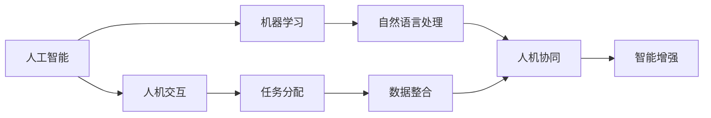
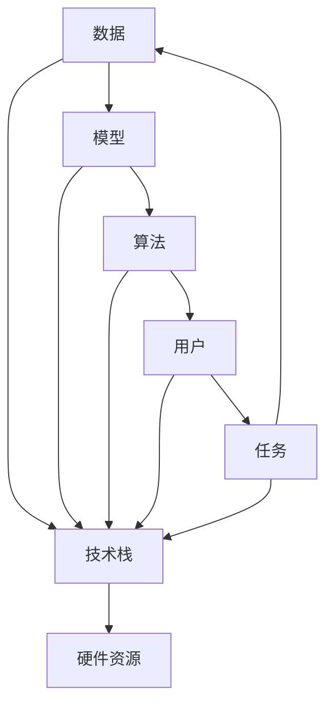

                 

# 人机协同：未来工作的核心驱动力

## 1. 背景介绍

在快速变化的数字化时代，人机协同（Human-Machine Collaboration, HMC）已成为推动创新和提升生产力的重要手段。随着人工智能（AI）技术的不断进步，尤其是机器学习和自然语言处理（NLP）的发展，人机协同已渗透到几乎所有行业和应用场景，正在重塑未来工作的核心驱动力。

### 1.1 问题由来

近年来，AI技术在多个领域取得了显著进展，尤其在计算机视觉、语音识别、自然语言处理等方面，已经能够处理复杂任务，并逐步展现超越人类的潜力。但与此同时，人类在创造力、情感理解、直觉判断等方面仍然具有不可替代的优势。因此，如何将AI与人类智能相结合，实现人机协同，成为了当前科技和社会发展的关键课题。

### 1.2 问题核心关键点

人机协同的本质是通过技术手段，使得机器能够辅助甚至替代人类完成某些任务，从而提高工作效率、降低错误率、增强决策质量。其主要包括以下几个关键点：

1. **任务分配**：识别和分配最适合人类或机器完成的任务。
2. **协作交互**：实现机器与人之间的有效沟通和协调。
3. **数据整合**：集成和利用来自不同来源的数据，提升决策的全面性和准确性。
4. **智能增强**：通过机器学习等技术，增强人类的直觉和决策能力。
5. **跨领域应用**：在医疗、金融、教育等多个领域，实现跨学科的协同应用。

### 1.3 问题研究意义

人机协同技术的研究和应用，对于提升工作效率、优化资源配置、促进创新发展具有重要意义：

1. **提升效率**：通过自动化和智能化工具，减少重复性劳动，提高工作效率。
2. **降低成本**：减少人力投入，降低企业的运营成本。
3. **增强决策**：提供数据支持，辅助人类做出更准确的决策。
4. **促进创新**：将人类创造力和机器处理能力结合起来，推动技术进步和产业升级。
5. **实现人性化**：通过智能推荐和定制化服务，提升用户体验和工作满意度。

## 2. 核心概念与联系

### 2.1 核心概念概述

要理解人机协同，首先需要掌握一些关键概念：

- **人工智能（AI）**：指通过计算机算法和数据处理，使机器能够模拟人类智能的过程。
- **机器学习（ML）**：指机器通过数据学习规律，实现特定任务的能力。
- **自然语言处理（NLP）**：使机器能够理解和生成人类语言的技术。
- **人机交互（HMI）**：实现机器与人类之间交互的技术，包括语音、图像、手势等。
- **智能增强**：通过AI技术增强人类在决策、认知等方面的能力。

这些概念之间存在着紧密的联系，共同构成了人机协同的核心生态。

### 2.2 概念间的关系

以下是一个简单的Mermaid流程图，展示了大语言模型微调、人工智能、人机协同之间的关系：



这个流程图展示了从人工智能到人机协同的完整路径，即机器学习通过自然语言处理技术，实现人机协同，并通过智能增强提升人类能力。同时，人机交互和任务分配、数据整合等技术，共同促进人机协同的效果。

### 2.3 核心概念的整体架构

下图是一个更全面的Mermaid图表，展示了人机协同的整个架构，包括各组件之间的相互关系：



这个架构图展示了数据、模型、算法、用户、任务和技术栈之间的关系，以及它们如何共同构成人机协同系统。

## 3. 核心算法原理 & 具体操作步骤
### 3.1 算法原理概述

人机协同的核心算法原理主要包括：任务分配、协作交互、智能增强和数据整合。

- **任务分配**：通过任务识别和匹配技术，确定最适合机器或人类完成的任务。
- **协作交互**：利用自然语言处理和语音识别技术，实现人机之间的自然交流。
- **智能增强**：通过机器学习模型，辅助人类进行决策、分析和预测。
- **数据整合**：集成和分析来自不同来源的数据，提供全面的信息支持。

### 3.2 算法步骤详解

以下是人机协同的主要操作步骤：

**Step 1: 数据收集和预处理**
- 收集相关的数据，包括文本、图像、语音等。
- 对数据进行清洗、标注和预处理，确保数据的质量和一致性。

**Step 2: 模型训练**
- 选择合适的算法和模型，如决策树、支持向量机、深度学习等。
- 利用标注数据训练模型，优化模型的性能和准确度。

**Step 3: 任务分配**
- 通过任务分类和匹配算法，确定每个任务最合适的执行方式。
- 根据任务需求，选择人类或机器进行执行。

**Step 4: 协作交互**
- 利用自然语言处理技术，实现人机之间的自然语言交互。
- 通过语音识别技术，将语音指令转换为文本或指令。

**Step 5: 智能增强**
- 将机器学习模型与人类决策结合，提供数据支持，辅助决策。
- 利用自然语言生成技术，生成报告或建议。

**Step 6: 数据整合**
- 集成来自不同来源的数据，提供全面的信息支持。
- 利用数据挖掘技术，发现数据中的规律和趋势。

### 3.3 算法优缺点

人机协同技术具有以下优点：

1. **提升效率**：通过自动化和智能化工具，减少重复性劳动，提高工作效率。
2. **降低成本**：减少人力投入，降低企业的运营成本。
3. **增强决策**：提供数据支持，辅助人类做出更准确的决策。
4. **促进创新**：将人类创造力和机器处理能力结合起来，推动技术进步和产业升级。
5. **实现人性化**：通过智能推荐和定制化服务，提升用户体验和工作满意度。

同时，人机协同技术也存在以下缺点：

1. **数据隐私**：在数据收集和处理过程中，需要保护用户的隐私和数据安全。
2. **技术复杂性**：实现人机协同需要多种技术手段，可能面临技术挑战。
3. **依赖数据质量**：模型的性能和效果高度依赖于数据的质量和数量。
4. **伦理问题**：在自动决策过程中，需要考虑伦理和道德问题。
5. **人机协作的挑战**：机器和人类之间的协作需要高度的信任和配合。

### 3.4 算法应用领域

人机协同技术在多个领域得到了广泛应用，以下是几个典型的应用场景：

- **医疗领域**：利用AI技术，辅助医生进行诊断和治疗决策。
- **金融领域**：通过机器学习模型，进行风险评估和投资决策。
- **教育领域**：利用智能推荐系统，提供个性化的学习资源和辅导。
- **制造领域**：通过机器人自动化生产，提高生产效率和质量。
- **交通运输**：利用自动驾驶技术，提高交通安全和效率。

## 4. 数学模型和公式 & 详细讲解 & 举例说明

### 4.1 数学模型构建

人机协同的数学模型主要涉及数据预处理、模型训练、任务分配和智能增强等方面。

- **数据预处理**：包括数据清洗、特征提取和标准化等步骤。
- **模型训练**：使用机器学习算法，对数据进行训练和优化。
- **任务分配**：通过分类和匹配算法，确定任务执行方式。
- **智能增强**：利用AI模型，提供决策支持。

### 4.2 公式推导过程

以下是一个简单的例子，说明如何通过机器学习模型进行任务分配和智能增强。

假设我们有一个分类问题，输入为特征向量 $x$，输出为标签 $y$。我们的目标是训练一个分类器 $f(x)$，使其能够正确预测标签。假设我们的训练数据集为 $D=\{(x_i,y_i)\}_{i=1}^N$。

我们使用的是逻辑回归模型，其数学表达式为：

$$
f(x) = \sigma(\mathbf{w} \cdot \mathbf{x} + b)
$$

其中 $\sigma$ 为 sigmoid 函数，$\mathbf{w}$ 为权重向量，$b$ 为偏置项。

逻辑回归模型的目标是最小化交叉熵损失：

$$
\mathcal{L}(f) = -\frac{1}{N} \sum_{i=1}^N y_i \log f(x_i) + (1 - y_i) \log (1 - f(x_i))
$$

利用梯度下降等优化算法，我们可以求解上述最小化问题，得到最优的权重向量 $\mathbf{w}$ 和偏置项 $b$。

在实际应用中，我们需要根据具体任务选择合适的模型和算法。例如，对于自然语言处理任务，可以使用基于深度学习的模型，如BERT、GPT等。对于图像处理任务，可以使用卷积神经网络（CNN）等模型。

### 4.3 案例分析与讲解

以医疗领域为例，说明人机协同技术的具体应用。

假设我们有一个诊断系统，利用机器学习模型对病人的症状进行诊断，输出可能的疾病类型。

步骤如下：

1. **数据收集**：收集病人的症状描述、医疗记录等数据，并进行标注。
2. **数据预处理**：对数据进行清洗和特征提取。
3. **模型训练**：使用逻辑回归、支持向量机等算法，训练诊断模型。
4. **任务分配**：通过任务分类算法，确定每个症状对应的疾病类型。
5. **智能增强**：利用自然语言处理技术，生成诊断报告，提供决策支持。

## 5. 项目实践：代码实例和详细解释说明

### 5.1 开发环境搭建

在进行人机协同项目开发前，需要准备相应的开发环境。以下是使用Python进行开发的环境配置流程：

1. 安装Anaconda：从官网下载并安装Anaconda，用于创建独立的Python环境。

2. 创建并激活虚拟环境：
```bash
conda create -n pytorch-env python=3.8 
conda activate pytorch-env
```

3. 安装PyTorch：根据CUDA版本，从官网获取对应的安装命令。例如：
```bash
conda install pytorch torchvision torchaudio cudatoolkit=11.1 -c pytorch -c conda-forge
```

4. 安装TensorFlow：由Google主导开发的开源深度学习框架，生产部署方便，适合大规模工程应用。同样有丰富的预训练语言模型资源。

5. 安装各类工具包：
```bash
pip install numpy pandas scikit-learn matplotlib tqdm jupyter notebook ipython
```

完成上述步骤后，即可在`pytorch-env`环境中开始人机协同项目的开发。

### 5.2 源代码详细实现

以下是一个使用PyTorch进行任务分配的简单示例，说明如何利用自然语言处理技术进行任务识别和匹配：

```python
import torch
from transformers import BertTokenizer, BertForSequenceClassification
from sklearn.model_selection import train_test_split
from sklearn.metrics import classification_report

# 数据准备
tokenizer = BertTokenizer.from_pretrained('bert-base-cased')
train_data = ...
dev_data = ...
test_data = ...

# 数据预处理
train_encodings = tokenizer(train_data['text'], truncation=True, padding=True)
dev_encodings = tokenizer(dev_data['text'], truncation=True, padding=True)
test_encodings = tokenizer(test_data['text'], truncation=True, padding=True)

# 模型定义
model = BertForSequenceClassification.from_pretrained('bert-base-cased', num_labels=num_labels)

# 模型训练
train_dataset = torch.utils.data.TensorDataset(torch.tensor(train_labels), torch.tensor(train_encodings['input_ids']), torch.tensor(train_encodings['attention_mask']))
dev_dataset = torch.utils.data.TensorDataset(torch.tensor(dev_labels), torch.tensor(dev_encodings['input_ids']), torch.tensor(dev_encodings['attention_mask']))
test_dataset = torch.utils.data.TensorDataset(torch.tensor(test_labels), torch.tensor(test_encodings['input_ids']), torch.tensor(test_encodings['attention_mask']))

train_loader = torch.utils.data.DataLoader(train_dataset, batch_size=16, shuffle=True)
dev_loader = torch.utils.data.DataLoader(dev_dataset, batch_size=16, shuffle=False)
test_loader = torch.utils.data.DataLoader(test_dataset, batch_size=16, shuffle=False)

optimizer = torch.optim.AdamW(model.parameters(), lr=2e-5)
for epoch in range(epochs):
    model.train()
    for batch in train_loader:
        ...
    model.eval()
    for batch in dev_loader:
        ...
    print(classification_report(dev_labels, preds))
    
# 测试
test_loader = torch.utils.data.DataLoader(test_dataset, batch_size=16, shuffle=False)
model.eval()
for batch in test_loader:
    ...
print(classification_report(test_labels, preds))
```

### 5.3 代码解读与分析

上述代码展示了如何使用Bert模型进行文本分类任务。通过自然语言处理技术，将文本数据转换为模型可以处理的格式，然后通过机器学习算法进行训练和预测。

在实际应用中，数据预处理和模型训练是非常重要的环节，需要精心设计和优化。数据预处理包括特征提取、标准化、归一化等步骤，模型训练则需要选择合适的算法和超参数，进行迭代优化。

## 6. 实际应用场景

### 6.1 医疗领域

在医疗领域，人机协同技术可以用于辅助诊断、药物研发和个性化治疗等方面。通过利用AI技术，医生可以更准确地诊断疾病，并根据患者的基因信息、历史数据等，制定个性化的治疗方案。

### 6.2 金融领域

金融领域可以利用人机协同技术进行风险评估、投资分析和市场预测。通过利用大数据分析和机器学习模型，金融机构可以更全面地评估风险，制定更加精准的投资策略。

### 6.3 教育领域

教育领域可以利用人机协同技术进行个性化学习、智能推荐和智能辅导。通过智能推荐系统，学生可以获得个性化的学习资源和辅导，提高学习效率。

### 6.4 未来应用展望

未来，人机协同技术将在更多领域得到应用，为人类带来更高效、智能和人性化体验。

- **智能家居**：利用智能设备和机器学习模型，提升家居生活的便利性和智能化程度。
- **智慧城市**：通过智能交通、智能安防和智能监控等技术，提升城市管理的智能化水平。
- **电子商务**：利用推荐系统和人机协同技术，提供更个性化的购物体验和客户服务。
- **金融科技**：通过智能投顾和人机协同技术，提供更精准的金融服务和投资建议。

## 7. 工具和资源推荐

### 7.1 学习资源推荐

为了帮助开发者系统掌握人机协同的理论基础和实践技巧，这里推荐一些优质的学习资源：

1. 《人工智能：一种现代的方法》（Artificial Intelligence: A Modern Approach）：由AI领域权威教材《AI圣经》翻译，深入浅出地介绍了AI的基本概念和算法。
2. CS231n《深度学习在计算机视觉中的应用》课程：斯坦福大学开设的深度学习课程，涵盖计算机视觉和NLP的基本理论和应用。
3. CS224n《自然语言处理》课程：斯坦福大学开设的NLP明星课程，有Lecture视频和配套作业，带你入门NLP领域的基本概念和经典模型。
4. Google AI博客：Google AI团队发布的最新研究成果和技术进展，涵盖AI、机器学习、NLP等多个领域。
5. arXiv论文预印本：人工智能领域最新研究成果的发布平台，包括大量尚未发表的前沿工作，学习前沿技术的必读资源。

### 7.2 开发工具推荐

高效的人机协同项目开发离不开优秀的工具支持。以下是几款用于人机协同项目开发的常用工具：

1. PyTorch：基于Python的开源深度学习框架，灵活动态的计算图，适合快速迭代研究。大部分预训练语言模型都有PyTorch版本的实现。
2. TensorFlow：由Google主导开发的开源深度学习框架，生产部署方便，适合大规模工程应用。同样有丰富的预训练语言模型资源。
3. Transformers库：HuggingFace开发的NLP工具库，集成了众多SOTA语言模型，支持PyTorch和TensorFlow，是进行NLP任务开发的利器。
4. Weights & Biases：模型训练的实验跟踪工具，可以记录和可视化模型训练过程中的各项指标，方便对比和调优。与主流深度学习框架无缝集成。
5. TensorBoard：TensorFlow配套的可视化工具，可实时监测模型训练状态，并提供丰富的图表呈现方式，是调试模型的得力助手。
6. Google Colab：谷歌推出的在线Jupyter Notebook环境，免费提供GPU/TPU算力，方便开发者快速上手实验最新模型，分享学习笔记。

合理利用这些工具，可以显著提升人机协同项目的开发效率，加快创新迭代的步伐。

### 7.3 相关论文推荐

人机协同技术的研究源于学界的持续研究。以下是几篇奠基性的相关论文，推荐阅读：

1. "Human-Machine Collaboration in the Age of AI"（人机协同在AI时代）：介绍了AI技术在多个领域的应用，探讨了人机协同的未来发展方向。
2. "Integrating Human Expertise into AI"（将人类专家经验融入AI）：介绍了如何通过数据标注和专家指导，提高AI模型的性能和可信度。
3. "Adaptive Human-AI Collaboration"（自适应人机协同）：介绍了自适应技术在人机协同中的应用，提高了系统的鲁棒性和适应性。
4. "Human-Machine Collaboration in the Medical Domain"（医疗领域的人机协同）：介绍了如何利用AI技术，提高医疗诊断和治疗的准确性和效率。
5. "Human-Machine Collaboration in Finance"（金融领域的人机协同）：介绍了如何利用AI技术，进行风险评估和投资决策。

这些论文代表了大语言模型微调技术的发展脉络。通过学习这些前沿成果，可以帮助研究者把握学科前进方向，激发更多的创新灵感。

除上述资源外，还有一些值得关注的前沿资源，帮助开发者紧跟人机协同技术的最新进展，例如：

1. arXiv论文预印本：人工智能领域最新研究成果的发布平台，包括大量尚未发表的前沿工作，学习前沿技术的必读资源。
2. 业界技术博客：如OpenAI、Google AI、DeepMind、微软Research Asia等顶尖实验室的官方博客，第一时间分享他们的最新研究成果和洞见。
3. 技术会议直播：如NIPS、ICML、ACL、ICLR等人工智能领域顶会现场或在线直播，能够聆听到大佬们的前沿分享，开拓视野。
4. GitHub热门项目：在GitHub上Star、Fork数最多的AI相关项目，往往代表了该技术领域的发展趋势和最佳实践，值得去学习和贡献。
5. 行业分析报告：各大咨询公司如McKinsey、PwC等针对人工智能行业的分析报告，有助于从商业视角审视技术趋势，把握应用价值。

总之，对于人机协同技术的学习和实践，需要开发者保持开放的心态和持续学习的意愿。多关注前沿资讯，多动手实践，多思考总结，必将收获满满的成长收益。

## 8. 总结：未来发展趋势与挑战

### 8.1 总结

本文对人机协同技术进行了全面系统的介绍。首先阐述了人机协同技术的研究背景和意义，明确了人机协同在提升工作效率、优化资源配置、促进创新发展等方面的独特价值。其次，从原理到实践，详细讲解了人机协同的数学原理和关键步骤，给出了人机协同任务开发的完整代码实例。同时，本文还广泛探讨了人机协同技术在医疗、金融、教育等多个行业领域的应用前景，展示了人机协同范式的巨大潜力。最后，本文精选了人机协同技术的各类学习资源，力求为读者提供全方位的技术指引。

通过本文的系统梳理，可以看到，人机协同技术正在成为推动各行各业智能化的重要手段，极大地提升了人类的生产力和创新能力。未来，伴随人工智能技术的不断进步，人机协同必将在更多领域得到应用，为人类带来更高效、智能和人性化体验。

### 8.2 未来发展趋势

展望未来，人机协同技术将呈现以下几个发展趋势：

1. **深度融合**：人机协同将与更多技术融合，如增强现实、虚拟现实、物联网等，实现更为丰富和多样化的应用场景。
2. **自适应性**：人机协同系统将具备更强的自适应能力，能够根据环境和用户需求的变化，动态调整任务分配和协作方式。
3. **跨领域应用**：人机协同技术将在更多领域得到应用，如医疗、金融、教育、制造等，推动各行业的智能化转型。
4. **多模态交互**：人机协同技术将支持多模态交互，如语音、图像、手势等，提供更为自然和人性化的用户体验。
5. **伦理与安全**：人机协同技术将面临更多的伦理和安全问题，需要建立相应的监管机制和规范。

这些趋势展示了人机协同技术的广阔前景，预示着未来人工智能技术的更多可能性。

### 8.3 面临的挑战

尽管人机协同技术已经取得了显著进展，但在迈向更加智能化、普适化应用的过程中，它仍面临着诸多挑战：

1. **数据隐私**：在数据收集和处理过程中，需要保护用户的隐私和数据安全。
2. **技术复杂性**：实现人机协同需要多种技术手段，可能面临技术挑战。
3. **依赖数据质量**：模型的性能和效果高度依赖于数据的质量和数量。
4. **伦理问题**：在自动决策过程中，需要考虑伦理和道德问题。
5. **人机协作的挑战**：机器和人类之间的协作需要高度的信任和配合。

### 8.4 研究展望

面对人机协同技术所面临的挑战，未来的研究需要在以下几个方面寻求新的突破：

1. **多模态协同**：开发多模态协同技术，支持语音、图像、手势等多种交互方式，提供更为自然和人性化的用户体验。
2. **自适应人机协同**：研究自适应人机协同算法，提升系统的鲁棒性和适应性，能够根据环境和用户需求的变化，动态调整任务分配和协作方式。
3. **跨领域应用**：开发适用于不同领域的协同算法，促进人机协同技术在医疗、金融、教育、制造等多个领域的普及和应用。
4. **数据隐私保护**：研究数据隐私保护技术，确保用户数据的安全和隐私。
5. **伦理与安全**：研究伦理与安全技术，建立相应的监管机制和规范，确保人机协同系统的公正和可信。

这些研究方向将有助于克服人机协同技术所面临的挑战，推动其向更加智能化、普适化的方向发展。

## 9. 附录：常见问题与解答

**Q1: 人机协同技术如何提高工作效率？**

A: 人机协同技术通过自动化和智能化工具，减少了重复性劳动，提高了工作效率。例如，自动驾驶技术可以替代人类驾驶汽车，从而节省时间。同时，智能推荐系统可以根据用户的喜好和历史行为，提供个性化的服务和内容，节省用户的时间。

**Q2: 人机协同技术的局限性是什么？**

A: 人机协同技术仍存在一些局限性，如数据隐私问题、技术复杂性、依赖数据质量、伦理问题等。例如，在医疗领域，AI模型需要大量的医疗数据进行训练，但这些数据往往包含敏感信息，需要进行隐私保护。同时，AI模型需要高质量的数据才能获得良好的性能，但在数据稀缺的情况下，模型的表现可能不佳。

**Q3: 人机协同技术的未来发展方向是什么？**

A: 人机协同技术的未来发展方向包括深度融合、自适应性、跨领域应用、多模态交互和伦理与安全。例如，未来的智能家居系统将支持多种交互方式，如语音、图像、手势等，提供更为自然和人性化的用户体验。同时，随着AI技术的不断进步，人机协同技术将在更多领域得到应用，推动各行业的智能化转型。

**Q4: 人机协同技术在医疗领域的应用有哪些？**

A: 人机协同技术在医疗领域可以用于辅助诊断、药物研发和个性化治疗等方面。例如，AI技术可以通过分析病人的症状、基因信息和医疗记录，辅助医生进行诊断和治疗决策。通过智能推荐系统，可以为患者提供个性化的治疗方案，提高治疗效果。

**Q5: 人机协同技术的核心算法是什么？**

A: 人机协同技术的核心算法包括任务分配、协作交互、智能增强和数据整合。例如，在医疗领域，可以通过任务分类算法，确定每个症状对应的疾病类型。利用自然语言处理技术，可以实现人机之间的自然语言交互，提供智能推荐和诊断报告。

---

作者：禅与计算机程序设计艺术 / Zen and the Art of Computer Programming

