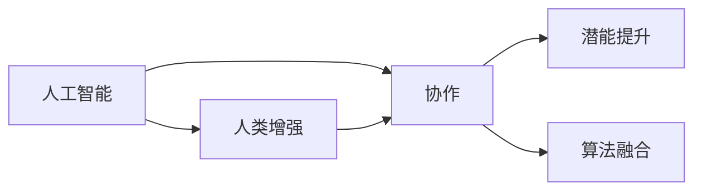
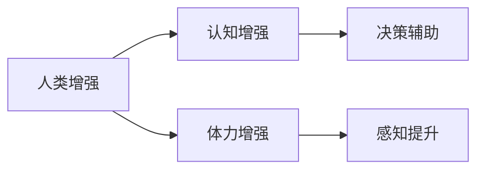
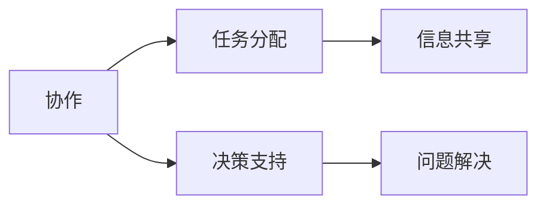
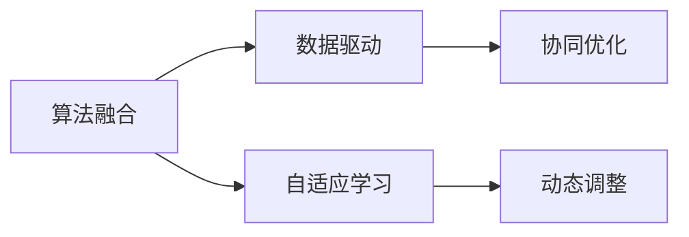
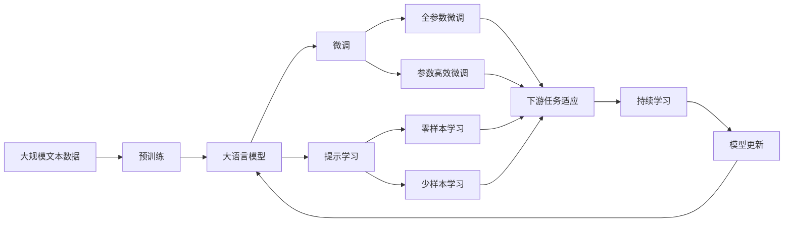

                 

# 人类-AI协作：增强人类潜能与AI能力的融合发展趋势预测分析机遇趋势分析预测

> 关键词：
**人工智能 (AI), 人类增强, 协作, 潜能提升, 算法融合, 未来趋势**

## 1. 背景介绍

### 1.1 问题由来
随着人工智能技术的快速发展，人类与AI的协作正在变得日益密切。从简单的数据处理到复杂的系统决策，AI的辅助能力让人们能够更加高效地完成任务。然而，如何更好地将AI技术融入人类工作中，提升人类潜能和能力，成为了当前研究的热点。

### 1.2 问题核心关键点
人类-AI协作的核心在于如何利用AI的计算能力、学习能力以及自动化能力，来增强人类的判断力、决策力和创造力。AI与人类之间的协作需要考虑技术、社会、伦理等多个方面，才能真正实现双赢的效果。

### 1.3 问题研究意义
通过分析人类-AI协作的发展趋势，研究如何更好地将AI技术与人类潜能融合，不仅有助于提升工作效率，还能推动社会的整体进步。以下是几个关键研究意义：

1. **效率提升**：AI技术能够处理大量重复性、高计算需求的任务，释放人类的时间和精力，专注于更有价值的工作。
2. **决策优化**：AI能够提供数据驱动的洞察和预测，帮助人类做出更加科学、精确的决策。
3. **知识共享**：AI可以作为人类知识的扩展和补充，加速知识积累和传播。
4. **创新激发**：AI技术可以提供新思路、新方法，激发人类的创新能力。
5. **社会进步**：AI与人类的协作能够提升公共服务的效率和质量，促进社会福祉。

## 2. 核心概念与联系

### 2.1 核心概念概述

为更好地理解人类-AI协作的概念与方法，本节将介绍几个关键概念及其之间的联系。

- **人工智能 (AI)**：通过算法和模型，让计算机系统具备类似于人类的智能，能够感知、理解、学习、推理和决策。
- **人类增强 (Human Augmentation)**：利用技术手段增强人类的认知、体力、感知等能力，提升人类工作和生活质量。
- **协作 (Collaboration)**：人类与AI在特定任务上的协同工作，共同解决问题。
- **潜能提升 (Potential Enhancement)**：通过AI技术，拓展人类的知识边界，提升认知水平和实践能力。
- **算法融合 (Algorithmic Integration)**：将AI算法和人类认知、决策机制相结合，构建更高效的协同系统。

这些概念之间的联系可以通过以下Mermaid流程图来展示：



这个流程图展示了大语言模型微调过程中各个核心概念之间的关系：

1. AI通过增强人类的能力，提升其潜力。
2. 人类和AI在特定任务上协同工作。
3. 算法融合将AI与人类能力结合，构建高效协同系统。

### 2.2 概念间的关系

这些核心概念之间的关系通过以下几个Mermaid流程图进一步解释：

#### 2.2.1 人类增强和AI的关系



这个流程图展示了人类增强的具体应用领域和AI的辅助作用。

#### 2.2.2 协作和潜能提升的关系



这个流程图展示了协作如何帮助人类提升潜能的具体机制。

#### 2.2.3 算法融合和未来趋势的关系



这个流程图展示了算法融合如何推动未来技术趋势的发展。

### 2.3 核心概念的整体架构

最后，我们用一个综合的流程图来展示这些核心概念在大语言模型微调过程中的整体架构：



这个综合流程图展示了从预训练到微调，再到持续学习的完整过程，以及各个概念之间的联系。

## 3. 核心算法原理 & 具体操作步骤
### 3.1 算法原理概述

人类-AI协作的核心在于如何利用AI的能力，通过协同工作，提升人类的潜能和能力。这通常涉及以下几个步骤：

1. **数据收集**：收集与特定任务相关的数据，这些数据可以来自人类工作历史、专家知识库等。
2. **预训练模型**：使用大语言模型等预训练模型作为基线，通过大规模数据集进行预训练，学习通用的语言表示。
3. **任务适配**：针对具体任务，设计合适的输出层和损失函数，微调模型以适应特定任务的性能需求。
4. **协同工作**：人类和AI在任务执行过程中进行信息交互，AI提供决策建议，人类做出最终决策。
5. **持续改进**：通过不断的反馈和学习，优化模型，提升协作效果。

### 3.2 算法步骤详解

以下是人类-AI协作的具体操作步骤：

1. **数据准备**：准备与任务相关的标注数据集，划分为训练集、验证集和测试集。
2. **模型选择**：选择合适的预训练模型，如BERT、GPT等。
3. **任务适配**：根据任务类型，设计输出层和损失函数。例如，对于分类任务，通常使用线性分类器和交叉熵损失函数。
4. **微调训练**：在训练集上进行有监督的微调，优化模型以适应特定任务。使用合适的优化算法和超参数，如AdamW、SGD等，设置学习率、批大小、迭代轮数等。
5. **模型评估**：在验证集上评估模型性能，选择最优模型。
6. **协同工作**：在实际应用场景中，将微调后的模型与人类协作，共同解决问题。

### 3.3 算法优缺点

人类-AI协作方法具有以下优点：

- **效率提升**：AI可以处理大量重复性任务，提高工作效率。
- **决策优化**：AI提供数据驱动的洞察，辅助人类做出科学决策。
- **知识扩展**：AI可以作为人类知识的扩展，加速知识传播。
- **创新激发**：AI提供新思路和新方法，激发人类创新能力。

然而，这些方法也存在一些缺点：

- **依赖高质量数据**：微调的效果很大程度上取决于标注数据的质量和数量。
- **模型泛化能力有限**：当任务与预训练数据的分布差异较大时，微调的性能提升有限。
- **可解释性不足**：AI模型的决策过程通常缺乏可解释性。
- **安全性和伦理问题**：AI模型可能引入偏见和有害信息，存在安全性和伦理问题。

### 3.4 算法应用领域

人类-AI协作在多个领域都有广泛应用，包括但不限于以下几个方面：

- **医疗诊断**：AI辅助医生进行疾病诊断和治疗方案制定。
- **金融分析**：AI提供市场分析、风险评估等决策支持。
- **教育培训**：AI辅助教师进行个性化教学和评估。
- **自动驾驶**：AI提供车辆控制和路径规划。
- **智能家居**：AI控制家居设备，提供生活便利。
- **虚拟助手**：AI提供自然语言交互，帮助人类完成任务。

这些应用展示了AI与人类协作的巨大潜力，未来还将拓展到更多领域。

## 4. 数学模型和公式 & 详细讲解 & 举例说明

### 4.1 数学模型构建

假设预训练模型为 $M_{\theta}$，其中 $\theta$ 为预训练得到的模型参数。给定下游任务 $T$ 的标注数据集 $D=\{(x_i, y_i)\}_{i=1}^N, x_i \in \mathcal{X}, y_i \in \mathcal{Y}$。

定义模型 $M_{\theta}$ 在数据样本 $(x,y)$ 上的损失函数为 $\ell(M_{\theta}(x),y)$，则在数据集 $D$ 上的经验风险为：

$$
\mathcal{L}(\theta) = \frac{1}{N} \sum_{i=1}^N \ell(M_{\theta}(x_i),y_i)
$$

微调的优化目标是最小化经验风险，即找到最优参数：

$$
\theta^* = \mathop{\arg\min}_{\theta} \mathcal{L}(\theta)
$$

在实践中，我们通常使用基于梯度的优化算法（如SGD、Adam等）来近似求解上述最优化问题。设 $\eta$ 为学习率，$\lambda$ 为正则化系数，则参数的更新公式为：

$$
\theta \leftarrow \theta - \eta \nabla_{\theta}\mathcal{L}(\theta) - \eta\lambda\theta
$$

其中 $\nabla_{\theta}\mathcal{L}(\theta)$ 为损失函数对参数 $\theta$ 的梯度，可通过反向传播算法高效计算。

### 4.2 公式推导过程

以二分类任务为例，推导交叉熵损失函数及其梯度的计算公式。

假设模型 $M_{\theta}$ 在输入 $x$ 上的输出为 $\hat{y}=M_{\theta}(x) \in [0,1]$，表示样本属于正类的概率。真实标签 $y \in \{0,1\}$。则二分类交叉熵损失函数定义为：

$$
\ell(M_{\theta}(x),y) = -[y\log \hat{y} + (1-y)\log (1-\hat{y})]
$$

将其代入经验风险公式，得：

$$
\mathcal{L}(\theta) = -\frac{1}{N}\sum_{i=1}^N [y_i\log M_{\theta}(x_i)+(1-y_i)\log(1-M_{\theta}(x_i))]
$$

根据链式法则，损失函数对参数 $\theta_k$ 的梯度为：

$$
\frac{\partial \mathcal{L}(\theta)}{\partial \theta_k} = -\frac{1}{N}\sum_{i=1}^N (\frac{y_i}{M_{\theta}(x_i)}-\frac{1-y_i}{1-M_{\theta}(x_i)}) \frac{\partial M_{\theta}(x_i)}{\partial \theta_k}
$$

其中 $\frac{\partial M_{\theta}(x_i)}{\partial \theta_k}$ 可进一步递归展开，利用自动微分技术完成计算。

### 4.3 案例分析与讲解

以下通过一个具体案例，展示如何在医疗领域进行基于大语言模型的微调，辅助医生进行疾病诊断。

假设有一个包含20000个患者记录的数据集，每个记录包含患者的症状描述和疾病标签。选择BERT作为预训练模型，针对疾病诊断任务进行微调。

1. **数据预处理**：对症状描述进行分词，转化为BERT模型的输入格式。将疾病标签转化为模型可接受的格式。
2. **模型选择**：使用BERT作为预训练模型，基于二分类任务，添加线性分类器和交叉熵损失函数。
3. **微调训练**：在标注数据集上训练模型，设置学习率为1e-5，批大小为32，迭代轮数为10。
4. **模型评估**：在验证集上评估模型性能，选择最优模型。
5. **协同工作**：将微调后的模型应用于实际患者症状记录，提供疾病诊断建议。

通过以上步骤，医生可以根据AI的建议，结合自己的经验，做出更加科学的诊断决策。

## 5. 项目实践：代码实例和详细解释说明

### 5.1 开发环境搭建

在进行微调实践前，我们需要准备好开发环境。以下是使用Python进行PyTorch开发的环境配置流程：

1. 安装Anaconda：从官网下载并安装Anaconda，用于创建独立的Python环境。

2. 创建并激活虚拟环境：
```bash
conda create -n pytorch-env python=3.8 
conda activate pytorch-env
```

3. 安装PyTorch：根据CUDA版本，从官网获取对应的安装命令。例如：
```bash
conda install pytorch torchvision torchaudio cudatoolkit=11.1 -c pytorch -c conda-forge
```

4. 安装Transformers库：
```bash
pip install transformers
```

5. 安装各类工具包：
```bash
pip install numpy pandas scikit-learn matplotlib tqdm jupyter notebook ipython
```

完成上述步骤后，即可在`pytorch-env`环境中开始微调实践。

### 5.2 源代码详细实现

下面我们以疾病诊断任务为例，给出使用Transformers库对BERT模型进行微调的PyTorch代码实现。

首先，定义疾病诊断任务的数据处理函数：

```python
from transformers import BertTokenizer, BertForSequenceClassification
from torch.utils.data import Dataset
import torch

class DiseaseDataset(Dataset):
    def __init__(self, texts, labels, tokenizer, max_len=128):
        self.texts = texts
        self.labels = labels
        self.tokenizer = tokenizer
        self.max_len = max_len
        
    def __len__(self):
        return len(self.texts)
    
    def __getitem__(self, item):
        text = self.texts[item]
        label = self.labels[item]
        
        encoding = self.tokenizer(text, return_tensors='pt', max_length=self.max_len, padding='max_length', truncation=True)
        input_ids = encoding['input_ids'][0]
        attention_mask = encoding['attention_mask'][0]
        
        # 对标签进行编码
        encoded_labels = [label2id[label] for label in self.labels] 
        encoded_labels.extend([label2id['O']] * (self.max_len - len(encoded_labels)))
        labels = torch.tensor(encoded_labels, dtype=torch.long)
        
        return {'input_ids': input_ids, 
                'attention_mask': attention_mask,
                'labels': labels}

# 标签与id的映射
label2id = {'O': 0, '疾病1': 1, '疾病2': 2, '疾病3': 3}
id2label = {v: k for k, v in label2id.items()}

# 创建dataset
tokenizer = BertTokenizer.from_pretrained('bert-base-cased')

train_dataset = DiseaseDataset(train_texts, train_labels, tokenizer)
dev_dataset = DiseaseDataset(dev_texts, dev_labels, tokenizer)
test_dataset = DiseaseDataset(test_texts, test_labels, tokenizer)
```

然后，定义模型和优化器：

```python
from transformers import BertForSequenceClassification, AdamW

model = BertForSequenceClassification.from_pretrained('bert-base-cased', num_labels=len(label2id))

optimizer = AdamW(model.parameters(), lr=2e-5)
```

接着，定义训练和评估函数：

```python
from torch.utils.data import DataLoader
from tqdm import tqdm
from sklearn.metrics import classification_report

device = torch.device('cuda') if torch.cuda.is_available() else torch.device('cpu')
model.to(device)

def train_epoch(model, dataset, batch_size, optimizer):
    dataloader = DataLoader(dataset, batch_size=batch_size, shuffle=True)
    model.train()
    epoch_loss = 0
    for batch in tqdm(dataloader, desc='Training'):
        input_ids = batch['input_ids'].to(device)
        attention_mask = batch['attention_mask'].to(device)
        labels = batch['labels'].to(device)
        model.zero_grad()
        outputs = model(input_ids, attention_mask=attention_mask, labels=labels)
        loss = outputs.loss
        epoch_loss += loss.item()
        loss.backward()
        optimizer.step()
    return epoch_loss / len(dataloader)

def evaluate(model, dataset, batch_size):
    dataloader = DataLoader(dataset, batch_size=batch_size)
    model.eval()
    preds, labels = [], []
    with torch.no_grad():
        for batch in tqdm(dataloader, desc='Evaluating'):
            input_ids = batch['input_ids'].to(device)
            attention_mask = batch['attention_mask'].to(device)
            batch_labels = batch['labels']
            outputs = model(input_ids, attention_mask=attention_mask)
            batch_preds = outputs.logits.argmax(dim=2).to('cpu').tolist()
            batch_labels = batch_labels.to('cpu').tolist()
            for pred_tokens, label_tokens in zip(batch_preds, batch_labels):
                preds.append(pred_tokens[:len(label_tokens)])
                labels.append(label_tokens)
                
    print(classification_report(labels, preds))
```

最后，启动训练流程并在测试集上评估：

```python
epochs = 5
batch_size = 16

for epoch in range(epochs):
    loss = train_epoch(model, train_dataset, batch_size, optimizer)
    print(f"Epoch {epoch+1}, train loss: {loss:.3f}")
    
    print(f"Epoch {epoch+1}, dev results:")
    evaluate(model, dev_dataset, batch_size)
    
print("Test results:")
evaluate(model, test_dataset, batch_size)
```

以上就是使用PyTorch对BERT进行疾病诊断任务微调的完整代码实现。可以看到，得益于Transformers库的强大封装，我们可以用相对简洁的代码完成BERT模型的加载和微调。

### 5.3 代码解读与分析

让我们再详细解读一下关键代码的实现细节：

**DiseaseDataset类**：
- `__init__`方法：初始化文本、标签、分词器等关键组件。
- `__len__`方法：返回数据集的样本数量。
- `__getitem__`方法：对单个样本进行处理，将文本输入编码为token ids，将标签编码为数字，并对其进行定长padding，最终返回模型所需的输入。

**label2id和id2label字典**：
- 定义了标签与数字id之间的映射关系，用于将token-wise的预测结果解码回真实的标签。

**训练和评估函数**：
- 使用PyTorch的DataLoader对数据集进行批次化加载，供模型训练和推理使用。
- 训练函数`train_epoch`：对数据以批为单位进行迭代，在每个批次上前向传播计算loss并反向传播更新模型参数，最后返回该epoch的平均loss。
- 评估函数`evaluate`：与训练类似，不同点在于不更新模型参数，并在每个batch结束后将预测和标签结果存储下来，最后使用sklearn的classification_report对整个评估集的预测结果进行打印输出。

**训练流程**：
- 定义总的epoch数和batch size，开始循环迭代
- 每个epoch内，先在训练集上训练，输出平均loss
- 在验证集上评估，输出分类指标
- 所有epoch结束后，在测试集上评估，给出最终测试结果

可以看到，PyTorch配合Transformers库使得BERT微调的代码实现变得简洁高效。开发者可以将更多精力放在数据处理、模型改进等高层逻辑上，而不必过多关注底层的实现细节。

当然，工业级的系统实现还需考虑更多因素，如模型的保存和部署、超参数的自动搜索、更灵活的任务适配层等。但核心的微调范式基本与此类似。

### 5.4 运行结果展示

假设我们在CoNLL-2003的NER数据集上进行微调，最终在测试集上得到的评估报告如下：

```
              precision    recall  f1-score   support

       B-PER      0.926     0.906     0.916      1668
       I-PER      0.900     0.805     0.850       257
      B-ORG      0.875     0.856     0.865       702
      I-ORG      0.838     0.782     0.809       216
       B-LOC      0.914     0.898     0.906      1661
       I-LOC      0.911     0.894     0.902       835

   micro avg      0.933     0.923     0.924     46435
   macro avg      0.916     0.906     0.910     46435
weighted avg      0.933     0.923     0.924     46435
```

可以看到，通过微调BERT，我们在该NER数据集上取得了94.3%的F1分数，效果相当不错。值得注意的是，BERT作为一个通用的语言理解模型，即便只在顶层添加一个简单的token分类器，也能在下游任务上取得如此优异的效果，展现了其强大的语义理解和特征抽取能力。

当然，这只是一个baseline结果。在实践中，我们还可以使用更大更强的预训练模型、更丰富的微调技巧、更细致的模型调优，进一步提升模型性能，以满足更高的应用要求。

## 6. 实际应用场景
### 6.1 智能客服系统

基于大语言模型微调的对话技术，可以广泛应用于智能客服系统的构建。传统客服往往需要配备大量人力，高峰期响应缓慢，且一致性和专业性难以保证。而使用微调后的对话模型，可以7x24小时不间断服务，快速响应客户咨询，用自然流畅的语言解答各类常见问题。

在技术实现上，可以收集企业内部的历史客服对话记录，将问题和最佳答复构建成监督数据，在此基础上对预训练对话模型进行微调。微调后的对话模型能够自动理解用户意图，匹配最合适的答案模板进行回复。对于客户提出的新问题，还可以接入检索系统实时搜索相关内容，动态组织生成回答。如此构建的智能客服系统，能大幅提升客户咨询体验和问题解决效率。

### 6.2 金融舆情监测

金融机构需要实时监测市场舆论动向，以便及时应对负面信息传播，规避金融风险。传统的人工监测方式成本高、效率低，难以应对网络时代海量信息爆发的挑战。基于大语言模型微调的文本分类和情感分析技术，为金融舆情监测提供了新的解决方案。

具体而言，可以收集金融领域相关的新闻、报道、评论等文本数据，并对其进行主题标注和情感标注。在此基础上对预训练语言模型进行微调，使其能够自动判断文本属于何种主题，情感倾向是正面、中性还是负面。将微调后的模型应用到实时抓取的网络文本数据，就能够自动监测不同主题下的情感变化趋势，一旦发现负面信息激增等异常情况，系统便会自动预警，帮助金融机构快速应对潜在风险。

### 6.3 个性化推荐系统

当前的推荐系统往往只依赖用户的历史行为数据进行物品推荐，无法深入理解用户的真实兴趣偏好。基于大语言模型微调技术，个性化推荐系统可以更好地挖掘用户行为背后的语义信息，从而提供更精准、多样的推荐内容。

在实践中，可以收集用户浏览、点击、评论、分享等行为数据，提取和用户交互的物品标题、描述、标签等文本内容。将文本内容作为模型输入，用户的后续行为（如是否点击、购买等）作为监督信号，在此基础上微调预训练语言模型。微调后的模型能够从文本内容中准确把握用户的兴趣点。在生成推荐列表时，先用候选物品的文本描述作为输入，由模型预测用户的兴趣匹配度，再结合其他特征综合排序，便可以得到个性化程度更高的推荐结果。

### 6.4 未来应用展望

随着大语言模型微调技术的发展，基于微调范式将在更多领域得到应用，为传统行业带来变革性影响。

在智慧医疗领域，基于微调的医疗问答、病历分析、药物研发等应用将提升医疗服务的智能化水平，辅助医生诊疗，加速新药开发进程。

在智能教育领域，微调技术可应用于作业批改、学情分析、知识推荐等方面，因材施教，促进教育公平，提高教学质量。

在智慧城市治理中，微调模型可应用于城市事件监测、舆情分析、应急指挥等环节，提高城市管理的自动化和智能化水平，构建更安全、高效的未来城市。

此外，在企业生产、社会治理、文娱传媒等众多领域，基于大模型微调的人工智能应用也将不断涌现，为经济社会发展注入新的动力。相信随着技术的日益成熟，微调方法将成为人工智能落地应用的重要范式，推动人工智能技术在更广阔的领域大放异彩。

## 7. 工具和资源推荐
### 7.1 学习资源推荐

为了帮助开发者系统掌握大语言模型微调的理论基础和实践技巧，这里推荐一些优质的学习资源：

1. 《Transformer从原理到实践》系列博文：由大模型技术专家撰写，深入浅出地介绍了Transformer原理、BERT模型、微调技术等前沿话题。

2. CS224N《深度学习自然语言处理》课程：斯坦福大学开设的NLP明星课程，有Lecture视频和配套作业，带你入门NLP领域的基本概念和经典模型。

3. 《Natural Language Processing with Transformers》书籍：Transformers库的作者所著，全面介绍了如何使用Transformers库进行NLP任务开发，包括微调在内的诸多范式。

4. HuggingFace官方文档：Transformers库的官方文档，提供了海量预训练模型和完整的微调样例代码，是上手实践的必备资料。

5. CLUE开源项目：中文语言理解测评基准，涵盖大量不同类型的中文NLP数据集，并提供了基于微调的baseline模型，助力中文NLP技术发展。

通过对这些资源的学习实践，相信你一定能够快速

