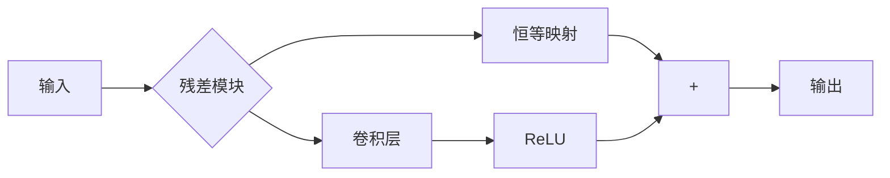
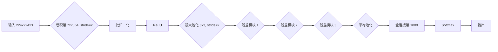
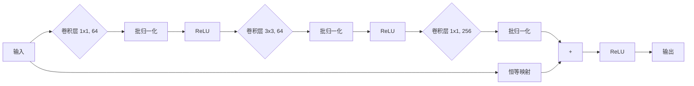

# 从零开始大模型开发与微调：ResNet残差模块的实现

## 1. 背景介绍

### 1.1 问题的由来

在深度学习领域中，神经网络的深度一直是一个关键因素。随着网络层数的增加,网络的表达能力也会相应提高,但同时也会带来一些问题,如梯度消失、梯度爆炸等,导致深层网络的训练变得异常困难。为了解决这个问题,2015年,微软研究院的何恺明等人提出了残差网络(ResNet)的概念,通过引入残差模块(Residual Module)来构建更深的网络,从而有效缓解了梯度消失和梯度爆炸的问题,使得训练更深层的神经网络成为可能。

### 1.2 研究现状

自从ResNet被提出以来,它在各种视觉任务中都取得了卓越的表现,如图像分类、目标检测、语义分割等,并在多个国际竞赛中获得冠军。ResNet的提出不仅推动了深度学习模型的发展,也为后续的各种新型网络结构奠定了基础。目前,ResNet及其变体已经被广泛应用于计算机视觉、自然语言处理等多个领域。

### 1.3 研究意义

深入理解ResNet残差模块的原理和实现细节,对于我们掌握深度学习模型的设计思路和训练技巧至关重要。通过学习ResNet,我们可以更好地理解深度神经网络的优缺点,并探索如何设计更高效、更鲁棒的网络结构。此外,ResNet的思想也可以启发我们在其他领域寻找创新的解决方案。

### 1.4 本文结构

本文将从以下几个方面详细介绍ResNet残差模块:

1. 核心概念与联系
2. 核心算法原理与具体操作步骤
3. 数学模型和公式详细推导
4. 项目实践:代码实例和详细解释
5. 实际应用场景
6. 工具和资源推荐
7. 总结:未来发展趋势与挑战
8. 附录:常见问题与解答

## 2. 核心概念与联系

ResNet的核心思想是通过引入残差模块(Residual Module)来构建更深的网络。残差模块的基本结构如下所示:

在这个结构中,输入数据 $x$ 经过一系列卷积操作 $\mathcal{F}(x)$ 后,得到的输出 $\mathcal{F}(x)$ 与原始输入 $x$ 相加,形成最终的输出 $\mathcal{F}(x)+x$。这种设计思路的关键在于,通过引入恒等映射 (identity mapping),使得网络只需要学习残差(residual) $\mathcal{F}(x)-x$,而不是直接学习整个映射 $\mathcal{F}(x)$。这样可以有效缓解梯度消失和梯度爆炸的问题,从而使得训练更深层的网络变得可行。

ResNet的核心概念与其他一些重要概念也有着密切联系,例如:

- **Highway Networks**: 与ResNet类似,Highway Networks也引入了一种"bypass"机制,允许数据在网络中无阻碍地流动。
- **DenseNet**: DenseNet通过密集连接的方式,使得每一层都能直接获取前面所有层的特征,从而进一步加强了特征的传递和复用。
- **注意力机制(Attention Mechanism)**: 注意力机制允许网络动态地分配不同特征的权重,这在某种程度上也可以看作是一种残差思想的体现。

## 3. 核心算法原理与具体操作步骤

### 3.1 算法原理概述

ResNet的核心算法原理可以概括为以下几个方面:

1. **残差学习**: 通过引入残差模块,网络只需要学习残差映射 $\mathcal{F}(x)-x$,而不是直接学习整个映射 $\mathcal{F}(x)$,这可以有效缓解梯度消失和梯度爆炸的问题。

2. **恒等映射(Identity Mapping)**: 在残差模块中,输入数据 $x$ 通过一个恒等映射(identity mapping)直接传递到输出,并与卷积操作的输出 $\mathcal{F}(x)$ 相加。这种设计使得网络可以更容易地学习恒等映射,从而提高了训练的稳定性和收敛速度。

3. **批归一化(Batch Normalization)**: 在ResNet中,每一个卷积层之后都会接一个批归一化层,这可以加速收敛并提高模型的泛化能力。

4. **残差模块的堆叠**: ResNet通过堆叠多个残差模块来构建更深的网络,每个模块都包含多个卷积层和一个恒等映射。这种模块化设计使得网络结构更加灵活和可扩展。

### 3.2 算法步骤详解

ResNet的具体实现步骤如下:

1. **输入数据预处理**: 对输入数据(如图像)进行必要的预处理,如归一化、数据增强等。

2. **卷积层**: 在残差模块中,输入数据首先经过一系列卷积层,这些卷积层用于提取特征。

3. **批归一化层**: 在每个卷积层之后,都会接一个批归一化层,以加速收敛并提高模型的泛化能力。

4. **激活函数**: 通常使用ReLU作为激活函数,以引入非线性。

5. **恒等映射**: 在残差模块中,输入数据 $x$ 通过一个恒等映射(identity mapping)直接传递到输出。

6. **残差连接**: 将卷积操作的输出 $\mathcal{F}(x)$ 与输入数据 $x$ 相加,得到最终的输出 $\mathcal{F}(x)+x$。

7. **模块堆叠**: 通过堆叠多个残差模块来构建更深的网络。

8. **分类层**: 在网络的最后,添加一个全连接层作为分类层,用于进行分类或回归任务。

### 3.3 算法优缺点

ResNet的优点包括:

- 有效缓解了深度网络中的梯度消失和梯度爆炸问题,使得训练更深层的网络成为可能。
- 通过引入恒等映射,提高了网络的训练稳定性和收敛速度。
- 模块化设计使得网络结构更加灵活和可扩展。
- 在多个视觉任务中取得了卓越的表现。

ResNet的缺点包括:

- 虽然ResNet可以训练更深的网络,但是网络的深度仍然有一个上限,超过这个上限后,性能将会下降。
- ResNet的结构相对较为简单,可能无法捕捉到一些复杂的特征关系。
- 对于一些特殊任务,如生成式任务,ResNet的表现可能不如其他网络结构。

### 3.4 算法应用领域

ResNet及其变体已经被广泛应用于多个领域,包括但不限于:

- **计算机视觉**: 图像分类、目标检测、语义分割、实例分割等。
- **自然语言处理**: 文本分类、机器翻译、语音识别等。
- **医学影像**: 医学图像分析、病理学图像分析等。
- **遥感领域**: 遥感图像分类、目标检测等。
- **视频分析**: 视频分类、行为识别等。

## 4. 数学模型和公式详细讲解与举例说明

### 4.1 数学模型构建

在ResNet中,我们可以将残差模块表示为一个函数 $\mathcal{F}(x)$,其中 $x$ 是输入数据。残差模块的输出可以表示为:

$$\text{output} = \mathcal{F}(x) + x$$

其中,恒等映射 $x$ 直接与卷积操作的输出 $\mathcal{F}(x)$ 相加,形成最终的输出。

在实际实现中,由于输入和输出的维度可能不同,我们需要对输入进行一个线性投影,将其维度调整为与输出相同。因此,上述公式可以修改为:

$$\text{output} = \mathcal{F}(x) + \mathcal{W}x$$

其中,$ \mathcal{W} $是一个线性映射,用于调整输入 $x$ 的维度。

### 4.2 公式推导过程

我们可以将ResNet看作是一个残差映射 $\mathcal{R}(x)$,其中 $\mathcal{R}(x) = \mathcal{F}(x) + x$。在训练过程中,我们需要优化这个残差映射,使其能够很好地拟合期望的输出。

假设我们的目标是最小化一个损失函数 $\mathcal{L}(\mathcal{R}(x), y)$,其中 $y$ 是期望的输出。根据链式法则,我们可以计算损失函数相对于权重 $\mathcal{W}$ 的梯度:

$$\frac{\partial \mathcal{L}}{\partial \mathcal{W}} = \frac{\partial \mathcal{L}}{\partial \mathcal{R}(x)} \cdot \frac{\partial \mathcal{R}(x)}{\partial \mathcal{W}}$$

其中,

$$\frac{\partial \mathcal{R}(x)}{\partial \mathcal{W}} = \frac{\partial (\mathcal{F}(x) + \mathcal{W}x)}{\partial \mathcal{W}} = \frac{\partial \mathcal{F}(x)}{\partial \mathcal{W}} + x$$

我们可以看到,由于引入了恒等映射 $x$,梯度不会像传统的深度网络那样容易消失或爆炸。这就是ResNet能够有效缓解梯度问题的关键所在。

### 4.3 案例分析与讲解

为了更好地理解ResNet的工作原理,我们可以通过一个具体的案例来进行分析和讲解。

假设我们要构建一个用于图像分类的ResNet模型,输入是一个 $224 \times 224 \times 3$ 的彩色图像,输出是一个包含 1000 个类别的向量。我们可以设计如下的残差模块:

在这个模型中,我们首先使用一个 $7 \times 7$ 的卷积层和最大池化层对输入图像进行处理,然后堆叠了三个残差模块。每个残差模块都包含多个卷积层和一个恒等映射,具体结构如下:

在这个残差模块中,输入数据首先经过一个 $1 \times 1$ 的卷积层,用于降维。然后是一个 $3 \times 3$ 的卷积层,用于提取特征。最后,又经过一个 $1 \times 1$ 的卷积层,用于升维。同时,输入数据也通过一个恒等映射直接传递到输出,并与卷积操作的输出相加。

通过堆叠多个这样的残差模块,我们可以构建一个非常深的网络,而不会遇到梯度消失或梯度爆炸的问题。同时,由于引入了恒等映射,网络也更容易学习恒等映射,从而提高了训练的稳定性和收敛速度。

### 4.4 常见问题解答

**Q: 为什么ResNet能够有效缓解梯度消失和梯度爆炸的问题?**

A: ResNet通过引入残差模块和