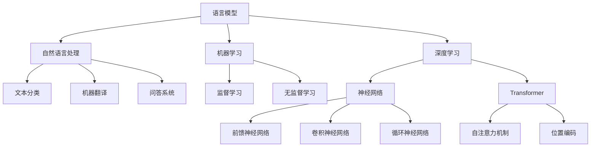
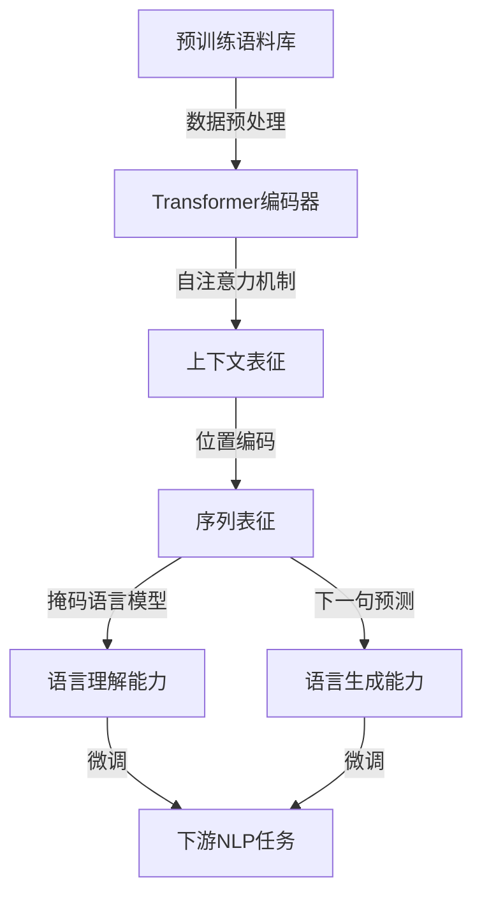

# 大规模语言模型从理论到实践：大语言模型的构建流程

## 1. 背景介绍

### 1.1 问题的由来

在当今信息时代,自然语言处理(NLP)已成为人工智能领域中最具挑战性和应用前景的研究方向之一。随着数据量的激增和计算能力的提高,大规模语言模型(Large Language Model, LLM)应运而生,为语言理解、生成和下游任务奠定了坚实的基础。

大规模语言模型旨在从海量文本数据中学习语言的内在规律和语义知识,构建通用的语言表征能力。这种数据驱动的范式打破了传统的基于规则和特征工程的方法,使得模型能够自主捕获语言的复杂性,并在广泛的应用场景中发挥作用。

### 1.2 研究现状

近年来,随着transformer等注意力机制的出现,以及越来越强大的硬件支持,大规模语言模型取得了突破性进展。代表性模型包括GPT、BERT、XLNet、T5等,它们在自然语言理解、生成、问答、摘要等任务上展现出卓越的性能。

然而,构建高质量的大规模语言模型仍面临诸多挑战,例如:

- 数据质量和多样性
- 计算资源需求巨大
- 模型优化和训练策略
- 知识蒸馏和模型压缩
- 解释性和可控性
- 隐私和安全性

### 1.3 研究意义

大规模语言模型的发展不仅推动了自然语言处理技术的进步,也为人机交互、智能助理、内容生成等应用领域带来了革命性变化。通过深入研究大语言模型的构建流程,我们可以:

- 提高模型的性能和泛化能力
- 优化模型的效率和可扩展性
- 增强模型的解释性和可控性
- 探索新的模型架构和训练策略
- 促进语言智能的发展和应用

### 1.4 本文结构

本文将全面介绍大规模语言模型的构建流程,内容包括:

- 核心概念与联系
- 核心算法原理与具体操作步骤
- 数学模型和公式详细讲解与案例分析
- 项目实践:代码实例和详细解释
- 实际应用场景和未来展望
- 工具和资源推荐
- 总结:未来发展趋势与挑战
- 附录:常见问题与解答

## 2. 核心概念与联系

在深入探讨大规模语言模型的构建细节之前,我们需要理解一些核心概念及其相互关系。

上图展示了大规模语言模型涉及的一些核心概念,包括:

- **语言模型(Language Model, LM)**: 旨在学习和捕获语言的统计规律,为自然语言处理任务提供基础语言表征能力。
- **自然语言处理(Natural Language Processing, NLP)**: 研究如何使计算机能够理解和生成人类语言,包括文本分类、机器翻译、问答系统等应用。
- **机器学习(Machine Learning, ML)**: 赋予计算机从数据中学习和改进的能力,包括监督学习和无监督学习等范式。
- **深度学习(Deep Learning, DL)**: 基于神经网络的机器学习方法,能够自动从数据中学习高层次的特征表示。
- **神经网络(Neural Network)**: 包括前馈神经网络、卷积神经网络、循环神经网络等,是深度学习的核心模型。
- **Transformer**: 一种基于自注意力机制和位置编码的序列到序列模型,在自然语言处理任务中表现出色。

大规模语言模型通过将这些概念有机结合,构建了强大的语言表征和生成能力,为广泛的自然语言处理应用奠定了基础。

## 3. 核心算法原理 & 具体操作步骤

### 3.1 算法原理概述

大规模语言模型的核心算法原理是基于transformer的自注意力机制和位置编码,通过预训练的方式从海量文本数据中学习语言的内在规律和语义知识。

上图展示了大规模语言模型的总体训练流程:

1. **数据预处理**: 从海量文本语料库中提取和清洗数据,将其转换为模型可以处理的格式。
2. **Transformer编码器**: 将输入序列输入到transformer编码器中,通过多层自注意力和前馈神经网络进行编码。
3. **自注意力机制**: 捕获输入序列中每个单词与其他单词之间的关系,生成上下文表征。
4. **位置编码**: 为序列中的每个单词添加位置信息,使模型能够捕获语序信息。
5. **掩码语言模型(Masked Language Model, MLM)**: 通过随机掩码部分输入单词,训练模型预测被掩码的单词,从而学习语言理解能力。
6. **下一句预测(Next Sentence Prediction, NSP)**: 训练模型判断两个句子是否连贯,以学习语言生成能力。
7. **微调(Fine-tuning)**: 在预训练的基础上,通过监督学习的方式对模型进行微调,使其适应特定的下游NLP任务。

通过预训练和微调的两阶段训练策略,大规模语言模型能够学习通用的语言表征,并将其迁移到各种自然语言处理任务中,显著提高了模型的性能和泛化能力。

### 3.2 算法步骤详解

1. **数据预处理**

   - 文本语料收集和清洗
   - 标记化(Tokenization):将文本分割成单词或子词序列
   - 构建词表(Vocabulary):统计语料库中所有出现的单词或子词,构建词表
   - 数值化(Numericalization):将单词或子词映射为数值ID

2. **模型输入构造**

   - 将输入序列拼接为单个序列,添加特殊标记[CLS]和[SEP]
   - 对部分输入单词进行随机掩码,用于掩码语言模型(MLM)训练
   - 为输入序列添加位置编码

3. **Transformer编码器**

   - 输入embedding层:将输入单词ID映射为embeddings向量表示
   - 多层transformer编码器块:
     - 多头自注意力子层:捕获输入序列中单词之间的关系
     - 前馈神经网络子层:对序列表征进行非线性变换
     - 残差连接和层归一化:提高模型训练的稳定性

4. **掩码语言模型(MLM)训练**

   - 对于被掩码的单词位置,最终输出的向量表示即为该位置单词的预测
   - 使用交叉熵损失函数,最小化预测值与实际值之间的差异

5. **下一句预测(NSP)训练(可选)**

   - 输入两个句子,判断它们是否是连续的句子对
   - 使用二分类损失函数进行训练

6. **模型微调**

   - 选择合适的下游NLP任务数据集
   - 根据任务类型设计输入格式和训练目标
   - 在预训练模型的基础上进行监督微调
   - 可选:知识蒸馏、模型压缩等策略

通过上述步骤,大规模语言模型能够从海量文本数据中学习通用的语言表征,并针对特定的自然语言处理任务进行微调,发挥出强大的性能。

### 3.3 算法优缺点

**优点**:

- 通过自注意力机制和位置编码,能够有效捕获长距离依赖和语序信息
- 预训练范式使模型能够从海量数据中学习通用的语言知识
- 可以通过微调迁移到各种下游NLP任务,提高了模型的泛化能力
- 模型架构高度并行化,可以利用GPU等加速硬件进行高效训练

**缺点**:

- 需要大量的计算资源和训练时间,成本较高
- 对训练数据的质量和多样性有较高要求
- 存在一定的不确定性和缺乏解释性
- 可能会引入偏见和不当内容
- 对于长序列,计算复杂度仍然较高

总的来说,大规模语言模型展现出了强大的语言理解和生成能力,但也存在一些需要进一步改进的地方。

### 3.4 算法应用领域

大规模语言模型由于其通用的语言表征能力,在自然语言处理的各个领域都有广泛的应用:

- **文本分类**: 如新闻分类、情感分析、垃圾邮件检测等
- **机器翻译**: 将一种语言的文本翻译为另一种语言
- **问答系统**: 基于上下文理解问题并生成答案
- **文本摘要**: 自动生成文本的摘要或概括
- **对话系统**: 模拟人类对话,用于智能助手、客服等场景
- **内容生成**: 根据提示自动生成文章、故事、代码等内容
- **信息检索**: 根据查询从大量文本中检索相关信息
- **关系抽取**: 从文本中抽取实体之间的语义关系
- **...

随着大规模语言模型的不断发展和完善,其应用领域也在不断扩展,为各行各业带来了革命性的变化。

## 4. 数学模型和公式 & 详细讲解 & 举例说明

### 4.1 数学模型构建

大规模语言模型的核心数学模型是基于transformer的自注意力机制和位置编码。我们将从以下几个方面构建数学模型:

1. **自注意力机制**

自注意力机制是transformer的核心,它能够捕获输入序列中每个单词与其他单词之间的关系,生成上下文表征。

对于长度为 $n$ 的输入序列 $X = (x_1, x_2, \dots, x_n)$,其中 $x_i \in \mathbb{R}^{d_\text{model}}$ 表示第 $i$ 个单词的embedding向量,自注意力机制的计算过程如下:

$$\begin{aligned}
Q &= XW^Q \
K &= XW^K \
V &= XW^V \
\text{Attention}(Q, K, V) &= \text{softmax}\left(\frac{QK^T}{\sqrt{d_k}}\right)V
\end{aligned}$$

其中 $W^Q, W^K, W^V \in \mathbb{R}^{d_\text{model} \times d_k}$ 是可学习的线性变换矩阵,用于将输入embedding映射到查询(Query)、键(Key)和值(Value)的子空间。$d_k$ 是缩放因子,用于防止点积过大导致梯度饱和。

多头自注意力机制通过并行计算多个注意力头,能够从不同的子空间捕获不同的关系,进一步提高了模型的表现力:

$$\text{MultiHead}(Q, K, V) = \text{Concat}(\text{head}_1, \dots, \text{head}_h)W^O$$

其中 $\text{head}_i = \text{Attention}(QW_i^Q, KW_i^K, VW_i^V)$,并且 $W_i^Q, W_i^K, W_i^V \in \mathbb{R}^{d_\text{model} \times d_k}$ 是每个注意力头的可学习参数。$W^O \in \mathbb{R}^{hd_v \times d_\text{model}}$ 是用于线性变换的输出权重矩阵。

2. **位置编码**

由于transformer没有像RNN那样的递归结构,因此需要通过位置编码来引入序列的