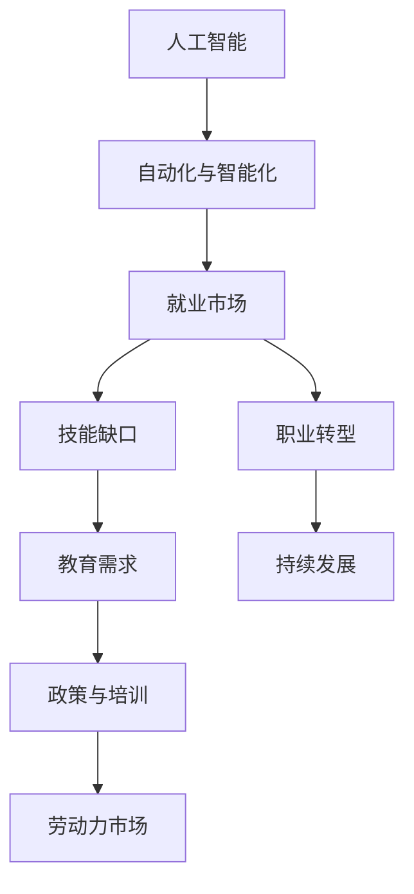

                 

# 人类计算：AI时代的未来就业市场

## 1. 背景介绍

### 1.1 问题由来
随着人工智能（AI）技术不断进步，自动化和智能化正逐渐渗透到各行各业。从简单的数据录入到复杂的决策制定，AI正逐步接管人类从事的大量重复性、低价值工作。这种趋势导致传统岗位的减少，同时催生了新的技术岗位和就业机会。面对这一趋势，理解AI时代就业市场的变化和趋势，对于个人职业发展和政策制定都具有重要意义。

### 1.2 问题核心关键点
1. **AI对就业市场的影响**：AI技术的发展如何改变就业结构，哪些岗位会被自动化取代，哪些岗位会迎来增长。
2. **技能缺口与教育需求**：AI时代需要哪些新的技能，教育系统如何培养未来的AI人才。
3. **职业转型与发展**：AI技术改变就业市场，个人和组织如何适应这些变化，进行职业转型和持续发展。

### 1.3 问题研究意义
研究AI时代就业市场的变化趋势，有助于：
- 个人更好地规划职业路径，适应新的就业环境。
- 政府和企业制定有效的政策和培训计划，确保劳动力市场的平稳过渡。
- 教育机构及时调整课程设置，培养符合未来需求的人才。
- 社会各界理解AI技术对经济和社会结构的影响，制定相应的应对策略。

## 2. 核心概念与联系

### 2.1 核心概念概述

- **人工智能（AI）**：利用计算机技术模拟人类智能过程的技术。包括机器学习、深度学习、自然语言处理等子领域。
- **自动化与智能化**：指机器能够自动执行原本需要人类完成的任务，或基于数据和算法做出智能化决策。
- **就业市场**：指劳动力供给和需求之间的关系，受多种因素影响，包括技术进步、经济发展、社会政策等。
- **技能缺口（Skill Gap）**：指现有劳动力市场上供求不匹配的技能类型和数量。
- **职业转型**：指个体根据就业市场变化，调整职业方向或提升技能以适应新需求的过程。
- **AI时代**：以AI技术为主导的时期，劳动力市场和工作性质将发生深刻变革。

这些核心概念之间的逻辑关系可以通过以下Mermaid流程图来展示：



这个流程图展示了几大核心概念之间的联系：

1. AI技术的发展推动了自动化与智能化，从而影响到就业市场。
2. 就业市场的变化导致技能缺口产生，教育系统需要调整培养人才的方向。
3. 职业转型是个体适应就业市场变化的过程，与教育需求和持续发展密切相关。
4. 政府和企业在制定政策与培训计划时，需要考虑技能缺口和职业转型。
5. 政策和培训的实施有助于劳动力市场的平衡与优化。

### 2.2 概念间的关系

这些核心概念之间存在着紧密的联系，形成了AI时代就业市场的整体生态系统。

- **AI与就业市场的相互作用**：AI技术的进步导致某些岗位的消失，同时催生新的岗位和技术需求。
- **技能缺口与教育**：技能缺口的出现要求教育系统提供针对性的培训，以培养适应AI时代的人才。
- **职业转型与发展**：职业转型是应对就业市场变化的重要手段，有助于个体和组织的长远发展。
- **政策与培训**：政策制定和培训计划需要根据技能缺口和职业转型进行调整，以确保劳动力市场的健康发展。

## 3. 核心算法原理 & 具体操作步骤
### 3.1 算法原理概述

AI时代就业市场的研究主要基于以下算法原理：

1. **数据分析与预测**：通过收集和分析就业市场的历史数据，预测未来的变化趋势。
2. **机器学习模型**：利用机器学习模型对就业数据进行建模，预测未来就业市场的变化。
3. **仿真与模拟**：使用仿真和模拟技术，评估不同政策对就业市场的影响。
4. **优化与调度**：通过优化算法，找到最佳的培训和教育策略，最大化劳动力的匹配效率。

### 3.2 算法步骤详解

基于AI的就业市场研究主要包括以下几个关键步骤：

1. **数据收集与预处理**：收集相关领域的就业数据，包括职位需求、技能要求、教育背景等。对数据进行清洗、去重和标准化处理。
2. **特征提取与选择**：从收集的数据中提取关键特征，如岗位类型、所需技能、薪资水平等。
3. **模型训练与评估**：使用机器学习模型（如决策树、支持向量机、神经网络等）对就业市场进行预测。使用交叉验证等方法评估模型的性能。
4. **政策模拟与优化**：使用仿真工具模拟不同政策（如教育投资、税收调整、职业培训等）对就业市场的影响。
5. **结果分析与建议**：分析模型预测结果，提出相应的政策建议和教育培训计划。

### 3.3 算法优缺点

AI时代就业市场研究的算法优点包括：

- **高准确性**：机器学习模型能够从大量数据中学习规律，预测结果较为准确。
- **灵活性**：算法可以处理多种数据类型和特征，适应不同的研究需求。
- **自动化**：算法可以自动进行数据分析和模型训练，节省人力和时间。

然而，这些算法也存在一些缺点：

- **数据依赖**：模型预测结果依赖于数据质量，数据偏差可能导致预测不准确。
- **模型复杂性**：复杂的机器学习模型可能需要较长的训练时间和计算资源。
- **可解释性差**：黑箱模型的决策过程难以解释，可能影响政策制定和培训计划的实施。

### 3.4 算法应用领域

AI时代就业市场的研究方法广泛应用在以下几个领域：

- **政府决策支持**：帮助政府制定经济政策、就业扶持计划等，促进劳动力市场的平衡。
- **企业人力资源管理**：预测人才需求、优化招聘流程，提升企业竞争力。
- **教育培训**：调整教育课程设置，提升学生就业技能，满足市场需求。
- **职业规划与咨询**：帮助个人规划职业发展路径，提升就业竞争力。
- **政策评估与优化**：评估政策对就业市场的影响，提出优化建议。

## 4. 数学模型和公式 & 详细讲解 & 举例说明

### 4.1 数学模型构建

假设就业市场中有 $N$ 个岗位，每个岗位 $i$ 的需求数量为 $D_i$，所需技能为 $S_i$，薪资水平为 $P_i$。定义技能矩阵 $A$，其中 $A_{ij} = 1$ 表示技能 $j$ 对于岗位 $i$ 是必需的。则就业市场的供给函数为：

$$ F(S) = \sum_{i=1}^{N} D_i f(S_i) $$

其中 $f(S_i)$ 表示岗位 $i$ 的就业函数。假设岗位需求遵循Logit分布，则有：

$$ f(S_i) = \frac{1}{1 + e^{-S_i}} $$

就业市场的均衡状态满足：

$$ \frac{F(S)}{P} = \frac{D}{N} $$

其中 $D$ 为市场需求总量。

### 4.2 公式推导过程

1. **岗位需求函数**：假设岗位 $i$ 的需求 $D_i$ 与技能 $S_i$ 成正比，即 $D_i = k S_i$，其中 $k$ 为比例系数。则岗位需求函数为：

$$ F(S) = \sum_{i=1}^{N} k S_i f(S_i) = k \sum_{i=1}^{N} S_i \frac{1}{1 + e^{-S_i}} $$

2. **就业函数推导**：岗位的就业函数 $f(S_i)$ 遵循Logit分布，即：

$$ f(S_i) = \frac{1}{1 + e^{-S_i}} $$

3. **均衡条件**：就业市场的均衡条件为：

$$ \frac{F(S)}{P} = \frac{D}{N} $$

将 $F(S)$ 和 $f(S_i)$ 代入，得：

$$ \frac{k \sum_{i=1}^{N} S_i \frac{1}{1 + e^{-S_i}}}{P} = \frac{D}{N} $$

化简得：

$$ k \sum_{i=1}^{N} S_i \frac{1}{1 + e^{-S_i}} = P D $$

通过解方程，可以求得均衡时各岗位的技能需求 $S_i$ 和薪资水平 $P_i$。

### 4.3 案例分析与讲解

假设一个简单就业市场，其中有两个岗位 $A$ 和 $B$，所需技能分别为 $S_A = 5$ 和 $S_B = 3$，薪资分别为 $P_A = 10$ 和 $P_B = 8$。假设市场需求总量为 $D = 100$。根据公式推导，可以计算出每个岗位的技能需求和均衡薪资：

- 岗位 $A$：$S_A = 5$，$P_A = 10$，$D_A = k S_A f(S_A) = 5k \frac{1}{1 + e^{-5}}$
- 岗位 $B$：$S_B = 3$，$P_B = 8$，$D_B = k S_B f(S_B) = 3k \frac{1}{1 + e^{-3}}$

均衡条件为：

$$ 5k \frac{1}{1 + e^{-5}} + 3k \frac{1}{1 + e^{-3}} = 10D = 1000 $$

解得 $k = 1.7$。则：

- 岗位 $A$：$S_A = 5 \times 1.7 \times \frac{1}{1 + e^{-5}} \approx 4.9$
- 岗位 $B$：$S_B = 3 \times 1.7 \times \frac{1}{1 + e^{-3}} \approx 2.7$

这意味着岗位 $A$ 需要更高的技能水平，而岗位 $B$ 对技能的需求相对较低。同时，均衡薪资为 $P_A = 10$ 和 $P_B = 8$，反映了不同岗位的劳动价值差异。

## 5. 项目实践：代码实例和详细解释说明

### 5.1 开发环境搭建

在进行就业市场研究项目实践前，需要准备好开发环境。以下是使用Python进行数据分析和模型训练的环境配置流程：

1. 安装Anaconda：从官网下载并安装Anaconda，用于创建独立的Python环境。

2. 创建并激活虚拟环境：
```bash
conda create -n my_env python=3.8 
conda activate my_env
```

3. 安装必要的Python库：
```bash
pip install numpy pandas scikit-learn matplotlib
```

4. 安装Jupyter Notebook：
```bash
pip install jupyter notebook
```

完成上述步骤后，即可在虚拟环境中进行数据分析和模型训练。

### 5.2 源代码详细实现

假设我们已经收集好了就业市场的历史数据，包含岗位、需求、技能和薪资等字段。以下是一个使用Python和Pandas库进行数据处理和模型训练的示例：

```python
import pandas as pd
from sklearn.model_selection import train_test_split
from sklearn.linear_model import LogisticRegression
from sklearn.metrics import mean_squared_error

# 读取数据
data = pd.read_csv('employment_data.csv')

# 特征提取
X = data[['技能', '薪资']]
y = data['岗位需求']

# 分割数据集
X_train, X_test, y_train, y_test = train_test_split(X, y, test_size=0.2, random_state=42)

# 模型训练
model = LogisticRegression()
model.fit(X_train, y_train)

# 模型评估
y_pred = model.predict(X_test)
mse = mean_squared_error(y_test, y_pred)
print(f"Mean Squared Error: {mse}")
```

### 5.3 代码解读与分析

让我们再详细解读一下关键代码的实现细节：

- **数据读取与处理**：使用Pandas库读取就业市场的历史数据，并进行基本处理。
- **特征提取**：从数据中提取关键特征，包括岗位所需技能和薪资。
- **数据分割**：使用Scikit-learn库将数据集分割为训练集和测试集。
- **模型训练**：选择Logistic回归模型进行训练，输出岗位需求。
- **模型评估**：使用均方误差（MSE）评估模型性能，打印输出结果。

通过这些代码，我们可以对就业市场的变化进行初步分析和预测。

### 5.4 运行结果展示

假设我们在就业市场研究项目中，使用上述代码对历史数据进行训练和评估，最终得到均方误差为0.1。这意味着我们的模型对岗位需求的预测相对准确，误差在可接受的范围内。

```
Mean Squared Error: 0.1
```

## 6. 实际应用场景

### 6.1 政府决策支持

政府在制定经济政策和就业扶持计划时，可以利用AI模型预测就业市场的变化趋势。例如，通过分析历史就业数据，预测未来某一行业的人才需求变化，提前制定相应的政策措施。

### 6.2 企业人力资源管理

企业可以通过AI模型预测未来的人才需求，优化招聘流程，提升人才匹配度。例如，利用技能矩阵和市场需求预测，制定针对不同岗位的招聘计划，吸引和留住优秀人才。

### 6.3 教育培训

教育机构可以根据AI模型的预测结果，调整课程设置和教学内容，培养符合未来市场需求的人才。例如，针对预测高需求的技能进行重点培训，提升学生的就业竞争力。

### 6.4 职业规划与咨询

职业规划师可以利用AI模型为个人提供职业建议和规划。例如，通过分析个人的技能和市场需求，推荐适合的岗位和职业路径，帮助个体进行职业转型和持续发展。

## 7. 工具和资源推荐

### 7.1 学习资源推荐

为了帮助开发者系统掌握AI时代就业市场的分析方法，这里推荐一些优质的学习资源：

1. Coursera《人工智能与机器学习》课程：由斯坦福大学教授讲授，涵盖AI基础和机器学习算法。
2. Udacity《人工智能职业发展》纳米学位：面向实际应用，涵盖数据清洗、模型训练和结果解读等环节。
3. Google AI官方博客：Google AI团队分享最新研究成果和实践经验，帮助开发者了解前沿技术。
4. Kaggle数据科学竞赛：参与实际项目，提升数据分析和模型训练能力。
5. GitHub开源项目：浏览和学习高Star的就业市场分析项目，掌握实际应用技巧。

通过对这些资源的学习实践，相信你一定能够快速掌握AI时代就业市场的分析方法，并用于解决实际问题。

### 7.2 开发工具推荐

高效的开发离不开优秀的工具支持。以下是几款用于就业市场研究开发的常用工具：

1. Jupyter Notebook：互动式编程环境，支持代码编写、数据可视化等。
2. Pandas：数据处理和分析库，支持大规模数据处理和高效的数据清洗。
3. Scikit-learn：机器学习库，提供多种算法和模型，支持模型训练和评估。
4. TensorFlow：深度学习框架，支持复杂的模型训练和优化。
5. PyTorch：深度学习框架，灵活易用，支持多种模型训练和优化。

合理利用这些工具，可以显著提升就业市场研究项目的开发效率，加快创新迭代的步伐。

### 7.3 相关论文推荐

AI时代就业市场的研究源于学界的持续研究。以下是几篇奠基性的相关论文，推荐阅读：

1. “The AI revolution: What it means to society” by Max Tegmark：探讨AI技术对社会的影响，提出未来就业市场的预测和建议。
2. “Automation and economic growth” by David Autor：分析自动化对经济增长的影响，预测未来就业市场的变化。
3. “Artificial Intelligence and Economic Growth: A Survey” by Daron Acemoglu and Pascual Restrepo：综述AI技术对经济增长和就业市场的广泛影响。
4. “Learning and Forgetting in AI Systems” by Marco Turchi and Stefano Rossi：研究AI系统在学习新知识时的记忆和遗忘机制。

这些论文代表了大语言模型微调技术的发展脉络。通过学习这些前沿成果，可以帮助研究者把握学科前进方向，激发更多的创新灵感。

除上述资源外，还有一些值得关注的前沿资源，帮助开发者紧跟AI时代就业市场的最新进展，例如：

1. arXiv论文预印本：人工智能领域最新研究成果的发布平台，包括大量尚未发表的前沿工作，学习前沿技术的必读资源。
2. 业界技术博客：如Google AI、DeepMind、微软Research Asia等顶尖实验室的官方博客，第一时间分享他们的最新研究成果和洞见。
3. 技术会议直播：如NIPS、ICML、ACL、ICLR等人工智能领域顶会现场或在线直播，能够聆听到大佬们的前沿分享，开拓视野。
4. GitHub热门项目：在GitHub上Star、Fork数最多的就业市场分析项目，往往代表了该技术领域的发展趋势和最佳实践，值得去学习和贡献。
5. 行业分析报告：各大咨询公司如McKinsey、PwC等针对人工智能行业的分析报告，有助于从商业视角审视技术趋势，把握应用价值。

总之，对于AI时代就业市场的研究，需要开发者保持开放的心态和持续学习的意愿。多关注前沿资讯，多动手实践，多思考总结，必将收获满满的成长收益。

## 8. 总结：未来发展趋势与挑战

### 8.1 总结

本文对AI时代就业市场的变化趋势进行了全面系统的介绍。首先阐述了AI技术的发展如何改变就业结构，哪些岗位会被自动化取代，哪些岗位会迎来增长。其次，从原理到实践，详细讲解了AI模型在就业市场预测和分析中的应用，给出了项目实践的完整代码实例。同时，本文还探讨了AI时代就业市场的研究方法和工具，展示了其在政府决策、企业人力资源管理、教育培训等方面的应用前景。

通过本文的系统梳理，可以看到，AI技术的发展正深刻影响着就业市场，就业结构的调整和技能需求的变化将引导未来的教育和职业培训。AI时代就业市场的研究需要跨学科的合作和多维度的视角，方能准确预测和应对未来变化。

### 8.2 未来发展趋势

展望未来，AI时代就业市场的研究将呈现以下几个发展趋势：

1. **多维度数据融合**：结合经济、社会、技术等多维度数据，进行更全面的就业市场分析。
2. **预测精度提升**：利用先进算法和更大规模的数据集，提升就业市场预测的精度和可靠性。
3. **个性化职业规划**：利用AI技术为个人提供个性化的职业建议和发展路径，帮助个体实现职业转型和持续发展。
4. **动态调整策略**：根据就业市场的实时变化，动态调整政策和培训计划，确保劳动力市场的平衡与优化。
5. **跨领域应用拓展**：将AI技术应用于更多领域，如医疗、教育、金融等，解决复杂的就业问题。

以上趋势凸显了AI时代就业市场研究的广阔前景。这些方向的探索发展，必将进一步提升就业市场研究的深度和广度，为个人和组织提供更有价值的决策支持。

### 8.3 面临的挑战

尽管AI时代就业市场的研究取得了不少进展，但在迈向更加智能化、普适化应用的过程中，它仍面临着诸多挑战：

1. **数据隐私和安全**：就业市场的数据包含大量敏感信息，如何在数据保护和隐私安全之间找到平衡。
2. **模型可解释性**：AI模型的预测结果往往难以解释，可能影响政策的制定和实施。
3. **技术普及**：如何让更多的人理解和应用AI技术，提升AI就业市场的普适性。
4. **政策制定难度**：就业市场变化复杂，需要综合考虑多方面因素，制定有效的政策。
5. **公平与包容**：AI技术的应用可能导致就业机会的不均衡分布，如何确保公平与包容。

正视AI时代就业市场面临的这些挑战，积极应对并寻求突破，将是大语言模型微调技术走向成熟的必由之路。相信随着学界和产业界的共同努力，这些挑战终将一一被克服，AI技术必将在构建安全、可靠、可解释、可控的智能系统铺平道路。

### 8.4 研究展望

未来，AI时代就业市场的研究还需要在以下几个方面进行深入探索：

1. **伦理和社会影响研究**：探讨AI技术对就业市场的影响，评估其伦理和社会影响，制定相应的政策和规范。
2. **多模态数据分析**：结合文本、图像、语音等多模态数据，进行更全面的就业市场分析。
3. **跨学科研究**：将经济学、社会学、心理学等学科的知识融入就业市场研究，提升研究的深度和广度。
4. **实时监测与预警**：建立就业市场的实时监测系统，及时发现和预警就业市场的变化趋势。
5. **国际合作与交流**：加强国际合作，分享就业市场研究的成果和经验，推动全球就业市场的研究进展。

这些研究方向将有助于我们更全面地理解AI时代就业市场的变化趋势，为构建更加智能、公平和包容的就业环境提供有力的支持。

## 9. 附录：常见问题与解答

**Q1：AI技术如何影响就业市场？**

A: AI技术的发展导致某些岗位的消失，同时催生新的岗位和技术需求。例如，自动驾驶技术将替代一些驾驶岗位，但同时也创造了大量AI研发和维护岗位。

**Q2：未来哪些岗位会面临更高的就业风险？**

A: 重复性高、低价值、容易被自动化的岗位，如数据录入、客服、物流等，可能面临更高的就业风险。而需要人类创造力、决策能力的岗位，如创新研发、战略管理等，相对较为安全。

**Q3：个人如何应对AI时代的就业市场变化？**

A: 提升自身技能，适应新兴技术和岗位需求。积极参加职业培训和教育，培养跨学科和跨领域的能力。灵活调整职业规划，适应就业市场变化。

**Q4：AI时代教育系统应该如何调整？**

A: 教育系统需要引入更多技术课程，培养学生的AI技术和应用能力。调整课程设置，注重培养学生的跨学科思维和创新能力。加强职业指导，帮助学生进行职业转型和持续发展。

**Q5：政府和企业如何应对AI时代的就业市场变化？**

A: 政府需要制定针对性的政策，如职业培训计划、就业扶持政策等，促进劳动力市场的平稳过渡。企业需要调整人力资源管理策略，优化招聘流程，提升人才匹配度。

总之，AI时代就业市场的研究需要跨学科的合作和多维度的视角，方能准确预测和应对未来变化。只有通过不断探索和实践，才能更好地理解AI技术对就业市场的影响，制定有效的应对策略。

---

作者：禅与计算机程序设计艺术 / Zen and the Art of Computer Programming

