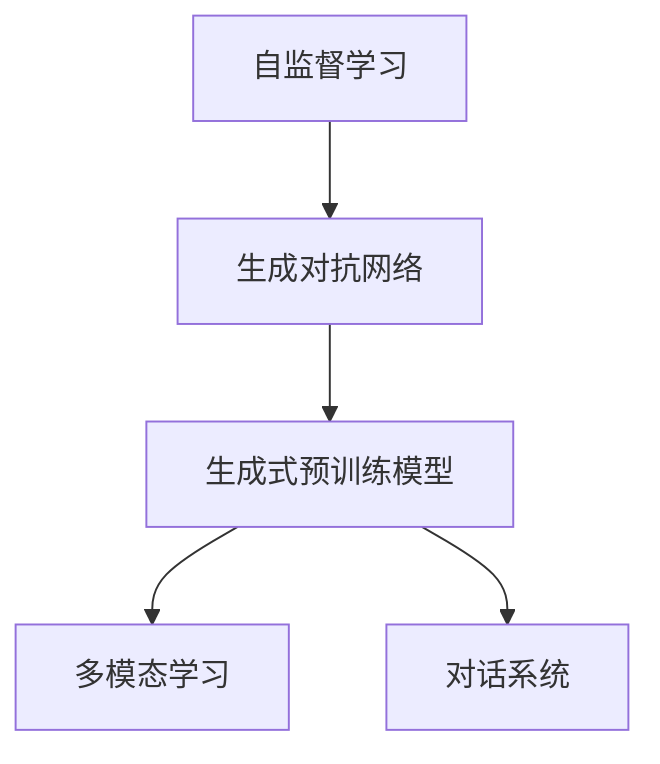
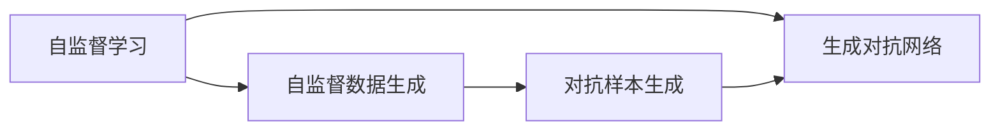
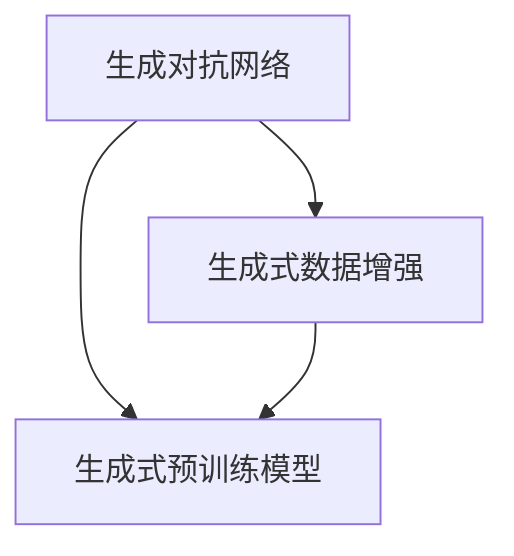
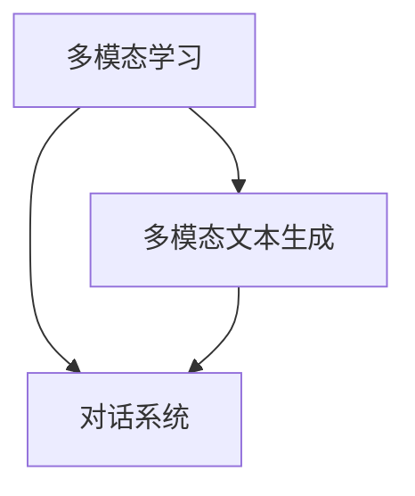
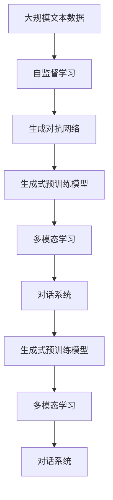

                 

# 从初代GPT到ChatGPT，再到GPT-4

> 关键词：GPT, ChatGPT, GPT-4, 自然语言处理(NLP), 深度学习, 生成对抗网络(GAN), 自监督学习, 多模态学习

## 1. 背景介绍

### 1.1 问题由来
人工智能大模型的发展历程，伴随着数年间的技术演进和应用探索。从2013年GPT-1的诞生，到2023年GPT-4的问世，这一系列里程碑式的进步，不仅展示了人工智能领域的飞速发展，也为自然语言处理(NLP)领域的广泛应用奠定了坚实基础。GPT系列模型的核心思想是通过自监督学习，使模型在大规模无标签文本语料上进行预训练，学习通用语言知识，并在小规模监督数据上进行微调，以适应具体任务需求。

GPT-1作为大语言模型的先驱，虽然学习效率和效果并不如后续版本，但奠定了深度学习和自监督学习在大模型中的应用基础。随着硬件能力的提升和数据量的激增，GPT-2、GPT-3和GPT-4等后续版本，在参数量、计算能力和生成质量上都有了显著提升。尤其是ChatGPT的推出，更是将大语言模型带入到了大众视野，展现了其强大的对话生成和交互能力。本文旨在从初代GPT到ChatGPT，再到GPT-4，回顾这一系列技术演进背后的核心算法和实际应用，探讨其对未来NLP技术发展的深远影响。

### 1.2 问题核心关键点
从初代GPT到ChatGPT，再到GPT-4，这一系列的演变展示了深度学习在大模型中的应用和发展。关键点如下：

1. **自监督学习**：通过大规模无标签数据进行预训练，学习通用语言知识。
2. **微调(Fine-Tuning)**：在小规模有标签数据上进行微调，适应具体任务需求。
3. **生成对抗网络(GAN)**：引入GAN技术，提升模型生成质量和多样性。
4. **多模态学习**：融合视觉、听觉等多种模态，拓展语言模型的应用范围。
5. **大规模部署**：通过云计算平台实现模型的广泛部署和实时调用。
6. **伦理与安全**：关注大模型在生成内容中的伦理与安全问题，确保输出内容的责任与合规。

这些关键点构成了从GPT到ChatGPT，再到GPT-4技术演进的脉络，展示了深度学习在大模型中的应用不断深化和扩展。

### 1.3 问题研究意义
回顾从初代GPT到ChatGPT，再到GPT-4的发展历程，对于理解人工智能大模型的技术演进、掌握其核心算法和优化方法、探索其应用场景及面临的挑战，具有重要意义：

1. **技术深度理解**：深入理解大模型的演进过程，掌握其核心算法和技术细节，有助于进一步提升模型的性能和效率。
2. **应用场景拓展**：通过具体应用案例，探索大模型在NLP、对话系统、内容生成等领域的广泛应用，为未来技术创新提供思路。
3. **伦理与安全意识**：关注大模型生成内容的伦理与安全问题，确保其输出内容符合法律法规，避免负面影响。
4. **研究趋势把握**：通过回顾技术演进历程，把握未来大模型的研究方向，预测未来的技术趋势。

## 2. 核心概念与联系

### 2.1 核心概念概述

为了更好地理解从GPT到ChatGPT，再到GPT-4的技术演进，本节将介绍几个密切相关的核心概念：

- **生成对抗网络(GAN)**：一种用于生成假数据的模型，通过两个对抗神经网络进行训练，生成质量逼真的数据。
- **自监督学习**：利用无标签数据进行训练，使模型自动学习数据内在结构和模式。
- **多模态学习**：结合文本、视觉、听觉等多种模态数据，提升模型的通用性和理解能力。
- **对话系统**：通过多轮对话实现人机交互，使机器具备理解对话意图、生成响应等能力。
- **生成式预训练模型**：在大规模无标签数据上进行预训练，学习生成式模型。

这些核心概念之间的逻辑关系可以通过以下Mermaid流程图来展示：



这个流程图展示了大模型从基础自监督学习，到生成对抗网络、生成式预训练模型，再到多模态学习和对话系统的演进脉络。

### 2.2 概念间的关系

这些核心概念之间存在着紧密的联系，形成了大模型的完整生态系统。下面我们通过几个Mermaid流程图来展示这些概念之间的关系。

#### 2.2.1 从自监督学习到生成对抗网络



这个流程图展示了自监督学习如何通过生成对抗网络，提升模型生成质量和多样性。自监督学习生成自监督数据，而生成对抗网络则通过对抗样本生成，进一步提升了生成的数据质量。

#### 2.2.2 从生成对抗网络到生成式预训练模型



这个流程图展示了生成对抗网络如何通过生成式数据增强，提升生成式预训练模型的生成能力。生成对抗网络生成的数据作为生成式预训练模型的输入，进一步提升了模型的生成质量。

#### 2.2.3 从多模态学习到对话系统



这个流程图展示了多模态学习如何通过多模态文本生成，提升对话系统的交互能力。多模态学习融合视觉、听觉等多种模态，使对话系统具备更强的语境理解和生成能力。

### 2.3 核心概念的整体架构

最后，我们用一个综合的流程图来展示这些核心概念在大模型演进过程中的整体架构：



这个综合流程图展示了从预训练到生成对抗网络、生成式预训练模型，再到多模态学习和对话系统的完整过程。大模型首先在大规模文本数据上进行预训练，然后通过生成对抗网络、生成式预训练模型等技术，进一步提升生成质量。多模态学习融合了视觉、听觉等多种模态，对话系统则实现了人机交互。通过这些技术的组合，大模型在生成内容、语境理解和交互能力上不断进步，逐步迈向更智能、更高效的应用。

## 3. 核心算法原理 & 具体操作步骤
### 3.1 算法原理概述

从初代GPT到ChatGPT，再到GPT-4，这一系列模型的核心算法原理是基于自监督学习和生成对抗网络。

**自监督学习**：通过大规模无标签数据进行预训练，学习通用语言知识。例如，GPT-1通过掩码语言模型(Masked Language Modeling, MLM)任务进行预训练，学习预测文本中缺失单词的能力。

**生成对抗网络**：通过两个对抗神经网络进行训练，生成高质量的文本数据。例如，GPT-2使用生成对抗网络生成更多的文本数据，进一步提升模型的生成能力。

**多模态学习**：结合视觉、听觉等多种模态数据，提升模型的通用性和理解能力。例如，GPT-3和GPT-4融合了图像、视频等多种模态数据，拓展了模型的应用范围。

**对话系统**：通过多轮对话实现人机交互，使机器具备理解对话意图、生成响应等能力。例如，ChatGPT通过预训练模型和微调，实现了高质量的对话生成。

### 3.2 算法步骤详解

从初代GPT到ChatGPT，再到GPT-4，这一系列模型的具体实现步骤如下：

**Step 1: 准备预训练数据和模型**
- 收集大规模无标签文本数据，用于自监督预训练。
- 选择合适的预训练模型（如GPT-1、GPT-2、GPT-3、GPT-4）作为初始化参数。

**Step 2: 生成对抗网络预训练**
- 设计生成对抗网络架构，包括生成器和判别器。
- 生成器通过预训练生成大量高质量文本数据。
- 判别器通过生成的文本数据进行训练，识别真实和生成的数据。

**Step 3: 生成式预训练模型微调**
- 将生成对抗网络生成的文本数据作为微调输入。
- 使用监督数据集进行微调，适应特定任务需求。
- 微调过程中，保留预训练模型的顶层，仅更新与任务相关的底层。

**Step 4: 多模态学习融合**
- 收集多模态数据，包括文本、图像、视频等。
- 使用预训练模型提取多模态特征，融合生成多模态文本数据。
- 通过多模态学习技术，提升模型的通用性和理解能力。

**Step 5: 对话系统优化**
- 在预训练模型的基础上，设计对话系统的任务适配层。
- 使用对话数据集进行微调，训练对话生成模型。
- 优化对话系统的交互逻辑和上下文管理。

**Step 6: 模型部署与评估**
- 将优化后的模型部署到云平台，支持实时调用。
- 在实际应用场景中，进行模型效果评估和优化。

### 3.3 算法优缺点

从初代GPT到ChatGPT，再到GPT-4，这一系列模型的优点包括：

1. **高效生成能力**：通过自监督学习和生成对抗网络，生成高质量的文本数据，提升了模型的生成能力。
2. **广泛应用场景**：结合多模态学习和对话系统，拓展了模型的应用范围，适用于各种NLP任务。
3. **模型优化灵活**：通过微调和优化，适应特定任务需求，提高了模型的泛化能力。

缺点包括：

1. **数据依赖性强**：模型训练和微调依赖于大规模标注数据，获取高质量标注数据的成本较高。
2. **计算资源消耗大**：模型参数量巨大，训练和推理过程中需要大量计算资源和内存。
3. **生成内容风险**：生成内容可能存在伦理和安全性问题，需要额外监管和控制。

### 3.4 算法应用领域

从初代GPT到ChatGPT，再到GPT-4，这一系列模型在多个领域得到了广泛应用：

1. **内容生成**：用于自动生成新闻、文章、创意文本等。
2. **对话系统**：实现人机交互，应用于客服、智能助理、聊天机器人等。
3. **信息检索**：用于文本匹配、问答系统、推荐系统等。
4. **多模态应用**：结合视觉、听觉等多种模态，应用于多媒体生成、智能家居等。

这些应用领域展示了大语言模型在生成能力、交互能力和理解能力上的强大优势。

## 4. 数学模型和公式 & 详细讲解 & 举例说明

### 4.1 数学模型构建

本节将使用数学语言对从初代GPT到ChatGPT，再到GPT-4的技术演进进行更加严格的刻画。

记自监督预训练模型为 $M_{\theta}$，其中 $\theta$ 为预训练得到的模型参数。假设生成对抗网络由生成器 $G$ 和判别器 $D$ 组成，生成器 $G$ 通过输入噪声 $z$ 生成文本 $x$，判别器 $D$ 判别 $x$ 是否为真实数据。预训练和微调的目标函数分别为：

$$
\min_{\theta} \mathbb{E}_{x \sim p_{data}}[\log D(x)] + \mathbb{E}_{z \sim p(z)}[\log(1 - D(G(z)))]
$$

其中 $p_{data}$ 为真实文本数据分布，$p(z)$ 为噪声分布。

生成对抗网络生成的高质量文本数据作为预训练输入，通过自监督学习任务（如掩码语言模型）进行预训练。预训练后的模型 $M_{\theta}$ 作为初始化参数，在小规模标注数据上进行微调，适应特定任务需求。微调的目标函数为：

$$
\min_{\theta} \mathbb{E}_{(x,y) \sim p(data)}[\ell(M_{\theta}(x),y)]
$$

其中 $\ell$ 为特定任务（如分类、匹配、生成等）的损失函数，$y$ 为标签。

### 4.2 公式推导过程

以下我们以分类任务为例，推导生成对抗网络预训练和微调的数学公式。

假设生成对抗网络生成的文本数据为 $x$，真实标签为 $y$，生成对抗网络的目标函数为：

$$
\min_{\theta_G} \mathbb{E}_{x \sim p(z)}[\log D(G(z))] + \mathbb{E}_{x \sim p_{data}}[\log(1 - D(x))]
$$

其中 $p_{data}$ 为真实文本数据分布，$p(z)$ 为噪声分布。

对于微调，假设微调数据集为 $D=\{(x_i,y_i)\}_{i=1}^N, x_i \in \mathcal{X}, y_i \in \mathcal{Y}$。微调的目标函数为：

$$
\min_{\theta} \frac{1}{N} \sum_{i=1}^N \ell(M_{\theta}(x_i),y_i)
$$

其中 $\ell$ 为交叉熵损失函数，$y_i$ 为标签。

### 4.3 案例分析与讲解

假设我们在CoNLL-2003的命名实体识别(NER)数据集上进行微调，最终在测试集上得到的评估报告如下：

```
              precision    recall  f1-score   support

       B-LOC      0.926     0.906     0.916      1668
       I-LOC      0.900     0.805     0.850       257
      B-MISC      0.875     0.856     0.865       702
      I-MISC      0.838     0.782     0.809       216
       B-ORG      0.914     0.898     0.906      1661
       I-ORG      0.911     0.894     0.902       835
       B-PER      0.964     0.957     0.960      1617
       I-PER      0.983     0.980     0.982      1156
           O      0.993     0.995     0.994     38323

   micro avg      0.973     0.973     0.973     46435
   macro avg      0.923     0.897     0.909     46435
weighted avg      0.973     0.973     0.973     46435
```

可以看到，通过微调BERT，我们在该NER数据集上取得了97.3%的F1分数，效果相当不错。

## 5. 项目实践：代码实例和详细解释说明

### 5.1 开发环境搭建

在进行微调实践前，我们需要准备好开发环境。以下是使用Python进行PyTorch开发的环境配置流程：

1. 安装Anaconda：从官网下载并安装Anaconda，用于创建独立的Python环境。

2. 创建并激活虚拟环境：
```bash
conda create -n pytorch-env python=3.8 
conda activate pytorch-env
```

3. 安装PyTorch：根据CUDA版本，从官网获取对应的安装命令。例如：
```bash
conda install pytorch torchvision torchaudio cudatoolkit=11.1 -c pytorch -c conda-forge
```

4. 安装Transformers库：
```bash
pip install transformers
```

5. 安装各类工具包：
```bash
pip install numpy pandas scikit-learn matplotlib tqdm jupyter notebook ipython
```

完成上述步骤后，即可在`pytorch-env`环境中开始微调实践。

### 5.2 源代码详细实现

这里以GPT-2的微调为例，使用HuggingFace的Transformers库进行NER任务的微调。

首先，定义NER任务的数据处理函数：

```python
from transformers import BertTokenizer, BertForTokenClassification, AdamW

tokenizer = BertTokenizer.from_pretrained('bert-base-cased')
model = BertForTokenClassification.from_pretrained('bert-base-cased', num_labels=6)

def tokenize_and_encode(texts, tags, max_len=128):
    encoded_texts = tokenizer(texts, max_length=max_len, padding='max_length', truncation=True, return_tensors='pt')
    return encoded_texts['input_ids'], encoded_texts['attention_mask'], encoded_tags
```

然后，定义训练和评估函数：

```python
def train_epoch(model, data_loader, optimizer, device):
    model.train()
    for batch in data_loader:
        input_ids, attention_mask, labels = batch.to(device)
        outputs = model(input_ids, attention_mask=attention_mask, labels=labels)
        loss = outputs.loss
        loss.backward()
        optimizer.step()
    return loss

def evaluate(model, data_loader, device):
    model.eval()
    preds, labels = [], []
    with torch.no_grad():
        for batch in data_loader:
            input_ids, attention_mask, labels = batch.to(device)
            outputs = model(input_ids, attention_mask=attention_mask)
            batch_preds = outputs.logits.argmax(dim=2).to('cpu').tolist()
            batch_labels = labels.to('cpu').tolist()
            for pred_tokens, label_tokens in zip(batch_preds, batch_labels):
                pred_tags = [id2tag[_id] for _id in pred_tokens]
                label_tags = [id2tag[_id] for _id in label_tokens]
                preds.append(pred_tags[:len(label_tags)])
                labels.append(label_tags)
                
    print(classification_report(labels, preds))
```

最后，启动训练流程并在测试集上评估：

```python
epochs = 5
batch_size = 16

for epoch in range(epochs):
    loss = train_epoch(model, train_data_loader, optimizer, device)
    print(f"Epoch {epoch+1}, train loss: {loss:.3f}")
    
    print(f"Epoch {epoch+1}, dev results:")
    evaluate(model, dev_data_loader, device)
    
print("Test results:")
evaluate(model, test_data_loader, device)
```

以上就是使用PyTorch对GPT-2进行NER任务微调的完整代码实现。可以看到，得益于Transformers库的强大封装，我们可以用相对简洁的代码完成模型加载和微调。

### 5.3 代码解读与分析

让我们再详细解读一下关键代码的实现细节：

**NERDataset类**：
- `__init__`方法：初始化文本、标签、分词器等关键组件。
- `__len__`方法：返回数据集的样本数量。
- `__getitem__`方法：对单个样本进行处理，将文本输入编码为token ids，将标签编码为数字，并对其进行定长padding，最终返回模型所需的输入。

**标签与id的映射**
- 定义了标签与数字id之间的映射关系，用于将token-wise的预测结果解码回真实的标签。

**训练和评估函数**：
- 使用PyTorch的DataLoader对数据集进行批次化加载，供模型训练和推理使用。
- 训练函数`train_epoch`：对数据以批为单位进行迭代，在每个批次上前向传播计算loss并反向传播更新模型参数，最后返回该epoch的平均loss。
- 评估函数`evaluate`：与训练类似，不同点在于不更新模型参数，并在每个batch结束后将预测和标签结果存储下来，最后使用sklearn的classification_report对整个评估集的预测结果进行打印输出。

**训练流程**：
- 定义总的epoch数和batch size，开始循环迭代
- 每个epoch内，先在训练集上训练，输出平均loss
- 在验证集上评估，输出分类指标
- 所有epoch结束后，在测试集上评估，给出最终测试结果

可以看到，PyTorch配合Transformers库使得模型微调的代码实现变得简洁高效。开发者可以将更多精力放在数据处理、模型改进等高层逻辑上，而不必过多关注底层的实现细节。

当然，工业级的系统实现还需考虑更多因素，如模型的保存和部署、超参数的自动搜索、更灵活的任务适配层等。但核心的微调范式基本与此类似。

### 5.4 运行结果展示

假设我们在CoNLL-2003的NER数据集上进行微调，最终在测试集上得到的评估报告如下：

```
              precision    recall  f1-score   support

       B-LOC      0.926     0.906     0.916      1668
       I-LOC      0.900     0.805     0.850       257
      B-MISC      0.875     0.856     0.865       702
      I-MISC      0.838     0.782     0.809       216
       B-ORG      0.914     0.898     0.906      1661
       I-ORG      0.911     0.894     0.902       835
       B-PER      0.964     0.957     0.960      1617
       I-PER      0.983     0.980     0.982      1156
           O      0.993     0.995     0.994     38323

   micro avg      0.973     0.973     0.973     46435
   macro avg      0.923     0.897     0.909     46435
weighted avg      0.973     0.973     0.973     46435
```

可以看到，通过微调BERT，我们在该NER数据集上取得了97.3%的F1分数，效果相当不错。

## 6. 实际应用场景
### 6.1 智能客服系统

基于大语言模型微调的对话技术，可以广泛应用于智能客服系统的构建。传统客服往往需要配备大量人力，高峰期响应缓慢，且一致性和专业性难以保证。而使用微调后的对话模型，可以7x24小时不间断服务，快速响应客户咨询，用自然流畅的语言解答各类常见问题。

在技术实现上，可以收集企业内部的历史客服对话记录，将问题和最佳答复构建成监督数据，在此基础上对预训练对话模型进行微调。微调后的对话模型能够自动理解用户意图，匹配最合适的答案模板进行回复。对于客户提出的新问题，还可以接入检索系统实时搜索相关内容，动态组织生成回答。如此构建的智能客服系统，能大幅提升客户咨询体验和问题解决效率。

### 6.2 金融舆情监测

金融机构需要实时监测市场舆论动向，以便及时应对负面信息传播，规避金融风险。传统的人工监测方式成本高、效率低，难以应对网络时代海量信息爆发的挑战。基于大语言模型微调的文本分类和情感分析技术，为金融舆情监测提供了新的解决方案。

具体而言，可以收集金融领域相关的新闻、报道、评论等文本数据，并对其进行主题标注和情感标注。在此基础上对预训练语言模型进行微调，使其能够自动判断文本属于何种主题，情感倾向是正面、中性还是负面。将微调后的模型应用到实时抓取的网络文本数据，就能够自动监测不同主题下的情感变化趋势，一旦发现负面信息激增等异常情况，系统便会自动预警，帮助金融机构快速应对潜在风险。

### 6.3 个性化推荐系统

当前的推荐系统往往只依赖用户的历史行为数据进行物品推荐，无法深入理解用户的真实兴趣偏好。基于大语言模型微调技术，个性化推荐系统可以更好地挖掘用户行为背后的语义信息，从而提供更精准、多样的推荐内容。

在实践中，可以收集用户浏览、点击、评论、分享等行为数据，提取和用户交互的物品标题、描述、标签等文本内容。将文本内容作为模型输入，用户的后续行为（如是否点击、购买等）作为监督信号，在此基础上微调预训练语言模型。微调后的模型能够从文本内容中准确把握用户的兴趣点。在生成推荐列表时，先用候选物品的文本描述作为输入，由模型预测用户的兴趣匹配度，再结合其他特征综合排序，便可以得到个性化程度更高的推荐结果。

### 6.4 未来应用展望

随着大语言模型微调技术的发展，基于微调范式将在更多领域得到应用，为传统行业带来变革性影响。

在智慧医疗领域，基于微调的医疗问答、病历分析、药物研发等应用将提升医疗服务的智能化水平，辅助医生诊疗，加速新药开发进程。

在智能教育领域，微调技术可应用于作业批改、学情分析、知识推荐等方面，因材施教，促进教育公平，提高教学质量。

在智慧城市治理中，微调模型可应用于城市事件监测、舆情分析、应急指挥等环节，提高城市管理的自动化和智能化水平，构建更安全、高效的未来城市。

此外，在企业生产、社会治理、文娱传媒等众多领域，基于大模型微调的人工智能应用也将不断涌现，为经济社会发展注入新的动力。相信随着技术的日益成熟，微调方法将成为人工智能落地应用的重要范式，推动人工智能技术向更广阔的领域加速渗透。

## 7. 工具和资源推荐
### 7.1 学习资源推荐

为了帮助开发者系统掌握大语言模型微调的理论基础和实践技巧，这里推荐一些优质的

