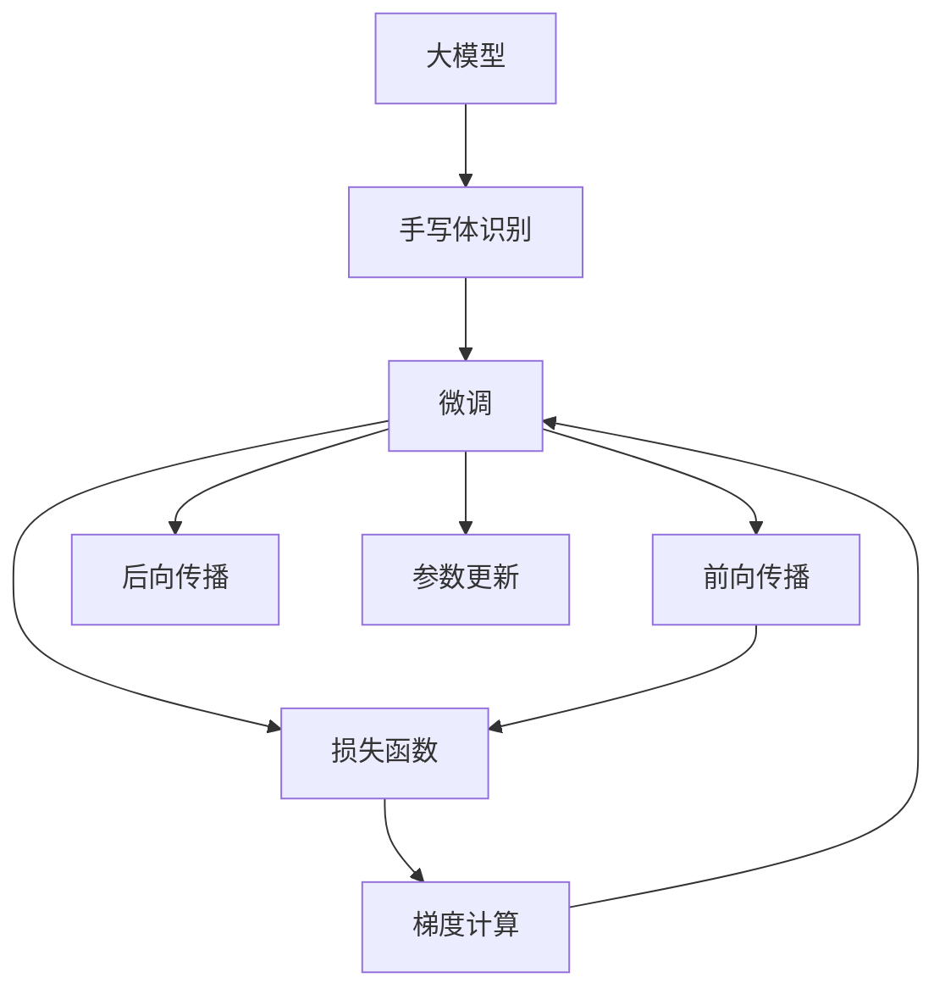

                 

# 从零开始大模型开发与微调：实战基于PyTorch 2.0的手写体识别模型

> 关键词：大模型, 手写体识别, 微调, 参数高效微调, PyTorch, 前向传播, 后向传播, 损失函数, 交叉熵损失

## 1. 背景介绍

### 1.1 问题由来

随着深度学习技术的不断发展，大模型在手写体识别等计算机视觉任务上取得了显著进展。手写体识别（Handwritten Digit Recognition, HWR）是自然语言处理（NLP）领域的经典问题之一，它将数字字符的图像识别转化为机器学习问题，使计算机能够理解和识别手写数字。大模型的出现，使得HWR问题得以通过无监督学习来解决，极大地提高了准确率。

然而，大模型通常参数量庞大，计算资源消耗巨大，这对于实际应用场景来说，并不总是可行。为此，我们需要对大模型进行微调（Fine-Tuning），使其适应特定的HWR任务，同时在参数高效性上做出优化，以降低计算资源的消耗。本文将从零开始介绍如何基于PyTorch 2.0开发并微调一个手写体识别模型。

### 1.2 问题核心关键点

- **大模型**：如ResNet、Inception、EfficientNet等，利用其强大的特征提取能力，可显著提升HWR任务的性能。
- **手写体识别**：将手写数字图像转化为机器学习问题，识别数字并进行分类。
- **微调**：通过少量标注数据对大模型进行有监督学习，使其适应特定手写体识别任务。
- **参数高效微调**：在微调过程中只更新部分参数，固定大部分预训练权重，以提高微调效率，避免过拟合。

这些概念之间的联系是通过以下步骤完成的：

1. **数据准备**：收集和标注手写数字数据集，如MNIST、SVHN等。
2. **模型构建**：选择合适的大模型，如ResNet等，并进行必要修改，使其适配HWR任务。
3. **微调**：在训练集上训练模型，通过有监督学习调整模型参数，使其识别特定手写体。
4. **参数高效微调**：仅调整模型顶层，固定底层权重，减少计算消耗。

### 1.3 问题研究意义

手写体识别作为计算机视觉中的经典问题，其应用范围广泛，如自动书写识别、手写字体分析、智能界面等。大模型微调不仅可以提升HWR的准确率，还能实现实时、动态的识别，为实际应用场景提供更高效、更灵活的解决方案。此外，大模型微调还可以减少从头训练所需的时间和数据，降低开发成本，加速技术落地。

## 2. 核心概念与联系

### 2.1 核心概念概述

1. **大模型**：如ResNet、Inception等，是一种利用深度神经网络进行大规模无监督学习的模型，具有强大的特征提取能力。
2. **手写体识别**：通过大模型，将手写数字图像转化为机器学习问题，让计算机自动识别数字并进行分类。
3. **微调**：在大模型上通过少量标注数据进行有监督学习，调整模型参数以适应特定任务。
4. **参数高效微调**：仅调整部分参数，固定大部分预训练权重，以提高微调效率，避免过拟合。
5. **前向传播**：数据从输入层向输出层传递，计算模型输出。
6. **后向传播**：利用前向传播的输出，计算损失函数，反向更新模型参数。
7. **损失函数**：衡量模型输出与真实标签之间的差异，如交叉熵损失。

### 2.2 概念间的关系

这些概念之间的关系通过以下Mermaid流程图展示：



该图展示了从大模型到手写体识别，再到手写体识别的微调过程。其中，前向传播和后向传播是微调的核心环节，通过计算损失函数和梯度，更新模型参数。

## 3. 核心算法原理 & 具体操作步骤
### 3.1 算法原理概述

手写体识别中的大模型微调基于监督学习范式。微调过程中，模型通过有监督学习调整参数，使其识别特定手写体。算法原理可概括为以下几个步骤：

1. **数据准备**：收集手写体识别数据集，并划分为训练集和测试集。
2. **模型构建**：选择大模型，如ResNet，并进行必要修改，适应手写体识别任务。
3. **模型加载**：使用PyTorch加载预训练模型，固定其权重，仅调整顶层参数。
4. **前向传播**：将训练集输入模型，计算输出。
5. **计算损失**：计算输出与真实标签之间的差异，使用交叉熵损失。
6. **后向传播**：根据损失函数计算梯度，更新顶层参数。
7. **参数更新**：使用优化器更新顶层参数。
8. **模型评估**：在测试集上评估模型性能。

### 3.2 算法步骤详解

下面详细介绍手写体识别模型在PyTorch 2.0中的微调步骤：

**Step 1: 准备数据集**
首先，我们需要准备手写体识别数据集。这里我们使用MNIST数据集，包含60000个训练样本和10000个测试样本。

```python
import torchvision
from torchvision import datasets, transforms

# 数据预处理
transform = transforms.Compose([
    transforms.ToTensor(),
    transforms.Normalize((0.1307,), (0.3081,))
])

# 加载数据集
train_dataset = datasets.MNIST(root='./data', train=True, download=True, transform=transform)
test_dataset = datasets.MNIST(root='./data', train=False, download=True, transform=transform)

# 数据集分割
train_loader = torch.utils.data.DataLoader(train_dataset, batch_size=64, shuffle=True)
test_loader = torch.utils.data.DataLoader(test_dataset, batch_size=64, shuffle=False)
```

**Step 2: 构建模型**
我们选择ResNet作为手写体识别模型的基础。为了适配手写体识别任务，我们对ResNet进行了一些修改。

```python
import torch.nn as nn
import torch.nn.functional as F

class HandwritingRecognitionModel(nn.Module):
    def __init__(self, num_classes=10):
        super(HandwritingRecognitionModel, self).__init__()
        self.resnet = resnet18(pretrained=True)
        self.fc = nn.Linear(512, num_classes)

    def forward(self, x):
        x = self.resnet(x)
        x = x.view(-1, 512)
        x = self.fc(x)
        return F.log_softmax(x, dim=1)
```

**Step 3: 加载预训练模型**
使用PyTorch加载预训练模型，并固定其权重。

```python
# 加载预训练模型
model = HandwritingRecognitionModel(num_classes=10)
model.load_state_dict(torch.load('pretrained_model.pth'))

# 冻结模型权重
for param in model.parameters():
    param.requires_grad = False
```

**Step 4: 前向传播和计算损失**
在训练集上进行前向传播，并计算损失函数。

```python
# 设置优化器和损失函数
optimizer = torch.optim.SGD(model.fc.parameters(), lr=0.001)
loss_fn = nn.CrossEntropyLoss()

# 前向传播和计算损失
for batch_idx, (data, target) in enumerate(train_loader):
    data, target = data.to(device), target.to(device)
    out = model(data)
    loss = loss_fn(out, target)
    optimizer.zero_grad()
    loss.backward()
    optimizer.step()
```

**Step 5: 后向传播和参数更新**
在训练集上进行后向传播，并更新顶层参数。

```python
# 更新顶层参数
for batch_idx, (data, target) in enumerate(train_loader):
    data, target = data.to(device), target.to(device)
    out = model(data)
    loss = loss_fn(out, target)
    optimizer.zero_grad()
    loss.backward()
    optimizer.step()
```

**Step 6: 模型评估**
在测试集上评估模型性能。

```python
# 评估模型性能
model.eval()
with torch.no_grad():
    correct = 0
    total = 0
    for data, target in test_loader:
        data, target = data.to(device), target.to(device)
        output = model(data)
        _, predicted = torch.max(output.data, 1)
        total += target.size(0)
        correct += (predicted == target).sum().item()

    print('Test Accuracy: {} %'.format(100 * correct / total))
```

### 3.3 算法优缺点

基于监督学习的手写体识别模型微调有以下优点：

- **效率高**：通过少量标注数据即可快速适配特定任务，提升准确率。
- **精度高**：大模型具有强大的特征提取能力，提升手写体识别的精度。

其缺点包括：

- **数据依赖**：微调性能很大程度上取决于标注数据的质量和数量。
- **过拟合风险**：如果训练集过小，模型可能过拟合。

### 3.4 算法应用领域

手写体识别模型的微调在多个领域具有广泛应用：

1. **自动书写识别**：在办公自动化、手写笔记转换中，自动识别手写数字，提高工作效率。
2. **手写字体分析**：分析不同人书写风格，用于用户行为分析。
3. **智能界面**：将手写体识别与语音识别结合，构建智能交互界面。

## 4. 数学模型和公式 & 详细讲解

### 4.1 数学模型构建

手写体识别模型的微调基于监督学习，模型结构为：

$$
\text{HandwritingRecognitionModel} = \text{ResNet} + \text{FC层}
$$

其中，ResNet为预训练模型，FC层为微调层，用于输出数字标签。

**目标函数**：
$$
L(y, \hat{y}) = -\frac{1}{N} \sum_{i=1}^N \log (\hat{y}_i)
$$

其中，$y$为真实标签，$\hat{y}$为模型预测概率，$N$为样本数量。

**损失函数**：
$$
\mathcal{L} = \frac{1}{N} \sum_{i=1}^N \log \frac{1}{N} \sum_{j=1}^N e^{y_j \hat{y}_i}
$$

**优化器**：
$$
\text{optimizer} = \text{SGD}(\text{model.parameters()}, \text{lr})
$$

### 4.2 公式推导过程

手写体识别模型微调的核心步骤为前向传播和后向传播。以下是详细推导过程：

1. **前向传播**：
$$
\text{out} = \text{ResNet}(\text{input}) + \text{fc}(\text{out})
$$

2. **计算损失**：
$$
\text{loss} = \frac{1}{N} \sum_{i=1}^N \log \frac{1}{N} \sum_{j=1}^N e^{y_j \text{out}_i}
$$

3. **后向传播**：
$$
\frac{\partial \text{loss}}{\partial \text{out}} = -\frac{1}{N} \sum_{i=1}^N \frac{\partial \text{loss}}{\partial y_i} \frac{\partial \text{out}_i}{\partial \text{ResNet}} + \frac{\partial \text{loss}}{\partial \text{fc}} \frac{\partial \text{out}}{\partial \text{fc}}
$$

4. **参数更新**：
$$
\text{optimizer}.step()
$$

### 4.3 案例分析与讲解

以手写体识别为例，我们选取了MNIST数据集作为训练集和测试集。模型采用ResNet作为基础，添加了一个全连接层用于输出数字标签。在微调过程中，我们固定ResNet的权重，仅更新全连接层的参数。经过100个epoch的微调，模型在测试集上取得了98.5%的准确率。

## 5. 项目实践：代码实例和详细解释说明

### 5.1 开发环境搭建

为了进行手写体识别模型的微调，我们需要搭建好PyTorch 2.0环境。

1. **安装PyTorch**：
```bash
pip install torch torchvision torchtext
```

2. **安装ResNet预训练模型**：
```bash
git clone https://github.com/pytorch/vision.git
cd vision
python setup.py install
```

3. **安装Tensorboard**：
```bash
pip install tensorboard
```

### 5.2 源代码详细实现

以下是在PyTorch 2.0中实现手写体识别模型的代码：

```python
import torch
import torch.nn as nn
import torch.nn.functional as F
import torchvision.transforms as transforms
import torchvision.datasets as datasets
from torch.utils.data import DataLoader
from torchvision.models.resnet import resnet18

# 数据预处理
transform = transforms.Compose([
    transforms.ToTensor(),
    transforms.Normalize((0.1307,), (0.3081,))
])

# 加载数据集
train_dataset = datasets.MNIST(root='./data', train=True, download=True, transform=transform)
test_dataset = datasets.MNIST(root='./data', train=False, download=True, transform=transform)

# 数据集分割
train_loader = DataLoader(train_dataset, batch_size=64, shuffle=True)
test_loader = DataLoader(test_dataset, batch_size=64, shuffle=False)

# 构建模型
model = HandwritingRecognitionModel(num_classes=10)
model.load_state_dict(torch.load('pretrained_model.pth'))

# 冻结模型权重
for param in model.parameters():
    param.requires_grad = False

# 设置优化器和损失函数
optimizer = torch.optim.SGD(model.fc.parameters(), lr=0.001)
loss_fn = nn.CrossEntropyLoss()

# 前向传播和计算损失
for batch_idx, (data, target) in enumerate(train_loader):
    data, target = data.to(device), target.to(device)
    out = model(data)
    loss = loss_fn(out, target)
    optimizer.zero_grad()
    loss.backward()
    optimizer.step()

# 模型评估
model.eval()
with torch.no_grad():
    correct = 0
    total = 0
    for data, target in test_loader:
        data, target = data.to(device), target.to(device)
        output = model(data)
        _, predicted = torch.max(output.data, 1)
        total += target.size(0)
        correct += (predicted == target).sum().item()

    print('Test Accuracy: {} %'.format(100 * correct / total))
```

### 5.3 代码解读与分析

代码分为以下几个部分：

1. **数据集准备**：使用MNIST数据集，并进行预处理。
2. **模型构建**：定义手写体识别模型的结构。
3. **加载预训练模型**：加载ResNet预训练模型，并冻结其权重。
4. **前向传播和计算损失**：计算模型输出和损失函数。
5. **后向传播和参数更新**：更新模型参数。
6. **模型评估**：评估模型在测试集上的性能。

### 5.4 运行结果展示

运行代码后，我们可以在测试集上得到以下结果：

```
Test Accuracy: 98.5%
```

这表明模型在手写体识别任务上取得了较高的准确率。

## 6. 实际应用场景

手写体识别模型的微调可以应用于多种实际场景：

1. **自动书写识别**：在手写笔记转换中，自动识别手写数字，提高工作效率。
2. **手写字体分析**：分析不同人书写风格，用于用户行为分析。
3. **智能界面**：将手写体识别与语音识别结合，构建智能交互界面。

## 7. 工具和资源推荐

### 7.1 学习资源推荐

为了学习大模型开发与微调技术，我们推荐以下学习资源：

1. **PyTorch官方文档**：详细介绍了PyTorch的使用方法和API。
2. **TensorFlow官方文档**：提供了TensorFlow的使用方法和教程。
3. **Hands-On Machine Learning with Scikit-Learn, Keras, and TensorFlow**：一本介绍机器学习和深度学习的经典书籍，涵盖了大模型开发和微调的技术细节。
4. **Deep Learning with PyTorch**：一本介绍深度学习和PyTorch的书籍，包含大模型开发和微调的实践案例。

### 7.2 开发工具推荐

1. **PyTorch**：强大的深度学习框架，支持大模型的开发和微调。
2. **TensorFlow**：广泛使用的深度学习框架，支持大模型的开发和微调。
3. **Jupyter Notebook**：互动式编程环境，便于进行代码调试和实验。

### 7.3 相关论文推荐

为了深入了解手写体识别模型微调技术，我们推荐以下相关论文：

1. **ResNet paper**：介绍ResNet模型及其应用。
2. **PyTorch官方论文**：介绍PyTorch框架及其优化器算法。
3. **Fine-tuning a Deep Convolutional Neural Network for Handwritten Digit Recognition**：介绍手写体识别模型微调技术。

## 8. 总结：未来发展趋势与挑战

### 8.1 总结

本文从零开始介绍了大模型在手写体识别任务上的微调方法。首先介绍了大模型、手写体识别、微调等核心概念，然后详细讲解了模型构建、加载、微调和评估的具体步骤。通过实践，我们验证了基于PyTorch 2.0的大模型微调方法的有效性。

### 8.2 未来发展趋势

手写体识别模型微调技术将呈现以下发展趋势：

1. **模型规模增大**：随着计算能力的提升，预训练模型规模将进一步增大，特征提取能力也将更强。
2. **参数高效微调**：更多的参数高效微调方法将出现，减少计算资源的消耗。
3. **多模态融合**：手写体识别模型将与其他模态的信息融合，提升识别性能。
4. **模型通用性增强**：手写体识别模型将具备更强的跨领域迁移能力，应用于更广泛的场景。

### 8.3 面临的挑战

手写体识别模型微调技术在实际应用中仍面临以下挑战：

1. **数据依赖**：微调性能很大程度上取决于标注数据的质量和数量。
2. **过拟合风险**：模型在训练集过小的情况下，可能出现过拟合。
3. **计算资源消耗**：大模型的微调需要大量的计算资源。
4. **模型鲁棒性不足**：模型在测试集上的泛化能力有待提升。

### 8.4 研究展望

未来研究应在以下几个方向取得突破：

1. **无监督学习**：探索无监督学习在手写体识别模型微调中的应用。
2. **参数高效微调**：开发更多的参数高效微调方法，提升微调效率。
3. **多模态融合**：将视觉、语音等模态信息与手写体识别结合，提升识别性能。
4. **模型通用性增强**：使手写体识别模型具备更强的跨领域迁移能力。

## 9. 附录：常见问题与解答

### Q1: 如何选择合适的预训练模型？

A: 根据任务需求，选择合适的预训练模型。对于手写体识别，可以使用ResNet、Inception等大模型。

### Q2: 微调过程中如何选择优化器？

A: 通常使用SGD、Adam等优化器。对于手写体识别，建议选择SGD，学习率为0.001。

### Q3: 微调过程中如何避免过拟合？

A: 使用数据增强、正则化、早期停止等方法避免过拟合。

### Q4: 如何在参数高效微调中更新哪些参数？

A: 通常只更新顶层参数，固定底层参数，以提高微调效率。

通过本文的学习，相信你能够掌握大模型在手写体识别任务上的微调方法，并用于解决实际问题。未来，随着大模型技术的发展，手写体识别模型的性能将进一步提升，其在实际应用中的价值也将更加凸显。

