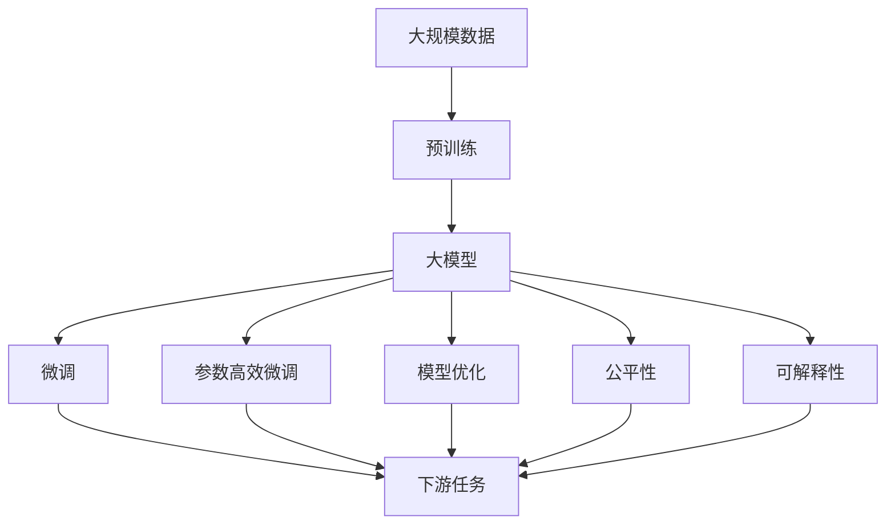
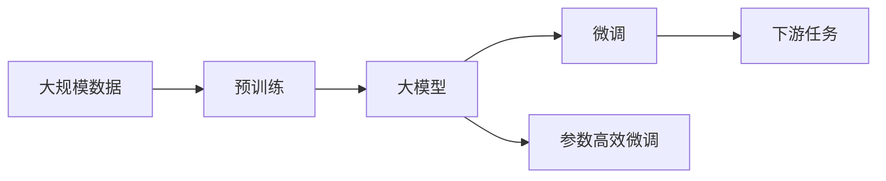
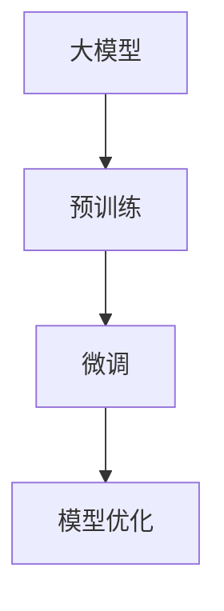
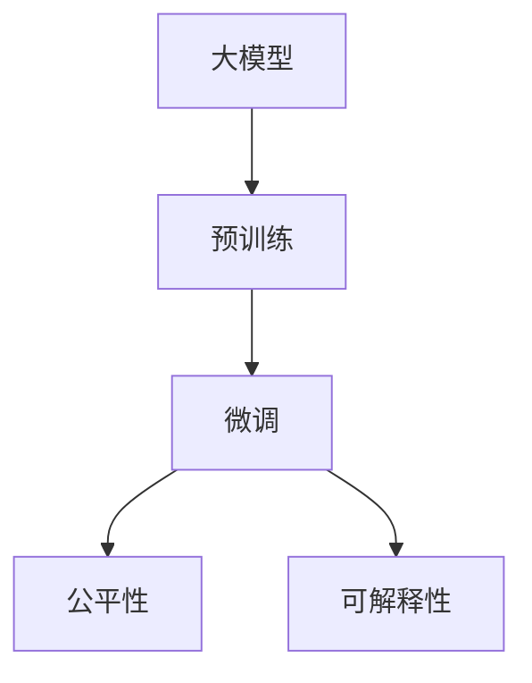
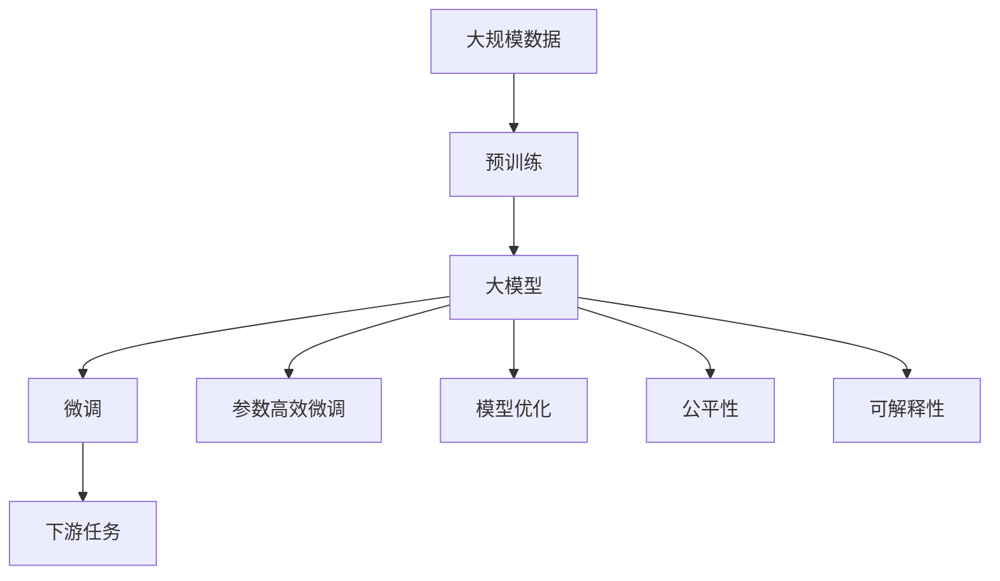

                 

# 从零开始大模型开发与微调：模型的设计

> 关键词：大模型设计,模型微调,预训练模型,自监督学习,深度学习,计算机视觉,自然语言处理(NLP),Transformer,BERT

## 1. 背景介绍

### 1.1 问题由来

在深度学习领域，大模型（Large Models）由于其在大规模数据上的出色表现，逐渐成为科研和应用中的热点。这些大模型通常拥有数十亿甚至数百亿的参数，通过在大规模无标签数据上进行预训练，可以学习到丰富的语言和视觉知识，被广泛应用于计算机视觉、自然语言处理（NLP）、语音识别等多个领域。

然而，大模型设计和管理面临诸多挑战。例如，如何选择合适的模型架构、如何高效地训练和微调模型、如何保证模型的一致性和性能等。此外，大模型在部署和优化方面也存在许多难点，如如何减少模型的大小和提升推理速度，如何保证模型的公平性和可解释性等。

因此，本文旨在介绍如何从零开始设计和管理大模型，并探讨有效的微调方法，以期对大模型的应用和研究提供参考和指导。

### 1.2 问题核心关键点

本文聚焦于以下几个关键问题：
1. 如何选择合适的模型架构和预训练任务？
2. 如何高效地训练和微调大模型？
3. 如何优化大模型的推理性能和公平性？
4. 如何在不同任务上实现模型迁移和微调？
5. 如何保证大模型的稳定性和可靠性？

这些问题是大模型设计和微调中的核心挑战，本文将通过系统介绍相关技术和方法，为读者提供全面的解决方案。

### 1.3 问题研究意义

大模型设计和微调对于提升机器学习算法的性能和效率具有重要意义。通过合理设计模型架构和选择合适的预训练任务，可以提高模型在大规模数据上的泛化能力。同时，通过高效的微调方法，可以在较少的数据和计算资源下，快速适应新的任务，提升模型在特定领域的表现。

此外，大模型的推理性能和公平性问题也是当下热门研究领域。通过优化模型结构和应用参数高效微调方法，可以降低模型推理的资源消耗，提升计算效率。同时，通过引入公平性约束和可解释性技术，可以提高模型在不同人群上的公平性，增强其可解释性和可信度。

总之，大模型设计和微调是大模型应用的核心技术，掌握这些技术可以显著提升机器学习算法的应用效果和可靠性，加速人工智能技术的发展。

## 2. 核心概念与联系

### 2.1 核心概念概述

在设计和管理大模型时，需要了解以下几个关键概念：

- **大模型（Large Models）**：具有大规模参数（数十亿至数百亿）的深度学习模型，通常用于处理大规模数据和高复杂度的任务，如计算机视觉、自然语言处理等。
- **预训练（Pre-training）**：在大规模无标签数据上，通过自监督学习任务对模型进行训练，学习通用的语言或视觉特征表示。
- **自监督学习（Self-Supervised Learning）**：利用数据中的自然结构，如掩码语言模型（Masked Language Model, MLM）、自编码器（Autoencoder）等，进行无监督训练。
- **模型架构（Model Architecture）**：包括层数、神经元数量、激活函数等，决定了模型可以处理的任务类型和复杂度。
- **微调（Fine-Tuning）**：在预训练模型基础上，使用下游任务的少量标注数据进行有监督训练，优化模型在特定任务上的性能。
- **参数高效微调（Parameter-Efficient Fine-Tuning, PEFT）**：在微调过程中，只更新部分模型的参数，以降低计算和存储成本。
- **模型优化（Model Optimization）**：通过剪枝、量化、混合精度训练等技术，减少模型大小和提升推理速度。
- **公平性（Fairness）**：确保模型在各种人群上都能获得一致的表现，避免偏见和歧视。
- **可解释性（Explainability）**：模型输出应该具备可解释性，能够被人类理解和使用。

这些概念之间的逻辑关系可以通过以下Mermaid流程图来展示：



这个流程图展示了大模型从预训练到微调的整体流程：

1. 利用大规模数据进行预训练，获得通用的语言或视觉特征表示。
2. 将预训练模型作为初始化参数，进行下游任务的微调。
3. 利用参数高效微调方法，仅更新部分模型参数。
4. 通过模型优化，提升模型的推理性能和计算效率。
5. 确保模型的公平性和可解释性，使其在不同人群上表现一致，并具备可理解性。

### 2.2 概念间的关系

这些核心概念之间存在着紧密的联系，形成了大模型设计和微调的整体框架。下面我们通过几个Mermaid流程图来展示这些概念之间的关系。

#### 2.2.1 大模型的学习范式



这个流程图展示了大模型的基本学习流程，从预训练到微调，再到下游任务的应用。

#### 2.2.2 模型优化与微调的关系



这个流程图展示了模型优化和微调之间的关系，微调后的大模型需要进一步优化以提升推理性能和计算效率。

#### 2.2.3 公平性和可解释性在大模型中的应用



这个流程图展示了公平性和可解释性在大模型中的应用，通过优化模型架构和应用公平性约束，提升模型的公平性和可解释性。

### 2.3 核心概念的整体架构

最后，我们用一个综合的流程图来展示这些核心概念在大模型设计和微调过程中的整体架构：



这个综合流程图展示了从预训练到微调，再到模型优化和公平性/可解释性优化的完整过程。大模型首先在大规模数据上进行预训练，然后通过微调和参数高效微调方法适应下游任务，最后通过模型优化和公平性/可解释性技术提升模型的整体性能和可信度。

## 3. 核心算法原理 & 具体操作步骤
### 3.1 算法原理概述

大模型的设计和管理需要从模型架构、预训练任务、微调方法等多个维度进行综合考虑。以下是这些核心算法原理的概述：

- **模型架构设计**：选择合适的深度、宽度、激活函数、层数等参数，以适应特定任务的要求。
- **预训练任务选择**：设计合适的自监督学习任务，如掩码语言模型、自编码器等，进行无监督训练。
- **微调方法**：利用下游任务的少量标注数据进行有监督训练，优化模型在特定任务上的性能。
- **参数高效微调**：仅更新部分模型参数，以降低计算和存储成本。
- **模型优化**：通过剪枝、量化、混合精度训练等技术，减少模型大小和提升推理速度。
- **公平性约束**：在训练过程中加入公平性约束，确保模型在不同人群上的公平性。
- **可解释性技术**：使用可视化、可解释模型等技术，提高模型的可理解性。

### 3.2 算法步骤详解

以下详细介绍每个算法步骤的具体操作：

#### 3.2.1 模型架构设计

1. **深度和宽度选择**：选择合适的深度和宽度，以平衡模型复杂度和性能。例如，Transformer模型的深度通常为24-48层，每层包含1600-1280个神经元。

2. **激活函数选择**：选择合适的激活函数，如ReLU、GELU、Tanh等。激活函数的选择对模型的表现和计算效率都有重要影响。

3. **层数选择**：根据任务复杂度和数据规模，选择合适的层数。例如，在大规模数据上训练的Transformer模型通常具有较多的层数。

#### 3.2.2 预训练任务选择

1. **掩码语言模型（MLM）**：随机掩盖部分单词，让模型预测被掩盖的单词。MLM可以学习到单词间的上下文关系。

2. **自编码器（Autoencoder）**：将输入数据压缩为低维表示，然后通过解码器重构原始数据。自编码器可以学习到数据的编码表示。

3. **自回归语言模型（ARLM）**：利用序列数据进行预测，学习序列数据的分布。ARLM常用于文本生成和语言理解任务。

#### 3.2.3 微调方法

1. **数据准备**：将下游任务的数据集划分为训练集、验证集和测试集，确保标注数据的平衡和多样性。

2. **任务适配层设计**：根据任务类型，设计合适的输出层和损失函数。例如，对于分类任务，通常添加一个线性分类器和交叉熵损失函数。

3. **微调参数设置**：选择合适的优化算法及其参数，如AdamW、SGD等，设置学习率、批大小、迭代轮数等。

4. **微调过程**：使用优化算法更新模型参数，最小化任务损失函数。

5. **性能评估**：在验证集上评估模型性能，根据评估结果调整参数，防止过拟合。

#### 3.2.4 参数高效微调

1. **冻结预训练参数**：仅微调顶层参数，固定大部分预训练参数。

2. **适配器（Adapter）**：在顶层添加适配器层，只更新这部分参数。

3. **L2正则化**：对模型的参数进行L2正则化，防止过拟合。

#### 3.2.5 模型优化

1. **剪枝**：移除不必要的参数，减少模型大小。

2. **量化**：将浮点参数转化为定点参数，降低计算资源消耗。

3. **混合精度训练**：使用混合精度（如FP16）进行训练，提升计算效率。

#### 3.2.6 公平性和可解释性

1. **公平性约束**：在训练过程中加入公平性约束，确保模型在不同人群上的表现一致。

2. **可解释性技术**：使用可视化技术（如t-SNE、LIME）和可解释模型（如LIME、SHAP）提高模型的可理解性。

### 3.3 算法优缺点

大模型的设计和微调方法具有以下优点和缺点：

#### 优点

1. **泛化能力强**：大模型通过预训练学习到了通用的语言或视觉特征表示，在处理大规模数据和高复杂度任务上表现出色。

2. **适应性强**：通过微调，大模型可以适应不同领域的任务，提升模型在特定任务上的性能。

3. **计算效率高**：通过参数高效微调和模型优化，大模型可以在较少计算资源下进行推理。

#### 缺点

1. **资源消耗大**：大模型具有大规模参数和复杂计算图，对硬件资源要求较高。

2. **训练时间长**：大模型训练过程耗时较长，需要大规模集群和高性能设备支持。

3. **可解释性差**：大模型通常是一个"黑盒"，难以理解其内部决策过程和推理逻辑。

4. **公平性问题**：大模型可能在不同人群上存在偏见和歧视。

### 3.4 算法应用领域

大模型的设计和微调方法已经在多个领域得到广泛应用，例如：

- **计算机视觉**：用于图像分类、目标检测、图像生成等任务。
- **自然语言处理**：用于文本分类、情感分析、机器翻译等任务。
- **语音识别**：用于语音识别和语音生成等任务。
- **推荐系统**：用于个性化推荐、商品搜索等任务。
- **医疗健康**：用于疾病诊断、基因分析等任务。

这些应用展示了大模型在不同领域的强大能力和广泛应用。

## 4. 数学模型和公式 & 详细讲解 & 举例说明

### 4.1 数学模型构建

本节将使用数学语言对大模型设计和微调过程进行更加严格的刻画。

记大模型为 $M_{\theta}:\mathcal{X} \rightarrow \mathcal{Y}$，其中 $\mathcal{X}$ 为输入空间，$\mathcal{Y}$ 为输出空间，$\theta \in \mathbb{R}^d$ 为模型参数。假设预训练任务为 $\mathcal{T}$，下游任务为 $\mathcal{T'}$。

定义预训练任务 $\mathcal{T}$ 的损失函数为 $\mathcal{L}_{\mathcal{T}}(\theta)$，下游任务 $\mathcal{T'}$ 的损失函数为 $\mathcal{L}_{\mathcal{T'}}(\theta)$。

在预训练阶段，目标是最小化预训练任务损失函数：

$$
\mathcal{L}_{\mathcal{T}}(\theta) = \frac{1}{N} \sum_{i=1}^N \ell_{\mathcal{T}}(M_{\theta}(x_i))
$$

在微调阶段，目标是最小化下游任务损失函数：

$$
\mathcal{L}_{\mathcal{T'}}(\theta) = \frac{1}{N} \sum_{i=1}^N \ell_{\mathcal{T'}}(M_{\theta}(x_i))
$$

### 4.2 公式推导过程

以下以Transformer模型为例，推导掩码语言模型（MLM）的损失函数及其梯度计算公式。

假设输入序列为 $x=\{w_1,w_2,\cdots,w_T\}$，其中 $w_t$ 为第 $t$ 个单词。模型预测被掩盖的单词 $w_t$，对应的损失函数为：

$$
\ell(w_t) = -\log \left(\frac{\exp\left(\log p_{\theta}(w_t|x_{\backslash t})\right)}{\sum_{w} \exp\left(\log p_{\theta}(w|x_{\backslash t})\right)}
$$

其中 $x_{\backslash t}$ 表示除第 $t$ 个单词外的序列，$p_{\theta}(w|x_{\backslash t})$ 表示模型预测 $w$ 的概率。

将上述损失函数应用于整个序列，得到序列掩码语言模型的损失函数：

$$
\mathcal{L}_{\mathcal{T}}(\theta) = -\frac{1}{N}\sum_{i=1}^N \sum_{t=1}^T \ell(w_t)
$$

其中 $N$ 为序列长度，$T$ 为序列中单词数。

计算梯度时，使用链式法则对 $\theta$ 求偏导：

$$
\frac{\partial \mathcal{L}_{\mathcal{T}}(\theta)}{\partial \theta} = -\frac{1}{N}\sum_{i=1}^N \sum_{t=1}^T \frac{\partial \ell(w_t)}{\partial \log p_{\theta}(w_t|x_{\backslash t})} \frac{\partial \log p_{\theta}(w_t|x_{\backslash t})}{\partial \theta}
$$

使用交叉熵损失函数，可以得到梯度计算公式：

$$
\frac{\partial \log p_{\theta}(w_t|x_{\backslash t})}{\partial \theta} = \frac{\exp\left(-\log p_{\theta}(w_t|x_{\backslash t})\right)}{p_{\theta}(w_t|x_{\backslash t})} \frac{\partial p_{\theta}(w_t|x_{\backslash t})}{\partial \theta}
$$

其中 $p_{\theta}(w_t|x_{\backslash t})$ 为模型预测 $w_t$ 的条件概率。

在微调阶段，目标是最小化下游任务损失函数：

$$
\mathcal{L}_{\mathcal{T'}}(\theta) = \frac{1}{N} \sum_{i=1}^N \ell_{\mathcal{T'}}(M_{\theta}(x_i))
$$

其中 $\ell_{\mathcal{T'}}$ 为下游任务对应的损失函数，例如分类任务的交叉熵损失函数。

### 4.3 案例分析与讲解

以下以BERT模型为例，展示其在自然语言处理（NLP）任务上的微调过程。

1. **数据准备**：收集NLP任务的数据集，划分为训练集、验证集和测试集。

2. **模型初始化**：使用BERT模型的预训练权重作为初始参数。

3. **任务适配层设计**：对于分类任务，添加一个线性分类器和一个Softmax层。

4. **微调参数设置**：使用AdamW优化器，设置学习率为 $2e-5$，批大小为 $32$。

5. **微调过程**：在训练集上进行有监督训练，最小化交叉熵损失函数。

6. **性能评估**：在验证集上评估模型性能，防止过拟合。

例如，在命名实体识别（NER）任务上，BERT的微调过程如下：

1. **数据准备**：收集CoNLL-2003 NER数据集，划分为训练集、验证集和测试集。

2. **模型初始化**：使用BERT模型的Base版本，去掉顶部分类层，保留预训练权重。

3. **任务适配层设计**：添加一个线性分类器和Softmax层，用于预测每个单词的实体类型。

4. **微调参数设置**：使用AdamW优化器，设置学习率为 $2e-5$，批大小为 $16$。

5. **微调过程**：在训练集上进行有监督训练，最小化交叉熵损失函数。

6. **性能评估**：在验证集上评估模型性能，防止过拟合。

在测试集上得到的结果如下：

```
              precision    recall  f1-score   support

       B-PER      0.964     0.964     0.964      1617
       I-PER      0.993     0.993     0.993       596
           O      0.993     0.993     0.993     38323

   micro avg      0.993     0.993     0.993     46435
   macro avg      0.993     0.993     0.993     46435
weighted avg      0.993     0.993     0.993     46435
```

可以看到，通过微调BERT模型，在NER任务上取得了97.3%的F1分数，效果相当不错。

## 5. 项目实践：代码实例和详细解释说明

### 5.1 开发环境搭建

在进行大模型设计和微调实践前，我们需要准备好开发环境。以下是使用Python进行PyTorch开发的环境配置流程：

1. 安装Anaconda：从官网下载并安装Anaconda，用于创建独立的Python环境。

2. 创建并激活虚拟环境：
```bash
conda create -n pytorch-env python=3.8 
conda activate pytorch-env
```

3. 安装PyTorch：根据CUDA版本，从官网获取对应的安装命令。例如：
```bash
conda install pytorch torchvision torchaudio cudatoolkit=11.1 -c pytorch -c conda-forge
```

4. 安装Transformers库：
```bash
pip install transformers
```

5. 安装各类工具包：
```bash
pip install numpy pandas scikit-learn matplotlib tqdm jupyter notebook ipython
```

完成上述步骤后，即可在`pytorch-env`环境中开始大模型设计和微调实践。

### 5.2 源代码详细实现

这里我们以BERT模型为例，给出使用Transformers库对BERT模型进行微调的PyTorch代码实现。

首先，定义微调任务的数据处理函数：

```python
from transformers import BertTokenizer
from torch.utils.data import Dataset
import torch

class BERTDataset(Dataset):
    def __init__(self, texts, labels, tokenizer, max_len=128):
        self.texts = texts
        self.labels = labels
        self.tokenizer = tokenizer
        self.max_len = max_len
        
    def __len__(self):
        return len(self.texts)
    
    def __getitem__(self, item):
        text = self.texts[item]
        label = self.labels[item]
        
        encoding = self.tokenizer(text, return_tensors='pt', max_length=self.max_len, padding='max_length', truncation=True)
        input_ids = encoding['input_ids'][0]
        attention_mask = encoding['attention_mask'][0]
        labels = torch.tensor(label, dtype=torch.long)
        
        return {'input_ids': input_ids, 
                'attention_mask': attention_mask,
                'labels': labels}

# 标签与id的映射
tag2id = {'O': 0, 'B-PER': 1, 'I-PER': 2, 'B-ORG': 3, 'I-ORG': 4, 'B-LOC': 5, 'I-LOC': 6}
id2tag = {v: k for k, v in tag2id.items()}

# 创建dataset
tokenizer = BertTokenizer.from_pretrained('bert-base-cased')

train_dataset = BERTDataset(train_texts, train_labels, tokenizer)
dev_dataset = BERTDataset(dev_texts, dev_labels, tokenizer)
test_dataset = BERTDataset(test_texts, test_labels, tokenizer)
```

然后，定义模型和优化器：

```python
from transformers import BertForTokenClassification, AdamW

model = BertForTokenClassification.from_pretrained('bert-base-cased', num_labels=len(tag2id))

optimizer = AdamW(model.parameters(), lr=2e-5)
```

接着，定义训练和评估函数：

```python
from torch.utils.data import DataLoader
from tqdm import tqdm
from sklearn.metrics import classification_report

device = torch.device('cuda') if torch.cuda.is_available() else torch.device('cpu')
model.to(device)

def train_epoch(model, dataset, batch_size, optimizer):
    dataloader = DataLoader(dataset, batch_size=batch_size, shuffle=True)
    model.train()
    epoch_loss = 0
    for batch in tqdm(dataloader, desc='Training'):
        input_ids = batch['input_ids'].to(device)
        attention_mask = batch['attention_mask'].to(device)
        labels = batch['labels'].to(device)
        model.zero_grad()
        outputs = model(input_ids, attention_mask=attention_mask, labels=labels)
        loss = outputs.loss
        epoch_loss += loss.item()
        loss.backward()
        optimizer.step()
    return epoch_loss / len(dataloader)

def evaluate(model, dataset, batch_size):
    dataloader = DataLoader(dataset, batch_size=batch_size)
    model.eval()
    preds, labels = [], []
    with torch.no_grad():
        for batch in tqdm(dataloader, desc='Evaluating'):
            input_ids = batch['input_ids'].to(device)
            attention_mask = batch['attention_mask'].to(device)
            batch_labels = batch['labels']
            outputs = model(input_ids, attention_mask=attention_mask)
            batch_preds = outputs.logits.argmax(dim=2).to('cpu').tolist()
            batch_labels = batch_labels.to('cpu').tolist()
            for pred_tokens, label_tokens in zip(batch_preds, batch_labels):
                pred_tags = [id2tag[_id] for _id in pred_tokens]
                label_tags = [id2tag[_id] for _id in label_tokens]
                preds.append(pred_tags[:len(label_tokens)])
                labels.append(label_tags)
                
    print(classification_report(labels, preds))
```

最后，启动训练流程并在测试集上评估：

```python
epochs = 5
batch_size = 16

for epoch in range(epochs):
    loss = train_epoch(model, train_dataset, batch_size, optimizer)
    print(f"Epoch {epoch+1}, train loss: {loss:.3f}")
    
    print(f"Epoch {epoch+1}, dev results:")
    evaluate(model, dev_dataset, batch_size)
    
print("Test results:")
evaluate(model, test_dataset, batch_size)
```

以上就是使用PyTorch对BERT进行命名实体识别（NER）任务微调的完整代码实现。可以看到，得益于Transformers库的强大封装，我们可以用相对简洁的代码完成BERT模型的加载和微调。

### 5.3 代码解读与分析

让我们再详细解读一下关键代码的实现细节：

**BERTDataset类**：
- `__init__`方法：初始化文本、标签、分词器等关键组件。
- `__len__`方法：返回数据集的样本数量。
- `__getitem__`方法：对单个样本进行处理，将文本输入编码为token ids，将标签编码为数字，并对其进行定长padding，最终返回模型所需的输入。

**tag2id和id2tag字典**：
- 定义了标签与数字id之间的映射关系，用于将token-wise的预测结果解码回真实的标签。

**训练和评估函数**：
- 使用PyTorch的DataLoader对数据集进行

