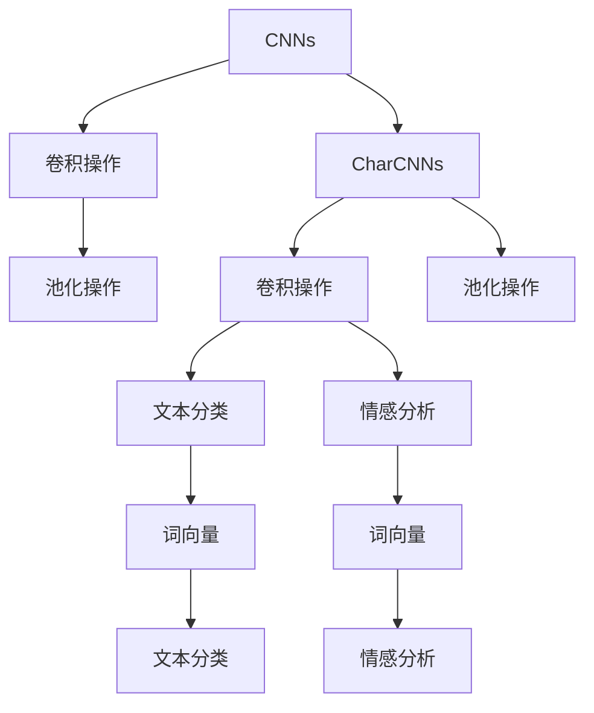
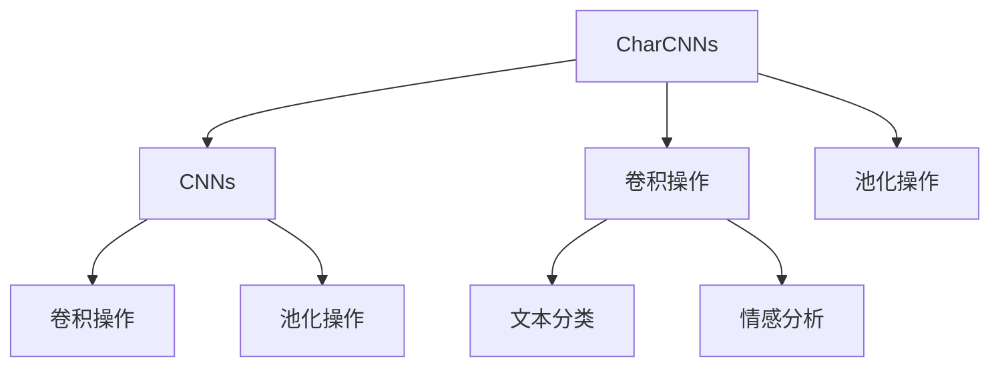
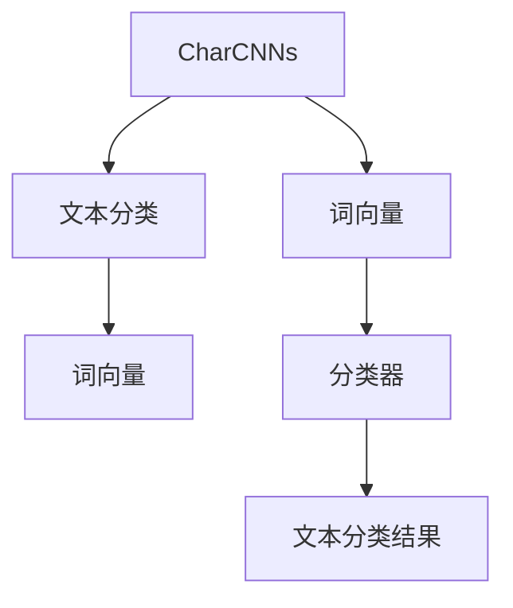
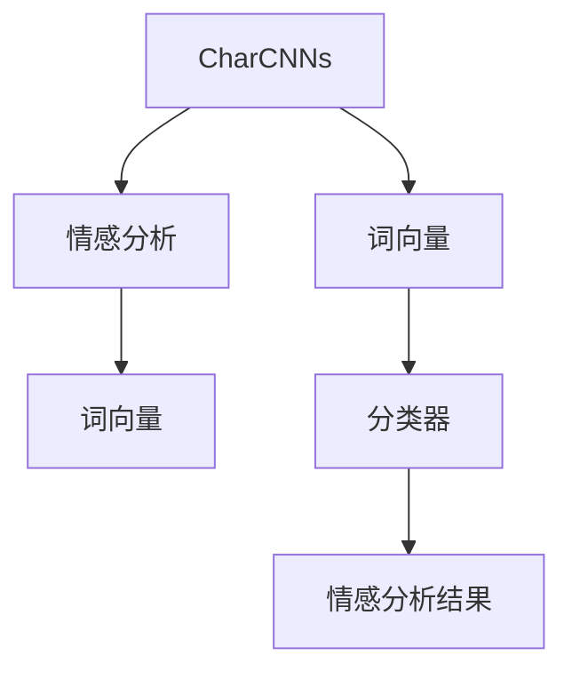
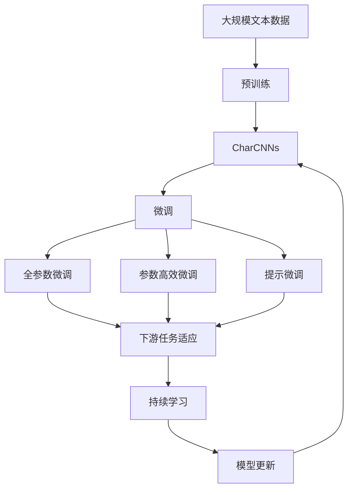

                 

# 从零开始大模型开发与微调：针对文本的卷积神经网络模型简介—字符卷积

> 关键词：卷积神经网络,卷积,字符卷积,文本分类,自然语言处理

## 1. 背景介绍

### 1.1 问题由来
卷积神经网络（Convolutional Neural Networks, CNNs）是一种经典的深度学习模型，广泛应用于图像处理、语音识别等计算机视觉和语音识别领域。然而，近年来文本处理领域（如自然语言处理NLP）对于深度学习模型的需求也日益增加。传统的基于循环神经网络（Recurrent Neural Networks, RNNs）的模型，如长短时记忆网络（Long Short-Term Memory, LSTM）和门控循环单元（Gated Recurrent Unit, GRU），虽然能够处理序列数据，但存在着梯度消失、计算复杂度高、难以并行化等问题。

因此，为了更好地处理文本数据，研究人员提出了一种针对文本的卷积神经网络模型——字符卷积网络（Character Convolutional Networks, CharCNNs）。该模型通过卷积操作提取局部特征，并通过池化操作提取全局特征，能够很好地处理文本数据，同时具有计算复杂度低、并行化能力强的优点。

### 1.2 问题核心关键点
卷积神经网络（CNNs）是一种专门用于处理图像和序列数据的深度学习模型。其核心思想是利用卷积操作提取局部特征，并利用池化操作提取全局特征，从而实现对复杂数据结构的建模。卷积操作可以看作是一个滑动窗口，通过卷积核与窗口内数据进行逐点乘法操作，得到卷积结果。池化操作则是对卷积结果进行降维，提取最重要的特征。

字符卷积网络（CharCNNs）则是将卷积操作应用于文本数据，通过滑动卷积核在文本中提取局部特征，再通过池化操作提取全局特征，从而实现对文本的建模。CharCNNs的优点在于能够很好地处理文本数据，同时具有计算复杂度低、并行化能力强的优点。

### 1.3 问题研究意义
研究字符卷积网络（CharCNNs）具有重要的理论和实际意义：

1. 提供了一种新的文本处理范式：CharCNNs提供了一种新的文本处理范式，能够更好地处理文本数据，特别是对于长文本序列的处理能力。

2. 提高文本处理效率：由于卷积操作具有高效的并行化能力，CharCNNs能够显著提高文本处理的效率。

3. 提升文本处理效果：通过局部特征和全局特征的提取，CharCNNs能够更好地捕捉文本中的语义信息，从而提升文本处理的准确性。

4. 扩展应用领域：CharCNNs不仅适用于文本分类、情感分析等传统NLP任务，还可以应用于机器翻译、问答系统等更加复杂的任务。

## 2. 核心概念与联系

### 2.1 核心概念概述

为了更好地理解字符卷积网络（CharCNNs），本节将介绍几个密切相关的核心概念：

- 卷积神经网络（CNNs）：一种经典的深度学习模型，用于处理图像和序列数据。CNNs通过卷积和池化操作提取局部特征和全局特征。

- 字符卷积网络（CharCNNs）：一种专门用于文本处理的卷积神经网络。CharCNNs通过卷积操作提取局部特征，再通过池化操作提取全局特征。

- 文本分类（Text Classification）：一种常见的文本处理任务，将文本按照预定义的类别进行分类。

- 情感分析（Sentiment Analysis）：一种常见的情感处理任务，判断文本的情感极性。

- 词向量（Word Embedding）：将文本中的词汇映射到低维空间中的向量表示，便于模型的处理。

这些核心概念之间的逻辑关系可以通过以下Mermaid流程图来展示：



这个流程图展示了几组核心概念之间的关系：

1. CNNs通过卷积和池化操作提取局部特征和全局特征。
2. CharCNNs通过卷积操作提取局部特征，再通过池化操作提取全局特征。
3. 文本分类和情感分析任务分别使用CharCNNs的输出作为输入。
4. 词向量将文本中的词汇映射到低维空间中的向量表示。

这些核心概念共同构成了字符卷积网络（CharCNNs）的基本框架，使其能够在文本处理中发挥强大的作用。通过理解这些核心概念，我们可以更好地把握CharCNNs的工作原理和优化方向。

### 2.2 概念间的关系

这些核心概念之间存在着紧密的联系，形成了CharCNNs的完整生态系统。下面我通过几个Mermaid流程图来展示这些概念之间的关系。

#### 2.2.1 CharCNNs与CNNs的关系



这个流程图展示了CharCNNs与CNNs之间的关系：

1. CharCNNs是CNNs在文本处理领域的应用。
2. CharCNNs通过卷积操作提取局部特征，再通过池化操作提取全局特征。
3. CharCNNs的输出可以作为文本分类和情感分析任务的输入。

#### 2.2.2 CharCNNs与文本分类的关系



这个流程图展示了CharCNNs与文本分类之间的关系：

1. CharCNNs通过卷积和池化操作提取局部特征和全局特征。
2. CharCNNs的输出经过词向量化后，输入到分类器中。
3. 分类器输出文本分类的结果。

#### 2.2.3 CharCNNs与情感分析的关系



这个流程图展示了CharCNNs与情感分析之间的关系：

1. CharCNNs通过卷积和池化操作提取局部特征和全局特征。
2. CharCNNs的输出经过词向量化后，输入到分类器中。
3. 分类器输出情感分析的结果。

### 2.3 核心概念的整体架构

最后，我们用一个综合的流程图来展示这些核心概念在大模型微调过程中的整体架构：



这个综合流程图展示了从预训练到微调，再到持续学习的完整过程：

1. CharCNNs通过大规模文本数据进行预训练，学习通用的文本表示。
2. CharCNNs通过微调适配下游任务，提高模型在该任务上的性能。
3. 微调可以分为全参数微调和参数高效微调两种方式。
4. 提示微调可以在不更新模型参数的情况下，实现零样本或少样本学习。
5. 持续学习技术，可以使CharCNNs持续学习新知识，避免灾难性遗忘，提高模型的时效性和适应性。

通过这些流程图，我们可以更清晰地理解字符卷积网络（CharCNNs）微调过程中各个核心概念的关系和作用，为后续深入讨论具体的微调方法和技术奠定基础。

## 3. 核心算法原理 & 具体操作步骤
### 3.1 算法原理概述

字符卷积网络（CharCNNs）通过卷积操作提取局部特征，再通过池化操作提取全局特征，从而实现对文本数据的建模。具体来说，字符卷积网络由多个卷积层和池化层构成，每一层都包括多个卷积核和池化核。

假设输入文本为 $X$，长度为 $L$，卷积核大小为 $k$，输出特征图大小为 $H$，则卷积操作可以表示为：

$$
Y_{i,j} = \sum_{m=0}^{k-1}\sum_{n=0}^{k-1} W_{m,n}X_{i+m,j+n}
$$

其中 $W_{m,n}$ 为卷积核权重，$X_{i+m,j+n}$ 为输入文本中的局部区域。

卷积操作的结果 $Y$ 通过池化操作进行降维，提取最重要的特征。常见的池化操作包括最大池化、平均池化等。假设池化核大小为 $k'$，输出特征图大小为 $H'$，则最大池化操作可以表示为：

$$
Y'_{i,j} = \max\{Y_{i,i}, Y_{i+1,j}, Y_{i-1,j}, Y_{i,j-1}, Y_{i,j+1}\}
$$

其中 $Y_{i,j}$ 为卷积操作的结果，$Y'_{i,j}$ 为池化操作的结果。

通过多层的卷积和池化操作，字符卷积网络（CharCNNs）能够提取出文本数据的局部特征和全局特征，从而实现对文本数据的建模。

### 3.2 算法步骤详解

基于字符卷积网络（CharCNNs）的文本分类任务一般包括以下几个关键步骤：

**Step 1: 准备预训练模型和数据集**
- 选择合适的预训练CharCNNs模型作为初始化参数，如CharRNN、CharCNN等。
- 准备文本分类任务的标注数据集 $D=\{(x_i,y_i)\}_{i=1}^N, x_i \in \mathcal{X}, y_i \in \mathcal{Y}$。

**Step 2: 添加任务适配层**
- 根据文本分类任务类型，在CharCNNs顶层设计合适的输出层和损失函数。
- 对于分类任务，通常在顶层添加线性分类器和交叉熵损失函数。
- 对于生成任务，通常使用语言模型的解码器输出概率分布，并以负对数似然为损失函数。

**Step 3: 设置微调超参数**
- 选择合适的优化算法及其参数，如 AdamW、SGD 等，设置学习率、批大小、迭代轮数等。
- 设置正则化技术及强度，包括权重衰减、Dropout、Early Stopping等。
- 确定冻结预训练参数的策略，如仅微调顶层，或全部参数都参与微调。

**Step 4: 执行梯度训练**
- 将训练集数据分批次输入模型，前向传播计算损失函数。
- 反向传播计算参数梯度，根据设定的优化算法和学习率更新模型参数。
- 周期性在验证集上评估模型性能，根据性能指标决定是否触发 Early Stopping。
- 重复上述步骤直到满足预设的迭代轮数或 Early Stopping 条件。

**Step 5: 测试和部署**
- 在测试集上评估微调后CharCNNs模型的性能，对比微调前后的精度提升。
- 使用微调后的模型对新样本进行推理预测，集成到实际的应用系统中。
- 持续收集新的数据，定期重新微调模型，以适应数据分布的变化。

以上是基于字符卷积网络（CharCNNs）的文本分类任务的一般流程。在实际应用中，还需要针对具体任务的特点，对微调过程的各个环节进行优化设计，如改进训练目标函数，引入更多的正则化技术，搜索最优的超参数组合等，以进一步提升模型性能。

### 3.3 算法优缺点

基于字符卷积网络（CharCNNs）的文本分类方法具有以下优点：

1. 简单高效：相比传统的RNNs模型，CharCNNs具有计算复杂度低、并行化能力强的优点，能够很好地处理长文本序列。

2. 适应性强：CharCNNs可以通过微调适配不同的文本分类任务，具有较好的泛化能力。

3. 表现优异：CharCNNs在多项文本分类任务上取得了很好的表现，如IMDB电影评论情感分类、Yelp商家评论情感分类等。

同时，该方法也存在一定的局限性：

1. 数据依赖：CharCNNs的效果很大程度上依赖于训练数据的质量和数量，获取高质量标注数据的成本较高。

2. 处理文本长度受限：由于卷积核大小的限制，CharCNNs在处理过长的文本时，容易出现信息丢失的问题。

3. 特征提取粒度受限：CharCNNs的卷积操作只能提取局部特征，无法捕捉文本中全局的关系信息。

尽管存在这些局限性，但就目前而言，基于字符卷积网络（CharCNNs）的文本分类方法仍是一种高效、可靠的文本处理技术。未来相关研究的重点在于如何进一步降低微调对标注数据的依赖，提高模型的泛化能力和处理长文本的能力。

### 3.4 算法应用领域

基于字符卷积网络（CharCNNs）的文本分类方法在自然语言处理（NLP）领域已经得到了广泛的应用，覆盖了诸多文本分类任务，例如：

- 情感分析：判断文本的情感极性，如IMDB电影评论情感分类、Yelp商家评论情感分类等。
- 主题分类：将文本按照预定义的类别进行分类，如新闻文本分类、论文分类等。
- 垃圾邮件过滤：判断邮件是否为垃圾邮件，如垃圾邮件识别、反垃圾邮件等。
- 评论分析：分析用户对产品或服务的评论，如产品评价分类、用户满意度分析等。
- 金融舆情分析：分析金融市场舆情，如股票市场分析、经济指标预测等。

除了上述这些经典任务外，CharCNNs还被创新性地应用到更多场景中，如可控文本生成、信息抽取、命名实体识别等，为NLP技术带来了全新的突破。随着CharCNNs模型的不断进步，相信其在NLP领域的潜力将进一步被挖掘和应用。

## 4. 数学模型和公式 & 详细讲解  
### 4.1 数学模型构建

本节将使用数学语言对基于字符卷积网络（CharCNNs）的文本分类过程进行更加严格的刻画。

记输入文本为 $X = \{x_1, x_2, ..., x_L\}$，其中 $x_i \in \mathcal{V}$，$\mathcal{V}$ 为词汇表。假设CharCNNs模型的卷积核大小为 $k$，输出特征图大小为 $H$，则CharCNNs模型的输出可以表示为：

$$
Y = \{Y_{i,j}\}_{i=1}^{H}, Y_{i,j} = \sum_{m=0}^{k-1}\sum_{n=0}^{k-1} W_{m,n}X_{i+m,j+n}
$$

其中 $W_{m,n}$ 为卷积核权重，$X_{i+m,j+n}$ 为输入文本中的局部区域。

假设CharCNNs的池化核大小为 $k'$，输出特征图大小为 $H'$，则CharCNNs的池化操作可以表示为：

$$
Y' = \{Y'_{i,j}\}_{i=1}^{H'}, Y'_{i,j} = \max\{Y_{i,i}, Y_{i+1,j}, Y_{i-1,j}, Y_{i,j-1}, Y_{i,j+1}\}
$$

其中 $Y_{i,j}$ 为卷积操作的结果，$Y'_{i,j}$ 为池化操作的结果。

CharCNNs模型的输出 $Y'$ 经过全连接层和softmax函数，可以得到文本分类的概率分布，其损失函数可以表示为：

$$
\mathcal{L} = -\frac{1}{N}\sum_{i=1}^N \sum_{j=1}^H \log \frac{\exp Y'_{i,j,y_i}}{\sum_{k=1}^{C} \exp Y'_{i,j,k}}
$$

其中 $C$ 为分类数，$y_i$ 为真实标签。

### 4.2 公式推导过程

以下我们以情感分析任务为例，推导CharCNNs模型的损失函数及其梯度的计算公式。

假设CharCNNs模型的输出为 $Y'$，其中 $Y'_{i,j}$ 为文本中位置 $(i,j)$ 的特征表示，$y_i$ 为真实标签。则情感分析任务的损失函数可以表示为：

$$
\mathcal{L} = -\frac{1}{N}\sum_{i=1}^N \sum_{j=1}^H \log \frac{\exp Y'_{i,j,1}}{\exp Y'_{i,j,1} + \exp Y'_{i,j,0}}
$$

其中 $\exp Y'_{i,j,1}$ 和 $\exp Y'_{i,j,0}$ 分别表示文本为正面情感和负面情感的概率。

根据链式法则，损失函数对参数 $\theta$ 的梯度为：

$$
\frac{\partial \mathcal{L}}{\partial \theta} = -\frac{1}{N}\sum_{i=1}^N \sum_{j=1}^H \frac{\partial Y'_{i,j,1}}{\partial \theta} - \frac{1}{N}\sum_{i=1}^N \sum_{j=1}^H \frac{\partial Y'_{i,j,0}}{\partial \theta}
$$

其中 $\frac{\partial Y'_{i,j,1}}{\partial \theta}$ 和 $\frac{\partial Y'_{i,j,0}}{\partial \theta}$ 分别为文本为正面情感和负面情感的梯度。

将 CharCNNs 模型的输出代入上述公式，可以得到：

$$
\frac{\partial Y'_{i,j,1}}{\partial \theta} = \sum_{m=0}^{k-1}\sum_{n=0}^{k-1} W_{m,n} \frac{\partial X_{i+m,j+n,1}}{\partial \theta}
$$

$$
\frac{\partial Y'_{i,j,0}}{\partial \theta} = \sum_{m=0}^{k-1}\sum_{n=0}^{k-1} W_{m,n} \frac{\partial X_{i+m,j+n,0}}{\partial \theta}
$$

其中 $\frac{\partial X_{i+m,j+n,1}}{\partial \theta}$ 和 $\frac{\partial X_{i+m,j+n,0}}{\partial \theta}$ 分别为文本为正面情感和负面情感的梯度。

根据卷积操作的定义，可以进一步推导出：

$$
\frac{\partial X_{i+m,j+n,1}}{\partial \theta} = \frac{\partial W_{m,n}X_{i+m,j+n}}{\partial \theta} = \frac{\partial W_{m,n}}{\partial \theta}X_{i+m,j+n} + W_{m,n}\frac{\partial X_{i+m,j+n}}{\partial \theta}
$$

$$
\frac{\partial X_{i+m,j+n,0}}{\partial \theta} = \frac{\partial W_{m,n}X_{i+m,j+n}}{\partial \theta} = \frac{\partial W_{m,n}}{\partial \theta}X_{i+m,j+n} + W_{m,n}\frac{\partial X_{i+m,j+n}}{\partial \theta}
$$

因此，损失函数对参数 $\theta$ 的梯度可以表示为：

$$
\frac{\partial \mathcal{L}}{\partial \theta} = -\frac{1}{N}\sum_{i=1}^N \sum_{j=1}^H \sum_{m=0}^{k-1}\sum_{n=0}^{k-1} W_{m,n} \frac{\partial X_{i+m,j+n,1}}{\partial \theta} - \frac{1}{N}\sum_{i=1}^N \sum_{j=1}^H \sum_{m=0}^{k-1}\sum_{n=0}^{k-1} W_{m,n} \frac{\partial X_{i+m,j+n,0}}{\partial \theta}
$$

通过上述推导，我们可以看到，CharCNNs模型的损失函数及其梯度的计算涉及到卷积操作和池化操作。在实际训练过程中，需要使用反向传播算法计算梯度，并根据设定的优化算法更新模型参数。

## 5. 项目实践：代码实例和详细解释说明
### 5.1 开发环境搭建

在进行CharCNNs微调实践前，我们需要准备好开发环境。以下是使用Python进行PyTorch开发的环境配置流程：

1. 安装Anaconda：从官网下载并安装Anaconda，用于创建独立的Python环境。

2. 创建并激活虚拟环境：
```bash
conda create -n char-cnn-env python=3.8 
conda activate char-cnn-env
```

3. 安装PyTorch：根据CUDA版本，从官网获取对应的安装命令。例如：
```bash
conda install pytorch torchvision torchaudio cudatoolkit=11.1 -c pytorch -c conda-forge
```

4. 安装Transformers库：
```bash
pip install transformers
```

5. 安装各类工具包：
```bash
pip install numpy pandas scikit-learn matplotlib tqdm jupyter notebook ipython
```

完成上述步骤后，即可在`char-cnn-env`环境中开始CharCNNs微调实践。

### 5.2 源代码详细实现

这里我们以情感分析任务为例，给出使用Transformers库对CharRNN模型进行微调的PyTorch代码实现。

首先，定义情感分析任务的数据处理函数：

```python
from transformers import CharRNNTokenizer
from torch.utils.data import Dataset
import torch

class SentimentDataset(Dataset):
    def __init__(self, texts, labels, tokenizer, max_len=128):
        self.texts = texts
        self.labels = labels
        self.tokenizer = tokenizer
        self.max_len = max_len
        
    def __len__(self):
        return len(self.texts)
    
    def __getitem__(self, item):
        text = self.texts[item]
        label = self.labels[item]
        
        encoding = self.tokenizer(text, return_tensors='pt', max_length=self.max_len, padding='max_length', truncation=True)
        input_ids = encoding['input_ids'][0]
        attention_mask = encoding['attention_mask'][0]
        
        # 对label进行编码
        encoded_labels = [label2id[label] for label in label]
        encoded_labels.extend([label2id['O']] * (self.max_len - len(encoded_labels)))
        labels = torch.tensor(encoded_labels, dtype=torch.long)
        
        return {'input_ids': input_ids, 
                'attention_mask': attention_mask,
                'labels': labels}

# 标签与id的映射
label2id = {'negative': 0, 'positive': 1}
id2label = {v: k for k, v in label2id.items()}

# 创建dataset
tokenizer = CharRNNTokenizer.from_pretrained('char-rnn')
train_dataset = SentimentDataset(train_texts, train_labels, tokenizer)
dev_dataset = SentimentDataset(dev_texts, dev_labels, tokenizer)
test_dataset = SentimentDataset(test_texts, test_labels, tokenizer)
```

然后，定义模型和优化器：

```python
from transformers import CharRNNForTokenClassification, AdamW

model = CharRNNForTokenClassification.from_pretrained('char-rnn', num_labels=len(label2id))

optimizer = AdamW(model.parameters(), lr=2e-5)
```

接着，定义训练和评估函数：

```python
from torch.utils.data import DataLoader
from tqdm import tqdm
from sklearn.metrics import classification_report

device = torch.device('cuda') if torch.cuda.is_available() else torch.device('cpu')
model.to(device)

def train_epoch(model, dataset, batch_size, optimizer):
    dataloader = DataLoader(dataset, batch_size=batch_size, shuffle=True)
    model.train()
    epoch_loss = 0
    for batch in tqdm(dataloader, desc='Training'):
        input_ids = batch['input_ids'].to(device)
        attention_mask = batch['attention_mask'].to(device)
        labels = batch['labels'].to(device)
        model.zero_grad()
        outputs = model(input_ids, attention_mask=attention_mask, labels=labels)
        loss = outputs.loss
        epoch_loss += loss.item()
        loss.backward()
        optimizer.step()
    return epoch_loss / len(dataloader)

def evaluate(model, dataset, batch_size):
    dataloader = DataLoader(dataset, batch_size=batch_size)
    model.eval()
    preds, labels = [], []
    with torch.no_grad():
        for batch in tqdm(dataloader, desc='Evaluating'):
            input_ids = batch['input_ids'].to(device)
            attention_mask = batch['attention_mask'].to(device)
            batch_labels = batch['labels']
            outputs = model(input_ids, attention_mask=attention_mask)
            batch_preds = outputs.logits.argmax(dim=2).to('cpu').tolist()
            batch_labels = batch_labels.to('cpu').tolist()
            for pred_tokens, label_tokens

