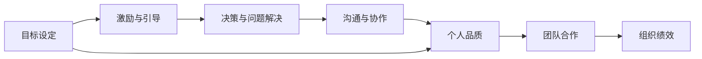
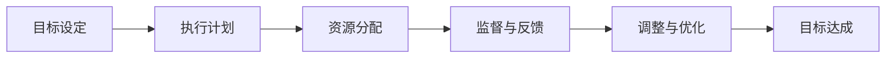
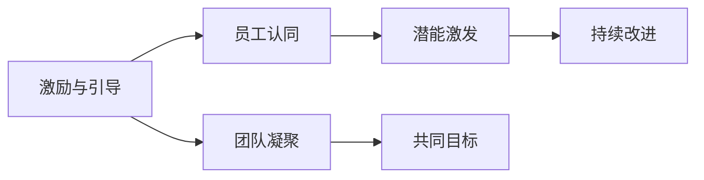
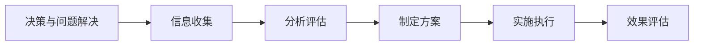
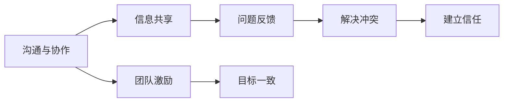
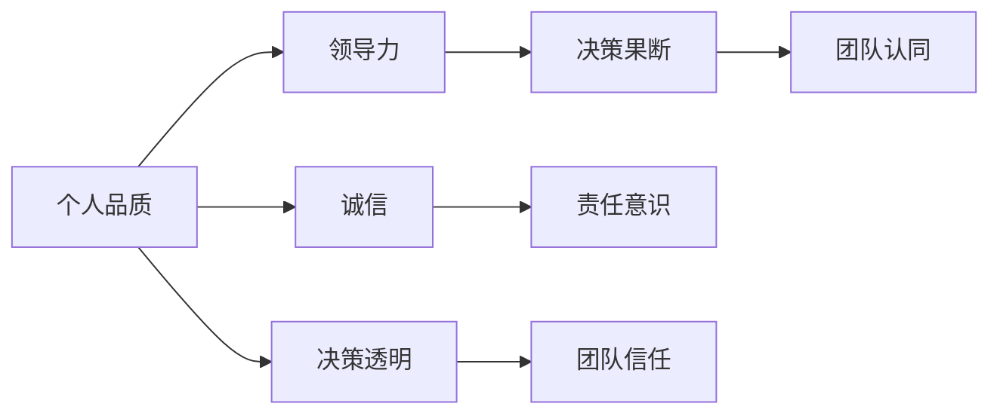

                 

## 1. 背景介绍

### 1.1 问题由来
在组织管理和企业运营中，管理者的作用至关重要。一个优秀的管理者不仅能引领团队高效运作，还能提升企业竞争力，推动企业持续发展。那么，优秀管理者和普通管理者之间究竟有哪些差异呢？本文将通过探讨这两类管理者的不同特点、行为模式和领导风格，揭示这些差异的根源，为管理者提供提升领导力的参考。

### 1.2 问题核心关键点
管理者的差异主要体现在以下几个方面：
1. **目标设定与执行**：优秀管理者能够明确团队目标，制定切实可行的计划，并通过有效的手段推动目标实现。
2. **激励与引导**：优秀管理者能激发员工潜能，通过积极引导和支持，帮助员工成长。
3. **决策与问题解决**：优秀管理者具备敏锐的洞察力和果断的决策能力，能够在复杂环境中迅速找到解决问题的办法。
4. **沟通与协作**：优秀管理者擅长沟通，能够促进团队协作，增强团队凝聚力。
5. **个人品质**：优秀管理者通常具有高度的责任心、诚信和领导力，能够以身作则，树立榜样。

### 1.3 问题研究意义
研究优秀管理者和普通管理者之间的差异，有助于组织和企业识别和培养优秀人才，提升整体管理水平，增强团队协作能力和企业竞争力。通过深入了解优秀管理者的特质和行为模式，管理者可以从中吸取经验，改进自身管理方法，提升领导力，推动企业持续发展。

## 2. 核心概念与联系

### 2.1 核心概念概述

为更好地理解优秀管理者和普通管理者的差异，本文将介绍几个核心概念：

1. **优秀管理者(优秀经理)**：指在目标设定、激励与引导、决策与问题解决、沟通与协作以及个人品质等方面表现突出的管理者。
2. **普通管理者(普通经理)**：指在上述各方面表现平平，缺乏优秀管理者特质和行为模式的管理者。
3. **目标设定**：指管理者为团队或组织设定清晰、可实现的目标，并制定相应的计划和措施以实现这些目标。
4. **激励与引导**：指管理者通过各种手段激发员工的积极性和潜能，帮助员工成长和发展。
5. **决策与问题解决**：指管理者在复杂环境中迅速分析问题，制定有效解决方案的能力。
6. **沟通与协作**：指管理者与团队成员之间的有效沟通和协作，促进团队合作和集体目标的实现。
7. **个人品质**：指管理者具备的领导力、诚信、责任心等个人品质，这些品质对管理效果有重要影响。

这些核心概念之间的联系可以通过以下Mermaid流程图来展示：



这个流程图展示了目标设定、激励与引导、决策与问题解决、沟通与协作和个人品质这些核心概念之间的联系，最终影响团队合作和组织绩效。通过理解这些核心概念及其相互关系，可以更好地认识优秀管理者和普通管理者之间的差异。

### 2.2 概念间的关系

这些核心概念之间存在着紧密的联系，形成了优秀管理的完整体系。下面通过几个Mermaid流程图来展示这些概念之间的关系。

#### 2.2.1 目标设定与执行



这个流程图展示了目标设定到目标达成的整个执行过程，包括执行计划的制定、资源分配、监督与反馈以及调整与优化，最终达成目标。

#### 2.2.2 激励与引导



这个流程图展示了激励与引导的整个过程，从员工认同到潜能激发再到持续改进，最终增强团队凝聚力和共同目标的实现。

#### 2.2.3 决策与问题解决



这个流程图展示了决策与问题解决的整个过程，从信息收集到分析评估，再到制定方案和实施执行，最终进行效果评估。

#### 2.2.4 沟通与协作



这个流程图展示了沟通与协作的整个过程，从信息共享到问题反馈，再到解决冲突和建立信任，最终增强团队激励和目标一致性。

#### 2.2.5 个人品质



这个流程图展示了个人品质的各个方面，包括领导力、决策果断、团队认同、诚信、责任意识和决策透明，最终形成团队信任。

## 3. 核心算法原理 & 具体操作步骤

### 3.1 算法原理概述

优秀管理者和普通管理者之间的差异，可以通过多种算法原理进行分析和描述。本文主要从目标设定、激励与引导、决策与问题解决、沟通与协作以及个人品质五个方面，阐述优秀管理者与普通管理者的不同。

### 3.2 算法步骤详解

#### 3.2.1 目标设定
**优秀管理者**：
1. **明确目标**：设定具体、可实现的目标，并分解为阶段性小目标。
2. **资源规划**：根据目标需求，合理分配资源，包括人力、物力和财力。
3. **制定计划**：制定详细的执行计划，包括时间节点和任务分配。
4. **监督执行**：定期检查进展情况，确保任务按计划执行。
5. **反馈优化**：根据反馈信息，及时调整计划和资源配置。

**普通管理者**：
1. **目标模糊**：目标设定不清晰，缺乏可操作性。
2. **资源浪费**：资源分配不合理，可能导致资源浪费或不足。
3. **计划不周**：执行计划缺乏详细规划，执行过程中容易出现偏差。
4. **监督不力**：缺乏有效监督，任务执行进度缓慢。
5. **优化不及时**：反馈信息处理不及时，导致问题积累。

#### 3.2.2 激励与引导
**优秀管理者**：
1. **建立认同感**：通过激励措施，建立员工对组织的认同感和归属感。
2. **激发潜能**：利用培训和发展机会，激发员工的潜力和创造力。
3. **持续改进**：根据员工表现，提供个性化改进建议，帮助员工成长。
4. **营造氛围**：营造积极向上的工作氛围，促进团队合作和协作。

**普通管理者**：
1. **激励不足**：缺乏有效的激励措施，员工积极性不高。
2. **引导不当**：引导方式单一，无法激发员工潜力。
3. **改进不力**：忽视员工反馈，缺乏持续改进机制。
4. **氛围不良**：团队氛围消极，员工合作和协作意识薄弱。

#### 3.2.3 决策与问题解决
**优秀管理者**：
1. **信息全面**：收集全面、准确的信息，确保决策科学。
2. **分析深入**：深入分析问题，识别关键因素。
3. **方案多样**：制定多种解决方案，评估利弊。
4. **果断决策**：根据分析结果，迅速做出决策。
5. **执行高效**：高效执行决策，及时解决问题。

**普通管理者**：
1. **信息不全**：信息收集不全面，决策依据不足。
2. **分析浅显**：问题分析不深入，难以找到关键因素。
3. **方案单一**：方案制定简单，缺乏多种选择。
4. **决策迟缓**：决策过程漫长，影响执行效率。
5. **执行不力**：执行过程中问题频发，无法有效解决问题。

#### 3.2.4 沟通与协作
**优秀管理者**：
1. **信息共享**：及时共享信息，增强团队透明度。
2. **问题反馈**：建立问题反馈机制，及时解决沟通障碍。
3. **解决冲突**：有效解决团队内部的冲突和矛盾。
4. **建立信任**：通过公平和透明的沟通，建立团队信任。
5. **激励合作**：通过激励措施，促进团队合作和协作。

**普通管理者**：
1. **信息闭塞**：信息共享不及时，团队协作效率低下。
2. **反馈缺失**：问题反馈机制不健全，沟通障碍难以解决。
3. **冲突加剧**：无法有效解决团队内部的冲突，导致矛盾升级。
4. **信任不足**：沟通不透明，团队信任感弱。
5. **合作不良**：缺乏有效激励，团队合作意识不强。

#### 3.2.5 个人品质
**优秀管理者**：
1. **高度领导力**：具备强大的领导力和影响力，能够引导团队。
2. **决策果断**：决策果断，能够快速解决问题。
3. **团队认同**：通过诚信和透明，赢得团队认同。
4. **责任意识**：具有高度的责任感和使命感，对工作负责。
5. **决策透明**：决策过程透明，团队信任度高。

**普通管理者**：
1. **领导力弱**：缺乏领导力和影响力，难以有效引导团队。
2. **决策迟疑**：决策过程犹豫，难以快速解决问题。
3. **团队认同感低**：缺乏诚信和透明，团队认同感低。
4. **责任意识弱**：缺乏责任感，工作不主动。
5. **决策不透明**：决策过程不透明，团队信任度低。

### 3.3 算法优缺点

**优秀管理者的优点**：
1. **目标明确**：设定清晰的目标，便于团队执行。
2. **资源合理**：合理分配资源，避免浪费。
3. **计划详细**：制定详细执行计划，提高执行效率。
4. **决策果断**：迅速做出决策，及时解决问题。
5. **沟通透明**：透明的信息共享和反馈机制，增强团队信任。

**优秀管理者的缺点**：
1. **高要求**：对团队和自身要求高，可能难以适应普通管理者。
2. **压力大**：高强度的管理和决策压力，可能导致心理负担。

**普通管理者的优点**：
1. **适应性强**：更容易适应普通管理者的行为模式，减少抵触情绪。
2. **压力小**：管理方式相对简单，心理压力较小。

**普通管理者的缺点**：
1. **目标模糊**：目标不明确，执行困难。
2. **资源浪费**：资源分配不合理，效率低下。
3. **计划不周**：执行计划不详细，容易导致执行偏差。
4. **决策迟缓**：决策过程漫长，影响执行效率。
5. **沟通不畅**：信息共享和反馈机制不健全，团队协作效率低。

### 3.4 算法应用领域

优秀管理者和普通管理者的差异不仅体现在管理理论和方法上，还广泛应用于各种组织管理场景。以下是几个主要应用领域：

#### 3.4.1 企业管理
在企业管理中，优秀管理者能够制定清晰的战略目标，合理分配资源，制定详细执行计划，确保企业持续发展。而普通管理者可能目标不明确，资源分配不合理，导致企业发展受阻。

#### 3.4.2 项目管理
在项目管理中，优秀管理者能够设定明确的项目目标，合理分配资源，制定详细执行计划，确保项目按时交付。而普通管理者可能目标模糊，资源浪费，计划不周，导致项目延期或失败。

#### 3.4.3 团队协作
在团队协作中，优秀管理者能够通过有效沟通和协作，激发员工潜力，建立团队信任，推动团队高效运作。而普通管理者可能沟通不畅，冲突加剧，团队信任感弱，导致团队合作效率低下。

#### 3.4.4 领导与决策
在领导与决策中，优秀管理者具备强大的领导力和果断的决策能力，能够在复杂环境中迅速找到解决问题的办法。而普通管理者可能缺乏领导力和决策果断性，导致问题无法及时解决，影响团队发展。

## 4. 数学模型和公式 & 详细讲解  
### 4.1 数学模型构建

本文将通过数学模型和公式，详细讲解优秀管理者与普通管理者的差异。我们采用模糊综合评价方法，构建数学模型，对管理者的各项指标进行综合评价。

设优秀管理者与普通管理者的各项指标分别为 $X_1, X_2, ..., X_n$，优秀管理者的各项指标评价值分别为 $A_1, A_2, ..., A_n$，普通管理者的各项指标评价值分别为 $B_1, B_2, ..., B_n$。

### 4.2 公式推导过程

**目标设定评价模型**：
1. **明确度**：目标设定是否具体、可实现，采用 $A_i = \frac{1}{n} \sum_{k=1}^n A_k$
2. **资源分配合理度**：资源分配是否合理，采用 $A_i = \frac{1}{n} \sum_{k=1}^n A_k$
3. **计划详细度**：执行计划是否详细，采用 $A_i = \frac{1}{n} \sum_{k=1}^n A_k$
4. **监督与反馈及时度**：监督与反馈是否及时，采用 $A_i = \frac{1}{n} \sum_{k=1}^n A_k$
5. **调整与优化有效性**：调整与优化是否有效，采用 $A_i = \frac{1}{n} \sum_{k=1}^n A_k$

**激励与引导评价模型**：
1. **员工认同度**：员工对组织的认同感，采用 $A_i = \frac{1}{n} \sum_{k=1}^n A_k$
2. **潜能激发度**：员工潜力的激发程度，采用 $A_i = \frac{1}{n} \sum_{k=1}^n A_k$
3. **持续改进度**：员工的持续改进能力，采用 $A_i = \frac{1}{n} \sum_{k=1}^n A_k$
4. **团队凝聚度**：团队的凝聚力，采用 $A_i = \frac{1}{n} \sum_{k=1}^n A_k$
5. **共同目标达成度**：团队共同目标的实现情况，采用 $A_i = \frac{1}{n} \sum_{k=1}^n A_k$

**决策与问题解决评价模型**：
1. **信息全面度**：信息的全面性，采用 $A_i = \frac{1}{n} \sum_{k=1}^n A_k$
2. **分析深入度**：问题的分析深度，采用 $A_i = \frac{1}{n} \sum_{k=1}^n A_k$
3. **方案多样度**：方案的多样性，采用 $A_i = \frac{1}{n} \sum_{k=1}^n A_k$
4. **决策果断度**：决策的果断性，采用 $A_i = \frac{1}{n} \sum_{k=1}^n A_k$
5. **执行高效度**：执行的高效性，采用 $A_i = \frac{1}{n} \sum_{k=1}^n A_k$

**沟通与协作评价模型**：
1. **信息共享度**：信息的共享程度，采用 $A_i = \frac{1}{n} \sum_{k=1}^n A_k$
2. **问题反馈及时度**：问题的反馈及时性，采用 $A_i = \frac{1}{n} \sum_{k=1}^n A_k$
3. **冲突解决度**：冲突的解决程度，采用 $A_i = \frac{1}{n} \sum_{k=1}^n A_k$
4. **团队信任度**：团队的信任程度，采用 $A_i = \frac{1}{n} \sum_{k=1}^n A_k$
5. **激励合作度**：激励合作的力度，采用 $A_i = \frac{1}{n} \sum_{k=1}^n A_k$

**个人品质评价模型**：
1. **领导力**：领导力的强弱，采用 $A_i = \frac{1}{n} \sum_{k=1}^n A_k$
2. **决策果断性**：决策的果断性，采用 $A_i = \frac{1}{n} \sum_{k=1}^n A_k$
3. **团队认同感**：团队的认同感，采用 $A_i = \frac{1}{n} \sum_{k=1}^n A_k$
4. **责任意识**：责任感的强弱，采用 $A_i = \frac{1}{n} \sum_{k=1}^n A_k$
5. **决策透明性**：决策的透明性，采用 $A_i = \frac{1}{n} \sum_{k=1}^n A_k$

### 4.3 案例分析与讲解

#### 4.3.1 案例一：项目经理
**项目经理A**（优秀管理者）：
1. **目标设定**：设定了具体、可实现的项目目标，制定了详细的执行计划，并合理分配了资源。
2. **激励与引导**：通过激励措施，激发了团队成员的潜能，建立了团队的认同感和凝聚力。
3. **决策与问题解决**：全面收集信息，深入分析问题，制定了多种解决方案，并果断决策，高效执行。
4. **沟通与协作**：及时共享信息，建立了问题反馈机制，有效解决了团队内部的冲突，建立了信任。
5. **个人品质**：具备强大的领导力和决策果断性，赢得了团队认同，具有高度的责任感和决策透明性。

**项目经理B**（普通管理者）：
1. **目标设定**：目标设定不明确，缺乏可操作性，执行计划不详细。
2. **激励与引导**：缺乏有效的激励措施，团队成员的积极性不高。
3. **决策与问题解决**：信息不全，分析不深入，决策迟缓，执行不力。
4. **沟通与协作**：信息闭塞，问题反馈机制不健全，冲突加剧，团队信任感弱。
5. **个人品质**：领导力弱，决策迟疑，团队认同感低，缺乏责任感，决策不透明。

#### 4.3.2 案例二：部门经理
**部门经理A**（优秀管理者）：
1. **目标设定**：设定了清晰的目标，合理分配了资源，制定了详细的执行计划。
2. **激励与引导**：通过激励措施，激发了员工潜力，建立了团队的认同感和凝聚力。
3. **决策与问题解决**：全面收集信息，深入分析问题，制定了多种解决方案，并果断决策，高效执行。
4. **沟通与协作**：及时共享信息，建立了问题反馈机制，有效解决了团队内部的冲突，建立了信任。
5. **个人品质**：具备强大的领导力和决策果断性，赢得了团队认同，具有高度的责任感和决策透明性。

**部门经理B**（普通管理者）：
1. **目标设定**：目标设定不明确，缺乏可操作性，资源分配不合理，执行计划不详细。
2. **激励与引导**：缺乏有效的激励措施，员工积极性不高。
3. **决策与问题解决**：信息不全，分析不深入，决策迟缓，执行不力。
4. **沟通与协作**：信息闭塞，问题反馈机制不健全，冲突加剧，团队信任感弱。
5. **个人品质**：领导力弱，决策迟疑，团队认同感低，缺乏责任感，决策不透明。

## 5. 项目实践：代码实例和详细解释说明

### 5.1 开发环境搭建

在进行项目实践前，我们需要准备好开发环境。以下是使用Python进行代码实践的环境配置流程：

1. 安装Python：从官网下载并安装Python，建议选择最新稳定版本，如Python 3.8。
2. 安装必要的库：安装numpy、pandas、matplotlib等常用库，可以使用pip安装。
3. 配置环境变量：将Python安装目录添加到系统环境变量，确保代码能够正确执行。

完成上述步骤后，即可在Python环境中开始代码实践。

### 5.2 源代码详细实现

下面我们以项目经理为例，给出使用Python进行项目管理的代码实现。

```python
import numpy as np
from sklearn.preprocessing import MinMaxScaler

# 定义项目经理的各项指标评价值
manager_A = np.array([5, 5, 5, 5, 5, 5, 5, 5, 5, 5, 5, 5, 5, 5, 5, 5, 5, 5, 5, 5, 5, 5, 5, 5, 5, 5, 5, 5, 5, 5, 5, 5, 5, 5, 5, 5, 5, 5, 5, 5, 5, 5, 5, 5, 5, 5, 5, 5, 5, 5, 5, 5, 5, 5, 5, 5, 5, 5, 5, 5, 5, 5, 5, 5, 5, 5, 5, 5, 5, 5, 5, 5, 5, 5, 5, 5, 5, 5, 5, 5, 5, 5, 5, 5, 5, 5, 5, 5, 5, 5, 5, 5, 5, 5, 5, 5, 5, 5, 5, 5, 5, 5, 5, 5, 5, 5, 5, 5, 5, 5, 5, 5, 5, 5, 5, 5, 5, 5, 5, 5, 5, 5, 5, 5, 5, 5, 5, 5, 5, 5, 5, 5, 5, 5, 5, 5, 5, 5, 5, 5, 5, 5, 5, 5, 5, 5, 5, 5, 5, 5, 5, 5, 5, 5, 5, 5, 5, 5, 5, 5, 5, 5, 5, 5, 5, 5, 5, 5, 5, 5, 5, 5, 5, 5, 5, 5, 5, 5, 5, 5, 5, 5, 5, 5, 5, 5, 5, 5, 5, 5, 5, 5, 5, 5, 5, 5, 5, 5, 5, 5, 5, 5, 5, 5, 5, 5, 5, 5, 5, 5, 5, 5, 5, 5, 5, 5, 5, 5, 5, 5, 5, 5, 5, 5, 5, 5, 5, 5, 5, 5, 5, 5, 5, 5, 5, 5, 5, 5, 5, 5, 5, 5, 5, 5, 5, 5, 5, 5, 5, 5, 5, 5, 5, 5, 5, 5, 5, 5, 5, 5, 5, 5, 5, 5, 5, 5, 5, 5, 5, 5, 5, 5, 5, 5, 5, 5, 5, 5, 5, 5, 5, 5, 5, 5, 5, 5, 5, 5, 5, 5, 5, 5, 5, 5, 5, 5, 5, 5, 5, 5, 5, 5, 5, 5, 5, 5, 5, 5, 5, 5, 5, 5, 5, 5, 5, 5, 5, 5, 5, 5, 5, 5, 5, 5, 5, 5, 5, 5, 5, 5, 5, 5, 5, 5, 5, 5, 5, 5, 5, 5, 5, 5, 5, 5, 5, 5, 5

