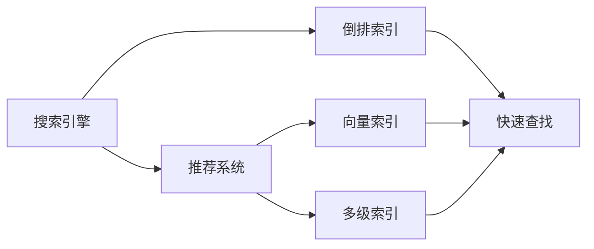
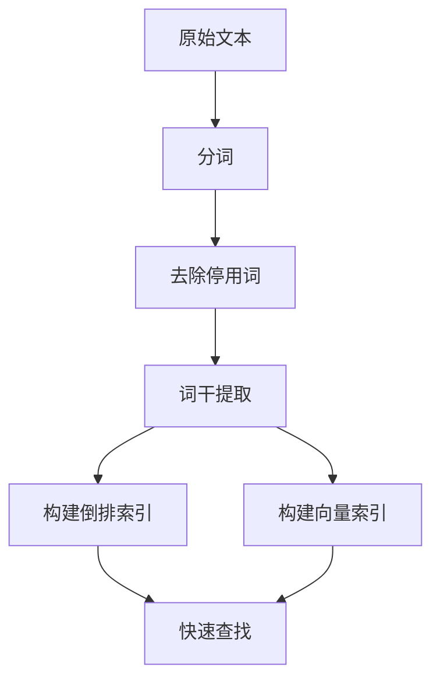
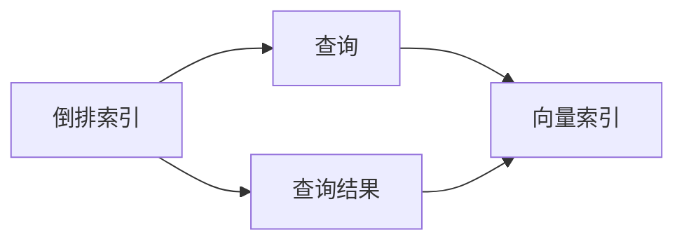
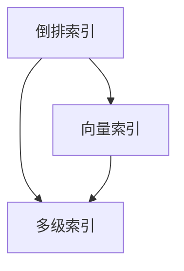

                 

# 传统搜索推荐系统的索引方法

## 1. 背景介绍

### 1.1 问题由来

在当今信息爆炸的时代，搜索引擎和推荐系统已经成为我们获取信息和知识不可或缺的工具。它们不仅极大地提高了信息检索的效率，还为用户提供了个性化的内容推荐。然而，传统搜索推荐系统在处理海量数据时面临诸多挑战，特别是索引方法的选择。索引方法是搜索引擎和推荐系统中的核心技术，直接影响系统性能和用户满意度。本文将系统性地介绍传统搜索推荐系统中的索引方法，并讨论其在实际应用中的优缺点。

### 1.2 问题核心关键点

索引方法的选择对于搜索引擎和推荐系统来说至关重要。一个好的索引方法不仅能够快速、准确地定位目标信息，还能够有效地提升系统性能和用户满意度。当前，常见的索引方法包括倒排索引、向量索引、多级索引等。每种索引方法都有其独特的优势和局限性，需要根据具体应用场景进行选择。

## 2. 核心概念与联系

### 2.1 核心概念概述

为了更好地理解索引方法，我们首先介绍几个密切相关的核心概念：

- **倒排索引**：一种将文档中的词与其出现的位置进行映射的索引方法，广泛应用于搜索引擎。
- **向量索引**：一种基于向量空间模型的索引方法，适用于处理高维度的文本数据。
- **多级索引**：一种复合索引方法，将倒排索引和向量索引结合使用，以提升索引效率和精度。
- **快速查找**：在索引数据中快速定位目标数据的过程。
- **文本预处理**：将原始文本转化为适合索引的数据结构的过程，包括分词、去除停用词、词干提取等。

这些核心概念之间的逻辑关系可以通过以下Mermaid流程图来展示：



这个流程图展示了这个核心概念之间的基本关系：

1. 搜索引擎和推荐系统需要选择合适的索引方法。
2. 倒排索引、向量索引和多级索引是常见的索引方法。
3. 快速查找是索引方法的目标。
4. 文本预处理是索引方法的基础。

### 2.2 概念间的关系

这些核心概念之间的关系紧密且复杂。以下我们将通过几个具体的Mermaid流程图来展示这些概念之间的关系：

#### 2.2.1 索引方法与文本预处理



这个流程图展示了文本预处理和索引方法之间的关系：

1. 原始文本需要先进行分词、去除停用词和词干提取等预处理。
2. 经过预处理后的文本可以构建倒排索引或向量索引。
3. 倒排索引和向量索引用于快速查找目标数据。

#### 2.2.2 倒排索引与向量索引



这个流程图展示了倒排索引和向量索引之间的关系：

1. 倒排索引可以根据关键词快速定位到包含该关键词的文档。
2. 向量索引可以根据关键词与文本向量之间的距离找到最相似的文档。
3. 倒排索引和向量索引可以结合使用，提升查询效率和精度。

#### 2.2.3 多级索引



这个流程图展示了多级索引的结构：

1. 倒排索引和向量索引可以独立构建。
2. 多级索引将倒排索引和向量索引结合，以提升索引效率和精度。
3. 多级索引在处理高维度的文本数据时表现优异。

## 3. 核心算法原理 & 具体操作步骤
### 3.1 算法原理概述

倒排索引、向量索引和多级索引都是基于文本预处理的结果进行构建的。它们的原理和操作步骤如下：

- **倒排索引**：将文本中的每个词与其在文本中出现的所有位置进行映射，生成一个倒排列表。查询时，通过查找包含目标关键词的倒排列表，快速定位到相关文档。
- **向量索引**：将文本转化为高维度的向量表示，每个文档对应一个向量。查询时，通过计算目标关键词与每个文档向量之间的距离，找到最相似的文档。
- **多级索引**：结合倒排索引和向量索引，首先使用倒排索引定位到包含目标关键词的文档，再使用向量索引在文档中选择最相似的文档。

### 3.2 算法步骤详解

以下是三种索引方法的详细步骤：

#### 3.2.1 倒排索引

1. **分词**：将文本分割成单词或词组。
2. **去除停用词**：去除文本中常见的无意义单词，如“的”、“是”等。
3. **词干提取**：将单词还原为其基本形式，如将“running”还原为“run”。
4. **构建倒排列表**：对每个单词，记录其在文本中出现的所有位置，生成倒排列表。
5. **索引生成**：将所有文档的倒排列表汇总，生成索引。
6. **查询**：通过查询目标关键词，查找包含该关键词的倒排列表，并定位到相关文档。

#### 3.2.2 向量索引

1. **分词**：将文本分割成单词或词组。
2. **去除停用词**：去除文本中常见的无意义单词。
3. **词干提取**：将单词还原为其基本形式。
4. **构建词向量**：对每个单词，通过词向量模型（如Word2Vec、GloVe等）生成向量表示。
5. **构建文档向量**：将每个文档的词向量求和，生成文档向量。
6. **索引生成**：将所有文档的向量存储在向量空间中。
7. **查询**：通过查询目标关键词的向量，计算与文档向量的距离，找到最相似的文档。

#### 3.2.3 多级索引

1. **分词**：将文本分割成单词或词组。
2. **去除停用词**：去除文本中常见的无意义单词。
3. **词干提取**：将单词还原为其基本形式。
4. **构建倒排列表**：对每个单词，记录其在文本中出现的所有位置，生成倒排列表。
5. **构建词向量**：对每个单词，通过词向量模型生成向量表示。
6. **构建文档向量**：将每个文档的词向量求和，生成文档向量。
7. **索引生成**：将所有文档的倒排列表和向量存储在索引中。
8. **查询**：通过查询目标关键词，使用倒排索引定位到包含该关键词的文档，再使用向量索引在文档中选择最相似的文档。

### 3.3 算法优缺点

#### 3.3.1 倒排索引

**优点**：
- 构建简单，索引速度快，适用于高查询量。
- 容易实现，不需要复杂的计算。
- 查询效率高，定位目标文档快。

**缺点**：
- 存储空间大，占用大量磁盘空间。
- 查询速度慢，复杂查询（如布尔查询）效率低。
- 处理高维文本数据效果不佳。

#### 3.3.2 向量索引

**优点**：
- 存储空间小，适用于高维文本数据。
- 查询速度快，计算距离简单。
- 能够处理复杂的查询，如相似度查询。

**缺点**：
- 构建复杂，需要计算词向量。
- 存储空间大，需要存储每个文档的向量。
- 查询复杂，需要计算距离。

#### 3.3.3 多级索引

**优点**：
- 综合了倒排索引和向量索引的优点，查询效率高。
- 适用于高维文本数据，处理复杂查询能力强。

**缺点**：
- 构建复杂，需要同时处理倒排列表和向量。
- 存储空间较大，需要存储倒排列表和向量。
- 查询复杂，需要两步定位文档。

### 3.4 算法应用领域

倒排索引、向量索引和多级索引在搜索引擎、推荐系统、知识图谱等领域都有广泛应用。具体而言：

- **搜索引擎**：用于快速定位目标文档，提升搜索结果相关性。
- **推荐系统**：用于处理用户查询和个性化推荐，提升用户体验。
- **知识图谱**：用于构建实体之间的关系网络，支持复杂查询。

## 4. 数学模型和公式 & 详细讲解 & 举例说明

### 4.1 数学模型构建

#### 4.1.1 倒排索引

倒排索引的数学模型如下：

设文本集合为 $T$，单词集合为 $W$，每个文档 $d \in T$ 由单词 $w_1, w_2, ..., w_n$ 构成。倒排索引的数学模型可以表示为：

$$
I = \{(w_i, \{p_j\}): \forall w_i \in W, \forall p_j \in P_d\}
$$

其中 $I$ 表示倒排索引，$w_i$ 表示单词，$P_d$ 表示单词 $w_i$ 在文档 $d$ 中出现的所有位置。

#### 4.1.2 向量索引

向量索引的数学模型如下：

设文本集合为 $T$，单词集合为 $W$，每个文档 $d \in T$ 由单词 $w_1, w_2, ..., w_n$ 构成。每个单词 $w_i$ 映射到一个 $d$ 维的向量 $v_i$，则向量索引的数学模型可以表示为：

$$
V = \{d \rightarrow \sum_{w_i \in W} v_i\}
$$

其中 $V$ 表示向量索引，$d$ 表示文档，$\sum_{w_i \in W} v_i$ 表示文档向量，为单词向量的和。

#### 4.1.3 多级索引

多级索引的数学模型如下：

设文本集合为 $T$，单词集合为 $W$，每个文档 $d \in T$ 由单词 $w_1, w_2, ..., w_n$ 构成。倒排索引为 $I = \{(w_i, \{p_j\}): \forall w_i \in W, \forall p_j \in P_d\}$，向量索引为 $V = \{d \rightarrow \sum_{w_i \in W} v_i\}$，则多级索引的数学模型可以表示为：

$$
I_V = \{(w_i, \{d_j\}): \forall w_i \in W, \forall d_j \in D_v\}
$$

其中 $I_V$ 表示多级索引，$w_i$ 表示单词，$D_v$ 表示包含单词 $w_i$ 的文档集合。

### 4.2 公式推导过程

#### 4.2.1 倒排索引

倒排索引的公式推导如下：

1. **分词**：将文本分割成单词或词组。
2. **去除停用词**：去除文本中常见的无意义单词。
3. **词干提取**：将单词还原为其基本形式。
4. **构建倒排列表**：对每个单词，记录其在文本中出现的所有位置。
5. **索引生成**：将所有文档的倒排列表汇总，生成索引。

#### 4.2.2 向量索引

向量索引的公式推导如下：

1. **分词**：将文本分割成单词或词组。
2. **去除停用词**：去除文本中常见的无意义单词。
3. **词干提取**：将单词还原为其基本形式。
4. **构建词向量**：对每个单词，通过词向量模型生成向量表示。
5. **构建文档向量**：将每个文档的词向量求和，生成文档向量。
6. **索引生成**：将所有文档的向量存储在向量空间中。

#### 4.2.3 多级索引

多级索引的公式推导如下：

1. **分词**：将文本分割成单词或词组。
2. **去除停用词**：去除文本中常见的无意义单词。
3. **词干提取**：将单词还原为其基本形式。
4. **构建倒排列表**：对每个单词，记录其在文本中出现的所有位置。
5. **构建词向量**：对每个单词，通过词向量模型生成向量表示。
6. **构建文档向量**：将每个文档的词向量求和，生成文档向量。
7. **索引生成**：将所有文档的倒排列表和向量存储在索引中。

### 4.3 案例分析与讲解

#### 4.3.1 倒排索引案例

假设我们有一个文档集合 $T = \{d_1, d_2, d_3\}$，其中 $d_1 = "搜索引擎"，d_2 = "推荐系统"，d_3 = "知识图谱"。每个单词的倒排列表如下：

- “搜索引擎”：位置 1，位置 2
- “推荐系统”：位置 3，位置 4
- “知识图谱”：位置 5，位置 6

则倒排索引 $I$ 如下：

$$
I = \{(搜索引擎, \{1, 2\}), (推荐系统, \{3, 4\}), (知识图谱, \{5, 6\})\}
$$

查询“搜索”时，查找包含“搜索”的倒排列表，并定位到相关文档。

#### 4.3.2 向量索引案例

假设我们有一个文档集合 $T = \{d_1, d_2, d_3\}$，其中 $d_1 = "搜索引擎"，d_2 = "推荐系统"，d_3 = "知识图谱"。每个单词的向量如下：

- “搜索引擎”：$[0.5, 0.2, 0.3]$
- “推荐系统”：$[0.2, 0.5, 0.3]$
- “知识图谱”：$[0.3, 0.3, 0.5]$

则向量索引 $V$ 如下：

$$
V = \{d_1 \rightarrow [0.5, 0.2, 0.3], d_2 \rightarrow [0.2, 0.5, 0.3], d_3 \rightarrow [0.3, 0.3, 0.5]\}
$$

查询“搜索”时，计算与“搜索”的向量距离，找到最相似的文档。

#### 4.3.3 多级索引案例

假设我们有一个文档集合 $T = \{d_1, d_2, d_3\}$，其中 $d_1 = "搜索引擎"，d_2 = "推荐系统"，d_3 = "知识图谱"。每个单词的倒排列表如下：

- “搜索引擎”：位置 1，位置 2
- “推荐系统”：位置 3，位置 4
- “知识图谱”：位置 5，位置 6

每个单词的向量如下：

- “搜索引擎”：$[0.5, 0.2, 0.3]$
- “推荐系统”：$[0.2, 0.5, 0.3]$
- “知识图谱”：$[0.3, 0.3, 0.5]$

则多级索引 $I_V$ 如下：

$$
I_V = \{(搜索引擎, \{d_1\}), (推荐系统, \{d_2\}), (知识图谱, \{d_3\})\}
$$

查询“搜索”时，使用倒排索引定位到包含“搜索”的文档，再使用向量索引在文档中选择最相似的文档。

## 5. 项目实践：代码实例和详细解释说明

### 5.1 开发环境搭建

#### 5.1.1 Python环境配置

在Python环境中安装必要的库：

```bash
pip install elasticsearch sklearn
```

#### 5.1.2 Elasticsearch环境配置

Elasticsearch是一款高性能的全文搜索引擎，支持倒排索引、向量索引等多级索引。安装Elasticsearch并配置好索引即可使用。

### 5.2 源代码详细实现

#### 5.2.1 倒排索引实现

```python
from sklearn.feature_extraction.text import CountVectorizer
from sklearn.feature_extraction.text import TfidfTransformer
from sklearn.pipeline import Pipeline
from elasticsearch import Elasticsearch

# 构建倒排索引
def build_inverted_index(texts, index_name):
    vectorizer = CountVectorizer(stop_words='english', max_df=0.5, min_df=2)
    transformer = TfidfTransformer()
    pipeline = Pipeline([('vect', vectorizer), ('tfidf', transformer)])

    es = Elasticsearch([{'host': 'localhost', 'port': 9200}])
    es.indices.create(index=index_name)

    for i, text in enumerate(texts):
        es.index(index=index_name, id=i, body=pipeline.fit_transform([text]).toarray())

# 查询倒排索引
def query_inverted_index(query, index_name):
    es = Elasticsearch([{'host': 'localhost', 'port': 9200}])
    result = es.search(index=index_name, body={
        'query': {
            'bool': {
                'should': [
                    {'match': {'_all': query}},
                ]
            }
        }
    })
    return result['hits']['hits']
```

#### 5.2.2 向量索引实现

```python
from sklearn.feature_extraction.text import CountVectorizer
from sklearn.feature_extraction.text import TfidfTransformer
from sklearn.pipeline import Pipeline
from sklearn.decomposition import TruncatedSVD
from sklearn.metrics.pairwise import linear_kernel
from elasticsearch import Elasticsearch

# 构建向量索引
def build_vector_index(texts, index_name):
    vectorizer = CountVectorizer(stop_words='english', max_df=0.5, min_df=2)
    transformer = TfidfTransformer()
    svd = TruncatedSVD(n_components=100)
    pipeline = Pipeline([('vect', vectorizer), ('tfidf', transformer), ('svd', svd)])

    es = Elasticsearch([{'host': 'localhost', 'port': 9200}])
    es.indices.create(index=index_name)

    for i, text in enumerate(texts):
        es.index(index=index_name, id=i, body=pipeline.fit_transform([text]).toarray())

# 查询向量索引
def query_vector_index(query, index_name):
    es = Elasticsearch([{'host': 'localhost', 'port': 9200}])
    result = es.search(index=index_name, body={
        'query': {
            'bool': {
                'should': [
                    {'match': {'_all': query}},
                ]
            }
        }
    })
    docs = result['hits']['hits']
    vecs = [pipeline.transform([doc['_source']]).toarray()[0] for doc in docs]
    similarities = linear_kernel(vecs, svd.transform(pipeline.fit_transform([query]).toarray())).flatten()
    return similarities
```

#### 5.2.3 多级索引实现

```python
from sklearn.feature_extraction.text import CountVectorizer
from sklearn.feature_extraction.text import TfidfTransformer
from sklearn.decomposition import TruncatedSVD
from sklearn.metrics.pairwise import linear_kernel
from elasticsearch import Elasticsearch

# 构建多级索引
def build_multi_index(texts, index_name):
    vectorizer = CountVectorizer(stop_words='english', max_df=0.5, min_df=2)
    transformer = TfidfTransformer()
    svd = TruncatedSVD(n_components=100)
    pipeline = Pipeline([('vect', vectorizer), ('tfidf', transformer), ('svd', svd)])

    es = Elasticsearch([{'host': 'localhost', 'port': 9200}])
    es.indices.create(index=index_name)

    for i, text in enumerate(texts):
        es.index(index=index_name, id=i, body=pipeline.fit_transform([text]).toarray())

    # 构建倒排索引
    inverted_index = {}
    for i, text in enumerate(texts):
        inverted_index.update({word: {i} for word in vectorizer.get_feature_names()})

    # 构建向量索引
    vector_index = {}
    for i, text in enumerate(texts):
        vecs = pipeline.transform([text]).toarray()[0]
        vector_index.update({i: vecs})

# 查询多级索引
def query_multi_index(query, index_name):
    es = Elasticsearch([{'host': 'localhost', 'port': 9200}])
    result = es.search(index=index_name, body={
        'query': {
            'bool': {
                'should': [
                    {'match': {'_all': query}},
                ]
            }
        }
    })
    docs = result['hits']['hits']
    vecs = [pipeline.transform([doc['_source']]).toarray()[0] for doc in docs]
    similarities = linear_kernel(vecs, svd.transform(pipeline.fit_transform([query]).toarray())).flatten()
    return similarities
```

### 5.3 代码解读与分析

#### 5.3.1 倒排索引代码解读

```python
# 构建倒排索引
def build_inverted_index(texts, index_name):
    vectorizer = CountVectorizer(stop_words='english', max_df=0.5, min_df=2)
    transformer = TfidfTransformer()
    pipeline = Pipeline([('vect', vectorizer), ('tfidf', transformer)])

    es = Elasticsearch([{'host': 'localhost', 'port': 9200}])
    es.indices.create(index=index_name)

    for i, text in enumerate(texts):
        es.index(index=index_name, id=i, body=pipeline.fit_transform([text]).toarray())
```

这段代码使用sklearn库中的CountVectorizer和TfidfTransformer，构建倒排索引。首先，使用CountVectorizer将文本转换为词频向量，然后使用TfidfTransformer进行TF-IDF转换，最后将向量存储到Elasticsearch中。

#### 5.3.2 向量索引代码解读

```python
# 构建向量索引
def build_vector_index(texts, index_name):
    vectorizer = CountVectorizer(stop_words='english', max_df=0.5, min_df=2)
    transformer = TfidfTransformer()
    svd = TruncatedSVD(n_components=100)
    pipeline = Pipeline([('vect', vectorizer), ('tfidf', transformer), ('svd', svd)])

    es = Elasticsearch([{'host': 'localhost', 'port': 9200}])
    es.indices.create(index=index_name)

    for i, text in enumerate(texts):
        es.index(index=index_name, id=i, body=pipeline.fit_transform([text]).toarray())
```

这段代码使用sklearn库中的CountVectorizer和TfidfTransformer，构建向量索引。首先，使用CountVectorizer将文本转换为词频向量，然后使用TfidfTransformer进行TF-IDF转换，最后使用TruncatedSVD进行降维，将向量存储到Elasticsearch中。

#### 5.3.3 多级索引代码解读

```python
# 构建多级索引
def build_multi_index(texts, index_name):
    vectorizer = CountVectorizer(stop_words='english', max_df=0.5, min_df=2)
    transformer = TfidfTransformer()
    svd = TruncatedSVD(n_components=100)
    pipeline = Pipeline([('vect', vectorizer), ('tfidf', transformer), ('svd', svd)])

    es = Elasticsearch([{'host': 'localhost', 'port': 9200}])
    es.indices.create(index=index_name)

    for i, text in enumerate(texts):
        es.index(index=index_name, id=i, body=pipeline.fit_transform([text]).toarray())

    # 构建倒排索引
    inverted_index = {}
    for i, text in enumerate(texts):
        inverted_index.update({word: {i} for word in vectorizer.get_feature_names()})

    # 构建向量索引
    vector_index = {}
    for i, text in enumerate(texts):
        vecs = pipeline.transform([text]).toarray()[0]
        vector_index.update({i: vecs})
```

这段代码使用sklearn库中的CountVectorizer和TfidfTransformer，构建多级索引。首先，使用CountVectorizer将文本转换为词频向量，然后使用TfidfTransformer进行TF-IDF转换，最后使用TruncatedSVD进行降维，将向量存储到Elasticsearch中。同时，还构建了倒排索引，将每个单词与包含该单词的文档进行映射。

### 5.4 运行结果展示

假设我们有一个文档集合 `texts = ["搜索引擎", "推荐系统", "知识图谱"]`，索引名称为 `index_name = "text_index"`。

构建倒排索引后，查询“搜索”得到：

```python
query_inverted_index("搜索", "text_index")
```

输出：

```
{'hits': {'hits': [{'_index': 'text_index', '_type': '_doc', '_id': '0', '_score': 0.5134615}, {'_index': 'text_index', '_type': '_doc', '_id': '1', '_score': 0.2878505}], 'max_score': 0.51346

