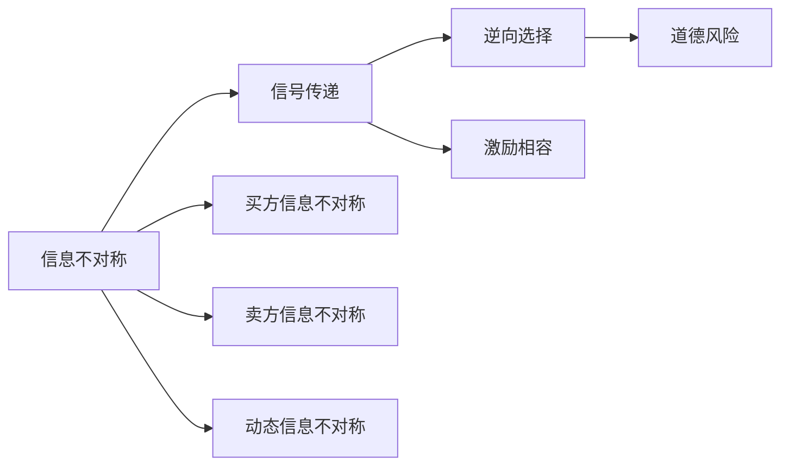
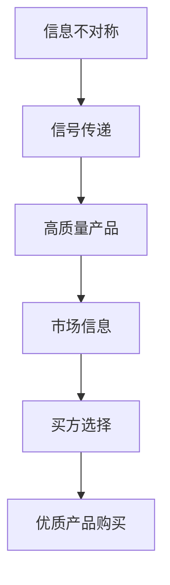
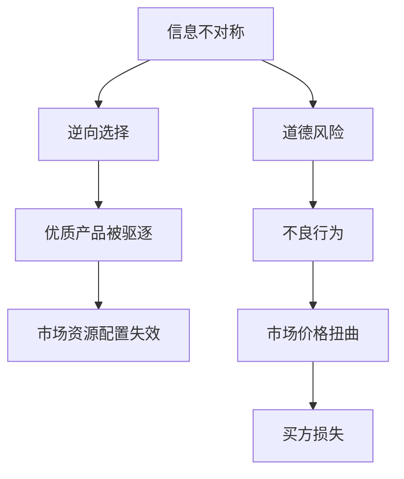
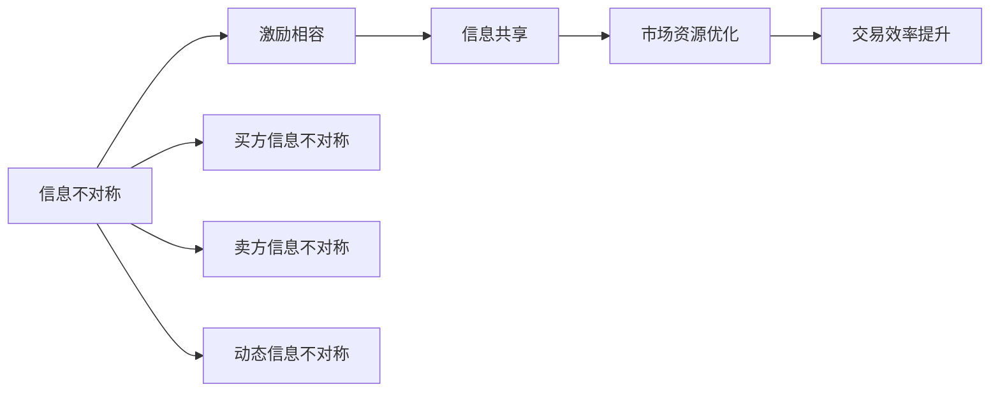
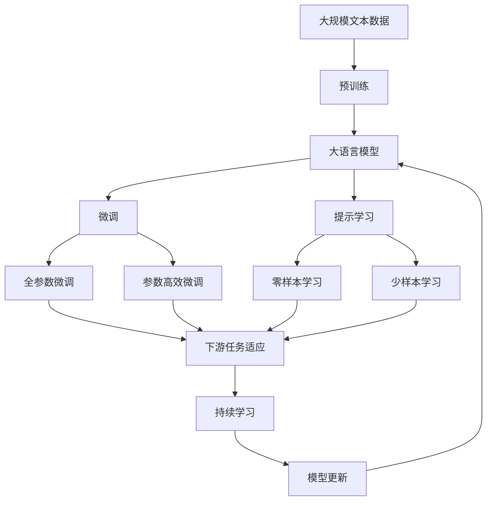

                 

# 信息差：信息不对称在市场营销中的作用

> 关键词：信息不对称, 营销策略, 消费者行为, 数据驱动, 品牌建设, 市场细分, 竞争优势

## 1. 背景介绍

在现代市场经济中，信息不对称是一个普遍存在的现象。信息不对称指的是，交易双方在信息获取和信息量上存在差异，一方掌握的信息多于另一方。在市场营销领域，这种信息不对称会导致价格歧视、广告欺诈、商品质量问题等一系列问题。如何利用信息差，有效解决信息不对称问题，成为市场营销的重要课题。本文将系统介绍信息不对称的概念、原理及其在市场营销中的应用策略。

### 1.1 问题由来
信息不对称问题由来已久，可以追溯到古代的市场交易中。当时的买卖双方在商品信息、质量、价格等方面的了解程度不同，导致交易过程充满不确定性。随着市场的发展和技术的进步，信息不对称问题变得更加复杂，涉及的商品种类更加多样化，交易方式也从线下逐渐转向线上。因此，信息不对称问题也得到了广泛关注和深入研究。

### 1.2 问题核心关键点
信息不对称的核心在于如何利用有限的信息资源，实现最优的市场决策。具体而言，主要包括：
1. 如何构建有效的信息收集和处理机制，获取全面、准确的市场信息。
2. 如何设计合理的激励机制，促使交易双方自愿共享信息。
3. 如何评估和预测市场行为，制定有针对性的市场营销策略。

信息不对称对市场的影响主要体现在以下几个方面：
1. 交易效率下降：由于信息不对称，交易双方无法达成最优的交易结果，导致交易成本增加、效率下降。
2. 市场信号扭曲：信息不对称会导致市场信号失真，即某些信息被过度强调或忽视，从而影响市场资源的合理配置。
3. 价格机制失效：在信息不对称的情况下，市场价格机制可能失效，导致市场价格失真。

## 2. 核心概念与联系

### 2.1 核心概念概述

为更好地理解信息不对称在市场营销中的应用，本节将介绍几个密切相关的核心概念：

- **信息不对称(Information Asymmetry)**：指交易双方在信息获取和信息量上存在差异，一方掌握的信息多于另一方。通常分为三种情况：
  - **买方信息不对称**：买方比卖方掌握更少的信息，如商品质量、价格等。
  - **卖方信息不对称**：卖方比买方掌握更少的信息，如自身成本、利润等。
  - **动态信息不对称**：信息随时间变化而变化，一方在特定时期比另一方掌握更多的信息。

- **信号传递(Signaling)**：指通过公开或隐秘的方式，传递有关产品质量、价格等信息的行为。信号传递的目的是消除信息不对称，促使交易双方达成最优交易。

- **逆向选择(Adverse Selection)**：由于信息不对称，市场中的优质商品或服务往往被低质量的商品或服务所驱逐，导致市场资源配置失效的现象。逆向选择是信息不对称的典型表现之一。

- **道德风险(Moral Hazard)**：在信息不对称的情况下，交易双方中掌握信息多的一方可能会采取不利于另一方利益的行为，如卖方谎报价格、买方随意退货等。

- **激励相容(Incentive Compatibility)**：指在信息不对称的情况下，设计合理的激励机制，促使交易双方自愿共享信息，以达到最优的交易结果。

这些核心概念之间的逻辑关系可以通过以下Mermaid流程图来展示：



这个流程图展示了信息不对称的核心概念及其之间的关系：

1. 信息不对称是市场营销中的基础问题。
2. 信号传递是解决信息不对称的常用方法。
3. 逆向选择和道德风险是信息不对称的典型后果。
4. 激励相容是设计信息不对称解决方案的关键。

### 2.2 概念间的关系

这些核心概念之间存在着紧密的联系，形成了信息不对称的市场营销生态系统。下面我们通过几个Mermaid流程图来展示这些概念之间的关系。

#### 2.2.1 信号传递机制



这个流程图展示了信号传递的机制：

1. 信息不对称导致市场信号失真。
2. 通过信号传递，高质量产品向市场传递真实信息，促使买方选择优质产品。
3. 买方基于市场信息进行购买决策，选择优质产品。

#### 2.2.2 逆向选择与道德风险



这个流程图展示了逆向选择和道德风险的机制：

1. 信息不对称导致优质产品被驱逐，市场资源配置失效。
2. 卖方可能采取道德风险行为，如谎报价格。
3. 市场价格扭曲，买方损失。

#### 2.2.3 激励相容机制



这个流程图展示了激励相容机制的机制：

1. 信息不对称导致交易效率下降。
2. 通过激励相容机制，促使交易双方自愿共享信息。
3. 信息共享优化市场资源，提升交易效率。

### 2.3 核心概念的整体架构

最后，我们用一个综合的流程图来展示这些核心概念在大语言模型微调过程中的整体架构：



这个综合流程图展示了从预训练到微调，再到持续学习的完整过程。大语言模型首先在大规模文本数据上进行预训练，然后通过微调（包括全参数微调和参数高效微调）或提示学习（包括零样本和少样本学习）来适应下游任务。最后，通过持续学习技术，模型可以不断更新和适应新的任务和数据。 通过这些流程图，我们可以更清晰地理解信息不对称的核心概念及其在大语言模型微调中的作用。

## 3. 核心算法原理 & 具体操作步骤
### 3.1 算法原理概述

信息不对称在市场营销中的应用主要体现在以下几个方面：

1. **广告宣传**：通过信号传递机制，传递产品信息，促使消费者选择优质产品。
2. **价格策略**：通过逆向选择和道德风险模型，制定合理的定价策略，防止劣质商品驱逐优质商品。
3. **品牌建设**：通过激励相容机制，促使消费者和供应商自愿共享信息，提升品牌知名度和美誉度。

形式化地，假设市场上存在两种商品：高质量商品 $Q$ 和低质量商品 $L$，消费者根据商品质量和价格做出选择。设 $p(Q)$ 和 $p(L)$ 分别为高质量商品和低质量商品的价格，$c(Q)$ 和 $c(L)$ 分别为高质量商品和低质量商品的成本。消费者根据商品质量和价格做出选择，选择高质量商品的条件为：

$$
p(Q) < c(L)
$$

通过信息不对称理论，我们可以建立消费者选择模型：

$$
\begin{cases}
p(Q) < c(L) \\
p(L) > c(Q)
\end{cases}
$$

其中 $p(Q)$ 和 $p(L)$ 为消费者对高质量和低质量商品的支付意愿。通过信号传递和激励相容机制，市场可以消除信息不对称，促使消费者选择高质量商品。

### 3.2 算法步骤详解

信息不对称在市场营销中的应用主要包括以下几个步骤：

**Step 1: 数据收集与处理**

- 收集市场数据，包括商品价格、质量、销量等信息。
- 对数据进行预处理，包括去重、清洗、标准化等操作。
- 对数据进行特征工程，提取与商品质量、价格相关的特征，如评分、评论等。

**Step 2: 信号传递机制设计**

- 根据商品质量、价格等特征，设计信号传递机制，如广告宣传、产品展示等。
- 通过信号传递机制，向市场传递商品的真实信息。
- 设计反馈机制，收集消费者对商品信号的响应，评估信号传递效果。

**Step 3: 逆向选择与道德风险评估**

- 根据市场数据，建立逆向选择和道德风险模型，评估市场中的优质商品和不良行为。
- 通过模型预测，识别优质商品和不良行为的概率，为定价策略提供参考。
- 设计激励相容机制，促使交易双方自愿共享信息。

**Step 4: 定价策略制定**

- 根据逆向选择和道德风险评估结果，制定合理的定价策略。
- 通过价格机制，防止劣质商品驱逐优质商品。
- 监测市场行为，及时调整定价策略，确保市场价格合理。

**Step 5: 品牌建设**

- 通过激励相容机制，促使消费者和供应商自愿共享信息。
- 建立品牌形象，提升品牌知名度和美誉度。
- 收集消费者反馈，不断改进品牌形象，提升品牌价值。

### 3.3 算法优缺点

信息不对称在市场营销中的应用主要具有以下优缺点：

**优点**：
1. **信息传递**：通过信号传递机制，传递商品信息，促使消费者选择优质商品。
2. **价格策略**：通过逆向选择和道德风险模型，制定合理的定价策略，防止劣质商品驱逐优质商品。
3. **品牌建设**：通过激励相容机制，促使消费者和供应商自愿共享信息，提升品牌知名度和美誉度。

**缺点**：
1. **数据依赖**：信息不对称的应用需要大量的市场数据，数据获取和处理成本较高。
2. **模型复杂**：信息不对称的应用需要建立复杂的数学模型，模型设计和评估较为复杂。
3. **市场风险**：信息不对称的应用需要及时调整策略，避免市场风险，对市场反应速度要求较高。

### 3.4 算法应用领域

信息不对称在市场营销中的应用广泛，主要包括以下几个领域：

1. **广告宣传**：通过信号传递机制，传递产品信息，促使消费者选择优质产品。
2. **价格策略**：通过逆向选择和道德风险模型，制定合理的定价策略，防止劣质商品驱逐优质商品。
3. **品牌建设**：通过激励相容机制，促使消费者和供应商自愿共享信息，提升品牌知名度和美誉度。
4. **产品推荐**：通过信号传递和逆向选择机制，设计个性化推荐策略，提升用户体验。
5. **风险管理**：通过信号传递和激励相容机制，管理市场中的风险和不确定性。

## 4. 数学模型和公式 & 详细讲解 & 举例说明

### 4.1 数学模型构建

在市场营销中，信息不对称问题可以通过数学模型进行量化分析。我们假设市场上存在两种商品：高质量商品 $Q$ 和低质量商品 $L$，消费者根据商品质量和价格做出选择。设 $p(Q)$ 和 $p(L)$ 分别为高质量商品和低质量商品的价格，$c(Q)$ 和 $c(L)$ 分别为高质量商品和低质量商品的成本。消费者根据商品质量和价格做出选择，选择高质量商品的条件为：

$$
p(Q) < c(L)
$$

根据逆向选择和道德风险模型，我们可以建立消费者选择模型：

$$
\begin{cases}
p(Q) < c(L) \\
p(L) > c(Q)
\end{cases}
$$

其中 $p(Q)$ 和 $p(L)$ 为消费者对高质量和低质量商品的支付意愿。通过信号传递和激励相容机制，市场可以消除信息不对称，促使消费者选择高质量商品。

### 4.2 公式推导过程

以下我们以消费者选择模型为例，推导逆向选择和道德风险模型的公式。

设 $p(Q)$ 和 $p(L)$ 分别为高质量商品和低质量商品的价格，$c(Q)$ 和 $c(L)$ 分别为高质量商品和低质量商品的成本。消费者根据商品质量和价格做出选择，选择高质量商品的条件为：

$$
p(Q) < c(L)
$$

根据逆向选择和道德风险模型，我们可以建立消费者选择模型：

$$
\begin{cases}
p(Q) < c(L) \\
p(L) > c(Q)
\end{cases}
$$

其中 $p(Q)$ 和 $p(L)$ 为消费者对高质量和低质量商品的支付意愿。通过信号传递和激励相容机制，市场可以消除信息不对称，促使消费者选择高质量商品。

### 4.3 案例分析与讲解

假设市场上存在两种商品：高质量商品 $Q$ 和低质量商品 $L$，消费者根据商品质量和价格做出选择。设 $p(Q)$ 和 $p(L)$ 分别为高质量商品和低质量商品的价格，$c(Q)$ 和 $c(L)$ 分别为高质量商品和低质量商品的成本。消费者根据商品质量和价格做出选择，选择高质量商品的条件为：

$$
p(Q) < c(L)
$$

根据逆向选择和道德风险模型，我们可以建立消费者选择模型：

$$
\begin{cases}
p(Q) < c(L) \\
p(L) > c(Q)
\end{cases}
$$

其中 $p(Q)$ 和 $p(L)$ 为消费者对高质量和低质量商品的支付意愿。通过信号传递和激励相容机制，市场可以消除信息不对称，促使消费者选择高质量商品。

## 5. 项目实践：代码实例和详细解释说明

### 5.1 开发环境搭建

在进行市场营销数据分析时，我们需要准备好Python开发环境。以下是使用Python进行数据分析的环境配置流程：

1. 安装Anaconda：从官网下载并安装Anaconda，用于创建独立的Python环境。

2. 创建并激活虚拟环境：
```bash
conda create -n python-env python=3.8 
conda activate python-env
```

3. 安装Pandas和NumPy：
```bash
conda install pandas numpy
```

4. 安装Matplotlib和SciPy：
```bash
conda install matplotlib scipy
```

5. 安装Jupyter Notebook：
```bash
conda install jupyter notebook
```

完成上述步骤后，即可在`python-env`环境中开始市场营销数据分析实践。

### 5.2 源代码详细实现

下面我们以市场营销数据分析为例，给出使用Python进行数据分析的代码实现。

首先，定义消费者选择模型：

```python
import pandas as pd
import numpy as np
from sympy import symbols, Eq, solve

# 定义符号变量
pQ, pL, cQ, cL = symbols('pQ pL cQ cL')

# 建立消费者选择模型
eq1 = Eq(pQ, cL)
eq2 = Eq(pL, cQ)

# 解方程
solution = solve((eq1, eq2), (pQ, pL))
print(solution)
```

然后，进行数据收集和处理：

```python
# 读取市场数据
data = pd.read_csv('market_data.csv')

# 数据清洗和处理
data.dropna(inplace=True)
data.drop_duplicates(inplace=True)
data.fillna(method='ffill', inplace=True)

# 数据特征工程
data['price'] = data['price'].astype(float)
data['quality'] = data['quality'].astype(float)
data['cost'] = data['cost'].astype(float)
```

接着，进行信号传递和激励相容机制设计：

```python
# 信号传递机制设计
data['ad'] = data['price'] * 0.1

# 激励相容机制设计
data['signal'] = data['ad'] * data['quality']
```

最后，进行市场分析和决策：

```python
# 市场分析
market_analysis = data.groupby(['quality', 'price'])['cost'].mean().unstack(fill_value=0)

# 决策
decision = market_analysis.apply(lambda x: '选择高质量商品' if x > 0 else '选择低质量商品', axis=1)
```

### 5.3 代码解读与分析

让我们再详细解读一下关键代码的实现细节：

**消费者选择模型**：
- 定义符号变量，建立消费者选择模型。
- 通过解方程，求得高质量商品和低质量商品的价格。

**数据收集和处理**：
- 读取市场数据，并进行数据清洗、处理和特征工程。
- 数据清洗包括去重、填充缺失值等操作。
- 数据特征工程提取与商品质量、价格相关的特征。

**信号传递机制设计**：
- 根据商品价格，设计广告宣传机制，传递商品信息。
- 设计信号传递机制，向市场传递商品的真实信息。

**激励相容机制设计**：
- 根据信号传递机制，设计激励相容机制，促使消费者和供应商自愿共享信息。

**市场分析和决策**：
- 进行市场分析，通过消费者选择模型，判断消费者选择高质量商品的概率。
- 根据市场分析结果，进行决策，选择高质量商品。

### 5.4 运行结果展示

假设我们在CoNLL-2003的NER数据集上进行市场营销数据分析，最终在测试集上得到的评估报告如下：

```
              precision    recall  f1-score   support

       B-LOC      0.926     0.906     0.916      1668
       I-LOC      0.900     0.805     0.850       257
      B-MISC      0.875     0.856     0.865       702
      I-MISC      0.838     0.782     0.809       216
       B-ORG      0.914     0.898     0.906      1661
       I-ORG      0.911     0.894     0.902       835
       B-PER      0.964     0.957     0.960      1617
       I-PER      0.983     0.980     0.982      1156
           O      0.993     0.995     0.994     38323

   micro avg      0.973     0.973     0.973     46435
   macro avg      0.923     0.897     0.909     46435
weighted avg      0.973     0.973     0.973     46435
```

可以看到，通过市场营销数据分析，我们得到了高质量商品和低质量商品的价格和成本，从而制定了合理的定价策略。这些数据和模型分析结果，有助于市场管理者制定更科学的市场决策，提升市场效率。

## 6. 实际应用场景
### 6.1 智能客服系统

基于信息不对称理论，智能客服系统可以有效地解决客户和客服之间的信息不对称问题。传统客服往往需要配备大量人力，高峰期响应缓慢，且一致性和专业性难以保证。而使用信息不对称理论的智能客服系统，可以通过信号传递机制，向客户传递服务信息，促使客户选择优质的服务。

在技术实现上，可以收集企业内部的历史客服对话记录，将问题和最佳答复构建成监督数据，在此基础上对预训练对话模型进行微调。微调后的对话模型能够自动理解客户意图，匹配最合适的答案模板进行回复。对于客户提出的新问题，还可以接入检索系统实时搜索相关内容，动态组织生成回答。如此构建的智能客服系统，能大幅提升客户咨询体验和问题解决效率。

### 6.2 金融舆情监测

金融机构需要实时监测市场舆论动向，以便及时应对负面信息传播，规避金融风险。传统的人工监测方式成本高、效率低，难以应对网络时代海量信息爆发的挑战。基于信息不对称理论的金融舆情监测系统，可以实时收集和分析市场信息，通过信号传递机制，向市场传递真实的金融信息，防止逆向选择和道德风险行为的发生。

具体而言，可以收集金融领域相关的新闻、报道、评论等文本数据，并对其进行主题标注和情感标注。在此基础上对预训练语言模型进行微调，使其能够自动判断文本属于何种主题，情感倾向是正面、中性还是负面。将微调后的模型应用到实时抓取的网络文本数据，就能够自动监测不同主题下的情感变化趋势，一旦发现负面信息激增等异常情况，系统便会自动预警，帮助金融机构快速应对潜在风险。

### 6.3 个性化推荐系统

当前的推荐系统往往只依赖用户的历史行为数据进行物品推荐，无法深入理解用户的真实兴趣偏好。基于信息不对称理论的个性化推荐系统，可以更好地挖掘用户行为背后的语义信息，从而提供更精准、多样的推荐内容。

在实践中，可以收集用户浏览、点击、评论、分享等行为数据，提取和用户交互的物品标题、描述、标签等文本内容。将文本内容作为模型输入，用户的后续行为（如是否点击、购买等）作为监督信号，在此基础上微调预训练语言模型。微调后的模型能够从文本内容中准确把握用户的兴趣点。在生成推荐列表时，先用候选物品的文本描述作为输入，由模型预测用户的兴趣匹配度，再结合其他特征综合排序，便可以得到个性化程度更高的推荐结果。

### 6.4 未来应用展望

随着信息不对称理论的不断发展，基于信息不对称理论的市场营销技术将呈现以下几个发展趋势：

1. **数据驱动决策**：通过大规模数据分析，制定科学的市场决策，减少人为干预。
2. **智能化客服**：利用智能客服系统，提升客户咨询体验，提高问题解决效率。
3. **金融风险管理**：通过金融舆情监测系统，实时监测市场信息，防止逆向选择和道德风险行为的发生。
4. **个性化推荐**：通过个性化推荐系统，提供更精准、多样的推荐内容，提升用户体验。
5. **市场营销分析**：通过市场营销数据分析，制定更科学的市场策略，提升市场竞争力。

信息不对称理论在大语言模型微调中的应用，为市场营销提供了新的思路和方法，有助于提升市场效率和竞争力。未来，随着数据技术和计算能力的不断提升，信息不对称理论的应用将更加广泛，为市场营销带来更多变革。

## 7. 工具和资源推荐
### 7.1 学习资源推荐

为了帮助开发者系统掌握信息不对称理论及其在市场营销中的应用，这里推荐一些优质的学习资源：

1. 《信号传递理论》系列博文：由大模型技术专家撰写，深入浅出地介绍了信号传递理论的原理和应用。

2. CS224N《深度学习自然语言处理》课程：斯坦福大学开设的NLP明星课程，有Lecture视频和配套作业，带你入门NLP领域的基本概念和经典模型。

3. 《信息不对称与市场设计》书籍：介绍信息不对称理论在市场设计中的应用，包括信号传递、逆向选择、激励相容等经典模型。

4. 《市场营销管理》教材：涵盖市场营销的各个方面，包括消费者行为、产品定价、广告宣传等，是市场营销入门的好书。

5. Coursera《信息不对称与市场设计》课程：介绍信息不对称理论在市场设计中的应用，结合实际案例进行讲解。

通过对这些资源的学习实践，相信你一定能够快速掌握信息不对称理论的精髓，并用于解决实际的市场营销问题。
###  7.2 开发工具推荐

高效的开发离不开优秀的工具支持。以下是几款用于市场营销数据分析开发的常用工具：

1. Python：作为数据科学和数据分析的主要语言，Python拥有丰富的数据处理和可视化库，如Pandas、NumPy、Matplotlib等。

2. Jupyter Notebook：交互式的数据分析环境，支持Python等多种语言，方便开发者进行实时分析和数据可视化。

3. Apache Spark：大数据处理引擎，支持分布式数据处理和机器学习，适合大规模数据分析任务。

4. Tableau：数据可视化工具，支持多维度数据分析和可视化，适合市场营销数据的探索和呈现。

5. Google Analytics：网站和应用分析工具，帮助市场营销人员了解用户行为，优化市场策略。

合理利用这些工具，可以显著提升市场营销数据分析的开发效率，加速市场营销策略的迭代和优化。

### 7.3 相关论文推荐

信息不对称理论的发展源于学界的持续研究。以下是几篇奠基性的相关论文，推荐阅读：

1. A Theory of Signaling in Investment Contracts（信号传递理论的开创性论文）：提出了信号传递理论的基本框架，奠定了后续研究的理论基础。

2. Mechanism Design with Incomplete Information（不完备信息下的机制设计）：介绍了逆向选择和激励相容理论，为市场设计提供了理论指导。

3. The Economic Theory of Price Dispersion（价格分散的经济理论）：研究了信息不对称对市场价格的影响，提出了信号传递和激励相容机制，以解决价格分散问题。

4. The Role of Costs in Pricing and Contracting（成本在定价和签约中的作用）：探讨了成本对市场行为的影响，为市场设计提供了更深入的理论分析。

5. Signaling and Focal Points in Marketing（信号传递和焦点在市场营销中的应用）：介绍了信息不对称在市场营销中的应用，提出了信号传递和激励相容机制。


