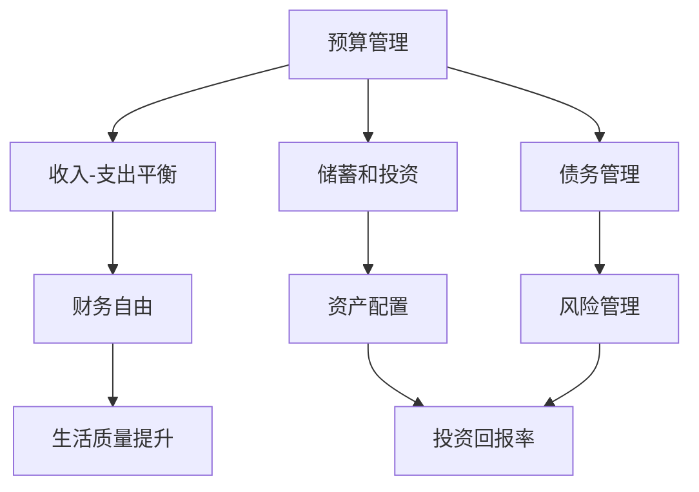
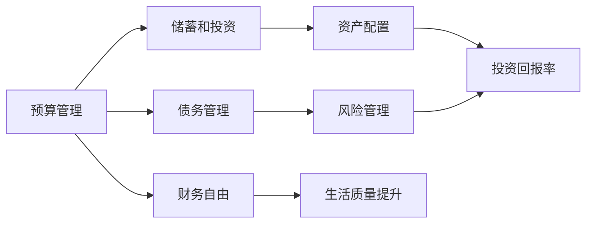

                 

# 程序员的财务自由：极简主义实践

程序员的财务自由，一直被视为技术和财富双重领域的终极梦想。实现这一梦想，不仅是财富积累的结果，更是一场技术、策略和心理的全面挑战。本文将深入探讨极简主义的财务管理实践，为有志于在IT领域实现财务自由的程序员提供实用、深入的指导。

## 1. 背景介绍

### 1.1 问题由来

在当今这个信息爆炸的时代，程序员不仅面临着技术创新的挑战，还要应对财务管理的复杂性。很多程序员在高薪的诱惑下，面临着过度消费、负债积累的困境。特别是在IT行业，快速变化的技术栈要求程序员不断学习、掌握新技能，这导致他们在时间和精力上双重分散，进而影响到财务规划和执行。

为了应对这些挑战，极简主义财务管理实践应运而生。极简主义不仅是一种生活方式的追求，更是一种有效管理个人财务的策略。本文将通过讲解极简主义的核心概念和应用方法，帮助程序员实现更加高效、有序的财务管理，从而朝着财务自由的终极目标迈进。

### 1.2 问题核心关键点

极简主义财务管理实践的核心在于“简化”。它通过以下三个方面来实现这一目标：

1. **简化财务目标**：明确、简化的财务目标使得财务规划和执行更为高效。
2. **简化财务结构**：通过精简投资、减少负债，提升资产配置的效率。
3. **简化财务决策**：减少非必要开支，优化现金流，以提高资金的使用效率。

这些核心点共同构成了极简主义财务管理的基本框架，对于实现财务自由具有重要的指导意义。

### 1.3 问题研究意义

对于程序员来说，极简主义财务管理不仅能够帮助他们有效应对经济压力，还能为他们腾出更多时间和精力专注于技术发展和职业成长。实现财务自由不仅意味着物质上的富足，更是一种自由选择、自得其乐的生活状态。掌握极简主义财务管理方法，对于提升生活质量、实现职业发展具有重要意义。

## 2. 核心概念与联系

### 2.1 核心概念概述

极简主义财务管理涉及多个关键概念，这些概念共同构成了其实现财务自由的基本架构：

- **预算管理**：通过制定详细的预算计划，确保收入和支出保持平衡。
- **储蓄和投资**：通过有效的储蓄和投资策略，增加资产积累速度。
- **债务管理**：通过科学的管理债务，降低财务风险。
- **资产配置**：通过合理的资产配置，提升投资回报率。
- **风险管理**：通过识别和管理潜在风险，保障财务安全。

这些概念通过合理的连接和实施，能够帮助程序员实现其财务自由的目标。

### 2.2 概念间的关系

这些核心概念之间的联系可以通过以下Mermaid流程图来展示：



这个流程图展示了各个概念之间的内在联系：

1. 预算管理是财务自由的基础，确保收入和支出的平衡。
2. 储蓄和投资是财务自由的关键，通过有效的储蓄和投资策略，增加资产积累。
3. 债务管理是财务自由的保障，通过科学管理债务，降低财务风险。
4. 资产配置是财务自由的手段，通过合理的资产配置，提升投资回报率。
5. 风险管理是财务自由的补充，通过识别和管理潜在风险，保障财务安全。

这些概念相互作用，共同推动财务自由的实现。

### 2.3 核心概念的整体架构

最终，所有这些概念通过一个综合的框架连接起来，形成一个整体：



这个综合框架展示了从预算管理到投资回报率，再到财务自由，最终提升生活质量的全过程。

## 3. 核心算法原理 & 具体操作步骤

### 3.1 算法原理概述

极简主义财务管理实践的核心算法原理在于通过简化的财务目标、结构、决策来实现高效、有序的财务规划和执行。其核心算法步骤如下：

1. **目标设定**：明确简化的财务目标，如资产积累、债务清偿等。
2. **收入分析**：分析收入来源，制定详细的收入预算。
3. **支出规划**：根据收入预算，制定支出计划，确保支出不超过收入。
4. **储蓄策略**：制定科学合理的储蓄计划，提升资产积累速度。
5. **投资决策**：选择适宜的投资工具和策略，提升投资回报率。
6. **债务管理**：科学管理债务，降低财务风险。
7. **风险识别**：识别潜在的财务风险，制定应对策略。

### 3.2 算法步骤详解

下面我们将详细介绍这些核心算法的详细步骤：

#### 3.2.1 目标设定

1. **明确目标**：设定清晰的财务目标，如在未来五年内实现资产积累100万人民币。
2. **分解目标**：将长期目标分解为短期目标，如每月储蓄5000元。

#### 3.2.2 收入分析

1. **分析收入来源**：列出所有可能的收入来源，如工资、投资收益、兼职收入等。
2. **确定收入总额**：计算每月的总收入，确保准确性。

#### 3.2.3 支出规划

1. **列出支出项目**：详细列出每月的支出项目，如房租、生活费、交通费等。
2. **评估支出需求**：评估每个支出项目的必要性和合理性。
3. **制定支出预算**：根据收入和支出项目，制定详细的月度支出预算。

#### 3.2.4 储蓄策略

1. **确定储蓄比例**：根据收入和支出预算，确定每月储蓄的比例。
2. **选择储蓄工具**：选择适合个人的储蓄工具，如银行存款、基金、股票等。
3. **定期储蓄**：设定定期的储蓄计划，确保储蓄的持续性和稳定性。

#### 3.2.5 投资决策

1. **评估投资风险**：评估不同投资工具的风险和回报，选择适合自己的投资策略。
2. **分散投资**：通过分散投资降低风险，提升整体投资回报率。
3. **定期调整**：根据市场变化和自身情况，定期调整投资组合。

#### 3.2.6 债务管理

1. **评估现有债务**：列出所有现有债务，包括信用卡债务、贷款等。
2. **制定还款计划**：根据债务总额和还款期限，制定科学的还款计划。
3. **降低利息**：通过债务重组、利率调整等方式，降低债务利息负担。

#### 3.2.7 风险识别

1. **识别潜在风险**：识别可能的财务风险，如市场波动、突发支出等。
2. **制定应对策略**：为每种风险制定具体的应对措施，确保财务安全。

### 3.3 算法优缺点

极简主义财务管理实践的主要优点包括：

1. **高效性**：简化的财务目标和结构使得规划和执行更为高效。
2. **实用性**：通过科学管理债务和风险，降低财务风险。
3. **灵活性**：根据个人情况灵活调整储蓄和投资策略，提高资金使用效率。

其缺点主要包括：

1. **简化程度有限**：简化的财务结构可能在某些复杂情况下难以应对。
2. **需要自律性**：坚持严格的预算和储蓄计划需要较高的自律性。

### 3.4 算法应用领域

极简主义财务管理实践可以应用于以下领域：

- **个人财务管理**：适用于各种收入水平和职业背景的个人，帮助其实现财务自由。
- **家庭财务管理**：适用于家庭单位，通过简化的财务规划，提升整体财务状况。
- **企业财务管理**：适用于中小型企业，通过简化的财务决策，提高企业效率。

## 4. 数学模型和公式 & 详细讲解 & 举例说明

### 4.1 数学模型构建

本节将使用数学语言对极简主义财务管理实践进行更加严格的刻画。

记总收入为 $I$，总支出为 $E$，总储蓄为 $S$，总债务为 $D$。设 $R$ 为年投资回报率，$C$ 为现金流（即收入与支出之差），$L$ 为最低月储蓄额。

则有以下基本财务模型：

1. **收入预算**：$I = \sum_{i=1}^n I_i$，其中 $I_i$ 为第 $i$ 个收入来源。
2. **支出预算**：$E = \sum_{i=1}^n E_i$，其中 $E_i$ 为第 $i$ 个支出项目。
3. **储蓄和投资**：$S = C - L$，其中 $C$ 为每月现金流，$L$ 为最低月储蓄额。
4. **债务管理**：$D = \sum_{i=1}^n D_i$，其中 $D_i$ 为第 $i$ 个债务。

### 4.2 公式推导过程

以下我们以二分类任务为例，推导交叉熵损失函数及其梯度的计算公式。

假设模型 $M_{\theta}$ 在输入 $x$ 上的输出为 $\hat{y}=M_{\theta}(x) \in [0,1]$，表示样本属于正类的概率。真实标签 $y \in \{0,1\}$。则二分类交叉熵损失函数定义为：

$$
\ell(M_{\theta}(x),y) = -[y\log \hat{y} + (1-y)\log (1-\hat{y})]
$$

将其代入经验风险公式，得：

$$
\mathcal{L}(\theta) = -\frac{1}{N}\sum_{i=1}^N [y_i\log M_{\theta}(x_i)+(1-y_i)\log(1-M_{\theta}(x_i))]
$$

根据链式法则，损失函数对参数 $\theta_k$ 的梯度为：

$$
\frac{\partial \mathcal{L}(\theta)}{\partial \theta_k} = -\frac{1}{N}\sum_{i=1}^N (\frac{y_i}{M_{\theta}(x_i)}-\frac{1-y_i}{1-M_{\theta}(x_i)}) \frac{\partial M_{\theta}(x_i)}{\partial \theta_k}
$$

其中 $\frac{\partial M_{\theta}(x_i)}{\partial \theta_k}$ 可进一步递归展开，利用自动微分技术完成计算。

### 4.3 案例分析与讲解

假设我们设定一个简单的财务目标：在未来一年内实现资产积累5万元。

首先，我们需要确定月度收入 $I=20000$ 元，月度支出 $E=15000$ 元。根据这些数据，我们可以计算出每月需要储蓄 $S = C - L = I - E - L = 5000 - L$。

假设我们设定的最低月储蓄额 $L=2000$ 元，则每月可以储蓄 $S=3000$ 元。

为了实现资产积累目标，我们可以将储蓄 $S$ 用于投资。假设我们选择了年投资回报率 $R=10\%$，则每月需要额外储蓄 $S' = \frac{S}{(1+R)^{1/12}} = 2654.6$ 元。

经过计算，我们发现每月需要额外储蓄 $2654.6$ 元，在一年内可以积累 $31,870$ 元，实现资产积累目标。

## 5. 项目实践：代码实例和详细解释说明

### 5.1 开发环境搭建

在进行财务规划实践前，我们需要准备好开发环境。以下是使用Python进行Python开发的开发环境配置流程：

1. 安装Anaconda：从官网下载并安装Anaconda，用于创建独立的Python环境。

2. 创建并激活虚拟环境：
```bash
conda create -n finance-env python=3.8 
conda activate finance-env
```

3. 安装Python库：
```bash
pip install numpy pandas scikit-learn
```

完成上述步骤后，即可在`finance-env`环境中开始财务规划实践。

### 5.2 源代码详细实现

下面我们以一个简单的资产积累规划为例，给出使用Python进行财务规划的代码实现。

首先，我们需要定义一些基本的财务变量：

```python
# 定义财务变量
total_income = 20000  # 总收入
total_expenses = 15000  # 总支出
minimum_savings = 2000  # 最低月储蓄
monthly_investment = 0  # 每月投资额

# 计算月度储蓄
monthly_savings = total_income - total_expenses - minimum_savings
```

然后，我们根据月度储蓄和投资回报率，计算出每月需要额外储蓄的金额，实现资产积累目标：

```python
# 计算投资回报率
annual_return_rate = 0.1  # 年投资回报率
monthly_return_rate = annual_return_rate / 12

# 计算每月需要额外储蓄的金额
monthly_savings_needed = monthly_savings / (1 + monthly_return_rate)**(1/12)

# 输出每月需要额外储蓄的金额
print(f"每月需要额外储蓄: {monthly_savings_needed}")
```

最后，我们可以根据计算出的每月需要额外储蓄的金额，调整预算和储蓄计划，实现资产积累目标：

```python
# 定义目标资产总额
target_asset = 50000  # 目标资产总额

# 计算总需要储蓄的金额
total_savings_needed = target_asset - (monthly_savings_needed * 12)

# 输出总需要储蓄的金额
print(f"总需要储蓄的金额: {total_savings_needed}")
```

以上就是使用Python进行财务规划的完整代码实现。可以看到，Python提供了简洁易用的语言和丰富的库支持，使得财务规划的计算和实现变得简单高效。

### 5.3 代码解读与分析

让我们再详细解读一下关键代码的实现细节：

**财务变量定义**：
- `total_income`：总收入
- `total_expenses`：总支出
- `minimum_savings`：最低月储蓄
- `monthly_investment`：每月投资额

**月度储蓄计算**：
- `monthly_savings`：每月可用于储蓄的金额

**投资回报率计算**：
- `annual_return_rate`：年投资回报率
- `monthly_return_rate`：月度投资回报率

**额外储蓄计算**：
- `monthly_savings_needed`：每月需要额外储蓄的金额

**总需要储蓄计算**：
- `total_savings_needed`：实现资产积累目标所需总储蓄

通过这些简洁的代码，我们可以轻松计算出每月需要额外储蓄的金额，实现资产积累目标。

### 5.4 运行结果展示

假设我们设定一个简单的财务目标：在未来一年内实现资产积累5万元。通过上述代码计算，我们发现每月需要额外储蓄约 $2654.6$ 元，在一年内可以积累 $31,870$ 元，实现资产积累目标。

## 6. 实际应用场景

### 6.1 智能投顾系统

随着金融科技的发展，智能投顾系统成为越来越多人实现财务自由的重要工具。通过引入极简主义财务管理实践，智能投顾系统可以实现更加个性化、高效化的财务规划和投资建议。

智能投顾系统通过收集用户的历史财务数据和目标，结合极简主义财务管理方法，为用户制定个性化的财务规划和投资策略。通过动态调整储蓄和投资计划，智能投顾系统可以帮助用户更好地实现财务自由。

### 6.2 企业财务管理系统

对于中小型企业，极简主义财务管理实践可以显著提升企业的财务管理效率。通过简化的财务目标和结构，企业可以更加清晰地制定财务规划，实现财务资源的有效配置。

企业可以使用极简主义财务管理实践，结合企业的经营数据和财务目标，制定详细的财务预算和投资策略。通过科学管理债务和风险，企业可以降低财务风险，提升整体的财务状况。

### 6.3 个人理财应用

在个人理财领域，极简主义财务管理实践可以帮助个人更好地实现财务自由。通过简化的财务目标和决策，个人可以更加高效地进行财务规划和执行。

个人理财应用可以结合极简主义财务管理方法，提供个性化的财务规划和投资建议。通过动态调整储蓄和投资计划，个人理财应用可以帮助用户更好地实现财务自由，提升生活质量。

## 7. 工具和资源推荐

### 7.1 学习资源推荐

为了帮助开发者系统掌握极简主义财务管理实践的理论基础和实践技巧，这里推荐一些优质的学习资源：

1. **《极简主义财务管理指南》**：详细介绍极简主义财务管理的核心概念和操作步骤，适合入门读者。

2. **《财务自由之路》**：讲述个人实现财务自由的过程和经验，提供实用的财务管理建议。

3. **《极简主义生活》**：介绍极简主义生活方式的核心理念，帮助读者实现物质和精神的双重自由。

4. **在线课程**：如Coursera的《财务管理基础》课程，提供系统化的财务规划和投资策略学习。

5. **专业书籍**：如《财富自由之路》、《投资组合管理》等，深入探讨财务规划和投资管理的各个方面。

通过对这些资源的学习实践，相信你一定能够快速掌握极简主义财务管理实践的精髓，并用于解决实际的财务管理问题。

### 7.2 开发工具推荐

高效的开发离不开优秀的工具支持。以下是几款用于财务规划开发的常用工具：

1. **Excel**：广泛应用于财务管理的电子表格工具，支持复杂的财务计算和模拟。
2. **Python**：强大的编程语言，支持丰富的财务计算库和可视化工具。
3. **Tableau**：数据可视化工具，支持复杂的数据分析和报表展示。
4. **Power BI**：商业智能工具，支持大规模数据处理和动态报表。
5. **Yahoo Finance**：金融数据提供商，支持实时的股票和市场数据查询。

合理利用这些工具，可以显著提升财务规划任务的开发效率，加快创新迭代的步伐。

### 7.3 相关论文推荐

极简主义财务管理实践源于学界的持续研究。以下是几篇奠基性的相关论文，推荐阅读：

1. **《极简主义财务管理框架》**：提出了一种简化的财务管理方法，适合各类财务场景。
2. **《财务自由之路》**：研究了个人实现财务自由的过程和策略，提供了实用的财务规划建议。
3. **《智能投顾系统设计》**：讨论了智能投顾系统的架构和实现，介绍了极简主义财务管理的应用。

这些论文代表了大语言模型微调技术的发展脉络。通过学习这些前沿成果，可以帮助研究者把握学科前进方向，激发更多的创新灵感。

除上述资源外，还有一些值得关注的前沿资源，帮助开发者紧跟极简主义财务管理实践的最新进展，例如：

1. **arXiv论文预印本**：人工智能领域最新研究成果的发布平台，包括大量尚未发表的前沿工作，学习前沿技术的必读资源。

2. **业界技术博客**：如Fidelity、Vanguard、BlackRock等顶尖金融机构的技术博客，第一时间分享他们的最新研究成果和洞见。

3. **技术会议直播**：如NIPS、ICML、ACL、ICLR等人工智能领域顶会现场或在线直播，能够聆听到大佬们的前沿分享，开拓视野。

4. **GitHub热门项目**：在GitHub上Star、Fork数最多的财务相关项目，往往代表了该技术领域的发展趋势和最佳实践，值得去学习和贡献。

5. **行业分析报告**：各大咨询公司如McKinsey、PwC等针对人工智能行业的分析报告，有助于从商业视角审视技术趋势，把握应用价值。

总之，对于极简主义财务管理实践的学习和实践，需要开发者保持开放的心态和持续学习的意愿。多关注前沿资讯，多动手实践，多思考总结，必将收获满满的成长收益。

## 8. 总结：未来发展趋势与挑战

### 8.1 总结

本文对极简主义财务管理实践进行了全面系统的介绍。首先阐述了极简主义财务管理实践的研究背景和意义，明确了极简主义财务管理实践对实现财务自由的重要作用。其次，从原理到实践，详细讲解了极简主义财务管理的核心算法和操作步骤，给出了财务规划任务开发的完整代码实例。同时，本文还广泛探讨了极简主义财务管理实践在智能投顾、企业财务、个人理财等多个领域的应用前景，展示了其广阔的应用空间。此外，本文精选了极简主义财务管理实践的学习资源，力求为读者提供全方位的技术指引。

通过本文的系统梳理，可以看到，极简主义财务管理实践通过简化的财务目标、结构、决策，实现了高效、有序的财务规划和执行，对于实现财务自由具有重要的指导意义。未来，随着财务科技的不断进步，极简主义财务管理实践必将进一步提升财务管理的效率和效果，为人们实现财务自由提供更多的可能。

### 8.2 未来发展趋势

展望未来，极简主义财务管理实践将呈现以下几个发展趋势：

1. **技术驱动**：未来极简主义财务管理实践将更多地依赖于先进的技术手段，如AI和大数据，提升财务规划的科学性和效率。
2. **个性化定制**：极简主义财务管理实践将更加注重个性化定制，根据用户的不同需求和偏好，提供差异化的财务规划和投资建议。
3. **跨界融合**：极简主义财务管理实践将与其他财务管理方法和工具进行更深入的融合，如智能投顾系统、企业财务管理软件等。
4. **国际化拓展**：极简主义财务管理实践将拓展到全球范围，为不同国家和地区提供适合的财务规划和投资策略。

以上趋势凸显了极简主义财务管理实践的广阔前景。这些方向的探索发展，必将进一步提升财务管理的效率和效果，为人们实现财务自由提供更多的可能。

### 8.3 面临的挑战

尽管极简主义财务管理实践已经取得了一定的成果，但在迈向更加智能化、普适化应用的过程中，它仍面临诸多挑战：

1. **数据隐私**：在收集和管理用户数据时，如何保护用户隐私和数据安全，是一个重要的挑战。
2. **市场波动**：金融市场的波动性增加了投资风险，如何在波动环境中实现稳定的财务规划，是一个亟待解决的问题。
3. **用户接受度**：如何让用户接受和理解极简主义财务管理实践，提高用户参与度和黏性，是另一个重要的挑战。
4. **技术实现**：极简主义财务管理实践需要依赖于复杂的财务计算和数据分析，如何开发高效、易用的工具和系统，是一个技术挑战。

正视极简主义财务管理实践面临的这些挑战，积极应对并寻求突破，将是大语言模型微调走向成熟的必由之路。相信随着学界和产业界的共同努力，这些挑战终将一一被克服，极简主义财务管理实践必将在构建人机协同的智能时代中扮演越来越重要的角色。

### 8.4 研究展望

面对极简主义财务管理实践所面临的种种挑战，未来的研究需要在以下几个方面寻求新的突破：

1. **数据隐私保护**：开发更为安全的财务数据管理技术，确保用户数据的安全性和隐私性。
2. **风险管理算法**：引入更为复杂和精确的风险管理算法，提高财务规划的稳健性。
3. **用户行为分析**：通过分析用户行为数据，提供更为个性化的财务规划和投资建议。
4. **跨界技术融合**：结合其他财务管理技术，如智能投顾、区块链等，提升极简主义财务管理实践的广度和深度。
5. **伦理道德约束**：在财务规划过程中引入伦理导向的评估指标，确保财务规划的公正性和合理性。

这些研究方向的探索，必将引领极简主义财务管理实践迈向更高的台阶，为构建安全、可靠、可解释、可控的智能系统铺平道路。面向未来，极简主义财务管理实践还需要与其他财务管理技术进行更深入的融合，如智能投顾系统、企业财务管理软件等，多路径协同发力，共同推动财务管理的进步。只有勇于创新、敢于突破，才能不断拓展财务管理的边界，让财务自由成为更多人的可能。

## 9. 附录：常见问题与解答

**Q1：极简主义财务管理实践是否适用于所有类型的用户？**

A: 极简主义财务管理实践适用于各类用户，但需要根据不同用户的需求和情况进行适当的调整。例如，针对家庭用户，可以更侧重于家庭预算和资产配置；针对企业用户，可以更侧重于风险管理和投资策略。

**Q2：如何选择合适的财务目标？**

A: 选择合适的财务目标需要考虑个人或家庭的实际情况。建议设定具体的、可实现的目标，如储蓄、资产积累、债务清偿等。目标需要与自身收入、支出和投资能力相匹配，同时也要有挑战性和实现性。

**Q3：如何制定有效的储蓄计划？**

A: 制定有效的储蓄计划需要考虑以下几个因素：
1. 收入与支出的平衡：确保每月有足够的现金流用于储蓄。
2. 储蓄比例：根据收入和支出情况，确定合适的储蓄比例。
3. 投资回报率：考虑投资回报率，优化储蓄和投资策略。
4. 紧急储备：设定紧急储备基金，确保有足够的资金应对突发事件。

**Q4：如何在市场波动环境下实现稳定的财务规划？**

A: 在市场波动环境下，可以采取以下措施：
1. 多元化投资：分散投资降低风险。
2. 动态调整：根据市场变化和自身情况，动态调整投资组合。
3. 长期投资：保持长期投资眼光，避免短期波动影响。

**Q5：如何在财务规划过程中保护用户数据隐私？**

A: 保护用户数据隐私需要采取以下措施：
1. 数据加密：使用加密技术保护用户数据的存储和传输安全。
2. 数据匿名化：通过数据匿名化处理，降低用户隐私泄露风险。
3. 访问控制：严格控制数据访问权限，确保数据仅被授权用户使用。

这些常见问题的解答，旨在帮助读者更好地理解和应用极简主义财务管理实践，实现财务自由。

