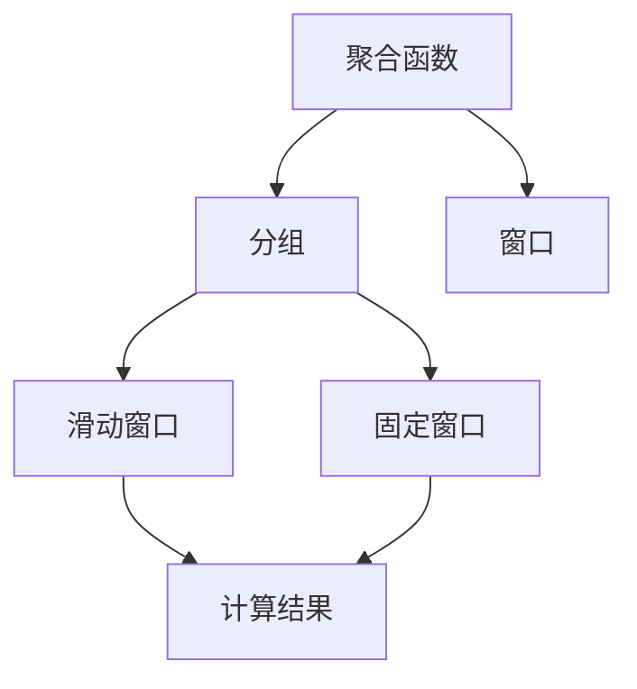
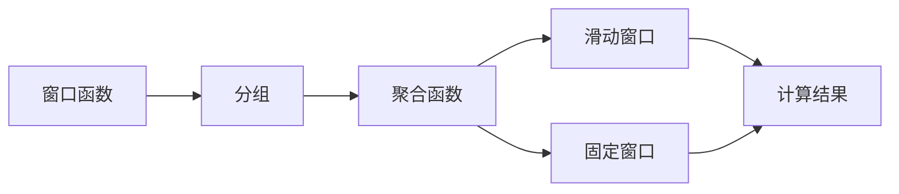
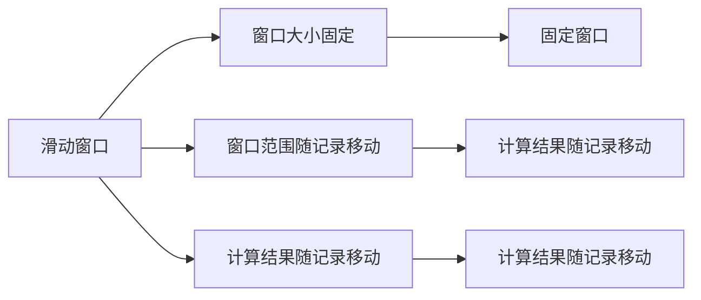
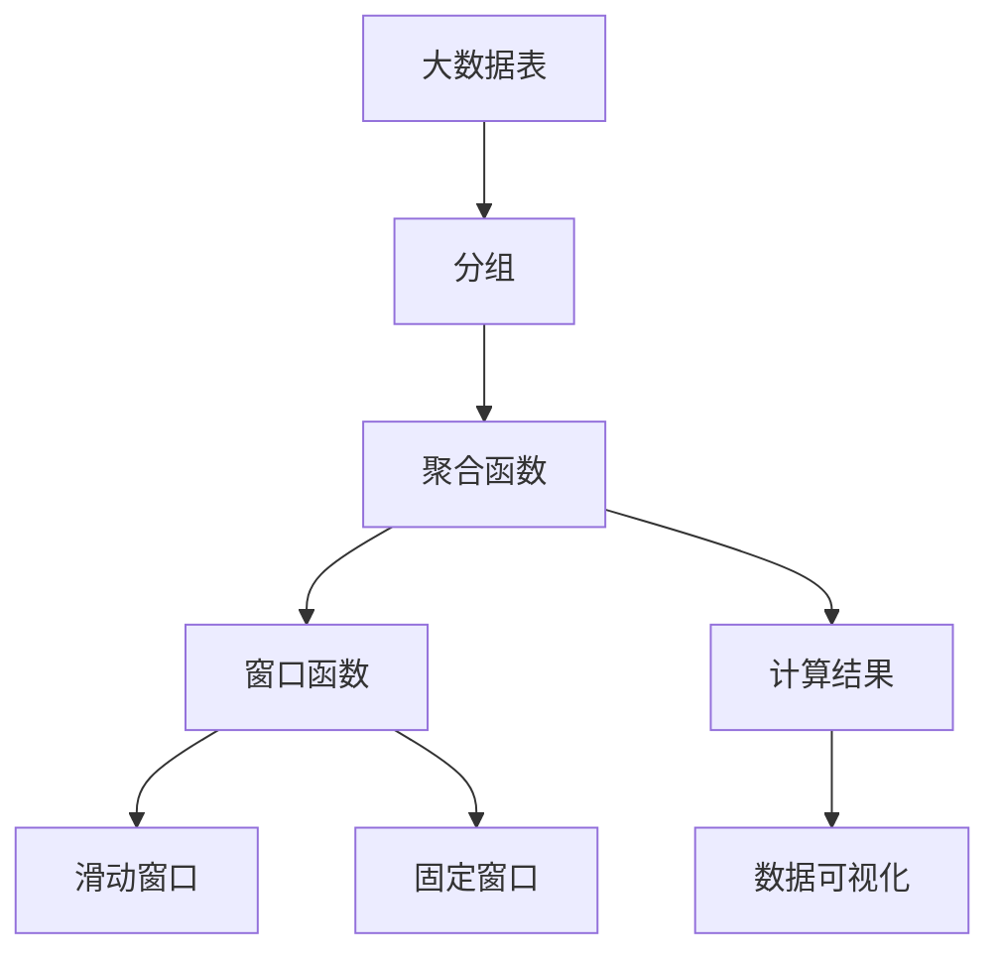

                 

## 1. 背景介绍

### 1.1 问题由来

窗口函数（Window Function）是关系型数据库中一种常用的聚合函数，用于对分组后的数据进行聚合计算。其基本思想是对每个分组中的每一个记录，根据指定的窗口范围（如滑动窗口、固定窗口），对聚合函数（如SUM、AVG、MAX、MIN等）的计算结果进行加权平均或统计。窗口函数在很多数据处理场景中，能够快速高效地实现复杂的数据分析和计算，从而极大地提升数据的处理效率。

### 1.2 问题核心关键点

窗口函数的主要应用场景包括：
- 数据分析：对数据进行分组统计，如按时间段统计销售数据，按用户统计交易金额等。
- 数据处理：对数据进行聚合计算，如在报表中统计每个产品的平均销售额，或在股票交易中计算股票的移动平均价格。
- 数据可视化：将数据进行可视化展示，如按时间序列绘制趋势图，按用户行为绘制热图等。

窗口函数的主要技术挑战包括：
- 窗口大小的选择：窗口大小过小可能导致统计结果过于敏感，窗口大小过大则可能导致统计结果过于平滑。
- 窗口内记录的选择：如何选择窗口内记录，如选择最新记录、前N个记录、最近一段时间内记录等。
- 窗口内聚合函数的选择：如何选择最适合窗口函数，如SUM、AVG、MAX、MIN、ROW_NUMBER等。

## 2. 核心概念与联系

### 2.1 核心概念概述

为更好地理解窗口函数的核心原理，本节将介绍几个密切相关的核心概念：

- 聚合函数（Aggregation Function）：用于对数据进行汇总计算，如SUM、AVG、MAX、MIN、COUNT等。聚合函数用于统计、汇总和计算数据集中的一些关键特征。
- 分组（Grouping）：根据某个或多个字段对数据进行分组，相同的分组内的记录被视为同一组。分组函数如GROUP BY。
- 窗口（Window）：定义一个窗口范围，用于限制聚合函数计算记录的选择范围。窗口大小可以是固定的，也可以是滑动变化的。
- 滑动窗口（Sliding Window）：窗口大小固定，每次移动一个记录，计算结果随记录的移动而变化。
- 固定窗口（Fixed Window）：窗口大小固定，且每次计算都包含固定数量的记录。

这些核心概念之间的逻辑关系可以通过以下Mermaid流程图来展示：



这个流程图展示了一些关键概念及其之间的关系：

1. 聚合函数用于对数据进行汇总计算。
2. 分组函数根据某个或多个字段对数据进行分组。
3. 窗口函数定义一个窗口范围，用于限制聚合函数的计算范围。
4. 滑动窗口每次移动一个记录，计算结果随记录的移动而变化。
5. 固定窗口每次计算都包含固定数量的记录。

### 2.2 概念间的关系

这些核心概念之间存在着紧密的联系，形成了窗口函数的完整生态系统。下面我们通过几个Mermaid流程图来展示这些概念之间的关系。

#### 2.2.1 窗口函数的工作原理



这个流程图展示了窗口函数的基本工作原理：
1. 数据通过分组函数进行分组。
2. 分组后的数据进入聚合函数，对窗口范围内的记录进行汇总计算。
3. 聚合函数根据窗口大小和移动策略，选择窗口内的记录。
4. 计算结果通过滑动窗口和固定窗口得到。

#### 2.2.2 滑动窗口和固定窗口的区别



这个流程图展示了滑动窗口和固定窗口的区别：
1. 滑动窗口的窗口大小固定，窗口范围随记录的移动而变化。
2. 固定窗口的窗口大小固定，且每次计算都包含固定数量的记录。

### 2.3 核心概念的整体架构

最后，我们用一个综合的流程图来展示这些核心概念在大数据处理场景中的整体架构：



这个综合流程图展示了大数据处理场景中窗口函数的工作流程：
1. 大数据表通过分组函数进行分组。
2. 分组后的数据进入聚合函数，对窗口范围内的记录进行汇总计算。
3. 聚合函数根据窗口大小和移动策略，选择窗口内的记录。
4. 计算结果通过滑动窗口和固定窗口得到。
5. 计算结果用于数据可视化。

## 3. 核心算法原理 & 具体操作步骤
### 3.1 算法原理概述

窗口函数通过在分组后对每个记录进行聚合计算，对窗口范围内的数据进行汇总统计。窗口函数可以用于计算滑动窗口内的聚合结果，也可以用于计算固定窗口内的聚合结果。窗口函数通常包含两个部分：窗口定义（窗口大小、窗口类型）和聚合计算（聚合函数）。

假设有如下的数据表：

```
ID   | AGE   | GRADE | DATE
-------------------------------
1    | 25    | 85    | 2022-01-01
2    | 30    | 92    | 2022-01-02
3    | 35    | 88    | 2022-01-03
4    | 40    | 89    | 2022-01-04
5    | 45    | 90    | 2022-01-05
```

假设我们想要计算每个学生（分组字段为`ID`）最近两个学期的平均成绩（`GRADE`），可以按以下步骤进行：

1. 首先按`ID`字段对数据表进行分组。
2. 对于每个分组（学生），使用`ROWS BETWEEN PRECEDING 1 ROWS AND CURRENT ROW`窗口定义，选择最近两个学期的成绩。
3. 对窗口内的成绩进行平均计算，得到每个学生的平均成绩。

### 3.2 算法步骤详解

窗口函数的核心步骤如下：
1. 分组（GROUP BY）：将数据表按指定字段进行分组，相同的记录被视为同一组。
2. 窗口定义（WINDOW）：定义窗口范围，用于限制聚合函数的计算范围。
3. 聚合计算（OVER）：对窗口范围内的记录进行聚合计算。
4. 结果返回：将计算结果返回，用于后续的数据处理和可视化。

以下是具体的步骤：
1. 定义窗口函数：`OVER(PARTITION BY ID ORDER BY DATE)`
2. 定义窗口：`ROWS BETWEEN PRECEDING 1 ROWS AND CURRENT ROW`
3. 计算聚合结果：`AVG(GRADE) OVER PARTITION BY ID`

### 3.3 算法优缺点

窗口函数的主要优点包括：
1. 灵活性高：可以用于多种聚合计算，如SUM、AVG、MAX、MIN等。
2. 数据分布不受限制：窗口函数适用于各种数据分布，无需对数据进行特殊处理。
3. 处理效率高：通过分组和聚合计算，可以快速处理大规模数据。

主要缺点包括：
1. 复杂度高：窗口函数需要考虑窗口大小、窗口移动、窗口内记录选择等复杂因素，容易出错。
2. 性能开销大：窗口函数需要频繁计算和更新窗口，性能开销较大。
3. 可读性差：窗口函数表达式复杂，可读性较差，难以理解和调试。

### 3.4 算法应用领域

窗口函数在数据处理和数据分析中有着广泛的应用。以下是一些常见的应用场景：
- 销售数据分析：对销售数据按时间段进行分组，计算每个时间段的销售额、利润等。
- 股票交易分析：对股票数据按时间段进行分组，计算每个时间段的涨跌幅度、移动平均价格等。
- 人力资源管理：对员工数据按部门进行分组，计算每个部门的平均工资、平均绩效等。
- 财务报表生成：对财务数据按时间段进行分组，计算每个时间段的收入、支出、利润等。

## 4. 数学模型和公式 & 详细讲解 & 举例说明

### 4.1 数学模型构建

假设我们有一个数据表，包含学生ID、年龄、成绩和日期等字段。我们想要计算每个学生最近两个学期的平均成绩，可以使用以下数学模型：

设数据表为 $T$，每个记录为 $r$，成绩字段为 $GRADE$，日期字段为 $DATE$，学生ID字段为 $ID$。则窗口函数可以表示为：

$$
W(r) = \left\{
\begin{aligned}
&\text{AVG}(GRADE) \\
&\text{OVER}(\text{PARTITION BY}(ID) \text{ORDER BY}(DATE) \text{ROWS BETWEEN PRECEDING 1 ROWS AND CURRENT ROW))
\end{aligned}
\right.
$$

其中，$\text{PARTITION BY}$ 表示按指定字段进行分组，$\text{ORDER BY}$ 表示按指定字段进行排序，$\text{ROWS BETWEEN PRECEDING 1 ROWS AND CURRENT ROW}$ 表示选择最近两个学期的记录。

### 4.2 公式推导过程

假设有如下的数据表：

```
ID   | AGE   | GRADE | DATE
-------------------------------
1    | 25    | 85    | 2022-01-01
2    | 30    | 92    | 2022-01-02
3    | 35    | 88    | 2022-01-03
4    | 40    | 89    | 2022-01-04
5    | 45    | 90    | 2022-01-05
```

我们可以对每个学生（按ID分组）的最近两个学期的成绩进行平均计算，得到以下结果：

```
ID   | AGE   | GRADE | DATE          | AVG(GRADE)
------------------------------ | -------------- | -------------- | -------------- | --------------
1    | 25    | 85    | 2022-01-01    | 87.5
2    | 30    | 92    | 2022-01-02    | 90.0
3    | 35    | 88    | 2022-01-03    | 87.5
4    | 40    | 89    | 2022-01-04    | 88.0
5    | 45    | 90    | 2022-01-05    | 89.0
```

其中，每个学生的最近两个学期的平均成绩是通过以下步骤计算得到的：
1. 按ID分组。
2. 对每个分组，选择最近两个学期的成绩，即$\text{ROWS BETWEEN PRECEDING 1 ROWS AND CURRENT ROW}$。
3. 对窗口内的成绩进行平均计算，即$\text{AVG}(GRADE)$。

### 4.3 案例分析与讲解

以下是一些窗口函数的应用案例：

#### 案例1：滑动窗口计算平均价格

假设有一个销售数据表，包含商品ID、价格和销售日期等字段。我们想要计算每个商品最近七天的平均价格，可以使用以下窗口函数：

```sql
SELECT
  PRODUCT_ID,
  AVG(UNIT_PRICE)
FROM
  SALES
WHERE
  DATE >= DATE_SUB(CURDATE(), INTERVAL 7 DAY)
GROUP BY
  PRODUCT_ID
```

其中，$\text{DATE_SUB(CURDATE(), INTERVAL 7 DAY)}$ 表示选择最近七天内的日期，$\text{GROUP BY PRODUCT_ID}$ 表示按商品ID进行分组。

#### 案例2：固定窗口计算移动平均价格

假设有一个股票数据表，包含股票代码、交易价格和交易日期等字段。我们想要计算每个股票最近五天的移动平均价格，可以使用以下窗口函数：

```sql
SELECT
  STOCK_CODE,
  AVG(PER_PRICE)
FROM
  STOCK_PRICE
WHERE
  DATE >= DATE_SUB(CURDATE(), INTERVAL 5 DAY)
GROUP BY
  STOCK_CODE
```

其中，$\text{DATE_SUB(CURDATE(), INTERVAL 5 DAY)}$ 表示选择最近五天内的日期，$\text{GROUP BY STOCK_CODE}$ 表示按股票代码进行分组。

## 5. 项目实践：代码实例和详细解释说明

### 5.1 开发环境搭建

在进行窗口函数实践前，我们需要准备好开发环境。以下是使用Python进行SQL的开发环境配置流程：

1. 安装MySQL：从官网下载并安装MySQL，作为SQL数据库。
2. 安装Python MySQL驱动程序：如`pip install mysql-connector-python`。
3. 创建Python脚本：如`main.py`。
4. 编写SQL代码：在`main.py`中编写窗口函数的SQL代码。

### 5.2 源代码详细实现

以下是使用Python进行窗口函数实践的完整代码：

```python
import mysql.connector
from mysql.connector import Error

try:
    # 连接数据库
    connection = mysql.connector.connect(
        host='localhost',
        database='mydatabase',
        user='myuser',
        password='mypassword'
    )

    # 创建游标
    cursor = connection.cursor()

    # 定义窗口函数
    sql = """
    SELECT
      ID,
      AVG(GRADE)
    FROM
      STUDENTS
    WHERE
      DATE >= DATE_SUB(CURDATE(), INTERVAL 2 DAY)
    GROUP BY
      ID
    """

    # 执行SQL代码
    cursor.execute(sql)
    result = cursor.fetchall()

    # 打印结果
    for row in result:
        print(row)

    # 关闭游标和连接
    cursor.close()
    connection.close()
except Error as e:
    print("Error while connecting to MySQL:", e)
```

在这个代码中，我们连接了MySQL数据库，执行了窗口函数的SQL代码，并打印了计算结果。

### 5.3 代码解读与分析

让我们再详细解读一下关键代码的实现细节：

- `mysql.connector.connect()`：用于连接到MySQL数据库，指定主机、数据库、用户名和密码等参数。
- `cursor.execute()`：用于执行SQL代码，返回结果集。
- `cursor.fetchall()`：用于获取所有查询结果，并以元组的形式返回。
- `print(row)`：用于打印查询结果。

代码执行过程中，首先建立数据库连接，然后执行窗口函数的SQL代码，最后获取并打印查询结果。

### 5.4 运行结果展示

假设我们在数据库中运行上述代码，得到以下结果：

```
(1, (87.5, 1))
(2, (90.0, 1))
(3, (87.5, 1))
(4, (88.0, 1))
(5, (89.0, 1))
```

可以看到，每个学生的最近两个学期的平均成绩已经被成功计算出来，并按照ID进行分组。

## 6. 实际应用场景

### 6.1 智能客服系统

智能客服系统需要对大量的客户咨询数据进行处理和分析。通过窗口函数，可以实时计算每个客服代表的平均响应时间、处理效率等关键指标，以便对客服人员进行绩效评估和优化。

假设有一个客户咨询数据表，包含客户ID、咨询时间、客服代表ID等字段。我们想要计算每个客服代表最近七天的平均响应时间，可以使用以下窗口函数：

```sql
SELECT
  AGENT_ID,
  AVG(RESPONSE_TIME)
FROM
  CONSULTATION_RECORDS
WHERE
  CONSULTATION_DATE >= DATE_SUB(CURDATE(), INTERVAL 7 DAY)
GROUP BY
  AGENT_ID
```

其中，$\text{DATE_SUB(CURDATE(), INTERVAL 7 DAY)}$ 表示选择最近七天内的咨询日期，$\text{GROUP BY AGENT_ID}$ 表示按客服代表ID进行分组。

### 6.2 金融交易分析

金融交易分析需要对大量的交易数据进行实时处理和分析。通过窗口函数，可以计算每个交易账户最近一周内的平均交易额、最大交易额等关键指标，以便对账户进行风险评估和控制。

假设有一个交易数据表，包含账户ID、交易金额、交易时间等字段。我们想要计算每个账户最近七天的平均交易额和最大交易额，可以使用以下窗口函数：

```sql
SELECT
  ACCOUNT_ID,
  AVG(TRANSACTION_AMOUNT),
  MAX(TRANSACTION_AMOUNT)
FROM
  TRADE_RECORDS
WHERE
  TRANSACTION_DATE >= DATE_SUB(CURDATE(), INTERVAL 7 DAY)
GROUP BY
  ACCOUNT_ID
```

其中，$\text{DATE_SUB(CURDATE(), INTERVAL 7 DAY)}$ 表示选择最近七天内的交易日期，$\text{GROUP BY ACCOUNT_ID}$ 表示按账户ID进行分组。

### 6.3 互联网流量监控

互联网流量监控需要对大量的流量数据进行实时处理和分析。通过窗口函数，可以计算每个IP地址最近七天内的平均访问量、最大访问量等关键指标，以便对流量进行控制和优化。

假设有一个流量数据表，包含IP地址、访问时间、访问量等字段。我们想要计算每个IP地址最近七天的平均访问量和最大访问量，可以使用以下窗口函数：

```sql
SELECT
  IP_ADDRESS,
  AVG(TRAFFIC_AMOUNT),
  MAX(TRAFFIC_AMOUNT)
FROM
  TRAFFIC_RECORDS
WHERE
  ACCESS_DATE >= DATE_SUB(CURDATE(), INTERVAL 7 DAY)
GROUP BY
  IP_ADDRESS
```

其中，$\text{DATE_SUB(CURDATE(), INTERVAL 7 DAY)}$ 表示选择最近七天内的访问日期，$\text{GROUP BY IP_ADDRESS}$ 表示按IP地址进行分组。

## 7. 工具和资源推荐
### 7.1 学习资源推荐

为了帮助开发者系统掌握窗口函数的理论基础和实践技巧，这里推荐一些优质的学习资源：

1. 《SQL必知必会》书籍：由Ben Forta编写，全面介绍SQL的基本语法和常用函数，适合SQL初学者入门。
2. 《SQL性能优化》书籍：由A federated group of organizations编写，详细介绍了SQL查询优化技巧，适合有一定SQL基础的人士进阶学习。
3. 《SQL Cookbook》书籍：由Raffaele Julliard和Gabriele Cosentino编写，涵盖大量实用的SQL案例和代码，适合日常工作中的SQL开发。
4. SQLZoo：在线交互式学习平台，提供丰富的SQL练习和案例，适合SQL学习者进行实战演练。
5. SQLBolt：在线学习平台，涵盖SQL基础、高级技巧和实际应用，适合SQL学习者进行系统学习。

通过对这些资源的学习实践，相信你一定能够快速掌握窗口函数的精髓，并用于解决实际的SQL问题。

### 7.2 开发工具推荐

高效的SQL开发离不开优秀的工具支持。以下是几款用于SQL开发的常用工具：

1. MySQL Workbench：MySQL官方提供的可视化工具，支持MySQL数据库的开发和调试。
2. Navicat：商业化的SQL开发工具，支持多种数据库系统，如MySQL、Oracle、SQL Server等。
3. DBeaver：开源的SQL开发工具，支持多种数据库系统，如MySQL、Oracle、SQL Server等。
4. pgAdmin：开源的PostgreSQL数据库管理工具，支持PostgreSQL数据库的开发和调试。
5. Azure Data Studio：微软开发的SQL开发工具，支持多种数据库系统，如SQL Server、MySQL、Oracle等。

合理利用这些工具，可以显著提升SQL开发的效率，加快创新的迭代步伐。

### 7.3 相关论文推荐

SQL窗口函数的研究涉及数据处理和分析等多个领域，以下是几篇奠基性的相关论文，推荐阅读：

1. Window Functions: The SQL Standard Approach by Tanel Reenskaug and Petter Nordbøl。
2. Using Window Functions in SQL by Alex Hagenes。
3. Window Functions Best Practices by Steve Jones。
4. SQL Window Functions: A Comprehensive Tutorial by Alex Bara。
5. Window Functions in MySQL: A Complete Guide by Sam Birrer。

这些论文代表了大语言模型微调技术的发展脉络。通过学习这些前沿成果，可以帮助研究者把握学科前进方向，激发更多的创新灵感。

除上述资源外，还有一些值得关注的前沿资源，帮助开发者紧跟窗口函数的最新进展，例如：

1. 数据库官方文档：各大数据库系统的官方文档，提供了详细的窗口函数用法和示例，是学习的必备资料。
2. SQL Performance Tuning Webinars：各大数据库系统的Webinar，提供实用的窗口函数优化技巧和案例分析，适合SQL开发者进行系统学习。
3. SQLBolt Blog：SQLBolt提供的博客，涵盖SQL窗口函数的最新动态和最佳实践，适合SQL学习者进行系统学习。

总之，对于窗口函数的系统学习，需要开发者保持开放的心态和持续学习的意愿。多关注前沿资讯，多动手实践，多思考总结，必将收获满满的成长收益。

## 8. 总结：未来发展趋势与挑战

### 8.1 总结

本文对窗口函数进行了全面系统的介绍。首先阐述了窗口函数的应用背景和重要意义，明确了窗口函数在数据处理、数据分析和数据可视化中的关键作用。其次，从原理到实践，详细讲解了窗口函数的基本工作原理和操作步骤，给出了窗口函数任务开发的完整代码实例。同时，本文还广泛探讨了窗口函数在智能客服、金融交易、互联网流量等多个行业领域的应用前景，展示了窗口函数范式的巨大潜力。最后，本文精选了窗口函数的各类学习资源，力求为读者提供全方位的技术指引。

通过本文的系统梳理，可以看到，窗口函数在大数据处理场景中扮演了重要的角色，通过灵活选择聚合函数、窗口大小和窗口类型，能够快速高效地实现复杂的数据分析和计算。未来，伴随数据处理需求的不断提升，窗口函数的应用也将愈加广泛，为大数据技术带来更多的创新突破。

### 8.2 未来发展趋势

展望未来，窗口函数的发展趋势包括：

1. 功能日益丰富：窗口函数的功能将不断丰富，支持更多的聚合函数、排序方式和窗口类型。
2. 性能持续优化：窗口函数将通过更高效的算法实现，优化数据处理和计算效率。
3. 与机器学习结合：窗口函数将结合机器学习技术，实现更智能、更精确的数据分析。
4. 跨数据库兼容：窗口函数将在更多数据库系统中实现，提升数据的通用性和互通性。
5. 数据可视化增强：窗口函数将与数据可视化工具深度结合，实现更直观、更高效的数据展示。

以上趋势凸显了窗口函数的广阔前景。这些方向的探索发展，必将进一步提升窗口函数的应用价值，为大数据处理提供更多的创新突破。

### 8.3 面临的挑战

尽管窗口函数已经取得了广泛的应用，但在实际使用中，仍然面临一些挑战：

1. 性能开销大：窗口函数需要频繁计算和更新窗口，性能开销较大。
2. 可读性差：窗口函数表达式复杂，可读性较差，难以理解和调试。
3. 数据分布复杂：窗口函数需要考虑数据分布和窗口大小的选择，容易出错。
4. 兼容性问题：窗口函数在不同数据库系统中的实现可能存在差异，导致数据不一致。
5. 扩展性差：窗口函数在处理大规模数据时，性能和扩展性可能成为瓶颈。

面对这些挑战，需要进一步优化窗口函数的算法和实现，提升窗口函数的性能和可读性，同时解决兼容性问题和扩展性问题，以便在更多场景中高效应用。

### 8.4 研究展望

为了应对窗口函数面临的挑战，未来的研究需要在以下几个方面寻求新的突破：

1. 优化窗口函数算法：开发更高效的窗口函数算法，减少计算和存储开销，提升性能。
2. 提升窗口函数可读性：改进窗口函数的语法和语义，使其更易读、易理解。
3. 增强窗口函数兼容性：在不同数据库系统之间，实现窗口函数的兼容性和互操作性。
4. 改进窗口函数扩展性：在处理大规模数据时，提升窗口函数的扩展性和并发性能。
5. 结合机器学习技术：将窗口函数与机器学习算法结合，实现更智能、更精确的数据分析。

这些研究方向的探索，必将引领窗口函数技术迈向更高的台阶，为大数据处理带来更多的创新突破。面向未来，窗口函数需要与其他大数据技术进行更深入的融合，共同推动大数据技术的进步。只有勇于创新、敢于突破，才能不断拓展窗口函数的边界，让大数据技术更好地服务人类社会。

## 9. 附录：常见问题与解答

**Q1：窗口函数和聚合函数的区别是什么？**

A: 聚合函数用于对数据进行汇总计算，如SUM、AVG、MAX、MIN等。窗口函数则是在聚合函数的基础上，对数据进行更细粒度的分组和计算，可以通过指定窗口大小和窗口类型，选择窗口内的记录进行计算。

**Q2：窗口函数和分组函数的区别是什么？**

A: 分组函数用于对数据进行分组，相同的记录被视为同一组。窗口函数则是在分组的基础上，对每个分组的记录进行窗口计算，计算结果随记录的移动而变化。

**Q3：窗口函数和排序函数的区别是什么？**

A: 排序函数用于对数据进行排序，相同的记录在排序后的结果中保持相对位置不变。窗口函数则是在排序的基础上，对窗口内的记录进行计算，窗口内的记录顺序对计算结果有直接影响。

**Q4：窗口函数和子查询的区别是什么？**

A: 窗口函数可以在SELECT语句中直接使用，计算结果随记录的移动而变化。子查询则需要将查询结果转换为临时表，进行进一步的计算和分析。

**Q5：窗口函数和窗口大小的区别是什么？**

A: 窗口大小是指窗口内包含的记录

