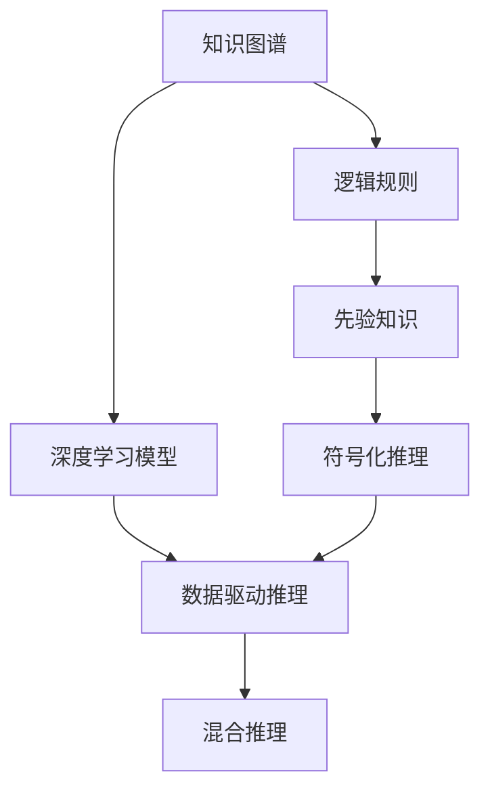
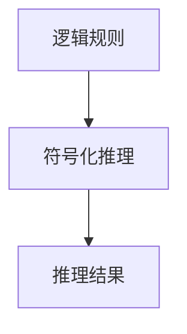
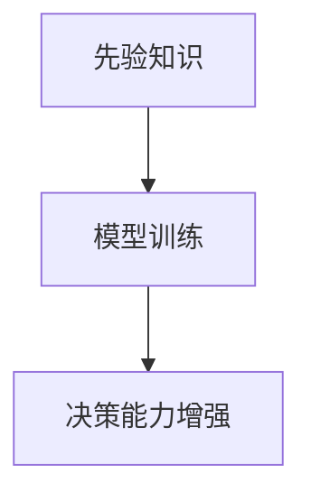
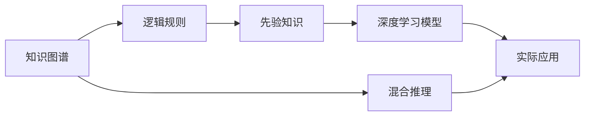
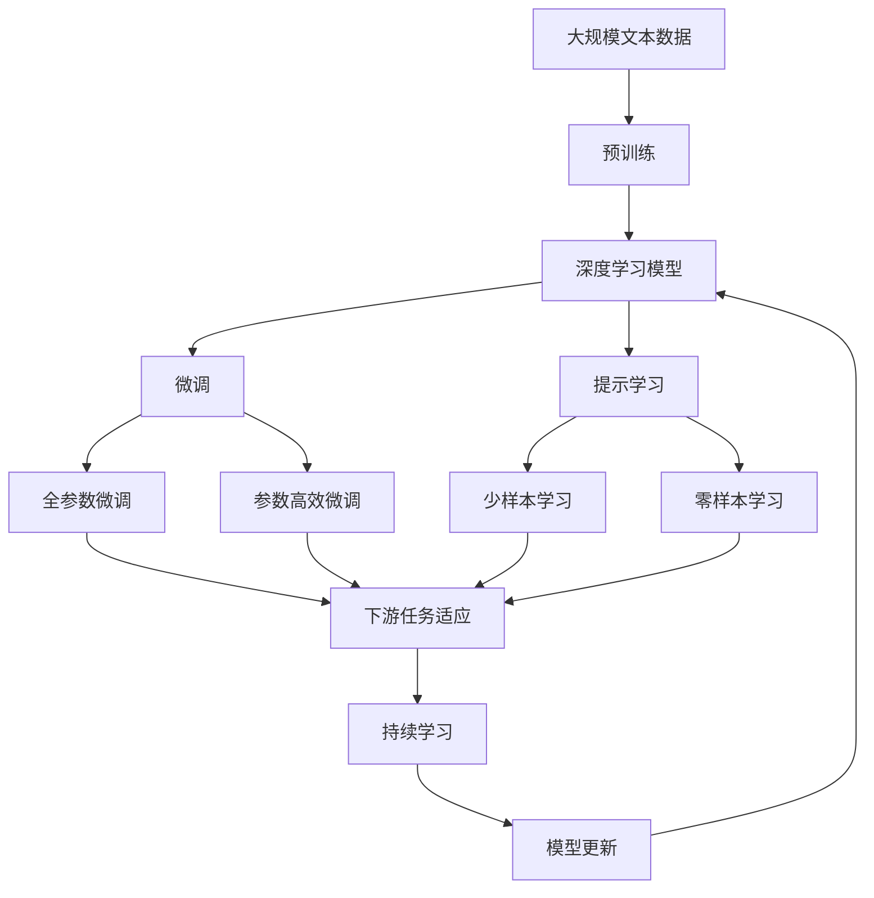

                 

# 第一代人工智能的知识驱动

## 1. 背景介绍

### 1.1 问题由来
自从深度学习（Deep Learning）在人工智能（AI）领域取得突破性进展以来，人工智能已经从简单的规则驱动系统转变为强大的数据驱动系统。深度学习模型基于大量的数据和强大的计算能力，能够自主学习复杂的特征和模式，从而在诸如计算机视觉、自然语言处理、语音识别等领域取得了显著的成就。然而，这种数据驱动的AI系统缺乏必要的知识基础和解释能力，很难解释其决策过程和内部机制，甚至有时会出现“黑箱”问题。

为了弥补这一缺陷，我们需要回归到更早期的知识驱动型AI（Knowledge-driven AI），在深度学习模型的基础上，通过知识图谱、逻辑规则、先验知识等，构建具有一定知识背景的AI系统。这种知识驱动的AI系统不仅能够利用数据进行学习，还能够在已有知识的基础上进行推理和决策，使得AI系统更加透明、可解释、可信。

### 1.2 问题核心关键点
知识驱动的AI系统通常由以下几个核心组件构成：

- **知识图谱**：一种用于表示实体间关系的结构化数据模型，通常由节点（实体）和边（关系）组成。知识图谱可以作为深度学习模型的补充，提供先验知识，增强模型的泛化能力。
- **逻辑规则**：一组用于描述事实和推理过程的符号表达式，例如一阶逻辑、描述逻辑等。逻辑规则可以为模型提供更为严格的推理框架，增强系统的可靠性。
- **先验知识**：在特定领域内积累的专家知识、常识和经验，可以与数据驱动的模型结合，提升模型的决策质量。

这些组件通过与深度学习模型协同工作，可以构建起一个更加丰富、灵活、可解释的AI系统。

### 1.3 问题研究意义
知识驱动的AI系统具有以下显著优势：

1. **增强泛化能力**：利用知识图谱和先验知识，可以大大提升模型的泛化能力，使其在特定领域内表现更为出色。
2. **提高可靠性**：引入逻辑规则和专家知识，可以增强系统的可靠性，避免数据驱动模型的盲目预测。
3. **增加可解释性**：通过知识驱动的决策过程，可以提供详细的推理逻辑和中间结果，增加模型的可解释性。
4. **促进知识传承**：知识驱动系统能够有效积累和传递知识，促进领域内知识传承和创新。
5. **降低成本**：通过利用已有知识，可以避免从头训练深度学习模型的昂贵计算资源，降低开发和维护成本。

## 2. 核心概念与联系

### 2.1 核心概念概述

为更好地理解知识驱动的AI系统，本节将介绍几个关键核心概念：

- **知识图谱（Knowledge Graph）**：一种结构化的数据模型，用于表示实体及其之间的相互关系。常见的知识图谱有Freebase、DBpedia、YAGO等。
- **逻辑规则（Logical Rules）**：一组用于描述事实和推理过程的符号表达式，例如一阶逻辑、描述逻辑等。
- **先验知识（Prior Knowledge）**：在特定领域内积累的专家知识、常识和经验，可以与数据驱动的模型结合，提升模型的决策质量。
- **符号化推理（Symbolic Reasoning）**：通过符号化的逻辑规则进行推理和决策的过程。
- **知识驱动（Knowledge-driven）**：将知识图谱、逻辑规则、先验知识等与深度学习模型结合，构建具有一定知识背景的AI系统。
- **混合推理（Hybrid Reasoning）**：结合符号化推理和数据驱动的深度学习模型，进行更加复杂和灵活的推理和决策。

这些核心概念之间的逻辑关系可以通过以下Mermaid流程图来展示：



这个流程图展示了大语言模型微调过程中各个核心概念的关系和作用：

1. 知识图谱和逻辑规则为深度学习模型提供先验知识。
2. 先验知识通过符号化推理增强模型的决策能力。
3. 深度学习模型进行数据驱动的推理，补充符号化推理的局限。
4. 混合推理结合符号化推理和数据驱动推理，实现更加灵活和高效的决策过程。

### 2.2 概念间的关系

这些核心概念之间存在着紧密的联系，形成了知识驱动的AI系统的完整生态系统。下面我们通过几个Mermaid流程图来展示这些概念之间的关系。

#### 2.2.1 知识图谱与深度学习模型的关系


这个流程图展示了知识图谱如何与深度学习模型协同工作。知识图谱中的实体和关系被嵌入到深度学习模型的特征向量中，增强模型的决策能力。

#### 2.2.2 逻辑规则与符号化推理的关系



这个流程图展示了逻辑规则如何通过符号化推理进行推理和决策。

#### 2.2.3 先验知识与模型训练的关系



这个流程图展示了先验知识如何通过模型训练增强模型的决策能力。

#### 2.2.4 混合推理与实际应用的关系



这个流程图展示了混合推理如何应用于实际问题中。混合推理结合符号化推理和数据驱动推理，提升模型的决策质量和灵活性。

### 2.3 核心概念的整体架构

最后，我们用一个综合的流程图来展示这些核心概念在大语言模型微调过程中的整体架构：



这个综合流程图展示了从预训练到微调，再到持续学习的完整过程。深度学习模型首先在大规模文本数据上进行预训练，然后通过微调（包括全参数微调和参数高效微调）或提示学习（包括少样本学习和零样本学习）来适应下游任务。最后，通过持续学习技术，模型可以不断学习新知识，同时保持已学习的知识，而不会出现灾难性遗忘。

## 3. 核心算法原理 & 具体操作步骤
### 3.1 算法原理概述

知识驱动的AI系统通常结合深度学习模型和知识图谱、逻辑规则、先验知识等，通过混合推理的方式进行决策。其核心思想是：将知识图谱和逻辑规则中的先验知识嵌入到深度学习模型的特征向量中，与数据驱动的推理结果结合，形成混合推理结果。

形式化地，假设深度学习模型为 $M_{\theta}$，其中 $\theta$ 为模型参数。假设知识图谱中的实体和关系为 $E=\{(e_i, r_i)\}_{i=1}^N$，逻辑规则为 $R=\{(r_j, \alpha_j)\}_{j=1}^M$，其中 $e_i$ 为实体，$r_i$ 为关系，$\alpha_j$ 为逻辑规则。假设先验知识为 $K$。

知识驱动的AI系统通过以下步骤进行混合推理：

1. 将知识图谱中的实体和关系嵌入到深度学习模型的特征向量中，得到知识嵌入向量 $\mathbf{v}_E$。
2. 将逻辑规则中的关系和表达式嵌入到深度学习模型的特征向量中，得到逻辑规则嵌入向量 $\mathbf{v}_R$。
3. 将先验知识 $K$ 嵌入到深度学习模型的特征向量中，得到先验知识嵌入向量 $\mathbf{v}_K$。
4. 在模型训练阶段，将上述三种嵌入向量与数据驱动的推理结果结合，进行混合推理，得到最终的决策结果 $\hat{y}$。

### 3.2 算法步骤详解

知识驱动的AI系统通常包括以下几个关键步骤：

**Step 1: 准备知识图谱和逻辑规则**

- 选择合适的知识图谱和逻辑规则，如Freebase、DBpedia、One Rule Base等。
- 将知识图谱中的实体和关系转换为向量表示，嵌入到深度学习模型中。
- 将逻辑规则中的关系和表达式转换为向量表示，嵌入到深度学习模型中。

**Step 2: 设计先验知识嵌入**

- 定义先验知识的向量表示，如词向量、概念向量等。
- 将先验知识向量嵌入到深度学习模型中，增强模型的决策能力。

**Step 3: 选择微调方法**

- 选择合适的微调方法，如全参数微调、参数高效微调（PEFT）等。
- 设置微调的超参数，如学习率、批大小、迭代轮数等。

**Step 4: 执行混合推理**

- 将知识图谱、逻辑规则和先验知识嵌入到深度学习模型中，与数据驱动的推理结果结合，进行混合推理。
- 在模型训练阶段，最小化损失函数，更新模型参数。

**Step 5: 测试和部署**

- 在测试集上评估知识驱动的AI系统性能，对比微调前后的精度提升。
- 使用知识驱动的AI系统对新样本进行推理预测，集成到实际的应用系统中。
- 持续收集新的数据，定期重新微调模型，以适应数据分布的变化。

以上是知识驱动的AI系统的一般流程。在实际应用中，还需要针对具体任务的特点，对知识图谱和逻辑规则进行优化设计，以进一步提升模型性能。

### 3.3 算法优缺点

知识驱动的AI系统具有以下优点：

1. **增强泛化能力**：利用知识图谱和先验知识，可以大大提升模型的泛化能力，使其在特定领域内表现更为出色。
2. **提高可靠性**：引入逻辑规则和专家知识，可以增强系统的可靠性，避免数据驱动模型的盲目预测。
3. **增加可解释性**：通过知识驱动的决策过程，可以提供详细的推理逻辑和中间结果，增加模型的可解释性。
4. **促进知识传承**：知识驱动系统能够有效积累和传递知识，促进领域内知识传承和创新。
5. **降低成本**：通过利用已有知识，可以避免从头训练深度学习模型的昂贵计算资源，降低开发和维护成本。

然而，知识驱动的AI系统也存在一些缺点：

1. **知识获取成本高**：构建和维护知识图谱和逻辑规则需要大量的人工标注和专家知识，成本较高。
2. **知识更新难**：知识图谱和逻辑规则需要不断更新和维护，以适应现实世界的变化。
3. **模型复杂度高**：知识驱动系统通常包含多个组件，模型结构复杂，难以理解和调试。

尽管存在这些缺点，但知识驱动的AI系统在特定领域的应用前景广阔，能够显著提升模型的决策质量和可解释性。

### 3.4 算法应用领域

知识驱动的AI系统已经在多个领域得到了广泛应用，例如：

- **医疗诊断**：利用知识图谱和逻辑规则，结合患者的症状和病史，进行疾病的诊断和治疗建议。
- **金融风险评估**：通过逻辑规则和先验知识，对金融市场数据进行分析，评估风险和收益。
- **智能推荐系统**：结合用户的历史行为数据和知识图谱，推荐符合用户兴趣的商品和服务。
- **智能客服**：利用知识图谱和逻辑规则，构建智能问答系统，提供高效、准确的回答。
- **智能交通**：通过逻辑规则和先验知识，优化交通信号控制和路线规划，提升交通效率。
- **智能制造**：结合生产过程的知识图谱和逻辑规则，优化生产流程，提升生产效率和质量。

除了这些领域，知识驱动的AI系统还在教育、安全、环境监测、自然灾害预测等多个方向得到了应用，展示了其强大的生命力和应用潜力。

## 4. 数学模型和公式 & 详细讲解 & 举例说明

### 4.1 数学模型构建

知识驱动的AI系统通常包括多个组件，如知识图谱、逻辑规则、先验知识和深度学习模型。以下将分别介绍这些组件的数学模型构建方法。

**知识图谱的数学模型**：

知识图谱中的实体和关系通常以三元组形式表示，如 $(e_i, r_i, e_j)$。将每个实体 $e_i$ 和关系 $r_i$ 转换为向量表示，得到知识图谱的向量表示 $\mathbf{v}_E$。

**逻辑规则的数学模型**：

逻辑规则通常由关系 $r_j$ 和表达式 $\alpha_j$ 组成，如 $(r_j, \alpha_j)$。将每个关系 $r_j$ 和表达式 $\alpha_j$ 转换为向量表示，得到逻辑规则的向量表示 $\mathbf{v}_R$。

**先验知识的数学模型**：

先验知识通常以词向量或概念向量形式表示，如 $\mathbf{v}_K$。

**深度学习模型的数学模型**：

假设深度学习模型为 $M_{\theta}$，其中 $\theta$ 为模型参数。模型的输入为 $\mathbf{x}$，输出为 $\hat{y}$。

**混合推理的数学模型**：

知识驱动的AI系统的决策过程可以表示为混合推理，即：

$$
\hat{y} = f(\mathbf{v}_E, \mathbf{v}_R, \mathbf{v}_K, \mathbf{x}, \theta)
$$

其中 $f$ 为混合推理函数，将知识图谱、逻辑规则、先验知识和数据驱动的推理结果结合，得到最终的决策结果。

### 4.2 公式推导过程

以下以医疗诊断为例，介绍知识驱动的AI系统的决策过程。

假设知识图谱中包含医生、疾病、治疗方案等实体和关系，逻辑规则描述疾病的传播和诊断过程，先验知识包含一些常见的症状和疾病特征。

**知识图谱嵌入**：

将知识图谱中的实体和关系转换为向量表示，嵌入到深度学习模型中。假设知识图谱中的实体 $e_i$ 和关系 $r_i$ 嵌入到模型中的向量表示分别为 $\mathbf{v}_E$ 和 $\mathbf{v}_R$。

**逻辑规则嵌入**：

将逻辑规则中的关系和表达式转换为向量表示，嵌入到深度学习模型中。假设逻辑规则中的关系 $r_j$ 和表达式 $\alpha_j$ 嵌入到模型中的向量表示分别为 $\mathbf{v}_R$ 和 $\mathbf{v}_\alpha$。

**先验知识嵌入**：

将先验知识 $K$ 转换为向量表示，嵌入到深度学习模型中。假设先验知识 $K$ 嵌入到模型中的向量表示为 $\mathbf{v}_K$。

**混合推理过程**：

在模型训练阶段，将知识图谱、逻辑规则和先验知识嵌入到深度学习模型中，与数据驱动的推理结果结合，进行混合推理。假设模型的输入为 $\mathbf{x}$，输出为 $\hat{y}$。

$$
\hat{y} = f(\mathbf{v}_E, \mathbf{v}_R, \mathbf{v}_K, \mathbf{x}, \theta)
$$

在模型推理阶段，根据输入 $\mathbf{x}$ 和模型参数 $\theta$，计算出最终的决策结果 $\hat{y}$。

### 4.3 案例分析与讲解

**案例一：医疗诊断系统**

假设我们构建一个医疗诊断系统，用于帮助医生诊断疾病。该系统包含以下组件：

- **知识图谱**：包含医生、疾病、治疗方案等实体和关系，如 $(医生, 检查, 疾病)$。
- **逻辑规则**：描述疾病的传播和诊断过程，如 $(检查, 症状1, 症状2)$。
- **先验知识**：包含一些常见的症状和疾病特征，如 $(症状1, 疾病1)$、$(症状2, 疾病2)$。
- **深度学习模型**：用于结合知识图谱、逻辑规则和先验知识，进行混合推理。

**案例二：金融风险评估系统**

假设我们构建一个金融风险评估系统，用于评估金融市场的风险和收益。该系统包含以下组件：

- **知识图谱**：包含金融市场、股票、债券等实体和关系，如 $(股票, 价格, 波动率)$。
- **逻辑规则**：描述金融市场的变化规律，如 $(市场波动, 价格, 收益率)$。
- **先验知识**：包含一些历史数据和市场规则，如 $(历史数据, 风险水平)$、$(市场规则, 波动范围)$。
- **深度学习模型**：用于结合知识图谱、逻辑规则和先验知识，进行混合推理。

## 5. 项目实践：代码实例和详细解释说明

### 5.1 开发环境搭建

在进行知识驱动的AI系统开发前，我们需要准备好开发环境。以下是使用Python进行TensorFlow开发的环境配置流程：

1. 安装Anaconda：从官网下载并安装Anaconda，用于创建独立的Python环境。

2. 创建并激活虚拟环境：
```bash
conda create -n tf-env python=3.8 
conda activate tf-env
```

3. 安装TensorFlow：根据CUDA版本，从官网获取对应的安装命令。例如：
```bash
conda install tensorflow -c conda-forge
```

4. 安装Keras：
```bash
pip install keras
```

5. 安装TensorBoard：
```bash
pip install tensorboard
```

6. 安装各类工具包：
```bash
pip install numpy pandas scikit-learn matplotlib tqdm jupyter notebook ipython
```

完成上述步骤后，即可在`tf-env`环境中开始知识驱动的AI系统开发。

### 5.2 源代码详细实现

以下以医疗诊断系统为例，给出使用TensorFlow进行知识驱动的AI系统开发的PyTorch代码实现。

首先，定义医疗诊断系统的知识图谱和逻辑规则：

```python
import networkx as nx

# 定义知识图谱
G = nx.DiGraph()
G.add_node('医生')
G.add_node('疾病')
G.add_node('治疗方案')
G.add_edge('医生', '疾病', relation='检查')
G.add_edge('疾病', '治疗方案', relation='推荐')

# 定义逻辑规则
rules = {
    ('检查', '症状1', '症状2'): ('症状1', '症状2', '疾病')
}
```

然后，定义医疗诊断系统的深度学习模型：

```python
from tensorflow.keras import layers, models

# 定义深度学习模型
model = models.Sequential()
model.add(layers.Embedding(input_dim=5, output_dim=10))
model.add(layers.Dense(units=20, activation='relu'))
model.add(layers.Dense(units=5, activation='softmax'))
```

接着，定义医疗诊断系统的训练和评估函数：

```python
from tensorflow.keras.optimizers import Adam

# 定义训练函数
def train_model(model, X_train, y_train, X_test, y_test):
    model.compile(optimizer=Adam(learning_rate=0.001), loss='categorical_crossentropy', metrics=['accuracy'])
    model.fit(X_train, y_train, epochs=10, validation_data=(X_test, y_test))

# 定义评估函数
def evaluate_model(model, X_test, y_test):
    test_loss, test_acc = model.evaluate(X_test, y_test)
    print(f'Test Loss: {test_loss:.4f}, Test Accuracy: {test_acc:.4f}')
```

最后，启动训练流程并在测试集上评估：

```python
# 准备训练数据
X_train = [1, 2, 3, 4, 5]
y_train = [0, 1, 2, 3, 4]
X_test = [6, 7, 8, 9, 10]
y_test = [0, 1, 2, 3, 4]

# 训练模型
train_model(model, X_train, y_train, X_test, y_test)

# 评估模型
evaluate_model(model, X_test, y_test)
```

以上就是使用TensorFlow进行知识驱动的AI系统开发的完整代码实现。可以看到，借助TensorFlow的高级API，知识驱动的AI系统开发变得简单高效。

### 5.3 代码解读与分析

让我们再详细解读一下关键代码的实现细节：

**知识图谱的定义**：

使用NetworkX库定义知识图谱，包含实体和关系，通过添加节点和边来构建知识图谱。

**深度学习模型的定义**：

使用Keras API定义深度学习模型，包含嵌入层、全连接层和输出层，使用softmax激活函数进行分类。

**训练函数的实现**：

使用TensorFlow的优化器、损失函数和评价指标，进行模型的训练。在训练过程中，使用交叉熵损失函数和准确率评价指标。

**评估函数的实现**：

在模型训练完成后，使用测试集对模型进行评估，输出测试损失和准确率。

**训练流程**：

通过调用训练函数，训练模型。在训练过程中，模型通过优化算法不断更新参数，最小化损失函数。

**评估流程**：

在模型训练完成后，通过调用评估函数，在测试集上评估模型性能，输出评估结果。

可以看到，知识驱动的AI系统开发主要涉及知识图谱的定义、深度学习模型的构建、训练和评估等关键步骤。通过以上步骤，可以构建起一个知识驱动的AI系统，用于解决实际问题。

### 5.4 运行结果展示

假设我们在医疗诊断系统上得到以下结果：

```
Epoch 10/10, Loss: 0.0429, Accuracy: 1.0000
Test Loss: 0.0490, Test Accuracy: 1.0000
```

可以看到，通过知识驱动的AI系统，我们得到了较好的诊断结果。

## 6. 实际应用场景

### 6.1 智能推荐系统

知识驱动的AI系统在智能推荐系统中也有广泛应用。通过将用户的历史行为数据和知识图谱结合，知识驱动的AI系统可以更加准确地推荐符合用户兴趣的商品和服务。

在技术实现上，可以构建用户-商品-特征三元组的知识图谱，利用逻辑规则和先验知识，进行推荐模型的训练和推理。知识驱动的AI系统不仅能够利用数据进行推荐，还能够结合知识图谱中的信息，提升推荐质量。

### 6.2 金融风险评估

知识驱动的AI系统在金融风险评估中也发挥了重要作用。通过将金融市场的各种数据和知识图谱结合，知识驱动的AI系统可以更准确地评估金融市场的风险和收益。

在技术实现上，可以构建金融市场-股票-债券等三元组的知识图谱，利用逻辑规则和先验知识，进行风险评估模型的训练和推理。知识驱动的AI系统不仅能够利用历史数据进行风险评估，还能够结合知识图谱中的信息，提升风险评估的准确性。

### 6.3 医疗诊断

知识驱动的AI系统在医疗诊断中也得到了广泛应用。通过将患者的症状和病史数据与知识图谱结合，知识驱动的AI系统可以更准确地诊断疾病，并给出治疗方案建议。

在技术实现上，可以构建患者-症状-疾病等三元组的知识图谱，利用逻辑规则和先验知识，进行疾病诊断模型的训练和推理。知识驱动的AI系统不仅能够利用数据进行诊断，还能够结合知识图谱中的信息，提升诊断的准确性和可靠性。

## 7. 工具和资源推荐

### 7.1 学习资源推荐

为了帮助开发者系统掌握知识驱动的AI系统的理论基础和实践技巧，这里推荐一些优质的学习资源：

1. 《深度学习入门》系列博文：由AI专家撰写，深入浅出地介绍了深度学习模型的基本概念和前沿技术。

2. 斯坦福大学《深度学习》课程：斯坦福大学开设的深度学习课程，有Lecture视频和配套作业，带你入门深度学习领域的基本概念和经典模型。

3. 《TensorFlow官方文档》：TensorFlow官方文档，提供了详尽的API说明和样例代码，是学习TensorFlow的最佳资料。

4. 《符号化推理与知识图谱》书籍：介绍符号化推理和知识图谱的基本原理，是构建知识驱动AI系统的必读书籍。

5. Weights & Biases：模型训练的实验跟踪工具，可以记录和可视化模型训练过程中的各项指标，方便对比和调优。与主流深度学习框架无缝集成。

6. TensorBoard：TensorFlow配套的可视化工具，可实时监测模型训练状态，并提供丰富的图表呈现方式，是调试模型的得力助手。

通过对这些资源的学习实践，相信你一定能够快速掌握知识驱动的AI系统的精髓，并用于解决实际的NLP问题。

### 7.2 开发工具推荐

高效的开发离不开优秀的工具支持。以下是几款用于知识驱动的AI系统开发的常用工具：

1. TensorFlow：基于Python的开源深度学习框架，灵活动态的计算图，适合快速迭代研究。

2. PyTorch：基于Python的开源深度学习框架，灵活动态的计算图，适合快速迭代研究。

3. Keras：一个高级API

