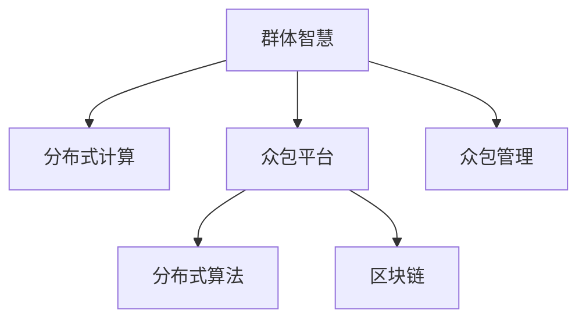

                 

## 1. 背景介绍

### 1.1 问题由来

在现代科技的推动下，计算能力已成为一个社会生产力的重要组成部分。人类计算，从简单的加减乘除到复杂的算法与数据处理，已经逐渐从个体向群体转变。当多个个体同时参与计算任务时，群体智慧（Collective Intelligence）便应运而生。这种智慧往往比个体更为强大，原因在于群体能综合各个个体的优势，通过协同合作解决问题，产生1+1>2的效应。

群体智慧的研究和应用，正成为一个新的交叉学科，涉及计算机科学、社会学、心理学等多个领域。它不仅适用于解决大规模的数据处理问题，还能应用于社会经济、环境保护等多个方面。从众包平台到无人驾驶，从区块链到物联网，群体智慧无处不在，已悄然改变着我们的生活方式。

### 1.2 问题核心关键点

群体智慧的精髓在于通过群体合作，将分散的计算资源整合并优化使用，实现更高效、更可靠、更智能的计算目标。其关键点在于：

- **分散计算资源整合**：在众多个体中，如何有效整合资源，形成合力。
- **信息共享与协作**：如何设计合理的机制，使得个体间信息流畅传递，协同工作。
- **算法与优化**：如何设计高效的算法，优化群体智慧的表现。
- **动态适应**：如何根据环境变化，动态调整群体行为，保持群体智慧的持续进步。

这些关键点决定了群体智慧的研究方向和应用效果，深刻影响着技术的进步和社会的发展。

### 1.3 问题研究意义

研究群体智慧，对于推动计算技术的普及和应用，提升社会的整体计算能力，具有重要意义：

- **提升计算效率**：通过整合和优化计算资源，实现更高效的计算。
- **强化协同合作**：群体智慧强调信息共享和协作，增强社会协同能力。
- **促进技术创新**：结合多种学科的知识，推动技术领域的新突破。
- **优化社会治理**：在环境保护、社会管理等领域，群体智慧的应用能够提高治理水平。

## 2. 核心概念与联系

### 2.1 核心概念概述

为更好地理解群体智慧的核心概念，本节将介绍几个密切相关的核心概念：

- **群体智慧**：指通过多个个体协同工作，形成更为强大、高效、智能的智慧。
- **分布式计算**：指将计算任务分解为多个部分，分布到多个个体上进行并行计算。
- **众包平台**：指通过互联网，将计算任务外包给非专业个体进行解决。
- **分布式算法**：指在多个个体之间，通过算法实现协作，优化计算性能。
- **区块链**：指一种分布式账本技术，能够保证数据的透明和不可篡改。
- **众包管理**：指管理和协调众包平台中众多个体进行计算任务的策略和方法。

这些核心概念之间存在着紧密的联系，形成了群体智慧应用的完整生态系统。

### 2.2 概念间的关系

这些核心概念之间可以通过以下Mermaid流程图来展示其关系：



这个流程图展示了个体智慧与群体智慧的整合过程：

1. 个体智慧通过分布式计算形成群体智慧。
2. 众包平台通过互联网连接个体，实现任务外包和资源整合。
3. 分布式算法使得个体间协同工作，优化计算效果。
4. 区块链提供透明和不可篡改的数据记录，保障个体间信任和协作。
5. 众包管理策略指导个体协同工作，提升群体智慧的效率和效果。

这些概念共同构成了群体智慧应用的完整框架，使其能够在大规模计算任务中发挥强大的计算能力和协同优势。

## 3. 核心算法原理 & 具体操作步骤

### 3.1 算法原理概述

群体智慧的核心算法原理，主要基于分布式计算和协同优化。其基本思想是将计算任务分解为多个子任务，分别分配给多个个体进行处理，最后将结果汇总。协同优化的目标是通过合理的协作机制，最大化群体智慧的表现。

形式化地，假设群体中个体数量为 $N$，分配的任务为 $T$，每个任务的处理时间为 $t_i$。群体智慧的总体处理时间为 $T_{total}$，则需要优化 $T_{total}$ 最小化。优化目标可以表示为：

$$
\min T_{total} = \sum_{i=1}^{N} t_i
$$

其中，$t_i$ 代表个体 $i$ 处理任务 $T$ 的时间，可以通过分布式算法优化。

### 3.2 算法步骤详解

基于分布式计算和协同优化的群体智慧算法一般包括以下关键步骤：

**Step 1: 任务分解与调度**

- 将大型计算任务 $T$ 分解为多个子任务 $T_1, T_2, ..., T_N$，每个子任务可以独立完成。
- 根据任务复杂度和资源可用性，动态调度每个子任务给合适的个体处理。

**Step 2: 信息共享与协作**

- 设计信息共享机制，使得个体间能够高效传递任务进展和计算结果。
- 采用分布式算法，如MapReduce、Spark等，优化计算任务并行处理。
- 通过消息传递、锁机制等技术，避免信息冲突和计算冗余。

**Step 3: 结果汇总与优化**

- 汇总每个个体计算结果，形成最终的群体智慧输出。
- 根据任务要求和群体表现，采用适当的优化算法，如动态负载均衡、自适应调度等。
- 定期评估群体智慧表现，通过反馈机制不断改进协作策略。

### 3.3 算法优缺点

群体智慧算法具有以下优点：

- **资源整合能力强**：通过分布式计算，可以充分利用不同个体和资源。
- **协同优化效果好**：通过合理的协作机制，提升计算效率和准确性。
- **适应性强**：可根据任务需求和环境变化，动态调整计算策略。

同时，该算法也存在一些局限性：

- **通信成本高**：个体间信息传递需要额外的通信开销，影响计算效率。
- **复杂度高**：分布式算法设计和实现复杂，可能面临同步、一致性等问题。
- **安全问题**：数据和计算结果的透明性可能带来隐私和安全风险。

尽管存在这些局限性，群体智慧在解决大规模计算问题方面仍显示出强大的优势。未来相关研究的方向在于如何进一步降低通信成本，提高协同效率，同时保证数据安全和隐私。

### 3.4 算法应用领域

基于群体智慧的计算方法，已经在多个领域得到广泛应用，例如：

- **大规模数据处理**：如大数据存储与分析，通过分布式计算实现高效处理。
- **互联网计算**：如云服务、分布式爬虫等，通过众包平台利用网络计算资源。
- **智能交通管理**：如无人驾驶、交通优化，通过分布式计算实现实时决策。
- **环境保护监测**：如大气污染监测、气候变化预测，通过分布式传感器获取实时数据。
- **人工智能**：如机器学习、自然语言处理等，通过分布式协同优化模型训练。

除了上述这些经典领域外，群体智慧还在更多领域得到创新性应用，如供应链优化、医疗诊断、金融预测等，为各行各业带来新的计算范式。

## 4. 数学模型和公式 & 详细讲解 & 举例说明

### 4.1 数学模型构建

本节将使用数学语言对群体智慧的算法原理进行严格刻画。

假设群体中个体数量为 $N$，分配的任务量为 $T$，每个任务的计算时间为 $t_i$，个体间通信时间为 $c_i$，整体计算时间为 $T_{total}$。

群体智慧的优化目标是最小化总计算时间 $T_{total}$，即：

$$
\min T_{total} = \sum_{i=1}^{N} (t_i + c_i)
$$

其中，$t_i$ 为任务处理时间，$c_i$ 为个体间通信时间。

### 4.2 公式推导过程

以下我们以简单的MapReduce为例，推导分布式计算的优化过程。

假设个体间通信成本忽略不计，每个任务的计算时间为 $t$。则MapReduce的基本计算流程为：

1. Map阶段：将输入数据分片，分配给多个个体并行处理。
2. Reduce阶段：将Map阶段的结果汇总，最终输出结果。

MapReduce的计算时间可以表示为：

$$
T_{total} = Nt
$$

其中 $N$ 为参与计算的个体数量。

如果采用简单的任务分配策略，每个个体分配等量任务，则计算时间 $T_{total}$ 为：

$$
T_{total} = \frac{T}{N}t
$$

可以看出，计算时间与个体数量成反比。

如果采用更高级的任务分配策略，如动态负载均衡，则每个个体处理的任务量 $T_i$ 可动态调整，计算时间 $T_{total}$ 可以进一步优化。设 $T_i$ 为个体 $i$ 处理的任务量，则：

$$
T_{total} = \sum_{i=1}^{N} \frac{T_i}{N}t
$$

设 $T_i = \frac{T}{N}$ 为均匀分配，则计算时间为：

$$
T_{total} = \frac{T}{N}t
$$

可以看出，在均匀分配策略下，计算时间与个体数量成正比。

更优的分配策略可以采用自适应调度算法，如Adaptive Partitioning，根据个体计算能力动态分配任务。设 $T_i$ 为个体 $i$ 的计算能力，$C_i$ 为通信成本，则优化目标为：

$$
\min T_{total} = \sum_{i=1}^{N} (\frac{T_i}{N}t + C_i)
$$

优化过程可以通过动态调整个体任务量 $T_i$ 和通信时间 $C_i$ 来实现。这种优化方法可以显著提高群体智慧的计算效率。

### 4.3 案例分析与讲解

假设一个大型搜索引擎需要处理数亿用户的查询请求。在MapReduce框架下，可以将查询请求分片，分配给多个服务器并行处理。Map阶段将查询请求分片，Reduce阶段将分片结果汇总，最终输出搜索结果。

MapReduce的基本流程如下：

1. 查询请求分片：将亿级查询请求分成 $N$ 个分片，分配给 $N$ 个服务器。
2. 分片处理：每个服务器对分片进行处理，生成中间结果。
3. 中间结果汇总：将 $N$ 个服务器的中间结果汇总，生成最终搜索结果。

通过MapReduce框架，可以显著提高搜索引擎的查询处理效率。具体而言，假设每个查询处理时间为 $t=1$ 秒，每个服务器每秒可以处理 $T_i=1000$ 个查询。如果采用均匀分配策略，则：

- 全部查询请求需要 $Nt$ 秒，即 $NT=1000N$ 秒。
- 每个服务器处理 $T_i=1$ 个分片，需要 $Nt$ 秒，即 $Nt=1000N$ 秒。

如果采用自适应调度策略，则每个服务器根据计算能力动态分配任务，例如 $T_i=100$ 个查询，$C_i=0.1$ 秒通信时间。此时：

- 全部查询请求需要 $Nt+C_i=100N+0.1N$ 秒，即 $100N+0.1N$ 秒。
- 每个服务器处理 $T_i=100$ 个查询，需要 $Nt=100N$ 秒，即 $100N$ 秒。

可以看出，通过自适应调度策略，计算时间可以显著降低，达到最优水平。

## 5. 项目实践：代码实例和详细解释说明

### 5.1 开发环境搭建

在进行群体智慧的实践前，我们需要准备好开发环境。以下是使用Python进行MapReduce开发的环境配置流程：

1. 安装Anaconda：从官网下载并安装Anaconda，用于创建独立的Python环境。

2. 创建并激活虚拟环境：
```bash
conda create -n mapreduce-env python=3.8 
conda activate mapreduce-env
```

3. 安装PyTorch：根据CUDA版本，从官网获取对应的安装命令。例如：
```bash
conda install pytorch torchvision torchaudio cudatoolkit=11.1 -c pytorch -c conda-forge
```

4. 安装PySpark：
```bash
conda install apache-spark
```

5. 安装各类工具包：
```bash
pip install numpy pandas scikit-learn matplotlib tqdm jupyter notebook ipython
```

完成上述步骤后，即可在`mapreduce-env`环境中开始实践。

### 5.2 源代码详细实现

下面我们以搜索引擎查询处理为例，给出使用MapReduce和Spark进行并行计算的PyTorch代码实现。

首先，定义查询分片函数：

```python
import os
from pyspark.sql import SparkSession
from pyspark.sql.functions import split

spark = SparkSession.builder.appName('MapReduce').getOrCreate()

def split_query(query):
    parts = query.split(" ")
    return parts
```

然后，定义查询处理函数：

```python
from pyspark.sql.functions import col

def process_query(query):
    words = col("query").explode().map(lambda word: word.lower())
    return words
```

接着，定义查询结果汇总函数：

```python
def merge_results(results):
    return results.map(lambda word: word)
```

最后，启动MapReduce流程并在测试集上评估：

```python
data = spark.read.text("query_data.txt")

# 将查询请求分片并行处理
split_data = data.flatMap(lambda row: split_query(row))

# 处理每个分片并生成中间结果
processed_data = split_data.flatMap(lambda parts: process_query(parts))

# 汇总结果并输出
results = processed_data.reduce(lambda result1, result2: result1.unionAll(result2))
results.write.csv("output.txt", header=True)

# 在测试集上评估
test_data = spark.read.text("test_query_data.txt")
test_results = test_data.flatMap(lambda row: split_query(row)).flatMap(lambda parts: process_query(parts))
final_results = test_results.reduce(lambda result1, result2: result1.unionAll(result2))
final_results.write.csv("test_output.txt", header=True)

# 结果评估
with open("output.txt") as f:
    lines = f.readlines()
    assert len(lines) == data.count()

with open("test_output.txt") as f:
    test_lines = f.readlines()
    assert len(test_lines) == test_data.count()

for line in lines:
    parts = line.split(",")
    result = parts[-1]
    print(f"query: {', '.join(parts[:-1])}, result: {result}")
```

以上就是使用PySpark进行MapReduce计算的完整代码实现。可以看到，得益于Spark的强大并行计算能力，MapReduce过程变得非常简单。

### 5.3 代码解读与分析

让我们再详细解读一下关键代码的实现细节：

**split_query函数**：
- 将查询字符串按空格分片，返回分片后的列表。

**process_query函数**：
- 将每个分片中的单词小写化，并返回列表。

**merge_results函数**：
- 将多个分片的单词结果汇总，并返回列表。

**启动MapReduce流程**：
- 使用SparkSession创建Spark会话。
- 通过flatMap将查询数据按分片处理，得到多个查询分片。
- 对每个分片调用process_query函数进行处理，生成中间结果。
- 将多个分片的中间结果汇总，并保存到本地文件。
- 在测试集上重复上述过程，并输出结果。
- 最后对测试结果进行比较和输出，确保计算的正确性。

可以看出，通过Spark的MapReduce框架，可以轻松地实现大规模数据并行处理，大大提高了搜索引擎的查询效率。

当然，实际的系统实现还需考虑更多因素，如Spark集群管理、任务调度、资源分配等。但核心的MapReduce过程基本与此类似。

## 6. 实际应用场景

### 6.1 智能交通管理

智能交通管理是群体智慧的重要应用场景之一。通过在城市部署大量传感器和摄像头，实时收集交通数据，利用分布式计算和大数据分析技术，可以实现交通流量预测、路况优化、交通信号控制等功能。

具体而言，传感器和摄像头将采集到的实时数据传输到云端计算平台，采用MapReduce框架并行处理，计算出交通流量、车速、车流密度等关键指标。然后通过自适应调度算法，动态调整交通信号灯的时序，优化交通流量。此外，还可以结合人工智能技术，如图像识别、自然语言处理等，进一步提升智能交通系统的智能化水平。

### 6.2 金融市场预测

金融市场预测是群体智慧的另一个重要应用场景。通过大数据分析，可以从历史数据中挖掘出市场趋势和模式，为投资者提供决策支持。

具体而言，可以将历史股票数据、新闻报道、社交媒体等数据作为输入，利用MapReduce框架进行分布式计算，生成市场预测模型。通过自适应调度算法，动态调整计算资源，实时更新模型参数，预测市场趋势。此外，还可以结合人工智能技术，如深度学习、强化学习等，进一步提升市场预测的准确性和实时性。

### 6.3 环境保护监测

环境保护监测是群体智慧的重要应用之一。通过在野外部署大量传感器和监测设备，实时收集环境数据，利用分布式计算和大数据分析技术，可以实现大气污染监测、水质检测、生态预警等功能。

具体而言，传感器和监测设备将采集到的实时数据传输到云端计算平台，采用MapReduce框架并行处理，计算出环境指标、污染指数等关键指标。然后通过自适应调度算法，动态调整计算资源，实时更新监测数据。此外，还可以结合人工智能技术，如图像识别、自然语言处理等，进一步提升环境监测的智能化水平。

### 6.4 未来应用展望

随着群体智慧技术和应用的不断发展，未来将在更多领域得到应用，带来新的突破和创新：

- **医疗健康**：通过众包平台和大数据分析技术，实现医疗数据共享和分析，提升医疗服务水平。
- **农业生产**：利用传感器和物联网技术，实现农田监测、作物管理等功能，提升农业生产效率。
- **能源管理**：通过分布式计算和大数据分析技术，实现能源系统的优化和智能化管理。
- **智能制造**：通过物联网设备和分布式计算技术，实现生产线的实时监控和优化，提升制造效率和质量。
- **城市管理**：通过传感器和摄像头等设备，实现城市基础设施的智能化管理，提升城市运行效率和居民生活质量。

这些领域的应用，将极大地提升各行业的智能化水平，推动社会进步和发展。

## 7. 工具和资源推荐

### 7.1 学习资源推荐

为了帮助开发者系统掌握群体智慧的理论基础和实践技巧，这里推荐一些优质的学习资源：

1. 《分布式计算原理与实践》：介绍分布式计算的原理、模型和应用，深入讲解MapReduce、Spark等框架。
2. 《大数据处理实战》：介绍大数据处理的关键技术和工具，如Hadoop、Hive、Spark等，提供大量实践案例。
3. 《机器学习与人工智能基础》：介绍机器学习和人工智能的基本概念和算法，涵盖数据处理、模型训练等内容。
4. 《群体智慧》书籍：介绍群体智慧的概念、技术和应用，从理论到实践全面讲解。
5. 《众包平台设计》书籍：介绍众包平台的设计和优化方法，提升平台效率和用户体验。

通过对这些资源的学习实践，相信你一定能够快速掌握群体智慧的精髓，并用于解决实际的计算问题。

### 7.2 开发工具推荐

高效的开发离不开优秀的工具支持。以下是几款用于群体智慧开发的常用工具：

1. PySpark：Apache Spark的Python接口，提供强大的分布式计算能力，适合大数据处理任务。
2. Hadoop：Apache Hadoop分布式计算框架，适合处理海量数据。
3. Apache Flink：分布式流处理框架，支持实时数据处理和分析。
4. Mesos：资源管理系统，支持大规模集群管理。
5. Kubernetes：容器编排系统，支持分布式计算任务的高效调度。

合理利用这些工具，可以显著提升群体智慧计算的开发效率，加快创新迭代的步伐。

### 7.3 相关论文推荐

群体智慧的研究源于学界的持续研究。以下是几篇奠基性的相关论文，推荐阅读：

1. MapReduce: Simplified Data Processing on Large Clusters：提出MapReduce框架，解决大规模数据处理问题。
2. Spark: Cluster Computing with Fault Tolerance：介绍Apache Spark框架，支持分布式计算。
3. Large-Scale Machine Learning with Distributed Gradient Descent：介绍分布式机器学习算法，支持大数据训练。
4. Large-Scale Cluster Computing with Storm Trident：介绍Apache Storm Trident框架，支持实时数据处理。
5. Crowdsourcing AI: Merging Human Intelligence with Machine Intelligence：介绍群体智慧的融合应用，推动AI技术发展。

这些论文代表了大规模计算和群体智慧的研究进展，通过学习这些前沿成果，可以帮助研究者把握学科前进方向，激发更多的创新灵感。

除上述资源外，还有一些值得关注的前沿资源，帮助开发者紧跟群体智慧技术的发展趋势，例如：

1. arXiv论文预印本：人工智能领域最新研究成果的发布平台，包括大量尚未发表的前沿工作，学习前沿技术的必读资源。
2. 业界技术博客：如Google AI、Microsoft Research、Amazon AI等顶尖实验室的官方博客，第一时间分享他们的最新研究成果和洞见。
3. 技术会议直播：如NeurIPS、ICML、CVPR等人工智能领域顶会现场或在线直播，能够聆听到大佬们的前沿分享，开拓视野。
4. GitHub热门项目：在GitHub上Star、Fork数最多的群体智慧相关项目，往往代表了该技术领域的发展趋势和最佳实践，值得去学习和贡献。
5. 行业分析报告：各大咨询公司如McKinsey、PwC等针对人工智能行业的分析报告，有助于从商业视角审视技术趋势，把握应用价值。

总之，对于群体智慧的学习和实践，需要开发者保持开放的心态和持续学习的意愿。多关注前沿资讯，多动手实践，多思考总结，必将收获满满的成长收益。

## 8. 总结：未来发展趋势与挑战

### 8.1 总结

本文对群体智慧的核心算法原理和操作步骤进行了全面系统的介绍。首先阐述了群体智慧的概念、发展历程和研究意义，明确了群体智慧在处理大规模计算任务中的重要价值。其次，从原理到实践，详细讲解了群体智慧的数学模型和计算框架，给出了分布式计算的完整代码实例。同时，本文还广泛探讨了群体智慧在智能交通、金融市场、环境保护等多个领域的应用前景，展示了群体智慧的广阔应用潜力。此外，本文精选了群体智慧学习的相关资源，力求为读者提供全方位的技术指引。

通过本文的系统梳理，可以看到，群体智慧作为一种强大的计算技术，能够高效整合和利用分散资源，解决大规模计算问题，提升社会整体计算能力。未来，随着分布式计算技术的不断进步，群体智慧的应用场景将更加广泛，潜力将进一步释放。

### 8.2 未来发展趋势

展望未来，群体智慧的研究和应用将呈现以下几个发展趋势：

1. **技术演进加速**：分布式计算框架和工具将更加成熟和高效，能够支持更大规模、更复杂的数据处理任务。
2. **云计算普及**：基于云端的分布式计算将更加便捷和高效，能够支持更多行业和领域的计算需求。
3. **边缘计算兴起**：通过边缘计算，将计算任务下发到本地设备，提升实时性和响应速度。
4. **智能协同增强**：结合人工智能技术，如深度学习、强化学习等，增强群体智慧的智能化水平。
5. **安全性和隐私保护**：随着数据共享和协同计算的普及，群体智慧的安全性和隐私保护将更加重要。
6. **跨领域融合**：群体智慧将与其他技术，如物联网、区块链等进行更深入的融合，拓展应用领域。

以上趋势凸显了群体智慧技术的广阔前景。这些方向的探索发展，必将进一步提升群体智慧的计算效率和协同能力，推动人工智能技术在更多领域的应用。

### 8.3 面临的挑战

尽管群体智慧技术已经取得了显著进展，但在迈向更加智能化、普适化应用的过程中，仍面临诸多挑战：

1. **数据隐私和安全**：数据共享和协同计算可能带来隐私泄露和安全风险。如何在确保数据安全的同时，实现高效计算，是未来需要解决的重要问题。
2. **计算资源管理**：分布式计算需要高效的资源管理，避免资源浪费和过度消耗。如何设计合理的资源分配策略，是未来需要解决的重要问题。
3. **计算效率优化**：群体智慧需要在高效协同的基础上，优化计算效率，避免过度冗余和计算瓶颈。如何提升群体智慧的计算效率，是未来需要解决的重要问题。
4. **技术标准和规范**：随着群体智慧技术的普及，需要建立统一的技术标准和规范，确保系统互操作性和一致性。如何制定标准和规范，是未来需要解决的重要问题。
5. **人机协同**：群体智慧需要与人类进行高效协同，避免决策过度依赖技术。如何设计合理的交互界面和反馈机制，是未来需要解决的重要问题。

这些挑战需要学界和产业界的共同努力，才能克服并推动群体智慧技术的成熟和普及。

### 8.4 研究展望

面向未来，群体智慧的研究需要在以下几个方向寻求新的突破：

1. **多模态数据融合**：将视觉、语音、文本等多模态数据进行融合，提升群体智慧的感知和理解能力。
2. **动态任务调度**：根据任务需求和环境变化，动态调整计算任务和资源分配，提升群体智慧的灵活性和自适应能力。
3. **智能决策系统**：结合人工智能技术，设计智能决策

