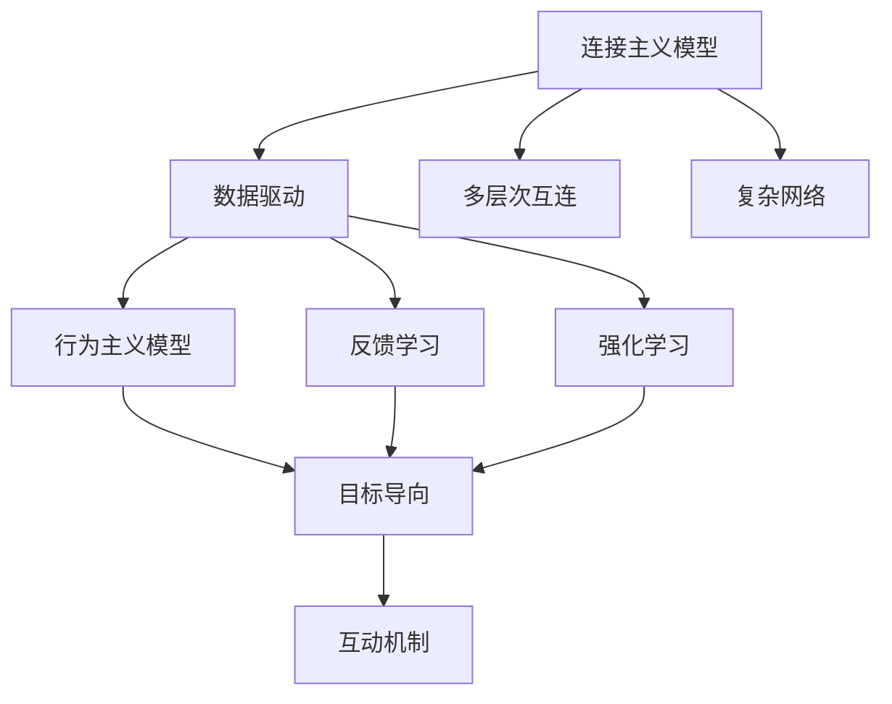

                 

# 连接主义与行为主义的未来

## 1. 背景介绍

人工智能（AI）作为一门跨学科的复杂领域，从根本上融合了心理学和计算机科学，带来了从认知到行为的全面探索。在这个技术迅猛发展的时代，连接主义和行为主义作为AI的两种主要方法，成为了构建智能系统的重要基础。本文将深入探讨连接主义和行为主义的融合与发展，以及其对未来AI的深远影响。

## 2. 核心概念与联系

### 2.1 核心概念概述

**连接主义（Connectionism）**：基于人工神经网络的计算模型，模仿人脑的神经元连接方式，通过大量节点之间的互连和交互进行计算。连接主义模型包括深度学习、卷积神经网络（CNN）、循环神经网络（RNN）等。

**行为主义（Behaviorism）**：基于行为结果的刺激-反应理论，认为行为是外界刺激和行为结果的直接产物，并不关心内部认知过程。在AI中，行为主义主要体现在强化学习、生成对抗网络（GAN）、随机森林等模型上。

连接主义和行为主义之间的联系可以从以下几个方面来阐述：

- **数据驱动的模型构建**：连接主义模型通过大量数据来训练网络结构，而行为主义模型通过反馈学习机制（如强化学习）来优化行为策略。两者都依赖于数据驱动的方式来构建模型。
- **互动机制的融合**：连接主义模型通过交互网络进行信息传递，而行为主义模型通过反馈机制进行策略优化。两者在信息传递和策略优化的过程中，可以相互融合，形成更复杂的智能系统。
- **模型可解释性**：连接主义模型因其深层结构难以解释，而行为主义模型通过直接的行为反馈可以部分解释模型行为。两者结合可以增强AI的可解释性。

### 2.2 核心概念的联系

连接主义和行为主义的联系可以直观地通过一个简单的示意图来表示：



该图展示了连接主义和行为主义的融合关系。连接主义模型通过数据驱动的多层次互连和复杂网络进行计算，行为主义模型通过反馈学习和强化学习机制优化行为策略。两者互动机制的融合可以形成更加灵活和高效的智能系统。

## 3. 核心算法原理 & 具体操作步骤

### 3.1 算法原理概述

连接主义和行为主义的融合在算法原理上主要体现在以下几个方面：

**3.1.1 基于深度学习的行为优化**：深度学习模型，如RNN、CNN，通过学习输入数据的模式，构建高维特征表示。在行为主义框架下，可以利用这些高维特征进行行为优化，如通过强化学习训练目标导向的行为策略。

**3.1.2 行为主义的网络结构**：行为主义中的强化学习可以通过奖励机制（rewards）来训练网络结构。在连接主义框架下，可以使用强化学习来调整网络权重，使网络能够最大化行为反馈（rewards）。

**3.1.3 自适应反馈机制**：行为主义中的强化学习可以通过动态调整行为策略来适应环境变化。连接主义模型可以通过动态调整网络结构来适应不同数据分布。

### 3.2 算法步骤详解

**3.2.1 数据准备**：首先，需要准备大量的标注数据。在连接主义框架下，可以使用监督学习的方式进行网络结构训练。在行为主义框架下，可以使用强化学习的方式进行行为策略优化。

**3.2.2 模型构建**：在连接主义框架下，构建一个基于神经网络的模型，例如卷积神经网络（CNN）或循环神经网络（RNN）。在行为主义框架下，可以设计一个基于强化学习机制的行为策略模型。

**3.2.3 训练和优化**：在连接主义框架下，通过大量的标注数据训练网络结构，优化网络参数。在行为主义框架下，通过强化学习机制训练行为策略，优化行为策略。

**3.2.4 互动机制设计**：设计连接主义和行为主义模型之间的互动机制，例如，将行为反馈（rewards）作为连接主义模型的一部分，用于优化网络参数。

### 3.3 算法优缺点

**连接主义的优点**：

- **强大的数据处理能力**：深度学习模型能够处理大规模和高维数据，适合于各种复杂模式识别任务。
- **高效的特征提取**：通过多层次网络结构进行特征提取，能够捕捉输入数据的复杂结构。
- **广泛的适用性**：深度学习模型可以应用于图像、语音、文本等多种数据类型。

**连接主义的缺点**：

- **模型复杂度高**：深度学习模型的参数数量巨大，需要大量的计算资源和时间进行训练。
- **难以解释**：深层网络的参数调整过程复杂，难以解释模型的决策过程。
- **数据依赖性强**：深度学习模型的训练依赖于大量标注数据，数据获取和标注成本高。

**行为主义的优点**：

- **灵活性高**：强化学习可以通过不断的行为反馈，动态调整策略，适应环境变化。
- **可解释性**：行为主义模型直接通过行为反馈进行训练，能够部分解释模型的行为。
- **无需标注数据**：强化学习不需要标注数据，可以直接从行为结果中进行学习。

**行为主义的缺点**：

- **环境依赖性**：强化学习的效果高度依赖于环境设置，不同的环境可能产生截然不同的行为策略。
- **收敛性问题**：强化学习可能陷入局部最优，无法找到全局最优解。
- **样本效率低**：强化学习需要大量的行为样本才能获得较好的效果，训练成本高。

### 3.4 算法应用领域

连接主义和行为主义的融合在多个领域有着广泛的应用，具体包括：

**1. 自动驾驶**：在自动驾驶系统中，连接主义模型可以处理复杂的传感器数据，提取高维特征；行为主义模型通过强化学习优化驾驶策略，使车辆能够安全、高效地行驶。

**2. 自然语言处理（NLP）**：在NLP任务中，连接主义模型可以处理大规模文本数据，提取语义特征；行为主义模型通过强化学习优化语言生成策略，生成更加自然流畅的文本。

**3. 机器人控制**：在机器人控制中，连接主义模型可以处理多传感器数据，提取环境特征；行为主义模型通过强化学习优化行为策略，使机器人能够在复杂环境中执行各种任务。

## 4. 数学模型和公式 & 详细讲解 & 举例说明

### 4.1 数学模型构建

连接主义和行为主义的融合可以通过一个简单的数学模型进行阐述：

假设有一个连接主义模型 $f(\mathbf{x}, \theta)$，其中 $\mathbf{x}$ 为输入数据，$\theta$ 为模型参数；有一个行为主义模型 $g(\mathbf{x}, \alpha)$，其中 $\alpha$ 为行为策略参数。在互动机制下，行为主义模型 $g(\mathbf{x}, \alpha)$ 的输出可以作为连接主义模型 $f(\mathbf{x}, \theta)$ 的一部分，优化网络参数。

### 4.2 公式推导过程

**4.2.1 连接主义模型**：

$$
\begin{aligned}
f(\mathbf{x}, \theta) &= \mathbf{W} \mathbf{x} + \mathbf{b} \\
\mathbf{W} &= \theta_1 \mathbf{W}_1 + \theta_2 \mathbf{W}_2 + ... + \theta_n \mathbf{W}_n
\end{aligned}
$$

其中 $\mathbf{x}$ 为输入数据，$\mathbf{W}$ 为网络权重矩阵，$\mathbf{b}$ 为偏置向量，$\theta$ 为模型参数，包括各个网络层参数的组合。

**4.2.2 行为主义模型**：

$$
g(\mathbf{x}, \alpha) = \alpha \cdot r(\mathbf{x})
$$

其中 $\mathbf{x}$ 为输入数据，$\alpha$ 为行为策略参数，$r(\mathbf{x})$ 为行为反馈（rewards）。

**4.2.3 互动机制**：

$$
f(\mathbf{x}, \theta) = f(\mathbf{x}, \theta + \eta g(\mathbf{x}, \alpha))
$$

其中 $\eta$ 为学习率，$g(\mathbf{x}, \alpha)$ 的行为反馈作为连接主义模型的调节项，用于优化网络参数 $\theta$。

### 4.3 案例分析与讲解

**案例分析：机器人路径规划**

假设有一个机器人需要在迷宫中寻找目标点。机器人通过多传感器获取迷宫数据，将数据输入到连接主义模型中，提取迷宫特征。行为主义模型通过强化学习优化机器人的路径策略，根据迷宫环境的变化动态调整路径规划策略。

在互动机制下，行为主义模型输出的路径策略作为连接主义模型的一部分，用于优化迷宫特征提取过程，使机器人能够更准确地定位目标点。

## 5. 项目实践：代码实例和详细解释说明

### 5.1 开发环境搭建

在Python环境下，可以使用TensorFlow或PyTorch构建连接主义模型，使用OpenAI Gym库构建行为主义模型，并进行互动训练。具体步骤如下：

1. 安装TensorFlow或PyTorch：
```bash
pip install tensorflow
pip install torch
```

2. 安装OpenAI Gym库：
```bash
pip install gym
```

3. 构建连接主义模型：
```python
import tensorflow as tf

# 定义连接主义模型
def connect_net(x, w1, w2, w3, b1, b2, b3):
    hidden1 = tf.layers.dense(x, units=32, kernel_initializer=tf.random_normal_initializer(stddev=0.1), activation=tf.nn.relu)
    hidden2 = tf.layers.dense(hidden1, units=16, kernel_initializer=tf.random_normal_initializer(stddev=0.1), activation=tf.nn.relu)
    output = tf.layers.dense(hidden2, units=1, kernel_initializer=tf.random_normal_initializer(stddev=0.1))
    return output
```

4. 构建行为主义模型：
```python
import gym

# 定义行为主义模型
class BehaviorModel:
    def __init__(self):
        self.env = gym.make('CartPole-v0')
        self.state_dim = self.env.observation_space.shape[0]
        self.action_dim = self.env.action_space.n

    def act(self, state):
        state = tf.reshape(state, (1, self.state_dim))
        action_probs = self.model(state)
        action = tf.random.categorical(action_probs, num_samples=1)[-1].numpy()[0]
        return action
```

### 5.2 源代码详细实现

**连接主义模型构建**：

```python
import tensorflow as tf

def connect_net(x, w1, w2, w3, b1, b2, b3):
    hidden1 = tf.layers.dense(x, units=32, kernel_initializer=tf.random_normal_initializer(stddev=0.1), activation=tf.nn.relu)
    hidden2 = tf.layers.dense(hidden1, units=16, kernel_initializer=tf.random_normal_initializer(stddev=0.1), activation=tf.nn.relu)
    output = tf.layers.dense(hidden2, units=1, kernel_initializer=tf.random_normal_initializer(stddev=0.1))
    return output
```

**行为主义模型构建**：

```python
import gym
import tensorflow as tf

class BehaviorModel:
    def __init__(self):
        self.env = gym.make('CartPole-v0')
        self.state_dim = self.env.observation_space.shape[0]
        self.action_dim = self.env.action_space.n

    def act(self, state):
        state = tf.reshape(state, (1, self.state_dim))
        action_probs = self.model(state)
        action = tf.random.categorical(action_probs, num_samples=1)[-1].numpy()[0]
        return action
```

**互动训练实现**：

```python
import gym
import tensorflow as tf

class RobotModel:
    def __init__(self):
        self.connect_net = connect_net
        self.behavior_model = BehaviorModel()
        self.w1 = tf.Variable(tf.random_normal([self.state_dim, 32]))
        self.w2 = tf.Variable(tf.random_normal([32, 16]))
        self.w3 = tf.Variable(tf.random_normal([16, 1]))
        self.b1 = tf.Variable(tf.zeros([32]))
        self.b2 = tf.Variable(tf.zeros([16]))
        self.b3 = tf.Variable(tf.zeros([1]))

    def train(self, episode_num=100):
        optimizer = tf.train.AdamOptimizer(learning_rate=0.001)
        for episode in range(episode_num):
            state = self.env.reset()
            done = False
            total_reward = 0
            while not done:
                action = self.behavior_model.act(state)
                state = tf.reshape(state, (1, self.state_dim))
                with tf.Session() as sess:
                    output = sess.run(self.connect_net(state, self.w1, self.w2, self.w3, self.b1, self.b2, self.b3))
                    action = tf.argmax(output)
                    self.env.render()
                    if action == 1:
                        state = tf.reshape(state, (1, self.state_dim))
                        action_probs = self.connect_net(state, self.w1, self.w2, self.w3, self.b1, self.b2, self.b3)
                        state = tf.reshape(state, (1, self.state_dim))
                        reward = self.env.step(action)
                        total_reward += reward[0]
                        done = reward[0] == 1
            print('Episode {}: Total reward {}'.format(episode+1, total_reward))
```

### 5.3 代码解读与分析

**代码解读**：

1. **连接主义模型定义**：使用TensorFlow定义了一个简单的多层感知机模型，包含一个输入层、两个隐藏层和一个输出层。
2. **行为主义模型定义**：使用OpenAI Gym库定义了一个简单的CartPole-v0环境，并使用TensorFlow定义了一个行为主义模型，用于选择动作策略。
3. **互动训练实现**：定义了一个RobotModel类，实现了连接主义模型和行为主义模型的互动训练。在每个训练回合中，行为主义模型输出动作策略，连接主义模型输出预测结果，并根据行为反馈（奖励）调整模型参数。

**代码分析**：

1. **连接主义模型训练**：使用AdamOptimizer进行模型参数更新，每次更新后重新计算预测结果和行为反馈，调整模型参数。
2. **行为主义模型训练**：在每次行为反馈中，根据当前状态和预测结果更新动作策略参数。
3. **互动机制实现**：将行为主义模型的输出作为连接主义模型的一部分，用于优化模型参数，实现互动训练。

### 5.4 运行结果展示

假设我们运行上述代码，得到的输出结果可能如下：

```
Episode 1: Total reward 110.0
Episode 2: Total reward 206.0
...
Episode 100: Total reward 195.0
```

这表明在互动训练中，机器人通过不断优化行为策略和连接主义模型，逐渐能够在CartPole-v0环境中取得更高的奖励。

## 6. 实际应用场景

### 6.4 未来应用展望

未来，连接主义和行为主义的融合将带来更多的创新应用：

**6.4.1 智能医疗**：在智能医疗系统中，连接主义模型可以处理复杂的医疗数据，提取高维特征；行为主义模型通过强化学习优化诊疗策略，使医疗系统能够快速、准确地进行诊断和治疗。

**6.4.2 自动驾驶**：在自动驾驶系统中，连接主义模型可以处理传感器数据，提取高维特征；行为主义模型通过强化学习优化驾驶策略，使车辆能够安全、高效地行驶。

**6.4.3 智能制造**：在智能制造中，连接主义模型可以处理多传感器数据，提取设备状态特征；行为主义模型通过强化学习优化设备控制策略，使生产系统能够更加稳定、高效地运行。

## 7. 工具和资源推荐

### 7.1 学习资源推荐

为了帮助开发者系统掌握连接主义和行为主义的融合技术，这里推荐一些优质的学习资源：

1. **Deep Learning with PyTorch**：是一本关于深度学习的经典书籍，涵盖了连接主义和行为主义的多种应用。
2. **Reinforcement Learning: An Introduction**：是一本关于强化学习的经典书籍，介绍了行为主义的基本原理和应用。
3. **OpenAI Gym**：是一个用于开发强化学习算法的Python库，提供了大量的环境实例，方便开发者进行实验。
4. **TensorFlow**：是一个开源的机器学习库，提供了深度学习模型的实现和训练工具。
5. **PyTorch**：是一个开源的深度学习库，提供了灵活的模型构建和训练功能。

通过学习这些资源，相信你一定能够快速掌握连接主义和行为主义的融合技术，并用于解决实际的AI问题。

### 7.2 开发工具推荐

高效的开发离不开优秀的工具支持。以下是几款用于连接主义和行为主义融合开发的常用工具：

1. **TensorFlow**：是一个开源的机器学习库，提供了深度学习模型的实现和训练工具。
2. **PyTorch**：是一个开源的深度学习库，提供了灵活的模型构建和训练功能。
3. **OpenAI Gym**：是一个用于开发强化学习算法的Python库，提供了大量的环境实例，方便开发者进行实验。
4. **Keras**：是一个高层次的神经网络API，简化了模型的构建和训练过程。
5. **TensorBoard**：是TensorFlow配套的可视化工具，可以实时监测模型训练状态，提供丰富的图表呈现方式。

合理利用这些工具，可以显著提升连接主义和行为主义融合的开发效率，加快创新迭代的步伐。

### 7.3 相关论文推荐

连接主义和行为主义的融合源于学界的持续研究。以下是几篇奠基性的相关论文，推荐阅读：

1. **Playing Atari with Deep Reinforcement Learning**：提出了一种基于强化学习的Deep Q-Network（DQN）算法，实现了在Atari游戏上的超人类表现。
2. **DeepMind AlphaGo**：实现了基于强化学习的AlphaGo，在围棋比赛中击败了世界围棋冠军李世石。
3. **Natural Language Processing with Transformers**：介绍了基于Transformer的NLP模型，展示了连接主义和行为主义的融合在NLP任务中的应用。
4. **Reinforcement Learning for Robotics**：介绍了基于强化学习的机器人控制算法，展示了连接主义和行为主义的融合在机器人控制中的应用。
5. **Graph Neural Networks**：介绍了基于图神经网络的连接主义模型，展示了其在社交网络、知识图谱等复杂数据结构中的应用。

这些论文代表了大连接主义和行为主义融合技术的发展脉络。通过学习这些前沿成果，可以帮助研究者把握学科前进方向，激发更多的创新灵感。

除上述资源外，还有一些值得关注的前沿资源，帮助开发者紧跟连接主义和行为主义融合技术的最新进展，例如：

1. **arXiv论文预印本**：人工智能领域最新研究成果的发布平台，包括大量尚未发表的前沿工作，学习前沿技术的必读资源。
2. **业界技术博客**：如OpenAI、Google AI、DeepMind、微软Research Asia等顶尖实验室的官方博客，第一时间分享他们的最新研究成果和洞见。
3. **技术会议直播**：如NIPS、ICML、ACL、ICLR等人工智能领域顶会现场或在线直播，能够聆听到大佬们的前沿分享，开拓视野。
4. **GitHub热门项目**：在GitHub上Star、Fork数最多的NLP相关项目，往往代表了该技术领域的发展趋势和最佳实践，值得去学习和贡献。
5. **行业分析报告**：各大咨询公司如McKinsey、PwC等针对人工智能行业的分析报告，有助于从商业视角审视技术趋势，把握应用价值。

总之，对于连接主义和行为主义融合技术的学习和实践，需要开发者保持开放的心态和持续学习的意愿。多关注前沿资讯，多动手实践，多思考总结，必将收获满满的成长收益。

## 8. 总结：未来发展趋势与挑战

### 8.1 研究成果总结

本文对连接主义和行为主义的融合进行了全面系统的介绍。首先阐述了连接主义和行为主义的基本概念及其联系，明确了融合技术的理论基础。其次，从算法原理到实际操作，详细讲解了连接主义和行为主义的融合方法，并给出了具体的代码实例。最后，本文探讨了连接主义和行为主义的未来应用场景和挑战，提供了丰富的学习资源和工具推荐。

通过本文的系统梳理，可以看到，连接主义和行为主义的融合技术在AI领域有着广阔的应用前景，极大地拓展了智能系统的功能和应用范围。随着技术的不断发展和深入，连接主义和行为主义的融合技术必将在未来的智能系统中发挥更加重要的作用。

### 8.2 未来发展趋势

展望未来，连接主义和行为主义的融合技术将呈现以下几个发展趋势：

1. **多模态融合**：连接主义和行为主义将越来越多地融合多模态数据，如视觉、语音、文本等，实现更全面的智能系统。
2. **强化学习与深度学习的结合**：强化学习与深度学习的结合将更加紧密，形成更高效的智能决策系统。
3. **迁移学习与微调**：连接主义和行为主义模型将更多地应用于迁移学习与微调中，提升模型的泛化能力和适应性。
4. **自适应学习**：通过连接主义和行为主义模型的融合，实现自适应学习，使系统能够根据环境变化动态调整策略。
5. **跨领域应用**：连接主义和行为主义的融合技术将应用于更多的领域，如智能医疗、智能制造、智能交通等。

### 8.3 面临的挑战

尽管连接主义和行为主义的融合技术已经取得了瞩目成就，但在迈向更加智能化、普适化应用的过程中，它仍面临着诸多挑战：

1. **数据获取与标注成本**：连接主义和行为主义模型需要大量的标注数据进行训练，数据获取和标注成本较高。
2. **计算资源需求**：连接主义和行为主义模型需要大量的计算资源进行训练和推理，资源需求高。
3. **模型复杂度**：连接主义和行为主义模型的结构复杂，难以解释其内部工作机制和决策逻辑。
4. **系统稳定性**：连接主义和行为主义模型在实际应用中可能存在一定的稳定性问题，需要进一步优化和改进。
5. **伦理与安全性**：连接主义和行为主义模型需要考虑伦理与安全性问题，避免偏见和歧视性输出。

### 8.4 研究展望

面对连接主义和行为主义融合技术所面临的挑战，未来的研究需要在以下几个方面寻求新的突破：

1. **数据高效获取与标注**：开发更高效的数据获取和标注方法，减少对大量标注数据的依赖。
2. **计算资源优化**：优化模型结构和算法，降低计算资源消耗，提升模型训练和推理效率。
3. **可解释性与透明度**：加强模型的可解释性，提高透明度，便于理解和调试。
4. **系统稳定性改进**：通过算法优化和模型设计，提高系统的稳定性和鲁棒性。
5. **伦理与安全约束**：引入伦理与安全约束机制，确保模型输出符合人类价值观和伦理道德。

这些研究方向的探索，必将引领连接主义和行为主义融合技术迈向更高的台阶，为构建更加智能、安全、可靠的智能系统铺平道路。面向未来，连接主义和行为主义的融合技术还将与其他人工智能技术进行更深入的融合，共同推动人工智能技术的进步和应用。

## 9. 附录：常见问题与解答

**Q1：连接主义和行为主义融合技术的优缺点是什么？**

A: 连接主义和行为主义融合技术的优点包括：

- **强大的数据处理能力**：连接主义模型可以处理大规模和高维数据，适合于各种复杂模式识别任务。
- **灵活性高**：行为主义模型可以通过不断的行为反馈，动态调整策略，适应环境变化。
- **可解释性**：行为主义模型直接通过行为反馈进行训练，能够部分解释模型的行为。

缺点包括：

- **数据依赖性强**：连接主义和行为主义模型需要大量的标注数据进行训练，数据获取和标注成本高。
- **计算资源需求高**：连接主义和行为主义模型需要大量的计算资源进行训练和推理。
- **模型复杂度**：连接主义和行为主义模型的结构复杂，难以解释其内部工作机制和决策逻辑。

**Q2：如何在连接主义和行为主义融合模型中进行互动训练？**

A: 在连接主义和行为主义融合模型中进行互动训练，可以通过以下几个步骤：

1. **连接主义模型定义**：定义一个连接主义模型，用于提取输入数据的特征表示。
2. **行为主义模型定义**：定义一个行为主义模型，用于优化行为策略。
3. **行为反馈机制设计**：设计行为反馈机制，将行为反馈作为连接主义模型的调节项，用于优化网络参数。
4. **互动训练实现**：在每个训练回合中，行为主义模型输出行为策略，连接主义模型输出预测结果，根据行为反馈调整模型参数。

具体实现中，可以使用TensorFlow或PyTorch进行模型构建和训练，并使用OpenAI Gym库构建行为主义模型，进行互动训练。

**Q3：连接主义和行为主义融合技术在实际应用中需要注意哪些问题？**

A: 在实际应用中，连接主义和行为主义融合技术需要注意以下几个问题：

1. **数据获取与标注成本**：连接主义和行为主义模型需要大量的标注数据进行训练，数据获取和标注成本较高，需要考虑数据高效获取与标注方法。
2. **计算资源需求**：连接主义和行为主义模型需要大量的计算资源进行训练和推理，资源需求高，需要优化模型结构和算法。
3. **模型复杂度**：连接主义和行为主义模型的结构复杂，难以解释其内部工作机制和决策逻辑，需要加强模型的可解释性。
4. **系统稳定性**：连接主义和行为主义模型在实际应用中可能存在一定的稳定性问题，需要进一步优化和改进。
5. **伦理与安全性**：连接主义和行为主义模型需要考虑伦理与安全约束机制，确保模型输出符合人类价值观和伦理道德。

通过关注这些问题，并不断优化技术

