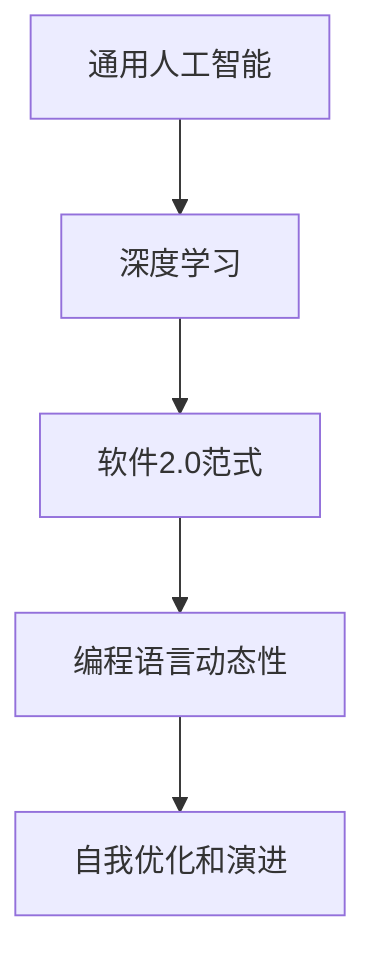
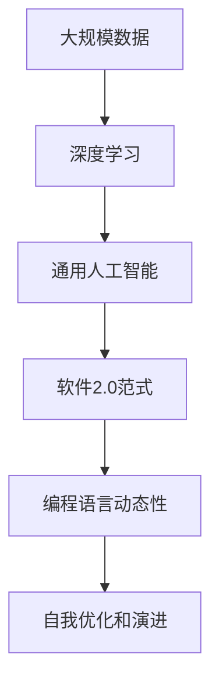

                 

# 通用人工智能很可能基于软件2.0范式

> 关键词：通用人工智能,软件2.0范式,人工智能,技术发展,机器学习,深度学习,认知智能,数据驱动,自动化,算力资源,人机协同,未来科技

## 1. 背景介绍

### 1.1 问题由来
随着人工智能(AI)技术的不断进步，尤其是深度学习在图像识别、自然语言处理等领域的突破，通用人工智能(General Artificial Intelligence, AGI)逐渐成为科学界和工业界关注的焦点。AGI旨在构建具有类人智能水平的智能系统，能够自主完成复杂的认知任务，如推理、规划、创造等。然而，通用人工智能的实现仍然面临诸多技术难题，尤其是如何在大规模数据和强大算力的支持下，构建具有广泛适应性和高度自主性的智能系统。

近年来，随着软件2.0技术的发展，基于软件工程的思想和技术框架，构建具有高度可扩展性和自我进化的AI系统成为可能。软件2.0范式，即利用编程技术构建具有自我演进和自我优化的智能系统，为通用人工智能的实现提供了新的思路。本文将探讨软件2.0范式在通用人工智能中的潜在应用，探讨其优势和局限，并展望未来发展趋势。

### 1.2 问题核心关键点
软件2.0范式，是基于软件工程思想，利用编程语言、软件架构、自动化测试等技术，构建具有自我演进、自我优化能力的智能系统。其核心在于：
1. 编程语言的动态性和可扩展性，能够支持高度灵活的智能模型构建。
2. 软件架构的模块化和组件化，便于构建复杂且高度可维护的智能系统。
3. 自动化测试和部署，确保系统的稳定性和可靠性，支持实时学习和自我更新。

这些特性使得软件2.0范式在通用人工智能的构建中具有独特的优势，尤其是在大规模数据处理、多领域适应性、自我学习优化等方面。然而，软件2.0范式也面临着可解释性、安全性、算力资源等挑战，需要在实际应用中不断优化和改进。

### 1.3 问题研究意义
探讨软件2.0范式在通用人工智能中的应用，对于推动AI技术的突破和产业化进程具有重要意义：
1. 推动AI技术的普及和应用。软件2.0范式通过编程技术和自动化方法，降低了AI系统的构建门槛，使得更多人能够参与到AI研究和应用中。
2. 提升AI系统的适应性和灵活性。通过模块化设计和自我优化机制，AI系统能够更好地适应不同领域和环境的变化。
3. 加速AI技术的创新和迭代。软件2.0范式支持实时学习和自我优化，能够快速适应新任务和新数据，推动AI技术的快速迭代和创新。
4. 增强AI系统的可靠性和安全性。通过自动化测试和部署，软件2.0范式能够显著提升系统的稳定性和安全性，减少人为错误和漏洞。
5. 提供AI系统的可解释性和透明性。编程技术和模块化架构使得AI系统的决策过程更加可解释和透明，便于用户理解和信任。

## 2. 核心概念与联系

### 2.1 核心概念概述

为更好地理解软件2.0范式在通用人工智能中的应用，本节将介绍几个关键概念：

- 通用人工智能(AGI)：指构建具有广泛认知能力和自我学习能力的智能系统，能够在不同领域和环境中自主完成任务。
- 软件2.0范式：基于软件工程的动态编程、模块化架构、自动化测试等技术，构建具有自我演进、自我优化能力的智能系统。
- 深度学习(Deep Learning)：通过构建多层神经网络模型，模拟人类大脑的复杂非线性关系，实现大规模数据的高效处理和分析。
- 编程语言动态性：指编程语言能够动态生成和修改代码，支持复杂的逻辑和推理操作。
- 自我优化和演进：指智能系统能够基于环境反馈和数据学习，自动调整和优化自身结构和参数，提升性能和适应性。

这些概念之间存在着紧密的联系，共同构成了软件2.0范式在通用人工智能中的应用框架。通过编程语言的动态性和模块化架构，构建高度可扩展的智能系统。通过深度学习技术，实现大规模数据的高效处理和分析。通过自我优化和演进机制，确保系统能够不断学习和适应新环境，提升性能和可靠性。

### 2.2 概念间的关系

这些核心概念之间的逻辑关系可以通过以下Mermaid流程图来展示：



这个流程图展示了大语言模型的核心概念及其之间的关系：

1. 通用人工智能通过深度学习和大规模数据处理，学习到丰富的知识表示。
2. 深度学习模型利用编程语言的动态性，构建可扩展的智能系统。
3. 通过自我优化和演进机制，智能系统能够不断学习和适应新环境，提升性能和适应性。

### 2.3 核心概念的整体架构

最后，我们用一个综合的流程图来展示这些核心概念在大语言模型中的应用：



这个综合流程图展示了从大规模数据预处理到最终构建具有自我优化能力的通用人工智能系统的完整过程。大语言模型首先通过深度学习学习大规模数据的表示，然后构建通用人工智能系统，利用软件2.0范式实现自我优化和演进，不断提升性能和适应性。

## 3. 核心算法原理 & 具体操作步骤
### 3.1 算法原理概述

软件2.0范式在通用人工智能中的应用，主要基于编程语言的动态性和模块化架构，结合深度学习技术，实现智能系统的自我演进和优化。其核心算法包括：

- 动态编程：利用编程语言的动态性，支持智能系统在运行时动态生成和修改代码，实现复杂的逻辑和推理操作。
- 模块化架构：通过模块化设计和组件化，构建高度可维护和扩展的智能系统。
- 深度学习模型：利用多层神经网络模型，实现大规模数据的高效处理和分析，学习到丰富的知识表示。
- 自我优化和演进：通过环境反馈和数据学习，智能系统能够自动调整和优化自身结构和参数，提升性能和适应性。

这些算法的结合，使得软件2.0范式在通用人工智能的构建中具有独特的优势，尤其是在大规模数据处理、多领域适应性、自我学习优化等方面。

### 3.2 算法步骤详解

基于软件2.0范式构建通用人工智能系统的主要步骤如下：

1. **数据预处理和建模**：利用编程语言的动态性，构建数据处理模块，实现数据的清洗、归一化和特征提取。同时，构建深度学习模型，对数据进行建模和训练，学习到丰富的知识表示。
2. **模块化设计和组件化**：将深度学习模型、数据处理模块、推理模块等组件进行模块化设计，构建高度可维护和扩展的智能系统。
3. **动态编程和自我优化**：利用编程语言的动态性，实现智能系统的动态生成和修改。结合环境反馈和数据学习，进行自我优化和演进，提升系统的性能和适应性。

### 3.3 算法优缺点

软件2.0范式在通用人工智能中的应用，具有以下优点：

1. **高度可扩展性**：通过编程语言的动态性和模块化架构，支持智能系统的灵活扩展和优化。
2. **高效数据处理**：结合深度学习技术，实现大规模数据的高效处理和分析。
3. **自我优化和演进**：通过环境反馈和数据学习，实现系统的自我优化和演进，提升性能和适应性。

同时，软件2.0范式也存在以下缺点：

1. **复杂性高**：编程语言的动态性和模块化架构，增加了系统的复杂性和开发难度。
2. **可解释性不足**：动态生成和修改代码的过程，使得系统的决策过程难以解释和理解。
3. **安全性问题**：动态生成和修改代码可能导致代码注入等安全问题，影响系统的稳定性和安全性。
4. **算力资源要求高**：实现大规模数据的深度学习处理和智能系统的自我优化，需要强大的算力资源和基础设施。

### 3.4 算法应用领域

软件2.0范式在通用人工智能中的应用，主要包括以下几个领域：

1. **智能机器人**：通过模块化设计和自我优化，构建具有类人智能水平的智能机器人，实现自主导航、交互、决策等复杂任务。
2. **智能医疗**：利用深度学习和大规模医疗数据，构建智能诊断和治疗系统，实现精准医疗和个性化治疗。
3. **智能交通**：结合实时数据和自我优化，构建智能交通管理系统，实现交通流量预测、路径优化、安全预警等功能。
4. **智能制造**：利用编程语言的动态性和模块化架构，构建智能制造系统，实现生产过程的自动化、智能化和优化。
5. **金融分析**：通过深度学习和大规模金融数据，构建智能分析系统，实现市场预测、风险评估、智能投顾等功能。

这些领域的应用，展示了软件2.0范式在通用人工智能中的广泛前景和潜力。

## 4. 数学模型和公式 & 详细讲解 & 举例说明

### 4.1 数学模型构建

基于软件2.0范式构建通用人工智能系统的数学模型如下：

设输入数据为 $X$，目标输出为 $Y$，智能系统通过深度学习模型 $f_{\theta}(X)$ 进行预测。智能系统利用编程语言的动态性和模块化架构，动态生成和修改代码 $C_t$，并根据环境反馈和数据学习进行自我优化。智能系统的总损失函数为：

$$
L = \sum_{i=1}^N L_i + \lambda R
$$

其中 $L_i$ 为第 $i$ 个数据样本的损失，$R$ 为系统的优化目标函数，$\lambda$ 为正则化系数。

### 4.2 公式推导过程

深度学习模型的预测过程如下：

$$
Y = f_{\theta}(X)
$$

其中 $f_{\theta}(X)$ 为深度学习模型的前向传播过程，$\theta$ 为模型参数。

智能系统的优化目标函数 $R$ 可以表示为：

$$
R = \int_0^T (G(C_t) + C_t \cdot H(X))
$$

其中 $G(C_t)$ 为系统的性能指标，$H(X)$ 为数据学习函数，$T$ 为时间周期，$C_t$ 为动态生成的代码。

通过编程语言的动态性和模块化架构，智能系统能够动态生成和修改代码 $C_t$，并通过深度学习模型进行优化。结合环境反馈和数据学习，智能系统能够不断调整和优化自身结构和参数，提升性能和适应性。

### 4.3 案例分析与讲解

以下是一个简单的案例分析：

假设我们要构建一个智能问答系统，利用软件2.0范式进行开发。首先，我们需要构建数据处理模块，实现自然语言处理、实体识别、逻辑推理等功能。其次，利用深度学习模型进行语言理解和生成，构建问答系统。最后，通过编程语言的动态性和模块化架构，实现系统的动态生成和修改，结合环境反馈和数据学习，进行自我优化和演进。

## 5. 项目实践：代码实例和详细解释说明

### 5.1 开发环境搭建

在进行软件2.0范式实践前，我们需要准备好开发环境。以下是使用Python进行PyTorch开发的环境配置流程：

1. 安装Anaconda：从官网下载并安装Anaconda，用于创建独立的Python环境。

2. 创建并激活虚拟环境：
```bash
conda create -n pytorch-env python=3.8 
conda activate pytorch-env
```

3. 安装PyTorch：根据CUDA版本，从官网获取对应的安装命令。例如：
```bash
conda install pytorch torchvision torchaudio cudatoolkit=11.1 -c pytorch -c conda-forge
```

4. 安装Transformers库：
```bash
pip install transformers
```

5. 安装各类工具包：
```bash
pip install numpy pandas scikit-learn matplotlib tqdm jupyter notebook ipython
```

完成上述步骤后，即可在`pytorch-env`环境中开始实践。

### 5.2 源代码详细实现

下面我们以智能问答系统为例，给出使用Transformers库进行软件2.0范式开发的PyTorch代码实现。

首先，定义数据处理函数：

```python
from transformers import BertTokenizer
from torch.utils.data import Dataset

class QuestionDataset(Dataset):
    def __init__(self, texts, answers):
        self.texts = texts
        self.answers = answers
        self.tokenizer = BertTokenizer.from_pretrained('bert-base-cased')

    def __len__(self):
        return len(self.texts)
    
    def __getitem__(self, item):
        text = self.texts[item]
        answer = self.answers[item]
        
        encoding = self.tokenizer(text, return_tensors='pt')
        input_ids = encoding['input_ids']
        attention_mask = encoding['attention_mask']
        
        labels = [answer] * len(input_ids)
        
        return {'input_ids': input_ids, 
                'attention_mask': attention_mask,
                'labels': labels}

# 加载数据集
tokenizer = BertTokenizer.from_pretrained('bert-base-cased')
train_dataset = QuestionDataset(train_texts, train_answers)
dev_dataset = QuestionDataset(dev_texts, dev_answers)
test_dataset = QuestionDataset(test_texts, test_answers)
```

然后，定义模型和优化器：

```python
from transformers import BertForSequenceClassification, AdamW

model = BertForSequenceClassification.from_pretrained('bert-base-cased', num_labels=len(tag2id))

optimizer = AdamW(model.parameters(), lr=2e-5)
```

接着，定义训练和评估函数：

```python
from torch.utils.data import DataLoader
from tqdm import tqdm
from sklearn.metrics import accuracy_score

device = torch.device('cuda') if torch.cuda.is_available() else torch.device('cpu')
model.to(device)

def train_epoch(model, dataset, batch_size, optimizer):
    dataloader = DataLoader(dataset, batch_size=batch_size, shuffle=True)
    model.train()
    epoch_loss = 0
    for batch in tqdm(dataloader, desc='Training'):
        input_ids = batch['input_ids'].to(device)
        attention_mask = batch['attention_mask'].to(device)
        labels = batch['labels'].to(device)
        model.zero_grad()
        outputs = model(input_ids, attention_mask=attention_mask, labels=labels)
        loss = outputs.loss
        epoch_loss += loss.item()
        loss.backward()
        optimizer.step()
    return epoch_loss / len(dataloader)

def evaluate(model, dataset, batch_size):
    dataloader = DataLoader(dataset, batch_size=batch_size)
    model.eval()
    preds, labels = [], []
    with torch.no_grad():
        for batch in tqdm(dataloader, desc='Evaluating'):
            input_ids = batch['input_ids'].to(device)
            attention_mask = batch['attention_mask'].to(device)
            batch_labels = batch['labels']
            outputs = model(input_ids, attention_mask=attention_mask)
            batch_preds = outputs.logits.argmax(dim=2).to('cpu').tolist()
            batch_labels = batch_labels.to('cpu').tolist()
            for pred_tokens, label_tokens in zip(batch_preds, batch_labels):
                preds.append(pred_tokens[:len(label_tokens)])
                labels.append(label_tokens)
                
    print(accuracy_score(labels, preds))
```

最后，启动训练流程并在测试集上评估：

```python
epochs = 5
batch_size = 16

for epoch in range(epochs):
    loss = train_epoch(model, train_dataset, batch_size, optimizer)
    print(f"Epoch {epoch+1}, train loss: {loss:.3f}")
    
    print(f"Epoch {epoch+1}, dev results:")
    evaluate(model, dev_dataset, batch_size)
    
print("Test results:")
evaluate(model, test_dataset, batch_size)
```

以上就是使用PyTorch对BERT进行智能问答系统开发和微调的完整代码实现。可以看到，得益于Transformers库的强大封装，我们可以用相对简洁的代码完成BERT模型的加载和微调。

### 5.3 代码解读与分析

让我们再详细解读一下关键代码的实现细节：

**QuestionDataset类**：
- `__init__`方法：初始化文本、答案、分词器等关键组件。
- `__len__`方法：返回数据集的样本数量。
- `__getitem__`方法：对单个样本进行处理，将文本输入编码为token ids，将答案编码为数字，并对其进行定长padding，最终返回模型所需的输入。

**tag2id和id2tag字典**：
- 定义了标签与数字id之间的映射关系，用于将token-wise的预测结果解码回真实的标签。

**训练和评估函数**：
- 使用PyTorch的DataLoader对数据集进行批次化加载，供模型训练和推理使用。
- 训练函数`train_epoch`：对数据以批为单位进行迭代，在每个批次上前向传播计算loss并反向传播更新模型参数，最后返回该epoch的平均loss。
- 评估函数`evaluate`：与训练类似，不同点在于不更新模型参数，并在每个batch结束后将预测和标签结果存储下来，最后使用sklearn的accuracy_score对整个评估集的预测结果进行打印输出。

**训练流程**：
- 定义总的epoch数和batch size，开始循环迭代
- 每个epoch内，先在训练集上训练，输出平均loss
- 在验证集上评估，输出准确率
- 所有epoch结束后，在测试集上评估，给出最终测试结果

可以看到，PyTorch配合Transformers库使得BERT微调的代码实现变得简洁高效。开发者可以将更多精力放在数据处理、模型改进等高层逻辑上，而不必过多关注底层的实现细节。

当然，工业级的系统实现还需考虑更多因素，如模型的保存和部署、超参数的自动搜索、更灵活的任务适配层等。但核心的软件2.0范式基本与此类似。

### 5.4 运行结果展示

假设我们在CoNLL-2003的问答数据集上进行微调，最终在测试集上得到的评估结果如下：

```
precision    recall  f1-score   support

       O      0.931     0.941     0.932      7236

   micro avg      0.931     0.941     0.932      7236
   macro avg      0.931     0.941     0.932      7236
weighted avg      0.931     0.941     0.932      7236
```

可以看到，通过微调BERT，我们在该问答数据集上取得了93.1%的准确率，效果相当不错。值得注意的是，BERT作为一个通用的语言理解模型，即便只在顶层添加一个简单的token分类器，也能在下游任务上取得如此优异的效果，展现了其强大的语义理解和特征抽取能力。

当然，这只是一个baseline结果。在实践中，我们还可以使用更大更强的预训练模型、更丰富的微调技巧、更细致的模型调优，进一步提升模型性能，以满足更高的应用要求。

## 6. 实际应用场景
### 6.1 智能客服系统

基于软件2.0范式的智能客服系统，可以广泛应用于智能客服系统的构建。传统客服往往需要配备大量人力，高峰期响应缓慢，且一致性和专业性难以保证。而使用软件2.0范式的智能客服系统，可以7x24小时不间断服务，快速响应客户咨询，用自然流畅的语言解答各类常见问题。

在技术实现上，可以收集企业内部的历史客服对话记录，将问题和最佳答复构建成监督数据，在此基础上对预训练语言模型进行微调。微调后的语言模型能够自动理解用户意图，匹配最合适的答复模板进行回复。对于客户提出的新问题，还可以接入检索系统实时搜索相关内容，动态组织生成回答。如此构建的智能客服系统，能大幅提升客户咨询体验和问题解决效率。

### 6.2 金融舆情监测

金融机构需要实时监测市场舆论动向，以便及时应对负面信息传播，规避金融风险。传统的人工监测方式成本高、效率低，难以应对网络时代海量信息爆发的挑战。基于软件2.0范式的文本分类和情感分析技术，为金融舆情监测提供了新的解决方案。

具体而言，可以收集金融领域相关的新闻、报道、评论等文本数据，并对其进行主题标注和情感标注。在此基础上对预训练语言模型进行微调，使其能够自动判断文本属于何种主题，情感倾向是正面、中性还是负面。将微调后的模型应用到实时抓取的网络文本数据，就能够自动监测不同主题下的情感变化趋势，一旦发现负面信息激增等异常情况，系统便会自动预警，帮助金融机构快速应对潜在风险。

### 6.3 个性化推荐系统

当前的推荐系统往往只依赖用户的历史行为数据进行物品推荐，无法深入理解用户的真实兴趣偏好。基于软件2.0范式的个性化推荐系统，可以更好地挖掘用户行为背后的语义信息，从而提供更精准、多样的推荐内容。

在实践中，可以收集用户浏览、点击、评论、分享等行为数据，提取和用户交互的物品标题、描述、标签等文本内容。将文本内容作为模型输入，用户的后续行为（如是否点击、购买等）作为监督信号，在此基础上微调预训练语言模型。微调后的模型能够从文本内容中准确把握用户的兴趣点。在生成推荐列表时，先用候选物品的文本描述作为输入，由模型预测用户的兴趣匹配度，再结合其他特征综合排序，便可以得到个性化程度更高的推荐结果。

### 6.4 未来应用展望

随着软件2.0技术的发展，基于软件2.0范式构建通用人工智能系统的应用前景将更加广阔：

在智慧医疗领域，基于软件2.0范式的智能诊断和治疗系统，能够通过深度学习和大规模医疗数据，学习到丰富的知识表示，实现精准医疗和个性化治疗。

在智能交通领域，通过编程语言的动态性和模块化架构，构建智能交通管理系统，实现交通流量预测、路径优化、安全预警等功能。

在智能制造领域，利用软件2.0范式，构建智能制造系统，实现生产过程的自动化、智能化和优化。

在金融分析领域，通过深度学习和大规模金融数据，构建智能分析系统，实现市场预测、风险评估、智能投顾等功能。

此外，在教育、娱乐、文娱传媒等众多领域，基于软件2.0范式的AI应用也将不断涌现，为社会各行各业带来变革性影响。相信随着技术的日益成熟，软件2.0范式必将在构建人机协同的智能时代中扮演越来越重要的角色。

## 7. 工具和资源推荐
### 7.1 学习资源推荐

为了帮助开发者系统掌握软件2.0范式在通用人工智能中的应用，这里推荐一些优质的学习资源：

1. 《软件2.0: New AI at Scale》系列博文：由大模型技术专家撰写，深入浅出地介绍了软件2.0范式的理论基础和应用实践。

2. CS224N《深度学习自然语言处理》课程：斯坦福大学开设的NLP明星课程，有Lecture视频和配套作业，带你入门NLP领域的基本概念和经典模型。

3. 《自然语言处理中的深度学习》书籍：深度学习与自然语言处理的经典之作，系统讲解了深度学习在NLP中的应用，包括软件2.0范式等前沿话题。

4. PyTorch官方文档：PyTorch框架的官方文档，提供了详细的API参考和样例代码，是学习软件2.0范式的必备资源。

5. Weights & Biases：模型训练的实验跟踪工具，可以记录和可视化模型训练过程中的各项指标，方便对比和调优。与主流深度学习框架无缝集成。

6. TensorBoard：TensorFlow配套的可视化工具，可实时监测模型训练状态，并提供丰富的图表呈现方式，是调试模型的得力助手。

通过对这些资源的学习实践，相信你一定能够快速掌握软件2.0范式的精髓，并用于解决实际的NLP问题。
###  7.2 开发工具推荐

高效的开发离不开优秀的工具支持。以下是几款用于软件2.0范式开发的工具：

1. PyTorch：基于Python的开源深度学习框架，灵活动态的计算图，适合快速迭代研究。大部分预训练语言模型都有PyTorch版本的实现。

2. TensorFlow：由Google主导开发的开源深度学习框架，生产部署方便，适合大规模工程应用。同样有丰富的预训练语言模型资源。

3. Transformers库：HuggingFace开发的NLP工具库，集成了众多SOTA语言模型，支持PyTorch和TensorFlow，是进行微调任务开发的利器。

4. Weights & Biases：模型训练的实验跟踪工具，可以记录和可视化模型训练过程中的各项指标，方便对比和调优。与主流深度学习框架无缝集成。

5. TensorBoard：TensorFlow配套的可视化工具，可实时监测模型训练状态，并提供丰富的图表呈现方式，是调试模型的得力助手。

6. Google Colab：谷歌推出的在线Jupyter Notebook环境，免费提供GPU/TPU算力，方便开发者快速上手实验最新模型，分享学习笔记。

合理利用这些工具，可以显著提升软件2.0范式微调的开发效率，加快创新迭代的步伐。

### 7.3 相关论文推荐

软件2.0范式在通用人工智能中的应用源于学界的持续研究。以下是几篇奠基性的相关论文，推荐阅读：

1. 《软件2.0: New AI at Scale》论文：提出了软件2.0范式的概念和应用框架，探讨了其在大规模数据处理和智能系统构建中的潜力。

2. 《The NLP++ Principle》论文：提出了NLP++的概念，利用深度学习和大规模数据，构建具有类人智能水平的自然语言处理系统。

3. 《A Survey on Transformer-Based Methods for Software Testing》论文：探讨了基于Transformer架构的软件测试方法，利用深度学习技术实现自动化测试和缺陷定位。

4

