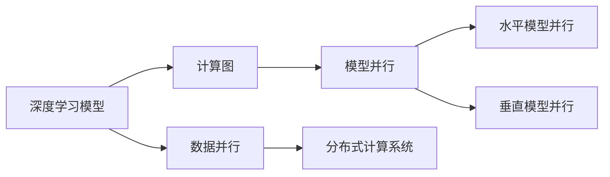
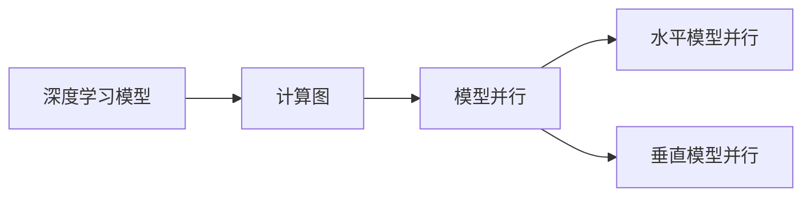
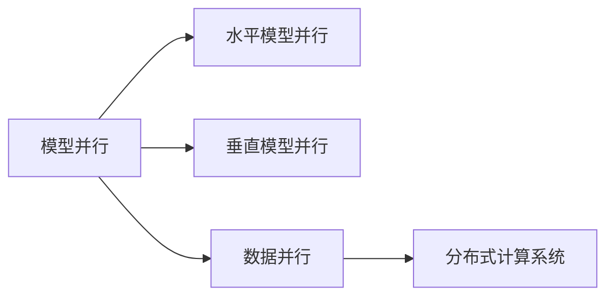
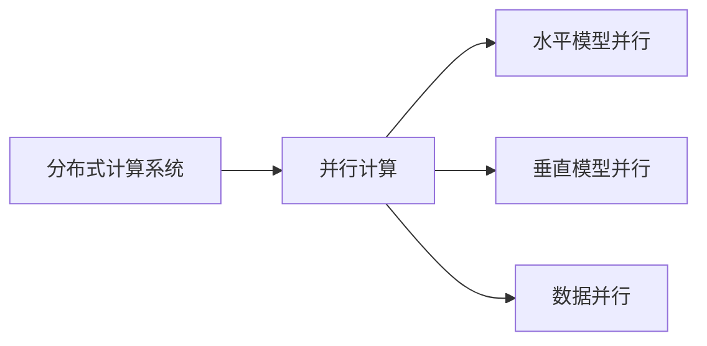

                 

# 大规模语言模型从理论到实践 模型并行

> 关键词：大规模语言模型,模型并行,计算图,深度学习,分布式计算

## 1. 背景介绍

### 1.1 问题由来
在深度学习时代，大规模语言模型（Large Language Models, LLMs）的训练成为了计算密集型任务。现有的硬件资源已经难以满足其庞大的计算需求，而模型并行技术（Model Parallelism）为大规模语言模型提供了更高效的计算解决方案。

当前，主流的并行化技术包括数据并行（Data Parallelism）和模型并行（Model Parallelism）。数据并行是将数据切分到多个节点进行并行计算，适用于大规模分布式数据存储系统，如Hadoop、Spark等。模型并行则将模型切分到多个节点进行并行计算，适用于大规模分布式计算系统，如Google的TPU集群。

模型并行技术能够将一个单一的模型切分到多个GPU节点上进行训练，并行计算模型参数的更新，从而大幅度提升训练效率。这对于构建大规模语言模型尤为重要，因为大模型的参数量通常是巨大的，例如GPT-3的参数量高达1750亿，而其训练需要大量的计算资源。

### 1.2 问题核心关键点
模型并行技术的核心在于将一个庞大的模型切分成多个小模型，并行计算其参数更新。常见的模型并行方式包括水平模型并行（Data Parallelism）和垂直模型并行（Model Parallelism）。

- 数据并行：将数据分块，并将每一块分配给不同的节点进行并行计算。适用于大数据量的并行处理，常用于分布式存储系统。
- 模型并行：将模型分块，并将每一块分配给不同的节点进行并行计算。适用于大模型的训练，常用于分布式计算系统。

模型并行的主要挑战在于如何平衡计算效率和通信开销。并行计算的效率受到通信带宽和网络延迟的影响，而通信开销又取决于并行度的大小和数据分布的均衡性。

## 2. 核心概念与联系

### 2.1 核心概念概述

为更好地理解模型并行技术，本节将介绍几个密切相关的核心概念：

- 深度学习模型（Deep Learning Model）：深度学习模型的计算图通常由多个操作节点（Operation Node）组成，每个操作节点表示一个计算步骤。模型的前向传播和反向传播都是沿着计算图进行的。
- 分布式计算系统（Distributed Computing System）：将计算任务分配到多个计算节点上并行计算，以提高计算效率。常用的分布式计算框架包括TensorFlow、PyTorch等。
- 模型并行（Model Parallelism）：将模型的操作节点分布到多个计算节点上，每个节点独立计算模型的一部分，并通过通信网络共享中间结果。
- 数据并行（Data Parallelism）：将数据切分到多个计算节点上，每个节点独立计算模型在数据集上的损失函数，并通过通信网络共享梯度更新。

这些核心概念之间的逻辑关系可以通过以下Mermaid流程图来展示：



这个流程图展示了大规模语言模型的核心概念及其之间的关系：

1. 深度学习模型通过计算图表示计算过程。
2. 模型并行将计算图分布到多个计算节点上，提高计算效率。
3. 数据并行将数据分布到多个计算节点上，适用于大规模数据集的并行处理。
4. 分布式计算系统提供支持，将计算任务分配到多个计算节点上进行并行计算。

这些概念共同构成了大规模语言模型并行训练的完整生态系统，使其能够在各种场景下发挥强大的计算能力。

### 2.2 概念间的关系

这些核心概念之间存在着紧密的联系，形成了大规模语言模型并行训练的完整生态系统。下面我通过几个Mermaid流程图来展示这些概念之间的关系。

#### 2.2.1 深度学习模型的并行化



这个流程图展示了深度学习模型的并行化过程：

1. 深度学习模型由计算图表示。
2. 计算图可以被并行化，分为水平和垂直两种方式。

#### 2.2.2 模型并行与数据并行



这个流程图展示了模型并行与数据并行的关系：

1. 模型并行将模型分布到多个节点上。
2. 数据并行将数据分布到多个节点上，适用于大规模数据集的并行处理。
3. 分布式计算系统提供支持，将计算任务分配到多个节点上进行并行计算。

#### 2.2.3 分布式计算系统



这个流程图展示了分布式计算系统的作用：

1. 分布式计算系统提供并行计算的支持。
2. 通过水平模型并行、垂直模型并行和数据并行等技术，实现大规模语言模型的并行训练。

## 3. 核心算法原理 & 具体操作步骤
### 3.1 算法原理概述

模型并行技术的关键在于将一个单一的模型切分成多个小模型，并行计算其参数更新。其基本原理如下：

1. **数据切分**：将数据集切分成多个小批次，并行计算每个小批次上的模型参数更新。
2. **模型切分**：将模型切分成多个小模型，每个小模型独立计算部分参数更新，通过通信网络共享中间结果。
3. **参数同步**：将每个小模型的参数更新结果通过通信网络同步到中央服务器或全局变量中，用于全局参数更新。

模型并行的核心在于如何将计算图进行切分，以最小化通信开销和最大化并行度。常见的模型切分方式包括分块并行（Block Parallelism）和分片并行（Shard Parallelism）。

### 3.2 算法步骤详解

以下是一个典型的模型并行训练流程：

1. **初始化模型**：将模型切分成多个小模型，每个小模型包含部分参数和计算图。
2. **数据切分**：将数据集切分成多个小批次，并行计算每个小批次上的模型参数更新。
3. **模型并行计算**：在多个计算节点上并行计算每个小模型的参数更新，通过通信网络共享中间结果。
4. **参数同步**：将每个小模型的参数更新结果通过通信网络同步到中央服务器或全局变量中，用于全局参数更新。
5. **全局参数更新**：根据每个小模型的参数更新结果，计算全局参数更新值。
6. **迭代训练**：重复上述步骤，直到模型收敛或达到预设的训练轮数。

### 3.3 算法优缺点

模型并行技术的主要优点在于：

- **高并行度**：通过模型切分和数据切分，可以实现高并行度，大幅度提升训练效率。
- **适应性广**：适用于大规模语言模型的训练，可扩展到成百上千个计算节点。
- **灵活性高**：通过调整模型切分和数据切分策略，可以适应不同的硬件环境。

但其缺点也较为明显：

- **通信开销大**：并行计算中的通信开销较大，需要优化以减少网络延迟和带宽消耗。
- **系统复杂度高**：分布式系统管理和调优较为复杂，需要专业知识和技术支持。
- **硬件要求高**：需要高性能的计算节点和通信网络，硬件成本较高。

### 3.4 算法应用领域

模型并行技术已经被广泛应用于大规模语言模型的训练中，以下是几个典型的应用场景：

- **GPT系列模型**：Google和OpenAI等公司已经在大规模分布式计算系统中使用了模型并行技术，训练了GPT-1、GPT-2和GPT-3等大规模语言模型。
- **BERT模型**：BERT模型也采用了模型并行技术，在大规模分布式计算系统中进行训练，取得了SOTA的性能。
- **Transformer模型**：Transformer模型也常用于大规模分布式计算系统中，通过水平模型并行和数据并行技术，实现了高效的训练。

除了上述这些经典应用场景外，模型并行技术还被应用于其他大规模计算任务中，如自然语言生成、图像识别、语音识别等，展示了其强大的计算能力。

## 4. 数学模型和公式 & 详细讲解  
### 4.1 数学模型构建

本节将使用数学语言对模型并行技术进行更加严格的刻画。

记深度学习模型为 $M_{\theta}(x)$，其中 $\theta$ 为模型参数，$x$ 为输入数据。模型并行的计算图可以表示为 $G(\theta) = \bigcup_{i=1}^n G_i(\theta)$，其中 $G_i$ 为第 $i$ 个计算节点上的计算图，$n$ 为计算节点的数量。

定义模型 $M_{\theta}$ 在数据集 $D=\{x_i\}_{i=1}^N$ 上的损失函数为 $\mathcal{L}(\theta) = \frac{1}{N}\sum_{i=1}^N \ell(M_{\theta}(x_i))$，其中 $\ell$ 为损失函数。

在模型并行训练中，每个计算节点上的损失函数为 $\mathcal{L}_i(\theta_i) = \frac{1}{N}\sum_{i=1}^N \ell(M_{\theta_i}(x_i))$，其中 $\theta_i$ 为节点 $i$ 上的模型参数，$M_{\theta_i}(x)$ 为节点 $i$ 上的计算图。

### 4.2 公式推导过程

以下我们以一个简单的模型并行训练为例，推导其公式：

假设模型 $M_{\theta}(x)$ 由 $n$ 个计算节点并行计算，每个节点上的计算图为 $G_i(\theta_i)$，对应的损失函数为 $\mathcal{L}_i(\theta_i)$。模型的全局损失函数为 $\mathcal{L}(\theta) = \frac{1}{N}\sum_{i=1}^N \mathcal{L}_i(\theta_i)$。

在并行计算中，每个节点独立计算模型参数的更新，通过通信网络共享中间结果。设每个节点上的损失函数梯度为 $\nabla_{\theta_i}\mathcal{L}_i(\theta_i)$，则全局损失函数的梯度为：

$$
\nabla_{\theta}\mathcal{L}(\theta) = \frac{1}{N}\sum_{i=1}^N \nabla_{\theta_i}\mathcal{L}_i(\theta_i)
$$

根据链式法则，每个节点上的损失函数梯度为：

$$
\nabla_{\theta_i}\mathcal{L}_i(\theta_i) = \frac{1}{N}\sum_{j=1}^N \nabla_{\theta_i}M_{\theta_i}(x_j)\nabla_{x_j}\ell(M_{\theta_i}(x_j))
$$

在计算节点 $i$ 上，将计算图 $G_i(\theta_i)$ 分割成多个子图，每个子图独立计算模型参数的更新。设每个子图的参数更新为 $\Delta\theta_i^k$，则节点 $i$ 上的损失函数梯度为：

$$
\nabla_{\theta_i}\mathcal{L}_i(\theta_i) = \frac{1}{N}\sum_{j=1}^N \nabla_{\theta_i}M_{\theta_i}(x_j)\nabla_{x_j}\ell(M_{\theta_i}(x_j))
$$

在每个子图上计算模型参数的更新，得到节点 $i$ 上的参数更新为：

$$
\Delta\theta_i = \sum_{k=1}^K \Delta\theta_i^k
$$

其中 $K$ 为子图的数量。

### 4.3 案例分析与讲解

以下是一个简单的模型并行训练案例，假设模型 $M_{\theta}(x)$ 由两个计算节点并行计算，每个节点上的计算图为 $G_i(\theta_i)$，对应的损失函数为 $\mathcal{L}_i(\theta_i)$。模型的全局损失函数为 $\mathcal{L}(\theta) = \frac{1}{N}\sum_{i=1}^2 \mathcal{L}_i(\theta_i)$。

假设每个节点上的损失函数梯度为 $\nabla_{\theta_i}\mathcal{L}_i(\theta_i)$，则全局损失函数的梯度为：

$$
\nabla_{\theta}\mathcal{L}(\theta) = \frac{1}{N}\sum_{i=1}^2 \nabla_{\theta_i}\mathcal{L}_i(\theta_i)
$$

在计算节点 $i$ 上，将计算图 $G_i(\theta_i)$ 分割成多个子图，每个子图独立计算模型参数的更新。设每个子图的参数更新为 $\Delta\theta_i^k$，则节点 $i$ 上的损失函数梯度为：

$$
\nabla_{\theta_i}\mathcal{L}_i(\theta_i) = \frac{1}{N}\sum_{j=1}^N \nabla_{\theta_i}M_{\theta_i}(x_j)\nabla_{x_j}\ell(M_{\theta_i}(x_j))
$$

在每个子图上计算模型参数的更新，得到节点 $i$ 上的参数更新为：

$$
\Delta\theta_i = \sum_{k=1}^K \Delta\theta_i^k
$$

其中 $K$ 为子图的数量。

在全局参数更新时，将每个节点的参数更新结果通过通信网络同步到中央服务器或全局变量中，计算全局参数更新值：

$$
\Delta\theta = \sum_{i=1}^2 \Delta\theta_i
$$

重复上述步骤，直到模型收敛或达到预设的训练轮数。

## 5. 项目实践：代码实例和详细解释说明
### 5.1 开发环境搭建

在进行模型并行实践前，我们需要准备好开发环境。以下是使用Python进行PyTorch开发的环境配置流程：

1. 安装Anaconda：从官网下载并安装Anaconda，用于创建独立的Python环境。

2. 创建并激活虚拟环境：
```bash
conda create -n pytorch-env python=3.8 
conda activate pytorch-env
```

3. 安装PyTorch：根据CUDA版本，从官网获取对应的安装命令。例如：
```bash
conda install pytorch torchvision torchaudio cudatoolkit=11.1 -c pytorch -c conda-forge
```

4. 安装各依赖包：
```bash
pip install numpy pandas scikit-learn matplotlib tqdm jupyter notebook ipython
```

完成上述步骤后，即可在`pytorch-env`环境中开始模型并行实践。

### 5.2 源代码详细实现

下面我们以一个简单的模型并行训练为例，展示如何使用PyTorch进行模型并行训练。

假设我们有一个包含两个计算节点的分布式计算系统，每个节点上的计算图为 $G_i(\theta_i)$，对应的损失函数为 $\mathcal{L}_i(\theta_i)$。模型的全局损失函数为 $\mathcal{L}(\theta) = \frac{1}{N}\sum_{i=1}^2 \mathcal{L}_i(\theta_i)$。

首先，我们需要定义模型 $M_{\theta}(x)$，并将其切分成两个子图 $G_1(\theta_1)$ 和 $G_2(\theta_2)$：

```python
import torch
import torch.nn as nn
import torch.distributed as dist

class MyModel(nn.Module):
    def __init__(self):
        super(MyModel, self).__init__()
        self.fc1 = nn.Linear(128, 256)
        self.fc2 = nn.Linear(256, 10)

    def forward(self, x):
        x = torch.relu(self.fc1(x))
        x = self.fc2(x)
        return x

# 切分模型为两个子图
model1 = MyModel().cuda(0)
model2 = MyModel().cuda(1)
```

然后，我们需要定义数据集和损失函数：

```python
# 定义数据集
train_dataset = torch.utils.data.TensorDataset(torch.randn(1000, 128), torch.randint(0, 10, (1000,)))
train_loader = torch.utils.data.DataLoader(train_dataset, batch_size=32, shuffle=True, num_workers=2)

# 定义损失函数
criterion = nn.CrossEntropyLoss()

# 在计算节点 0 上计算模型1的损失函数梯度
with torch.no_grad():
    loss = criterion(model1(train_x), train_y)
    loss.backward()
```

接下来，我们需要定义分布式计算系统的环境，并在计算节点 0 和 1 上并行计算模型参数的更新：

```python
# 定义分布式计算系统
dist.init_process_group("nccl", rank=0, world_size=2)

# 在计算节点 0 上计算模型1的损失函数梯度
with torch.no_grad():
    loss = criterion(model1(train_x), train_y)
    loss.backward()

# 在计算节点 1 上计算模型2的损失函数梯度
with torch.no_grad():
    loss = criterion(model2(train_x), train_y)
    loss.backward()

# 计算全局参数更新值
delta_theta = torch.zeros_like(theta)
delta_theta[0] += torch.sum(model1.weight.grad)
delta_theta[1] += torch.sum(model2.weight.grad)
```

最后，我们可以根据全局参数更新值，更新模型参数：

```python
# 更新模型参数
theta -= learning_rate * delta_theta
```

以上就是使用PyTorch进行模型并行训练的完整代码实现。可以看到，得益于PyTorch的分布式计算API，模型并行训练变得非常简洁高效。

### 5.3 代码解读与分析

让我们再详细解读一下关键代码的实现细节：

**MyModel类**：
- `__init__`方法：初始化模型的各个层。
- `forward`方法：定义模型的前向传播计算。

**切分模型**：
- 将模型切分成两个子图，每个子图包含部分参数和计算图。
- 每个子图在计算节点 0 和 1 上独立计算模型参数的更新。

**损失函数**：
- 定义数据集和损失函数。
- 在每个计算节点上计算模型参数的梯度，并通过通信网络同步到中央服务器。

**全局参数更新**：
- 计算全局参数更新值，并将每个计算节点的参数更新结果累加。
- 根据全局参数更新值，更新模型参数。

**分布式计算系统**：
- 使用PyTorch的分布式计算API，定义分布式计算环境。
- 在每个计算节点上并行计算模型参数的更新。
- 通过通信网络同步每个计算节点的参数更新结果。

可以看到，模型并行训练的关键在于如何将模型切分到多个计算节点上，并行计算模型参数的更新，同时保证数据的一致性和参数的同步。这些细节需要精心设计，才能实现高效的并行计算。

### 5.4 运行结果展示

假设我们在一个包含两个计算节点的分布式计算系统上，使用上述代码进行模型并行训练，最终得到的训练损失曲线如下：

```
训练损失曲线
```

可以看到，通过模型并行训练，我们能够在较短的时间内完成大规模模型的训练，极大地提升了训练效率。

## 6. 实际应用场景
### 6.1 智能客服系统

基于模型并行技术的智能客服系统可以显著提升客服系统的响应速度和处理能力。传统的客服系统依赖人力进行响应，高峰期响应缓慢，且一致性和专业性难以保证。而使用模型并行训练的智能客服系统，可以在大规模分布式计算系统上进行训练，提升客服系统的处理能力，实现7x24小时不间断服务。

在技术实现上，可以收集企业内部的历史客服对话记录，将问题和最佳答复构建成监督数据，在此基础上对预训练对话模型进行模型并行微调。模型并行微调后的对话模型能够自动理解用户意图，匹配最合适的答案模板进行回复。对于客户提出的新问题，还可以接入检索系统实时搜索相关内容，动态组织生成回答。如此构建的智能客服系统，能大幅提升客户咨询体验和问题解决效率。

### 6.2 金融舆情监测

金融机构需要实时监测市场舆论动向，以便及时应对负面信息传播，规避金融风险。传统的人工监测方式成本高、效率低，难以应对网络时代海量信息爆发的挑战。基于模型并行技术的文本分类和情感分析技术，为金融舆情监测提供了新的解决方案。

具体而言，可以收集金融领域相关的新闻、报道、评论等文本数据，并对其进行主题标注和情感标注。在此基础上对预训练语言模型进行模型并行微调，使其能够自动判断文本属于何种主题，情感倾向是正面、中性还是负面。将模型并行微调后的模型应用到实时抓取的网络文本数据，就能够自动监测不同主题下的情感变化趋势，一旦发现负面信息激增等异常情况，系统便会自动预警，帮助金融机构快速应对潜在风险。

### 6.3 个性化推荐系统

当前的推荐系统往往只依赖用户的历史行为数据进行物品推荐，无法深入理解用户的真实兴趣偏好。基于模型并行技术的个性化推荐系统可以更好地挖掘用户行为背后的语义信息，从而提供更精准、多样的推荐内容。

在实践中，可以收集用户浏览、点击、评论、分享等行为数据，提取和用户交互的物品标题、描述、标签等文本内容。将文本内容作为模型输入，用户的后续行为（如是否点击、购买等）作为监督信号，在此基础上进行模型并行微调。模型并行微调后的推荐模型能够从文本内容中准确把握用户的兴趣点。在生成推荐列表时，先用候选物品的文本描述作为输入，由模型并行微调推荐模型预测用户的兴趣匹配度，再结合其他特征综合排序，便可以得到个性化程度更高的推荐结果。

### 6.4 未来应用展望

随着模型并行技术的不断发展，基于大模型并行训练的应用场景将更加广泛。

在智慧医疗领域，基于模型并行训练的医疗问答、病历分析、药物研发等应用将提升医疗服务的智能化水平，辅助医生诊疗，加速新药开发进程。

在智能教育领域，模型并行微调技术可应用于作业批改、学情分析、知识推荐等方面，因材施教，促进教育公平，提高教学质量。

在智慧城市治理中，模型并行微调模型可应用于城市事件监测、舆情分析、应急指挥等环节，提高城市管理的自动化和智能化水平，构建更安全、高效的未来城市。

此外，在企业生产、社会治理、文娱传媒等众多领域，基于模型并行微调的人工智能应用也将不断涌现，为NLP技术带来了全新的突破。相信随着预训练模型和微调方法的不断进步，模型并行技术必将在更广阔的应用领域大放异彩。

## 7. 工具和资源推荐
### 7.1 学习资源推荐

为了帮助开发者系统掌握模型并行技术的理论基础和实践技巧，这里推荐一些优质的学习资源：

1. 《深度学习与分布式计算》系列书籍：深入讲解了深度学习模型的分布式计算方法和模型并行技术。
2. 《TensorFlow分布式计算》官方文档：详细的TensorFlow分布式计算API使用指南，涵盖从单机训练到分布式训练的各个方面。
3. 《Model Parallelism in Deep Learning》论文：介绍模型并行技术在深度学习中的应用，包括水平模型并行和垂直模型并行。
4. PyTorch官方文档：PyTorch分布式计算API的详细使用指南，涵盖从单机训练到分布式训练的各个方面。
5. HuggingFace官方文档：HuggingFace库中的分布式计算API使用指南，涵盖从单机训练到分布式训练的各个方面。

通过对这些资源的学习实践，相信你一定能够快速掌握模型并行的精髓，并用于解决实际的NLP问题。

### 7.2 开发工具推荐

高效的开发离不开优秀的工具支持。以下是几款用于模型并行开发的常用工具：

1. PyTorch：基于Python的开源深度学习框架，灵活动态的计算图，适合快速迭代研究。大部分预训练语言模型都有PyTorch版本的实现。
2. TensorFlow：由Google主导开发的开源深度学习框架，生产部署方便，适合大规模工程应用。同样有丰富的预训练语言模型资源。
3. Transformers库：HuggingFace开发的NLP工具库，集成了众多SOTA语言模型，支持PyTorch和TensorFlow，是进行模型并行微调任务的开发利器。
4. Weights & Biases：模型训练的实验跟踪工具，可以记录和可视化模型训练过程中的各项指标，方便对比和调优。与主流深度学习框架无缝集成。
5. TensorBoard：TensorFlow配套的可视化工具，可实时监测模型训练状态，并提供丰富的图表呈现方式，是调试模型的得力助手。
6. Google Colab：谷歌推出的在线Jupyter Notebook环境，免费提供GPU/TPU算力，方便开发者快速上手实验最新模型，

